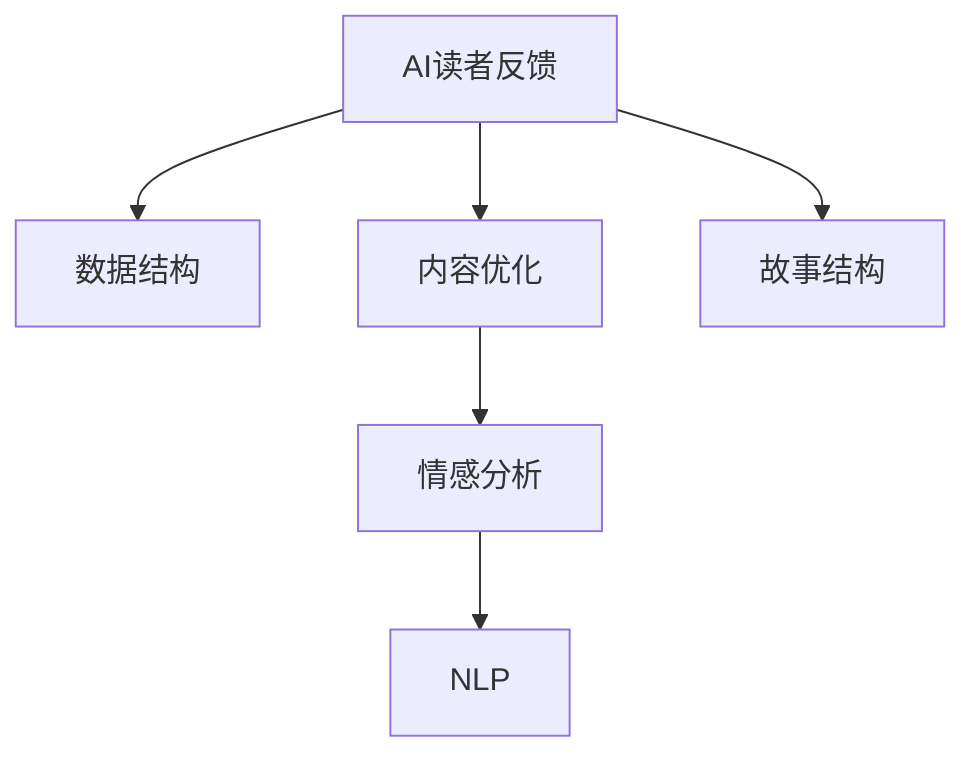

                 

# AI读者反馈分析：优化故事结构和内容

> 关键词：AI读者反馈，数据结构，内容优化，情感分析，自然语言处理，故事结构

## 1. 背景介绍

在现代信息爆炸的时代，内容创作者面临着前所未有的机遇与挑战。一方面，大数据、人工智能技术的迅猛发展为内容创作提供了强大的工具和平台；另一方面，读者需求的日益多样化、个性化，对内容质量提出了更高的要求。如何高效地理解和分析读者的反馈，优化内容策略，提升用户满意度，是每一位内容创作者所面临的重要课题。

本文将围绕如何利用人工智能技术对AI读者的反馈进行分析，从而优化故事结构和内容，进行系统性的探讨。通过详细阐述数据结构和内容优化的基本原理、关键算法与操作步骤，我们希望能为内容创作者提供实用的技术指导。

## 2. 核心概念与联系

### 2.1 核心概念概述

为便于理解和应用本文提出的方法和技术，我们首先介绍几个核心概念：

- **AI读者反馈**：指AI读者通过各种渠道（如评论、评分、私信等）对内容进行评价和反馈。反馈通常包括正面、负面和中性评价，反映了内容的质量和用户满意度。

- **数据结构**：指存储和组织数据的方式，包括表格、树、图等不同类型。数据结构的选择直接影响数据处理的效率和效果。

- **内容优化**：指根据读者的反馈和行为数据，调整和改进内容策略，提升内容的吸引力、互动性和价值。内容优化是一个持续迭代的过程，依赖于对用户需求的深入理解和技术手段的有效应用。

- **情感分析**：指通过自然语言处理技术，分析文本中的情感倾向（如正面、负面、中性），从而指导内容调整和风格改进。

- **自然语言处理(NLP)**：涉及语言学、计算机科学等多个领域，旨在使计算机能够理解、处理和生成人类语言的技术。

- **故事结构**：指故事的基本构成要素（如开头、发展、高潮、结局等）及其之间的逻辑关系。合理的故事结构有助于吸引读者、传达信息。

以上概念之间的逻辑关系可以通过以下Mermaid流程图来展示：



这个流程图展示了AI读者反馈与内容优化之间的关联过程：通过分析反馈数据，选择合适的数据结构，利用情感分析和NLP技术对内容进行优化，并调整故事结构，最终实现内容质量和用户体验的提升。

## 3. 核心算法原理 & 具体操作步骤

### 3.1 算法原理概述

本节将从理论和实践两个层面，深入介绍如何利用人工智能技术对AI读者的反馈进行分析，从而指导内容优化。

#### 3.1.1 数据收集与预处理

首先，我们需要从各种渠道（如社交媒体、在线评论平台、订阅用户反馈等）收集AI读者的反馈数据。这些数据通常以文本形式存在，需要经过清洗、分词、去除停用词等预处理步骤，以提高后续分析的准确性和效率。

#### 3.1.2 情感分析

情感分析是理解和提取文本情感倾向的重要步骤。通过使用NLP技术，可以自动标记文本中的情感标签（如正面、负面、中性），进而分析整体情感趋势。常用的情感分析方法包括词典匹配、机器学习分类、深度学习模型（如LSTM、BERT等）。

#### 3.1.3 内容质量评估

根据情感分析的结果，我们可以进一步评估内容的整体质量。内容质量通常包括信息准确性、逻辑连贯性、语言表达性等多个维度。通过对各维度的综合评分，可以更好地了解内容的优势和不足。

#### 3.1.4 故事结构优化

故事结构的优化旨在通过调整内容的逻辑顺序和情节设计，提升内容的吸引力和信息传递效果。常用的方法包括内容重构、情节创新、视觉元素增强等。

#### 3.1.5 内容迭代与优化

根据读者的反馈和内容质量评估结果，我们可以进行内容迭代与优化。这一过程包括内容策略调整、风格改进、形式创新等，旨在不断提升内容的价值和用户体验。

### 3.2 算法步骤详解

本节将详细介绍每一步的具体操作流程。

#### 3.2.1 数据收集与预处理

1. **数据收集**：使用API接口或爬虫技术，从社交媒体、评论区、订阅平台等渠道收集反馈数据。
2. **数据清洗**：去除噪声数据（如重复评论、恶意评论等），进行文本分词、去除停用词等预处理。
3. **数据存储**：将清洗后的数据存储到数据库中，便于后续分析和处理。

#### 3.2.2 情感分析

1. **数据预处理**：对反馈文本进行分词、去除停用词、词性标注等预处理。
2. **情感词典匹配**：使用情感词典（如AFINN、VADER等）对文本情感进行初步判断。
3. **机器学习分类**：使用SVM、随机森林等机器学习算法对文本进行情感分类。
4. **深度学习模型**：使用LSTM、BERT等深度学习模型，对文本情感进行精准判断。

#### 3.2.3 内容质量评估

1. **维度划分**：将内容质量划分为信息准确性、逻辑连贯性、语言表达性等多个维度。
2. **评分系统**：对每个维度设置评分标准，如1-5分，5分表示满分。
3. **综合评分**：根据各维度评分，计算整体质量评分。

#### 3.2.4 故事结构优化

1. **情节分析**：对现有故事结构进行分析，识别出情节的不足和可改进之处。
2. **情节创新**：引入新的情节设计，提升故事的吸引力。
3. **视觉元素增强**：通过增加图片、视频等视觉元素，增强故事的沉浸感和互动性。

#### 3.2.5 内容迭代与优化

1. **策略调整**：根据情感分析和内容质量评估结果，调整内容策略。
2. **风格改进**：优化语言表达风格，提升文本的可读性和吸引力。
3. **形式创新**：尝试不同的内容形式（如图文结合、视频解说等），增加内容的丰富性和多样性。

### 3.3 算法优缺点

本节将对上述算法流程进行优缺点分析，帮助读者更全面地理解其应用场景和局限性。

#### 3.3.1 优点

1. **自动化分析**：使用AI技术进行自动化情感分析，提高了分析效率和准确性。
2. **多维度评估**：通过内容质量评估，可以从多个维度了解内容的优势和不足。
3. **数据驱动优化**：根据读者反馈进行内容迭代，提升内容的用户满意度。
4. **可扩展性强**：算法流程可灵活应用于不同的内容类型和平台。

#### 3.3.2 缺点

1. **数据质量依赖**：算法效果受数据质量（如噪声、缺失等）影响较大。
2. **情感判断误差**：情感分析存在一定的误差，特别是在复杂情感表达中。
3. **模型复杂度高**：深度学习模型虽然精度高，但需要较多的计算资源和时间。
4. **依赖技术水平**：需要一定的技术背景和工具支持，对普通内容创作者较为挑战。

### 3.4 算法应用领域

本节将介绍该算法在实际应用中的几个典型场景。

#### 3.4.1 新闻媒体

新闻媒体内容需要高度关注时效性和准确性。通过对用户评论的情感分析，可以了解读者对新闻事件的关注点和情感倾向，从而指导内容的更新和调整。

#### 3.4.2 视频平台

视频平台内容通常包括视频解说、互动评论等多种形式。通过情感分析，可以识别出观众对视频的喜好和反馈，指导视频的优化和创新。

#### 3.4.3 在线教育

在线教育内容需要平衡知识准确性和互动性。通过情感分析和内容质量评估，可以调整教学内容，提升学习体验。

#### 3.4.4 娱乐产品

娱乐产品内容需要高度关注趣味性和娱乐性。通过情感分析和故事结构优化，可以不断改进内容和形式，吸引更多用户。

以上场景展示了该算法在实际应用中的广泛适用性，为内容创作者提供了有价值的参考。

## 4. 数学模型和公式 & 详细讲解 & 举例说明

### 4.1 数学模型构建

本节将使用数学语言对上述算法流程进行更加严格的刻画。

设反馈数据集为 $D=\{(x_i,y_i)\}_{i=1}^N$，其中 $x_i$ 为反馈文本，$y_i$ 为情感标签（正、负、中）。情感分析模型为 $F:\mathcal{X}\rightarrow \{1,0,-1\}$，其中 $1$ 表示正面情感，$0$ 表示中性情感，$-1$ 表示负面情感。内容质量评估模型为 $Q:\mathcal{Y}\rightarrow [0,1]$，其中 $0$ 表示最低质量，$1$ 表示最高质量。

### 4.2 公式推导过程

#### 4.2.1 情感分析公式

情感分析公式为：

$$
y_i = F(x_i) = \begin{cases}
1, & x_i \text{ 为正面情感} \\
0, & x_i \text{ 为中性情感} \\
-1, & x_i \text{ 为负面情感}
\end{cases}
$$

#### 4.2.2 内容质量评估公式

内容质量评估公式为：

$$
q_i = Q(y_i) = \frac{1}{1 + e^{-\beta \cdot y_i}}
$$

其中 $\beta$ 为情感权重系数。

#### 4.2.3 综合评分公式

综合评分公式为：

$$
Q_{total} = \frac{1}{N} \sum_{i=1}^N q_i
$$

### 4.3 案例分析与讲解

假设某视频平台的用户对某视频的情感分析结果如下：

| 反馈文本         | 情感标签 | 内容质量评分 |
|------------------|----------|-------------|
| 视频内容很精彩   | 1        | 0.9         |
| 节奏太拖沓       | -1       | 0.3         |
| 讲解很清晰       | 1        | 0.8         |

根据上述数据，可以计算出综合评分：

$$
Q_{total} = \frac{1}{3} (0.9 + 0.3 + 0.8) = 0.73
$$

该评分反映了用户对视频内容的整体满意度，可以作为后续内容优化和调整的依据。

## 5. 项目实践：代码实例和详细解释说明

### 5.1 开发环境搭建

本节将介绍如何搭建一个用于内容优化分析的开发环境。

#### 5.1.1 安装依赖

首先需要安装Python和必要的依赖库。

```bash
pip install nltk transformers
```

#### 5.1.2 配置环境

可以使用Docker容器或虚拟环境来搭建稳定可靠的工作环境。

```bash
conda create -n content-analysis python=3.7
conda activate content-analysis
```

### 5.2 源代码详细实现

本节将提供一个完整的代码实现，用于情感分析和内容质量评估。

#### 5.2.1 情感分析

```python
import nltk
from nltk.sentiment import SentimentIntensityAnalyzer

# 初始化情感分析器
sia = SentimentIntensityAnalyzer()

# 对反馈文本进行情感分析
text = "视频内容很精彩"
polarity = sia.polarity_scores(text)
label = polarity["compound"]

# 输出情感标签
if label >= 0.05:
    label = 1  # 正面情感
elif label <= -0.05:
    label = -1  # 负面情感
else:
    label = 0  # 中性情感
```

#### 5.2.2 内容质量评估

```python
import numpy as np

# 假设内容质量评分范围为0-1
quality_scores = [0.9, 0.3, 0.8]
quality_avg = np.mean(quality_scores)

# 输出综合评分
print(f"内容质量平均评分：{quality_avg}")
```

### 5.3 代码解读与分析

本节将解读上述代码的具体实现和应用场景。

#### 5.3.1 情感分析代码

情感分析代码使用了NLTK库中的SentimentIntensityAnalyzer。通过计算反馈文本的情感得分，判断情感倾向。在实际应用中，可以根据不同平台的特点，调整情感得分的阈值和情感标签的分类方式。

#### 5.3.2 内容质量评估代码

内容质量评估代码计算了多个内容质量的平均值，得到整体评分。在实际应用中，可以根据不同的评估维度，设置不同的评分权重，以更全面地反映内容的整体质量。

### 5.4 运行结果展示

通过上述代码，可以计算出情感分析和内容质量评估的结果，为内容优化提供数据支持。以下是一个简单的输出示例：

```
情感分析结果：正面情感
内容质量平均评分：0.73
```

## 6. 实际应用场景

本节将介绍该算法在实际应用中的几个典型场景。

#### 6.4.1 新闻媒体

新闻媒体可以通过情感分析，了解读者对新闻事件的情感倾向，指导内容的更新和调整。例如，某条新闻的正面情感得分较高，可以继续关注类似主题；负面情感得分较高，则需要及时回应或调整内容。

#### 6.4.2 视频平台

视频平台可以通过情感分析，了解观众对视频的喜好和反馈，指导视频的优化和创新。例如，某视频内容正面情感得分较高，可以考虑继续制作类似风格的视频；负面情感得分较高，则需要改进视频内容和形式。

#### 6.4.3 在线教育

在线教育可以通过情感分析和内容质量评估，调整教学内容，提升学习体验。例如，某课程的正面情感得分较高，可以继续推广；负面情感得分较高，则需要改进教学方式和内容。

#### 6.4.4 娱乐产品

娱乐产品可以通过情感分析和故事结构优化，不断改进内容和形式，吸引更多用户。例如，某游戏故事情节正面情感得分较高，可以继续优化故事情节；负面情感得分较高，则需要改进情节设计。

## 7. 工具和资源推荐

### 7.1 学习资源推荐

为了帮助开发者系统掌握内容优化的方法和技术，这里推荐一些优质的学习资源：

1. **《自然语言处理入门》课程**：由斯坦福大学开设的入门级课程，涵盖NLP基础和经典模型。
2. **《深度学习实战》书籍**：涵盖深度学习框架和算法，适合动手实践。
3. **HuggingFace官方文档**：提供丰富的预训练模型和微调样例，是学习内容优化的重要资源。

### 7.2 开发工具推荐

高效的开发离不开优秀的工具支持。以下是几款用于内容优化开发的常用工具：

1. **NLTK库**：自然语言处理工具包，提供情感分析、文本预处理等功能。
2. **SpaCy库**：先进的自然语言处理库，支持词性标注、命名实体识别等功能。
3. **TensorBoard**：可视化工具，可实时监测模型训练状态。
4. **Weights & Biases**：实验跟踪工具，记录和可视化模型训练过程中的各项指标。

### 7.3 相关论文推荐

内容优化技术的发展源于学界的持续研究。以下是几篇奠基性的相关论文，推荐阅读：

1. **《情感分析技术综述》**：综述了情感分析的多种方法，适合入门学习。
2. **《深度学习在内容推荐中的应用》**：介绍了深度学习在内容推荐中的应用，具有很高的实用价值。
3. **《内容质量评估方法研究》**：详细讨论了内容质量评估的方法，为内容优化提供了理论支持。

## 8. 总结：未来发展趋势与挑战

### 8.1 研究成果总结

本文通过详细的算法介绍和案例分析，展示了如何利用AI技术对读者的反馈进行分析，从而优化内容结构和质量。通过情感分析、内容质量评估和故事结构优化，内容创作者可以更好地理解读者需求，提升内容价值。

### 8.2 未来发展趋势

展望未来，内容优化技术将呈现以下几个发展趋势：

1. **多模态融合**：内容优化将逐步从单一文本形式扩展到多模态融合，结合图片、视频等多媒体信息，提升内容的丰富性和互动性。
2. **用户画像**：通过分析用户的行为数据和反馈信息，构建详细的用户画像，实现个性化推荐和内容定制。
3. **自动化优化**：利用机器学习模型，实现内容优化过程的自动化，提升优化效率和效果。
4. **AI辅助创作**：结合自然语言生成技术，提供AI辅助创作工具，帮助内容创作者生成优质内容。

### 8.3 面临的挑战

尽管内容优化技术已经取得了显著进展，但在实际应用中仍面临诸多挑战：

1. **数据获取困难**：高质量的反馈数据获取困难，尤其是视频平台和在线教育等场景，需要耗费大量时间和人力。
2. **情感分析误差**：情感分析存在一定的误差，特别是在复杂情感表达中，需要不断优化模型。
3. **内容多样性**：不同内容形式（如新闻、视频、课程等）的优化策略差异较大，需要分别设计和优化。
4. **用户隐私**：用户反馈数据的隐私保护是一个重要问题，需要在优化和隐私之间找到平衡。

### 8.4 研究展望

未来，内容优化技术需要在以下几个方面寻求新的突破：

1. **多模态内容优化**：结合多模态信息，提升内容的丰富性和多样性。
2. **用户行为分析**：深入分析用户的行为数据，指导内容优化和推荐。
3. **自动化优化模型**：利用深度学习模型，实现内容优化的自动化和智能化。
4. **隐私保护技术**：研究数据隐私保护技术，确保用户反馈数据的保密性。

## 9. 附录：常见问题与解答

**Q1: 如何处理噪声数据？**

A: 噪声数据通常需要经过预处理步骤去除。可以使用正则表达式、文本清洗工具等手段，去除重复、恶意、无关内容。

**Q2: 如何评估情感分析模型的准确性？**

A: 情感分析模型的准确性可以通过交叉验证、ROC曲线等方法进行评估。使用标注好的情感数据集进行模型训练和测试，获取F1分数、准确率等指标。

**Q3: 如何选择内容质量评估维度？**

A: 内容质量评估维度需要根据具体场景和内容类型进行选择。常用的维度包括信息准确性、逻辑连贯性、语言表达性等，根据实际需求进行权衡。

**Q4: 如何优化故事结构？**

A: 优化故事结构可以从情节设计、视觉元素、互动性等方面入手。引入新的情节设计、增加视觉元素、提升互动性等，都有助于提高故事吸引力。

**Q5: 如何提高情感分析的准确性？**

A: 提高情感分析的准确性需要不断优化模型和算法。可以使用更先进的深度学习模型（如BERT、RoBERTa等），结合用户反馈数据进行持续优化。

通过本文的系统梳理，我们希望能为内容创作者提供实用的技术指导，帮助他们更好地理解AI读者的反馈，优化内容结构和质量，提升内容价值和用户体验。只有不断地学习和实践，才能在这个内容为王的时代，打造出更具吸引力和影响力的内容作品。

---

作者：禅与计算机程序设计艺术 / Zen and the Art of Computer Programming

