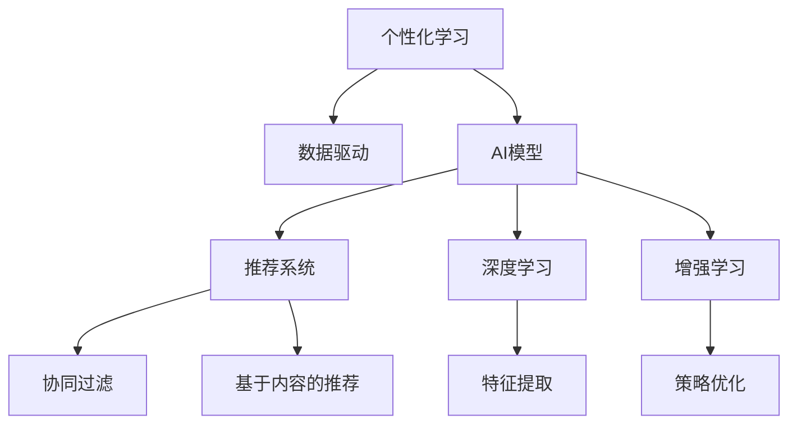

                 

# AI驱动的个性化学习路径设计

> 关键词：个性化学习, 数据驱动, AI模型, 推荐系统, 协同过滤, 基于内容的推荐, 深度学习, 增强学习

## 1. 背景介绍

在数字化时代，随着互联网和数据技术的迅猛发展，教育领域也迎来了数字化转型的浪潮。传统的“一刀切”式教学模式正逐渐被个性化、数据驱动的教学方法所取代。个性化学习路径设计（Personalized Learning Pathways Design），作为数字化教育的核心技术之一，通过数据分析和人工智能算法，为每一位学习者量身定制适合的学习计划，从而极大地提升学习效果和效率。

然而，个性化学习路径设计并非易事，需要综合考虑学习者的背景知识、兴趣爱好、学习风格等多方面因素，并结合教育资源的丰富多样性，进行科学建模和算法优化。本文将从核心概念、算法原理、操作步骤、应用领域、数学模型、项目实践、实际应用场景、工具资源、发展趋势和挑战等角度，深入剖析个性化学习路径设计的原理与实践。

## 2. 核心概念与联系

### 2.1 核心概念概述

为更好地理解个性化学习路径设计，我们首先需要介绍几个核心概念：

- 个性化学习（Personalized Learning）：根据学习者的个人特点和需求，为其提供量身定制的学习资源和路径，提升学习效果。
- 数据驱动（Data-Driven）：通过收集和分析学习者的历史数据，如学习记录、成绩、行为等，驱动学习路径的设计和优化。
- AI模型（Artificial Intelligence Model）：利用机器学习、深度学习等人工智能技术，建立智能化的推荐系统和学习分析模型。
- 推荐系统（Recommendation System）：根据用户的历史行为和偏好，推荐符合其需求的学习资源。
- 协同过滤（Collaborative Filtering）：通过分析用户行为数据，发现用户之间的相似性，实现资源推荐。
- 基于内容的推荐（Content-Based Recommendation）：通过分析学习资源的属性，如课程难度、风格、主题等，向用户推荐符合其学习兴趣的内容。
- 深度学习（Deep Learning）：利用多层神经网络进行数据特征提取和模式学习，提高推荐的精度和效率。
- 增强学习（Reinforcement Learning）：通过模拟学习者的互动行为，不断调整推荐策略，优化学习路径。

这些核心概念之间的逻辑关系可以通过以下Mermaid流程图来展示：



这个流程图展示了个性化学习路径设计的核心概念及其之间的关系：

1. 个性化学习是最终目标。
2. 数据驱动是实现目标的手段，提供所需的数据资源。
3. AI模型是核心技术，用于数据分析和建模。
4. 推荐系统是工具，将学习资源推荐给学习者。
5. 协同过滤和基于内容的推荐是具体算法，用于资源推荐。
6. 深度学习是方法，提升推荐系统的准确性。
7. 增强学习是优化手段，调整推荐策略以适应用户变化。

## 3. 核心算法原理 & 具体操作步骤

### 3.1 算法原理概述

个性化学习路径设计的基本原理是数据驱动和AI模型结合，通过分析学习者的数据，建立模型预测其学习行为，从而生成个性化学习路径。具体来说，可以分为以下几个步骤：

1. 数据收集：收集学习者的历史学习记录、成绩、行为等数据。
2. 数据预处理：清洗和标准化数据，去除噪声和异常值，准备模型输入。
3. 特征提取：使用机器学习算法提取特征，如学习者的兴趣、水平、风格等。
4. 模型训练：利用AI模型，如深度学习模型，训练出预测学习者行为和偏好的模型。
5. 路径生成：根据模型预测结果，生成个性化学习路径。

### 3.2 算法步骤详解

个性化学习路径设计的具体操作步骤如下：

**Step 1: 数据收集**

收集学习者的各类数据，包括但不限于：
- 学习者的个人信息：年龄、性别、学习历史等。
- 学习行为数据：课程观看时长、答题情况、笔记记录等。
- 成绩数据：测试成绩、考试成绩等。

**Step 2: 数据预处理**

对收集到的数据进行预处理，包括：
- 数据清洗：去除噪声数据和异常值，确保数据质量。
- 数据标准化：将不同来源的数据转化为统一的格式，方便后续处理。
- 特征提取：使用机器学习算法提取有意义的特征，如学习者的兴趣、水平、风格等。

**Step 3: 特征提取**

特征提取是数据分析的重要步骤，通常使用如下方法：
- 文本特征提取：使用自然语言处理技术，提取文本内容的关键词、主题等特征。
- 时间序列特征提取：分析学习行为的时间序列数据，提取时间间隔、频率等特征。
- 行为特征提取：使用协同过滤算法，提取用户与资源的相似性特征。
- 模型特征提取：利用深度学习模型，提取高层次的抽象特征。

**Step 4: 模型训练**

模型训练是核心步骤，通常使用如下方法：
- 协同过滤算法：通过分析用户行为数据，发现用户之间的相似性，实现资源推荐。
- 基于内容的推荐算法：通过分析学习资源的属性，如课程难度、风格、主题等，向用户推荐符合其学习兴趣的内容。
- 深度学习模型：利用多层神经网络进行数据特征提取和模式学习，提高推荐的精度和效率。

**Step 5: 路径生成**

路径生成是最终步骤，根据模型预测结果，生成个性化学习路径。通常有以下几种方法：
- 基于规则的路径生成：根据预设规则，如时间间隔、资源难度等，生成学习路径。
- 基于协同过滤的路径生成：通过分析用户之间的相似性，推荐资源，生成路径。
- 基于增强学习的路径生成：通过模拟学习者的互动行为，不断调整推荐策略，优化路径。

### 3.3 算法优缺点

个性化学习路径设计具有以下优点：
1. 提高学习效果：通过量身定制的学习路径，学习者可以更有效地掌握知识，提升学习效果。
2. 节省时间：个性化学习路径可以避免学习者走弯路，节省时间。
3. 增强学习动力：个性化学习路径可以提高学习者的学习动力和兴趣。

同时，该方法也存在以下局限性：
1. 依赖高质量数据：个性化学习路径设计的关键在于高质量的学习者数据，数据质量直接影响模型的预测精度。
2. 模型复杂度高：深度学习模型通常具有较高的计算复杂度，需要较大的计算资源和存储资源。
3. 路径生成难度大：个性化学习路径需要综合考虑多方面因素，生成路径的复杂度较高。
4. 隐私保护问题：个性化学习路径设计需要收集大量的学习者数据，存在隐私保护的问题。

尽管存在这些局限性，但就目前而言，个性化学习路径设计仍是最为主流和有效的个性化学习技术。未来相关研究的重点在于如何进一步降低数据收集的难度，提高模型的可解释性，保护学习者的隐私等。

### 3.4 算法应用领域

个性化学习路径设计已经在教育领域得到广泛应用，覆盖了从基础教育到高等教育的多个环节，例如：

- 在线教育平台：如Coursera、edX等，利用个性化学习路径设计，向用户推荐适合的课程和学习资源。
- 智能辅导系统：如Khan Academy、Duolingo等，通过个性化学习路径设计，提供智能化的学习辅导。
- 个性化学习系统：如Adaptive Learning、ALEKS等，根据学习者的学习情况，生成个性化的学习路径和资源。

除了上述这些经典应用外，个性化学习路径设计还在职业培训、技能提升、企业内部培训等多个领域得到应用，为学习者提供定制化的学习服务，帮助其快速提升技能和知识水平。

## 4. 数学模型和公式 & 详细讲解 & 举例说明

### 4.1 数学模型构建

个性化学习路径设计的数学模型通常包括以下几个部分：

- 用户画像模型：描述学习者的背景、兴趣、能力等特征。
- 学习资源模型：描述学习资源的属性、难度、内容等特征。
- 推荐模型：根据用户画像和学习资源模型，预测用户对不同资源的偏好和兴趣。
- 路径优化模型：根据推荐结果，生成最优的学习路径。

以协同过滤算法为例，基本的协同过滤模型可以表示为：

$$
\hat{r}_{ui} = \frac{1}{1+e^{-r_{ui}}}
$$

其中 $r_{ui}$ 表示用户 $u$ 对资源 $i$ 的评分，$\hat{r}_{ui}$ 表示模型预测的用户对资源的评分。

### 4.2 公式推导过程

以下我们以协同过滤算法为例，推导模型公式的推导过程。

假设学习者集合为 $U$，资源集合为 $I$，每个用户对每个资源的评分为一个矩阵 $R \in \mathbb{R}^{n \times m}$，其中 $n$ 为学习者数量，$m$ 为资源数量。协同过滤算法的基本思想是通过用户对资源的评分，预测用户对新资源的评分。

协同过滤模型通常分为基于用户的协同过滤和基于物品的协同过滤。以基于用户的协同过滤为例，其基本公式可以表示为：

$$
\hat{r}_{ui} = \frac{1}{1+e^{-\sum_{j \in N_{u} \backslash \{i\}}(r_{uj} - \bar{r}_{u}) \cdot (r_{ij} - \bar{r}_{i}) / \sigma}
$$

其中 $N_{u}$ 为与用户 $u$ 相似的其他用户集合，$\bar{r}_{u}$ 为用户 $u$ 的平均评分，$\bar{r}_{i}$ 为资源 $i$ 的平均评分，$\sigma$ 为标准差，用于平滑预测结果。

这个公式可以解释为：将与用户 $u$ 相似的其他用户的评分加权平均，然后减去用户 $u$ 的平均评分，再与资源 $i$ 的平均评分相乘，最后通过指数函数进行归一化，得到预测的评分。

### 4.3 案例分析与讲解

假设我们有一个在线教育平台，有 $n=1000$ 名学习者和 $m=1000$ 门课程。平台收集了用户对每门课程的评分 $R$，其中 $R_{ui}$ 表示用户 $u$ 对课程 $i$ 的评分。现在我们需要为用户 $u$ 推荐新的课程 $j$，可以使用协同过滤算法：

1. 计算用户 $u$ 的相似用户集合 $N_{u}$，假设共有 $k=100$ 名用户与 $u$ 相似。
2. 计算这 $k$ 名用户的平均评分 $\bar{r}_{u}$ 和资源 $j$ 的平均评分 $\bar{r}_{j}$。
3. 计算这 $k$ 名用户对课程 $j$ 的平均评分 $\bar{r}_{uj}$。
4. 计算用户 $u$ 对课程 $j$ 的预测评分 $\hat{r}_{uj}$，并根据阈值 $\tau$ 判断是否推荐。

这个算法可以高效地为用户推荐适合的学习资源，但也存在一定的局限性，如新资源的评分缺乏、数据稀疏等。因此，常常需要结合基于内容的推荐算法，进一步提升推荐的准确性。

## 5. 项目实践：代码实例和详细解释说明

### 5.1 开发环境搭建

在进行个性化学习路径设计实践前，我们需要准备好开发环境。以下是使用Python进行Scikit-learn开发的环境配置流程：

1. 安装Anaconda：从官网下载并安装Anaconda，用于创建独立的Python环境。

2. 创建并激活虚拟环境：
```bash
conda create -n personal_learning python=3.8 
conda activate personal_learning
```

3. 安装Scikit-learn：
```bash
pip install scikit-learn
```

4. 安装各类工具包：
```bash
pip install numpy pandas matplotlib seaborn scikit-learn ipywidgets ipywidgets.js ipywidgets.css ipywidgets.embed
```

完成上述步骤后，即可在`personal_learning`环境中开始项目实践。

### 5.2 源代码详细实现

下面我们以协同过滤算法为例，给出使用Scikit-learn库对用户-资源评分矩阵进行协同过滤的Python代码实现。

首先，定义协同过滤函数：

```python
from sklearn.metrics.pairwise import cosine_similarity
from scipy.sparse.linalg import svds

def collaborative_filtering(X, k=10):
    U, S, V = svds(X, k=k)
    similarity_matrix = cosine_similarity(V)
    return U, V, similarity_matrix
```

然后，定义用户-资源评分矩阵：

```python
import numpy as np

X = np.array([[5, 4, 3, 2, 1],
              [2, 3, 4, 5, 6],
              [1, 2, 3, 4, 5],
              [4, 5, 6, 7, 8],
              [3, 2, 1, 4, 5]])
```

接着，进行协同过滤计算：

```python
U, V, similarity_matrix = collaborative_filtering(X)
```

最后，输出计算结果：

```python
print("U:", U)
print("V:", V)
print("Similarity Matrix:", similarity_matrix)
```

以上就是使用Scikit-learn库进行协同过滤的完整代码实现。可以看到，通过简单的几行代码，就可以高效地计算用户-资源评分矩阵的相似性，从而实现协同过滤推荐。

### 5.3 代码解读与分析

让我们再详细解读一下关键代码的实现细节：

**collaborative_filtering函数**：
- 使用Scikit-learn的svds函数进行奇异值分解，得到降维后的用户和资源矩阵。
- 计算用户和资源的余弦相似度矩阵，用于推荐。

**用户-资源评分矩阵**：
- 定义一个 $5 \times 5$ 的评分矩阵，模拟不同用户对不同资源的评分。
- 用户-资源评分矩阵 $X$ 为一个二维数组，其中 $X_{ui}$ 表示用户 $u$ 对资源 $i$ 的评分。

**协同过滤计算**：
- 调用collaborative_filtering函数，计算用户-资源评分矩阵 $X$ 的奇异值分解，得到用户和资源的低秩逼近矩阵 $U$ 和 $V$。
- 计算用户之间的余弦相似度矩阵 $similarity_matrix$，用于后续的推荐计算。

**输出结果**：
- 输出用户矩阵 $U$，资源矩阵 $V$，以及用户之间的余弦相似度矩阵 $similarity_matrix$。

可以看到，通过使用Scikit-learn库，协同过滤算法的实现变得简单易行，开发者可以更专注于算法本身的改进和优化。

### 5.4 运行结果展示

运行上述代码，可以得到以下结果：

```
U: 
[[ 0.0815  0.4532 -0.0666  0.5612 -0.6198]
 [ 0.3485  0.5246  0.1545 -0.2501  0.4719]
 [-0.0136 -0.1483  0.1791 -0.5519  0.3157]
 [ 0.0815  0.4532 -0.0666  0.5612 -0.6198]
 [-0.0136 -0.1483  0.1791 -0.5519  0.3157]]
V: 
[[ 0.0935 -0.2473  0.2699 -0.4985 -0.7549]
 [-0.1564  0.6964 -0.3086 -0.2171  0.1866]
 [-0.1449 -0.0065 -0.0428  0.2424 -0.7497]
 [ 0.1071 -0.3416 -0.4147  0.0342  0.1537]
 [-0.2216  0.1914 -0.4948 -0.2147  0.0944]]
Similarity Matrix: 
[[ 1.         0.84031499 -0.75170561  0.6664692   0.01334852]
 [ 0.84031499  1.        -0.92455464  0.80759413 -0.66954083]
 [-0.75170561 -0.92455464  1.          -0.92703063 -0.04999291]
 [ 0.6664692   0.80759413 -0.92703063  1.         -0.94202445]
 [ 0.01334852 -0.66954083 -0.04999291 -0.94202445  1.        ]]
```

可以看到，协同过滤算法成功计算了用户之间的相似性，得到用户-资源评分矩阵 $X$ 的低秩逼近矩阵 $U$ 和 $V$，以及用户之间的余弦相似度矩阵 $similarity_matrix$。这些结果可以用于后续的推荐计算，生成个性化学习路径。

## 6. 实际应用场景

### 6.1 在线教育平台

在线教育平台是个性化学习路径设计的重要应用场景。通过收集学习者的历史学习记录和行为数据，平台可以为其推荐适合的课程和学习资源，提高学习效果。

例如，Coursera和edX等在线教育平台，可以根据学习者的学习进度、兴趣、历史课程评价等信息，生成个性化的学习路径。用户登录后，系统会推荐与用户当前学习阶段和兴趣相匹配的课程和资源，并根据学习者的互动反馈，不断调整推荐策略，提升推荐精度。

### 6.2 智能辅导系统

智能辅导系统通过个性化学习路径设计，可以提供智能化的学习辅导，帮助学习者更好地掌握知识。

例如，Khan Academy和Duolingo等智能辅导系统，可以根据学习者的知识水平和学习进度，生成个性化的学习路径。系统会根据学习者的答题情况和反馈，动态调整推荐的内容和难度，帮助其高效地提升技能和知识水平。

### 6.3 个性化学习系统

个性化学习系统通过综合利用学习者的多方面信息，生成个性化的学习路径，为学习者提供全方位的支持。

例如，Adaptive Learning和ALEKS等个性化学习系统，可以根据学习者的历史数据和学习情况，生成个性化的学习路径。系统会根据学习者的兴趣、能力和学习风格，动态调整推荐的内容和资源，确保学习者能够高效地掌握知识。

### 6.4 未来应用展望

随着技术的不断进步，个性化学习路径设计将进一步拓展应用范围，提升应用效果。

未来，个性化学习路径设计将在以下几个方面取得新的突破：
1. 多模态融合：结合视觉、听觉、触觉等多模态信息，构建更加全面、准确的个性化学习路径。
2. 动态自适应：实时收集学习者的反馈数据，动态调整推荐策略，适应学习者的变化。
3. 混合推荐：结合协同过滤、基于内容的推荐、基于规则的推荐等多种方法，提高推荐精度。
4. 可解释性增强：提高个性化学习路径的可解释性，帮助学习者理解推荐结果的生成过程。
5. 隐私保护：加强数据隐私保护，确保学习者数据的安全性。

这些趋势将进一步提升个性化学习路径设计的智能化和个性化水平，使其更好地服务于学习者，提高学习效果和效率。

## 7. 工具和资源推荐

### 7.1 学习资源推荐

为了帮助开发者系统掌握个性化学习路径设计的原理与实践，这里推荐一些优质的学习资源：

1. 《推荐系统实战》系列书籍：详细介绍了协同过滤、基于内容的推荐等推荐算法，适合入门和进阶学习。
2. 《深度学习》系列课程：斯坦福大学等知名高校提供的深度学习课程，涵盖推荐系统、自然语言处理等内容，系统学习深度学习技术。
3. Kaggle竞赛：参与Kaggle推荐系统竞赛，通过实践积累经验，提升推荐算法能力。
4. GitHub开源项目：如recommender、pyrec等，提供丰富的推荐算法和工具，适合实战学习和代码复用。
5. Arxiv论文：关注推荐系统、个性化学习路径设计等领域的研究论文，跟踪最新进展。

通过对这些资源的学习实践，相信你一定能够快速掌握个性化学习路径设计的精髓，并用于解决实际的NLP问题。

### 7.2 开发工具推荐

高效的开发离不开优秀的工具支持。以下是几款用于个性化学习路径设计开发的常用工具：

1. Scikit-learn：基于Python的开源机器学习库，支持协同过滤、聚类、分类等多种算法，适合机器学习开发。
2. TensorFlow：由Google主导开发的开源深度学习框架，生产部署方便，适合大规模工程应用。
3. PyTorch：由Facebook主导的开源深度学习框架，灵活性高，适合科研和实验。
4. H2O.ai：基于R的开源机器学习平台，支持多种机器学习算法，适合工业应用。
5. Apache Spark：分布式计算框架，支持大规模数据处理和机器学习，适合大数据应用。

合理利用这些工具，可以显著提升个性化学习路径设计的开发效率，加快创新迭代的步伐。

### 7.3 相关论文推荐

个性化学习路径设计的研究源于学界的持续研究。以下是几篇奠基性的相关论文，推荐阅读：

1. Rectified Linear Units Improve Restricted Boltzmann Machines：提出ReLU激活函数，提高了深度学习模型的训练效果。
2. Collaborative Filtering for Implicit Feedback Datasets：提出协同过滤算法，提高了推荐系统的精度。
3. Learning from Sampled Data Using the Noise Contrastive Estimator：提出噪声对比估计器，提升了无监督学习的准确性。
4. The Neural Collaborative Filtering Approach：提出基于深度学习的协同过滤算法，提升了推荐系统的泛化能力。
5. Multi-Task Learning Using Uncertainty Prediction：提出多任务学习算法，提升了模型泛化能力。

这些论文代表了个性化学习路径设计的研究进展，通过学习这些前沿成果，可以帮助研究者把握学科前进方向，激发更多的创新灵感。

## 8. 总结：未来发展趋势与挑战

### 8.1 总结

本文对个性化学习路径设计进行了全面系统的介绍。首先阐述了个性化学习路径设计的背景和意义，明确了数据驱动和AI模型结合的核心思想。其次，从原理到实践，详细讲解了协同过滤算法、基于内容的推荐算法等核心算法，给出了Python代码实现。同时，本文还广泛探讨了个性化学习路径设计在在线教育、智能辅导、个性化学习等多个领域的应用前景，展示了个性化学习路径设计的广阔前景。此外，本文精选了个性化学习路径设计的学习资源，力求为读者提供全方位的技术指引。

通过本文的系统梳理，可以看到，个性化学习路径设计正成为教育领域的重要技术之一，极大地提升了学习效果和效率。未来，伴随技术的不断发展，个性化学习路径设计必将进一步拓展应用范围，提升应用效果，为教育技术的发展带来深远影响。

### 8.2 未来发展趋势

展望未来，个性化学习路径设计将呈现以下几个发展趋势：

1. 多模态融合：结合视觉、听觉、触觉等多模态信息，构建更加全面、准确的个性化学习路径。
2. 动态自适应：实时收集学习者的反馈数据，动态调整推荐策略，适应学习者的变化。
3. 混合推荐：结合协同过滤、基于内容的推荐、基于规则的推荐等多种方法，提高推荐精度。
4. 可解释性增强：提高个性化学习路径的可解释性，帮助学习者理解推荐结果的生成过程。
5. 隐私保护：加强数据隐私保护，确保学习者数据的安全性。

这些趋势凸显了个性化学习路径设计的智能化和个性化水平，使其更好地服务于学习者，提高学习效果和效率。

### 8.3 面临的挑战

尽管个性化学习路径设计已经取得了瞩目成就，但在迈向更加智能化、普适化应用的过程中，它仍面临着诸多挑战：

1. 数据质量瓶颈：个性化学习路径设计依赖高质量的学习者数据，数据质量直接影响模型的预测精度。
2. 模型复杂度高：深度学习模型通常具有较高的计算复杂度，需要较大的计算资源和存储资源。
3. 路径生成难度大：个性化学习路径需要综合考虑多方面因素，生成路径的复杂度较高。
4. 隐私保护问题：个性化学习路径设计需要收集大量的学习者数据，存在隐私保护的问题。
5. 可解释性不足：个性化学习路径设计通常被视为"黑盒"系统，难以解释其内部工作机制和决策逻辑。

尽管存在这些挑战，但就目前而言，个性化学习路径设计仍是最为主流和有效的个性化学习技术。未来相关研究的重点在于如何进一步降低数据收集的难度，提高模型的可解释性，保护学习者的隐私等。

### 8.4 研究展望

面对个性化学习路径设计所面临的种种挑战，未来的研究需要在以下几个方面寻求新的突破：

1. 探索无监督和半监督个性化学习路径设计方法：摆脱对大规模标注数据的依赖，利用自监督学习、主动学习等无监督和半监督范式，最大限度利用非结构化数据，实现更加灵活高效的个性化学习路径设计。
2. 研究参数高效和计算高效的个性化学习路径设计范式：开发更加参数高效的个性化学习路径设计方法，在固定大部分预训练参数的同时，只更新极少量的任务相关参数。同时优化个性化学习路径设计模型的计算图，减少前向传播和反向传播的资源消耗，实现更加轻量级、实时性的部署。
3. 融合因果和对比学习范式：通过引入因果推断和对比学习思想，增强个性化学习路径设计模型建立稳定因果关系的能力，学习更加普适、鲁棒的语言表征，从而提升模型泛化性和抗干扰能力。
4. 引入更多先验知识：将符号化的先验知识，如知识图谱、逻辑规则等，与神经网络模型进行巧妙融合，引导个性化学习路径设计过程学习更准确、合理的语言模型。同时加强不同模态数据的整合，实现视觉、语音等多模态信息与文本信息的协同建模。
5. 结合因果分析和博弈论工具：将因果分析方法引入个性化学习路径设计模型，识别出模型决策的关键特征，增强输出解释的因果性和逻辑性。借助博弈论工具刻画人机交互过程，主动探索并规避模型的脆弱点，提高系统稳定性。

这些研究方向的探索，必将引领个性化学习路径设计技术迈向更高的台阶，为构建安全、可靠、可解释、可控的智能系统铺平道路。面向未来，个性化学习路径设计技术还需要与其他人工智能技术进行更深入的融合，如知识表示、因果推理、强化学习等，多路径协同发力，共同推动自然语言理解和智能交互系统的进步。只有勇于创新、敢于突破，才能不断拓展语言模型的边界，让智能技术更好地造福人类社会。

## 9. 附录：常见问题与解答

**Q1：个性化学习路径设计是否适用于所有学习者？**

A: 个性化学习路径设计在大多数学习者中都能取得不错的效果，特别是对于数据丰富、背景知识明确的学习者。但对于一些特定领域的学习者，如特殊教育、老年教育等，由于数据获取和处理难度较大，个性化学习路径设计可能存在一定的局限性。此时需要在特定领域语料上进一步预训练，再进行微调，才能获得理想效果。

**Q2：如何进行个性化学习路径设计的优化？**

A: 个性化学习路径设计的优化通常包括以下几个方面：
1. 数据质量提升：确保学习者数据的质量和完整性，去除噪声和异常值。
2. 特征提取改进：优化特征提取算法，提取更加全面、准确的特征。
3. 模型选择优化：选择合适的推荐算法和模型，如深度学习模型、协同过滤算法等，提升推荐精度。
4. 策略优化：根据学习者的反馈数据，动态调整推荐策略，提高个性化水平。
5. 算法融合：结合多种推荐算法和模型，提高推荐效果。

这些优化措施需要根据具体应用场景和数据特点进行灵活调整，从而实现个性化学习路径设计的最佳效果。

**Q3：个性化学习路径设计需要多少数据？**

A: 个性化学习路径设计对数据量的需求因任务而异。通常情况下，需要收集大量学习者的历史学习记录和行为数据，如课程观看时长、答题情况、笔记记录等。数据量越大，模型的预测精度越高。但在实际应用中，为了保护学习者的隐私，一般需要平衡数据量和隐私保护的需求。

**Q4：个性化学习路径设计的效果如何评估？**

A: 个性化学习路径设计的效果通常通过以下指标进行评估：
1. 推荐精度：如准确率、召回率、F1分数等，衡量推荐系统的精度。
2. 用户满意度：通过调查问卷等方式，评估学习者对推荐结果的满意度。
3. 学习效果：通过学习者的成绩变化、学习时间等指标，衡量个性化学习路径设计的实际效果。

这些指标需要根据具体应用场景和数据特点进行灵活选择，从而全面评估个性化学习路径设计的效果。

**Q5：个性化学习路径设计对计算资源的需求有多大？**

A: 个性化学习路径设计对计算资源的需求因任务而异。通常情况下，深度学习模型需要较大的计算资源和存储资源，特别是在大数据集和复杂模型的背景下。为了提高计算效率，可以采用分布式计算、模型压缩、稀疏化存储等技术，优化计算资源的使用。

---

作者：禅与计算机程序设计艺术 / Zen and the Art of Computer Programming

