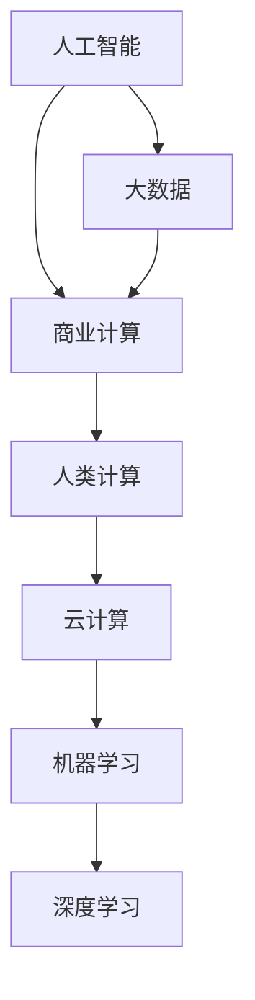

                 

# AI驱动的创新：人类计算在商业中的优势

> 关键词：人工智能,商业计算,创新驱动,大数据,云计算,机器学习

## 1. 背景介绍

### 1.1 问题由来

随着数字化转型浪潮的席卷，企业越来越依赖信息技术来驱动业务创新和竞争优势。然而，传统信息技术（IT）系统普遍存在数据存储和处理能力不足、计算速度慢、维护成本高等问题。这些问题不仅限制了企业的数字化进程，还阻碍了其在瞬息万变的市场环境中做出快速决策的能力。

为了解决这些问题，人工智能（AI）技术逐渐成为企业创新的重要工具。AI不仅可以处理海量数据，快速计算和分析，还能从数据中提取有价值的信息，支持企业做出更为精准的决策。然而，AI技术的应用并非没有挑战。如何平衡技术先进性与商业可行性，如何从数据中提取真正的价值，这些问题迫切需要新的计算模型来解决。

### 1.2 问题核心关键点

AI技术在商业中的应用主要依赖于数据和算法的结合。数据是AI创新的源泉，而算法则是将数据转化为决策的桥梁。然而，当前的AI模型普遍存在计算复杂度高、模型过于复杂等问题，这不仅增加了算力成本，还降低了模型的可解释性和可维护性。

为了应对这些挑战，一种新型计算模型应运而生——人类计算。人类计算，顾名思义，是指利用人类智慧与计算机的计算能力相结合，以实现更高效、更灵活、更智能的决策过程。这种计算模型通过将复杂任务拆分为多个子任务，并借助人类的智慧来优化和调整这些任务，从而在保证计算速度的同时，提升模型的可解释性和可维护性。

## 2. 核心概念与联系

### 2.1 核心概念概述

为了更好地理解人类计算在商业中的应用，本节将介绍几个核心概念及其相互之间的联系：

- **人工智能（AI）**：利用机器学习、深度学习等技术，模拟人类智能处理信息和做出决策。
- **商业计算**：企业内部用于支持业务运营和决策的信息系统，包括ERP、CRM、BI等。
- **人类计算**：结合人类智慧与计算机计算能力，实现更高效、智能的决策过程。
- **大数据**：庞大的数据集，可以从中提取有价值的信息和模式。
- **云计算**：通过互联网提供计算资源，支持企业的弹性计算需求。
- **机器学习**：使计算机能够通过数据学习并改进算法，实现自主决策。
- **深度学习**：一种特殊的机器学习方法，通过多层神经网络实现对复杂数据的高效处理。

这些概念之间的逻辑关系可以通过以下Mermaid流程图来展示：



这个流程图展示了一系列相关概念及其之间的逻辑关系：

1. 人工智能和大数据是商业计算的基础。
2. 商业计算依赖于人工智能和大数据，支持企业的日常运营和决策。
3. 人类计算进一步提升商业计算的效率和智能性。
4. 云计算为商业计算提供了计算资源，支持弹性计算需求。
5. 机器学习和深度学习是实现人工智能的核心技术。

## 3. 核心算法原理 & 具体操作步骤
### 3.1 算法原理概述

人类计算的核心原理是将复杂任务拆分为多个子任务，并通过人类的智慧来优化和调整这些任务。这种方法的优势在于：

- **可解释性**：由于人类计算过程中包含大量的人工干预和调整，模型的决策过程更容易被理解和解释。
- **灵活性**：人类可以根据实际情况调整任务的执行顺序和方式，适应不同的应用场景。
- **鲁棒性**：人类计算可以更好地处理异常情况，避免模型在特定场景下的失效。

人类计算的计算模型通常包括以下步骤：

1. **数据收集与预处理**：收集和处理相关数据，为后续计算提供基础。
2. **任务拆分与分析**：将复杂任务拆分为多个子任务，并对每个子任务进行详细分析。
3. **优化与调整**：结合人类智慧对每个子任务进行优化和调整，提升计算效率和效果。
4. **结果整合与反馈**：将各子任务的结果整合，形成最终决策，并根据结果进行反馈，不断优化后续计算。

### 3.2 算法步骤详解

以下是一个典型的人类计算步骤：

1. **数据收集与预处理**：
   - 收集相关业务数据，如销售数据、客户数据、市场数据等。
   - 清洗数据，去除噪声和异常值。
   - 数据标准化和归一化，提高计算效率。

2. **任务拆分与分析**：
   - 将复杂任务拆分为多个子任务，如客户分类、市场分析、销售预测等。
   - 对每个子任务进行分析，确定其关键影响因素。
   - 制定各子任务的计算模型，如线性回归、决策树、神经网络等。

3. **优化与调整**：
   - 结合人类经验对各子任务进行优化和调整，如参数调整、特征选择等。
   - 利用云计算资源，进行大规模并行计算和模型训练。
   - 结合机器学习技术，不断优化模型，提高准确性和效率。

4. **结果整合与反馈**：
   - 将各子任务的结果整合，形成最终的决策支持信息。
   - 根据决策效果进行反馈，调整计算模型和参数。
   - 不断迭代，逐步提升计算效果和智能性。

### 3.3 算法优缺点

人类计算相比传统AI模型有以下优点：

- **可解释性**：由于包含大量的人工干预，模型的决策过程更易于理解和解释。
- **灵活性**：可以根据实际情况调整计算过程，适应不同的应用场景。
- **鲁棒性**：可以更好地处理异常情况，避免模型失效。

同时，人类计算也存在一些缺点：

- **成本高**：需要大量的人力和时间来参与计算，增加了计算成本。
- **效率低**：由于人类计算的复杂性，计算速度可能较慢，无法实时处理大量数据。
- **依赖经验**：过度依赖人类经验和判断，可能导致计算结果的偏差。

### 3.4 算法应用领域

人类计算在商业中的应用领域广泛，以下是几个典型的应用场景：

1. **市场分析**：通过人类计算对市场数据进行分析，预测市场趋势，支持企业的市场策略制定。
2. **客户关系管理（CRM）**：利用人类计算分析客户数据，提升客户满意度和忠诚度，增加企业收入。
3. **供应链管理**：通过人类计算优化供应链流程，提高效率，降低成本。
4. **产品推荐**：利用人类计算分析用户行为数据，推荐相关产品，提高用户满意度和销售额。
5. **金融风险管理**：结合人类计算和机器学习技术，分析金融市场数据，预测风险，防范金融危机。

## 4. 数学模型和公式 & 详细讲解  
### 4.1 数学模型构建

为了更好地理解人类计算的计算模型，本节将介绍一些关键的数学模型和公式。

假设有一个复杂的业务问题 $P$，需要通过人类计算来解决。该问题可以拆分为多个子任务 $T_1, T_2, ..., T_n$，每个子任务对应一个计算模型 $M_i$。在每个子任务中，可以定义一组输入数据 $X_i$ 和一个输出结果 $Y_i$。最终，将各子任务的结果 $Y_1, Y_2, ..., Y_n$ 整合，得到最终结果 $Y$。

### 4.2 公式推导过程

以一个简单的市场分析任务为例，假设我们希望预测下季度销售额 $Y$。该任务可以拆分为多个子任务，如市场趋势分析 $T_1$、竞争分析 $T_2$、季节性分析 $T_3$。每个子任务的输入数据和输出结果分别如下：

- $T_1$：市场规模 $X_1$、市场增长率 $X_2$、季节性因素 $X_3$
- $T_2$：竞争对手数量 $X_4$、竞争对手市场份额 $X_5$
- $T_3$：季节性因素 $X_6$、节假日因素 $X_7$

各子任务的计算模型如下：

- $M_1$：市场趋势分析模型，输出市场增长率预测值 $Y_1$
- $M_2$：竞争分析模型，输出竞争对手市场份额预测值 $Y_2$
- $M_3$：季节性分析模型，输出季节性因素预测值 $Y_3$

最终结果整合公式为：

$$
Y = M_1(X_1, X_2, X_3) + M_2(X_4, X_5) + M_3(X_6, X_7)
$$

### 4.3 案例分析与讲解

假设某电商平台希望通过人类计算来预测下季度的销售额。可以将该任务拆分为以下子任务：

- **市场规模预测**：收集历史销售数据，使用线性回归模型预测市场规模。
- **市场增长率预测**：分析宏观经济数据，使用时间序列模型预测市场增长率。
- **竞争对手分析**：收集竞争对手销售数据，使用聚类分析模型识别主要竞争对手。
- **季节性因素预测**：分析节假日、季节性数据，使用统计模型预测季节性因素。

通过上述子任务的计算，可以得到最终的销售额预测结果。这种方法相比直接使用复杂的AI模型，更容易理解、解释和调整。

## 5. 项目实践：代码实例和详细解释说明
### 5.1 开发环境搭建

在进行人类计算的实践前，我们需要准备好开发环境。以下是使用Python进行人类计算的开发环境配置流程：

1. 安装Anaconda：从官网下载并安装Anaconda，用于创建独立的Python环境。

2. 创建并激活虚拟环境：
```bash
conda create -n human-computing python=3.8 
conda activate human-computing
```

3. 安装必要的库：
```bash
conda install pandas numpy matplotlib scikit-learn tensorflow pytorch
```

4. 配置云计算平台：
- 设置云计算平台账号，如AWS、Google Cloud等。
- 配置云计算环境，如选择CPU、GPU、存储等资源。

5. 准备数据：
- 收集和整理相关业务数据，如市场数据、客户数据等。
- 对数据进行清洗和预处理，准备进行后续计算。

### 5.2 源代码详细实现

以下是一个基于Python的人类计算代码实现示例，以客户分类任务为例：

```python
import pandas as pd
from sklearn.cluster import KMeans

# 读取客户数据
data = pd.read_csv('customer_data.csv')

# 数据清洗和预处理
# ...

# 特征选择和处理
# ...

# 任务拆分与分析
# 使用KMeans进行客户分类
kmeans = KMeans(n_clusters=5)
kmeans.fit(data[['feature1', 'feature2', 'feature3']])

# 结果整合与反馈
# ...

# 输出分类结果
print(kmeans.labels_)
```

### 5.3 代码解读与分析

让我们再详细解读一下关键代码的实现细节：

**任务拆分与分析**：
- 使用KMeans聚类算法将客户数据进行分类，每个子任务对应一个聚类结果。
- 特征选择和处理：选择合适的特征，并进行标准化、归一化等处理，提高计算效率。
- 任务执行：利用Python的Pandas、NumPy等库进行数据处理和计算。
- 结果整合与反馈：将各子任务的结果整合，形成最终决策，并根据决策效果进行反馈，不断优化计算模型和参数。

**云计算平台**：
- 使用AWS、Google Cloud等云平台，提供强大的计算资源，支持大规模并行计算和模型训练。
- 配置云环境，根据任务需求选择合适的CPU、GPU、存储等资源。

**数据处理**：
- 数据清洗和预处理：去除噪声和异常值，确保数据的准确性和一致性。
- 数据标准化和归一化：将数据转换为标准格式，提高计算效率。
- 特征选择和处理：选择合适的特征，并进行标准化、归一化等处理，提高计算效率。

**任务执行**：
- 利用Python的Pandas、NumPy等库进行数据处理和计算。
- 结合机器学习技术，不断优化模型，提高准确性和效率。

**结果整合与反馈**：
- 将各子任务的结果整合，形成最终的决策支持信息。
- 根据决策效果进行反馈，调整计算模型和参数。

## 6. 实际应用场景
### 6.1 智能客服系统

基于人类计算的智能客服系统，可以广泛应用于企业内部的客服部门，提升客户咨询体验和问题解决效率。传统的客服系统通常依赖于自动化的知识库和规则，难以理解客户的真实需求和情感。

在人类计算的驱动下，智能客服系统可以通过对大量客服对话记录进行分析，自动学习客户问题的常见模式和解决方案。每个子任务可以拆分为不同的知识模块，如问题分类、情感分析、意图识别等，并由不同的人类专家进行优化和调整。这样，系统可以更智能地理解客户需求，提供个性化的服务，提升客户满意度。

### 6.2 金融风险管理

金融风险管理是企业运营中的重要环节。传统的风险管理主要依赖于历史数据和规则库，难以应对复杂多变的金融市场。利用人类计算，可以结合市场数据、财务报表、新闻信息等多方面的数据，综合分析企业的风险状况。

具体而言，可以将金融风险管理任务拆分为多个子任务，如市场趋势预测、财务状况分析、舆情分析等，并由不同的专家进行优化和调整。系统可以实时监测市场变化，预测风险，提供及时的风险预警，帮助企业及时采取措施，降低损失。

### 6.3 供应链管理

供应链管理是企业运营中的关键环节。传统的供应链管理依赖于复杂的算法和规则，难以适应多变的市场需求。利用人类计算，可以对供应链数据进行分析和优化，提高供应链的效率和稳定性。

具体而言，可以将供应链管理任务拆分为多个子任务，如需求预测、库存管理、物流优化等，并由不同的专家进行优化和调整。系统可以实时监测供应链数据，预测需求，优化库存和物流，提高供应链的响应速度和稳定性。

### 6.4 未来应用展望

随着人工智能技术的不断发展，人类计算在商业中的应用前景广阔。未来，人类计算将在更多领域得到应用，为传统行业带来变革性影响。

在智慧医疗领域，结合人类计算和机器学习技术，可以实现智能诊断、精准治疗、病历分析等功能，提升医疗服务的智能化水平，辅助医生诊疗，加速新药开发进程。

在智能教育领域，通过人类计算和机器学习技术，可以实现智能教学、个性化推荐、学情分析等功能，因材施教，促进教育公平，提高教学质量。

在智慧城市治理中，结合人类计算和机器学习技术，可以实现城市事件监测、舆情分析、应急指挥等功能，提高城市管理的自动化和智能化水平，构建更安全、高效的未来城市。

此外，在企业生产、社会治理、文娱传媒等众多领域，基于人类计算的人工智能应用也将不断涌现，为经济社会发展注入新的动力。相信随着技术的日益成熟，人类计算必将在构建人机协同的智能时代中扮演越来越重要的角色。

## 7. 工具和资源推荐
### 7.1 学习资源推荐

为了帮助开发者系统掌握人类计算的理论基础和实践技巧，这里推荐一些优质的学习资源：

1. 《人类计算：数据驱动的商业决策》书籍：详细介绍了人类计算的理论基础和实践技巧，涵盖大数据、云计算、机器学习等多个领域。
2. 《Python数据科学手册》书籍：全面介绍了Python在数据科学中的应用，包括数据处理、机器学习、可视化等。
3. 《深度学习入门：基于Python的理论与实现》书籍：介绍了深度学习的基本概念和实现方法，结合Python进行实践。
4. Coursera《机器学习》课程：由斯坦福大学开设的机器学习经典课程，涵盖机器学习的基本原理和实践技巧。
5. Kaggle竞赛平台：提供大量数据集和竞赛任务，帮助开发者实践机器学习和数据科学技术。

通过对这些资源的学习实践，相信你一定能够快速掌握人类计算的精髓，并用于解决实际的商业问题。

### 7.2 开发工具推荐

高效的开发离不开优秀的工具支持。以下是几款用于人类计算开发的常用工具：

1. Python：Python是一种广泛使用的编程语言，具有简单易学、功能强大的特点，适合进行数据处理和机器学习。
2. Jupyter Notebook：一个交互式的Python开发环境，支持代码编写、数据可视化、文档撰写等多种功能。
3. TensorFlow：由Google主导开发的深度学习框架，支持分布式计算和模型训练。
4. PyTorch：一个灵活的深度学习框架，支持动态计算图和模型优化。
5. AWS SageMaker：亚马逊提供的云端机器学习平台，支持模型训练、部署和监控。

合理利用这些工具，可以显著提升人类计算任务的开发效率，加快创新迭代的步伐。

### 7.3 相关论文推荐

人类计算和AI技术的发展源于学界的持续研究。以下是几篇奠基性的相关论文，推荐阅读：

1. "Human-Centric Machine Learning" 论文：提出了人类计算的计算模型和优化方法，强调人类智慧在机器学习中的重要性。
2. "Towards Explainable AI" 论文：探讨了AI模型的可解释性和透明性问题，提出了多种提升可解释性的方法。
3. "Computational Intelligence" 论文：介绍了计算智能的概念和应用，涵盖人类计算、模糊逻辑、进化计算等多个领域。
4. "Deep Learning" 论文：介绍了深度学习的基本原理和实现方法，结合人类计算进行优化。
5. "AI in Finance" 论文：探讨了AI技术在金融领域的应用，包括风险管理、智能投顾、金融产品推荐等多个方面。

这些论文代表了大语言模型微调技术的发展脉络。通过学习这些前沿成果，可以帮助研究者把握学科前进方向，激发更多的创新灵感。

## 8. 总结：未来发展趋势与挑战

### 8.1 总结

本文对人类计算在商业中的应用进行了全面系统的介绍。首先阐述了人类计算的背景和意义，明确了人类计算在提升商业计算效率和智能性方面的独特价值。其次，从原理到实践，详细讲解了人类计算的数学模型和关键步骤，给出了人类计算任务开发的完整代码实例。同时，本文还广泛探讨了人类计算在智能客服、金融风险管理、供应链管理等多个领域的应用前景，展示了人类计算范式的巨大潜力。此外，本文精选了人类计算技术的各类学习资源，力求为读者提供全方位的技术指引。

通过本文的系统梳理，可以看到，人类计算在商业中的应用前景广阔，不仅能够提升计算效率和智能性，还能增强系统的可解释性和可维护性。未来，随着人类计算技术的不断进步，相信其在商业中的角色将愈加重要，为企业的数字化转型提供新的动能。

### 8.2 未来发展趋势

展望未来，人类计算在商业中的应用将呈现以下几个发展趋势：

1. **计算效率提升**：随着计算资源的不断丰富，人类计算的效率将显著提升，支持更多的计算任务和实时处理需求。
2. **可解释性增强**：结合人工智能和人类智慧，提高系统的可解释性和透明度，增强用户信任和接受度。
3. **灵活性提高**：利用云计算和分布式计算，实现更加灵活的计算资源配置和任务调度，支持更多变的业务需求。
4. **应用场景扩展**：结合人类计算和人工智能技术，拓展更多领域的应用场景，如智能医疗、智能教育、智慧城市等。
5. **跨领域融合**：与其他人工智能技术（如知识表示、自然语言处理、计算机视觉等）进行更深入的融合，形成更为全面和智能的系统。

### 8.3 面临的挑战

尽管人类计算在商业中的应用前景广阔，但在迈向更加智能化、普适化应用的过程中，仍面临诸多挑战：

1. **成本高昂**：人类计算需要大量的人力和时间来参与计算，增加了计算成本。
2. **效率低下**：由于人类计算的复杂性，计算速度可能较慢，无法实时处理大量数据。
3. **依赖经验**：过度依赖人类经验和判断，可能导致计算结果的偏差。
4. **数据质量问题**：数据的准确性和一致性直接影响计算结果，需要严格的数据清洗和预处理。
5. **技术壁垒**：需要具备高度的技术能力和经验，才能有效地进行任务拆分和优化。

### 8.4 研究展望

面对人类计算所面临的挑战，未来的研究需要在以下几个方面寻求新的突破：

1. **优化任务拆分与调整**：通过更科学的方法进行任务拆分和优化，提高计算效率和效果。
2. **引入自动化工具**：开发自动化工具和系统，减少人工干预，提高计算效率和准确性。
3. **提升数据质量**：加强数据清洗和预处理，提高数据的准确性和一致性。
4. **融合多种技术**：结合其他人工智能技术（如自然语言处理、计算机视觉等），实现更加全面和智能的计算模型。
5. **拓展应用场景**：拓展人类计算在更多领域的应用，如医疗、教育、智慧城市等，推动相关行业的数字化转型。

这些研究方向的探索，必将引领人类计算技术迈向更高的台阶，为构建安全、可靠、可解释、可控的智能系统铺平道路。面向未来，人类计算技术还需要与其他人工智能技术进行更深入的融合，共同推动自然语言理解和智能交互系统的进步。只有勇于创新、敢于突破，才能不断拓展计算模型的边界，让智能技术更好地造福人类社会。

## 9. 附录：常见问题与解答

**Q1：人类计算相比传统AI计算有何优势？**

A: 人类计算相比传统AI计算有以下优势：

1. **可解释性**：由于包含大量的人工干预，模型的决策过程更容易被理解和解释。
2. **灵活性**：可以根据实际情况调整计算过程，适应不同的应用场景。
3. **鲁棒性**：可以更好地处理异常情况，避免模型失效。
4. **稳定性**：通过结合人类的智慧和经验，系统更稳定、可靠。

**Q2：人类计算在商业中的应用场景有哪些？**

A: 人类计算在商业中的应用场景广泛，以下是几个典型的应用场景：

1. **市场分析**：通过人类计算对市场数据进行分析，预测市场趋势，支持企业的市场策略制定。
2. **客户关系管理（CRM）**：利用人类计算分析客户数据，提升客户满意度和忠诚度，增加企业收入。
3. **供应链管理**：通过人类计算优化供应链流程，提高效率，降低成本。
4. **产品推荐**：利用人类计算分析用户行为数据，推荐相关产品，提高用户满意度和销售额。
5. **金融风险管理**：结合人类计算和机器学习技术，分析金融市场数据，预测风险，防范金融危机。

**Q3：人类计算的计算模型如何构建？**

A: 人类计算的计算模型通常包括以下步骤：

1. **数据收集与预处理**：收集和处理相关数据，为后续计算提供基础。
2. **任务拆分与分析**：将复杂任务拆分为多个子任务，并对每个子任务进行详细分析。
3. **优化与调整**：结合人类智慧对每个子任务进行优化和调整，提升计算效率和效果。
4. **结果整合与反馈**：将各子任务的结果整合，形成最终决策，并根据决策效果进行反馈，不断优化计算模型和参数。

**Q4：人类计算的开发环境如何搭建？**

A: 在进行人类计算的实践前，我们需要准备好开发环境。以下是使用Python进行人类计算的开发环境配置流程：

1. 安装Anaconda：从官网下载并安装Anaconda，用于创建独立的Python环境。

2. 创建并激活虚拟环境：
```bash
conda create -n human-computing python=3.8 
conda activate human-computing
```

3. 安装必要的库：
```bash
conda install pandas numpy matplotlib scikit-learn tensorflow pytorch
```

4. 配置云计算平台：
- 设置云计算平台账号，如AWS、Google Cloud等。
- 配置云计算环境，如选择CPU、GPU、存储等资源。

5. 准备数据：
- 收集和整理相关业务数据，如市场数据、客户数据等。
- 对数据进行清洗和预处理，准备进行后续计算。

**Q5：人类计算在智能客服系统中的应用如何实现？**

A: 基于人类计算的智能客服系统，可以通过对大量客服对话记录进行分析，自动学习客户问题的常见模式和解决方案。每个子任务可以拆分为不同的知识模块，如问题分类、情感分析、意图识别等，并由不同的人类专家进行优化和调整。这样，系统可以更智能地理解客户需求，提供个性化的服务，提升客户满意度。

通过上述代码实例和详细解释说明，相信你一定能够快速掌握人类计算的精髓，并用于解决实际的商业问题。

---

作者：禅与计算机程序设计艺术 / Zen and the Art of Computer Programming

