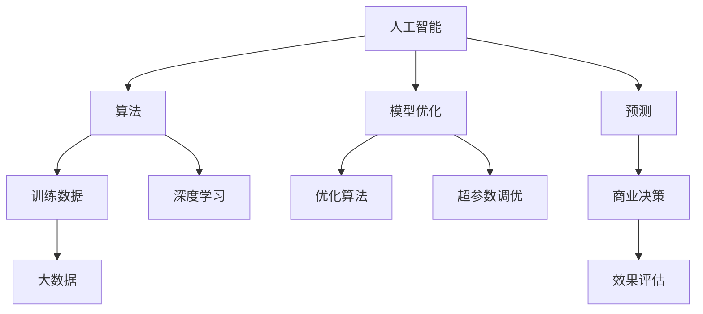

                 

# AI驱动的创新：人类计算在商业中的道德考虑因素与应用前景趋势分析预测

> 关键词：人工智能,商业创新,道德伦理,计算伦理学,预测分析,人类计算

## 1. 背景介绍

### 1.1 问题由来

随着人工智能（AI）技术的飞速发展，AI在商业领域的应用场景日益丰富，从自动化客户服务、个性化推荐系统到智能决策支持系统，AI的应用已经深刻地影响了各行各业的运营模式和消费者行为。然而，与此同时，AI在应用过程中也暴露出一系列道德伦理问题，如算法偏见、数据隐私、自动化裁员等，引起了广泛的社会关注。如何在使用AI驱动商业创新的同时，确保技术的道德边界，成为当前亟需解决的关键问题。

### 1.2 问题核心关键点

当前，AI在商业应用中面临的道德挑战主要包括以下几个方面：

- **算法偏见与公平性**：AI模型在训练和应用过程中可能继承数据中的偏见，导致对某些群体的歧视性行为。
- **数据隐私与安全**：AI系统需要大量数据进行训练和预测，如何保护用户隐私，防止数据滥用，是亟需解决的问题。
- **自动化与就业**：AI技术可能替代部分岗位，引发就业问题和社会不稳定。
- **责任归属**：当AI系统出现错误或意外，如何界定责任主体，是法律和伦理上的重要议题。
- **透明度与可解释性**：AI系统的决策过程往往不透明，缺乏可解释性，用户难以理解和信任。

这些核心问题不仅影响AI技术的健康发展，还关乎社会公平与正义，亟需系统性解决。

## 2. 核心概念与联系

### 2.1 核心概念概述

为深入探讨AI在商业中的道德问题，本文将重点介绍以下几个核心概念及其相互联系：

- **人工智能（AI）**：指通过计算机算法和大数据训练出的智能系统，能够模拟人类的智能行为。
- **商业创新**：指利用AI技术，优化商业流程、提高运营效率、增强客户体验等。
- **计算伦理学**：研究计算技术和应用中的道德伦理问题，指导AI技术的负责任使用。
- **预测分析**：基于历史数据和AI模型，对未来趋势进行预测，辅助商业决策。
- **人类计算**：强调在AI系统中融入人类的判断和决策，平衡自动化与人工干预，确保道德底线。

这些概念通过以下Mermaid流程图进行联系和展开：

```mermaid
graph TB
    A[人工智能(AI)] --> B[商业创新] --> C[预测分析]
    A --> D[计算伦理学]
    D --> E[道德考虑因素]
    C --> F[应用前景]
    B --> G[人类计算]
    E --> H[责任归属]
    G --> I[透明度与可解释性]
    H --> J[算法偏见]
    I --> K[数据隐私]
```

### 2.2 核心概念原理和架构的 Mermaid 流程图



以上流程图示例了AI在商业中的基本架构，包括数据的获取与处理、模型的训练与优化、预测与决策等关键环节，每个环节都涉及复杂的伦理考量。

## 3. 核心算法原理 & 具体操作步骤
### 3.1 算法原理概述

AI在商业应用中的核心算法原理主要包括以下几个方面：

- **机器学习**：通过大量数据训练模型，使其能够从历史数据中学习规律，并对新数据进行预测或分类。
- **深度学习**：基于多层神经网络的模型，能够处理更复杂、高维度的数据，适用于图像、语音、文本等。
- **强化学习**：通过奖励机制，训练模型在特定环境中做出最优决策，常用于游戏、机器人等领域。
- **自然语言处理（NLP）**：使机器能够理解、处理和生成自然语言，广泛应用于客户服务、智能助手等。
- **计算机视觉（CV）**：使机器能够识别、理解图像和视频中的物体、场景等信息，适用于安防、医疗等领域。

### 3.2 算法步骤详解

以下以AI在商业应用中的典型步骤为例，详细介绍具体操作步骤：

1. **数据获取与处理**：
   - 收集与业务相关的数据，包括用户行为、市场趋势、业务指标等。
   - 清洗和预处理数据，去除噪声和异常值，标准化数据格式。
   - 数据分割为训练集和测试集，确保模型评估的准确性。

2. **模型选择与训练**：
   - 根据业务需求选择合适的算法模型，如决策树、随机森林、神经网络等。
   - 配置模型参数，如学习率、迭代次数、正则化等。
   - 使用训练集训练模型，并通过交叉验证等技术进行模型调优。

3. **预测与决策**：
   - 使用训练好的模型对新数据进行预测或分类。
   - 根据预测结果生成商业建议或决策，如产品推荐、客户分类等。
   - 定期更新模型，确保其与业务动态保持一致。

4. **效果评估与优化**：
   - 使用测试集评估模型性能，计算准确率、召回率、F1分数等指标。
   - 根据评估结果调整模型参数，优化模型性能。
   - 持续监控模型效果，及时发现和修复问题。

### 3.3 算法优缺点

AI在商业应用中的算法具有以下优点：

- **效率提升**：通过自动化处理大量数据，显著提高商业运营效率。
- **决策支持**：提供基于数据的预测和建议，帮助企业做出更科学、合理的决策。
- **个性化体验**：利用用户数据，提供定制化的产品和服务，提升用户体验。

同时，这些算法也存在一些缺点：

- **数据依赖性高**：模型的性能依赖于高质量的数据，数据不足或偏差可能导致误判。
- **可解释性不足**：AI模型往往是“黑箱”，难以解释其决策过程，用户难以信任。
- **道德风险**：模型可能继承数据中的偏见，导致不公平对待某些群体。
- **技术复杂性**：需要专业的技术团队进行模型开发和维护，成本较高。

### 3.4 算法应用领域

AI在商业中的应用领域广泛，涵盖以下几个方面：

- **客户服务**：自动化客服、智能客服系统、聊天机器人等。
- **营销与广告**：个性化推荐系统、广告投放优化、社交媒体分析等。
- **运营管理**：供应链优化、库存管理、生产调度等。
- **金融服务**：信用评分、风险评估、反欺诈检测等。
- **健康医疗**：医疗影像诊断、患者分诊、药物研发等。

此外，AI还被应用于智慧城市、智能制造、环保监测等多个领域，推动了各行各业的数字化转型和智能化升级。

## 4. 数学模型和公式 & 详细讲解 & 举例说明

### 4.1 数学模型构建

在商业应用中，AI模型的数学模型构建通常包括以下几个关键环节：

- **输入特征**：选取与业务相关的特征，如用户行为、交易记录、地理位置等。
- **损失函数**：定义模型预测与实际结果之间的差距，如均方误差、交叉熵等。
- **优化算法**：使用梯度下降等优化算法，最小化损失函数，更新模型参数。
- **评估指标**：如准确率、召回率、F1分数等，用于评估模型性能。

### 4.2 公式推导过程

以线性回归模型为例，其公式推导过程如下：

$$
y = \beta_0 + \beta_1 x_1 + \beta_2 x_2 + \cdots + \beta_n x_n + \epsilon
$$

其中，$y$ 为预测值，$\beta_0,\beta_1,\cdots,\beta_n$ 为模型参数，$x_1,x_2,\cdots,x_n$ 为输入特征，$\epsilon$ 为误差项。

使用均方误差损失函数：

$$
L(y,\hat{y}) = \frac{1}{N}\sum_{i=1}^N (y_i - \hat{y}_i)^2
$$

其中，$y_i$ 为真实值，$\hat{y}_i$ 为预测值。

通过梯度下降优化算法，更新模型参数：

$$
\theta = \theta - \eta \nabla_{\theta}L(y,\hat{y})
$$

其中，$\theta$ 为模型参数，$\eta$ 为学习率，$\nabla_{\theta}L(y,\hat{y})$ 为损失函数对模型参数的梯度。

### 4.3 案例分析与讲解

以电商平台个性化推荐系统为例，其数学模型构建和训练过程如下：

1. **数据准备**：
   - 收集用户历史行为数据，如浏览记录、购买历史、评分信息等。
   - 对数据进行清洗和预处理，去除噪声和异常值，标准化数据格式。

2. **模型选择**：
   - 使用协同过滤算法，如基于矩阵分解的推荐模型。
   - 配置模型参数，如正则化系数、迭代次数等。

3. **模型训练**：
   - 使用训练集数据训练推荐模型。
   - 定期更新模型，确保其与业务动态保持一致。

4. **效果评估**：
   - 使用测试集评估模型性能，计算准确率、召回率、F1分数等指标。
   - 根据评估结果调整模型参数，优化模型性能。

## 5. 项目实践：代码实例和详细解释说明

### 5.1 开发环境搭建

在进行AI商业应用开发前，需要准备好开发环境。以下是使用Python进行TensorFlow开发的环境配置流程：

1. 安装Anaconda：从官网下载并安装Anaconda，用于创建独立的Python环境。
2. 创建并激活虚拟环境：
```bash
conda create -n tf-env python=3.8 
conda activate tf-env
```
3. 安装TensorFlow：根据CUDA版本，从官网获取对应的安装命令。例如：
```bash
conda install tensorflow -c tensorflow -c conda-forge
```
4. 安装各类工具包：
```bash
pip install numpy pandas scikit-learn matplotlib tqdm jupyter notebook ipython
```

完成上述步骤后，即可在`tf-env`环境中开始开发。

### 5.2 源代码详细实现

以下是使用TensorFlow进行电商推荐系统开发的PyTorch代码实现：

```python
import tensorflow as tf
from tensorflow.keras.layers import Input, Embedding, Dot, Flatten
from tensorflow.keras.models import Model
from tensorflow.keras.optimizers import Adam

# 输入层
user_input = Input(shape=(num_users,))
item_input = Input(shape=(num_items,))

# 嵌入层
user_embedding = Embedding(input_dim=num_users, output_dim=embedding_size)(user_input)
item_embedding = Embedding(input_dim=num_items, output_dim=embedding_size)(item_input)

# 点积层
dot_product = Dot(axes=[2, 1])([user_embedding, item_embedding])

# 扁平化层
flatten = Flatten()(dot_product)

# 输出层
output = Dense(1, activation='sigmoid')(flatten)

# 模型
model = Model(inputs=[user_input, item_input], outputs=output)

# 编译模型
model.compile(optimizer=Adam(learning_rate=learning_rate), loss='binary_crossentropy', metrics=['accuracy'])

# 训练模型
model.fit([user_train, item_train], user_train, epochs=num_epochs, batch_size=batch_size)
```

### 5.3 代码解读与分析

让我们再详细解读一下关键代码的实现细节：

**电商推荐系统代码**：
- `Input`层定义了模型的输入层，包括用户输入和物品输入。
- `Embedding`层将输入转换为高维向量，便于模型处理。
- `Dot`层计算用户和物品向量的点积，得到相似度。
- `Flatten`层将点积结果展平，便于输出层处理。
- `Dense`层定义输出层，使用sigmoid激活函数，输出0-1之间的概率。

**训练模型代码**：
- `compile`方法配置了模型的优化器、损失函数和评估指标。
- `fit`方法使用训练数据对模型进行训练，指定训练轮数和批次大小。

通过上述代码，展示了TensorFlow中构建电商推荐系统的完整流程，包括数据准备、模型构建、训练和评估等关键环节。

## 6. 实际应用场景

### 6.1 客户服务

AI驱动的客户服务系统已经在许多企业中得到应用，通过自动化客户服务，提高了客户满意度和运营效率。例如，阿里巴巴的“阿里小蜜”，腾讯的“腾讯客服”等，通过自然语言处理技术，能够自动理解客户问题，提供精准的解决方案。

### 6.2 金融服务

在金融领域，AI驱动的风险评估、信用评分、反欺诈检测等应用，提高了金融机构的决策效率和风险控制能力。例如，蚂蚁金服的“智能风控系统”，通过深度学习技术，能够实时监测用户行为，识别异常交易，提高欺诈检测的准确率。

### 6.3 医疗健康

AI在医疗健康领域的应用也日益广泛，例如，IBM的“Watson Health”，通过自然语言处理和深度学习技术，能够分析医疗数据，提供诊断和治疗建议，帮助医生做出更科学的决策。

### 6.4 未来应用展望

随着AI技术的不断发展，未来在商业应用中的前景将更加广阔：

- **自动化决策**：AI将更多地应用于自动决策领域，如股票交易、保险理赔等。
- **智能合约**：基于区块链和AI的智能合约，能够自动执行合同条款，提高交易效率和信任度。
- **智能制造**：AI技术将更多地应用于智能制造领域，如预测性维护、智能生产调度等，提升生产效率和产品质量。
- **智慧城市**：AI在智慧城市建设中的应用，将带来交通管理、公共安全、环境保护等领域的全面智能化。

## 7. 工具和资源推荐

### 7.1 学习资源推荐

为了帮助开发者系统掌握AI在商业中的应用，以下是一些优质的学习资源：

1. 《人工智能导论》（Introduction to Artificial Intelligence）：通俗易懂的入门书籍，涵盖AI的基本概念和技术。
2. 《深度学习》（Deep Learning）：由深度学习领域权威人士撰写，深入讲解深度学习理论和实践。
3. Coursera《机器学习》课程：由斯坦福大学教授Andrew Ng主讲的经典课程，涵盖机器学习的基础和应用。
4. 《TensorFlow官方文档》：官方文档详细介绍了TensorFlow的使用方法和最佳实践。
5. GitHub AI模型库：包含大量开源AI模型和代码，方便开发者学习和实践。

通过对这些资源的学习实践，相信你一定能够快速掌握AI在商业中的应用，并用于解决实际的商业问题。

### 7.2 开发工具推荐

高效的开发离不开优秀的工具支持。以下是几款用于AI商业应用开发的常用工具：

1. TensorFlow：由Google主导开发的开源深度学习框架，生产部署方便，适合大规模工程应用。
2. PyTorch：基于Python的开源深度学习框架，灵活动态的计算图，适合快速迭代研究。
3. Jupyter Notebook：交互式笔记本，支持Python、R、Scala等多种语言，便于编写和调试代码。
4. Visual Studio Code：轻量级代码编辑器，支持多种编程语言和工具集。
5. Anaconda：Python环境管理工具，方便快速搭建和管理开发环境。

合理利用这些工具，可以显著提升AI商业应用开发的效率，加快创新迭代的步伐。

### 7.3 相关论文推荐

AI在商业应用中的研究涉及多个领域，以下是几篇具有代表性的相关论文，推荐阅读：

1. "A Survey on Artificial Intelligence in Marketing"：对AI在市场营销中的应用进行了全面的回顾。
2. "AI in Healthcare: Opportunities, Challenges, and Successes"：探讨了AI在医疗健康领域的应用和挑战。
3. "Ethics in AI: Towards an AI-Driven Society"：探讨了AI技术在社会治理中的道德伦理问题。
4. "Machine Learning in Financial Services: A Survey"：对AI在金融服务中的应用进行了全面的调研。
5. "Artificial Intelligence in Smart Cities: Opportunities, Challenges, and Future Directions"：探讨了AI在智慧城市中的应用和未来发展方向。

这些论文代表了AI在商业应用中的最新研究动态，通过学习这些前沿成果，可以帮助研究者把握学科前进方向，激发更多的创新灵感。

## 8. 总结：未来发展趋势与挑战

### 8.1 总结

本文对AI在商业应用中的道德考虑因素和应用前景进行了全面系统的介绍。首先阐述了AI技术在商业创新中的潜力和挑战，明确了道德伦理在AI应用中的重要性。其次，从原理到实践，详细讲解了AI在商业应用中的数学模型和操作步骤，给出了具体的代码实现。同时，本文还广泛探讨了AI在多个领域的应用前景，展示了AI技术在商业创新中的广阔前景。此外，本文精选了AI在商业应用中的各类学习资源，力求为读者提供全方位的技术指引。

通过本文的系统梳理，可以看到，AI在商业应用中的道德边界和应用前景是当前亟需解决的关键问题。这些问题的解决将直接关系到AI技术的健康发展和广泛应用。

### 8.2 未来发展趋势

展望未来，AI在商业应用中的发展趋势主要包括以下几个方面：

- **自动化与智能化**：AI技术将更多地应用于自动化决策领域，提高企业运营效率和决策质量。
- **跨领域融合**：AI与其他技术的融合，如区块链、物联网等，将推动更多领域的智能化转型。
- **可解释性与透明性**：AI系统将越来越注重可解释性和透明性，确保用户信任和系统可靠性。
- **道德与伦理**：AI技术的道德边界将成为研究重点，确保AI技术的应用符合社会伦理和法律要求。

### 8.3 面临的挑战

尽管AI在商业应用中取得了显著进展，但在实际应用过程中仍面临诸多挑战：

- **数据质量与数据隐私**：高质量的数据是AI应用的基础，但数据获取和隐私保护一直是一个难题。
- **技术复杂性与维护成本**：AI系统的复杂性带来了高额的维护成本，需要专业团队进行长期维护。
- **伦理与法律风险**：AI系统的决策过程可能存在偏见和歧视，引发伦理和法律问题。
- **市场接受度**：AI技术的应用需要市场的广泛接受和认可，但传统行业对新技术的接受度较低。
- **技术落地难**：AI技术的落地应用需要跨领域的技术合作和资源整合，面临诸多困难。

### 8.4 研究展望

面对AI在商业应用中的诸多挑战，未来的研究需要在以下几个方面寻求新的突破：

- **数据获取与预处理**：研究高效的数据获取和预处理技术，确保高质量的数据输入。
- **模型可解释性**：开发可解释的AI模型，增强系统的透明度和可信度。
- **跨领域融合**：探索AI与其他技术（如区块链、物联网等）的深度融合，推动更多领域的智能化转型。
- **伦理与法律研究**：研究AI技术的伦理和法律边界，确保AI技术的应用符合社会价值观和法律法规。
- **自动化决策**：探索自动化决策的可行性和边界，提高决策效率和质量。

这些研究方向将为AI在商业应用中的健康发展和广泛应用提供新的思路和方向。只有通过系统性研究，才能确保AI技术在商业创新中的道德边界和应用前景，为构建人机协同的智能社会铺平道路。

## 9. 附录：常见问题与解答

**Q1：AI在商业应用中如何确保数据隐私？**

A: 确保数据隐私是AI在商业应用中的重要课题，以下是几种常见的方法：
1. **数据匿名化**：将数据中的敏感信息进行匿名化处理，如使用假名、哈希等技术。
2. **差分隐私**：在数据采集和处理过程中，引入噪声，确保数据在统计上的隐私性。
3. **联邦学习**：在多方参与的数据采集和处理中，不将原始数据传输，而是在模型训练过程中保护数据隐私。

**Q2：AI在商业应用中如何避免偏见和歧视？**

A: 避免偏见和歧视是AI在商业应用中必须解决的问题，以下是几种常见的方法：
1. **数据多样化**：确保数据集的多样性，避免数据集中的偏见。
2. **模型公平性**：在模型训练过程中，加入公平性约束，确保模型对不同群体的公平性。
3. **偏见检测**：使用偏见检测工具，定期检查模型输出中的偏见问题，及时调整模型。

**Q3：AI在商业应用中如何实现自动化决策？**

A: 实现自动化决策是AI在商业应用中的重要应用场景，以下是几种常见的方法：
1. **规则引擎**：结合专家规则，构建决策规则，实现自动化决策。
2. **深度学习**：使用深度学习模型，学习历史数据中的规律，实现预测和决策。
3. **集成学习**：将多个模型进行集成，综合多方面的决策信息，提高决策的准确性和可靠性。

**Q4：AI在商业应用中如何实现透明性与可解释性？**

A: 实现透明性与可解释性是AI在商业应用中的重要需求，以下是几种常见的方法：
1. **模型可视化**：使用可视化工具，展示模型的决策过程和关键特征。
2. **可解释模型**：使用可解释模型，如决策树、逻辑回归等，便于解释模型的决策逻辑。
3. **解释工具**：使用解释工具，如LIME、SHAP等，提供对模型输出的解释。

通过这些方法的结合，可以显著提升AI在商业应用中的透明性和可解释性，增强用户信任和系统可靠性。

---

作者：禅与计算机程序设计艺术 / Zen and the Art of Computer Programming

