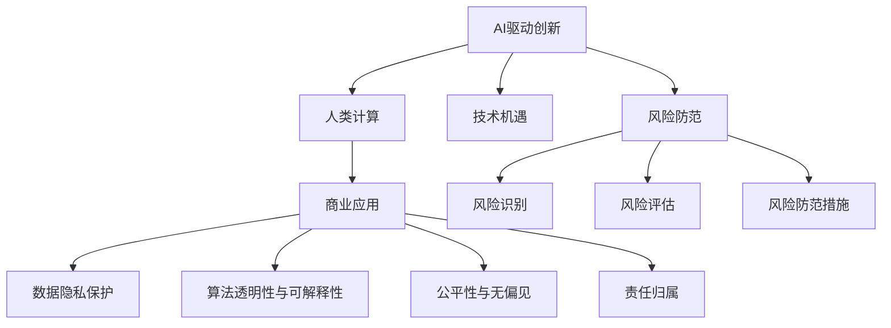

                 

# AI驱动的创新：人类计算在商业中的道德考虑因素与机遇

> 关键词：AI驱动创新, 人类计算, 商业应用, 道德伦理, 技术机遇, 风险防范

## 1. 背景介绍

随着人工智能(AI)技术的迅猛发展，人类计算的概念逐渐成为商业创新的重要驱动力。AI驱动的解决方案可以大幅提升业务效率，优化决策过程，创造巨大的商业价值。然而，人类计算不仅仅是技术创新，更涉及到深层次的道德伦理问题，这要求企业在追求商业成功的同时，也必须重视这些考量因素，以确保技术的可持续和公正性。

### 1.1 问题由来

AI技术在商业应用中的广泛渗透，导致了数据隐私、算法透明性、公平性等道德问题的凸显。例如，面部识别技术虽然提高了安防监控的效率，但也引发了对个人隐私的侵犯和歧视问题的担忧。因此，企业在应用AI技术时，必须将伦理道德因素纳入考量，以期实现技术创新的同时，维护社会公正和人类福祉。

### 1.2 问题核心关键点

核心问题集中在AI技术的伦理道德框架构建、风险防范、责任归属等方面。以下列出一些关键问题点：

1. **数据隐私保护**：AI模型依赖于大量数据进行训练，如何在保护个人隐私的前提下获取和利用数据？
2. **算法透明性与可解释性**：如何确保AI系统的决策过程是透明和可解释的，让用户理解并信任其结果？
3. **公平性与无偏见**：AI系统在处理数据时是否可能引入或放大偏见，如何确保系统的公平性和无偏见性？
4. **责任归属**：在AI系统出现错误或造成损害时，应由谁承担责任？

这些问题不仅关系到技术应用的成功与否，更关乎企业的社会责任和公众信任。

## 2. 核心概念与联系

### 2.1 核心概念概述

为更好地理解AI驱动的商业创新及其道德考量，本节将介绍几个关键概念：

- **AI驱动创新**：通过人工智能技术实现商业模式的创新，包括但不限于自动化流程、个性化推荐、智能客服等。
- **人类计算**：利用AI技术来辅助人类完成复杂计算任务，从而提高效率和质量，同时保留人类的直觉和创造力。
- **商业应用**：AI技术在各行各业中的应用，如金融、医疗、制造、零售等，推动产业数字化转型。
- **道德伦理**：在技术应用中，应当遵守的伦理原则，如数据隐私保护、算法透明性、公平性等。
- **技术机遇**：AI技术带来的新商业机会，如提升客户体验、优化供应链管理等。
- **风险防范**：识别并防范AI技术应用中的潜在风险，确保技术安全和社会影响可控。

这些概念之间的关系可以通过以下Mermaid流程图来展示：



这个流程图展示了AI驱动的创新过程中涉及的关键概念及其相互关系：

1. AI驱动创新是核心，通过人类计算实现商业应用。
2. 商业应用中，数据隐私保护、算法透明性、公平性、责任归属等道德问题至关重要。
3. 技术机遇和风险防范是AI创新的重要考量因素。

## 3. 核心算法原理 & 具体操作步骤

### 3.1 算法原理概述

AI驱动的商业创新，本质上是通过数据分析、模式识别和决策优化等技术手段，来实现业务流程的自动化和智能化。其核心算法包括但不限于机器学习、深度学习、强化学习等，这些算法在处理大规模数据时展现了强大的计算能力。

### 3.2 算法步骤详解

1. **数据准备**：收集和预处理相关数据，确保数据的质量和可用性。
2. **模型训练**：选择合适的算法模型，利用历史数据进行训练，学习模型参数。
3. **模型评估**：使用验证集评估模型性能，调整参数，优化模型。
4. **模型部署**：将训练好的模型部署到生产环境中，开始实际应用。
5. **监控与维护**：实时监控模型性能，定期更新模型，确保其长期有效性。

### 3.3 算法优缺点

AI驱动的商业创新具有以下优点：

1. **提升效率**：通过自动化流程，大幅提高业务处理效率。
2. **优化决策**：通过数据分析，提供更加准确、科学的决策依据。
3. **个性化服务**：利用AI技术，实现客户需求的个性化推荐和服务。
4. **创新商业模式**：AI技术带来的新应用场景，催生了新的商业机会。

同时，AI驱动的商业创新也存在一些缺点：

1. **数据依赖**：对数据质量和量的要求较高，获取高质量数据成本大。
2. **技术复杂**：AI模型训练和部署复杂，需要专业知识和资源投入。
3. **算法偏见**：模型可能学习到数据中的偏见，导致决策不公平。
4. **技术风险**：AI系统可能出现故障，带来业务风险。
5. **社会影响**：AI系统的广泛应用可能带来就业结构变化、社会不公等问题。

### 3.4 算法应用领域

AI驱动的商业创新已在多个领域取得显著应用，具体包括：

1. **金融科技(FinTech)**：利用AI技术进行风险评估、信用评分、智能投顾等。
2. **医疗健康**：AI辅助诊断、个性化治疗方案推荐、智能监测等。
3. **制造业**：智能质检、供应链优化、设备维护预测等。
4. **零售电商**：个性化推荐、智能客服、库存管理等。
5. **交通物流**：智能调度、路径优化、货运管理等。

## 4. 数学模型和公式 & 详细讲解 & 举例说明

### 4.1 数学模型构建

以金融科技中的信用评分为例，构建数学模型如下：

设 $X = (x_1, x_2, ..., x_n)$ 为输入变量，$y$ 为目标变量，即用户的信用评分。构建线性回归模型为：

$$
y = \theta_0 + \sum_{i=1}^n \theta_i x_i + \epsilon
$$

其中 $\theta$ 为模型参数，$\epsilon$ 为误差项。

### 4.2 公式推导过程

对上述线性回归模型进行最小二乘法求解：

$$
\hat{\theta} = \arg\min_{\theta} \sum_{i=1}^N (y_i - \theta_0 - \sum_{j=1}^n \theta_j x_{ij})^2
$$

推导得到：

$$
\hat{\theta} = (X^TX)^{-1}X^Ty
$$

### 4.3 案例分析与讲解

某银行欲使用AI模型评估用户信用风险，收集了大量的用户数据，包括年龄、收入、婚姻状况等，构建了线性回归模型进行训练。在训练过程中，使用交叉验证法进行模型评估，调整参数。最终模型在验证集上的准确率为85%，进入生产环境进行实时信用评分。

## 5. 项目实践：代码实例和详细解释说明

### 5.1 开发环境搭建

以下是在Python环境下使用Scikit-learn库搭建金融科技信用评分系统的开发环境：

1. 安装Scikit-learn库：
```bash
pip install scikit-learn
```

2. 安装相关依赖库：
```bash
pip install pandas numpy
```

### 5.2 源代码详细实现

以下是使用Scikit-learn实现线性回归模型的代码：

```python
from sklearn.linear_model import LinearRegression
import pandas as pd

# 加载数据集
data = pd.read_csv('credit_score.csv')

# 数据预处理
X = data[['age', 'income', 'marital_status']]
y = data['credit_score']

# 分割数据集
from sklearn.model_selection import train_test_split
X_train, X_test, y_train, y_test = train_test_split(X, y, test_size=0.2)

# 构建模型
model = LinearRegression()

# 训练模型
model.fit(X_train, y_train)

# 预测新样本
y_pred = model.predict([[35, 50000, 'single']])
print(y_pred)
```

### 5.3 代码解读与分析

1. 数据加载与预处理：加载信用评分数据集，进行特征选择，确保输入数据格式正确。
2. 模型训练：使用训练集数据训练线性回归模型。
3. 模型评估：在测试集上进行模型预测，评估模型性能。
4. 模型应用：将训练好的模型应用到新用户数据上，进行信用评分预测。

## 6. 实际应用场景

### 6.1 智能客服系统

AI驱动的智能客服系统通过自然语言处理和机器学习技术，实现了客户需求的自动化处理。例如，某电商平台的智能客服系统，可以自动回答常见问题，解决客户的购物疑问，提升了客户满意度。

### 6.2 供应链优化

AI技术可以应用于供应链的预测、库存管理等方面，帮助企业优化库存水平，减少资源浪费。某零售企业使用AI模型对市场需求进行预测，调整供应链策略，实现了10%的库存成本节约。

### 6.3 医疗诊断

AI在医疗诊断中的应用，可以显著提高诊断效率和准确性。某医院使用AI辅助诊断系统，对肿瘤影像进行自动分析，大大缩短了医生的诊断时间。

### 6.4 未来应用展望

未来，AI驱动的创新将在更多领域得到应用，为社会带来深远影响：

1. **智能制造**：AI系统将应用于工业生产线的自动化控制，提高生产效率和质量。
2. **智慧城市**：AI技术将助力城市管理智能化，优化交通、环境监测等。
3. **个性化教育**：AI技术将为教育提供个性化学习方案，提高教育效果。
4. **健康管理**：AI系统将应用于健康监测、慢性病管理等方面，提升生活质量。

## 7. 工具和资源推荐

### 7.1 学习资源推荐

为了帮助开发者系统掌握AI驱动商业创新的技术和道德考量，推荐以下学习资源：

1. **AI伦理与公平性**：该书由AI领域的伦理学家撰写，系统介绍了AI技术中的伦理问题，提供了实用的解决方案。
2. **机器学习实战**：通过丰富的案例和项目，帮助读者快速掌握机器学习技能。
3. **深度学习**：该书详细讲解了深度学习的原理和应用，适合进阶学习。
4. **Python数据科学手册**：该书全面介绍了Python在数据科学领域的应用，包括数据预处理、模型训练等。
5. **Kaggle平台**：提供大量开源数据集和竞赛，帮助开发者实践和提升自己的技术能力。

### 7.2 开发工具推荐

以下推荐的工具将帮助开发者高效开发AI驱动的商业创新项目：

1. **Jupyter Notebook**：基于Web的交互式编程环境，适合数据分析和模型训练。
2. **TensorFlow**：谷歌开源的深度学习框架，支持大规模分布式训练。
3. **PyTorch**：Facebook开源的深度学习框架，具有动态计算图特性。
4. **Scikit-learn**：Python数据分析和机器学习库，提供丰富的机器学习算法。
5. **AWS SageMaker**：亚马逊提供的云AI服务平台，支持模型的训练、部署和监控。

### 7.3 相关论文推荐

以下是几篇影响深远的AI驱动商业创新的相关论文，推荐阅读：

1. **深度学习在商业领域的应用**：论文探讨了深度学习技术在商业应用中的广泛应用。
2. **AI伦理问题**：论文分析了AI技术中的伦理问题，提出了相应的解决方案。
3. **AI对社会经济的影响**：论文研究了AI技术对经济和社会的影响，提供了数据驱动的证据。
4. **人类计算在商业中的应用**：论文探讨了人类计算在商业中的实践应用，提出了未来发展趋势。

## 8. 总结：未来发展趋势与挑战

### 8.1 研究成果总结

本文系统介绍了AI驱动的商业创新及其道德考量，探讨了数据隐私保护、算法透明性、公平性、责任归属等关键问题，并结合实际案例，给出了详细的操作步骤和代码实现。通过分析AI技术在多个领域的实际应用，提出了未来发展的趋势和挑战。

### 8.2 未来发展趋势

未来AI驱动的商业创新将呈现以下几个趋势：

1. **智能化应用深化**：AI技术将更深入地应用于生产、管理、服务等多个环节，推动产业升级。
2. **跨领域融合**：AI技术与其他新兴技术（如区块链、物联网）的融合，将带来更多创新应用。
3. **社会影响广泛**：AI技术的应用将影响更广泛的社会领域，如教育、医疗、公共服务等。
4. **伦理与技术并重**：未来AI技术的开发与应用，将更加注重伦理道德的考量。
5. **国际合作加强**：全球范围内AI技术的合作与共享，将促进技术和知识共享，提升整体AI水平。

### 8.3 面临的挑战

尽管AI驱动的商业创新前景广阔，但仍然面临以下挑战：

1. **数据隐私问题**：如何在保护数据隐私的前提下，充分利用AI技术，是一个重要问题。
2. **算法公平性**：确保AI系统的决策过程公平，避免算法偏见和歧视，需要持续努力。
3. **技术伦理**：AI技术带来的社会影响，如就业结构变化、隐私保护等问题，需要综合考量。
4. **技术风险**：AI系统的鲁棒性和安全性，需要长期监控和维护。
5. **法律规范**：AI技术的应用需要符合相关法律法规，避免法律风险。

### 8.4 研究展望

为了应对上述挑战，未来的AI驱动商业创新研究需要在以下几个方面进行深入探索：

1. **数据隐私保护技术**：开发新的数据保护技术，如差分隐私、联邦学习等，确保数据安全。
2. **公平性与无偏见算法**：研究新的算法模型，避免数据和算法中的偏见，确保公平性。
3. **伦理导向的AI设计**：在AI系统设计中引入伦理导向，确保技术应用的社会责任。
4. **技术风险管理**：研究技术风险的识别和防范，确保系统的稳定性和可靠性。
5. **法律与技术结合**：结合法律规范，制定AI技术的标准和规范，保障技术应用的合法性。

## 9. 附录：常见问题与解答

**Q1：AI驱动的商业创新如何平衡效率与公平？**

A: 在AI驱动的商业创新中，平衡效率与公平是一个重要的问题。通过选择合适的算法模型和数据，可以在提高效率的同时，确保公平性。例如，使用公平性优化算法（如Adversarial De-biasing），可以在模型训练阶段消除算法偏见。

**Q2：如何确保AI系统的透明度与可解释性？**

A: 确保AI系统的透明度与可解释性，可以通过以下方法：
1. 使用可解释的模型，如决策树、逻辑回归等。
2. 提供模型解释工具，如LIME、SHAP等，帮助用户理解模型的决策过程。
3. 定期审查和评估模型的性能，确保其符合预期。

**Q3：AI驱动的商业创新如何应对数据隐私问题？**

A: 应对数据隐私问题，可以采取以下措施：
1. 数据匿名化处理，去除或模糊敏感信息。
2. 数据加密存储和传输，防止数据泄露。
3. 采用联邦学习等技术，在本地设备上进行模型训练，减少数据上传风险。

**Q4：如何在AI驱动的商业创新中防范技术风险？**

A: 防范技术风险，可以从以下几个方面入手：
1. 监控模型性能，及时发现和修复问题。
2. 设计鲁棒性强的模型，避免异常输入的影响。
3. 定期进行模型更新和维护，保持系统稳定。

**Q5：AI驱动的商业创新如何应对伦理道德问题？**

A: 应对伦理道德问题，可以采取以下措施：
1. 在设计阶段，引入伦理评估，确保模型符合道德标准。
2. 定期进行伦理审查，评估模型对社会的影响。
3. 透明公开模型决策过程，接受公众监督。

---

作者：禅与计算机程序设计艺术 / Zen and the Art of Computer Programming

