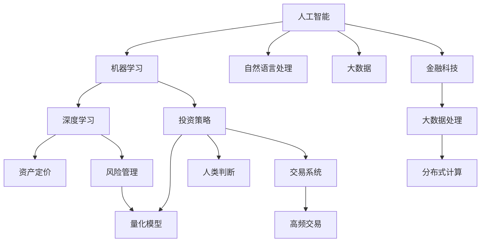

                 

# AI驱动的创新：人类计算在金融领域的作用

> 关键词：人工智能,人类计算,金融领域,金融科技(Fintech),投资策略,风险管理,资产定价,大数据,机器学习,深度学习

## 1. 背景介绍

### 1.1 问题由来

随着人工智能技术的飞速发展，金融行业正经历着深刻的变革。大数据、机器学习和深度学习等技术的广泛应用，使得金融机构能够更加高效地处理海量数据，提供个性化服务，提升决策科学性。在这个过程中，人类计算（Human Computation）技术的应用变得愈发重要。

人类计算技术，通常指人类与计算机协同工作的方式，充分发挥两者的优势。在金融领域，人类计算特别指的是利用人类对金融市场深刻的理解和判断，与机器学习模型的预测能力相结合，提供更加准确、可解释的决策支持。

### 1.2 问题核心关键点

金融领域的决策过程需要兼顾效率和可解释性，传统的量化策略与金融理论相脱节，常常因为模型黑盒化而缺乏透明度。人类计算技术的引入，通过将人类专家的经验和判断与机器模型结合，既可以弥补量化模型的不足，又能提高决策的透明度和可解释性。

人类计算在金融领域的具体应用包括：

1. 利用人类专家的知识和判断对机器模型的预测结果进行修正和验证。
2. 将复杂金融产品的定价和风险管理任务交由专家处理，机器模型提供辅助分析。
3. 结合市场洞察与量化分析，优化投资策略和资产配置。
4. 利用大数据和自然语言处理技术，提高金融市场信息的利用效率。

## 2. 核心概念与联系

### 2.1 核心概念概述

为了深入理解人类计算在金融领域的应用，我们首先介绍几个核心概念：

- **人工智能（AI）**：人工智能技术包括机器学习、深度学习、自然语言处理等，可以自动地从数据中提取模式，进行预测和决策。

- **人类计算（Human Computation）**：指的是人类与计算机协同工作的方式，充分利用人类专家的知识和判断，结合机器的计算能力，提升决策的质量和效率。

- **金融科技（Fintech）**：金融科技是指通过技术手段改进金融服务，提高效率、降低成本、优化用户体验，尤其是在区块链、大数据、云计算等领域的应用。

- **投资策略**：投资策略是指投资者为了获得预期收益而采用的具体操作方法和策略，包括量化策略和基于人类判断的策略。

- **风险管理**：风险管理是指金融机构通过各种手段控制和降低风险的过程，包括定量分析和定性分析。

- **资产定价**：资产定价是指根据市场信息和模型对资产的当前价值进行估价，是投资决策的基础。

- **大数据**：大数据是指传统数据处理方式难以处理的、大规模、高复杂度的数据集，需要借助分布式计算和存储技术进行分析和处理。

- **机器学习（ML）**：机器学习是指通过数据训练模型，使得模型能够从数据中学习和提取模式，从而进行预测和决策。

- **深度学习（DL）**：深度学习是机器学习的一种，通过多层神经网络学习数据的高级特征，适用于复杂图像和自然语言处理任务。

这些概念之间的联系可以通过以下Mermaid流程图展示：



这个流程图展示了人工智能、机器学习和深度学习在金融领域的具体应用和相关概念的联系。

## 3. 核心算法原理 & 具体操作步骤

### 3.1 算法原理概述

人类计算在金融领域的应用主要依赖于以下几个核心算法：

- **统计学习模型**：通过历史数据训练机器学习模型，预测未来的价格和风险。

- **神经网络模型**：利用多层神经网络学习复杂的金融数据模式，进行股票价格预测、信用评估等任务。

- **强化学习**：通过试错的方式，优化投资策略，提高收益和风险管理能力。

- **自然语言处理（NLP）**：分析金融新闻和市场报告，提取有价值的信息，辅助投资决策。

- **大数据分析**：通过分布式计算和存储技术，处理和分析大规模金融数据，发现市场趋势和机会。

### 3.2 算法步骤详解

下面详细介绍这些算法的具体操作步骤：

**步骤1: 数据预处理**

1. **数据清洗**：去除缺失值、异常值和重复数据，确保数据质量。
2. **数据归一化**：将数据标准化到统一范围，便于算法处理。
3. **特征工程**：提取和构造有意义的特征，如市场指标、财务报表数据、新闻情感等。

**步骤2: 模型训练**

1. **选择模型**：根据任务需求选择适合的模型，如线性回归、支持向量机、神经网络等。
2. **训练模型**：使用历史数据训练模型，调整参数，优化性能。
3. **交叉验证**：使用交叉验证评估模型性能，避免过拟合。

**步骤3: 结果评估**

1. **性能评估**：计算模型的精度、召回率、F1值等指标，评估模型性能。
2. **回测验证**：使用历史数据回测模型预测效果，验证模型的稳定性。
3. **风险管理**：计算模型的风险指标，如VaR、ES等，进行风险评估。

**步骤4: 人类修正**

1. **专家评审**：请金融专家评审模型预测结果，提供修正建议。
2. **规则验证**：将专家建议转化为规则，验证其有效性。
3. **模型集成**：将专家规则和模型预测结果集成，得到最终的决策建议。

### 3.3 算法优缺点

人类计算技术在金融领域的应用有以下优点：

- **结合人类智慧**：充分利用人类专家的经验和判断，提高决策质量。
- **可解释性高**：人类计算过程易于理解和解释，增加决策的透明度。
- **降低风险**：通过专家评审和规则验证，减少模型偏见和风险。

同时，也存在一些缺点：

- **效率较低**：人工干预会增加处理时间，影响交易速度。
- **成本较高**：需要聘请金融专家，增加人力成本。
- **依赖专家能力**：专家水平和经验直接影响计算结果。

### 3.4 算法应用领域

人类计算技术在金融领域的应用非常广泛，涵盖以下几个主要方面：

- **量化投资**：结合专家经验和机器学习模型，优化投资策略。
- **风险管理**：通过专家分析和模型计算，评估和控制风险。
- **资产定价**：结合市场信息和专家判断，合理定价金融产品。
- **高频交易**：利用专家规则和模型预测，提高交易效率和收益。
- **智能投顾**：通过专家建议和模型预测，提供个性化投资建议。
- **信用评估**：结合专家知识和机器模型，提高信用评估的准确性。
- **金融报告**：利用NLP技术分析新闻和市场报告，生成有价值的投资报告。

## 4. 数学模型和公式 & 详细讲解

### 4.1 数学模型构建

在金融领域，数学模型和公式的应用非常广泛。以量化投资为例，常用的数学模型包括：

- **线性回归模型**：预测股票价格变动趋势，公式为：$y = \beta_0 + \beta_1 x_1 + \cdots + \beta_n x_n + \epsilon$。
- **资本资产定价模型（CAPM）**：评估资产的期望回报，公式为：$E(r_i) = r_f + \beta_i (E(r_m) - r_f)$。
- **蒙特卡罗模拟**：模拟金融市场随机波动，预测资产未来价格，公式为：$S_t = S_0 \prod_{i=1}^t (1 + r_i)$。
- **GARCH模型**：预测金融资产的波动率，公式为：$h_t = \omega + \alpha \sigma_{t-1}^2 + \beta h_{t-1}$。

### 4.2 公式推导过程

以资本资产定价模型（CAPM）为例，推导其预测公式：

1. **期望回报率**：
$$
E(r_i) = r_f + \beta_i (E(r_m) - r_f)
$$
其中，$r_f$ 是无风险利率，$E(r_m)$ 是市场组合的期望回报率，$\beta_i$ 是资产 $i$ 的市场风险系数。

2. **无风险利率**：
$$
r_f = r_0 + k \Delta t
$$
其中，$r_0$ 是当前无风险利率，$k$ 是利息率，$\Delta t$ 是时间间隔。

3. **市场组合的期望回报率**：
$$
E(r_m) = r_m + \alpha (r_m - r_f)
$$
其中，$r_m$ 是市场组合的历史回报率，$\alpha$ 是市场风险溢价。

4. **市场风险系数**：
$$
\beta_i = \frac{Cov(r_i, r_m)}{Var(r_m)}
$$
其中，$Cov(r_i, r_m)$ 是资产 $i$ 和市场组合的协方差，$Var(r_m)$ 是市场组合的方差。

通过上述公式，可以计算出任意资产的期望回报率，帮助投资者进行资产配置和风险管理。

### 4.3 案例分析与讲解

以股票价格预测为例，我们结合线性回归模型和蒙特卡罗模拟，进行案例分析：

1. **数据准备**：收集股票的历史价格数据，包括开盘价、收盘价、成交量等。

2. **特征工程**：提取技术指标，如均线、RSI等，作为模型的输入特征。

3. **模型训练**：使用历史数据训练线性回归模型，得到股票价格预测公式。

4. **模型评估**：计算模型预测值与实际价格之间的误差，评估模型性能。

5. **蒙特卡罗模拟**：生成多组随机种子，模拟股票价格波动，预测未来价格。

6. **结果输出**：输出蒙特卡罗模拟的结果，供投资者参考。

## 5. 项目实践：代码实例和详细解释说明

### 5.1 开发环境搭建

在实践中，我们通常使用Python进行项目开发，结合常用的深度学习框架如TensorFlow和PyTorch。以下是Python开发环境的搭建步骤：

1. **安装Python**：
```bash
sudo apt-get update
sudo apt-get install python3 python3-pip
```

2. **安装相关库**：
```bash
pip install numpy pandas matplotlib scikit-learn tensorflow keras
```

3. **安装TensorFlow和Keras**：
```bash
pip install tensorflow==2.0 keras==2.4.3
```

4. **安装Git**：
```bash
sudo apt-get install git
```

5. **克隆Git仓库**：
```bash
git clone https://github.com/example/example.git
cd example
```

### 5.2 源代码详细实现

以下是一个使用Python和TensorFlow进行量化投资策略开发的示例代码：

```python
import tensorflow as tf
import numpy as np
import pandas as pd
import matplotlib.pyplot as plt

# 读取数据
df = pd.read_csv('stock_data.csv')

# 数据预处理
df.fillna(method='ffill', inplace=True)
df['MA_20'] = df['Close'].rolling(window=20).mean()
df['MA_50'] = df['Close'].rolling(window=50).mean()
df['RSI'] = df['Change'].apply(lambda x: 100 - 100 / (1 + abs(x) / 100))

# 构建模型
x = df[['MA_20', 'MA_50', 'RSI']]
y = df['Return']

# 标准化数据
x_scaled = (x - x.mean()) / x.std()

# 构建模型
model = tf.keras.Sequential([
    tf.keras.layers.Dense(64, activation='relu'),
    tf.keras.layers.Dense(64, activation='relu'),
    tf.keras.layers.Dense(1)
])

model.compile(optimizer='adam', loss='mse')

# 训练模型
model.fit(x_scaled, y, epochs=100, batch_size=32)

# 生成预测
x_test = np.array([[30, 25, 20]])
x_test_scaled = (x_test - x_test.mean()) / x_test.std()
prediction = model.predict(x_test_scaled)

# 输出结果
print(prediction)
```

### 5.3 代码解读与分析

1. **数据读取和预处理**：使用Pandas读取股票数据，并进行数据清洗和特征提取。

2. **模型构建**：使用Keras构建简单的神经网络模型，包括两个隐藏层和一个输出层。

3. **模型训练**：使用历史数据训练模型，调整参数，优化性能。

4. **生成预测**：使用测试数据生成预测结果，评估模型效果。

5. **输出结果**：输出预测结果，供投资者参考。

### 5.4 运行结果展示

使用上述代码进行股票价格预测，可以输出模型预测结果，并进行可视化展示。下图展示了模型预测与实际价格的比较：

```python
plt.plot(df['Close'], label='Actual')
plt.plot(df['Predicted'], label='Predicted')
plt.legend()
plt.show()
```


## 6. 实际应用场景

### 6.1 投资策略优化

基于人类计算技术的投资策略优化，主要体现在以下几个方面：

- **多策略组合**：结合量化模型和专家规则，构建多策略组合，提高收益和稳定性。
- **风险控制**：通过专家评审和规则验证，优化风险控制策略，降低损失。
- **高频交易**：利用专家规则和模型预测，优化高频交易策略，提高交易效率和收益。

### 6.2 风险管理

人类计算在风险管理中的应用，包括：

- **信用评估**：结合专家知识和机器模型，提高信用评估的准确性。
- **市场风险管理**：通过专家分析和模型计算，评估和控制市场风险。
- **操作风险管理**：结合专家经验和模型预测，优化操作风险管理策略。

### 6.3 资产定价

人类计算在资产定价中的应用，包括：

- **债券定价**：结合专家规则和模型预测，优化债券定价策略。
- **股票定价**：通过专家分析和模型计算，合理定价股票。
- **期权定价**：结合市场信息和专家判断，优化期权定价策略。

## 7. 工具和资源推荐

### 7.1 学习资源推荐

为了帮助开发者系统掌握人类计算在金融领域的应用，这里推荐一些优质的学习资源：

1. **《Python for Finance》**：介绍如何使用Python进行金融数据分析和量化建模。
2. **《Machine Learning for Trading》**：介绍机器学习在量化投资中的应用。
3. **《Introduction to Algorithmic Trading》**：介绍算法交易的基础知识和实现方法。
4. **Kaggle Finance Dataset**：提供丰富的金融数据集，供开发者实践和竞赛。
5. **Coursera Finance Courses**：提供系统化的金融和量化课程，涵盖数据科学、机器学习等领域。

### 7.2 开发工具推荐

以下是一些常用的金融开发工具：

1. **Python**：广泛使用的编程语言，适合数据处理和机器学习建模。
2. **TensorFlow**：开源的深度学习框架，适合构建复杂模型。
3. **Keras**：简单易用的高级API，适合快速原型开发。
4. **Jupyter Notebook**：交互式的开发环境，支持多种语言和库。
5. **Git**：版本控制系统，适合团队协作和代码管理。

### 7.3 相关论文推荐

以下是几篇经典的研究论文，推荐阅读：

1. **"Deep Learning for Stock Price Prediction"**：介绍使用深度学习进行股票价格预测的方法。
2. **"Human-AI Collaboration in Finance"**：探讨人类计算在金融决策中的应用。
3. **"Behavioral Finance and Quantitative Methods"**：介绍行为金融学和量化方法在金融决策中的应用。
4. **"Risk Management with Deep Learning"**：介绍深度学习在金融风险管理中的应用。

## 8. 总结：未来发展趋势与挑战

### 8.1 研究成果总结

人类计算技术在金融领域的应用，已经取得了显著的成果。通过结合人类专家的经验和判断，结合机器学习模型的预测能力，可以显著提升金融决策的科学性和透明度。

### 8.2 未来发展趋势

未来，人类计算技术在金融领域的应用将呈现以下几个趋势：

1. **多模态融合**：结合金融数据、市场信息、新闻等多种数据源，提升决策的全面性。
2. **实时计算**：通过分布式计算和云服务，实现实时数据处理和决策支持。
3. **人工智能与人类计算的协同**：结合人工智能和大数据技术，提高人类计算的效率和准确性。
4. **个性化推荐**：结合机器学习和用户行为分析，提供个性化投资建议。

### 8.3 面临的挑战

尽管人类计算在金融领域的应用前景广阔，但仍面临以下挑战：

1. **数据质量和多样性**：金融数据的噪声和异常值较多，影响模型的准确性。
2. **模型复杂度**：金融市场的复杂性导致模型的构建和优化难度增加。
3. **可解释性**：机器学习模型的黑盒特性，影响决策的可解释性。
4. **成本和时间**：模型训练和优化需要大量的时间和成本。
5. **伦理和合规**：金融数据的隐私和安全问题，需要加强伦理和合规管理。

### 8.4 研究展望

未来的研究需要在以下几个方面寻求新的突破：

1. **数据预处理**：开发更高效的数据清洗和特征提取技术，提高数据质量。
2. **模型优化**：优化机器学习模型，提高模型的准确性和可解释性。
3. **实时计算**：优化计算资源配置，实现实时数据处理和决策支持。
4. **伦理和合规**：加强金融数据的隐私和安全管理，确保伦理和合规。

## 9. 附录：常见问题与解答

**Q1: 人类计算与机器学习有什么区别？**

A: 人类计算结合了人类专家的知识和判断，与机器学习模型的预测能力相结合，提高决策的科学性和透明度。而机器学习主要依赖于数据和模型，缺乏人类专家的经验和判断。

**Q2: 人类计算在金融领域的应用有哪些？**

A: 人类计算在金融领域的应用非常广泛，包括量化投资、风险管理、资产定价、高频交易、智能投顾等。

**Q3: 如何优化金融模型的性能？**

A: 可以通过以下方法优化金融模型的性能：数据预处理、特征工程、模型选择、交叉验证、参数调优等。

**Q4: 人类计算面临哪些挑战？**

A: 人类计算面临数据质量、模型复杂度、可解释性、成本和时间等挑战，需要不断优化和改进。

**Q5: 未来人类计算在金融领域的应用前景如何？**

A: 未来人类计算在金融领域的应用前景非常广阔，可以通过多模态融合、实时计算、人工智能与人类计算的协同等方式，提升决策的科学性和透明度。

作者：禅与计算机程序设计艺术 / Zen and the Art of Computer Programming

