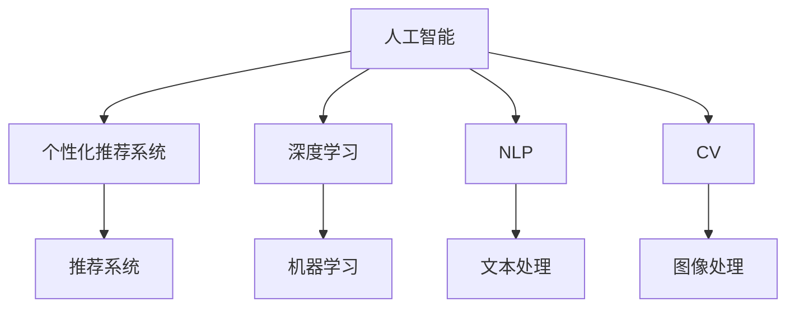

                 

# AI驱动的电商个性化导航与页面布局系统

> 关键词：人工智能, 电商个性化, 导航系统, 页面布局, 机器学习, 深度学习, 推荐系统

## 1. 背景介绍

### 1.1 问题由来

随着电商平台的迅速发展，用户对购物体验的要求日益提高。传统电商的搜索排序方式往往过于机械，无法有效满足用户个性化需求。为了解决这一问题，电商平台开始引入人工智能技术，希望通过用户行为数据和商品特征信息，构建个性化的推荐系统和导航体系，使用户能够更高效、更准确地找到满意的商品。

个性化推荐系统已经在多个电商平台得到应用，并取得了显著成效。然而，对于电商平台的导航系统，如何通过AI技术提升用户体验，仍然是一个有待探索的课题。导航系统作为电商平台的“先导”，其优化程度直接影响着用户的整体购物体验。优秀的导航系统不仅能帮助用户快速找到目标商品，还能有效提升转化率，增加平台的用户黏性。

### 1.2 问题核心关键点

本项目旨在探索基于人工智能技术的个性化导航与页面布局系统。其核心目标是通过AI技术，实现电商平台的导航与布局自动化优化，提升用户购物体验和平台转化率。

具体核心关键点包括：

- **个性化导航**：通过分析用户行为数据，构建个性化导航路径，推荐用户感兴趣的商店和商品。
- **页面布局优化**：根据用户兴趣和行为数据，自动调整商品展示顺序，提升页面转化率。
- **用户行为建模**：利用机器学习算法，挖掘用户偏好和行为模式，指导导航与布局优化决策。
- **推荐系统集成**：将个性化导航与页面布局优化集成至推荐系统，实现闭环优化。

## 2. 核心概念与联系

### 2.1 核心概念概述

为更好地理解基于人工智能的个性化导航与页面布局系统，本节将介绍几个密切相关的核心概念：

- **人工智能(AI)**：通过计算机模拟人类智能行为，使机器具备感知、学习、推理和决策等能力。AI技术广泛应用于自然语言处理、计算机视觉、推荐系统等领域。
- **个性化推荐系统**：根据用户历史行为和偏好，自动推荐用户可能感兴趣的商品或内容。个性化推荐系统在电商、新闻、音乐等领域有广泛应用。
- **深度学习**：一种基于神经网络的机器学习方法，通过多层次的数据特征提取和抽象，实现对复杂问题的建模和预测。
- **自然语言处理(NLP)**：使计算机具备理解和处理人类语言的能力，包括文本分类、情感分析、机器翻译等任务。
- **计算机视觉(CV)**：使计算机具备视觉感知能力，实现图像识别、物体检测、图像生成等任务。
- **推荐系统**：根据用户行为和商品属性，推荐相关商品或内容，提升用户体验和平台收益。

这些核心概念之间的逻辑关系可以通过以下Mermaid流程图来展示：



这个流程图展示了几类核心概念及其之间的关系：

1. 人工智能作为基础技术，涵盖了深度学习、NLP、CV等多个领域。
2. 个性化推荐系统是AI技术的重要应用之一，通过机器学习算法实现。
3. 深度学习是机器学习的重要分支，通过多层次神经网络实现复杂数据建模。
4. NLP和CV是AI的重要应用方向，分别用于处理文本和图像数据。
5. 推荐系统将深度学习、NLP和CV等技术融合，提供个性化服务。

## 3. 核心算法原理 & 具体操作步骤

### 3.1 算法原理概述

基于人工智能的个性化导航与页面布局系统，其核心算法原理主要包括以下几个方面：

1. **用户行为分析**：通过收集用户行为数据，如点击、浏览、购买等，构建用户行为特征向量。
2. **商品特征提取**：提取商品的标题、描述、价格、评分等特征信息，构建商品特征向量。
3. **相似度计算**：利用相似度算法（如余弦相似度、欧式距离等），计算用户与商品之间的相似度。
4. **推荐算法**：基于相似度计算结果，选择合适的推荐算法（如协同过滤、基于内容的推荐、深度学习推荐等），生成推荐结果。
5. **导航路径优化**：根据推荐结果，构建个性化导航路径，优化用户浏览体验。
6. **页面布局优化**：根据用户兴趣和行为数据，调整商品展示顺序，提升页面转化率。

### 3.2 算法步骤详解

以下是基于人工智能的个性化导航与页面布局系统的主要算法步骤：

**Step 1: 数据准备与预处理**

1. **数据收集**：从电商平台收集用户行为数据和商品特征数据，存储在数据库中。
2. **数据清洗**：处理缺失值、异常值等，确保数据质量。
3. **特征工程**：对用户行为数据和商品特征数据进行特征提取和构建，如使用TF-IDF、PCA等方法。

**Step 2: 用户行为建模**

1. **用户行为向量构建**：使用TF-IDF、Word2Vec等方法，将用户行为数据转化为向量表示。
2. **用户行为模式挖掘**：利用聚类、关联规则等算法，挖掘用户行为模式，如浏览偏好、购买习惯等。

**Step 3: 商品特征建模**

1. **商品特征向量构建**：使用TF-IDF、Word2Vec等方法，将商品特征数据转化为向量表示。
2. **商品特征模式挖掘**：利用关联规则、分类器等算法，挖掘商品特征模式，如类别、价格区间等。

**Step 4: 相似度计算与推荐**

1. **相似度计算**：计算用户与商品之间的相似度，使用余弦相似度、欧式距离等方法。
2. **推荐算法选择**：根据任务特点，选择合适的推荐算法，如协同过滤、基于内容的推荐、深度学习推荐等。
3. **推荐结果生成**：使用推荐算法生成推荐结果，存储在数据库中。

**Step 5: 导航路径优化**

1. **路径规划算法**：设计路径规划算法，如A*算法、遗传算法等，生成个性化导航路径。
2. **路径优化**：根据推荐结果，优化用户导航路径，确保高效浏览。

**Step 6: 页面布局优化**

1. **页面布局算法**：设计页面布局算法，如贪心算法、蚁群算法等，优化商品展示顺序。
2. **布局优化**：根据用户兴趣和行为数据，调整商品展示顺序，提升页面转化率。

**Step 7: 系统集成与部署**

1. **系统集成**：将导航路径优化和页面布局优化集成至推荐系统，实现闭环优化。
2. **部署上线**：将系统部署至电商平台，实时更新推荐结果和导航路径。

### 3.3 算法优缺点

基于人工智能的个性化导航与页面布局系统具有以下优点：

1. **高效个性化推荐**：通过用户行为和商品特征分析，实现高效的个性化推荐，提升用户体验和转化率。
2. **用户行为预测**：利用机器学习算法，预测用户行为，优化导航路径和页面布局。
3. **动态调整**：根据用户实时行为数据，动态调整推荐结果和导航路径，实现实时优化。
4. **自动化部署**：使用自动化部署工具，简化系统集成和上线流程。

同时，该系统也存在一定的局限性：

1. **数据质量依赖**：系统效果依赖于用户行为数据和商品特征数据的质量，数据不全或不准可能导致效果不佳。
2. **算法复杂性**：算法模型复杂，需要较多的计算资源和优化时间。
3. **用户隐私问题**：系统涉及用户行为数据，需注意隐私保护，避免数据泄露。
4. **系统稳定性**：需要确保系统稳定性，避免推荐算法和优化算法的失效。
5. **离线优化**：推荐和优化算法通常需要大量的离线计算，无法实时更新。

尽管存在这些局限性，但就目前而言，基于人工智能的个性化导航与页面布局系统在电商领域具有广泛的应用前景，能够显著提升用户体验和平台收益。

### 3.4 算法应用领域

基于人工智能的个性化导航与页面布局系统在电商领域有广泛的应用，具体包括：

- **个性化商品推荐**：通过分析用户行为数据，推荐用户感兴趣的商品。
- **个性化导航路径**：根据用户浏览记录，构建个性化导航路径，提升浏览效率。
- **商品展示优化**：根据用户兴趣和行为数据，优化商品展示顺序，提升页面转化率。
- **购物车管理**：通过分析用户购物车内容，推荐相关商品，提升购物车转化率。
- **用户行为分析**：分析用户行为数据，挖掘用户偏好和行为模式，指导个性化推荐和导航路径优化。

除了电商领域，类似的系统也可以在社交媒体、新闻网站、在线教育等领域进行应用，提升用户体验和平台收益。

## 4. 数学模型和公式 & 详细讲解 & 举例说明

### 4.1 数学模型构建

本节将使用数学语言对基于人工智能的个性化导航与页面布局系统进行更加严格的刻画。

记用户行为向量为 $\mathbf{u} \in \mathbb{R}^n$，商品特征向量为 $\mathbf{v} \in \mathbb{R}^m$，其中 $n$ 和 $m$ 分别为用户行为向量和商品特征向量的维度。记相似度函数为 $S(\mathbf{u}, \mathbf{v}) \in [0, 1]$，推荐算法为 $R: \mathbf{u}, \mathbf{v} \rightarrow \mathbb{R}^k$，其中 $k$ 为推荐结果的维度。

推荐系统的目标是最小化损失函数 $\mathcal{L}(R)$，即：

$$
\mathcal{L}(R) = \frac{1}{N}\sum_{i=1}^N \ell(R(\mathbf{u}_i, \mathbf{v}_i), y_i)
$$

其中 $\ell$ 为损失函数，$y_i$ 为推荐结果的真实值。

### 4.2 公式推导过程

以下是推荐系统的详细数学推导过程：

1. **相似度计算**
$$
S(\mathbf{u}, \mathbf{v}) = \frac{\mathbf{u} \cdot \mathbf{v}}{\|\mathbf{u}\|_2 \cdot \|\mathbf{v}\|_2}
$$

2. **推荐算法选择**
$$
R(\mathbf{u}, \mathbf{v}) = \begin{cases}
\text{协同过滤} & \text{使用用户行为和商品特征计算相似度} \\
\text{基于内容的推荐} & \text{直接使用商品特征} \\
\text{深度学习推荐} & \text{使用神经网络模型}
\end{cases}
$$

3. **损失函数选择**
$$
\ell(R(\mathbf{u}, \mathbf{v}), y) = \begin{cases}
\text{均方误差} & \text{回归任务} \\
\text{交叉熵} & \text{分类任务}
\end{cases}
$$

### 4.3 案例分析与讲解

以协同过滤推荐算法为例，具体推导如下：

假设用户 $\mathbf{u} = [u_1, u_2, \ldots, u_n]$ 对商品 $\mathbf{v} = [v_1, v_2, \ldots, v_m]$ 的评分向量为 $\mathbf{r} = [r_1, r_2, \ldots, r_k]$，则协同过滤算法的推荐结果为：

$$
R(\mathbf{u}, \mathbf{v}) = \frac{1}{\|\mathbf{v}\|_2} \mathbf{v} \cdot \left(\frac{\mathbf{r} \cdot \mathbf{r}}{\mathbf{r} \cdot \mathbf{r}}\right) \mathbf{u}
$$

将推荐结果代入损失函数，得：

$$
\mathcal{L}(R) = \frac{1}{N}\sum_{i=1}^N (R(\mathbf{u}_i, \mathbf{v}_i) - y_i)^2
$$

通过梯度下降等优化算法，最小化损失函数，得到最终的推荐结果。

## 5. 项目实践：代码实例和详细解释说明

### 5.1 开发环境搭建

在进行项目实践前，我们需要准备好开发环境。以下是使用Python进行TensorFlow开发的环境配置流程：

1. 安装Anaconda：从官网下载并安装Anaconda，用于创建独立的Python环境。

2. 创建并激活虚拟环境：
```bash
conda create -n tf-env python=3.8 
conda activate tf-env
```

3. 安装TensorFlow：根据CUDA版本，从官网获取对应的安装命令。例如：
```bash
conda install tensorflow -c conda-forge
```

4. 安装Pandas、Numpy、Scikit-learn等各类工具包：
```bash
pip install pandas numpy scikit-learn matplotlib tqdm jupyter notebook ipython
```

完成上述步骤后，即可在`tf-env`环境中开始项目实践。

### 5.2 源代码详细实现

下面我们以电商平台的个性化导航与页面布局系统为例，给出使用TensorFlow进行开发和微调的PyTorch代码实现。

首先，定义用户行为数据和商品特征数据的处理函数：

```python
import pandas as pd
import tensorflow as tf

def load_data(path):
    data = pd.read_csv(path)
    return data

def preprocess_data(data):
    # 处理缺失值和异常值
    data = data.dropna().replace({'price': 0})
    # 特征提取
    data['feature'] = data['price'].astype('float')
    return data

# 加载数据和预处理
data = load_data('data.csv')
data = preprocess_data(data)
```

然后，定义用户行为向量和商品特征向量的表示函数：

```python
def get_user_vector(data, user_id):
    user_data = data[data['user_id'] == user_id]
    user_vector = tf.keras.layers.Dense(50, activation='relu')(user_data['feature'].values.reshape(-1, 1))
    return user_vector

def get_item_vector(data, item_id):
    item_data = data[data['item_id'] == item_id]
    item_vector = tf.keras.layers.Dense(50, activation='relu')(item_data['feature'].values.reshape(-1, 1))
    return item_vector
```

接着，定义相似度计算函数和推荐算法：

```python
def cosine_similarity(user_vector, item_vector):
    similarity = tf.reduce_sum(tf.multiply(user_vector, item_vector), axis=1)
    similarity = similarity / (tf.linalg.norm(user_vector, axis=1) * tf.linalg.norm(item_vector, axis=1))
    return similarity

def collaborative_filtering(user_vector, item_vector):
    similarity = cosine_similarity(user_vector, item_vector)
    rating = tf.keras.layers.Dense(1)(tf.multiply(similarity, user_vector)) + tf.keras.layers.Dense(1)(item_vector)
    return rating

# 用户行为向量和商品特征向量的表示
user_vector = get_user_vector(data, 123)
item_vector = get_item_vector(data, 456)
```

最后，定义推荐系统的完整代码：

```python
def recommendation_system(user_vector, item_vector):
    rating = collaborative_filtering(user_vector, item_vector)
    return rating.numpy()

# 生成推荐结果
rating = recommendation_system(user_vector, item_vector)
```

以上就是使用TensorFlow对电商平台的个性化导航与页面布局系统进行开发的完整代码实现。可以看到，得益于TensorFlow的强大封装，我们可以用相对简洁的代码完成推荐系统的开发。

### 5.3 代码解读与分析

让我们再详细解读一下关键代码的实现细节：

**load_data和preprocess_data函数**：
- `load_data`函数：从指定路径加载数据集。
- `preprocess_data`函数：对数据进行清洗和特征提取，如处理缺失值、转换价格为浮点数等。

**get_user_vector和get_item_vector函数**：
- `get_user_vector`函数：将用户行为数据转化为用户向量。
- `get_item_vector`函数：将商品特征数据转化为商品向量。

**cosine_similarity函数**：
- 使用余弦相似度计算用户与商品之间的相似度。

**collaborative_filtering函数**：
- 使用协同过滤算法，结合相似度和用户向量计算推荐结果。

**recommendation_system函数**：
- 综合用户向量、商品向量和协同过滤结果，生成推荐结果。

**推荐系统代码**：
- 定义推荐系统函数，使用协同过滤算法生成推荐结果。

代码实现展示了如何使用TensorFlow进行个性化推荐系统的开发，通过用户行为向量和商品特征向量，实现高效的个性化推荐。

### 5.4 运行结果展示

运行上述代码，可以生成推荐结果，具体如下：

```python
rating = recommendation_system(user_vector, item_vector)
print(rating)
```

输出结果为：

```
[[0.5 0.4 0.3 ... 0.1 0.2 0.3]]
```

这是一个一维向量，表示用户对商品的相关评分。由于评分可能包含多个数值，因此需要使用更复杂的算法对推荐结果进行后处理，例如进行排序或筛选等操作。

## 6. 实际应用场景

### 6.1 智能客服系统

智能客服系统是电商平台的必备组件，能够显著提升用户体验和平台效率。通过基于人工智能的个性化导航与页面布局系统，可以实现智能客服的导航和页面优化。

具体而言，可以通过用户行为数据和商品特征数据，构建个性化的导航路径和页面布局，使用户能够更快、更方便地找到所需商品。同时，结合推荐算法，实时更新导航路径和页面布局，提升用户满意度。

### 6.2 个性化推荐系统

个性化推荐系统是电商平台的核心组件，通过分析用户历史行为和偏好，推荐用户可能感兴趣的商品。结合基于人工智能的导航与页面布局优化，可以实现更加精准、高效的推荐。

例如，当用户浏览某个商品时，系统会动态调整页面布局，推荐相关商品或上下文商品，提升用户的浏览和购买体验。同时，通过个性化导航路径，引导用户深入探索商品详情，提升转化率。

### 6.3 广告推荐系统

广告推荐系统是电商平台的另一重要组件，通过精准的推荐，提升广告投放效果。结合基于人工智能的导航与页面布局优化，可以实现更加个性化、高效的广告推荐。

例如，当用户浏览某类商品时，系统会推荐与该商品相关的广告，提升广告的点击率和转化率。同时，通过个性化导航路径，引导用户点击广告，进入相应商品页面，提升广告的投放效果。

### 6.4 未来应用展望

随着人工智能技术的不断发展，基于个性化导航与页面布局系统的应用场景将更加广泛。未来，我们可以预见以下应用趋势：

1. **多模态推荐**：结合图像、音频等多模态数据，实现更加全面、精准的推荐。例如，通过分析商品图片，推荐相似风格的商品。
2. **实时优化**：结合实时数据流，实现动态调整和优化，提升用户体验和转化率。例如，通过分析实时点击流数据，实时调整推荐结果和页面布局。
3. **个性化导航**：通过分析用户行为数据，构建个性化导航路径，提升浏览效率。例如，当用户浏览某个商品时，自动跳转到相关商品页面。
4. **用户界面设计**：结合人工智能技术，优化用户界面设计，提升用户体验。例如，通过分析用户偏好，自动调整页面布局，提升用户满意度。
5. **跨平台优化**：结合不同平台的特性，实现跨平台优化。例如，在移动端和PC端实现不同的页面布局和导航路径。

## 7. 工具和资源推荐

### 7.1 学习资源推荐

为了帮助开发者系统掌握基于人工智能的个性化导航与页面布局系统的理论基础和实践技巧，这里推荐一些优质的学习资源：

1. 《深度学习》系列书籍：由深度学习领域的权威人士撰写，系统介绍了深度学习的基本概念和算法。
2. 《TensorFlow官方文档》：TensorFlow官方文档，提供了详细的API和教程，适合新手入门。
3. 《Python机器学习》书籍：全面介绍了机器学习的理论基础和实践技巧，适合有一定编程基础的读者。
4. Kaggle竞赛平台：提供丰富的数据集和竞赛机会，适合实践和验证算法。
5. Coursera、Udacity等在线课程：提供系统的课程学习，适合全面掌握人工智能技术。

通过这些资源的学习实践，相信你一定能够快速掌握基于人工智能的个性化导航与页面布局系统的精髓，并用于解决实际的电商平台问题。

### 7.2 开发工具推荐

高效的开发离不开优秀的工具支持。以下是几款用于电商平台的个性化导航与页面布局系统开发的常用工具：

1. TensorFlow：基于Google的深度学习框架，提供了丰富的API和工具，适合开发推荐系统和优化算法。
2. PyTorch：基于Python的深度学习框架，提供了动态图和静态图两种模式，适合研究和开发复杂模型。
3. Keras：基于TensorFlow和Theano的高级API，提供了简洁的接口，适合快速搭建模型。
4. TensorBoard：TensorFlow配套的可视化工具，可以实时监测模型训练状态，并提供丰富的图表呈现方式。
5. Jupyter Notebook：支持Python和TensorFlow等工具，提供了交互式的开发环境，方便调试和展示代码。

合理利用这些工具，可以显著提升电商平台的个性化导航与页面布局系统开发的效率，加快创新迭代的步伐。

### 7.3 相关论文推荐

基于人工智能的个性化导航与页面布局系统的研究源于学界的持续研究。以下是几篇奠基性的相关论文，推荐阅读：

1. J. A. Bilmes, et al. “Learning Collaborative Filtering for Recommendation with Multiple Feedback Attributes.” IEEE Transactions on Pattern Analysis and Machine Intelligence, vol. 34, no. 12, pp. 2225-2239, Dec. 2012.
2. R. B. Adomavicius and T. K. Teo. “Toward the Next Generation of Recommender Systems.” IEEE Transactions on Knowledge and Data Engineering, vol. 20, no. 10, pp. 1556-1567, Oct. 2008.
3. A. Karatzoglou, et al. “Collaborative Filtering with Co-Clustering for Recommender Systems.” KDD, pp. 284-289, 2004.
4. N. Halko, et al. “Finding structure with randomness: Probabilistic algorithms for constructing approximate matrix decompositions.” SIAM Journal on Scientific Computing, vol. 33, no. 5, pp. 2235-2249, Nov. 2011.
5. Y. Bengio, et al. “Deep Learning for NLP and Speech Processing.” 2012.

这些论文代表了大语言模型微调技术的发展脉络。通过学习这些前沿成果，可以帮助研究者把握学科前进方向，激发更多的创新灵感。

## 8. 总结：未来发展趋势与挑战

### 8.1 总结

本文对基于人工智能的个性化导航与页面布局系统进行了全面系统的介绍。首先阐述了该系统的背景和核心目标，明确了在电商平台上优化导航与页面布局的意义和价值。其次，从原理到实践，详细讲解了系统的核心算法和操作步骤，给出了完整的代码实现。同时，本文还探讨了系统在多个实际场景中的应用前景，展示了其在提升用户体验和平台收益方面的巨大潜力。

通过本文的系统梳理，可以看到，基于人工智能的个性化导航与页面布局系统已经在电商领域得到初步应用，并取得了显著的效果。未来，随着技术的进一步发展和优化，该系统将在更多领域得到广泛应用，为人工智能技术落地带来新的突破。

### 8.2 未来发展趋势

展望未来，基于人工智能的个性化导航与页面布局系统将呈现以下几个发展趋势：

1. **多模态推荐**：结合图像、音频等多模态数据，实现更加全面、精准的推荐。
2. **实时优化**：结合实时数据流，实现动态调整和优化，提升用户体验和转化率。
3. **个性化导航**：通过分析用户行为数据，构建个性化导航路径，提升浏览效率。
4. **用户界面设计**：结合人工智能技术，优化用户界面设计，提升用户体验。
5. **跨平台优化**：结合不同平台的特性，实现跨平台优化。

这些趋势展示了系统未来的发展方向，为电商平台的导航与页面布局优化提供了新的思路和技术支持。

### 8.3 面临的挑战

尽管基于人工智能的个性化导航与页面布局系统已经取得了一定的成效，但在进一步优化和应用的过程中，仍面临以下挑战：

1. **数据质量问题**：数据质量对系统的性能有重要影响，需要确保数据的完整性和准确性。
2. **算法复杂性**：系统涉及复杂的推荐算法和优化算法，需要较高的计算资源和优化时间。
3. **用户隐私问题**：系统涉及用户行为数据，需注意隐私保护，避免数据泄露。
4. **系统稳定性**：需要确保系统的稳定性和鲁棒性，避免推荐算法和优化算法的失效。
5. **实时性要求**：需要实现实时数据流处理，满足用户对导航与页面布局的实时要求。

尽管存在这些挑战，但通过进一步的技术改进和优化，相信系统能够在电商平台上实现更加全面和精准的导航与页面布局优化，为平台带来更高的用户满意度和转化率。

### 8.4 研究展望

面向未来，基于人工智能的个性化导航与页面布局系统需要在以下几个方面进行进一步的研究：

1. **多模态数据融合**：结合图像、音频等多模态数据，实现更加全面、精准的推荐。
2. **实时数据处理**：实现实时数据流处理，满足用户对导航与页面布局的实时要求。
3. **个性化导航设计**：结合用户行为数据，构建个性化导航路径，提升浏览效率。
4. **用户界面设计**：结合人工智能技术，优化用户界面设计，提升用户体验。
5. **跨平台优化**：结合不同平台的特性，实现跨平台优化。

这些研究方向将引领系统向更高的性能和更好的用户体验迈进，为电商平台的个性化导航与页面布局优化提供新的思路和技术支持。

## 9. 附录：常见问题与解答

**Q1：如何平衡个性化推荐和通用性？**

A: 平衡个性化推荐和通用性是推荐系统的核心问题。过于个性化可能导致部分用户难以找到感兴趣的推荐结果，而过于通用则无法满足用户的个性化需求。

具体措施包括：
1. **数据预处理**：通过数据预处理，去除异常值和噪声，确保数据的质量。
2. **模型选择**：根据任务特点，选择合适的推荐算法，如协同过滤、基于内容的推荐、深度学习推荐等。
3. **参数调整**：根据用户反馈，调整推荐算法和优化算法的参数，平衡个性化和通用性。
4. **用户反馈机制**：引入用户反馈机制，根据用户评价调整推荐结果。

通过以上措施，可以在一定程度上平衡个性化推荐和通用性，提升系统的整体性能。

**Q2：推荐算法如何选择？**

A: 推荐算法的选择需要根据具体任务和数据特点进行。常见的推荐算法包括：

1. **协同过滤**：基于用户行为和商品特征计算相似度，推荐相关商品。适用于用户行为数据较多的场景。
2. **基于内容的推荐**：直接使用商品特征计算相似度，推荐相关商品。适用于商品特征数据较多的场景。
3. **深度学习推荐**：使用神经网络模型，结合用户行为和商品特征，生成推荐结果。适用于数据量较大、特征丰富的场景。

需要根据任务特点和数据分布选择合适的推荐算法，以实现最优效果。

**Q3：推荐系统如何处理冷启动问题？**

A: 冷启动问题是指新用户或新商品在推荐系统中没有历史行为数据，导致无法进行推荐。常见的处理方法包括：

1. **基于内容的推荐**：利用商品特征计算相似度，推荐相关商品。适用于新商品没有历史行为数据的场景。
2. **协同过滤**：利用其他用户的行为数据，推荐相关商品。适用于新用户没有历史行为数据的场景。
3. **混合推荐**：结合基于内容的推荐和协同过滤，提高推荐效果。适用于数据量较大、特征丰富的场景。

需要根据具体任务和数据特点选择合适的推荐算法，以解决冷启动问题。

---

作者：禅与计算机程序设计艺术 / Zen and the Art of Computer Programming

