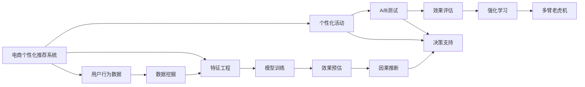

                 

# AI驱动的电商个性化活动效果预估系统

> 关键词：人工智能, 电商, 个性化推荐, 活动效果评估, 数据驱动

## 1. 背景介绍

在当今的数字化时代，电商行业竞争日趋激烈，商家需要通过精准的用户行为分析和个性化推荐，提升用户体验和转化率。个性化活动（如折扣促销、满减活动、推荐商品）成为了电商营销的重要手段。然而，这些活动的成功与否往往难以预估，效果不佳将带来成本损失。为提升活动策划的科学性和有效性，电商平台纷纷引入AI技术，构建智能化的活动效果预估系统。

本文聚焦于基于AI的电商个性化活动效果预估系统，介绍其实现原理、技术栈和应用场景，希望能为电商运营提供可靠的决策支持，最大化营销投入的回报。

## 2. 核心概念与联系

### 2.1 核心概念概述

为深入理解电商个性化活动效果预估系统，本节将介绍几个关键概念及其联系：

- **电商个性化推荐系统**：通过分析用户行为数据，预测用户可能感兴趣的商品，为用户提供个性化推荐。

- **电商个性化活动**：包括折扣促销、优惠券、满减活动等，旨在吸引用户购买，提升销售额。

- **活动效果预估**：基于用户行为数据和推荐系统输出，预估个性化活动的转化率和效果。

- **A/B测试**：通过对比不同活动方案的效果，找出最优方案。

- **强化学习**：通过试错过程优化活动策略，最大化活动收益。

- **多臂老虎机(MAB)**：优化多组活动策略的表现，选择效果最好的策略。

- **模型评估指标**：如点击率（CTR）、转化率（CVR）、ROI等，衡量活动效果。

- **因果推断**：分析活动带来的真实影响，而非样本偏差。

这些概念之间通过数据驱动的决策过程联系在一起，形成一个完整的电商个性化活动效果预估系统。

### 2.2 核心概念原理和架构的 Mermaid 流程图



## 3. 核心算法原理 & 具体操作步骤

### 3.1 算法原理概述

基于AI的电商个性化活动效果预估系统，本质上是一个预测模型，旨在通过用户行为数据，预测个性化活动带来的转化效果。其核心算法包括推荐模型、活动策略优化和多臂老虎机算法。

**推荐模型**：利用协同过滤、深度学习等算法，预测用户对不同商品的兴趣度，生成个性化推荐列表。

**活动策略优化**：通过A/B测试等实验方法，比较不同活动方案的效果，优化活动策略。

**多臂老虎机**：模拟老虎机游戏，针对多种活动策略进行对比实验，选择效果最佳的策略执行。

### 3.2 算法步骤详解

#### 3.2.1 数据准备

- **数据收集**：收集用户的浏览、点击、购买等行为数据，商品信息、价格、类别等属性数据。
- **数据清洗**：去除异常值、缺失值，处理数据重复等问题。
- **特征工程**：提取用户特征、商品特征、行为特征等，设计合适的特征表示。

#### 3.2.2 模型训练

- **推荐模型训练**：基于用户历史行为数据，训练推荐模型，生成个性化推荐列表。
- **活动策略训练**：通过历史活动数据，训练策略优化模型，优化活动策略。

#### 3.2.3 效果评估

- **A/B测试**：设计多个活动方案，随机分配用户到不同组，收集用户行为数据，对比不同方案的效果。
- **多臂老虎机算法**：针对不同活动策略进行对比实验，选择效果最佳的策略执行。

#### 3.2.4 结果分析

- **因果推断**：分析活动带来的真实影响，排除样本偏差。
- **结果反馈**：将结果反馈给运营团队，优化活动策略。

### 3.3 算法优缺点

#### 3.3.1 优点

- **提升转化率**：通过个性化推荐和活动优化，提升用户购买转化率。
- **优化资源投入**：精准的活动策划，避免资源浪费。
- **实时决策支持**：系统能够实时分析数据，提供决策支持。
- **自动化运营**：无需人工干预，自动优化活动策略。

#### 3.3.2 缺点

- **数据依赖**：需要大量的用户行为数据和商品信息，对数据质量要求高。
- **模型复杂**：推荐模型和活动优化模型较为复杂，需要较高的计算资源。
- **效果预测**：个性化活动效果受多因素影响，预测准确度有限。
- **过度优化**：过度追求自动化和自动化，可能忽视实际运营经验。

### 3.4 算法应用领域

基于AI的电商个性化活动效果预估系统，可以广泛应用于以下领域：

- **电商运营**：电商平台运营团队，通过系统进行活动策划和效果评估。
- **市场营销**：市场营销团队，通过系统优化广告和促销策略。
- **客户服务**：客服团队，通过系统提供个性化推荐和活动信息。
- **数据分析**：数据科学团队，通过系统分析用户行为和活动效果。
- **广告投放**：广告投放团队，通过系统优化广告投放策略。

## 4. 数学模型和公式 & 详细讲解

### 4.1 数学模型构建

假设用户行为数据为 $D = \{(x_i, y_i)\}_{i=1}^N$，其中 $x_i$ 为用户行为特征， $y_i$ 为用户是否点击或购买（二分类问题）。目标是训练一个推荐模型 $F$，将用户行为特征映射到推荐概率 $P(x_i)$。

推荐模型 $F$ 可以表示为：

$$
F(x_i; \theta) = \text{sigmoid}(Wx_i + b)
$$

其中，$\theta$ 为模型参数，$W$ 和 $b$ 为权重和偏置。

### 4.2 公式推导过程

- **损失函数**：采用二分类交叉熵损失函数，表示预测值与真实标签之间的差异：

$$
L(y_i, P(x_i)) = -(y_i \log P(x_i) + (1-y_i) \log (1-P(x_i)))
$$

- **梯度计算**：通过链式法则，计算损失函数对模型参数的梯度：

$$
\frac{\partial L}{\partial \theta} = \frac{\partial}{\partial \theta} \left[ -(y_i \log P(x_i) + (1-y_i) \log (1-P(x_i)) \right]
$$

- **模型训练**：使用随机梯度下降(SGD)等优化算法，更新模型参数：

$$
\theta \leftarrow \theta - \eta \frac{\partial L}{\partial \theta}
$$

其中，$\eta$ 为学习率。

### 4.3 案例分析与讲解

以电商推荐模型为例，假设一个用户 $i$ 的行为数据为 $x_i = [浏览商品1, 浏览商品2, 点击商品3]$，模型输出 $P(x_i) = 0.9$，表示用户有90%的概率购买商品3。实际标签 $y_i = 1$，表示用户确实购买了商品3。根据交叉熵损失公式，损失值为：

$$
L(y_i, P(x_i)) = -1 \times \log 0.9 - 0 \times \log 0.1 = 0.1053
$$

通过反向传播，计算梯度并更新模型参数，最小化损失函数。

## 5. 项目实践：代码实例和详细解释说明

### 5.1 开发环境搭建

- **环境准备**：安装Python、TensorFlow、Scikit-Learn等工具。
- **数据集准备**：收集用户行为数据、商品信息等。
- **模型选择**：选择合适的推荐模型（如深度学习模型）。

### 5.2 源代码详细实现

```python
import tensorflow as tf
from sklearn.metrics import accuracy_score
from tensorflow.keras.models import Sequential
from tensorflow.keras.layers import Dense

# 数据准备
X_train, y_train, X_test, y_test = load_data()

# 模型构建
model = Sequential()
model.add(Dense(64, input_dim=X_train.shape[1], activation='relu'))
model.add(Dense(1, activation='sigmoid'))

# 模型编译
model.compile(loss='binary_crossentropy', optimizer='adam', metrics=['accuracy'])

# 模型训练
model.fit(X_train, y_train, epochs=10, batch_size=32)

# 模型评估
y_pred = model.predict(X_test)
accuracy = accuracy_score(y_test, (y_pred > 0.5).round())
print('Accuracy:', accuracy)
```

### 5.3 代码解读与分析

- **数据加载**：使用Scikit-Learn加载数据集，分为训练集和测试集。
- **模型构建**：使用TensorFlow构建推荐模型，包含一个隐藏层和一个输出层。
- **模型编译**：指定损失函数、优化器和评估指标。
- **模型训练**：使用fit方法训练模型，设定训练轮数和批量大小。
- **模型评估**：使用predict方法进行预测，计算模型在测试集上的准确率。

## 6. 实际应用场景

### 6.1 电商推荐系统

电商推荐系统是电商个性化活动效果预估系统的核心应用之一。通过推荐模型，电商平台可以精准推荐商品，提升用户体验和转化率。

**实际应用**：某电商平台通过推荐模型，根据用户浏览历史和行为特征，推荐用户可能感兴趣的商品。活动效果预估系统则实时分析用户点击率和购买率，提供活动优化建议。

### 6.2 优惠券活动

优惠券活动是电商常用的促销手段。通过推荐模型预测用户对优惠券的反应，优化优惠券的推出时机和范围。

**实际应用**：某电商平台通过推荐模型，预测不同用户对优惠券的反应。活动效果预估系统分析不同优惠券对转化率的影响，优化优惠券的设计和发放。

### 6.3 广告投放

广告投放是电商营销的重要手段。通过推荐模型预测用户对广告的响应，优化广告投放策略。

**实际应用**：某电商平台通过推荐模型，预测用户对不同广告的反应。活动效果预估系统分析不同广告策略的效果，优化广告投放预算和时段。

## 7. 工具和资源推荐

### 7.1 学习资源推荐

- **推荐系统基础**：《推荐系统实战》一书，系统介绍推荐系统原理和实践。
- **深度学习基础**：《深度学习》一书，涵盖深度学习基本概念和算法。
- **强化学习基础**：《强化学习》一书，介绍强化学习基本概念和算法。
- **多臂老虎机算法**：《多臂老虎机理论》一书，介绍多臂老虎机算法原理和应用。
- **因果推断基础**：《因果推断》一书，介绍因果推断基本概念和算法。

### 7.2 开发工具推荐

- **深度学习框架**：TensorFlow、PyTorch等。
- **数据处理工具**：Pandas、NumPy等。
- **模型评估工具**：Scikit-Learn、TensorBoard等。
- **自动化实验工具**：A/B测试工具、强化学习工具等。
- **多臂老虎机算法实现**：PyBandit等。

### 7.3 相关论文推荐

- **推荐系统论文**：“《推荐系统前十年的回顾与展望》”，Jiawei Han等人，介绍推荐系统基础理论和最新进展。
- **强化学习论文**：“《深度强化学习》”，Ian Goodfellow等人，介绍深度强化学习算法和应用。
- **多臂老虎机论文**：“《多臂老虎机理论与实践》”，Daniel Russo等人，介绍多臂老虎机算法和应用。
- **因果推断论文**：“《因果推断基础》”，Peter Spirtes等人，介绍因果推断基本概念和算法。

## 8. 总结：未来发展趋势与挑战

### 8.1 研究成果总结

本文对基于AI的电商个性化活动效果预估系统进行了详细介绍。通过推荐模型、活动优化和多臂老虎机算法，系统能够精准预测个性化活动的效果，提升电商运营效率和用户体验。

### 8.2 未来发展趋势

- **数据驱动**：随着数据收集和处理技术的进步，数据质量将进一步提升，系统将更加精准。
- **自动化**：通过自动化算法，实时优化活动策略，提升运营效率。
- **实时化**：系统将能够实时分析和预测，提供实时决策支持。
- **多模态融合**：结合用户的多模态数据（如图像、视频），提升预测准确度。
- **场景扩展**：系统将拓展到更多电商场景，如社交电商、跨境电商等。

### 8.3 面临的挑战

- **数据隐私**：用户行为数据涉及隐私，需要严格保护。
- **计算资源**：推荐模型和活动优化算法需要较高的计算资源。
- **模型复杂度**：模型复杂度增加，可能导致过拟合等问题。
- **效果评估**：个性化活动效果难以完全量化，需要综合多因素分析。
- **业务协同**：需要与运营团队密切协作，确保系统与业务目标一致。

### 8.4 研究展望

未来，随着AI技术的不断进步，电商个性化活动效果预估系统将更加智能化、精准化和自动化。通过更高级的算法和模型，系统将能够更好地预测活动效果，提升电商运营效率和用户体验。

## 9. 附录：常见问题与解答

**Q1: 如何提升推荐模型的准确率？**

A: 提升推荐模型准确率的关键在于数据质量和模型优化。

- **数据质量**：收集更多、更优质的用户行为数据，涵盖更多行为场景。
- **特征工程**：设计更全面、更有意义的特征，提取用户行为中的有用信息。
- **模型优化**：选择合适的推荐模型，如深度学习、协同过滤等，并进行超参数调优。
- **实时学习**：使用在线学习算法，实时更新模型参数，适应用户行为的变化。

**Q2: 如何优化活动策略？**

A: 优化活动策略需要综合考虑多因素，并进行科学实验。

- **A/B测试**：设计多个活动方案，随机分配用户，收集用户行为数据，对比不同方案的效果。
- **多臂老虎机**：针对不同活动策略进行对比实验，选择效果最佳的策略执行。
- **因果推断**：分析活动带来的真实影响，排除样本偏差。
- **实时反馈**：将结果反馈给运营团队，优化活动策略。

**Q3: 如何保护用户隐私？**

A: 保护用户隐私是电商个性化活动效果预估系统的关键问题。

- **数据匿名化**：去除或模糊化用户个人信息，保护用户隐私。
- **差分隐私**：采用差分隐私算法，限制数据分析结果的泄漏风险。
- **合规审查**：遵守数据隐私法规，如GDPR等，确保用户数据的使用合规。

通过回答这些问题，希望为电商运营团队提供参考，提升个性化活动效果预估系统的实用性。

---

作者：禅与计算机程序设计艺术 / Zen and the Art of Computer Programming

