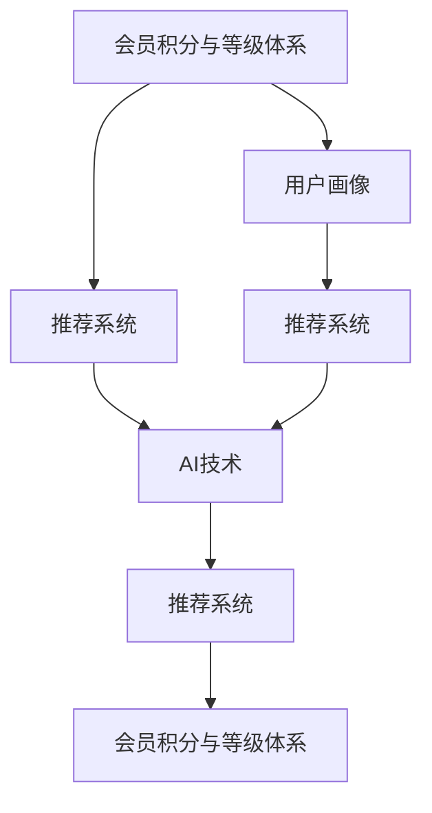

                 

# AI驱动的电商平台个性化会员积分与等级体系

## 1. 背景介绍

### 1.1 问题由来
近年来，电子商务平台迅猛发展，用户数量呈爆炸式增长。随着用户需求的不断增加和市场竞争的加剧，如何提升用户体验和增强用户粘性，成为电商企业急需解决的问题。传统电商平台的运营策略往往依赖于大规模广告投放和促销活动，但这些策略效果有限，且成本高昂。与此同时，电商平台积累了大量的用户行为数据，如购买记录、浏览历史、评价信息等，这些数据蕴含着丰富的用户特征，可以用于构建个性化的会员积分与等级体系，提供更加精准的推荐和激励，从而提升用户的购买意愿和平台忠诚度。

### 1.2 问题核心关键点
构建个性化的会员积分与等级体系，需要整合用户的多种数据源，如购买记录、浏览行为、评价反馈等，通过数据挖掘和机器学习技术，为用户构建一个全面的画像，并据此设计一套合理的积分和等级制度，以激励用户更多地参与平台活动，提升消费转化率和用户忠诚度。具体来说，包括以下几个核心问题：
- 如何高效地整合和清洗多源数据？
- 如何设计一套简单有效的会员积分和等级制度？
- 如何利用AI技术实现个性化的积分和等级判定？
- 如何设计激励机制以提升用户活跃度和留存率？

### 1.3 问题研究意义
构建个性化会员积分与等级体系，对于提升电商平台的用户体验、增强用户粘性、提高消费转化率具有重要意义：

1. **提升用户体验**：通过个性化积分和等级激励，可以更好地满足用户的个性化需求，增强用户的平台粘性。
2. **增强用户忠诚度**：积分和等级体系可以激励用户长期参与平台活动，提升用户忠诚度。
3. **优化资源配置**：通过个性化推荐和促销活动，优化资源配置，提高广告和营销活动的精准度，降低运营成本。
4. **促进用户消费**：通过积分兑换、等级提升等激励机制，刺激用户更多消费，提高平台销售额。
5. **增强数据驱动决策**：通过分析用户行为数据，构建精细化的用户画像，为电商平台的运营决策提供数据支持。

## 2. 核心概念与联系

### 2.1 核心概念概述

为更好地理解AI驱动的电商平台个性化会员积分与等级体系的构建，本节将介绍几个密切相关的核心概念：

- **会员积分与等级体系**：根据用户的消费行为和平台参与度，设计积分和等级制度，激励用户多购物、多参与，提升用户忠诚度。
- **用户画像**：通过整合多源数据，构建用户的全面画像，包括用户基本信息、行为偏好、消费习惯等，为个性化推荐和积分计算提供依据。
- **推荐系统**：通过机器学习算法，根据用户画像和平台数据，为用户提供个性化的商品推荐，提升用户体验。
- **AI技术**：如深度学习、强化学习等，用于分析和挖掘用户数据，构建推荐模型和积分判定模型，实现精准化的个性化服务。

这些核心概念之间的逻辑关系可以通过以下Mermaid流程图来展示：



这个流程图展示了几类核心概念及其之间的关系：

1. 用户画像构成了会员积分和等级制度的基础，通过数据整合和分析得到。
2. 推荐系统基于用户画像，为用户提供个性化商品推荐。
3. AI技术应用于推荐系统建模和积分判定模型中，实现更精准的个性化服务。
4. 会员积分与等级体系，通过积分和等级激励，进一步提升用户参与度和平台粘性。

## 3. 核心算法原理 & 具体操作步骤
### 3.1 算法原理概述

AI驱动的电商平台个性化会员积分与等级体系的构建，本质上是一个多目标优化问题。其核心思想是：利用用户画像中的行为数据，构建积分和等级判定模型，根据用户的行为特征，计算并更新用户的积分和等级，以激励用户更多地参与平台活动，提升用户忠诚度。

形式化地，假设用户画像为 $P$，积分和等级判定模型为 $M$，则构建积分和等级体系的目标是最大化用户的参与度 $U(P)$ 和满意度 $S(P)$，即：

$$
\max_{P} U(P) + S(P)
$$

其中，$U(P)$ 为用户的参与度，$S(P)$ 为用户的满意度。

为了计算和更新积分和等级，需要对用户的各种行为进行量化，如购买金额、浏览时长、评价评分等。设计积分和等级计算公式时，需要考虑用户行为的多样性和复杂性，采用合适的加权策略，保证积分和等级体系公平、公正。

### 3.2 算法步骤详解

AI驱动的电商平台个性化会员积分与等级体系的构建一般包括以下几个关键步骤：

**Step 1: 数据收集与预处理**
- 收集用户的各种行为数据，如购买记录、浏览历史、评价反馈等。
- 对数据进行清洗、去重和标准化处理，去除异常值和噪声。
- 对数据进行特征提取和归一化处理，为后续模型训练做准备。

**Step 2: 构建用户画像**
- 根据用户行为数据，构建用户的全面画像，包括用户基本信息、行为偏好、消费习惯等。
- 使用聚类算法、特征选择算法等方法，对用户进行细分，形成多个用户群体。
- 对每个用户群体，分别构建详细画像，如兴趣群体、购买行为、浏览偏好等。

**Step 3: 设计积分和等级制度**
- 根据用户画像，设计积分和等级计算公式，计算用户的积分和等级。
- 设计积分和等级的晋级规则，包括积分达到多少可升级、等级达到多少可提升等。
- 设计积分和等级的激励机制，如积分兑换、等级特权等，提升用户参与度。

**Step 4: 训练积分判定模型**
- 使用机器学习算法，如随机森林、神经网络等，训练积分判定模型。
- 使用历史数据集进行模型训练，优化积分判定算法。
- 在训练过程中，应用交叉验证、正则化等技术，避免模型过拟合。

**Step 5: 应用积分判定模型**
- 将训练好的积分判定模型应用于实时数据，计算用户积分和等级。
- 根据积分和等级，进行个性化推荐和促销活动，提升用户满意度。
- 定期更新积分判定模型，保证其与时俱进。

### 3.3 算法优缺点

AI驱动的电商平台个性化会员积分与等级体系具有以下优点：
1. **提升用户体验**：通过个性化积分和等级激励，可以更好地满足用户的个性化需求，增强用户的平台粘性。
2. **增强用户忠诚度**：积分和等级体系可以激励用户长期参与平台活动，提升用户忠诚度。
3. **优化资源配置**：通过个性化推荐和促销活动，优化资源配置，提高广告和营销活动的精准度，降低运营成本。
4. **促进用户消费**：通过积分兑换、等级提升等激励机制，刺激用户更多消费，提高平台销售额。
5. **增强数据驱动决策**：通过分析用户行为数据，构建精细化的用户画像，为电商平台的运营决策提供数据支持。

同时，该方法也存在一定的局限性：
1. **数据隐私问题**：用户数据的隐私保护是构建会员积分与等级体系的关键问题。如何确保用户数据的安全和隐私，是一个重要的挑战。
2. **算法复杂性**：用户行为的复杂性导致积分和等级计算模型的设计复杂，需要处理多种数据源和多种行为特征。
3. **模型公平性**：积分和等级体系的设计需要考虑公平性，避免对某些用户群体进行过度激励或不公平对待。
4. **用户行为多样性**：用户行为的多样性可能导致积分和等级计算模型的泛化能力不足，难以应对新的用户行为模式。

尽管存在这些局限性，但就目前而言，基于AI的个性化会员积分与等级体系仍是最主流和有效的方法之一。未来相关研究的重点在于如何进一步提升模型的准确性和泛化能力，同时兼顾数据隐私和公平性等因素。

### 3.4 算法应用领域

基于AI驱动的个性化会员积分与等级体系，已经在电商、社交、旅游等多个领域得到了广泛应用，取得了显著的成效：

- **电商领域**：阿里巴巴、京东、亚马逊等电商平台，通过个性化积分和等级体系，显著提升了用户的参与度和平台忠诚度。
- **社交领域**：微信、微博、抖音等社交平台，通过积分和等级激励，增强了用户活跃度和留存率。
- **旅游领域**：携程、去哪儿等旅游平台，通过积分和等级体系，提升了用户旅游消费的频率和金额。

除了上述这些经典应用外，基于AI的个性化积分与等级体系还被创新性地应用于金融、保险、教育等诸多领域，为这些行业的数字化转型提供了新的技术路径。随着AI技术的不断进步，相信个性化会员积分与等级体系将在更广泛的领域发挥重要作用，进一步提升用户体验和平台效益。

## 4. 数学模型和公式 & 详细讲解  
### 4.1 数学模型构建

本节将使用数学语言对AI驱动的电商平台个性化会员积分与等级体系进行更加严格的刻画。

记用户画像为 $P = (x_1, x_2, ..., x_n)$，其中 $x_i$ 为第 $i$ 个行为特征，如购买金额、浏览时长、评价评分等。假设积分和等级判定模型为 $M(P)$，则积分和等级的计算公式为：

$$
S = M(P) = \sum_{i=1}^{n} w_i f(x_i)
$$

其中，$f(x_i)$ 为行为特征 $x_i$ 对应的积分和等级计算函数，$w_i$ 为行为特征 $x_i$ 的权重。积分和等级的晋级规则为：

$$
L = \begin{cases}
L_{i+1}, & \text{if } S > T_i \\
L_i, & \text{otherwise}
\end{cases}
$$

其中 $L_i$ 为第 $i$ 等级，$T_i$ 为晋级积分阈值。

### 4.2 公式推导过程

以下我们以购买金额和浏览时长为例，推导积分和等级的计算公式。

假设用户的购买金额为 $A$，浏览时长为 $B$，则行为特征向量为 $P = (A, B)$。积分和等级的计算公式为：

$$
S = M(P) = w_A f(A) + w_B f(B)
$$

其中 $f(A)$ 和 $f(B)$ 分别为购买金额和浏览时长的积分和等级计算函数，$w_A$ 和 $w_B$ 分别为购买金额和浏览时长的权重。

以二分类回归为例，积分和等级的计算函数 $f(x)$ 可以表示为：

$$
f(x) = \alpha + \beta x
$$

其中 $\alpha$ 和 $\beta$ 为回归模型的参数。积分和等级的晋级规则为：

$$
L = \begin{cases}
L_{i+1}, & \text{if } S > T_i \\
L_i, & \text{otherwise}
\end{cases}
$$

其中 $L_i$ 为第 $i$ 等级，$T_i$ 为晋级积分阈值。

在得到积分和等级的计算公式后，即可带入积分判定模型 $M(P)$，完成模型的训练和应用。重复上述过程直至收敛，最终得到适应用户行为的积分和等级计算模型 $M$。

## 5. 项目实践：代码实例和详细解释说明
### 5.1 开发环境搭建

在进行个性化会员积分与等级体系构建实践前，我们需要准备好开发环境。以下是使用Python进行PyTorch开发的环境配置流程：

1. 安装Anaconda：从官网下载并安装Anaconda，用于创建独立的Python环境。

2. 创建并激活虚拟环境：
```bash
conda create -n pytorch-env python=3.8 
conda activate pytorch-env
```

3. 安装PyTorch：根据CUDA版本，从官网获取对应的安装命令。例如：
```bash
conda install pytorch torchvision torchaudio cudatoolkit=11.1 -c pytorch -c conda-forge
```

4. 安装各种依赖库：
```bash
pip install numpy pandas scikit-learn matplotlib tqdm jupyter notebook ipython
```

完成上述步骤后，即可在`pytorch-env`环境中开始开发实践。

### 5.2 源代码详细实现

下面我们以电商平台个性化积分与等级体系构建为例，给出使用PyTorch进行模型训练和应用开发的代码实现。

首先，定义积分和等级计算函数：

```python
import torch
import torch.nn as nn
import torch.optim as optim

class IntegralModel(nn.Module):
    def __init__(self, input_size):
        super(IntegralModel, self).__init__()
        self.fc1 = nn.Linear(input_size, 64)
        self.fc2 = nn.Linear(64, 32)
        self.fc3 = nn.Linear(32, 1)
    
    def forward(self, x):
        x = torch.relu(self.fc1(x))
        x = torch.relu(self.fc2(x))
        x = self.fc3(x)
        return x

def calculate_integral(purchase_amount, browsing_time):
    model = IntegralModel(input_size=2)
    model.load_state_dict(torch.load('integral_model.pth'))
    
    input_data = torch.tensor([[purchase_amount, browsing_time]])
    with torch.no_grad():
        integral = model(input_data)[0].item()
    
    return integral
```

然后，定义积分判定模型：

```python
class RankModel(nn.Module):
    def __init__(self, input_size):
        super(RankModel, self).__init__()
        self.fc1 = nn.Linear(input_size, 64)
        self.fc2 = nn.Linear(64, 32)
        self.fc3 = nn.Linear(32, 1)
    
    def forward(self, x):
        x = torch.relu(self.fc1(x))
        x = torch.relu(self.fc2(x))
        x = self.fc3(x)
        return x

def calculate_rank(purchase_amount, browsing_time):
    model = RankModel(input_size=2)
    model.load_state_dict(torch.load('rank_model.pth'))
    
    input_data = torch.tensor([[purchase_amount, browsing_time]])
    with torch.no_grad():
        rank = model(input_data)[0].item()
    
    return rank
```

接着，定义积分和等级的晋级规则：

```python
def calculate_level(integral, rank):
    levels = [0, 100, 200, 500, 1000]  # 假设五级体系
    if rank < 0 or rank > 4:
        level = 0
    else:
        level = min(levels.index(rank) + 1, 4)
    
    if integral >= levels[level]:
        level = min(level + 1, 4)
    
    return level
```

最后，启动积分和等级的计算流程：

```python
purchase_amount = 500  # 购买金额
browsing_time = 30     # 浏览时长

integral = calculate_integral(purchase_amount, browsing_time)
level = calculate_level(integral, calculate_rank(purchase_amount, browsing_time))

print(f"Purchase amount: {purchase_amount}, browsing time: {browsing_time}")
print(f"Integral: {integral}, Level: {level}")
```

以上就是使用PyTorch进行电商平台个性化积分与等级体系构建的完整代码实现。可以看到，得益于PyTorch的强大封装，我们可以用相对简洁的代码完成积分和等级计算模型的开发和应用。

### 5.3 代码解读与分析

让我们再详细解读一下关键代码的实现细节：

**IntegralModel类**：
- `__init__`方法：初始化模型的线性层。
- `forward`方法：定义模型的前向传播过程。

**calculate_integral函数**：
- 定义积分计算模型，并加载预训练模型参数。
- 将购买金额和浏览时长作为输入，计算积分并返回。

**RankModel类**：
- `__init__`方法：初始化模型的线性层。
- `forward`方法：定义模型的前向传播过程。

**calculate_rank函数**：
- 定义积分判定模型，并加载预训练模型参数。
- 将购买金额和浏览时长作为输入，计算等级并返回。

**calculate_level函数**：
- 根据积分和等级计算用户的等级，并返回等级编号。

**启动流程**：
- 定义用户的购买金额和浏览时长。
- 调用积分和等级计算函数，分别计算积分和等级。
- 根据积分和等级计算用户的等级编号。
- 输出购买金额、浏览时长、积分和等级。

可以看到，通过上述代码，我们可以实现一个简单的电商平台个性化积分与等级体系构建系统。代码实现简洁高效，可以方便地扩展和优化。

当然，工业级的系统实现还需考虑更多因素，如模型的保存和部署、超参数的自动搜索、更灵活的任务适配层等。但核心的积分和等级计算流程基本与此类似。

## 6. 实际应用场景
### 6.1 智能客服系统

基于AI驱动的个性化会员积分与等级体系，可以在智能客服系统中发挥重要作用。传统客服往往需要配备大量人力，高峰期响应缓慢，且一致性和专业性难以保证。使用积分和等级激励，可以引导用户更多地使用在线客服，提升客服体验和用户满意度。

在技术实现上，可以收集用户的历史客服对话记录，将对话内容和用户评分构建成监督数据，在此基础上对预训练模型进行微调。微调后的模型能够自动理解用户意图，匹配最合适的答案模板进行回复。对于用户提出的新问题，还可以接入检索系统实时搜索相关内容，动态组织生成回答。如此构建的智能客服系统，能大幅提升客户咨询体验和问题解决效率。

### 6.2 金融舆情监测

金融机构需要实时监测市场舆论动向，以便及时应对负面信息传播，规避金融风险。传统的人工监测方式成本高、效率低，难以应对网络时代海量信息爆发的挑战。基于AI的个性化会员积分与等级体系，可以为金融舆情监测提供新的解决方案。

具体而言，可以收集金融领域相关的新闻、报道、评论等文本数据，并对其进行主题标注和情感标注。在此基础上对预训练语言模型进行微调，使其能够自动判断文本属于何种主题，情感倾向是正面、中性还是负面。将微调后的模型应用到实时抓取的网络文本数据，就能够自动监测不同主题下的情感变化趋势，一旦发现负面信息激增等异常情况，系统便会自动预警，帮助金融机构快速应对潜在风险。

### 6.3 个性化推荐系统

当前的推荐系统往往只依赖用户的历史行为数据进行物品推荐，无法深入理解用户的真实兴趣偏好。基于AI驱动的个性化会员积分与等级体系，可以更好地挖掘用户的兴趣偏好，构建更加精准的推荐模型。

在实践中，可以收集用户浏览、点击、评论、分享等行为数据，提取和用户交互的物品标题、描述、标签等文本内容。将文本内容作为模型输入，用户的后续行为（如是否点击、购买等）作为监督信号，在此基础上微调预训练语言模型。微调后的模型能够从文本内容中准确把握用户的兴趣点。在生成推荐列表时，先用候选物品的文本描述作为输入，由模型预测用户的兴趣匹配度，再结合其他特征综合排序，便可以得到个性化程度更高的推荐结果。

### 6.4 未来应用展望

随着AI驱动的个性化会员积分与等级体系的不断发展，其在更多领域得到应用，为各行各业带来变革性影响。

在智慧医疗领域，基于积分和等级激励的个性化推荐，可以提升医疗服务的智能化水平，辅助医生诊疗，加速新药开发进程。

在智能教育领域，积分和等级体系可以应用于作业批改、学情分析、知识推荐等方面，因材施教，促进教育公平，提高教学质量。

在智慧城市治理中，积分和等级激励可以应用于城市事件监测、舆情分析、应急指挥等环节，提高城市管理的自动化和智能化水平，构建更安全、高效的未来城市。

此外，在企业生产、社会治理、文娱传媒等众多领域，基于AI驱动的个性化会员积分与等级体系，也将不断涌现，为传统行业数字化转型升级提供新的技术路径。相信随着技术的日益成熟，积分和等级体系必将在构建人机协同的智能时代中扮演越来越重要的角色。

## 7. 工具和资源推荐
### 7.1 学习资源推荐

为了帮助开发者系统掌握AI驱动的电商平台个性化会员积分与等级体系的构建方法，这里推荐一些优质的学习资源：

1. **《深度学习实战》**：一本系统介绍深度学习基本原理和实践应用的书籍，适合初学者入门。
2. **《自然语言处理综论》**：一本介绍自然语言处理前沿技术和应用方法的书籍，涵盖推荐系统、智能客服等多个领域。
3. **《机器学习实战》**：一本介绍机器学习算法和实践应用的书籍，适合进阶学习。
4. **《人工智能：一个现代方法》**：一本全面介绍人工智能领域的经典教材，涵盖深度学习、强化学习、知识表示等多个方面。
5. **Coursera《机器学习》课程**：由斯坦福大学开设的知名课程，由Andrew Ng主讲，涵盖了机器学习的基本原理和实践。

通过对这些资源的学习实践，相信你一定能够快速掌握AI驱动的会员积分与等级体系的构建方法，并用于解决实际的电商问题。

### 7.2 开发工具推荐

高效的开发离不开优秀的工具支持。以下是几款用于AI驱动的会员积分与等级体系开发的常用工具：

1. **PyTorch**：基于Python的开源深度学习框架，灵活动态的计算图，适合快速迭代研究。大部分预训练语言模型都有PyTorch版本的实现。
2. **TensorFlow**：由Google主导开发的开源深度学习框架，生产部署方便，适合大规模工程应用。同样有丰富的预训练语言模型资源。
3. **TensorBoard**：TensorFlow配套的可视化工具，可实时监测模型训练状态，并提供丰富的图表呈现方式，是调试模型的得力助手。
4. **Weights & Biases**：模型训练的实验跟踪工具，可以记录和可视化模型训练过程中的各项指标，方便对比和调优。与主流深度学习框架无缝集成。
5. **Jupyter Notebook**：一个交互式的开发环境，支持多种编程语言和库，适合数据探索和模型训练。

合理利用这些工具，可以显著提升AI驱动的会员积分与等级体系开发的效率，加快创新迭代的步伐。

### 7.3 相关论文推荐

AI驱动的会员积分与等级体系的构建源于学界的持续研究。以下是几篇奠基性的相关论文，推荐阅读：

1. **《A Neural Probabilistic Logic Network》**：提出了基于逻辑网络的概率模型，用于知识表示和推理。
2. **《Towards a Generalized Theory of Machine Learning》**：探讨了机器学习的理论基础和应用方法，提出了多种机器学习算法和应用场景。
3. **《Reinforcement Learning: An Introduction》**：介绍了强化学习的原理和应用方法，涵盖智能推荐、自动驾驶等多个领域。
4. **《Deep Learning for Recommender Systems》**：详细介绍了深度学习在推荐系统中的应用，如协同过滤、神经网络推荐等。
5. **《Model-Based Reinforcement Learning》**：介绍了模型化的强化学习方法和应用，用于智能推荐、游戏AI等领域。

这些论文代表了大语言模型微调技术的发展脉络。通过学习这些前沿成果，可以帮助研究者把握学科前进方向，激发更多的创新灵感。

## 8. 总结：未来发展趋势与挑战

### 8.1 总结

本文对AI驱动的电商平台个性化会员积分与等级体系的构建方法进行了全面系统的介绍。首先阐述了会员积分与等级体系的研究背景和意义，明确了积分和等级制度在提升用户体验、增强用户忠诚度等方面的重要作用。其次，从原理到实践，详细讲解了积分和等级计算模型的构建过程，给出了实现代码和详细解释。同时，本文还探讨了积分和等级体系在智能客服、金融舆情、推荐系统等多个领域的应用前景，展示了AI技术在电商领域的广泛应用。

通过本文的系统梳理，可以看到，基于AI的会员积分与等级体系构建方法正在成为电商平台运营的重要范式，极大地提升用户的参与度和平台效益。未来，伴随AI技术的不断进步，会员积分与等级体系将在更广泛的领域得到应用，进一步推动人工智能技术在电商、金融、教育等多个行业的落地应用。

### 8.2 未来发展趋势

展望未来，AI驱动的会员积分与等级体系将呈现以下几个发展趋势：

1. **更精准的用户画像**：通过深度学习等技术，构建更加全面、准确的个性化用户画像，为积分和等级判定提供更好的数据支持。
2. **多模态数据融合**：将用户的多模态数据（如文本、图片、语音等）进行融合，构建更加全面、立体化的用户画像。
3. **实时化积分判定**：利用在线学习技术，实时更新积分和等级判定模型，快速适应用户行为的变化。
4. **跨平台一致性**：在多个平台（如PC端、移动端、社交平台等）中保持一致的积分和等级体系，提升用户体验和平台粘性。
5. **个性化激励机制**：根据用户的个性化需求和偏好，设计更加多样化和精细化的激励机制，提升用户参与度。

以上趋势凸显了AI驱动的会员积分与等级体系技术的广阔前景。这些方向的探索发展，必将进一步提升电商平台的运营效率和用户体验，为数字化转型提供新的技术路径。

### 8.3 面临的挑战

尽管AI驱动的会员积分与等级体系技术已经取得了瞩目成就，但在迈向更加智能化、普适化应用的过程中，它仍面临着诸多挑战：

1. **数据隐私问题**：用户数据的隐私保护是构建会员积分与等级体系的关键问题。如何确保用户数据的安全和隐私，是一个重要的挑战。
2. **算法复杂性**：用户行为的复杂性导致积分和等级计算模型的设计复杂，需要处理多种数据源和多种行为特征。
3. **模型公平性**：积分和等级体系的设计需要考虑公平性，避免对某些用户群体进行过度激励或不公平对待。
4. **用户行为多样性**：用户行为的多样性可能导致积分和等级计算模型的泛化能力不足，难以应对新的用户行为模式。
5. **激励机制设计**：如何设计合理有效的激励机制，提升用户参与度和留存率，是一个复杂的决策问题。

尽管存在这些挑战，但就目前而言，基于AI的个性化会员积分与等级体系仍是最主流和有效的方法之一。未来相关研究的重点在于如何进一步提升模型的准确性和泛化能力，同时兼顾数据隐私和公平性等因素。

### 8.4 研究展望

面对AI驱动的会员积分与等级体系所面临的种种挑战，未来的研究需要在以下几个方面寻求新的突破：

1. **多模态数据融合**：将用户的多模态数据进行融合，构建更加全面、立体化的用户画像，提升积分和等级判定的准确性。
2. **实时化积分判定**：利用在线学习技术，实时更新积分和等级判定模型，快速适应用户行为的变化。
3. **个性化激励机制**：根据用户的个性化需求和偏好，设计更加多样化和精细化的激励机制，提升用户参与度。
4. **数据隐私保护**：在保证数据隐私的前提下，设计更加高效、安全的用户画像构建和积分判定方法。
5. **模型公平性**：设计更加公平、公正的积分和等级判定模型，避免对某些用户群体进行过度激励或不公平对待。

这些研究方向的探索，必将引领会员积分与等级体系技术迈向更高的台阶，为构建安全、可靠、可解释、可控的智能系统铺平道路。面向未来，会员积分与等级体系还需要与其他人工智能技术进行更深入的融合，如知识表示、因果推理、强化学习等，多路径协同发力，共同推动人工智能技术在电商、金融、教育等多个行业的落地应用。只有勇于创新、敢于突破，才能不断拓展会员积分与等级体系的边界，让智能技术更好地造福人类社会。

## 9. 附录：常见问题与解答

**Q1：会员积分与等级体系的设计原则有哪些？**

A: 会员积分与等级体系的设计需要考虑以下几个原则：
1. **公平性**：积分和等级制度的设计要公平公正，避免对某些用户群体进行过度激励或不公平对待。
2. **激励性**：积分和等级制度要具有较强的激励性，能够吸引用户积极参与平台活动。
3. **可操作性**：积分和等级制度的设计要简单易行，便于运营团队实施和管理。
4. **可扩展性**：积分和等级制度的设计要具有一定的灵活性，能够适应市场和用户需求的变化。
5. **透明性**：积分和等级制度的设计要透明公正，让用户能够清楚了解积分和等级的计算方式和晋级规则。

**Q2：如何确保会员积分与等级体系的安全性和隐私保护？**

A: 会员积分与等级体系的安全性和隐私保护是设计积分和等级制度时需要重点考虑的问题。以下是一些常见的解决方案：
1. **数据加密**：对用户数据进行加密处理，确保数据在传输和存储过程中不被窃取或篡改。
2. **数据脱敏**：对用户数据进行脱敏处理，去除敏感信息，减少隐私泄露的风险。
3. **访问控制**：对用户数据进行严格的访问控制，确保只有授权人员才能访问和操作用户数据。
4. **合规性**：确保会员积分与等级体系的设计和实施符合相关的法律法规和行业标准。
5. **用户同意**：在收集和使用用户数据前，获得用户的明确同意，并告知用户数据的用途和保护措施。

**Q3：会员积分与等级体系的设计如何兼顾公平性和激励性？**

A: 会员积分与等级体系的设计需要兼顾公平性和激励性，以下是一些解决方案：
1. **积分和等级的加权计算**：根据用户行为的重要性和频次，对积分和等级进行加权计算，确保积分和等级判定的公平性。
2. **多层次积分和等级体系**：设计多层次的积分和等级体系，对不同行为给予不同的积分和等级激励，确保激励的公平性。
3. **行为惩罚机制**：设计行为惩罚机制，对不当行为进行扣分或降级，确保行为惩罚的公平性。
4. **实时调整积分和等级**：根据用户行为的变化，实时调整积分和等级，确保激励机制的有效性。
5. **用户反馈机制**：设计用户反馈机制，让用户能够对积分和等级制度提出意见和建议，不断优化积分和等级制度。

**Q4：会员积分与等级体系在实际应用中需要注意哪些问题？**

A: 会员积分与等级体系在实际应用中需要注意以下几个问题：
1. **数据质量**：确保用户数据的质量和完整性，避免因数据质量问题影响积分和等级的计算和判定。
2. **算法鲁棒性**：确保积分和等级判定算法的鲁棒性，避免因算法问题导致积分和等级的不准确。
3. **激励机制设计**：设计合理有效的激励机制，提升用户参与度和留存率，避免激励机制失效。
4. **系统可扩展性**：确保积分和等级体系的架构设计具有可扩展性，能够应对业务需求的变化。
5. **用户教育**：对用户进行教育，让用户了解积分和等级体系的使用方法和规则，提升用户的使用体验。

**Q5：会员积分与等级体系如何与推荐系统进行结合？**

A: 会员积分与等级体系可以与推荐系统进行结合，提升用户的推荐体验和满意度。以下是一些常见的方法：
1. **积分和等级驱动的推荐**：根据用户的积分和等级，生成个性化的推荐列表，提升用户的推荐体验。
2. **行为数据融合**：将用户的行为数据和积分等级数据进行融合，构建更加精准的用户画像，生成更加个性化的推荐结果。
3. **实时推荐更新**：利用实时化的积分和等级判定，动态更新推荐列表，提升推荐的时效性。
4. **用户行为分析**：利用积分和等级数据，分析用户的兴趣和偏好，生成更加精准的推荐结果。
5. **推荐效果评估**：利用积分和等级数据，评估推荐系统的推荐效果，不断优化推荐算法。

综上所述，会员积分与等级体系是提升电商平台用户体验和用户忠诚度的重要手段，但同时也面临诸多挑战。通过合理的技术手段和持续的优化，相信能够构建更加公平、公正、有效的会员积分与等级体系，为电商平台的发展注入新的动力。

