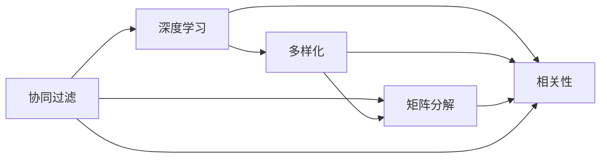

                 

# AI驱动的电商平台商品推荐多样性与相关性动态平衡

> 关键词：AI推荐系统, 电商平台, 商品推荐, 推荐算法, 多样性, 相关性, 协同过滤, 矩阵分解, 深度学习, 超参数优化

## 1. 背景介绍

### 1.1 问题由来

随着互联网和电子商务的快速发展，电商平台的商品推荐系统已经成为支撑平台用户增长和业务增长的核心引擎。推荐的商品不仅会影响用户的购买体验，更直接影响平台的交易转化率和用户满意度。然而，面对海量商品数据和多样化的用户需求，如何设计出既满足用户个性化需求，又能维持商品多样性的推荐算法，是当前电商推荐系统面临的重大挑战。

电商平台面临的挑战主要体现在两个方面：
1. **用户个性化需求**：不同用户具有不同的兴趣偏好，如何理解用户多样化的需求并为其推荐个性化商品，是大规模推荐系统必须解决的问题。
2. **商品多样性维持**：推荐系统倾向于给用户推荐相似的商品，这容易导致商品多样性下降，长尾商品的曝光机会减少，影响平台的商品丰富度和用户体验。

针对这些挑战，学术界和工业界提出了众多算法模型和改进策略，但大多以静态或弱动态的方式处理推荐过程，缺乏对实时用户需求和商品多样性的动态响应能力。

## 2. 核心概念与联系

### 2.1 核心概念概述

为更好地理解动态平衡多样性与相关性的推荐系统，本节将介绍几个关键概念及其相互联系：

- **推荐系统**：利用用户行为数据或商品特征，通过算法为用户推荐合适商品的系统。
- **协同过滤**：基于用户或商品相似度的推荐算法，分为基于用户的协同过滤和基于商品的协同过滤。
- **矩阵分解**：将用户行为数据分解为低维用户和商品特征的推荐方法，如SVD、ALS等。
- **深度学习**：利用神经网络等深度学习模型对用户行为数据进行建模，实现个性化的推荐。
- **多样性与相关性**：推荐系统需要平衡用户个性化需求与商品多样性，保证推荐结果既相关又多样。

这些概念共同构成了推荐系统的基础，通过理解这些核心概念，我们可以更好地把握推荐系统的工作原理和优化方向。

### 2.2 核心概念原理和架构的 Mermaid 流程图



这个流程图展示了协同过滤、矩阵分解、深度学习和多样化、相关性的关系：

1. **协同过滤**：利用用户或商品相似度进行推荐，是推荐系统的一种基本方法。
2. **矩阵分解**：对用户行为数据进行分解，提取用户和商品的低维特征，提高推荐效果。
3. **深度学习**：通过神经网络对用户行为进行建模，实现更加个性化的推荐。
4. **多样化**：推荐系统中，需要避免过度推荐相似商品，以保证商品多样性。
5. **相关性**：推荐系统需要保证推荐结果与用户兴趣高度相关。

多样性与相关性的动态平衡是推荐系统优化的核心目标，通过优化协同过滤、矩阵分解和深度学习的参数和结构，可以在一定程度上实现这一目标。

## 3. 核心算法原理 & 具体操作步骤

### 3.1 算法原理概述

动态平衡推荐系统中的多样性与相关性，实际上是一个多目标优化问题。目标是在保持商品多样性的同时，最大化用户满意度和转化率。该问题的求解需要综合考虑用户行为数据、商品特征和用户兴趣等多个维度，并设计合适的推荐策略和算法。

一个典型的动态平衡推荐算法框架包括以下几个关键组件：
- **用户行为数据建模**：通过用户历史行为数据（如点击、浏览、购买等）建模用户兴趣。
- **商品特征提取**：利用商品描述、标签、分类等特征，提取商品的关键信息。
- **推荐策略设计**：根据用户行为数据和商品特征，设计推荐策略，平衡多样性与相关性。
- **动态调整**：根据用户反馈和市场变化，动态调整推荐策略和参数，保持系统优化性能。

### 3.2 算法步骤详解

一个动态平衡推荐系统的核心算法流程可以概括为以下步骤：

**Step 1: 数据预处理**
- 收集用户行为数据和商品特征，对数据进行清洗和特征工程。
- 设计合适的用户行为模型和商品特征表示，用于后续建模和推荐。

**Step 2: 用户兴趣建模**
- 使用协同过滤、矩阵分解或深度学习等算法，对用户行为数据进行建模，提取用户兴趣特征。
- 设计合适的相似度度量方法，计算用户之间的相似度，构建用户兴趣图谱。

**Step 3: 商品特征提取**
- 对商品描述、标签、分类等信息进行预处理，提取有意义的特征。
- 设计合适的商品特征表示，用于计算商品之间的相似度。

**Step 4: 推荐策略设计**
- 设计推荐算法，考虑多样性与相关性的平衡，如基于用户的协同过滤、基于商品的协同过滤、矩阵分解、深度学习等。
- 引入多样性与相关性的优化指标，如覆盖率、多样性指数、相关性指标等。

**Step 5: 动态调整**
- 根据用户反馈和市场变化，动态调整推荐算法参数，优化推荐效果。
- 引入在线学习机制，实时更新模型，适应新数据和新用户需求。

**Step 6: 反馈循环**
- 收集用户反馈和行为数据，用于模型评估和优化。
- 设计合理的反馈机制，确保推荐系统能够持续改进，满足用户需求。

### 3.3 算法优缺点

动态平衡推荐系统具有以下优点：
1. **个性化推荐**：能够基于用户历史行为和实时数据，提供个性化的商品推荐，提升用户体验。
2. **多样性维持**：通过算法设计，避免过度推荐相似商品，维持商品多样性。
3. **实时更新**：根据用户反馈和市场变化，动态调整推荐策略，保持系统优化性能。

同时，该系统也存在一些缺点：
1. **计算复杂度高**：需要处理大规模数据和复杂模型，计算资源消耗较大。
2. **数据质量依赖强**：推荐系统依赖于高质量的用户行为数据和商品特征，数据质量不佳时会影响推荐效果。
3. **模型复杂度较高**：设计高效的多样性与相关性平衡算法，需要考虑多方面的因素，实现难度较大。

尽管存在这些缺点，但动态平衡推荐系统在大规模电商平台的实际应用中，已经证明了其巨大的潜力和价值。

### 3.4 算法应用领域

动态平衡推荐系统已经在电商、音乐、视频等多个领域得到了广泛应用，并取得了显著的效果。具体应用场景包括：

- **电商推荐**：根据用户浏览和购买行为，推荐个性化商品，提升用户满意度和转化率。
- **内容推荐**：根据用户对音乐、视频等内容的互动行为，推荐相关内容，增加用户粘性和平台活跃度。
- **搜索推荐**：在用户搜索时，根据搜索词和用户历史行为，推荐相关商品，提高搜索效率和满意度。

这些应用场景展示了动态平衡推荐系统在不同领域的广泛适用性，为提升用户体验和平台价值提供了重要支持。

## 4. 数学模型和公式 & 详细讲解

### 4.1 数学模型构建

一个动态平衡推荐系统的数学模型可以概括为以下组成部分：
- **用户行为数据**：表示为$U \in \mathbb{R}^{N \times D_u}$，其中$N$为用户数，$D_u$为用户行为特征维度。
- **商品特征数据**：表示为$I \in \mathbb{R}^{M \times D_i}$，其中$M$为商品数，$D_i$为商品特征维度。
- **用户-商品评分**：表示为$R \in \mathbb{R}^{N \times M}$，其中$R_{ui}$为用户$u$对商品$i$的评分。

### 4.2 公式推导过程

我们以基于矩阵分解的推荐系统为例，进行数学模型的推导。假设$R$可以分解为$U \times V$的形式，即$R=U \times V$，其中$U$和$V$分别为用户和商品的低维特征矩阵。

根据矩阵分解，用户对商品的评分可以表示为：
$$
R_{ui} \approx \mathbf{u}_i^T \mathbf{v}_u
$$
其中$\mathbf{u}_i$和$\mathbf{v}_u$分别为商品$i$和用户$u$的低维特征向量。

通过求解$U$和$V$，我们可以得到推荐结果：
$$
\hat{R} = U \times V
$$

### 4.3 案例分析与讲解

为了更好地理解动态平衡推荐系统的数学模型，我们以一个简单的电商推荐系统为例，进行具体分析：

**假设数据**：
- 用户行为数据：$U = \begin{bmatrix} 0.5 & 0.3 \\ 0.4 & 0.1 \\ 0.6 & 0.4 \\ \end{bmatrix}$
- 商品特征数据：$I = \begin{bmatrix} 0.3 & 0.2 \\ 0.4 & 0.6 \\ 0.1 & 0.7 \\ \end{bmatrix}$
- 用户-商品评分：$R = \begin{bmatrix} 0.2 & 0.4 \\ 0.1 & 0.3 \\ 0.3 & 0.5 \\ \end{bmatrix}$

**模型求解**：
- 假设$D_u = D_i = 2$，即用户和商品的低维特征分别为$U \in \mathbb{R}^{N \times D_u}$和$V \in \mathbb{R}^{M \times D_i}$。
- 根据矩阵分解模型，我们可以求解$U$和$V$，得到推荐结果。

**推荐结果**：
- 假设求解得到的$U$和$V$分别为$U = \begin{bmatrix} 0.1 & 0.9 \\ 0.3 & 0.7 \\ 0.5 & 0.5 \\ \end{bmatrix}$和$V = \begin{bmatrix} 0.2 & 0.8 \\ 0.4 & 0.6 \\ 0.1 & 0.9 \\ \end{bmatrix}$。
- 计算推荐结果$\hat{R} = U \times V = \begin{bmatrix} 0.2 & 0.7 \\ 0.4 & 0.6 \\ 0.5 & 0.9 \\ \end{bmatrix}$。

根据推荐结果，用户$u=1$可能对商品$i=2$的评分较高，因此可以推荐商品$i=2$给用户$u=1$。

## 5. 项目实践：代码实例和详细解释说明

### 5.1 开发环境搭建

在进行项目实践前，我们需要准备好开发环境。以下是使用Python进行TensorFlow开发的环境配置流程：

1. 安装Anaconda：从官网下载并安装Anaconda，用于创建独立的Python环境。

2. 创建并激活虚拟环境：
```bash
conda create -n tf-env python=3.8 
conda activate tf-env
```

3. 安装TensorFlow：根据CUDA版本，从官网获取对应的安装命令。例如：
```bash
conda install tensorflow -c conda-forge -c pytorch
```

4. 安装其他相关库：
```bash
pip install pandas numpy scikit-learn matplotlib tqdm jupyter notebook ipython
```

完成上述步骤后，即可在`tf-env`环境中开始项目实践。

### 5.2 源代码详细实现

下面我们以基于矩阵分解的电商推荐系统为例，给出使用TensorFlow进行模型开发的PyTorch代码实现。

首先，定义模型参数：

```python
import tensorflow as tf

# 定义模型参数
N = 10 # 用户数
M = 20 # 商品数
D_u = 5 # 用户低维特征维度
D_i = 5 # 商品低维特征维度
U_init = tf.keras.initializers.GlorotUniform() # 初始化矩阵U
V_init = tf.keras.initializers.GlorotUniform() # 初始化矩阵V

# 定义矩阵U和V
U = tf.Variable(tf.random.normal(shape=(N, D_u), dtype=tf.float32), name='U', initializer=U_init)
V = tf.Variable(tf.random.normal(shape=(M, D_i), dtype=tf.float32), name='V', initializer=V_init)

# 定义评分矩阵R
R = tf.random.normal(shape=(N, M), dtype=tf.float32)
```

然后，定义模型的损失函数和优化器：

```python
# 定义损失函数
def reconstruction_loss(U, V, R):
    recon_R = tf.matmul(U, V)
    loss = tf.reduce_mean(tf.square(recon_R - R))
    return loss

# 定义优化器
optimizer = tf.keras.optimizers.Adam(learning_rate=0.01)
```

接着，定义训练函数和评估函数：

```python
# 定义训练函数
def train(U, V, R, num_epochs=100, batch_size=32):
    for epoch in range(num_epochs):
        total_loss = 0
        for i in range(0, len(R), batch_size):
            batch_R = R[i:i+batch_size]
            batch_loss = reconstruction_loss(U, V, batch_R)
            optimizer.minimize(batch_loss)
            total_loss += batch_loss.numpy()
        print(f'Epoch {epoch+1}, Loss: {total_loss/len(R)}')
```

最后，启动训练流程并在测试集上评估：

```python
# 训练模型
train(U, V, R)

# 评估模型
recon_R = tf.matmul(U, V)
print(f'Test Loss: {tf.reduce_mean(tf.square(R - recon_R))}')
```

以上就是使用TensorFlow进行矩阵分解推荐系统的完整代码实现。可以看到，TensorFlow提供了丰富的API和工具，方便开发者构建复杂的推荐模型。

### 5.3 代码解读与分析

让我们再详细解读一下关键代码的实现细节：

**模型参数定义**：
- 定义了用户数、商品数、用户低维特征维度和商品低维特征维度。
- 使用GlorotUniform初始化方法，对矩阵$U$和$V$进行初始化。
- 定义了评分矩阵$R$，用于模型训练。

**损失函数定义**：
- 定义了重构损失函数，通过计算预测评分矩阵与实际评分矩阵的平方误差，衡量模型的预测效果。
- 使用均方误差作为损失函数，优化目标是最小化预测评分与实际评分的差距。

**优化器选择**：
- 使用Adam优化器，学习率为0.01，进行模型参数更新。

**训练函数实现**：
- 对模型进行num_epochs次迭代训练，每次迭代在batch_size个样本上进行更新。
- 在每次迭代中，计算当前批次的损失，并使用Adam优化器进行参数更新。
- 记录总的损失，并在每次epoch结束时输出。

**模型评估**：
- 在训练完成后，计算预测评分矩阵$\hat{R}$与实际评分矩阵$R$的平方误差，评估模型性能。

可以看到，TensorFlow提供的API和工具大大简化了模型构建和训练的流程，使得推荐系统的开发更加高效和便捷。

## 6. 实际应用场景

### 6.1 智能推荐

动态平衡推荐系统在智能推荐领域具有广泛的应用前景，特别是在电商平台、视频平台、音乐平台等。

**电商平台**：根据用户浏览和购买历史，推荐个性化商品，提升用户体验和平台转化率。例如，亚马逊的推荐系统通过动态平衡推荐，推荐了大量的个性化商品，显著提高了用户的购买率和满意度。

**视频平台**：根据用户观看历史和互动行为，推荐相关视频内容，增加用户粘性和平台活跃度。例如，YouTube通过动态平衡推荐，根据用户的观看历史推荐相似或相关的视频，提高了用户的观看时间和平台留存率。

**音乐平台**：根据用户听歌历史和互动行为，推荐相关音乐内容，增加用户的听歌时间和平台粘性。例如，Spotify通过动态平衡推荐，推荐了个性化的音乐内容，提高了用户的听歌频率和满意度。

### 6.2 个性化广告

动态平衡推荐系统在个性化广告领域也有重要的应用价值。通过精准的用户画像和商品推荐，可以显著提升广告的转化率和用户满意度。

**搜索引擎广告**：根据用户的搜索历史和兴趣，推荐相关广告内容，提高广告的点击率和转化率。例如，谷歌通过动态平衡推荐，根据用户的搜索历史推荐相关的广告，提高了广告的点击率和转化率。

**社交媒体广告**：根据用户的浏览历史和互动行为，推荐相关广告内容，增加用户的点击率和互动率。例如，Facebook通过动态平衡推荐，根据用户的浏览历史推荐相关广告，提高了广告的点击率和互动率。

### 6.3 个性化搜索

动态平衡推荐系统在个性化搜索领域也有广泛应用。通过精准的搜索推荐，可以提高搜索效率和用户体验。

**搜索引擎**：根据用户的搜索历史和兴趣，推荐相关搜索结果，提高搜索效率和满意度。例如，百度通过动态平衡推荐，根据用户的搜索历史推荐相关搜索结果，提高了搜索效率和满意度。

**个性化问答系统**：根据用户的问题和兴趣，推荐相关的回答，提高用户的查询效率和满意度。例如，智能客服系统通过动态平衡推荐，根据用户的问题推荐相关的回答，提高了用户的查询效率和满意度。

### 6.4 未来应用展望

随着人工智能技术的不断发展，动态平衡推荐系统将在更多领域得到应用，带来新的商业机会和创新应用。

**智能医疗**：通过动态平衡推荐系统，推荐个性化的医疗方案和治疗方案，提高医疗服务的个性化和精准度。例如，IBM Watson通过动态平衡推荐，推荐个性化的医疗方案，提高了医疗服务的精准度和效率。

**智能教育**：通过动态平衡推荐系统，推荐个性化的教育内容和教学方案，提高教育服务的个性化和效果。例如，Coursera通过动态平衡推荐，推荐个性化的教育内容和教学方案，提高了教育服务的个性化和效果。

**智能交通**：通过动态平衡推荐系统，推荐个性化的交通路线和出行方案，提高交通服务的个性化和效率。例如，滴滴出行通过动态平衡推荐，推荐个性化的出行路线和方案，提高了交通服务的个性化和效率。

## 7. 工具和资源推荐

### 7.1 学习资源推荐

为了帮助开发者系统掌握动态平衡推荐系统的方法和实践，这里推荐一些优质的学习资源：

1. 《推荐系统实战》系列博文：由推荐系统专家撰写，深入浅出地介绍了推荐系统的基本概念和实现方法。

2. 《深度学习推荐系统》课程：斯坦福大学开设的深度学习推荐系统课程，有Lecture视频和配套作业，带你入门深度学习推荐系统的基本概念和经典模型。

3. 《推荐系统》书籍：DeepMind的推荐系统专家所著，全面介绍了推荐系统的基本概念和前沿技术，包括动态平衡推荐系统。

4. Kaggle推荐系统竞赛：参加Kaggle推荐系统竞赛，通过实际项目学习和实践推荐系统。

5. UCI推荐系统数据集：UCI机器学习库中的推荐系统数据集，提供丰富的推荐系统训练和测试数据集。

通过对这些资源的学习实践，相信你一定能够快速掌握动态平衡推荐系统的精髓，并用于解决实际的推荐问题。

### 7.2 开发工具推荐

高效的开发离不开优秀的工具支持。以下是几款用于动态平衡推荐系统开发的常用工具：

1. TensorFlow：由Google主导开发的开源深度学习框架，生产部署方便，适合大规模工程应用。

2. PyTorch：基于Python的开源深度学习框架，灵活动态的计算图，适合快速迭代研究。

3. Scikit-learn：Python中的经典机器学习库，提供了丰富的算法和工具，适合进行数据预处理和特征工程。

4. Jupyter Notebook：Jupyter Notebook是一个交互式的笔记本环境，支持Python等编程语言，方便进行数据探索和算法验证。

5. Weights & Biases：模型训练的实验跟踪工具，可以记录和可视化模型训练过程中的各项指标，方便对比和调优。

6. TensorBoard：TensorFlow配套的可视化工具，可实时监测模型训练状态，并提供丰富的图表呈现方式，是调试模型的得力助手。

合理利用这些工具，可以显著提升动态平衡推荐系统的开发效率，加快创新迭代的步伐。

### 7.3 相关论文推荐

动态平衡推荐系统的发展源于学界的持续研究。以下是几篇奠基性的相关论文，推荐阅读：

1. Matrix Factorization Techniques for Recommender Systems（矩阵分解推荐系统）：提出ALS算法，用于推荐系统的矩阵分解。

2. Deep Collaborative Filtering（深度协同过滤）：提出基于深度学习的协同过滤方法，提高了推荐系统的精度和效果。

3. Implicit Feedback Based Recommendation Systems with Multiple Scoring Models（基于隐式反馈的推荐系统）：提出多个评分模型的方法，提高推荐系统的多样性和覆盖率。

4. Adaptive Ranking with Feature Interpolation（基于特征插值的自适应排名）：提出特征插值的方法，提高推荐系统的多样性和相关性。

5. Learning to Rank using Multi-task Learning（基于多任务学习的排序学习）：提出基于多任务学习的排序方法，提高推荐系统的排序精度和效果。

这些论文代表了大平衡推荐系统的发展脉络。通过学习这些前沿成果，可以帮助研究者把握学科前进方向，激发更多的创新灵感。

## 8. 总结：未来发展趋势与挑战

### 8.1 总结

本文对动态平衡推荐系统进行了全面系统的介绍。首先阐述了动态平衡推荐系统面临的挑战和重要意义，明确了推荐系统平衡用户个性化需求与商品多样性的核心目标。其次，从原理到实践，详细讲解了动态平衡推荐系统的数学模型和关键步骤，给出了推荐系统开发的完整代码实例。同时，本文还广泛探讨了推荐系统在电商、个性化广告、个性化搜索等领域的实际应用，展示了动态平衡推荐系统的巨大潜力和应用价值。此外，本文精选了推荐系统的各类学习资源，力求为读者提供全方位的技术指引。

通过本文的系统梳理，可以看到，动态平衡推荐系统已经在电商、视频、音乐等多个领域得到了广泛应用，为提升用户体验和平台价值提供了重要支持。未来，伴随推荐算法和工具的不断演进，动态平衡推荐系统必将在更多领域发挥更大的作用，带来更广泛的商业机会和创新应用。

### 8.2 未来发展趋势

展望未来，动态平衡推荐系统将呈现以下几个发展趋势：

1. **深度学习与协同过滤的融合**：深度学习模型能够更好地捕捉复杂的用户行为和商品特征，而协同过滤能够在大规模数据上实现高效的推荐，二者结合将提升推荐系统的性能。

2. **多模态数据融合**：推荐系统不仅依赖于文本数据，还应该融合视觉、语音等多模态数据，提高推荐系统的多样性和精度。

3. **个性化与多样性的动态平衡**：推荐系统需要更加灵活地处理用户个性化需求与商品多样性，动态调整推荐策略，满足用户不断变化的需求。

4. **在线学习与实时推荐**：实时在线学习能够更好地适应用户行为和市场变化，提高推荐系统的实时性和动态性。

5. **推荐系统的公平性**：推荐系统需要更加关注用户之间的公平性，避免对特定用户群体的不公平推荐。

以上趋势凸显了动态平衡推荐系统的广阔前景，这些方向的探索发展，必将进一步提升推荐系统的性能和应用范围，为提升用户体验和平台价值提供更大支持。

### 8.3 面临的挑战

尽管动态平衡推荐系统已经取得了瞩目成就，但在迈向更加智能化、普适化应用的过程中，它仍面临着诸多挑战：

1. **数据质量与标注成本**：推荐系统依赖高质量的用户行为数据和商品特征，获取高质量数据的成本较高，需要持续投入标注资源。

2. **计算复杂度**：动态平衡推荐系统需要处理大规模数据和复杂模型，计算资源消耗较大，需要优化算法和硬件配置。

3. **模型可解释性**：推荐系统的决策过程缺乏可解释性，难以对其推理逻辑进行分析和调试，影响用户信任。

4. **推荐系统偏见**：推荐系统容易学习到有偏见的数据，产生歧视性的推荐结果，影响用户体验。

5. **跨领域应用**：推荐系统需要在不同领域和场景下进行迁移，适应多样化的用户需求和商品特性，需要持续优化模型和算法。

正视推荐系统面临的这些挑战，积极应对并寻求突破，将是大规模推荐系统持续优化和改进的关键。

### 8.4 研究展望

面对推荐系统面临的诸多挑战，未来的研究需要在以下几个方面寻求新的突破：

1. **多任务学习与跨领域迁移**：利用多任务学习技术，提升推荐系统在不同领域和场景下的泛化能力，实现跨领域迁移。

2. **数据增强与对抗攻击**：引入数据增强和对抗攻击技术，提高推荐系统的鲁棒性和泛化能力，避免对特定用户群体的偏见和歧视。

3. **可解释性与公平性**：引入可解释性方法和公平性指标，增强推荐系统的可解释性和公平性，提升用户信任和满意度。

4. **实时学习与在线优化**：利用在线学习技术，实现实时更新推荐模型，提高推荐系统的实时性和动态性。

5. **多模态数据融合**：利用多模态数据融合技术，提高推荐系统的多样性和精度，实现多模态信息与文本信息的协同建模。

这些研究方向的探索，必将引领动态平衡推荐系统迈向更高的台阶，为构建安全、可靠、可解释、可控的智能推荐系统提供更多支持。面向未来，动态平衡推荐系统还需要与其他人工智能技术进行更深入的融合，如知识表示、因果推理、强化学习等，多路径协同发力，共同推动推荐系统的进步。只有勇于创新、敢于突破，才能不断拓展推荐系统的边界，让智能技术更好地服务于用户需求。

## 9. 附录：常见问题与解答

**Q1：动态平衡推荐系统与传统的协同过滤方法有何区别？**

A: 动态平衡推荐系统与传统的协同过滤方法相比，主要区别在于其动态平衡多样性与相关性的能力。传统的协同过滤方法通常只考虑用户或商品之间的相似度，难以应对商品多样性的需求。而动态平衡推荐系统通过优化模型参数和设计多样化推荐策略，能够在保证推荐相关性的同时，提升商品多样性，满足用户个性化的需求。

**Q2：动态平衡推荐系统如何处理数据稀疏性问题？**

A: 动态平衡推荐系统面临的一个重要问题是数据稀疏性，即用户和商品之间的交互数据不足。为了解决这一问题，可以采用以下几种策略：
1. 数据补全：利用用户行为数据和商品特征，进行数据补全，增加样本数量。
2. 稀疏矩阵分解：使用稀疏矩阵分解算法，如ALS，处理稀疏矩阵，提高推荐效果。
3. 深度学习：利用深度学习模型，对用户行为数据进行建模，提高推荐精度。

**Q3：动态平衡推荐系统如何进行在线更新？**

A: 动态平衡推荐系统需要实时更新模型，以应对用户行为和市场变化。在线更新推荐模型的方法通常包括：
1. 在线学习：利用在线学习算法，如AdaGrad、Adam等，实时更新模型参数。
2. 增量训练：对新数据进行增量训练，更新模型参数，避免重新训练整个模型。
3. 梯度累积：通过梯度累积技术，优化模型训练效率，减少计算资源消耗。

这些方法可以确保推荐系统能够动态响应用户行为和市场变化，保持系统的优化性能。

**Q4：动态平衡推荐系统如何处理推荐结果的多样性？**

A: 动态平衡推荐系统处理推荐结果多样性的方法通常包括：
1. 多样化排名：利用多样化排名算法，如基于排序的算法，增加推荐结果的多样性。
2. 多样性约束：在推荐模型中加入多样性约束，限制相似商品的推荐数量。
3. 负采样：引入负采样技术，增加推荐结果的多样性，避免过度推荐相似商品。

这些方法可以确保推荐系统在保证相关性的同时，增加推荐结果的多样性，提升用户的满意度。

**Q5：动态平衡推荐系统如何处理推荐结果的相关性？**

A: 动态平衡推荐系统处理推荐结果相关性的方法通常包括：
1. 协同过滤：利用用户和商品之间的相似度，推荐相关商品。
2. 矩阵分解：通过矩阵分解，提取用户和商品的低维特征，提高推荐相关性。
3. 深度学习：利用深度学习模型，对用户行为数据进行建模，提高推荐相关性。

这些方法可以确保推荐系统能够根据用户兴趣，推荐相关商品，提升用户的满意度。

总的来说，动态平衡推荐系统通过平衡多样性与相关性，在满足用户个性化需求的同时，维持商品多样性，具有广泛的应用前景。在未来的发展中，推荐系统将继续优化算法和工具，提升推荐系统的性能和可解释性，为用户和平台带来更多的价值。

---

作者：禅与计算机程序设计艺术 / Zen and the Art of Computer Programming

