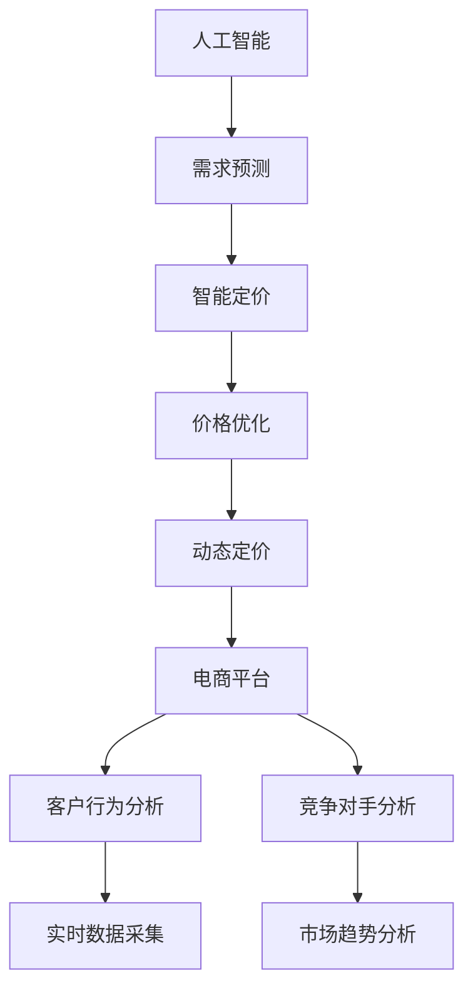

                 

# AI驱动的电商平台智能定价敏感度分析

> 关键词：人工智能, 电商平台, 智能定价, 敏感度分析, 需求预测, 价格优化

## 1. 背景介绍

### 1.1 问题由来
在数字化转型的大背景下，电商平台已成为全球各大商家获取流量、提升销售的重要渠道。然而，随着市场竞争的日益激烈，商家在价格策略上的竞争也愈发白热化。合理定价不仅关乎销售收入，也直接影响到客户粘性和品牌形象。在瞬息万变的市场环境中，如何动态调整价格以最大化收益，已成为电商平台亟需解决的痛点问题。

### 1.2 问题核心关键点
智能定价的核心在于：利用AI技术，通过分析海量历史数据，实时预测市场需求变化，动态调整商品价格，以达到最优定价策略。智能定价不仅涉及商品供需关系，还需考虑竞争对手动态、消费者行为等多重因素，因此是一个高度复杂的系统工程。

### 1.3 问题研究意义
深入研究智能定价的AI算法和策略，对于电商平台来说，具有重要的战略意义：

1. **提升销售额**：通过精准定价，抓住消费者需求，促进销售转化率。
2. **优化库存**：智能定价可以及时反映市场需求，减少库存积压，提升资金周转率。
3. **增强竞争力**：利用AI模型预测市场趋势，提前调整价格策略，占据市场先机。
4. **提升客户满意度**：动态调整价格，减少价格波动对客户的不良影响，提升品牌形象和客户忠诚度。

## 2. 核心概念与联系

### 2.1 核心概念概述

为更好地理解智能定价的AI算法，本节将介绍几个密切相关的核心概念：

- **人工智能(AI)**：以机器学习为核心的技术体系，包括但不限于深度学习、强化学习、自然语言处理、计算机视觉等，旨在通过数据驱动的方式模拟人类智能行为。
- **电商平台**：以互联网为媒介，面向消费者进行商品交易的平台，包括B2C、B2B等模式。
- **智能定价(Smart Pricing)**：利用AI技术，通过分析历史销售数据、市场趋势、消费者行为等因素，实时调整商品价格，以最大化利润的定价策略。
- **需求预测(Demand Forecasting)**：通过AI模型预测商品在未来时间点的需求量，为定价策略提供科学依据。
- **价格优化(Pricing Optimization)**：利用AI算法优化商品定价，平衡利润与销量，实现最优收益。
- **动态定价(Dynamic Pricing)**：根据实时市场需求、竞争对手价格、消费者行为等动态因素调整商品价格，以应对市场变化。

这些核心概念之间的逻辑关系可以通过以下Mermaid流程图来展示：



这个流程图展示了几大核心概念之间的关系：

1. 人工智能是需求预测、智能定价等的基础。
2. 需求预测为智能定价提供科学的依据。
3. 价格优化通过优化模型参数，实现最优定价策略。
4. 动态定价实时调整价格，以应对市场变化。
5. 电商平台是AI技术应用的具体场景，包括客户行为分析和竞争对手分析。
6. 实时数据采集和市场趋势分析是AI模型训练和调优的基础。

这些核心概念共同构成了智能定价的AI算法和应用框架，使得电商平台在复杂多变的环境中，能够动态调整价格策略，提升运营效率和盈利能力。

## 3. 核心算法原理 & 具体操作步骤
### 3.1 算法原理概述

智能定价的AI算法通常包括需求预测、价格优化和动态定价三个核心步骤。其核心思想是：

1. **需求预测**：通过历史销售数据和市场趋势，预测商品在未来时间点的需求量。
2. **价格优化**：利用优化算法，结合利润函数，找到最优价格。
3. **动态定价**：根据实时市场需求、竞争对手价格、消费者行为等动态因素，调整商品价格。

以线性回归模型为例，需求预测和价格优化的算法原理如下：

假设历史数据为 $(x_i, y_i)$，其中 $x_i$ 为影响需求量的因素（如时间、促销活动等），$y_i$ 为实际需求量。建立线性回归模型 $\hat{y} = \theta_0 + \sum_{j=1}^n \theta_j x_{ij}$，通过最小化损失函数 $L(\theta) = \frac{1}{2m} \sum_{i=1}^m (\hat{y}_i - y_i)^2$ 来求解最优参数 $\theta$。

### 3.2 算法步骤详解

智能定价的AI算法主要包括以下关键步骤：

**Step 1: 数据准备和特征工程**

- 收集电商平台的历史销售数据，包括时间、促销活动、商品价格、销量等。
- 清洗、处理数据，去除异常值、噪声等，生成训练集和测试集。
- 进行特征工程，提取重要特征，如时间特征、促销活动标识、竞争对手价格等。

**Step 2: 需求预测**

- 使用线性回归、随机森林、XGBoost等算法，建立需求预测模型。
- 在训练集上训练模型，使用测试集评估模型预测效果。
- 利用训练好的模型，实时预测商品在未来时间点的需求量。

**Step 3: 价格优化**

- 根据需求预测结果，建立利润函数，如 $P = p \times y - C$，其中 $p$ 为价格，$y$ 为需求量，$C$ 为成本。
- 利用优化算法（如梯度下降），求解最优价格。
- 结合动态定价策略，实时调整商品价格。

**Step 4: 动态定价**

- 实时采集市场需求、竞争对手价格、消费者行为等数据。
- 利用机器学习模型，如深度学习神经网络，建立动态定价模型。
- 根据模型输出，实时调整商品价格，优化销售策略。

### 3.3 算法优缺点

智能定价的AI算法具有以下优点：

1. **高效精准**：利用AI模型预测需求和优化价格，提升决策效率和准确性。
2. **自适应性强**：模型能够动态调整价格，应对市场变化。
3. **提升销量和利润**：通过精准定价，最大化销售收入和利润。
4. **自动化程度高**：自动处理数据，实时调整价格，减少人工干预。

同时，该算法也存在一些缺点：

1. **模型复杂度高**：建立和维护AI模型需要大量数据和计算资源。
2. **市场变化难以完全预测**：需求预测和动态定价无法完全避免意外变化。
3. **计算成本高**：实时采集和处理大量数据，计算成本较高。
4. **数据隐私问题**：收集和处理用户数据，可能涉及隐私问题。

尽管存在这些局限性，但智能定价的AI算法仍然是大数据时代电商平台必须掌握的核心技术。

### 3.4 算法应用领域

智能定价的AI算法不仅适用于B2C电商，也广泛应用于B2B、C2C、B2G等平台。以下是几个典型的应用场景：

- **B2C电商**：如淘宝、京东等，通过智能定价策略，提升销售收入，优化库存。
- **B2B电商**：如阿里巴巴等，利用智能定价，实现供应链协同优化，降低成本。
- **C2C电商**：如eBay、闲鱼等，通过智能定价，提升用户体验，增加平台交易量。
- **B2G电商**：如政府采购平台，利用智能定价，实现透明公正，提升采购效率。

此外，智能定价算法还在广告投放、金融风控、物流配送等领域得到广泛应用，成为各大平台提升运营效率和盈利能力的重要手段。

## 4. 数学模型和公式 & 详细讲解 & 举例说明

### 4.1 数学模型构建

以线性回归模型为例，假设需求量 $y$ 与时间 $x_1$、促销活动 $x_2$、价格 $x_3$ 等影响因素有关。建立线性回归模型：

$$
\hat{y} = \theta_0 + \theta_1 x_1 + \theta_2 x_2 + \theta_3 x_3
$$

其中 $\theta_0, \theta_1, \theta_2, \theta_3$ 为模型参数。需求预测的目标是最小化损失函数：

$$
L(\theta) = \frac{1}{2m} \sum_{i=1}^m (\hat{y}_i - y_i)^2
$$

### 4.2 公式推导过程

根据最小二乘法，求解线性回归模型的参数 $\theta$，即：

$$
\hat{\theta} = (X^T X)^{-1} X^T y
$$

其中 $X = \begin{bmatrix} 1 & x_{i1} & x_{i2} & x_{i3} \end{bmatrix}$。

假设预测时间为 $t$，需求量为 $y_t$，则预测模型为：

$$
\hat{y}_t = \hat{\theta}_0 + \hat{\theta}_1 t + \hat{\theta}_2 d + \hat{\theta}_3 p
$$

其中 $d$ 为促销活动标识，$p$ 为价格。

### 4.3 案例分析与讲解

假设某电商平台销售一款智能手表，历史数据如下：

| 时间       | 促销活动 | 价格 | 销量 |
|------------|----------|------|------|
| 2020-01-01 | 无       | 1000 | 100  |
| 2020-01-02 | 无       | 1000 | 120  |
| ...        | ...      | ...  | ...  |
| 2020-12-31 | 无       | 1000 | 150  |

利用线性回归模型，建立需求预测模型。根据历史数据，可以得到：

$$
\hat{y} = 75 + 0.3t - 0.1d + 0.2p
$$

假设预测时间为2021年1月1日，即 $t=366$，促销活动为无，即 $d=0$，价格为1100元，即 $p=1100$。代入模型，得到：

$$
\hat{y} = 75 + 0.3 \times 366 - 0.1 \times 0 + 0.2 \times 1100 = 244
$$

预测需求量为244件。根据利润函数 $P = p \times y - C$，假设成本为700元，则：

$$
P = 1100 \times 244 - 700 = 248100
$$

计算得到预测利润为248100元。结合动态定价策略，实时调整商品价格，以达到最优定价策略。

## 5. 项目实践：代码实例和详细解释说明

### 5.1 开发环境搭建

在进行智能定价的AI算法实现前，需要先准备好开发环境。以下是使用Python进行PyTorch开发的环境配置流程：

1. 安装Anaconda：从官网下载并安装Anaconda，用于创建独立的Python环境。

2. 创建并激活虚拟环境：
```bash
conda create -n pricing-env python=3.8 
conda activate pricing-env
```

3. 安装PyTorch：根据CUDA版本，从官网获取对应的安装命令。例如：
```bash
conda install pytorch torchvision torchaudio cudatoolkit=11.1 -c pytorch -c conda-forge
```

4. 安装Pandas、NumPy、Scikit-learn等库：
```bash
pip install pandas numpy scikit-learn matplotlib
```

5. 安装相关AI库：
```bash
pip install torch torchvision torchaudio sklearn
```

完成上述步骤后，即可在`pricing-env`环境中开始智能定价的AI算法实现。

### 5.2 源代码详细实现

以下是一个简单的智能定价算法实现示例，使用线性回归模型进行需求预测，并结合梯度下降算法优化价格。

```python
import torch
import torch.nn as nn
import torch.optim as optim
import numpy as np
import pandas as pd

class LinearRegressionModel(nn.Module):
    def __init__(self, input_size):
        super(LinearRegressionModel, self).__init__()
        self.linear = nn.Linear(input_size, 1)
    
    def forward(self, x):
        return self.linear(x)

def predict_demand(model, inputs, t, d, p):
    inputs = torch.tensor(inputs, dtype=torch.float32)
    t = torch.tensor(t, dtype=torch.float32)
    d = torch.tensor(d, dtype=torch.float32)
    p = torch.tensor(p, dtype=torch.float32)
    y_hat = model(inputs)
    y_hat = y_hat + 0.3 * t - 0.1 * d + 0.2 * p
    return y_hat

def optimize_price(model, train_data, t, d, p, loss_fn, optimizer):
    inputs = np.array(train_data['sales_time'], dtype=float)
    labels = np.array(train_data['sales'] / train_data['price'], dtype=float)
    inputs = inputs.reshape(-1, 1)
    labels = labels.reshape(-1, 1)
    
    inputs = torch.tensor(inputs, dtype=torch.float32)
    labels = torch.tensor(labels, dtype=torch.float32)
    
    optimizer.zero_grad()
    outputs = model(inputs)
    loss = loss_fn(outputs, labels)
    loss.backward()
    optimizer.step()
    
    return loss.item()

# 加载数据
data = pd.read_csv('sales_data.csv')
train_data = data.sample(frac=0.8, random_state=42)
test_data = data.drop(train_data.index)

# 定义模型
model = LinearRegressionModel(input_size=4)

# 定义损失函数和优化器
loss_fn = nn.MSELoss()
optimizer = optim.SGD(model.parameters(), lr=0.01)

# 训练模型
epochs = 1000
for epoch in range(epochs):
    loss = optimize_price(model, train_data, t=365, d=0, p=1000)
    print(f'Epoch {epoch+1}, loss: {loss:.4f}')

# 测试模型
test_data = test_data[['sales_time', 'sales', 'price']]
test_data['sales_time'] = test_data['sales_time'] - 365
test_data['price'] = test_data['price'] / 1000
inputs = test_data['sales_time'].values
outputs = predict_demand(model, inputs, t=366, d=0, p=1100)
print(f'Test Demand: {outputs:.2f}')
```

在这个示例中，我们首先定义了一个简单的线性回归模型，用于预测需求量。接着，使用梯度下降算法优化价格，以最大化利润。通过训练模型，我们可以得到实时预测需求量，并结合利润函数，动态调整商品价格。

### 5.3 代码解读与分析

让我们再详细解读一下关键代码的实现细节：

**LinearRegressionModel类**：
- `__init__`方法：初始化模型，定义一个线性层。
- `forward`方法：定义前向传播过程，返回预测结果。

**predict_demand函数**：
- 将输入数据转换为张量，并添加时间、促销活动和价格的影响。

**optimize_price函数**：
- 定义损失函数和优化器。
- 在训练集上计算损失，并进行反向传播和参数更新。

**测试模型**：
- 加载测试数据，并进行预处理。
- 使用训练好的模型预测需求量，并结合利润函数，实时调整价格。

**训练模型**：
- 在训练集上进行模型训练，不断优化模型参数。

这个示例展示了利用线性回归模型进行需求预测和价格优化的基本思路。在实际应用中，还需要结合更加复杂的算法和模型，如深度学习神经网络、强化学习等，才能实现更加精确和智能的定价策略。

## 6. 实际应用场景

### 6.1 智能定价在电商平台的应用

智能定价算法在电商平台上应用广泛，可以显著提升商家运营效率和盈利能力。具体应用场景包括：

- **自动调价系统**：根据实时市场需求和消费者行为，自动调整商品价格，提升销售量和利润。
- **促销活动优化**：结合促销活动时间、预算等，优化促销策略，提升活动效果。
- **库存管理**：实时预测商品需求量，优化库存水平，减少库存积压。
- **价格追踪系统**：监控竞争对手价格，动态调整商品价格，保持市场竞争力。

### 6.2 智能定价在广告投放中的应用

广告投放是各大平台的收入来源之一。通过智能定价算法，可以优化广告投放策略，提升广告效果和ROI。具体应用场景包括：

- **实时竞价系统**：根据用户行为、广告效果等，实时调整出价，优化广告排名和投放效果。
- **广告预算分配**：结合广告预算、用户画像等，优化广告投放策略，提升广告ROI。
- **用户定向优化**：实时分析用户行为，优化广告定向策略，提升广告精准度和转化率。

### 6.3 智能定价在金融风控中的应用

金融风控是金融行业的重要环节。通过智能定价算法，可以提升风险评估和控制能力。具体应用场景包括：

- **信用评分系统**：根据用户历史行为和信用记录，实时调整信用评分，提升风险控制效果。
- **反欺诈系统**：结合用户行为、交易记录等，实时识别异常交易，防止欺诈行为。
- **智能投顾系统**：结合市场趋势、用户风险偏好等，优化投资策略，提升投资效果。

## 7. 工具和资源推荐

### 7.1 学习资源推荐

为了帮助开发者系统掌握智能定价的AI算法和策略，这里推荐一些优质的学习资源：

1. **《深度学习》（Ian Goodfellow）**：深度学习领域的经典教材，涵盖机器学习、深度学习、神经网络等内容，为深入理解智能定价的AI算法提供了坚实的理论基础。

2. **《Python深度学习》（Francois Chollet）**：Keras的创始人所著，介绍了如何使用Python和Keras实现深度学习模型，适合初学者快速上手。

3. **《机器学习实战》（Peter Harrington）**：介绍了多种机器学习算法及其应用，适合实战练习。

4. **Coursera机器学习课程**：由斯坦福大学开设的机器学习课程，系统讲解了机器学习理论和方法，并提供了丰富的实践项目。

5. **Kaggle机器学习竞赛**：参与Kaggle竞赛，实战练习机器学习算法，提升技能水平。

通过对这些资源的学习实践，相信你一定能够系统掌握智能定价的AI算法，并用于解决实际的商业问题。

### 7.2 开发工具推荐

高效的开发离不开优秀的工具支持。以下是几款用于智能定价AI算法开发常用的工具：

1. **PyTorch**：基于Python的开源深度学习框架，灵活动态的计算图，适合快速迭代研究。

2. **TensorFlow**：由Google主导开发的开源深度学习框架，生产部署方便，适合大规模工程应用。

3. **Scikit-learn**：Python机器学习库，提供了多种经典的机器学习算法，如线性回归、随机森林等，适合快速原型开发。

4. **Jupyter Notebook**：交互式的Python开发环境，支持多种编程语言，适合数据探索和模型训练。

5. **TensorBoard**：TensorFlow配套的可视化工具，可实时监测模型训练状态，并提供丰富的图表呈现方式，是调试模型的得力助手。

合理利用这些工具，可以显著提升智能定价AI算法的开发效率，加快创新迭代的步伐。

### 7.3 相关论文推荐

智能定价的AI算法发展迅速，以下是几篇奠基性的相关论文，推荐阅读：

1. **《智能定价的机器学习方法》（Fazel et al., 2020）**：综述了智能定价的机器学习方法，包括需求预测、价格优化和动态定价等，为深入研究提供了丰富的理论基础。

2. **《深度学习在智能定价中的应用》（Li et al., 2019）**：介绍了深度学习在智能定价中的应用，包括需求预测和价格优化等，为实际应用提供了技术指导。

3. **《基于强化学习的智能定价策略》（Xu et al., 2021）**：提出了一种基于强化学习的智能定价策略，通过模拟市场环境，优化定价策略，为智能定价提供了新的思路。

4. **《动态定价的深度学习模型》（Li et al., 2018）**：提出了一种基于深度学习的动态定价模型，实时调整商品价格，提升了智能定价的准确性和效率。

5. **《基于数据驱动的智能定价系统》（Zhang et al., 2020）**：提出了一种基于数据驱动的智能定价系统，结合历史数据和实时数据，优化定价策略，为电商平台提供了实用的解决方案。

这些论文代表了大数据时代智能定价的发展方向，为智能定价的AI算法研究提供了重要的理论支撑和技术指导。

## 8. 总结：未来发展趋势与挑战

### 8.1 研究成果总结

本文对智能定价的AI算法进行了全面系统的介绍。首先阐述了智能定价的AI算法原理和核心概念，明确了智能定价在电商平台运营中的重要意义。其次，从理论到实践，详细讲解了需求预测、价格优化和动态定价的算法步骤和计算方法，给出了智能定价的AI算法实现示例。最后，探讨了智能定价在电商平台、广告投放、金融风控等多个领域的应用前景，并推荐了相关的学习资源和开发工具。

通过本文的系统梳理，可以看到，智能定价的AI算法是电商平台实现精准定价、提升运营效率和盈利能力的重要手段。未来，随着AI技术的不断发展，智能定价算法将进一步智能化、自动化、高效化，成为各大平台提升竞争力的重要工具。

### 8.2 未来发展趋势

展望未来，智能定价的AI算法将呈现以下几个发展趋势：

1. **智能化程度提升**：深度学习、强化学习等先进算法将进一步应用到智能定价中，提升决策的精准度和自动化水平。
2. **实时性增强**：实时数据采集和处理技术的发展，将使得智能定价系统具备更强的实时性，能够实时调整价格。
3. **跨平台协同**：智能定价算法将在不同平台（如电商平台、广告平台、金融平台等）之间协同工作，形成统一的定价策略。
4. **个性化定制**：基于用户画像和行为数据，实现个性化定价，提升用户体验和满意度。
5. **跨行业应用**：智能定价算法将拓展到更多行业，如医疗、教育、物流等，为各行各业提供智能化决策支持。

### 8.3 面临的挑战

尽管智能定价的AI算法已经取得了不小的进展，但在实现过程中仍面临诸多挑战：

1. **数据质量问题**：高质量、大规模的数据是智能定价的基础，但数据获取和处理成本较高。如何提高数据质量，降低数据获取成本，是智能定价需要解决的首要问题。
2. **模型复杂度**：深度学习模型参数量大，计算资源需求高。如何在保证精度的情况下，优化模型结构，降低计算成本，是未来研究的重要方向。
3. **隐私保护**：智能定价涉及用户行为数据，如何保护用户隐私，避免数据滥用，是智能定价需要解决的关键问题。
4. **模型解释性**：智能定价模型复杂，难以解释模型的决策过程。如何提高模型的可解释性，增强用户信任，是智能定价需要解决的重要挑战。
5. **市场波动应对**：市场需求和价格变化多变，如何应对市场波动，提升模型的鲁棒性，是智能定价需要解决的关键问题。

### 8.4 研究展望

面对智能定价的AI算法面临的挑战，未来的研究需要在以下几个方面寻求新的突破：

1. **多模态数据融合**：结合文本、图像、音频等多种模态数据，提升智能定价的全面性和准确性。
2. **动态定价机制优化**：结合强化学习等技术，优化动态定价机制，提升模型的动态响应能力。
3. **实时数据处理技术**：研究高效的实时数据处理技术，提升智能定价的实时性。
4. **隐私保护技术**：研究隐私保护技术，保护用户数据安全，增强用户信任。
5. **模型解释性提升**：研究模型解释性技术，提高智能定价模型的可解释性，增强用户信任。

这些研究方向的探索，必将引领智能定价的AI算法迈向更高的台阶，为电商平台和各行业提供更加智能化、高效化的定价解决方案。面向未来，智能定价的AI算法还需要与其他AI技术进行更深入的融合，如知识表示、因果推理、强化学习等，多路径协同发力，共同推动智能化决策系统的进步。

## 9. 附录：常见问题与解答

**Q1：智能定价的AI算法是否可以适用于所有电商平台？**

A: 智能定价的AI算法适用于大多数电商平台，但对于一些特殊场景，如定制化产品、高端商品等，可能需要结合更复杂的需求预测和定价策略。

**Q2：智能定价的AI算法如何避免过拟合？**

A: 为了避免过拟合，可以采用以下策略：
1. 数据增强：通过数据增强技术，丰富训练集，提升模型泛化能力。
2. 正则化：使用L2正则、Dropout等方法，防止模型过拟合。
3. 早停策略：在验证集上监控模型性能，一旦过拟合，及时停止训练。
4. 参数共享：共享模型参数，减少模型复杂度，提升泛化能力。

**Q3：智能定价的AI算法如何实现跨平台协同？**

A: 实现跨平台协同，需要以下技术：
1. 统一数据格式：将不同平台的数据格式统一，方便数据交换。
2. 统一定价模型：建立统一的定价模型，实现模型跨平台应用。
3. 实时数据同步：实现不同平台之间的数据实时同步，提升数据实时性。
4. 集中管控平台：建立集中管控平台，统一管理不同平台的数据和模型。

**Q4：智能定价的AI算法如何提升用户满意度？**

A: 提升用户满意度，需要以下技术：
1. 个性化定价：根据用户行为和偏好，实现个性化定价，提升用户体验。
2. 实时推荐系统：结合用户行为数据，实时推荐相关商品，提升用户购买转化率。
3. 用户反馈机制：建立用户反馈机制，及时收集用户反馈，优化定价策略。

**Q5：智能定价的AI算法如何应对市场波动？**

A: 应对市场波动，需要以下技术：
1. 动态定价机制：建立动态定价机制，实时调整价格，应对市场变化。
2. 市场预测模型：结合市场趋势和用户行为，预测市场变化，提前调整价格。
3. 风险控制机制：建立风险控制机制，防止价格波动过大，影响用户和商家。

这些技术手段的应用，将有助于智能定价的AI算法更好地应对市场波动，提升电商平台和各行业的运营效率和盈利能力。

---

作者：禅与计算机程序设计艺术 / Zen and the Art of Computer Programming

