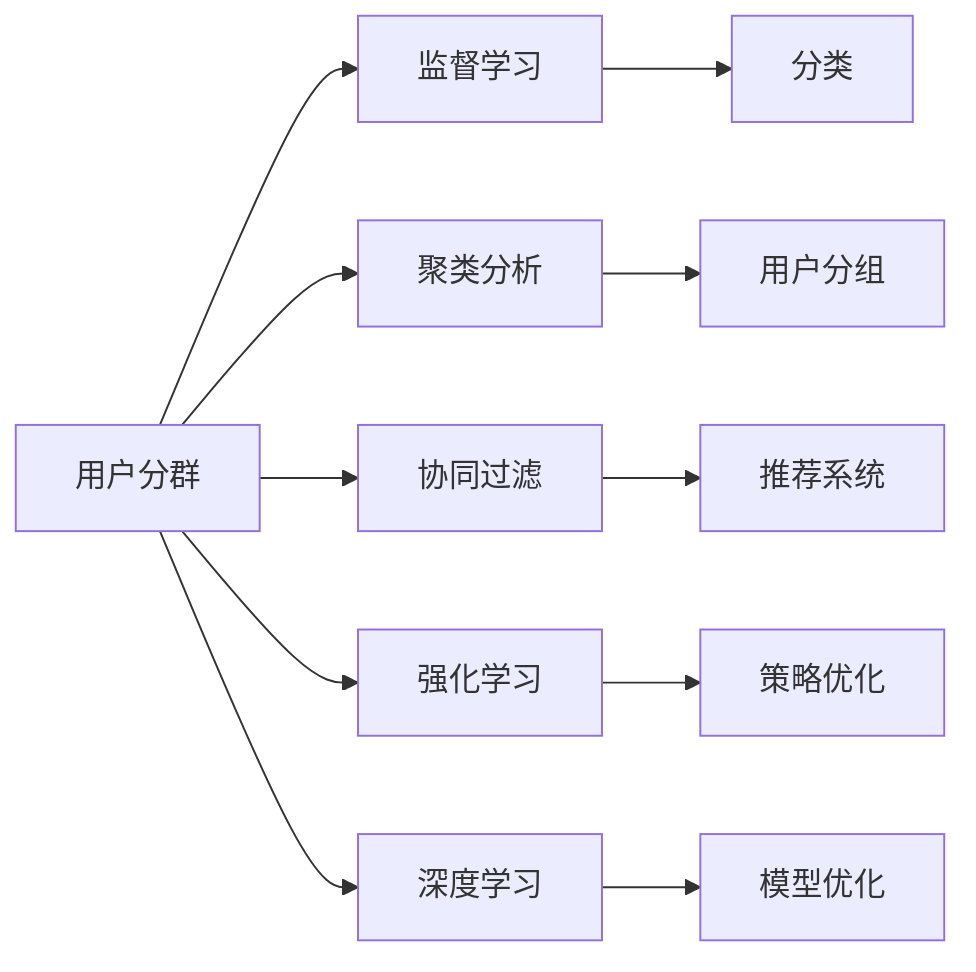

                 

# AI驱动的电商平台用户分群策略

## 1. 背景介绍

随着电商行业的迅猛发展，平台商在运营过程中面临诸多挑战，包括用户增长放缓、用户流失率上升、购物体验优化、产品推荐等问题。用户分群作为精细化运营的重要手段，能帮助平台商更准确地洞察用户需求，提供个性化的服务和推荐，提升用户黏性，最终带来更多的转化和收益。

在本博客中，我们将通过AI驱动的方法，探索电商平台用户分群策略的科学和高效实施。我们将使用用户行为数据，通过机器学习算法，对用户进行分群，挖掘出不同群体的特性和需求，以实现更精准的市场营销和运营管理。

## 2. 核心概念与联系

为了更好地理解AI驱动的电商平台用户分群策略，我们需要先了解几个核心概念，以及它们之间的联系。

### 2.1 核心概念概述

1. **用户分群 (User Segmentation)**: 基于用户行为、属性、偏好等数据，将用户划分为不同群体。每个群体拥有共性特征，并能够被针对性地运营。
2. **机器学习 (Machine Learning)**: 利用算法和模型，从数据中学习规律，进而进行预测和分类。
3. **监督学习 (Supervised Learning)**: 使用有标签数据训练模型，实现分类、回归等任务。
4. **聚类分析 (Cluster Analysis)**: 无监督学习方法，将相似的对象归为一类，从而实现用户分群。
5. **协同过滤 (Collaborative Filtering)**: 推荐系统常用的方法，通过分析用户行为，预测用户可能感兴趣的商品或内容。
6. **强化学习 (Reinforcement Learning)**: 通过试错，学习最大化奖励的策略。
7. **深度学习 (Deep Learning)**: 基于神经网络的高级学习技术，能够处理复杂的非线性关系。

这些概念通过以下Mermaid流程图展示其逻辑关系：



## 3. 核心算法原理 & 具体操作步骤

### 3.1 算法原理概述

用户分群的AI驱动方法，主要包括监督学习、聚类分析和协同过滤等技术。本节我们将详细介绍这些算法的原理和步骤。

#### 3.1.1 监督学习原理

监督学习通过有标签的数据集训练模型，然后使用模型对新数据进行分类。对于电商平台用户分群，常见的任务包括用户行为预测、用户评分预测、用户流失预测等。具体算法步骤包括：

1. **数据准备**：收集用户行为数据（如浏览、购买、点击等），用户属性数据（如年龄、性别、收入等），以及标签数据（如流失、购买等）。
2. **特征工程**：将原始数据转化为模型能够理解的形式，包括特征选择、特征提取、特征编码等。
3. **模型训练**：选择合适的算法和模型（如决策树、随机森林、神经网络等），使用训练数据集训练模型。
4. **模型评估**：使用测试数据集评估模型性能，通过指标（如准确率、召回率、F1-score等）衡量模型效果。
5. **模型优化**：根据评估结果，调整模型参数或选择其他算法进行优化。

#### 3.1.2 聚类分析原理

聚类分析是一种无监督学习方法，通过相似度计算，将相似对象归为一类。对于电商平台用户分群，聚类分析可以识别出用户的共性特征，帮助进行初步的群体划分。具体算法步骤包括：

1. **数据准备**：收集用户行为数据和属性数据。
2. **距离计算**：选择适当的距离度量方法（如欧几里得距离、曼哈顿距离等），计算对象间的相似度。
3. **聚类算法**：选择适合的聚类算法（如K-means、层次聚类、DBSCAN等），对数据进行聚类。
4. **结果评估**：评估聚类效果（如轮廓系数、Calinski-Harabasz指数等），确定聚类数目和模型参数。

#### 3.1.3 协同过滤原理

协同过滤是一种基于用户行为数据的推荐算法，通过分析用户和物品之间的相似性，推荐相似用户可能感兴趣的商品或内容。对于电商平台用户分群，协同过滤可以发现用户之间的关联关系，进一步细化群体划分。具体算法步骤包括：

1. **数据准备**：收集用户行为数据和物品属性数据。
2. **相似度计算**：计算用户和物品之间的相似度（如皮尔逊相关系数、余弦相似度等）。
3. **推荐算法**：选择适合的协同过滤算法（如基于用户的协同过滤、基于物品的协同过滤、基于矩阵分解的协同过滤等），生成推荐结果。
4. **结果评估**：评估推荐效果（如准确率、召回率、RMSE等），优化推荐算法。

### 3.2 算法步骤详解

#### 3.2.1 监督学习步骤

1. **数据预处理**：对原始数据进行清洗、缺失值填充、标准化等处理。
2. **特征选择**：选择与目标变量相关的特征，降低维度，提升模型效率。
3. **模型训练**：使用随机梯度下降等优化算法，训练模型。
4. **模型评估**：使用交叉验证等方法，评估模型效果。
5. **模型应用**：使用训练好的模型，对新数据进行分类或预测。

#### 3.2.2 聚类分析步骤

1. **数据预处理**：对原始数据进行清洗、标准化等处理。
2. **特征选择**：选择与聚类结果相关的特征，降低维度，提升模型效率。
3. **聚类算法选择**：根据数据特点和业务需求，选择合适的聚类算法。
4. **模型训练**：对数据进行聚类，确定聚类数目和模型参数。
5. **结果评估**：评估聚类效果，优化聚类算法。

#### 3.2.3 协同过滤步骤

1. **数据预处理**：对原始数据进行清洗、标准化等处理。
2. **特征选择**：选择与相似度计算相关的特征，降低维度，提升模型效率。
3. **相似度计算**：计算用户和物品之间的相似度。
4. **推荐算法选择**：根据数据特点和业务需求，选择合适的推荐算法。
5. **模型训练**：对数据进行协同过滤，生成推荐结果。
6. **结果评估**：评估推荐效果，优化推荐算法。

### 3.3 算法优缺点

#### 3.3.1 监督学习优缺点

- **优点**：
  - 模型效果稳定，预测准确率较高。
  - 可以处理有标签数据，适用于预测任务。
  - 可以通过特征工程优化模型效果。
- **缺点**：
  - 需要标注数据，标注成本较高。
  - 对于新数据的泛化能力有限。
  - 需要手动选择特征，存在特征选择困难。

#### 3.3.2 聚类分析优缺点

- **优点**：
  - 无监督学习，不需要标注数据。
  - 可以发现数据中的隐含结构，发现群体特征。
  - 算法实现简单，易于理解和应用。
- **缺点**：
  - 聚类结果可能存在噪声和异常值。
  - 对于小规模数据，聚类效果可能不稳定。
  - 需要选择合适的相似度度量方法和聚类算法。

#### 3.3.3 协同过滤优缺点

- **优点**：
  - 可以发现用户之间的关联关系，提升推荐效果。
  - 可以处理大量稀疏数据，适用于推荐系统。
  - 可以通过协同过滤算法进行优化，提升推荐精度。
- **缺点**：
  - 需要大规模用户行为数据，数据获取困难。
  - 对于冷启动用户，推荐效果较差。
  - 对于新用户或新物品，推荐效果可能不稳定。

### 3.4 算法应用领域

用户分群算法在电商平台的各个环节都有广泛的应用：

- **用户画像构建**：通过分析用户行为数据，构建用户画像，识别出不同群体的共性特征。
- **个性化推荐**：通过协同过滤等算法，对不同群体进行个性化推荐，提升用户体验。
- **营销活动设计**：通过用户分群，针对不同群体设计个性化的营销活动，提升营销效果。
- **流失用户预警**：通过监督学习模型，预测用户流失风险，提前进行预警和干预。
- **库存管理优化**：通过聚类分析，识别出高销量群体，优化库存管理策略，提升销售效率。

## 4. 数学模型和公式 & 详细讲解 & 举例说明

### 4.1 数学模型构建

在用户分群算法中，我们通常使用分类和回归等模型，进行用户行为的预测和分类。下面以决策树模型为例，详细讲解其数学模型构建和公式推导过程。

#### 4.1.1 决策树模型构建

决策树模型通过树形结构表示分类决策过程，每个节点表示一个特征，每个分支表示一个取值，叶子节点表示分类结果。假设我们有 $N$ 个样本数据 $(x_1, y_1), (x_2, y_2), ..., (x_N, y_N)$，其中 $x_i$ 为特征向量，$y_i$ 为分类标签。

决策树模型的构建步骤如下：

1. **特征选择**：选择最优的特征进行分裂，使信息熵最小化。
2. **划分样本**：根据选择的特征，将样本划分为不同的子集。
3. **计算信息熵**：计算子集的信息熵。
4. **计算信息增益**：计算每个特征的信息增益。
5. **选择最佳划分**：选择信息增益最大的特征进行划分。
6. **重复划分**：对子集进行递归划分，直到满足停止条件。

#### 4.1.2 公式推导过程

决策树模型的核心公式是信息增益和信息熵。信息增益越大，表示该特征对分类的贡献越大。信息熵越小，表示数据集的不确定性越小。

信息熵的公式为：

$$ H(y) = -\sum_{i=1}^{|y|} p(y_i) \log_2 p(y_i) $$

其中 $p(y_i)$ 表示 $y_i$ 的先验概率。

信息增益的公式为：

$$ I(D;A) = H(D) - \sum_{v} \frac{|D_v|}{|D|} H(D_v) $$

其中 $D_v$ 表示特征 $A$ 取值 $v$ 时，划分后的子集。

### 4.2 案例分析与讲解

假设我们有一家电商平台的用户行为数据，包含以下特征：年龄、性别、购买金额、购买次数、流失状态。我们的目标是构建一个决策树模型，将用户分为高流失风险和高价值用户。

我们首先对数据进行预处理，选择年龄和购买金额作为决策树的特征。使用信息增益准则，构建决策树。

1. **数据预处理**：对原始数据进行清洗和标准化。
2. **特征选择**：选择年龄和购买金额作为决策树的特征。
3. **模型训练**：使用信息增益准则，构建决策树模型。
4. **模型评估**：使用交叉验证等方法，评估模型效果。
5. **模型应用**：使用训练好的决策树模型，对新数据进行分类。

### 4.3 案例分析与讲解

## 5. 项目实践：代码实例和详细解释说明

### 5.1 开发环境搭建

在进行用户分群策略的开发时，我们需要准备好开发环境。以下是使用Python进行Scikit-learn开发的开发环境配置流程：

1. 安装Anaconda：从官网下载并安装Anaconda，用于创建独立的Python环境。

2. 创建并激活虚拟环境：
```bash
conda create -n scikit-learn-env python=3.8 
conda activate scikit-learn-env
```

3. 安装Scikit-learn：
```bash
conda install scikit-learn
```

4. 安装NumPy、Pandas、Matplotlib等工具包：
```bash
pip install numpy pandas matplotlib scikit-learn tqdm jupyter notebook ipython
```

完成上述步骤后，即可在`scikit-learn-env`环境中开始开发实践。

### 5.2 源代码详细实现

下面我们以用户流失预测为例，给出使用Scikit-learn进行决策树模型训练的Python代码实现。

```python
from sklearn.model_selection import train_test_split
from sklearn.tree import DecisionTreeClassifier
from sklearn.metrics import accuracy_score, confusion_matrix
from sklearn.datasets import load_iris
from sklearn.model_selection import train_test_split

# 加载数据
data = load_iris()
X = data.data
y = data.target

# 划分训练集和测试集
X_train, X_test, y_train, y_test = train_test_split(X, y, test_size=0.3, random_state=42)

# 创建决策树模型
clf = DecisionTreeClassifier(max_depth=2, random_state=42)

# 训练模型
clf.fit(X_train, y_train)

# 预测测试集
y_pred = clf.predict(X_test)

# 评估模型
accuracy = accuracy_score(y_test, y_pred)
confusion = confusion_matrix(y_test, y_pred)
print("Accuracy: ", accuracy)
print("Confusion matrix: \n", confusion)
```

以上就是使用Scikit-learn进行决策树模型训练的完整代码实现。可以看到，使用Scikit-learn进行模型训练非常简单高效，只需定义模型、训练、预测和评估即可。

### 5.3 代码解读与分析

让我们再详细解读一下关键代码的实现细节：

**train_test_split函数**：
- 将数据集划分为训练集和测试集，一般测试集占总数据的30%。

**DecisionTreeClassifier类**：
- 定义决策树模型，通过max_depth参数设置决策树深度。

**模型训练**：
- 使用fit方法训练模型，参数为训练集数据X_train和标签y_train。

**模型预测**：
- 使用predict方法对测试集数据X_test进行预测，返回预测标签y_pred。

**模型评估**：
- 使用accuracy_score函数计算预测准确率。
- 使用confusion_matrix函数计算混淆矩阵，显示分类效果。

**运行结果展示**：
- 打印输出模型的预测准确率和混淆矩阵。

可以看到，Scikit-learn提供的决策树模型训练非常简单高效，适合快速迭代实验。

## 6. 实际应用场景

### 6.1 智能客服系统

智能客服系统是电商平台中重要的应用场景之一。通过用户分群，可以更好地理解和满足不同用户的需求，提升客服体验。

在技术实现上，可以收集用户的历史客服对话记录，将其分为不同的客户群体，如普通客户、VIP客户、新客户等。针对不同群体，设计个性化的客服策略和响应方案，提升客户满意度。

### 6.2 个性化推荐系统

个性化推荐系统是电商平台中常见的应用，通过用户分群，可以更好地了解用户偏好，提供个性化的商品推荐。

在技术实现上，可以收集用户的行为数据，如浏览、点击、购买等，使用协同过滤算法，对用户进行分群。针对不同群体，生成个性化的推荐结果，提升用户粘性和转化率。

### 6.3 营销活动设计

营销活动设计是电商平台中重要的运营环节，通过用户分群，可以更精准地设计营销活动，提升活动效果。

在技术实现上，可以收集用户的基本信息、行为数据、历史活动参与情况等，使用聚类分析算法，将用户分为不同的群体。针对不同群体，设计个性化的营销活动，提升用户参与度和活动效果。

### 6.4 未来应用展望

随着用户分群算法的不断发展，未来其在电商平台中的应用将更加广泛，为电商运营带来更多创新。

在智慧物流领域，用户分群算法可以用于优化物流配送路径，提升配送效率。

在智慧金融领域，用户分群算法可以用于风险评估，降低金融风险。

在智慧医疗领域，用户分群算法可以用于个性化医疗服务，提升医疗效果。

此外，在教育、旅游、娱乐等众多领域，用户分群算法都将发挥重要作用，带来新的商业价值和社会效益。

## 7. 工具和资源推荐

### 7.1 学习资源推荐

为了帮助开发者系统掌握用户分群算法的理论基础和实践技巧，这里推荐一些优质的学习资源：

1. 《机器学习实战》系列博文：由机器学习专家撰写，深入浅出地介绍了机器学习的基本概念和经典算法。
2 CS229《机器学习》课程：斯坦福大学开设的机器学习课程，提供Lecture视频和配套作业，适合初学者入门。
3 《深度学习》书籍：Ian Goodfellow所著，全面介绍了深度学习的基本原理和应用场景。
4 Scikit-learn官方文档：Scikit-learn的官方文档，提供了丰富的算法实现和应用示例，是快速上手的重要资源。
5 Kaggle开源项目：Kaggle上的机器学习竞赛和数据集，可以帮助开发者积累实践经验。

通过对这些资源的学习实践，相信你一定能够快速掌握用户分群算法的精髓，并用于解决实际的电商运营问题。

### 7.2 开发工具推荐

高效的开发离不开优秀的工具支持。以下是几款用于用户分群算法开发的常用工具：

1. Python：基于Python的开源语言，灵活易用，广泛用于机器学习和数据科学领域。
2. Scikit-learn：基于Python的机器学习库，提供了丰富的算法实现和工具函数，适合快速迭代研究。
3. TensorFlow：由Google主导开发的深度学习框架，生产部署方便，适合大规模工程应用。
4. Weights & Biases：模型训练的实验跟踪工具，可以记录和可视化模型训练过程中的各项指标，方便对比和调优。
5. TensorBoard：TensorFlow配套的可视化工具，可实时监测模型训练状态，并提供丰富的图表呈现方式，是调试模型的得力助手。

合理利用这些工具，可以显著提升用户分群算法的开发效率，加快创新迭代的步伐。

### 7.3 相关论文推荐

用户分群算法的研究源于学界的持续研究。以下是几篇奠基性的相关论文，推荐阅读：

1. Quinlan J R. Induction of decision trees[J]. Machine learning, 1986, 1(1): 81-106.
2. Breiman L, Friedman J, Olshen R A, et al. Classification and regression trees[J]. Wadsworth & Brooks/Cole, 1984.
3 《Clustering Algorithms》书籍：James C. Ecklestone所著，全面介绍了聚类算法的原理和实现。
4 《Collaborative Filtering for Implicit Feedback Datasets》论文：Andrew K K BBC著，提出协同过滤算法的基本原理和实现。

这些论文代表了大用户分群算法的发展脉络。通过学习这些前沿成果，可以帮助研究者把握学科前进方向，激发更多的创新灵感。

## 8. 总结：未来发展趋势与挑战

### 8.1 总结

本文对基于AI驱动的电商平台用户分群策略进行了全面系统的介绍。首先阐述了用户分群算法在电商平台中的应用背景和意义，明确了用户分群在精细化运营中的重要作用。其次，从原理到实践，详细讲解了监督学习、聚类分析、协同过滤等核心算法，给出了用户分群算法的完整代码实例。同时，本文还广泛探讨了用户分群算法在智能客服、个性化推荐、营销活动设计等多个场景中的应用前景，展示了用户分群算法的巨大潜力。此外，本文精选了用户分群算法的各类学习资源，力求为读者提供全方位的技术指引。

通过本文的系统梳理，可以看到，用户分群算法作为AI驱动的电商平台用户运营策略的重要手段，正在成为电商平台精细化运营的关键工具。用户分群算法能够更好地洞察用户需求，提供个性化的服务和推荐，提升用户黏性，最终带来更多的转化和收益。未来，伴随用户分群算法的不断发展，相信用户分群算法将在更多领域得到应用，为电商平台运营带来更多创新。

### 8.2 未来发展趋势

展望未来，用户分群算法将呈现以下几个发展趋势：

1. 模型规模持续增大。随着算法的发展和数据量的增长，用户分群算法的模型规模将持续增大，模型的泛化能力将得到提升。
2. 算法多样性增加。未来将涌现更多高效的用户分群算法，如深度学习模型、强化学习模型等，提升算法的性能和效率。
3. 数据质量提升。随着数据采集和处理技术的提升，用户分群算法的数据质量将得到显著提升，模型效果也将更加准确。
4. 算法融合加强。未来用户分群算法将与其他AI技术进行更深入的融合，如自然语言处理、计算机视觉等，提升算法的应用范围和效果。
5. 模型解释性增强。未来用户分群算法的模型解释性将得到进一步增强，模型决策过程将更加透明，便于开发者理解和调试。

以上趋势凸显了用户分群算法的广阔前景。这些方向的探索发展，必将进一步提升用户分群算法的性能和应用范围，为电商平台运营带来更多创新和价值。

### 8.3 面临的挑战

尽管用户分群算法已经取得了瞩目成就，但在迈向更加智能化、普适化应用的过程中，它仍面临诸多挑战：

1. 数据获取难度大。用户分群算法需要大量的用户行为数据和属性数据，数据获取成本高，数据质量难以保证。
2. 算法复杂度高。用户分群算法涉及多个算法的融合和优化，算法实现复杂，开发成本高。
3. 模型效果不稳定。用户分群算法在实际应用中，模型的泛化性能和效果可能不稳定，需要持续优化。
4. 用户隐私保护。用户分群算法需要处理大量的用户数据，用户隐私保护问题成为一大难题。

正视用户分群算法面临的这些挑战，积极应对并寻求突破，将是大数据技术不断进步的必由之路。相信随着学界和产业界的共同努力，这些挑战终将一一被克服，用户分群算法必将在更多领域得到应用，为电商平台运营带来更多创新和价值。

### 8.4 研究展望

面对用户分群算法面临的种种挑战，未来的研究需要在以下几个方面寻求新的突破：

1. 探索无监督和半监督算法。摆脱对大量标注数据的依赖，利用自监督学习、主动学习等无监督和半监督范式，最大限度利用非结构化数据，实现更加灵活高效的算法。
2. 研究高效的数据采集和处理技术。采用流式处理、分布式计算等技术，提升数据采集和处理效率，降低数据成本。
3. 优化算法实现，降低开发成本。采用模块化设计、框架化开发等技术，降低算法实现的复杂度，提升开发效率。
4. 加强用户隐私保护。采用差分隐私、联邦学习等技术，保护用户隐私，降低数据泄露风险。
5. 融合多种AI技术，提升算法效果。将自然语言处理、计算机视觉等技术融合到用户分群算法中，提升算法的应用范围和效果。

这些研究方向的探索，必将引领用户分群算法不断突破，为电商平台运营带来更多创新和价值。面向未来，用户分群算法还需要与其他AI技术进行更深入的融合，共同推动电商平台的数字化转型和智能化升级。

## 9. 附录：常见问题与解答

**Q1：用户分群算法是否适用于所有电商平台？**

A: 用户分群算法适用于大多数电商平台，但不同平台的用户行为和数据结构可能存在差异。因此，需要根据具体平台的特点，对算法进行相应的优化和调整。

**Q2：用户分群算法的关键步骤是什么？**

A: 用户分群算法的关键步骤如下：
1. 数据预处理：对原始数据进行清洗、标准化等处理。
2. 特征选择：选择与目标变量相关的特征，降低维度，提升模型效率。
3. 模型训练：选择合适的算法和模型，使用训练数据集训练模型。
4. 模型评估：使用测试数据集评估模型效果，通过指标（如准确率、召回率、F1-score等）衡量模型效果。
5. 模型应用：使用训练好的模型，对新数据进行分类或预测。

**Q3：用户分群算法在实际应用中需要注意哪些问题？**

A: 在实际应用中，用户分群算法需要注意以下问题：
1. 数据获取难度：用户分群算法需要大量的用户行为数据和属性数据，数据获取成本高，数据质量难以保证。
2. 算法复杂度：用户分群算法涉及多个算法的融合和优化，算法实现复杂，开发成本高。
3. 模型效果稳定性：用户分群算法在实际应用中，模型的泛化性能和效果可能不稳定，需要持续优化。
4. 用户隐私保护：用户分群算法需要处理大量的用户数据，用户隐私保护问题成为一大难题。

**Q4：如何优化用户分群算法的效果？**

A: 用户分群算法的效果优化可以从以下几个方面进行：
1. 数据采集：采用流式处理、分布式计算等技术，提升数据采集和处理效率，降低数据成本。
2. 特征工程：选择与目标变量相关的特征，降低维度，提升模型效率。
3. 算法优化：选择高效的算法和模型，进行调参和优化，提升模型效果。
4. 模型融合：将多种算法和模型进行融合，提升算法的应用范围和效果。

**Q5：用户分群算法的应用场景有哪些？**

A: 用户分群算法在电商平台中的应用场景包括：
1. 智能客服系统：通过用户分群，可以更好地理解和满足不同用户的需求，提升客服体验。
2. 个性化推荐系统：通过用户分群，可以更好地了解用户偏好，提供个性化的商品推荐。
3. 营销活动设计：通过用户分群，可以更精准地设计营销活动，提升活动效果。
4. 流失用户预警：通过监督学习模型，预测用户流失风险，提前进行预警和干预。
5. 库存管理优化：通过聚类分析，识别出高销量群体，优化库存管理策略，提升销售效率。

以上就是对用户分群算法的全面介绍和实践应用，希望对你的学习和实践有所帮助。

---

作者：禅与计算机程序设计艺术 / Zen and the Art of Computer Programming

