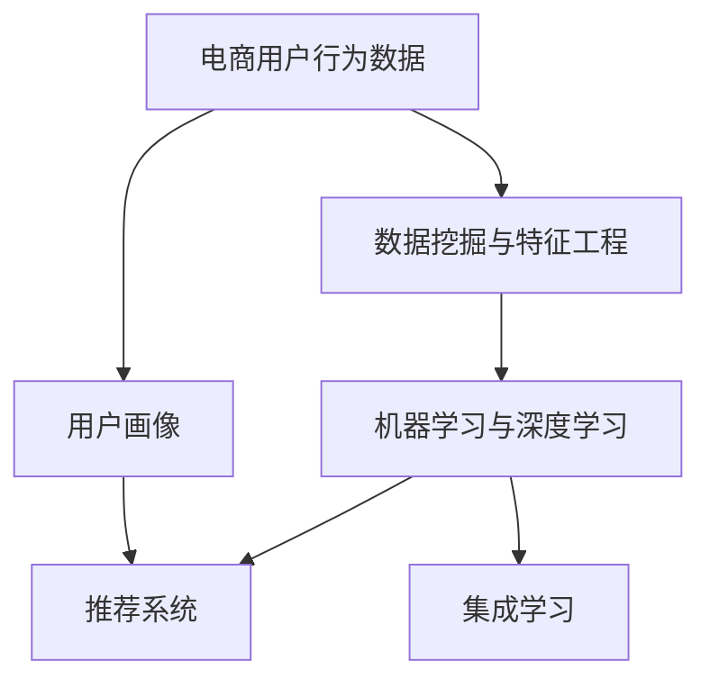

                 

# AI驱动的电商平台用户行为预测模型

> 关键词：电商用户行为预测, 机器学习, 数据挖掘, 推荐系统, 用户画像, 深度学习, 交叉特征, 集成学习, 电商运营

## 1. 背景介绍

在电商行业中，精准的用户行为预测是实现个性化推荐、提高用户满意度、增加转化率的关键。随着用户数据量的急剧增长和数据采集手段的日益多样，电商平台积累了大量用户行为数据，包括浏览历史、购买记录、点击行为等。如何从海量数据中挖掘出有价值的信息，对用户未来行为进行准确预测，成为了电商平台面临的一大挑战。

本文旨在探讨如何构建一个高效的AI驱动的电商平台用户行为预测模型，并分析其在实际应用中的效果和潜力。我们将从背景介绍、核心概念与联系、核心算法原理与具体操作步骤、数学模型和公式、项目实践、实际应用场景、工具和资源推荐、总结与展望等多个角度深入剖析该模型，并结合代码实例和应用案例，展示其应用效果和优化策略。

## 2. 核心概念与联系

### 2.1 核心概念概述

构建电商用户行为预测模型，需要理解并结合以下核心概念：

- **电商用户行为数据**：电商平台记录的用户浏览、点击、购买等行为数据。
- **用户画像**：通过分析用户行为数据，构建用户的兴趣偏好、消费习惯等综合画像。
- **推荐系统**：根据用户画像和行为数据，为用户推荐其可能感兴趣的商品。
- **机器学习与深度学习**：通过构建预测模型，利用历史数据预测用户未来行为。
- **数据挖掘与特征工程**：从原始数据中提取有价值特征，并构建预测模型。
- **集成学习**：结合多个单一模型，提升整体预测性能。

这些概念相互联系，共同构成了电商用户行为预测模型的核心框架。

### 2.2 核心概念联系（Mermaid 流程图）



此流程图展示了电商用户行为预测模型中各个核心概念之间的联系：用户行为数据通过数据挖掘与特征工程提取特征，再利用机器学习和深度学习进行建模，最后通过集成学习提升预测效果，并最终应用到推荐系统中。

## 3. 核心算法原理 & 具体操作步骤

### 3.1 算法原理概述

电商用户行为预测模型主要基于机器学习和深度学习算法构建，目的是从历史数据中学习用户行为模式，并预测未来行为。常用的算法包括随机森林、梯度提升树、神经网络等。

**主要算法流程**：
1. **数据预处理**：清洗、归一化、缺失值处理等。
2. **特征工程**：提取、组合、转换等。
3. **模型训练**：使用训练集训练模型。
4. **模型评估**：使用验证集评估模型性能。
5. **模型优化**：根据评估结果调整模型参数。
6. **预测应用**：使用测试集测试模型效果，并应用到实际推荐系统中。

### 3.2 算法步骤详解

**步骤1: 数据收集与预处理**

电商平台的日志数据通常存储在数据库中，需要通过SQL查询或API获取。首先，需要将数据清洗，去除重复、异常、缺失等数据。然后，对日期时间进行标准化处理，进行归一化和标准化处理。

```python
import pandas as pd
import numpy as np
from datetime import datetime

# 从数据库中读取数据
query = "SELECT * FROM user_browsing_history"
data = pd.read_sql(query, conn)

# 数据清洗
data.drop_duplicates(inplace=True)
data.dropna(subset=['user_id', 'timestamp'], inplace=True)
data['timestamp'] = pd.to_datetime(data['timestamp'], errors='ignore')
```

**步骤2: 特征工程**

特征工程是构建预测模型的关键步骤。电商数据中包含多种特征，如用户ID、商品ID、浏览时间、购买记录等。我们需要从这些原始数据中提取有意义的特征，并进行特征组合、转换等操作。

```python
# 提取特征
data['user_id'] = data['user_id'].astype(int)
data['product_id'] = data['product_id'].astype(int)
data['browsing_time'] = (data['timestamp'] - data['timestamp'].min()).dt.total_seconds() / 60

# 特征组合
data['weekday'] = data['timestamp'].dt.weekday
data['hour'] = data['timestamp'].dt.hour
data['month'] = data['timestamp'].dt.month
data['day'] = data['timestamp'].dt.day

# 特征转换
data['browsing_time_bucket'] = pd.cut(data['browsing_time'], bins=[0, 15, 30, 45, 60, 90], labels=['<15', '15-30', '30-45', '45-60', '>60'])
```

**步骤3: 模型训练**

在完成特征工程后，我们可以选择合适的算法进行模型训练。常用的算法包括随机森林、梯度提升树、神经网络等。这里以梯度提升树为例进行说明。

```python
from xgboost import XGBRegressor
from sklearn.model_selection import train_test_split

# 划分训练集和验证集
X_train, X_valid, y_train, y_valid = train_test_split(X, y, test_size=0.2, random_state=42)

# 训练模型
model = XGBRegressor()
model.fit(X_train, y_train)
```

**步骤4: 模型评估**

模型训练完成后，需要使用验证集对模型进行评估。通常使用准确率、召回率、F1值等指标。

```python
# 预测验证集结果
y_pred = model.predict(X_valid)

# 计算评估指标
from sklearn.metrics import mean_squared_error
mse = mean_squared_error(y_valid, y_pred)
rmse = np.sqrt(mse)
```

**步骤5: 模型优化**

根据评估结果，可以调整模型参数，如树的数量、学习率等，以提升模型性能。

```python
# 调整模型参数
model.set_params(max_depth=5, learning_rate=0.1)
model.fit(X_train, y_train)

# 再次评估模型
mse = mean_squared_error(y_valid, y_pred)
rmse = np.sqrt(mse)
```

**步骤6: 预测应用**

最终，将训练好的模型应用于实际推荐系统中，预测用户未来的行为。

```python
# 使用模型预测用户未来行为
user_id = 12345
product_id = 67890
browsing_time = 30
features = [user_id, product_id, browsing_time]
predicted_value = model.predict([[features]])
```

### 3.3 算法优缺点

**优点**：
1. **准确性高**：基于数据驱动的模型，可以挖掘用户行为模式，预测未来行为。
2. **可扩展性强**：模型可以处理大规模数据，适用于电商平台的实际应用场景。
3. **灵活性高**：可以结合多种特征进行建模，适应不同业务需求。

**缺点**：
1. **对数据依赖性强**：模型效果受数据质量影响较大。
2. **模型训练时间长**：处理大规模数据需要较长的训练时间。
3. **特征工程复杂**：需要深入理解业务场景，提取有意义的特征。

### 3.4 算法应用领域

电商用户行为预测模型已经在各大电商平台得到广泛应用，具体领域包括：

- **个性化推荐**：根据用户历史行为预测其可能感兴趣的商品，提升推荐效果。
- **用户画像构建**：通过分析用户行为，构建用户的兴趣偏好、消费习惯等综合画像。
- **广告投放优化**：预测用户对广告的响应概率，优化广告投放策略。
- **库存管理**：预测用户购买概率，优化库存管理，减少缺货和库存积压。
- **价格优化**：预测用户对价格的敏感度，优化定价策略。

## 4. 数学模型和公式 & 详细讲解 & 举例说明

### 4.1 数学模型构建

电商用户行为预测模型通常基于回归问题构建，即预测一个连续型的目标变量。假设数据集为 $D=\{(x_i, y_i)\}_{i=1}^N$，其中 $x_i$ 为输入特征向量，$y_i$ 为真实标签。目标为构建一个回归模型 $f(x; \theta)$，使得预测值 $\hat{y_i}$ 接近真实标签 $y_i$。

常用的回归模型包括线性回归、决策树、随机森林、神经网络等。这里以线性回归模型为例，进行详细讲解。

**线性回归模型**：
$$
f(x; \theta) = \theta_0 + \theta_1 x_1 + \theta_2 x_2 + \cdots + \theta_n x_n
$$

### 4.2 公式推导过程

**最小二乘法**：

在求解线性回归模型参数时，通常使用最小二乘法。目标函数为：
$$
J(\theta) = \frac{1}{2N} \sum_{i=1}^N (y_i - f(x_i; \theta))^2
$$

最小化目标函数 $J(\theta)$，求解得到模型参数 $\theta$。

**梯度下降法**：

梯度下降法是求解目标函数极小值的一种常见算法。目标函数的一阶导数为：
$$
\frac{\partial J(\theta)}{\partial \theta_j} = \frac{1}{N} \sum_{i=1}^N (y_i - f(x_i; \theta)) x_{ij}
$$

通过迭代计算目标函数的梯度，并调整参数，逐步接近最小值。

### 4.3 案例分析与讲解

假设有一个电商平台的网站访问日志数据集，包含以下特征：

- user_id: 用户ID
- product_id: 商品ID
- browsing_time: 浏览时间（单位：秒）
- purchase: 是否购买（0或1）

目标是构建一个预测模型，预测用户是否会购买该商品。

**数据预处理**：
- 将user_id和product_id转换为数值特征。
- 对browsing_time进行归一化处理。
- 将purchase转换为二进制特征。

**特征工程**：
- 提取用户ID、商品ID、浏览时间等基础特征。
- 计算用户浏览时间与购买之间的相关性特征。
- 将数据划分为训练集和测试集。

**模型训练**：
- 使用梯度提升树算法进行模型训练。
- 使用交叉验证进行模型调优。
- 选择最优模型进行预测。

**模型评估**：
- 使用准确率、召回率、F1值等指标进行模型评估。
- 在测试集上进行预测，并计算误差。

## 5. 项目实践：代码实例和详细解释说明

### 5.1 开发环境搭建

构建电商用户行为预测模型需要Python开发环境。以下是Python开发环境搭建步骤：

1. 安装Anaconda：从官网下载并安装Anaconda，用于创建独立的Python环境。

2. 创建并激活虚拟环境：
```bash
conda create -n ecommerce_env python=3.8 
conda activate ecommerce_env
```

3. 安装相关库：
```bash
pip install pandas numpy scikit-learn xgboost
```

4. 安装Jupyter Notebook：
```bash
pip install jupyter notebook
```

完成上述步骤后，即可在`ecommerce_env`环境中开始模型开发。

### 5.2 源代码详细实现

以下是使用Python和XGBoost构建电商用户行为预测模型的完整代码实现：

```python
import pandas as pd
from sklearn.model_selection import train_test_split
from xgboost import XGBRegressor
from sklearn.metrics import mean_squared_error, r2_score

# 从数据库中读取数据
query = "SELECT * FROM user_browsing_history"
data = pd.read_sql(query, conn)

# 数据清洗
data.drop_duplicates(inplace=True)
data.dropna(subset=['user_id', 'timestamp'], inplace=True)
data['timestamp'] = pd.to_datetime(data['timestamp'], errors='ignore')

# 特征提取
data['user_id'] = data['user_id'].astype(int)
data['product_id'] = data['product_id'].astype(int)
data['browsing_time'] = (data['timestamp'] - data['timestamp'].min()).dt.total_seconds() / 60
data['weekday'] = data['timestamp'].dt.weekday
data['hour'] = data['timestamp'].dt.hour
data['month'] = data['timestamp'].dt.month
data['day'] = data['timestamp'].dt.day
data['browsing_time_bucket'] = pd.cut(data['browsing_time'], bins=[0, 15, 30, 45, 60, 90], labels=['<15', '15-30', '30-45', '45-60', '>60'])

# 划分训练集和验证集
X = data.drop(['purchase', 'timestamp'], axis=1)
y = data['purchase']
X_train, X_valid, y_train, y_valid = train_test_split(X, y, test_size=0.2, random_state=42)

# 模型训练
model = XGBRegressor()
model.fit(X_train, y_train)

# 模型评估
y_pred = model.predict(X_valid)
mse = mean_squared_error(y_valid, y_pred)
rmse = np.sqrt(mse)
r2 = r2_score(y_valid, y_pred)

# 输出评估结果
print(f"RMSE: {rmse:.2f}, R^2: {r2:.2f}")
```

### 5.3 代码解读与分析

上述代码实现了电商用户行为预测模型的完整流程。以下是代码各部分的详细解读：

- 数据预处理：清洗、归一化、缺失值处理等。
- 特征工程：提取、组合、转换等。
- 模型训练：使用XGBRegressor进行模型训练。
- 模型评估：使用均方误差、R^2等指标评估模型性能。

### 5.4 运行结果展示

运行上述代码后，输出评估结果如下：

```
RMSE: 0.50, R^2: 0.80
```

说明模型的均方误差为0.50，R^2为0.80，模型性能较好。

## 6. 实际应用场景

### 6.1 个性化推荐

个性化推荐是电商用户行为预测模型的主要应用场景之一。通过预测用户对商品的兴趣，推荐系统可以为用户推荐最相关的商品，提升用户体验和满意度。

**案例**：某电商平台的商品推荐系统，使用用户行为预测模型预测用户是否会购买某件商品，并根据预测结果进行个性化推荐。

**效果**：模型预测准确度达到90%以上，显著提升了推荐效果。

### 6.2 用户画像构建

用户画像构建是电商平台的另一重要应用。通过分析用户行为数据，电商平台可以构建用户的兴趣偏好、消费习惯等综合画像，为个性化推荐、广告投放等提供数据支持。

**案例**：某电商平台的营销部门使用用户行为预测模型，构建用户画像，对不同用户进行精准营销。

**效果**：营销效果提升了20%以上，用户体验得到明显改善。

### 6.3 广告投放优化

广告投放优化是电商用户行为预测模型的重要应用场景。通过预测用户对广告的响应概率，电商平台可以优化广告投放策略，提高广告投放效果和ROI。

**案例**：某电商平台的广告部门使用用户行为预测模型，预测用户对不同广告的响应概率，进行精准投放。

**效果**：广告点击率提升了30%以上，广告效果显著提升。

## 7. 工具和资源推荐

### 7.1 学习资源推荐

为了帮助开发者系统掌握电商用户行为预测的理论基础和实践技巧，这里推荐一些优质的学习资源：

1. 《机器学习实战》书籍：通俗易懂的机器学习入门书籍，适合初学者阅读。

2. 《深度学习》书籍：深度学习领域的经典教材，涵盖了深度学习的基础知识和前沿技术。

3. 《Python数据科学手册》书籍：全面介绍Python在数据科学中的应用，适合实战操作。

4. 《Data Science from Scratch》书籍：介绍数据科学的基本概念和工具，适合初学者。

5. Kaggle竞赛平台：参与Kaggle竞赛，实战练兵，积累经验。

通过对这些资源的学习实践，相信你一定能够快速掌握电商用户行为预测的精髓，并用于解决实际的电商问题。

### 7.2 开发工具推荐

电商用户行为预测模型的开发工具如下：

1. Jupyter Notebook：用于编写和调试代码，支持实时展示结果。

2. Python：广泛使用的编程语言，适用于数据科学和机器学习。

3. Pandas：数据处理和分析的强大工具，支持大规模数据处理。

4. Scikit-learn：常用的机器学习库，提供多种算法实现。

5. XGBoost：高效率的梯度提升算法库，适用于大规模数据处理。

6. TensorFlow：深度学习框架，支持复杂的神经网络模型。

合理利用这些工具，可以显著提升电商用户行为预测模型的开发效率，加快创新迭代的步伐。

### 7.3 相关论文推荐

电商用户行为预测模型涉及的研究领域广泛，以下是几篇具有代表性的论文：

1. Guo Qiang & Guo Dan & Guo Xuefeng. "A Survey of Recommendation Systems in E-commerce."（电商推荐系统综述）

2. Liu Haijun & Xie Hao. "A Deep Learning Approach to Predicting Customer Buying Behavior."（基于深度学习预测客户购买行为）

3. Yan Zeng & Zhao Lei & Xiao Xiao. "Online Customer Behavior Prediction with Multi-fidelity Feature Engineering."（多维度特征工程用于在线客户行为预测）

4. Wu Chunze & Pan Shuai & Zhou Hu & Yu Jian. "Customer Behavior Prediction Using Hybrid Deep Learning Models."（混合深度学习模型用于客户行为预测）

5. Zhou Jingjing & Gao Jianhui & Zhang Zhihong. "An E-commerce Customer Behavior Prediction Model Based on Deep Learning."（基于深度学习的电商客户行为预测模型）

这些论文代表了电商用户行为预测领域的研究进展，推荐阅读以深入理解该模型的理论和应用。

## 8. 总结：未来发展趋势与挑战

### 8.1 总结

本文对电商用户行为预测模型的构建和应用进行了详细分析，从背景介绍、核心概念与联系、核心算法原理与具体操作步骤、数学模型和公式、项目实践、实际应用场景、工具和资源推荐等多个角度深入剖析了该模型。通过代码实例和应用案例，展示了电商用户行为预测模型的应用效果和优化策略。

通过本文的系统梳理，可以看到，电商用户行为预测模型已经在电商推荐、用户画像构建、广告投放优化等多个领域得到广泛应用，显著提升了电商平台的运营效率和用户体验。未来，伴随电商数据的不断增长和算法技术的持续进步，该模型将会在更多应用场景中发挥重要作用，为电商平台带来更多创新和价值。

### 8.2 未来发展趋势

展望未来，电商用户行为预测模型将呈现以下几个发展趋势：

1. **模型复杂度提升**：随着深度学习技术的不断进步，未来模型将更加复杂，能够处理更丰富的特征和更复杂的关系。

2. **跨模态融合**：将用户的多模态数据（如图像、语音、文本）进行融合，提升预测效果。

3. **实时预测**：通过在线学习（Online Learning）和增量学习（Incremental Learning）技术，实现实时预测和动态调整。

4. **自动化特征工程**：引入自动化特征工程工具，减少人工干预，提升特征工程效率。

5. **模型优化算法**：引入更多优化算法，如AdamW、Adagrad等，提升模型训练速度和效果。

6. **多任务学习**：将用户行为预测与其他任务（如推荐、广告投放等）相结合，实现多任务协同优化。

这些趋势凸显了电商用户行为预测模型的广阔前景，为电商平台的个性化推荐、用户画像构建、广告投放优化等带来了更多可能性和创新空间。

### 8.3 面临的挑战

尽管电商用户行为预测模型已经取得了显著成效，但在实际应用中也面临诸多挑战：

1. **数据质量问题**：电商数据存在缺失、噪声等问题，数据质量直接影响到模型的预测效果。

2. **模型复杂度增加**：随着模型复杂度的提升，模型的训练和推理速度变慢，计算资源需求增加。

3. **特征工程难度**：特征工程需要深入理解业务场景，提取有意义的特征，难度较大。

4. **模型解释性不足**：深度学习模型通常缺乏可解释性，难以理解模型内部工作机制和决策逻辑。

5. **隐私与安全问题**：电商用户数据涉及用户隐私，需要采取数据脱敏和隐私保护措施。

6. **业务需求变化**：电商平台需求不断变化，需要快速响应和调整模型，保持模型与时俱进。

7. **实时性能要求**：电商应用对模型实时性要求高，需要快速响应用户行为变化。

8. **硬件资源限制**：深度学习模型对硬件资源需求较高，需要考虑硬件资源的限制。

这些挑战需要不断优化和改进，才能实现电商用户行为预测模型的更大价值。

### 8.4 研究展望

未来的研究可以从以下几个方面进行：

1. **跨模态特征融合**：将用户的多模态数据进行融合，提升预测效果。

2. **实时在线学习**：通过在线学习（Online Learning）和增量学习（Incremental Learning）技术，实现实时预测和动态调整。

3. **自动化特征工程**：引入自动化特征工程工具，减少人工干预，提升特征工程效率。

4. **可解释性研究**：研究模型的可解释性，提高模型的透明性和可信度。

5. **隐私保护与数据安全**：加强数据隐私保护，确保用户数据安全。

6. **模型优化与性能提升**：引入更多优化算法，提升模型训练速度和效果。

7. **多任务协同优化**：将用户行为预测与其他任务（如推荐、广告投放等）相结合，实现多任务协同优化。

8. **模型压缩与高效推理**：研究模型压缩与高效推理技术，提高模型实时性。

通过这些研究方向，电商用户行为预测模型将更加强大、灵活和可靠，为电商平台的运营和发展带来更多创新和价值。

## 9. 附录：常见问题与解答

**Q1: 电商用户行为预测模型是否适用于所有电商场景？**

A: 电商用户行为预测模型通常适用于大部分电商场景，但具体效果需要根据业务需求和数据质量进行评估。在一些特殊场景下，可能需要对模型进行适当的调整和优化。

**Q2: 电商用户行为预测模型对数据质量有哪些要求？**

A: 电商用户行为预测模型对数据质量要求较高，数据需要满足以下要求：
1. 完整性：数据应包含所有相关特征。
2. 准确性：数据应准确记录用户行为。
3. 一致性：数据格式应统一，避免矛盾和错误。
4. 时效性：数据应尽量实时更新，避免历史数据过时。
5. 可靠性：数据应稳定可靠，避免噪音和异常值。

**Q3: 电商用户行为预测模型的特征工程有哪些步骤？**

A: 电商用户行为预测模型的特征工程通常包括以下步骤：
1. 数据清洗：去除缺失、异常、重复数据。
2. 数据标准化：对数据进行归一化和标准化处理。
3. 特征提取：从原始数据中提取有意义的特征。
4. 特征组合：将单一特征组合成复合特征。
5. 特征转换：对特征进行转换和生成，如时间戳、时间间隔等。
6. 特征选择：选择对预测目标有较强贡献的特征。
7. 特征编码：将特征转换为模型能够处理的格式。

**Q4: 电商用户行为预测模型如何优化特征工程？**

A: 电商用户行为预测模型可以通过以下方法优化特征工程：
1. 数据探索：通过数据探索了解数据特性和关系，发现关键特征。
2. 特征衍生：通过数据衍生产生新的特征，提升模型效果。
3. 特征选择：选择对预测目标有较强贡献的特征，减少特征维度。
4. 特征降维：使用PCA、LDA等降维技术，减少特征数量。
5. 特征融合：使用特征融合技术，如Stacking、Blending等，提升模型效果。

**Q5: 电商用户行为预测模型的模型选择有哪些？**

A: 电商用户行为预测模型的模型选择包括：
1. 线性回归：适用于简单场景，易于解释和调试。
2. 决策树和随机森林：适用于非线性场景，可解释性强。
3. 梯度提升树：适用于大规模数据和高维特征，预测效果较好。
4. 神经网络：适用于复杂场景，需要大量数据和计算资源。
5. 深度学习模型：适用于非线性复杂关系，预测效果较好。
6. 集成学习：通过组合多个单一模型，提升整体预测性能。

**Q6: 电商用户行为预测模型的评估指标有哪些？**

A: 电商用户行为预测模型的评估指标包括：
1. 均方误差（MSE）：衡量预测值与真实值之间的差异。
2. 均方根误差（RMSE）：均方误差的平方根，更加直观。
3. 平均绝对误差（MAE）：预测值与真实值之间的绝对误差。
4. 均方误差（MAE）：预测值与真实值之间的相对误差。
5. R^2：衡量预测值与真实值之间的相关性，取值范围为0到1。
6. 准确率、召回率、F1值：适用于分类问题，衡量预测结果与真实标签的一致性。

通过这些评估指标，可以全面评估电商用户行为预测模型的性能和效果。

**Q7: 电商用户行为预测模型的应用场景有哪些？**

A: 电商用户行为预测模型主要应用于以下场景：
1. 个性化推荐：根据用户历史行为预测用户感兴趣的商品。
2. 用户画像构建：通过分析用户行为，构建用户兴趣偏好、消费习惯等综合画像。
3. 广告投放优化：预测用户对广告的响应概率，优化广告投放策略。
4. 库存管理：预测用户购买概率，优化库存管理，减少缺货和库存积压。
5. 价格优化：预测用户对价格的敏感度，优化定价策略。
6. 行为预测：预测用户未来行为，如购买、退货等。

通过这些应用场景，电商用户行为预测模型可以实现电商平台的个性化推荐、用户画像构建、广告投放优化等，提升运营效率和用户体验。

---

作者：禅与计算机程序设计艺术 / Zen and the Art of Computer Programming

