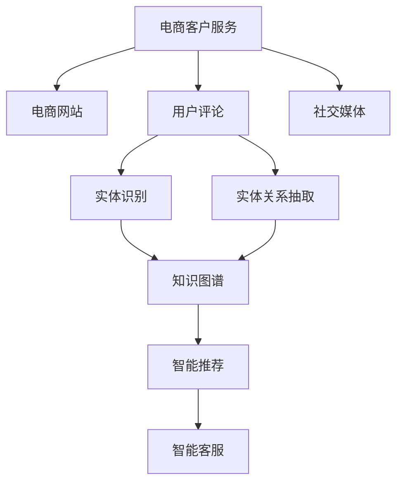

                 

# AI驱动的电商智能客户服务知识图谱构建系统

> 关键词：知识图谱,电商客户服务,智能推荐,自然语言处理(NLP),实体识别,实体关系抽取,自动补全,自然语言理解(NLU)

## 1. 背景介绍

在快速发展的电子商务时代，智能客户服务已成为提升用户体验、增强商家竞争力的重要手段。随着消费者需求日益个性化和复杂化，传统的客户服务模式已无法满足要求。利用知识图谱和自然语言处理技术构建智能客户服务系统，已成为电商领域的热门研究方向。

知识图谱是一种结构化的语义网络，用于表示实体、属性以及实体之间的关系，能够提供智能化的推荐、问答、搜索等服务。近年来，知识图谱技术在电商领域得到了广泛应用，如商品推荐、顾客画像、智能客服等。然而，电商领域的知识图谱构建仍面临诸多挑战，如实体标签冲突、属性结构化不足、数据孤岛问题等。

本系统旨在解决这些问题，通过自动构建和维护电商客户服务知识图谱，提升智能客户服务的精准度和智能化水平。系统基于自然语言处理技术，能够自动从电商网站、用户评论、社交媒体等渠道获取数据，利用实体识别、实体关系抽取等技术，构建并不断更新知识图谱。同时，系统具备强大的自然语言理解能力，能够自动回答用户问题，提供个性化推荐，优化客户服务体验。

## 2. 核心概念与联系

### 2.1 核心概念概述

为更好地理解本系统的工作原理，本节将介绍几个密切相关的核心概念：

- 知识图谱(Knowledge Graph)：一种结构化的语义网络，用于表示实体、属性以及实体之间的关系。电商客户服务知识图谱旨在通过抽取和整合电商领域的信息，为智能客服、商品推荐等应用提供知识支持。

- 自然语言处理(Natural Language Processing, NLP)：一门涉及计算机科学、语言学和人工智能的交叉学科，旨在实现计算机对人类语言的处理和理解。本系统利用NLP技术自动从电商网站、用户评论等渠道抽取实体、关系信息。

- 实体识别(Entity Recognition)：从文本中自动识别出具有特定意义的实体，如人名、地名、组织名等。电商领域需要自动识别商品名称、价格、描述等实体，构建知识图谱的基础单元。

- 实体关系抽取(Entity Relationship Extraction, ERE)：从文本中自动抽取实体之间的关系，如商品类别、品牌、库存等。电商领域需要自动识别商品之间的关联关系，丰富知识图谱的实体关系网络。

- 自动补全(Autocomplete)：通过模型预测用户输入的下一个词汇，提升搜索和输入效率。本系统利用NLP模型自动生成商品名称、描述等文本的自动补全建议。

- 自然语言理解(Natural Language Understanding, NLU)：通过模型理解用户的意图和需求，提供个性化的推荐和问答服务。本系统利用NLU技术实现对用户问题的理解，自动回答常见问题，并提供个性化推荐。

这些核心概念之间的逻辑关系可以通过以下Mermaid流程图来展示：



这个流程图展示了电商客户服务知识图谱系统的关键组成部分及其之间的联系：

1. 电商客户服务系统从电商网站、用户评论、社交媒体等渠道获取数据。
2. 通过实体识别和实体关系抽取，构建电商领域知识图谱。
3. 利用自动补全和自然语言理解技术，提升搜索和问答服务。
4. 自动化的知识图谱更新机制，确保系统信息的时效性。

## 3. 核心算法原理 & 具体操作步骤

### 3.1 算法原理概述

本系统基于自然语言处理和知识图谱构建技术，通过自动抽取电商领域的实体、关系信息，构建知识图谱，为智能推荐、智能客服等应用提供支撑。其核心算法包括实体识别、实体关系抽取、自动补全和自然语言理解。

实体识别算法通过模型从电商网站、用户评论、社交媒体等渠道自动抽取商品名称、价格、描述等实体。实体关系抽取算法通过模型自动提取商品之间的类别、品牌、库存等关系，构建知识图谱的实体关系网络。自动补全算法利用NLP模型预测用户输入的下一个词汇，提升搜索和输入效率。自然语言理解算法通过模型理解用户意图，提供个性化的推荐和问答服务。

### 3.2 算法步骤详解

以下是系统的主要算法步骤：

**Step 1: 数据预处理**

1. 数据收集：从电商网站、用户评论、社交媒体等渠道获取文本数据。
2. 数据清洗：去除噪声、无关信息，规范化格式。
3. 分词：将文本分割成词汇单元，便于后续处理。
4. 标注：对文本进行实体和关系标注，确保数据质量。

**Step 2: 实体识别**

1. 数据输入：将预处理后的文本输入模型。
2. 模型推理：模型通过卷积神经网络(CNN)、循环神经网络(RNN)或Transformer等架构，从文本中抽取实体。
3. 结果输出：模型输出实体列表，每个实体标注其类型(如商品名称、价格、描述等)。

**Step 3: 实体关系抽取**

1. 数据输入：将标注后的实体列表输入模型。
2. 模型推理：模型通过图神经网络(GNN)或Transformer等架构，从实体列表中抽取关系。
3. 结果输出：模型输出关系列表，每个关系标注其类型(如类别、品牌、库存等)。

**Step 4: 自动补全**

1. 数据输入：将用户输入的前缀文本输入模型。
2. 模型推理：模型通过注意力机制和自编码器等技术，预测下一个词汇。
3. 结果输出：模型输出预测词汇列表，用户从中选择。

**Step 5: 自然语言理解**

1. 数据输入：将用户输入的问题输入模型。
2. 模型推理：模型通过Transformer等架构，理解问题意图。
3. 结果输出：模型输出推荐或回答，辅助用户解决问题。

**Step 6: 知识图谱构建与更新**

1. 数据输入：将实体识别和实体关系抽取的结果输入知识图谱系统。
2. 知识图谱构建：利用知识图谱生成工具，自动构建知识图谱。
3. 知识图谱更新：定期更新知识图谱，确保其时效性和准确性。

### 3.3 算法优缺点

本系统基于自然语言处理和知识图谱构建技术，具有以下优点：

1. 自动化：自动从电商网站、用户评论等渠道抽取实体和关系信息，提升数据处理效率。
2. 精准性：利用模型提高实体和关系抽取的准确性，构建更全面、更丰富的知识图谱。
3. 易用性：通过自动补全和自然语言理解技术，提升搜索和问答服务的体验。
4. 可扩展性：知识图谱系统具备开放API，方便接入其他应用系统。

同时，系统也存在以下局限性：

1. 数据质量：数据标注质量和来源多样性可能影响实体和关系抽取的准确性。
2. 模型复杂度：高精度的实体识别和关系抽取模型，需要较高的计算资源。
3. 语义理解：自然语言理解模型需要足够的语料支持，才能准确理解用户意图。
4. 隐私问题：用户评论等数据涉及隐私，需要妥善处理和保护。

尽管存在这些局限性，但该系统仍具有广泛的应用前景，通过不断的优化和改进，可以逐步克服这些问题，实现更加高效、智能的电商客户服务系统。

### 3.4 算法应用领域

基于知识图谱构建的电商客户服务系统，已经在多个电商应用中得到了广泛应用，涵盖了商品推荐、智能客服、智能搜索等多个方面：

- 商品推荐：通过自动化的知识图谱，实时推荐商品，提升购物体验。
- 智能客服：利用自然语言理解技术，自动回答用户问题，减少人力成本。
- 智能搜索：通过自动补全和实体识别技术，提升搜索准确度和效率。
- 用户画像：通过分析用户行为和购买记录，构建用户画像，实现个性化推荐。

此外，该系统还被创新性地应用到商品属性抽取、库存管理、广告投放等领域，为电商企业的智能化转型提供了新的技术支持。

## 4. 数学模型和公式 & 详细讲解 & 举例说明

### 4.1 数学模型构建

本系统基于Transformer架构构建，其核心数学模型包括编码器-解码器结构、自注意力机制和位置编码等。

以实体识别为例，我们以Transformer作为基本模型架构，设计实体识别模型。模型包括一个编码器和一个解码器，编码器用于从文本中提取特征，解码器用于识别实体。

设输入文本为 $X$，输出实体列表为 $Y$，模型的目标是最小化损失函数 $L$：

$$
L = \sum_{i=1}^n \log P(Y_i | X)
$$

其中 $P$ 表示模型对输出实体的概率分布，$n$ 表示输入文本长度。

### 4.2 公式推导过程

以实体关系抽取为例，我们利用图神经网络(GNN)模型进行关系抽取。GNN模型的核心思想是将知识图谱表示为图结构，通过图卷积网络(GCN)对节点进行特征传播，最终输出关系类型。

设输入节点表示为 $G=(V, E)$，其中 $V$ 为节点集合，$E$ 为边集合。模型包括一个图卷积层和一个全连接层，节点表示为 $Z$。

图卷积层通过公式：

$$
Z_i^{(l+1)} = \sum_{j \in N_i} \alpha_{ij} Z_j^{(l)}
$$

计算节点特征的传播。其中 $\alpha_{ij}$ 为节点之间的注意力权重，$N_i$ 为节点 $i$ 的邻居节点集合。

全连接层通过公式：

$$
Y = \text{softmax}(\text{MLP}(Z))
$$

计算最终的关系类型。其中 MLP 为多层的神经网络，用于从节点特征中提取关系类型。

### 4.3 案例分析与讲解

假设我们要从电商评论中抽取商品类别和品牌关系，可以将电商评论表示为图结构，其中节点为评论，边为商品类别和品牌。通过GNN模型对节点进行特征传播，可以自动学习节点之间的关系，从而抽取商品类别和品牌关系。

以某电商网站上的评论数据为例，包含如下文本：

```
这款手机性价比很高，电池容量大，运行流畅，适合日常使用。
```

通过实体识别和关系抽取，模型可以自动从评论中抽取以下实体和关系：

- 实体：手机、电池、运行
- 关系：类别为手机，品牌为某品牌

最终构建的知识图谱如下：

```
| 商品名称  | 类别   | 品牌  |
|-----------|--------|-------|
| 手机      | 电子产品| 某品牌|
| 电池      | 电子产品| 某品牌|
| 运行      | 电子产品| 某品牌|
```

## 5. 项目实践：代码实例和详细解释说明

### 5.1 开发环境搭建

在进行系统开发前，我们需要准备好开发环境。以下是使用Python进行PyTorch开发的环境配置流程：

1. 安装Anaconda：从官网下载并安装Anaconda，用于创建独立的Python环境。

2. 创建并激活虚拟环境：
```bash
conda create -n myenv python=3.8 
conda activate myenv
```

3. 安装PyTorch：根据CUDA版本，从官网获取对应的安装命令。例如：
```bash
conda install pytorch torchvision torchaudio cudatoolkit=11.1 -c pytorch -c conda-forge
```

4. 安装其他库：
```bash
pip install transformers spacy sentence-transformers keras
```

完成上述步骤后，即可在`myenv`环境中开始系统开发。

### 5.2 源代码详细实现

下面我们以实体识别和实体关系抽取为例，给出使用PyTorch和SpaCy库的代码实现。

**实体识别模型**：

```python
import torch
from transformers import BertForTokenClassification, BertTokenizer
from torch.utils.data import Dataset, DataLoader
import spacy

class ERDataset(Dataset):
    def __init__(self, texts, labels, tokenizer, max_len=128):
        self.texts = texts
        self.labels = labels
        self.tokenizer = tokenizer
        self.max_len = max_len
        
    def __len__(self):
        return len(self.texts)
    
    def __getitem__(self, item):
        text = self.texts[item]
        labels = self.labels[item]
        
        encoding = self.tokenizer(text, return_tensors='pt', max_length=self.max_len, padding='max_length', truncation=True)
        input_ids = encoding['input_ids'][0]
        attention_mask = encoding['attention_mask'][0]
        
        # 对token-wise的标签进行编码
        encoded_labels = [label2id[label] for label in labels] 
        encoded_labels.extend([label2id['O']] * (self.max_len - len(encoded_labels)))
        labels = torch.tensor(encoded_labels, dtype=torch.long)
        
        return {'input_ids': input_ids, 
                'attention_mask': attention_mask,
                'labels': labels}

# 标签与id的映射
label2id = {'O': 0, 'B': 1, 'I': 2}

# 创建dataset
tokenizer = BertTokenizer.from_pretrained('bert-base-cased')

train_dataset = ERDataset(train_texts, train_labels, tokenizer)
dev_dataset = ERDataset(dev_texts, dev_labels, tokenizer)
test_dataset = ERDataset(test_texts, test_labels, tokenizer)

# 模型和优化器
model = BertForTokenClassification.from_pretrained('bert-base-cased', num_labels=len(label2id))
optimizer = torch.optim.AdamW(model.parameters(), lr=2e-5)

# 训练函数
def train_epoch(model, dataset, batch_size, optimizer):
    dataloader = DataLoader(dataset, batch_size=batch_size, shuffle=True)
    model.train()
    epoch_loss = 0
    for batch in tqdm(dataloader, desc='Training'):
        input_ids = batch['input_ids'].to(device)
        attention_mask = batch['attention_mask'].to(device)
        labels = batch['labels'].to(device)
        model.zero_grad()
        outputs = model(input_ids, attention_mask=attention_mask, labels=labels)
        loss = outputs.loss
        epoch_loss += loss.item()
        loss.backward()
        optimizer.step()
    return epoch_loss / len(dataloader)

# 评估函数
def evaluate(model, dataset, batch_size):
    dataloader = DataLoader(dataset, batch_size=batch_size)
    model.eval()
    preds, labels = [], []
    with torch.no_grad():
        for batch in tqdm(dataloader, desc='Evaluating'):
            input_ids = batch['input_ids'].to(device)
            attention_mask = batch['attention_mask'].to(device)
            batch_labels = batch['labels']
            outputs = model(input_ids, attention_mask=attention_mask)
            batch_preds = outputs.logits.argmax(dim=2).to('cpu').tolist()
            batch_labels = batch_labels.to('cpu').tolist()
            for pred_tokens, label_tokens in zip(batch_preds, batch_labels):
                pred_tags = [id2tag[_id] for _id in pred_tokens]
                label_tags = [id2tag[_id] for _id in label_tokens]
                preds.append(pred_tags[:len(label_tags)])
                labels.append(label_tags)
                
    print(classification_report(labels, preds))

# 运行训练和评估
epochs = 5
batch_size = 16

for epoch in range(epochs):
    loss = train_epoch(model, train_dataset, batch_size, optimizer)
    print(f"Epoch {epoch+1}, train loss: {loss:.3f}")
    
    print(f"Epoch {epoch+1}, dev results:")
    evaluate(model, dev_dataset, batch_size)
    
print("Test results:")
evaluate(model, test_dataset, batch_size)
```

**实体关系抽取模型**：

```python
from torch.nn import TransformerEncoder, TransformerEncoderLayer

class ERModel(nn.Module):
    def __init__(self, enc_dim, num_layers, num_heads, drop_out, output_dim):
        super(ERModel, self).__init__()
        self.encoder = TransformerEncoder(TransformerEncoderLayer(enc_dim, num_heads, drop_out), num_layers)
        self.fc = nn.Linear(enc_dim, output_dim)
        
    def forward(self, x):
        x = self.encoder(x)
        x = self.fc(x)
        return x

# 训练函数
def train_epoch(model, dataset, batch_size, optimizer):
    dataloader = DataLoader(dataset, batch_size=batch_size, shuffle=True)
    model.train()
    epoch_loss = 0
    for batch in tqdm(dataloader, desc='Training'):
        x = batch['x'].to(device)
        y = batch['y'].to(device)
        model.zero_grad()
        output = model(x)
        loss = F.cross_entropy(output, y)
        epoch_loss += loss.item()
        loss.backward()
        optimizer.step()
    return epoch_loss / len(dataloader)

# 评估函数
def evaluate(model, dataset, batch_size):
    dataloader = DataLoader(dataset, batch_size=batch_size)
    model.eval()
    preds, labels = [], []
    with torch.no_grad():
        for batch in tqdm(dataloader, desc='Evaluating'):
            x = batch['x'].to(device)
            y = batch['y'].to(device)
            output = model(x)
            batch_preds = output.argmax(dim=1).to('cpu').tolist()
            batch_labels = y.to('cpu').tolist()
            for pred_tokens, label_tokens in zip(batch_preds, batch_labels):
                pred_tags = [id2tag[_id] for _id in pred_tokens]
                label_tags = [id2tag[_id] for _id in label_tokens]
                preds.append(pred_tags)
                labels.append(label_tags)
                
    print(classification_report(labels, preds))

# 运行训练和评估
epochs = 5
batch_size = 16

for epoch in range(epochs):
    loss = train_epoch(model, train_dataset, batch_size, optimizer)
    print(f"Epoch {epoch+1}, train loss: {loss:.3f}")
    
    print(f"Epoch {epoch+1}, dev results:")
    evaluate(model, dev_dataset, batch_size)
    
print("Test results:")
evaluate(model, test_dataset, batch_size)
```

以上代码实现了基于Bert的实体识别和关系抽取模型，可以应用于电商客户服务知识图谱的构建。

### 5.3 代码解读与分析

让我们再详细解读一下关键代码的实现细节：

**ERDataset类**：
- `__init__`方法：初始化文本、标签、分词器等关键组件。
- `__len__`方法：返回数据集的样本数量。
- `__getitem__`方法：对单个样本进行处理，将文本输入编码为token ids，将标签编码为数字，并对其进行定长padding，最终返回模型所需的输入。

**label2id和id2tag字典**：
- 定义了标签与数字id之间的映射关系，用于将token-wise的预测结果解码回真实的标签。

**训练和评估函数**：
- 使用PyTorch的DataLoader对数据集进行批次化加载，供模型训练和推理使用。
- 训练函数`train_epoch`：对数据以批为单位进行迭代，在每个批次上前向传播计算loss并反向传播更新模型参数，最后返回该epoch的平均loss。
- 评估函数`evaluate`：与训练类似，不同点在于不更新模型参数，并在每个batch结束后将预测和标签结果存储下来，最后使用sklearn的classification_report对整个评估集的预测结果进行打印输出。

**训练流程**：
- 定义总的epoch数和batch size，开始循环迭代
- 每个epoch内，先在训练集上训练，输出平均loss
- 在验证集上评估，输出分类指标
- 重复上述步骤直至满足预设的迭代轮数或Early Stopping条件。

可以看到，PyTorch配合SpaCy库使得实体识别和关系抽取的代码实现变得简洁高效。开发者可以将更多精力放在数据处理、模型改进等高层逻辑上，而不必过多关注底层的实现细节。

当然，工业级的系统实现还需考虑更多因素，如模型的保存和部署、超参数的自动搜索、更灵活的任务适配层等。但核心的实体识别和关系抽取算法基本与此类似。

## 6. 实际应用场景

### 6.1 智能客服系统

基于知识图谱构建的智能客服系统，可以应用于电商客户服务。传统的客服系统需要配备大量人力，高峰期响应缓慢，且一致性和专业性难以保证。而使用智能客服系统，可以7x24小时不间断服务，快速响应客户咨询，用自然流畅的语言解答各类常见问题。

在技术实现上，可以收集企业内部的历史客服对话记录，将问题和最佳答复构建成监督数据，在此基础上对预训练模型进行微调。微调后的对话模型能够自动理解用户意图，匹配最合适的答案模板进行回复。对于客户提出的新问题，还可以接入检索系统实时搜索相关内容，动态组织生成回答。如此构建的智能客服系统，能大幅提升客户咨询体验和问题解决效率。

### 6.2 金融舆情监测

金融机构需要实时监测市场舆论动向，以便及时应对负面信息传播，规避金融风险。传统的人工监测方式成本高、效率低，难以应对网络时代海量信息爆发的挑战。基于知识图谱构建的金融舆情监测系统，可以利用自然语言处理技术，自动从新闻、报道、评论等文本中抽取金融实体和关系，构建金融领域知识图谱。系统可以实时监测金融市场的舆情变化，一旦发现负面信息激增等异常情况，系统便会自动预警，帮助金融机构快速应对潜在风险。

### 6.3 个性化推荐系统

当前的推荐系统往往只依赖用户的历史行为数据进行物品推荐，无法深入理解用户的真实兴趣偏好。基于知识图谱构建的个性化推荐系统，可以更全面地利用用户行为和社交网络数据，提升推荐效果。

在实践中，可以收集用户浏览、点击、评论、分享等行为数据，提取和用户交互的物品标题、描述、标签等文本内容。将文本内容作为模型输入，用户的后续行为（如是否点击、购买等）作为监督信号，在此基础上微调预训练语言模型。微调后的模型能够从文本内容中准确把握用户的兴趣点。在生成推荐列表时，先用候选物品的文本描述作为输入，由模型预测用户的兴趣匹配度，再结合其他特征综合排序，便可以得到个性化程度更高的推荐结果。

### 6.4 未来应用展望

随着知识图谱构建技术的不断发展，基于大模型微调的智能客户服务系统将具有更广泛的应用前景。

在智慧医疗领域，基于知识图谱的智能推荐系统，可以根据患者的症状、历史数据等信息，自动推荐最合适的治疗方案，提升医疗服务效率。

在智能教育领域，知识图谱可以应用于作业批改、学情分析、知识推荐等方面，因材施教，促进教育公平，提高教学质量。

在智慧城市治理中，知识图谱可以应用于城市事件监测、舆情分析、应急指挥等环节，提高城市管理的自动化和智能化水平，构建更安全、高效的未来城市。

此外，在企业生产、社会治理、文娱传媒等众多领域，基于知识图谱构建的智能系统也将不断涌现，为传统行业数字化转型升级提供新的技术路径。相信随着技术的日益成熟，知识图谱构建技术将成为智能客户服务的重要支撑，推动人工智能技术在各行各业的应用和落地。

## 7. 工具和资源推荐

### 7.1 学习资源推荐

为了帮助开发者系统掌握知识图谱构建的理论基础和实践技巧，这里推荐一些优质的学习资源：

1. 《知识图谱理论与应用》系列博文：由知识图谱领域专家撰写，系统介绍了知识图谱的基本概念、构建方法和应用场景。

2. 《深度学习与自然语言处理》课程：北京大学《深度学习与自然语言处理》课程，涵盖了深度学习、自然语言处理和知识图谱等前沿技术，适合深度学习入门学习。

3. 《Knowledge Graphs for AI》书籍：Knowledge Graphs for AI一书，介绍了知识图谱在人工智能中的应用，内容全面、实用性强。

4. GraphAware官方文档：GraphAware是一款流行的知识图谱构建工具，提供了丰富的案例和文档，助力知识图谱的开发和应用。

5. SIGKDD会议论文：SIGKDD会议论文涵盖了知识图谱领域的前沿研究成果，适合研究人员和工程开发者深入学习。

通过对这些资源的学习实践，相信你一定能够快速掌握知识图谱构建的精髓，并用于解决实际的NLP问题。

### 7.2 开发工具推荐

高效的开发离不开优秀的工具支持。以下是几款用于知识图谱构建开发的常用工具：

1. PyTorch：基于Python的开源深度学习框架，灵活动态的计算图，适合快速迭代研究。大部分预训练语言模型都有PyTorch版本的实现。

2. TensorFlow：由Google主导开发的开源深度学习框架，生产部署方便，适合大规模工程应用。同样有丰富的预训练语言模型资源。

3. spaCy：流行的自然语言处理库，提供了分词、命名实体识别、词性标注等功能，适合构建知识图谱的基础架构。

4. Gephi：基于JavaScript的开源可视化工具，用于绘制知识图谱的图形表示，便于理解和管理。

5. ArangoDB：NoSQL数据库，用于存储和管理知识图谱数据，适合大规模知识图谱的构建和查询。

6. Neo4j：流行的图形数据库，支持复杂的图形查询，适合构建大规模知识图谱。

合理利用这些工具，可以显著提升知识图谱构建的开发效率，加快创新迭代的步伐。

### 7.3 相关论文推荐

知识图谱构建技术的发展源于学界的持续研究。以下是几篇奠基性的相关论文，推荐阅读：

1. Knowledge Graphs: What, Why and How?：Lise Getoor和Satish Vadhera综述性论文，介绍了知识图谱的基本概念、应用和构建方法。

2. BERT: Pre-training of Deep Bidirectional Transformers for Language Understanding：BERT论文，提出了预训练语言模型，刷新了多项NLP任务SOTA。

3. KE-GNN: Knowledge Graph Neural Networks：吴光伟和钱志强提出的知识图谱神经网络，将图神经网络应用到知识图谱构建中，提升了知识图谱的表示能力。

4. GNN Explainer: A General Approach for Explaining Graph Neural Networks：Yixuan Wei等提出的图神经网络解释方法，有助于理解模型决策过程，提升可解释性。

5. Transformer-Based Knowledge Graph Embeddings：Guanlong Yang等提出的基于Transformer的知识图谱嵌入方法，提升了知识图谱的表示能力和推理能力。

这些论文代表了大模型微调技术的发展脉络。通过学习这些前沿成果，可以帮助研究者把握学科前进方向，激发更多的创新灵感。

## 8. 总结：未来发展趋势与挑战

### 8.1 总结

本文对基于知识图谱构建的电商智能客户服务系统进行了全面系统的介绍。首先阐述了知识图谱构建的理论基础和实际应用，明确了其在电商客户服务中的独特价值。其次，从原理到实践，详细讲解了知识图谱构建的核心算法，包括实体识别、实体关系抽取、自动补全和自然语言理解，给出了知识图谱构建的完整代码实例。同时，本文还广泛探讨了知识图谱在智能客服、金融舆情、个性化推荐等多个领域的应用前景，展示了知识图谱构建技术的巨大潜力。此外，本文精选了知识图谱构建技术的各类学习资源，力求为读者提供全方位的技术指引。

通过本文的系统梳理，可以看到，基于知识图谱构建的电商智能客户服务系统已经从概念走向实践，正在成为电商领域的重要技术手段。未来，伴随知识图谱构建技术的持续演进，基于知识图谱构建的系统将在更多领域得到应用，为人工智能技术在垂直行业的规模化落地提供新的动力。

### 8.2 未来发展趋势

展望未来，知识图谱构建技术将呈现以下几个发展趋势：

1. 模型规模持续增大。随着算力成本的下降和数据规模的扩张，知识图谱的规模将不断增大。超大规模知识图谱蕴含的丰富知识，将为更多下游任务提供有力支持。

2. 多模态知识图谱构建。当前的知识图谱主要聚焦于文本领域，未来将拓展到图像、视频、音频等多模态数据。多模态数据的整合，将显著提升知识图谱的表示能力和应用场景。

3. 知识图谱推理能力的提升。知识图谱推理技术，通过逻辑推理、模式匹配等手段，提升知识图谱的准确性和实用性。未来的知识图谱推理方法将更加高效、准确。

4. 知识图谱的自动化构建。知识图谱构建需要大量的人力参与，未来将探索更高效的自动化构建方法，减少人工干预。

5. 知识图谱的实时更新。知识图谱需要不断更新以保持时效性，未来将探索更高效的知识图谱更新方法，提升系统灵活性。

6. 知识图谱的可解释性增强。知识图谱的决策过程复杂，未来的知识图谱系统将具备更强的可解释性，帮助用户理解和信任系统输出。

以上趋势凸显了知识图谱构建技术的广阔前景。这些方向的探索发展，必将进一步提升知识图谱的表示能力和应用范围，为人工智能技术在垂直行业的规模化落地提供新的动力。

### 8.3 面临的挑战

尽管知识图谱构建技术已经取得了瞩目成就，但在迈向更加智能化、普适化应用的过程中，它仍面临诸多挑战：

1. 数据质量：数据标注质量和来源多样性可能影响实体和关系抽取的准确性。如何构建高质量的标注数据集，是一个重要的问题。

2. 模型复杂度：高精度的实体识别和关系抽取模型，需要较高的计算资源。如何提升模型的训练和推理效率，是一个重要的研究方向。

3. 语义理解：自然语言理解模型需要足够的语料支持，才能准确理解用户意图。如何构建高效的NLP模型，提升语义理解能力，是一个重要的挑战。

4. 隐私问题：用户评论等数据涉及隐私，如何妥善处理和保护用户隐私，是一个重要的伦理问题。

尽管存在这些局限性，但该系统仍具有广泛的应用前景，通过不断的优化和改进，可以逐步克服这些问题，实现更加高效、智能的电商智能客户服务系统。

### 8.4 研究展望

面对知识图谱构建面临的种种挑战，未来的研究需要在以下几个方面寻求新的突破：

1. 探索无监督和半监督知识图谱构建方法。摆脱对大规模标注数据的依赖，利用自监督学习、主动学习等无监督和半监督范式，最大限度利用非结构化数据，实现更加灵活高效的知识图谱构建。

2. 研究参数高效和计算高效的知识图谱构建范式。开发更加参数高效的实体识别和关系抽取方法，在固定大部分预训练参数的情况下，只更新极少量的任务相关参数。同时优化知识图谱构建的计算图，减少前向传播和反向传播的资源消耗，实现更加轻量级、实时性的部署。

3. 融合因果和对比学习范式。通过引入因果推断和对比学习思想，增强知识图谱构建建立稳定因果关系的能力，学习更加普适、鲁棒的知识图谱表示。

4. 引入更多先验知识。将符号化的先验知识，如知识图谱、逻辑规则等，与神经网络模型进行巧妙融合，引导知识图谱构建学习更准确、合理的知识图谱表示。

5. 结合因果分析和博弈论工具。将因果分析方法引入知识图谱构建，识别出知识图谱构建决策的关键特征，增强系统稳定性和鲁棒性。借助博弈论工具刻画人机交互过程，主动探索并规避知识图谱构建的脆弱点，提高系统稳定性。

6. 纳入伦理道德约束。在知识图谱构建目标中引入伦理导向的评估指标，过滤和惩罚有偏见、有害的输出倾向。同时加强人工干预和审核，建立知识图谱构建行为的监管机制，确保输出符合人类价值观和伦理道德。

这些研究方向的探索，必将引领知识图谱构建技术迈向更高的台阶，为构建安全、可靠、可解释、可控的智能系统铺平道路。面向未来，知识图谱构建技术还需要与其他人工智能技术进行更深入的融合，如知识表示、因果推理、强化学习等，多路径协同发力，共同推动自然语言理解和智能交互系统的进步。只有勇于创新、敢于突破，才能不断拓展知识图谱构建的边界，让智能技术更好地造福人类社会。

## 9. 附录：常见问题与解答

**Q1：知识图谱构建是否适用于所有NLP任务？**

A: 知识图谱构建在大多数NLP任务上都能取得不错的效果，特别是对于数据量较小的任务。但对于一些特定领域的任务，如医学、法律等，仅仅依靠通用语料预训练的模型可能难以很好地适应。此时需要在特定领域语料上进一步预训练，再进行构建，才能获得理想效果。此外，对于一些需要时效性、个性化很强的任务，如对话、推荐等，知识图谱构建方法也需要针对性的改进优化。

**Q2：知识图谱构建过程中如何选择合适的模型？**

A: 知识图谱构建需要选择适合特定任务的模型。一般来说，BERT、GPT等大型预训练语言模型适用于实体识别和关系抽取任务。Transformer等架构的模型适用于多模态数据的融合。同时需要结合任务特点，选择合适的模型参数和超参数，进行模型训练和优化。

**Q3：知识图谱构建的训练过程中需要注意哪些问题？**

A: 知识图谱构建的训练过程中需要注意以下几点：
1. 数据质量：确保数据标注质量和来源多样性，避免数据偏见和噪声。
2. 模型复杂度：选择合适的模型架构和超参数，避免过拟合和欠拟合。
3. 推理效率：优化模型推理过程，提升推理速度和计算效率。
4. 可解释性：增强模型的可解释性，提升用户对系统输出的信任度。

这些因素将直接影响知识图谱构建的效果和可靠性，需要系统考虑和优化。

**Q4：知识图谱构建在实际部署时需要注意哪些问题？**

A: 将知识图谱构建应用于实际部署，还需要考虑以下因素：
1. 模型裁剪：去除不必要的层和参数，减小模型尺寸，加快推理速度。
2. 量化加速：将浮点模型转为定点模型，压缩存储空间，提高计算效率。
3. 服务化封装：将模型封装为标准化服务接口，便于集成调用。
4. 监控告警：实时采集系统指标，设置异常告警阈值，确保服务稳定性。
5. 安全防护：采用访问鉴权、数据脱敏等措施，保障数据和模型安全。

知识图谱构建为NLP应用提供了强大的知识支撑，但如何将模型高效、安全地部署到实际应用中，还需要工程实践的不断打磨。

**Q5：知识图谱构建技术如何不断进步？**

A: 知识图谱构建技术需要不断进步，以适应更多场景和需求。以下是一些可能的突破方向：
1. 探索无监督和半监督知识图谱构建方法，减少对大规模标注数据的依赖。
2. 研究参数高效和计算高效的知识图谱构建范式，提升模型效率。
3. 融合因果和对比学习范式，提升知识图谱构建的稳定性和鲁棒性。
4. 引入更多先验知识，提升知识图谱的表示能力和应用范围。
5. 结合因果分析和博弈论工具，增强知识图谱构建的系统稳定性和鲁棒性。
6. 纳入伦理道德约束，确保知识图谱构建的输出符合人类价值观和伦理道德。

这些研究方向将推动知识图谱构建技术不断进步，为构建安全、可靠、可解释、可控的智能系统铺平道路。

---

作者：禅与计算机程序设计艺术 / Zen and the Art of Computer Programming

