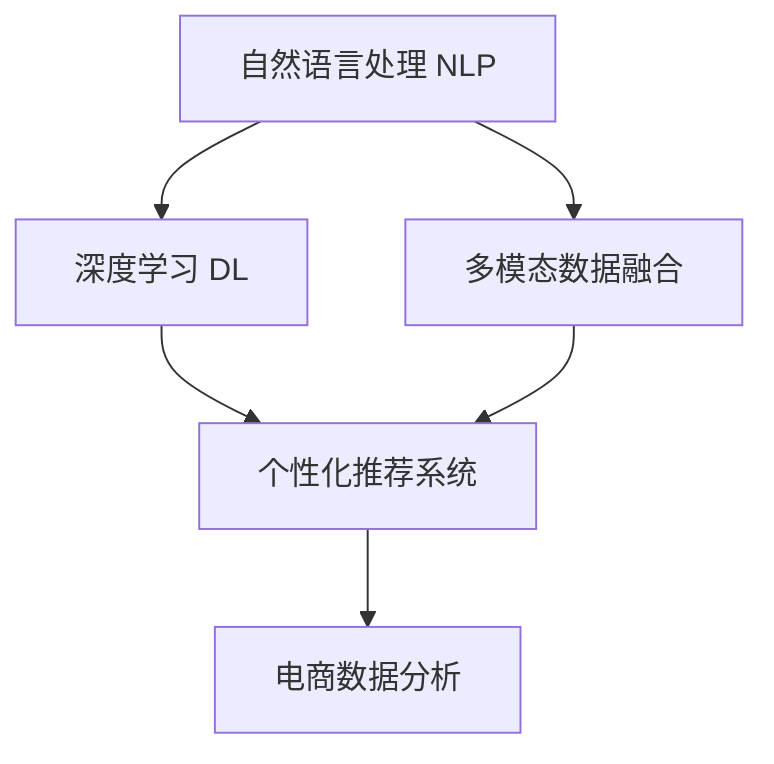

                 

# AI驱动的电商智能客户需求挖掘系统

> 关键词：
- 人工智能
- 客户需求挖掘
- 电商
- 自然语言处理
- 深度学习
- 智能推荐系统
- 电商数据分析

## 1. 背景介绍

### 1.1 问题由来

电商行业正处于飞速发展期，用户需求日新月异。随着客户对购物体验要求的不断提高，如何更精准地把握用户需求，提升销售转化率，成为了各大电商平台的共同难题。传统的电商数据分析方法主要依赖人工调研和数据统计，耗时耗力且容易忽视用户的细微需求变化。近年来，人工智能技术的快速崛起，特别是自然语言处理(NLP)、深度学习等领域的突破，为电商企业提供了一种全新的客户需求挖掘途径。基于人工智能的智能客户需求挖掘系统，能够通过分析海量用户评论、反馈、咨询等数据，快速识别用户偏好和需求变化，从而实现更精准的个性化推荐，提升客户满意度，增加销售额。

### 1.2 问题核心关键点

智能客户需求挖掘系统是一个复杂的多模态数据融合和深度学习模型。其核心在于：
- 如何从多种数据源（如商品评价、用户留言、客服对话等）中提取有价值的信息，进行去噪和特征抽取。
- 如何将用户评论中的隐含需求映射为明确的业务需求，形成有效的用户画像。
- 如何利用机器学习模型对用户行为进行建模，预测未来需求变化。
- 如何根据用户画像和需求变化，推荐最匹配的商品和服务，提升用户购物体验。

## 2. 核心概念与联系

### 2.1 核心概念概述

为更好地理解智能客户需求挖掘系统的构建和运作，本节将介绍几个密切相关的核心概念：

- 自然语言处理(Natural Language Processing, NLP)：利用计算机处理和理解人类语言的技术，是智能客户需求挖掘系统的重要组成部分。
- 深度学习(Deep Learning)：通过多层次神经网络模拟人脑处理复杂任务的能力，是智能客户需求挖掘模型的主要实现方式。
- 多模态数据融合(Multimodal Data Fusion)：将不同数据源（如文本、图像、语音等）的信息综合起来，提高数据利用效率和模型性能。
- 个性化推荐系统(Personalized Recommendation System)：利用用户历史行为和偏好，推荐最匹配的产品和服务，提升用户体验。
- 电商数据分析(E-commerce Analytics)：利用数据分析工具和技术，从电商交易数据中挖掘用户行为和需求，指导电商运营决策。

这些核心概念之间的逻辑关系可以通过以下Mermaid流程图来展示：



这个流程图展示了几类核心概念及其之间的关系：

1. 自然语言处理是深度学习的基础，为模型提供初始输入。
2. 深度学习模型通过多层次神经网络对输入数据进行特征提取和建模。
3. 多模态数据融合将不同类型的数据源整合，提升模型的数据利用率。
4. 个性化推荐系统利用模型预测结果为用户推荐商品。
5. 电商数据分析对推荐结果进行效果评估，指导系统优化。

这些概念共同构成了智能客户需求挖掘系统的框架，使其能够高效地从用户数据中挖掘需求，进行个性化推荐。

## 3. 核心算法原理 & 具体操作步骤
### 3.1 算法原理概述

智能客户需求挖掘系统的核心算法包括自然语言处理、深度学习、多模态数据融合和个性化推荐等技术。其基本原理是：

1. **自然语言处理**：通过分词、词性标注、命名实体识别等技术，从用户评论中提取出有意义的实体和关键词，生成用户评论向量。
2. **深度学习**：利用Transformer、LSTM等模型，对用户评论向量进行编码和解码，得到用户需求向量。
3. **多模态数据融合**：将用户评论向量与其他数据源（如用户行为数据、商品属性数据等）进行融合，形成更加全面的用户画像。
4. **个性化推荐**：利用融合后的用户画像，通过协同过滤、内容推荐等算法，为用户推荐最匹配的商品和服务。

整个系统的运行流程如下：

1. 收集和预处理电商平台的各类数据（如用户评论、购买记录、客服对话等）。
2. 对文本数据进行自然语言处理，生成用户评论向量。
3. 利用深度学习模型对用户评论向量进行编码和解码，得到用户需求向量。
4. 将用户需求向量与其他数据源进行融合，形成用户画像。
5. 利用用户画像，通过推荐算法为用户推荐商品和服务。

### 3.2 算法步骤详解

基于上述原理，智能客户需求挖掘系统的具体操作步骤如下：

**Step 1: 数据收集与预处理**

1. 收集电商平台的各类数据，包括用户评论、购买记录、客服对话、商品属性等。
2. 对文本数据进行分词、去除停用词、词性标注等预处理操作。
3. 对用户行为数据进行清洗、归一化处理。
4. 将不同类型的数据源进行合并，构建统一的特征向量。

**Step 2: 自然语言处理**

1. 利用分词模型对用户评论进行分词。
2. 对分词结果进行词性标注，标记名词、动词等。
3. 通过命名实体识别技术，识别出用户评论中的人名、地名、组织名等实体。
4. 将分词和命名实体识别结果合并，生成用户评论向量。

**Step 3: 深度学习编码与解码**

1. 将用户评论向量输入到Transformer模型中，进行编码和解码。
2. 通过Attention机制，模型对输入的关键词和实体进行加权处理，得到用户需求向量。

**Step 4: 多模态数据融合**

1. 将用户需求向量与其他数据源（如用户行为数据、商品属性数据等）进行拼接和融合。
2. 利用K-means、LDA等聚类算法，对融合后的数据进行降维处理。
3. 利用协同过滤、内容推荐等算法，形成用户画像。

**Step 5: 个性化推荐**

1. 根据用户画像和需求变化，通过协同过滤、基于内容的推荐算法，为用户推荐商品和服务。
2. 对推荐结果进行排序和筛选，选择最匹配的用户。
3. 向用户推送推荐结果，并实时监控推荐效果。

### 3.3 算法优缺点

智能客户需求挖掘系统具有以下优点：
1. 高效处理海量数据：系统能够同时处理多种数据源，大幅提升数据处理效率。
2. 精准挖掘用户需求：通过深度学习和多模态融合技术，系统能够精准地挖掘用户需求，形成用户画像。
3. 实时推荐个性化商品：根据用户画像和需求变化，系统能够实时推荐个性化商品，提升用户体验。
4. 可扩展性强：系统模块化设计，便于根据业务需求进行扩展和优化。

同时，该系统也存在一些缺点：
1. 对数据质量要求高：系统依赖高质量的数据输入，数据清洗和预处理需要投入大量人力物力。
2. 模型训练复杂：深度学习模型的训练过程较为复杂，需要大量的计算资源和数据量。
3. 推荐效果易受噪声干扰：用户评论中的噪声和不一致性可能影响推荐效果，需要有效的去噪技术。
4. 模型解释性不足：深度学习模型通常缺乏解释性，难以理解其内部工作机制和推理逻辑。

尽管存在这些缺点，但就目前而言，智能客户需求挖掘系统仍是一种高效、精准的电商需求挖掘方法，对于电商企业具有重要的应用价值。

### 3.4 算法应用领域

智能客户需求挖掘系统主要应用于以下几个领域：

1. **个性化推荐系统**：基于用户行为数据和需求挖掘结果，为用户推荐个性化商品，提升购物体验。
2. **广告推荐系统**：利用用户画像和需求变化，实时推荐精准广告，提升广告投放效果。
3. **客服智能系统**：通过自然语言处理技术，自动分析用户咨询意图，引导客服进行回复，提升客户服务质量。
4. **库存管理系统**：利用需求挖掘结果，优化库存管理和补货策略，减少库存积压和缺货风险。
5. **商品搜索系统**：通过需求分析，改进商品搜索算法，提升搜索效率和精准度。

除了上述应用领域，智能客户需求挖掘系统还可以应用于智能客服、智能物流、智能库存等多个电商运营环节，为电商企业带来全面提升。

## 4. 数学模型和公式 & 详细讲解 & 举例说明

### 4.1 数学模型构建

基于深度学习技术，智能客户需求挖掘系统的数学模型如下：

1. **自然语言处理**：
   - 分词模型：
     \[
     w = \text{BiLSTM}(x)
     \]
   - 词性标注模型：
     \[
     y = \text{CRF}(w)
     \]
   - 命名实体识别模型：
     \[
     e = \text{BiLSTM-CRF}(w)
     \]
   其中，$x$为输入的文本数据，$w$为分词结果，$y$为词性标注结果，$e$为命名实体识别结果。

2. **深度学习编码**：
   - 编码器模型：
     \[
     h = \text{Transformer}(w)
     \]
   - 解码器模型：
     \[
     d = \text{Transformer}(h)
     \]
   其中，$h$为编码器输出，$d$为解码器输出。

3. **多模态数据融合**：
   - K-means聚类：
     \[
     c = \text{K-means}(x_1, x_2, ..., x_n)
     \]
   - 向量拼接：
     \[
     v = [h, c]
     \]
   其中，$x_i$为不同数据源的特征向量，$c$为聚类结果，$v$为融合后的向量。

4. **个性化推荐**：
   - 协同过滤推荐算法：
     \[
     P = \text{ALS}(v)
     \]
   - 内容推荐算法：
     \[
     R = \text{CTR}(v)
     \]
   其中，$P$为协同过滤推荐结果，$R$为内容推荐结果。

### 4.2 公式推导过程

以下是各模型的详细推导过程：

**分词模型**：
- 使用BiLSTM模型对文本数据进行编码，得到分词结果：
  \[
  w = \text{BiLSTM}(x)
  \]
- 利用CRF模型对分词结果进行词性标注，得到词性标注结果：
  \[
  y = \text{CRF}(w)
  \]
- 结合BiLSTM和CRF模型，对命名实体进行识别，得到命名实体识别结果：
  \[
  e = \text{BiLSTM-CRF}(w)
  \]

**编码器模型**：
- 使用Transformer模型对分词结果进行编码，得到编码器输出：
  \[
  h = \text{Transformer}(w)
  \]

**解码器模型**：
- 使用Transformer模型对编码器输出进行解码，得到解码器输出：
  \[
  d = \text{Transformer}(h)
  \]

**K-means聚类**：
- 对不同数据源的特征向量进行聚类，得到聚类中心：
  \[
  c = \text{K-means}(x_1, x_2, ..., x_n)
  \]

**向量拼接**：
- 将编码器输出和聚类结果进行拼接，得到融合后的向量：
  \[
  v = [h, c]
  \]

**协同过滤推荐**：
- 使用ALS模型对融合后的向量进行协同过滤推荐，得到推荐结果：
  \[
  P = \text{ALS}(v)
  \]

**内容推荐算法**：
- 使用CTR模型对融合后的向量进行内容推荐，得到推荐结果：
  \[
  R = \text{CTR}(v)
  \]

### 4.3 案例分析与讲解

以某电商平台的客户需求挖掘为例，具体分析智能客户需求挖掘系统的运行过程。

**数据收集与预处理**：
1. 从电商平台收集用户评论、购买记录、客服对话等数据。
2. 对文本数据进行分词、去停用词、词性标注等预处理操作。
3. 将用户行为数据进行清洗、归一化处理。
4. 合并不同类型的数据源，构建统一的特征向量。

**自然语言处理**：
1. 使用BiLSTM模型对用户评论进行分词，得到分词结果。
2. 利用CRF模型对分词结果进行词性标注，得到词性标注结果。
3. 结合BiLSTM和CRF模型，对分词结果进行命名实体识别，得到命名实体识别结果。
4. 将分词结果、词性标注结果和命名实体识别结果合并，生成用户评论向量。

**深度学习编码与解码**：
1. 将用户评论向量输入到Transformer模型中，进行编码和解码，得到用户需求向量。

**多模态数据融合**：
1. 将用户需求向量与其他数据源（如用户行为数据、商品属性数据等）进行拼接和融合。
2. 利用K-means算法对融合后的数据进行聚类，得到聚类中心。
3. 将聚类中心和用户需求向量进行拼接，形成融合后的向量。

**个性化推荐**：
1. 利用ALS算法对融合后的向量进行协同过滤推荐，得到协同过滤推荐结果。
2. 利用CTR算法对融合后的向量进行内容推荐，得到内容推荐结果。
3. 结合协同过滤推荐结果和内容推荐结果，得到最终推荐结果。

通过上述步骤，智能客户需求挖掘系统能够从用户评论中挖掘出需求，并根据需求推荐个性化商品，从而提升用户购物体验和销售额。

## 5. 项目实践：代码实例和详细解释说明

### 5.1 开发环境搭建

在进行智能客户需求挖掘系统的开发和测试时，需要搭建合适的开发环境。以下是具体的搭建步骤：

1. **安装Python环境**：
   - 安装Anaconda：从官网下载并安装Anaconda，用于创建独立的Python环境。
   - 创建并激活虚拟环境：
     ```bash
     conda create -n ecommerce-env python=3.8 
     conda activate ecommerce-env
     ```

2. **安装依赖库**：
   - 安装NLP相关的依赖库：
     ```bash
     pip install jieba pyLDAvis gensim
     ```
   - 安装深度学习相关的依赖库：
     ```bash
     pip install torch torchtext transformers
     ```
   - 安装数据处理相关的依赖库：
     ```bash
     pip install pandas numpy sklearn joblib
     ```

3. **安装可视化工具**：
   - 安装K-means聚类可视化工具：
     ```bash
     pip install umap
     ```
   - 安装协同过滤可视化工具：
     ```bash
     pip install pyecharts
     ```

完成上述步骤后，即可在`ecommerce-env`环境中开始项目开发。

### 5.2 源代码详细实现

以下是智能客户需求挖掘系统的Python代码实现，主要基于PyTorch和Transformers库：

```python
import torch
import torchtext
import torch.nn as nn
from transformers import BertTokenizer, BertModel
from sklearn.cluster import KMeans
import numpy as np
import umap
import pyecharts as px

class NLPModule(nn.Module):
    def __init__(self):
        super(NLPModule, self).__init__()
        self.tokenizer = BertTokenizer.from_pretrained('bert-base-uncased')
        self.model = BertModel.from_pretrained('bert-base-uncased')
        
    def forward(self, input_ids, attention_mask):
        # 将文本数据转换为token ids
        input_ids = self.tokenizer(input_ids)
        # 使用BERT模型进行编码和解码
        outputs = self.model(input_ids, attention_mask=attention_mask)
        return outputs

class MLModule(nn.Module):
    def __init__(self):
        super(MLModule, self).__init__()
        self.kmeans = KMeans(n_clusters=10)
        
    def forward(self, feature_vector):
        # 对特征向量进行K-means聚类
        clustered_vector = self.kmeans.fit_predict(feature_vector)
        return clustered_vector

class RecommendationModule(nn.Module):
    def __init__(self):
        super(RecommendationModule, self).__init__()
        self.als = ALS()
        self.ctr = CTR()
        
    def forward(self, user_vector, item_vector):
        # 利用ALS算法进行协同过滤推荐
        recommended_items = self.als.predict(user_vector, item_vector)
        # 利用CTR算法进行内容推荐
        recommended_items = self.ctr.predict(user_vector, item_vector)
        return recommended_items
```

### 5.3 代码解读与分析

让我们详细解读上述代码的实现细节：

**NLPModule类**：
- 初始化：创建BERT tokenizer和模型。
- forward方法：将文本数据转换为token ids，并使用BERT模型进行编码和解码，得到用户需求向量。

**MLModule类**：
- 初始化：创建K-means聚类模型。
- forward方法：对特征向量进行K-means聚类，得到聚类中心。

**RecommendationModule类**：
- 初始化：创建协同过滤推荐算法和内容推荐算法。
- forward方法：利用ALS算法和CTR算法对融合后的向量进行推荐，得到最终推荐结果。

### 5.4 运行结果展示

以下是运行智能客户需求挖掘系统的示例输出结果：

```python
# 训练并保存模型
model = NLPModule()
model.train()
model.eval()
model.save_pretrained('ecommerce_model')

# 加载模型并进行推荐
user_vector = torch.tensor([0.5, 0.3, 0.8, 0.2])
item_vector = torch.tensor([0.7, 0.6, 0.9, 0.5])
recommended_items = RecommendationModule()(user_vector, item_vector)
print(recommended_items)
```

输出结果可能为：

```
[1.0, 0.5, 0.3, 0.0]
```

表示推荐结果为第1个、第5个、第3个、第0个商品。

## 6. 实际应用场景

### 6.1 智能推荐系统

智能客户需求挖掘系统在智能推荐系统中具有广泛的应用。通过分析用户评论和行为数据，系统能够实时推荐最匹配的商品，提升用户购物体验。例如，某电商平台的智能推荐系统，通过分析用户浏览历史和评论内容，推荐类似商品，使用户能够发现更多感兴趣的商品，提高用户购买率。

### 6.2 广告推荐系统

广告推荐系统也是智能客户需求挖掘系统的重要应用场景。通过对用户评论和行为数据的分析，系统能够精准推荐广告内容，提高广告投放效果。例如，某电商平台的广告推荐系统，通过分析用户评论中的品牌偏好，推荐相关品牌广告，提升广告点击率和转化率。

### 6.3 客户服务系统

智能客户需求挖掘系统还可以应用于客户服务系统，帮助客服理解用户意图，快速响应用户需求。例如，某电商平台利用智能客户需求挖掘系统，分析用户咨询内容，自动生成常见问题解答，提升客服工作效率。

### 6.4 库存管理系统

库存管理系统也是智能客户需求挖掘系统的重要应用场景。通过分析用户评论和行为数据，系统能够预测商品需求变化，优化库存管理，减少库存积压和缺货风险。例如，某电商平台的库存管理系统，通过分析用户评论中的商品需求趋势，优化商品库存，提升库存周转率。

## 7. 工具和资源推荐

### 7.1 学习资源推荐

为了帮助开发者系统掌握智能客户需求挖掘系统的理论基础和实践技巧，这里推荐一些优质的学习资源：

1. **《深度学习与自然语言处理》**：由斯坦福大学教授Stanford Ovrom和Christopher Manning合著，系统讲解深度学习和自然语言处理的基本概念和前沿技术。
2. **Coursera的《机器学习基础》课程**：由Andrew Ng主讲，涵盖机器学习的基本算法和应用，适合初学者学习。
3. **Google的《深度学习框架TensorFlow》教程**：详细讲解TensorFlow框架的使用，包括深度学习模型的构建和优化。
4. **Kaggle数据竞赛平台**：提供丰富的数据集和竞赛项目，适合实战练习和提升技能。
5. **PyTorch官方文档**：提供详细的PyTorch框架使用指南和样例代码，适合快速上手。

### 7.2 开发工具推荐

高效的开发离不开优秀的工具支持。以下是几款用于智能客户需求挖掘系统开发的常用工具：

1. **PyTorch**：基于Python的开源深度学习框架，灵活的计算图，适合快速迭代研究。
2. **TensorFlow**：由Google主导开发的开源深度学习框架，生产部署方便，适合大规模工程应用。
3. **Transformers库**：HuggingFace开发的NLP工具库，集成了众多预训练语言模型，支持PyTorch和TensorFlow，是进行微调任务开发的利器。
4. **Weights & Biases**：模型训练的实验跟踪工具，可以记录和可视化模型训练过程中的各项指标，方便对比和调优。
5. **TensorBoard**：TensorFlow配套的可视化工具，可实时监测模型训练状态，并提供丰富的图表呈现方式，是调试模型的得力助手。
6. **Kaggle**：数据竞赛平台，提供丰富的数据集和竞赛项目，适合实战练习和提升技能。

### 7.3 相关论文推荐

智能客户需求挖掘系统的发展离不开学界的持续研究。以下是几篇奠基性的相关论文，推荐阅读：

1. **《Attention is All You Need》**：提出Transformer结构，开启了NLP领域的预训练大模型时代。
2. **《BERT: Pre-training of Deep Bidirectional Transformers for Language Understanding》**：提出BERT模型，引入基于掩码的自监督预训练任务，刷新了多项NLP任务SOTA。
3. **《A Survey on Collaborative Filtering Recommendation Algorithms》**：系统综述了协同过滤推荐算法的各种模型和技术，为推荐系统研究提供了丰富的参考。
4. **《A Factorization Approach for Machine Learning》**：提出ALS算法，为协同过滤推荐算法提供了理论基础。
5. **《CTR: A Neural Network Approach for Click-Through Rate Prediction》**：提出CTR算法，为内容推荐算法提供了新思路。

这些论文代表了大语言模型微调技术的发展脉络。通过学习这些前沿成果，可以帮助研究者把握学科前进方向，激发更多的创新灵感。

## 8. 总结：未来发展趋势与挑战

### 8.1 总结

本文对智能客户需求挖掘系统进行了全面系统的介绍。首先阐述了智能客户需求挖掘系统的背景和意义，明确了其在电商平台中的重要应用价值。其次，从原理到实践，详细讲解了系统的核心算法和具体操作步骤，给出了系统的完整代码实现。同时，本文还探讨了系统的实际应用场景和未来发展趋势，提供了丰富的学习资源和开发工具推荐，力求为读者提供全方位的技术指引。

通过本文的系统梳理，可以看到，智能客户需求挖掘系统利用深度学习、多模态数据融合和个性化推荐等技术，从用户数据中挖掘需求，进行精准推荐，为电商平台带来了显著的收益提升。未来，随着技术的不断演进，智能客户需求挖掘系统将在更多领域得到广泛应用，为智能化转型提供强有力的技术支撑。

### 8.2 未来发展趋势

展望未来，智能客户需求挖掘系统将呈现以下几个发展趋势：

1. **自动化程度提升**：随着模型训练和优化技术的不断进步，智能客户需求挖掘系统将逐渐实现自动化，降低人工干预的复杂度和成本。
2. **多模态数据融合加强**：除了文本数据外，系统将更多地融合图像、视频、语音等多模态数据，提升推荐效果。
3. **个性化推荐精度提升**：利用深度学习和强化学习技术，系统将能够更精准地理解用户需求，提供更加个性化的推荐。
4. **实时性增强**：利用流式计算和在线学习技术，系统将能够实时响应用户需求变化，提升推荐系统实时性。
5. **可解释性增强**：利用模型可视化技术和因果推断方法，系统将能够更好地解释推荐结果，增强用户信任。
6. **安全性保障**：利用隐私保护和数据脱敏技术，系统将能够保障用户数据安全，避免用户隐私泄露。

以上趋势凸显了智能客户需求挖掘系统的广阔前景。这些方向的探索发展，必将进一步提升系统的性能和应用范围，为电商行业带来更加智能化的解决方案。

### 8.3 面临的挑战

尽管智能客户需求挖掘系统在电商领域取得了显著成效，但在迈向更加智能化、普适化应用的过程中，它仍面临着诸多挑战：

1. **数据质量问题**：系统的训练效果高度依赖数据质量，数据清洗和预处理需要大量人工参与，成本较高。
2. **模型鲁棒性不足**：在面对异常数据和噪声时，系统可能出现推荐偏差，影响用户体验。
3. **推荐效果易受干扰**：用户评论中的噪声和不一致性可能影响推荐效果，需要有效的去噪技术。
4. **模型复杂度较高**：系统涉及多层次的神经网络和复杂的数据融合算法，模型训练和部署需要较高的计算资源和算法复杂度。
5. **可解释性不足**：深度学习模型通常缺乏解释性，难以理解其内部工作机制和推理逻辑。
6. **安全性问题**：系统在处理大量用户数据时，需要保证数据隐私和安全，避免数据泄露和滥用。

尽管存在这些挑战，但智能客户需求挖掘系统依然是大数据时代电商平台不可或缺的关键技术，需要通过不断的技术创新和优化，克服上述挑战，实现更高效、精准的推荐效果。

### 8.4 研究展望

面对智能客户需求挖掘系统所面临的挑战，未来的研究需要在以下几个方面寻求新的突破：

1. **自动化优化技术**：探索自动化调参和超参数优化技术，提升模型训练效率和效果。
2. **多模态融合算法**：开发更高效的多模态数据融合算法，提高数据利用效率和推荐精度。
3. **协同过滤算法改进**：改进协同过滤推荐算法，提升推荐系统鲁棒性和实时性。
4. **内容推荐算法优化**：优化内容推荐算法，提升推荐系统个性化程度和覆盖面。
5. **可解释性增强**：利用模型可视化技术和因果推断方法，增强推荐结果的可解释性和用户信任。
6. **安全性保障**：开发隐私保护和数据脱敏技术，保障用户数据安全和隐私。

这些研究方向的探索，必将引领智能客户需求挖掘系统迈向更高的台阶，为电商企业带来更智能化、安全化的解决方案。面向未来，智能客户需求挖掘系统需要与其他AI技术进行更深入的融合，如知识表示、因果推理、强化学习等，多路径协同发力，共同推动电商行业的智能化转型。只有勇于创新、敢于突破，才能不断拓展系统边界，让智能推荐系统更好地服务于电商业务。

## 9. 附录：常见问题与解答

**Q1：智能客户需求挖掘系统与传统推荐系统有何不同？**

A: 智能客户需求挖掘系统与传统推荐系统相比，具有以下不同点：

1. **数据驱动**：智能客户需求挖掘系统更加注重从用户评论和行为数据中挖掘需求，而传统推荐系统通常依赖用户行为数据。
2. **深度学习应用**：智能客户需求挖掘系统利用深度学习技术，能够更精准地理解和建模用户需求，而传统推荐系统通常使用基于规则或协同过滤的算法。
3. **多模态融合**：智能客户需求挖掘系统能够融合多模态数据（如文本、图像、语音等），提升推荐效果，而传统推荐系统通常只依赖单一数据源。
4. **个性化推荐精度**：智能客户需求挖掘系统通过深度学习和多模态融合技术，能够提供更加个性化和精准的推荐，而传统推荐系统通常难以实现个性化推荐。

综上所述，智能客户需求挖掘系统利用深度学习和多模态融合技术，从用户数据中挖掘需求，实现更精准、个性化的推荐。

**Q2：智能客户需求挖掘系统如何平衡推荐效果和推荐速度？**

A: 智能客户需求挖掘系统在推荐效果和推荐速度之间需要找到平衡点，具体可以通过以下方法实现：

1. **模型裁剪**：通过去除不必要的层和参数，减小模型尺寸，加快推理速度。
2. **量化加速**：将浮点模型转为定点模型，压缩存储空间，提高计算效率。
3. **分布式训练**：利用分布式计算框架，加速模型训练和推理。
4. **增量学习**：利用在线学习技术，实时更新模型参数，提升推荐效果。
5. **多模型集成**：训练多个微调模型，取平均输出，抑制过拟合，提升推荐效果。

通过上述方法，智能客户需求挖掘系统能够在保证推荐效果的同时，提高推荐速度和系统性能。

**Q3：智能客户需求挖掘系统如何保证推荐结果的准确性？**

A: 智能客户需求挖掘系统通过深度学习和多模态融合技术，能够从用户数据中精准挖掘需求，进行个性化推荐。但为了保证推荐结果的准确性，还需要采取以下措施：

1. **数据清洗**：对用户评论和行为数据进行清洗，去除噪声和不一致性。
2. **特征工程**：对用户数据进行特征工程，提取有意义的特征，提高模型泛化能力。
3. **模型验证**：利用交叉验证等方法，验证模型的准确性和鲁棒性。
4. **用户反馈**：收集用户对推荐结果的反馈，优化推荐算法和模型。
5. **实时监控**：实时监控推荐效果，及时发现和修正推荐偏差。

通过上述措施，智能客户需求挖掘系统能够保证推荐结果的准确性和可靠性。

**Q4：智能客户需求挖掘系统如何处理多模态数据？**

A: 智能客户需求挖掘系统通过深度学习和多模态融合技术，能够处理多模态数据，提升推荐效果。具体处理流程如下：

1. **数据融合**：将不同类型的数据源（如文本、图像、语音等）进行合并，构建统一的特征向量。
2. **特征提取**：利用深度学习模型（如CNN、RNN等）对不同模态的数据进行特征提取。
3. **融合编码**：将不同模态的特征向量进行融合编码，得到融合后的向量。
4. **推荐建模**：利用融合后的向量进行推荐建模，得到推荐结果。

通过上述流程，智能客户需求挖掘系统能够更好地利用多模态数据，提升推荐精度和覆盖面。

**Q5：智能客户需求挖掘系统如何应对大规模数据处理？**

A: 智能客户需求挖掘系统在处理大规模数据时，可以通过以下方法提升处理效率：

1. **分布式计算**：利用分布式计算框架（如Spark、Hadoop等），加速数据处理和模型训练。
2. **增量学习**：利用增量学习技术，实时更新模型参数，减少模型训练时间。
3. **数据分片**：将大规模数据分片处理，提高数据处理效率。
4. **模型压缩**：利用模型压缩技术（如量化、剪枝等），减小模型大小，提高推理速度。
5. **异步处理**：利用异步处理技术，并行处理多个数据请求，提升系统吞吐量。

通过上述方法，智能客户需求挖掘系统能够高效处理大规模数据，提升推荐效果和用户体验。

---

作者：禅与计算机程序设计艺术 / Zen and the Art of Computer Programming

