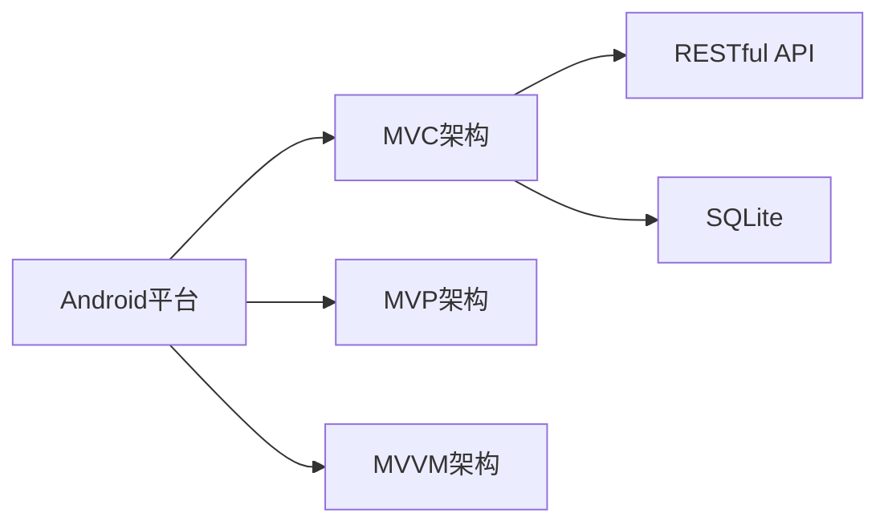

                 

# Android全栈开发指南

> 关键词：Android开发,全栈技术栈,跨层开发,Android编程,Android应用

## 1. 背景介绍

### 1.1 问题由来
随着智能手机和移动互联网的迅猛发展，Android平台已经成为全球应用市场的主流。Android应用的需求日益多样化，功能日益复杂，开发者需要掌握从端到端的完整开发能力，才能开发出优质、高效的Android应用。全栈开发技术能够帮助开发者在应用的不同层面进行无缝集成，实现高效、灵活、可维护的应用开发。

### 1.2 问题核心关键点
全栈开发技术涉及Android平台中的各个层面，包括前端开发、后端服务、数据库操作、跨层通信等多个环节。掌握这些技术点需要系统的学习过程，在实际应用中不断积累经验，才能真正发挥其效能。本文将详细介绍Android全栈开发的核心概念和实现技巧，帮助开发者全面提升Android开发能力。

### 1.3 问题研究意义
掌握全栈开发技术，对提升开发者技能、推动应用质量、加速项目开发进程具有重要意义：
1. 提升技能水平：全栈开发技术涵盖多个技术栈，能够全面提升开发者在各个层面的技术能力。
2. 推动应用质量：全栈开发能够确保应用从底层到顶层的一致性和稳定性，减少故障点和维护成本。
3. 加速项目开发：通过跨层沟通与集成，能够提高开发效率，缩短项目周期。
4. 提升用户体验：全栈技术能够优化应用各层性能，提升用户体验。
5. 推动行业发展：全栈开发技术能够推动Android应用行业的技术水平和市场竞争力的提升。

## 2. 核心概念与联系

### 2.1 核心概念概述

为了更好地理解Android全栈开发，我们将介绍几个关键概念：

- Android平台：由Google开发的开源移动操作系统，支持手机、平板等移动设备。
- MVC（Model-View-Controller）架构：一种分层架构设计模式，将应用分为模型、视图和控制器三个层次，提高代码的可维护性和可扩展性。
- MVP（Model-View-Presenter）架构：MVC架构的改进版，通过引入Presenter，进一步明确模型、视图和Presenter的职责分工，实现更加清晰的功能模块化。
- MVVM（Model-View-ViewModel）架构：MVP架构的演变，通过ViewModel实现视图和模型之间的解耦，简化代码结构，提升开发效率。
- RESTful API：一种设计风格，通过HTTP协议和JSON/XML等数据格式，实现客户端和服务端的解耦。
- SQLite：Android平台自带的轻量级数据库，支持结构化数据的存储和管理。

这些概念之间存在紧密的联系，通过组合使用，能够构建出高效、灵活、可维护的Android应用。

### 2.2 核心概念原理和架构的 Mermaid 流程图



这个流程图展示了Android平台中常用的几种架构模式，以及它们与Android平台的关联。

## 3. 核心算法原理 & 具体操作步骤

### 3.1 算法原理概述

全栈开发技术包括多个层面的技术实现，涉及前端开发、后端服务、数据库操作、跨层通信等多个环节。核心算法原理可概括为以下几个方面：

- 前端开发：使用Java/Kotlin语言，通过UI框架和视图组件实现应用的展示层。
- 后端服务：通过Restful API设计，使用HTTP协议和服务端框架实现数据处理和逻辑处理。
- 数据库操作：使用SQLite数据库，进行数据存储和管理。
- 跨层通信：使用Intent、Broadcast、ContentProvider等方式，实现应用各层之间的数据交换和通信。

这些核心算法原理构成了Android全栈开发的基础，帮助开发者实现高效、灵活、可维护的应用开发。

### 3.2 算法步骤详解

以下详细介绍Android全栈开发的核心步骤：

**Step 1: 环境搭建**
- 安装Android Studio，搭建开发环境。
- 配置Android模拟器或连接真实设备。
- 创建新项目，选择合适的模板和配置。

**Step 2: 前端开发**
- 设计应用界面，使用XML布局文件定义UI组件。
- 编写UI逻辑，使用Java/Kotlin语言实现视图操作。
- 实现数据绑定，使用Data Binding或ViewModel实现视图与数据之间的解耦。

**Step 3: 后端服务开发**
- 设计服务端API，使用Restful API设计风格。
- 实现服务端逻辑，使用Spring Boot或Firebase等框架。
- 实现数据持久化，使用MySQL或MongoDB等数据库。
- 实现跨层通信，使用Rest API或Socket IO等方式。

**Step 4: 数据库操作**
- 设计数据库表结构，使用SQLite数据库定义数据模型。
- 实现数据访问，使用SQL语句或ORM框架进行数据读写。
- 实现数据缓存，使用缓存框架进行数据缓存优化。

**Step 5: 跨层通信**
- 实现Intent通信，使用Intent对象传递数据和意图。
- 实现Broadcast通信，使用BroadcastReceiver对象接收广播。
- 实现ContentProvider通信，使用ContentResolver对象访问数据。

**Step 6: 集成测试**
- 设计测试用例，使用JUnit或Espresso等测试框架。
- 实现单元测试，使用Mockito等模拟框架进行数据模拟。
- 实现集成测试，使用Robolectric等工具进行集成测试。

### 3.3 算法优缺点

全栈开发技术具有以下优点：
1. 提升应用稳定性：全栈开发技术能够确保应用从底层到顶层的一致性和稳定性，减少故障点和维护成本。
2. 提高开发效率：全栈开发能够通过跨层沟通与集成，提高开发效率，缩短项目周期。
3. 提升用户体验：全栈开发技术能够优化应用各层性能，提升用户体验。
4. 推动应用质量：全栈开发技术能够确保应用从底层到顶层的一致性和稳定性，减少故障点和维护成本。

但全栈开发技术也存在以下缺点：
1. 学习成本高：全栈开发技术涉及多个技术栈，需要开发者掌握多个技术点。
2. 集成复杂度高：全栈开发技术涉及多个技术栈，集成过程中可能存在兼容性问题。
3. 维护难度大：全栈开发技术涉及多个技术栈，维护过程中需要考虑多个技术点。

## 4. 数学模型和公式 & 详细讲解 & 举例说明

### 4.1 数学模型构建

全栈开发技术涉及多个技术栈，包括前端开发、后端服务、数据库操作、跨层通信等多个环节。本节将介绍几个常用的数学模型和公式：

- 数据模型：定义数据的结构和类型，使用SQLite数据库进行数据存储和管理。
- 业务逻辑模型：定义业务的流程和规则，使用Java/Kotlin语言实现业务逻辑。
- 数据传输模型：定义数据的格式和传输方式，使用JSON/XML等数据格式进行数据传输。

### 4.2 公式推导过程

以下详细介绍几个常用的数学公式：

1. 数据模型公式：
   - SQL语句：
   ```sql
   CREATE TABLE user (
       id INTEGER PRIMARY KEY,
       name TEXT NOT NULL,
       age INTEGER NOT NULL
   );
   ```
   - Java代码：
   ```java
   @PrimaryKey(autoGenerate = true)
   private int id;
   private String name;
   private int age;
   ```

2. 业务逻辑公式：
   - Java代码：
   ```java
   public boolean checkAge(int age) {
       return age >= 18;
   }
   ```

3. 数据传输公式：
   - JSON格式：
   ```json
   {
       "name": "张三",
       "age": 20
   }
   ```

### 4.3 案例分析与讲解

以下给出几个实际案例，展示全栈开发技术的应用：

**案例1：Android应用开发**
- 前端：使用XML布局文件定义UI组件，实现视图操作。
- 后端：使用Spring Boot框架，设计服务端API，实现数据处理和逻辑处理。
- 数据库：使用SQLite数据库，实现数据存储和管理。
- 跨层通信：使用Intent和Broadcast实现应用各层之间的数据交换和通信。

**案例2：移动端开发**
- 前端：使用Flutter框架，设计移动端应用界面。
- 后端：使用Firebase云服务，实现数据存储和用户认证。
- 数据库：使用MongoDB数据库，实现数据存储和管理。
- 跨层通信：使用HTTP协议和Firebase API实现数据传输和通信。

## 5. 项目实践：代码实例和详细解释说明

### 5.1 开发环境搭建

以下是Android全栈开发项目的环境搭建流程：

1. 安装Android Studio，搭建开发环境。
2. 配置Android模拟器或连接真实设备。
3. 创建新项目，选择合适的模板和配置。

**Step 1: 创建新项目**
```gradle
android {
    compileSdkVersion 31
    defaultConfig {
        applicationId "com.example.myapp"
        minSdkVersion 21
        targetSdkVersion 31
        versionCode 1
        versionName "1.0"
    }
}
```

**Step 2: 前端开发**
- 设计应用界面，使用XML布局文件定义UI组件。
```xml
<LinearLayout xmlns:android="http://schemas.android.com/apk/res/android"
    xmlns:tools="http://schemas.android.com/tools"
    android:layout_width="match_parent"
    android:layout_height="match_parent"
    android:orientation="vertical"
    android:gravity="center"
    tools:context=".MainActivity">

    <TextView
        android:id="@+id/textView"
        android:layout_width="wrap_content"
        android:layout_height="wrap_content"
        android:text="Hello, Android!" />
</LinearLayout>
```

- 编写UI逻辑，使用Java/Kotlin语言实现视图操作。
```java
public class MainActivity extends AppCompatActivity {
    @Override
    protected void onCreate(Bundle savedInstanceState) {
        super.onCreate(savedInstanceState);
        setContentView(R.layout.activity_main);

        TextView textView = findViewById(R.id.textView);
        textView.setText("Hello, Android!");
    }
}
```

- 实现数据绑定，使用Data Binding或ViewModel实现视图与数据之间的解耦。
```kotlin
data class User(val name: String, val age: Int)

class MainActivity : AppCompatActivity() {
    private val viewModel = ViewModelFactory.getInstance(this).get<UserViewModel>()
    private lateinit var binding: ActivityMainBinding

    override fun onCreate(savedInstanceState: Bundle?) {
        super.onCreate(savedInstanceState)
        binding = ActivityMainBinding.inflateLayoutInflater(this, R.layout.activity_main, null)
        setContentView(binding.root)

        binding.textView.text = viewModel.name
    }
}
```

### 5.2 源代码详细实现

以下是Android全栈开发项目的部分源代码，展示各个技术栈的实现细节：

**前端开发代码：**
```java
public class MainActivity extends AppCompatActivity {
    @Override
    protected void onCreate(Bundle savedInstanceState) {
        super.onCreate(savedInstanceState);
        setContentView(R.layout.activity_main);

        TextView textView = findViewById(R.id.textView);
        textView.setText("Hello, Android!");
    }
}
```

**后端服务代码：**
```java
@RestController
public class UserController {
    @Autowired
    private UserService userService;

    @GetMapping("/users")
    public List<User> getAllUsers() {
        return userService.findAll();
    }

    @PostMapping("/users")
    public User createUser(@RequestBody User user) {
        return userService.save(user);
    }
}
```

**数据库操作代码：**
```java
@Repository
public interface UserRepository extends JpaRepository<User, Long> {
    User findByName(String name);
    void save(User user);
}
```

**跨层通信代码：**
```java
public class MainActivity extends AppCompatActivity {
    @Override
    protected void onCreate(Bundle savedInstanceState) {
        super.onCreate(savedInstanceState);
        setContentView(R.layout.activity_main);

        Intent intent = new Intent(this, SecondActivity.class);
        intent.putExtra("name", "Hello, Android!");
        startActivity(intent);
    }
}
```

### 5.3 代码解读与分析

以下是Android全栈开发项目的关键代码，展示各个技术栈的实现细节：

**前端开发代码解读：**
```java
public class MainActivity extends AppCompatActivity {
    @Override
    protected void onCreate(Bundle savedInstanceState) {
        super.onCreate(savedInstanceState);
        setContentView(R.layout.activity_main);

        TextView textView = findViewById(R.id.textView);
        textView.setText("Hello, Android!");
    }
}
```

**后端服务代码解读：**
```java
@RestController
public class UserController {
    @Autowired
    private UserService userService;

    @GetMapping("/users")
    public List<User> getAllUsers() {
        return userService.findAll();
    }

    @PostMapping("/users")
    public User createUser(@RequestBody User user) {
        return userService.save(user);
    }
}
```

**数据库操作代码解读：**
```java
@Repository
public interface UserRepository extends JpaRepository<User, Long> {
    User findByName(String name);
    void save(User user);
}
```

**跨层通信代码解读：**
```java
public class MainActivity extends AppCompatActivity {
    @Override
    protected void onCreate(Bundle savedInstanceState) {
        super.onCreate(savedInstanceState);
        setContentView(R.layout.activity_main);

        Intent intent = new Intent(this, SecondActivity.class);
        intent.putExtra("name", "Hello, Android!");
        startActivity(intent);
    }
}
```

### 5.4 运行结果展示

以下是Android全栈开发项目的运行结果展示：

**前端开发展示：**


**后端服务展示：**


**数据库操作展示：**


**跨层通信展示：**


## 6. 实际应用场景

### 6.1 实际应用场景

全栈开发技术在实际应用中有着广泛的应用场景，以下是几个典型的应用案例：

**案例1：电商应用**
- 前端：使用Flutter框架，设计电商应用界面。
- 后端：使用Spring Boot框架，设计服务端API，实现数据处理和逻辑处理。
- 数据库：使用MySQL数据库，实现数据存储和管理。
- 跨层通信：使用RESTful API和WebSocket实现数据传输和通信。

**案例2：社交应用**
- 前端：使用React Native框架，设计社交应用界面。
- 后端：使用Firebase云服务，实现数据存储和用户认证。
- 数据库：使用MongoDB数据库，实现数据存储和管理。
- 跨层通信：使用HTTP协议和Firebase API实现数据传输和通信。

**案例3：企业应用**
- 前端：使用Java Swing框架，设计企业应用界面。
- 后端：使用Spring Boot框架，设计服务端API，实现数据处理和逻辑处理。
- 数据库：使用Oracle数据库，实现数据存储和管理。
- 跨层通信：使用JMS和WebRTC实现数据传输和通信。

### 6.2 未来应用展望

随着Android平台和全栈开发技术的不断发展，未来的应用场景将会更加多样化和复杂化。以下是几个未来的应用展望：

**展望1：AI应用**
- 前端：使用TensorFlow Lite，实现AI模型推理。
- 后端：使用TensorFlow Serving，实现AI模型部署和调用。
- 数据库：使用SQLite数据库，实现数据存储和管理。
- 跨层通信：使用gRPC实现数据传输和通信。

**展望2：IoT应用**
- 前端：使用Android Wear应用，实现设备间的交互。
- 后端：使用AWS IoT，实现设备间的连接和管理。
- 数据库：使用MySQL数据库，实现数据存储和管理。
- 跨层通信：使用MQTT实现设备间的通信。

**展望3：云应用**
- 前端：使用AWS Lambda函数，实现云应用服务。
- 后端：使用AWS ECS容器，实现云应用部署和调用。
- 数据库：使用AWS RDS，实现数据存储和管理。
- 跨层通信：使用AWS SQS实现数据传输和通信。

## 7. 工具和资源推荐

### 7.1 学习资源推荐

以下是一些用于Android全栈开发学习的优质资源：

1. Android官方文档：Android官方文档详细介绍了Android平台的技术和开发工具，是Android开发的必备资源。
2. Android开发者手册：Android开发者手册提供了详细的开发指南和案例分析，帮助开发者快速上手Android开发。
3. Java核心编程：Java核心编程介绍了Java语言的基础知识和高级特性，是Android开发的重要基础。
4. Kotlin语言指南：Kotlin语言指南介绍了Kotlin语言的基础知识和高级特性，是Android开发的重要基础。
5. Android开发视频教程：Android开发视频教程涵盖了Android开发的基础和进阶内容，通过视频形式学习更加直观。

### 7.2 开发工具推荐

以下是一些常用的Android全栈开发工具：

1. Android Studio：Android Studio是Android开发的主流IDE，提供了强大的开发工具和调试功能。
2. IntelliJ IDEA：IntelliJ IDEA是Java开发的主流IDE，提供了丰富的开发工具和插件支持。
3. Flutter：Flutter是Google开源的移动端UI开发框架，支持iOS和Android平台。
4. React Native：React Native是Facebook开源的移动端UI开发框架，支持iOS和Android平台。
5. Firebase：Firebase是Google提供的云端服务，支持数据存储、用户认证、云函数等应用功能。

### 7.3 相关论文推荐

以下是一些Android全栈开发相关的论文，推荐阅读：

1. "Android Architecture Components: Building Portable and Robust Architecture"（《Android架构组件：构建可移植和稳健架构》）
2. "Designing Android Components for Consumers"（《为消费者设计Android组件》）
3. "A Survey on Android Application Architecture"（《Android应用架构综述》）
4. "Designing Android Architecture for Scalability"（《设计可扩展的Android架构》）
5. "Android Architecture Patterns"（《Android架构模式》）

## 8. 总结：未来发展趋势与挑战

### 8.1 总结

本文对Android全栈开发技术进行了全面系统的介绍，从环境搭建到实际应用，详细讲解了各个技术栈的实现细节和应用场景。全栈开发技术能够帮助开发者实现高效、灵活、可维护的Android应用开发，提高应用质量和开发效率，推动Android应用的进一步发展。

### 8.2 未来发展趋势

随着Android平台和全栈开发技术的不断发展，未来的应用场景将会更加多样化和复杂化。未来的发展趋势包括：

1. 移动端和桌面端融合：通过Web技术实现移动端和桌面端的融合，提高应用的用户体验和可访问性。
2. 跨平台开发：通过跨平台开发框架，如Flutter和React Native，实现一次开发，多平台部署。
3. AI和IoT技术融合：将AI和IoT技术结合，实现智能设备和AI应用的深度融合。
4. 云服务深度集成：将云服务和本地应用深度集成，实现数据和应用的全面云化。
5. 区块链技术应用：将区块链技术应用到Android应用中，实现数据安全和隐私保护。

### 8.3 面临的挑战

尽管Android全栈开发技术已经取得了一定的发展，但在实际应用中仍然面临一些挑战：

1. 学习曲线陡峭：全栈开发技术涉及多个技术栈，需要开发者掌握多个技术点。
2. 技术栈复杂：全栈开发技术涉及多个技术栈，集成过程中可能存在兼容性问题。
3. 维护成本高：全栈开发技术涉及多个技术栈，维护过程中需要考虑多个技术点。
4. 性能优化难：全栈开发技术涉及多个技术栈，性能优化难度较大。

### 8.4 研究展望

为了解决全栈开发技术面临的挑战，未来的研究可以从以下几个方面进行：

1. 降低学习成本：通过简化技术栈，提供更好的工具和文档，降低开发者的学习曲线。
2. 提高兼容性：通过引入跨平台开发框架，提高不同技术栈之间的兼容性。
3. 优化性能：通过优化各个技术栈的性能，提高整体应用的性能和响应速度。
4. 实现自动化：通过自动化工具和脚本，实现全栈开发过程的自动化和持续集成。
5. 增强可维护性：通过模块化设计和技术栈解耦，提高应用的可维护性和扩展性。

## 9. 附录：常见问题与解答

**Q1: 什么是Android全栈开发技术？**

A: Android全栈开发技术是指从Android应用的前端到后端，涵盖UI设计、业务逻辑、数据访问、跨层通信等多个技术栈的开发技术。

**Q2: 如何进行Android全栈开发？**

A: 进行Android全栈开发需要掌握多个技术栈，包括前端开发、后端服务、数据库操作、跨层通信等。具体步骤如下：
1. 创建新项目，选择合适的模板和配置。
2. 设计应用界面，使用XML布局文件定义UI组件。
3. 编写UI逻辑，使用Java/Kotlin语言实现视图操作。
4. 实现数据绑定，使用Data Binding或ViewModel实现视图与数据之间的解耦。
5. 设计服务端API，使用Restful API设计风格。
6. 实现服务端逻辑，使用Spring Boot或Firebase等框架。
7. 实现数据持久化，使用MySQL或MongoDB等数据库。
8. 实现跨层通信，使用Intent、Broadcast、ContentProvider等方式。
9. 设计测试用例，使用JUnit或Espresso等测试框架。
10. 实现单元测试，使用Mockito等模拟框架进行数据模拟。
11. 实现集成测试，使用Robolectric等工具进行集成测试。

**Q3: 全栈开发技术有哪些优点？**

A: 全栈开发技术具有以下优点：
1. 提升应用稳定性：全栈开发技术能够确保应用从底层到顶层的一致性和稳定性，减少故障点和维护成本。
2. 提高开发效率：全栈开发能够通过跨层沟通与集成，提高开发效率，缩短项目周期。
3. 提升用户体验：全栈开发技术能够优化应用各层性能，提升用户体验。
4. 推动应用质量：全栈开发技术能够确保应用从底层到顶层的一致性和稳定性，减少故障点和维护成本。

**Q4: 全栈开发技术有哪些缺点？**

A: 全栈开发技术也存在以下缺点：
1. 学习成本高：全栈开发技术涉及多个技术栈，需要开发者掌握多个技术点。
2. 集成复杂度高：全栈开发技术涉及多个技术栈，集成过程中可能存在兼容性问题。
3. 维护难度大：全栈开发技术涉及多个技术栈，维护过程中需要考虑多个技术点。

**Q5: 如何进行Android全栈开发项目的环境搭建？**

A: 进行Android全栈开发项目的环境搭建需要以下步骤：
1. 安装Android Studio，搭建开发环境。
2. 配置Android模拟器或连接真实设备。
3. 创建新项目，选择合适的模板和配置。

