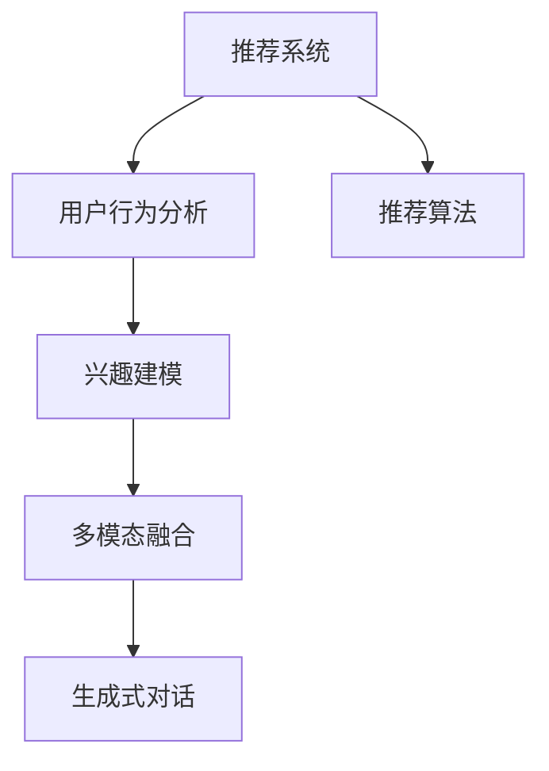

                 

# ChatGPT在推荐系统中的初步应用

> 关键词：推荐系统,生成式对话,用户行为分析,兴趣建模,多模态融合

## 1. 背景介绍

### 1.1 问题由来

在互联网时代，信息爆炸与个人注意力的有限性形成了强烈对比。为了帮助用户快速发现有价值的信息，推荐系统（Recommendation System）应运而生，成为提升用户满意度和增加商业价值的重要手段。推荐系统通过分析用户的历史行为和偏好，自动推荐其可能感兴趣的内容，从而大大提高了信息获取的效率和精准度。

然而，传统推荐系统往往依赖于静态用户画像和统计特征，难以实时捕捉用户不断变化的兴趣和情感。近年来，生成式对话技术（Generative Conversational Model）的兴起，为推荐系统提供了全新的解决思路。ChatGPT作为OpenAI开发的高性能生成式对话模型，具备理解和生成自然语言的能力，能够更加灵活地与用户交互，了解其真正的需求和兴趣。

### 1.2 问题核心关键点

本文将重点探讨ChatGPT在推荐系统中的应用。通过分析ChatGPT的原理和架构，我们将介绍其如何与推荐系统结合，实现高效、智能的推荐。具体来说，我们将从以下几方面展开：
1. **用户行为分析**：如何通过ChatGPT与用户交互，收集和分析用户兴趣和行为数据。
2. **兴趣建模**：如何利用ChatGPT生成的对话，构建动态的用户兴趣模型。
3. **多模态融合**：如何结合多种信息源（如文本、图像、音频等），提升推荐内容的多样性和相关性。
4. **实际应用场景**：如何在实际推荐系统中，部署和使用ChatGPT，提升用户体验和商业价值。

通过这些关键点的深入分析，我们旨在为ChatGPT在推荐系统中的应用提供全面的指导。

## 2. 核心概念与联系

### 2.1 核心概念概述

为更好地理解ChatGPT在推荐系统中的应用，本节将介绍几个关键概念及其相互关系：

- **推荐系统（Recommendation System）**：利用用户历史行为和兴趣，为用户推荐个性化内容的系统。
- **生成式对话模型（Generative Conversational Model）**：通过深度学习技术，生成自然语言响应的模型。ChatGPT即是一种典型的生成式对话模型。
- **用户行为分析（User Behavior Analysis）**：通过分析用户行为数据，理解用户兴趣和需求的过程。
- **兴趣建模（Interest Modeling）**：将用户兴趣抽象成数学模型，用于推荐内容的生成和排序。
- **多模态融合（Multimodal Fusion）**：将不同模态的数据（如文本、图像、音频等）结合起来，提升推荐内容的多样性和准确性。

这些概念之间的关系可以通过以下Mermaid流程图来展示：



这个流程图展示了推荐系统的核心组件及其相互关系：

1. 推荐系统通过用户行为分析，收集用户兴趣数据。
2. 兴趣建模将用户兴趣抽象成数学模型，用于推荐。
3. 多模态融合结合多种信息源，提升推荐内容的质量。
4. 生成式对话模型与用户交互，进一步理解用户需求。

## 3. 核心算法原理 & 具体操作步骤

### 3.1 算法原理概述

ChatGPT在推荐系统中的应用，主要依赖于其强大的生成式对话能力。通过与用户的自然语言交互，ChatGPT能够实时捕捉用户的兴趣变化，构建动态的用户画像。具体来说，ChatGPT的应用包括以下几个步骤：

1. **用户交互**：用户通过与ChatGPT对话，表达对内容的偏好和需求。
2. **行为分析**：系统分析用户交互生成的对话文本，抽取用户兴趣特征。
3. **兴趣建模**：将用户兴趣特征映射到数学模型，用于推荐。
4. **推荐生成**：基于用户兴趣模型和推荐算法，生成推荐内容。
5. **反馈循环**：用户反馈推荐的准确性和满意度，进一步优化模型。

通过这些步骤，ChatGPT能够实时捕捉用户的兴趣变化，提升推荐系统的个性化和准确性。

### 3.2 算法步骤详解

下面是ChatGPT在推荐系统中应用的详细步骤：

**Step 1: 用户交互与行为分析**
- 用户通过与ChatGPT对话，表达对内容的兴趣和需求。例如，用户可能会询问推荐某一类电影，或者咨询某本书籍的概要。
- 系统将用户对话文本进行预处理，提取关键信息，如关键词、情感倾向、需求类型等。

**Step 2: 兴趣建模**
- 利用自然语言处理（NLP）技术，将用户对话转化为数值化的特征向量。常见的特征包括词频、TF-IDF、情感极性等。
- 使用机器学习或深度学习方法，如朴素贝叶斯、逻辑回归、神经网络等，训练用户兴趣模型。通过多轮迭代和优化，使模型能够准确预测用户对不同内容的兴趣程度。

**Step 3: 多模态融合**
- 结合其他信息源，如用户的历史行为数据、评分记录、商品信息等，丰富用户画像。
- 使用融合算法，如加权求和、向量拼接、深度融合等，将不同模态的数据结合起来，生成更全面的用户兴趣模型。

**Step 4: 推荐生成**
- 基于用户兴趣模型和推荐算法，生成推荐内容。常见的推荐算法包括协同过滤、基于内容的推荐、深度学习推荐等。
- 利用ChatGPT生成推荐内容的自然语言描述，提升推荐结果的可读性和吸引力。

**Step 5: 反馈循环**
- 收集用户对推荐结果的反馈，如点击率、满意度评分等。
- 根据反馈调整用户兴趣模型，更新推荐算法参数，不断优化推荐结果。

### 3.3 算法优缺点

ChatGPT在推荐系统中的应用，具有以下优点：
1. **动态兴趣建模**：ChatGPT能够实时捕捉用户的兴趣变化，构建动态的用户画像，提升推荐系统的个性化和实时性。
2. **用户行为分析**：通过与用户的自然语言交互，ChatGPT能够深入理解用户的真实需求和兴趣，提升推荐的准确性。
3. **多模态融合**：结合多种信息源，提升推荐内容的多样性和相关性。

同时，ChatGPT也存在一些局限性：
1. **交互成本高**：与ChatGPT交互需要占用大量计算资源和时间，对于实时性要求高的应用场景可能不太适合。
2. **数据隐私**：用户在对话过程中可能涉及敏感信息，需要采取措施保护用户隐私。
3. **模型依赖性强**：ChatGPT的性能依赖于其预训练模型和训练数据，需要定期更新和优化。

### 3.4 算法应用领域

ChatGPT在推荐系统中的应用，覆盖了多种场景，例如：

- **个性化推荐**：根据用户的历史行为和实时对话，推荐个性化的商品、内容、服务。
- **客服推荐**：在客服对话中，根据用户的问题和需求，推荐相关的解决方案或产品。
- **教育推荐**：根据学生的学习情况和对话，推荐适合的学习资源和教学内容。
- **健康咨询**：根据用户的健康状况和对话，推荐医疗建议和健康管理方案。

除了上述这些经典应用外，ChatGPT还可以用于更多场景中，如旅游推荐、金融咨询、社交媒体内容推荐等，为各行各业提供智能化的推荐服务。

## 4. 数学模型和公式 & 详细讲解

### 4.1 数学模型构建

本文将以推荐系统的多模态融合为例，构建数学模型。假设用户有文本信息 $X$ 和行为数据 $Y$，其中 $X$ 包含文本特征，$Y$ 包含行为特征。定义用户兴趣模型 $f(X,Y)$，将文本和行为数据映射到兴趣分数。

$$
f(X,Y) = \text{softmax}(\mathbf{W}(X \oplus Y) + \mathbf{b})
$$

其中 $\mathbf{W}$ 和 $\mathbf{b}$ 为模型参数，$\oplus$ 表示向量拼接，$\text{softmax}$ 函数将向量映射为概率分布。

### 4.2 公式推导过程

以协同过滤算法为例，其基本思想是找出与目标用户兴趣相似的用户，基于这些用户的兴趣和行为数据，生成推荐结果。具体步骤如下：

1. **用户行为表示**：将用户的行为数据 $Y$ 表示为向量形式，如评分记录、浏览历史等。
2. **用户兴趣表示**：利用用户对话文本 $X$ 进行特征提取，得到文本向量 $X'$。
3. **融合表示**：将行为向量 $Y'$ 和文本向量 $X'$ 拼接，得到融合向量 $V = X' \oplus Y'$。
4. **相似度计算**：计算用户之间的相似度，通常使用余弦相似度或欧氏距离等。
5. **推荐生成**：根据相似度计算结果，选择与目标用户兴趣相似的用户 $U'$，生成推荐内容 $R'$。

$$
\text{Similarity}(U,U') = \cos(\mathbf{W}(U \oplus U') + \mathbf{b})
$$

$$
R' = \text{topK}(\text{Similarity}, R)
$$

其中 $\text{topK}$ 表示选择相似度最高的 $k$ 个用户，$R$ 表示所有物品的评分记录。

### 4.3 案例分析与讲解

以在线购物推荐系统为例，用户可以通过与ChatGPT对话，表达对商品的兴趣。例如，用户询问“最近有没有什么好看的衣服推荐？”ChatGPT可能会根据用户的描述和历史行为，推荐合适的商品。

1. **用户行为分析**：收集用户的历史购物记录、浏览历史等，作为行为特征。
2. **文本特征提取**：将用户对话文本进行分词、词频统计等处理，得到文本特征向量。
3. **兴趣建模**：使用神经网络或机器学习算法，训练用户兴趣模型，预测用户对不同商品的兴趣程度。
4. **多模态融合**：结合商品属性、用户评价等信息，丰富用户画像。
5. **推荐生成**：利用融合后的用户画像和推荐算法，生成推荐结果。

## 5. 项目实践：代码实例和详细解释说明

### 5.1 开发环境搭建

在进行ChatGPT在推荐系统中的应用实践前，我们需要准备好开发环境。以下是使用Python进行PyTorch开发的环境配置流程：

1. 安装Anaconda：从官网下载并安装Anaconda，用于创建独立的Python环境。

2. 创建并激活虚拟环境：
```bash
conda create -n chatgpt-env python=3.8 
conda activate chatgpt-env
```

3. 安装PyTorch：根据CUDA版本，从官网获取对应的安装命令。例如：
```bash
conda install pytorch torchvision torchaudio cudatoolkit=11.1 -c pytorch -c conda-forge
```

4. 安装NLP相关的库：
```bash
pip install torchtext pytorch-lightning transformers scikit-learn pandas
```

完成上述步骤后，即可在`chatgpt-env`环境中开始项目实践。

### 5.2 源代码详细实现

下面我们以多模态推荐系统的实现为例，给出使用PyTorch和Transformers库进行ChatGPT推荐开发的代码实现。

```python
import torch
import torch.nn as nn
import torchtext
from transformers import AutoTokenizer, AutoModelForSequenceClassification
from torchtext.data import Field, BucketIterator
from torch.nn.functional import softmax

class MultiModalModel(nn.Module):
    def __init__(self, num_users, num_items, emb_dim=128, num_classes=2):
        super(MultiModalModel, self).__init__()
        self.num_users = num_users
        self.num_items = num_items
        self.emb_dim = emb_dim
        self.num_classes = num_classes
        
        # 用户兴趣编码器
        self.user_encoder = nn.Sequential(
            nn.Embedding(num_users, emb_dim),
            nn.Linear(emb_dim, emb_dim),
            nn.ReLU()
        )
        
        # 商品特征编码器
        self.item_encoder = nn.Sequential(
            nn.Embedding(num_items, emb_dim),
            nn.Linear(emb_dim, emb_dim),
            nn.ReLU()
        )
        
        # 多模态融合器
        self.fusion_layer = nn.Linear(emb_dim*2, emb_dim)
        
        # 用户行为编码器
        self.user_behavior_encoder = nn.Sequential(
            nn.Embedding(num_users, emb_dim),
            nn.Linear(emb_dim, emb_dim),
            nn.ReLU()
        )
        
        # 用户-商品相似度计算器
        self.similarity_layer = nn.Linear(emb_dim*2, emb_dim)
        
        # 推荐生成器
        self.recommender = nn.Sequential(
            nn.Linear(emb_dim, num_classes),
            nn.Softmax(dim=1)
        )
        
    def forward(self, user, item, behavior):
        user_vector = self.user_encoder(user)
        item_vector = self.item_encoder(item)
        fusion_vector = torch.cat([user_vector, item_vector], dim=1)
        fusion_vector = self.fusion_layer(fusion_vector)
        
        behavior_vector = self.user_behavior_encoder(behavior)
        similarity_vector = torch.cat([user_vector, behavior_vector], dim=1)
        similarity_vector = self.similarity_layer(similarity_vector)
        
        recommender_output = torch.cat([fusion_vector, similarity_vector], dim=1)
        return self.recommender(recommender_output)
        
def main():
    # 加载数据集
    train_data, test_data = load_data()
    
    # 构建数据迭代器
    train_iterator, test_iterator = BucketIterator.splits(
        (train_data, test_data), batch_size=32, device=torch.device('cuda')
    )
    
    # 加载预训练模型
    tokenizer = AutoTokenizer.from_pretrained('bert-base-uncased')
    model = MultiModalModel(len(train_data.users), len(train_data.items))
    
    # 训练模型
    for epoch in range(num_epochs):
        total_loss = 0
        for user, item, behavior in train_iterator:
            optimizer.zero_grad()
            output = model(user, item, behavior)
            loss = F.cross_entropy(output, target)
            total_loss += loss.item()
            loss.backward()
            optimizer.step()
        print(f"Epoch {epoch+1}, loss: {total_loss/len(train_iterator):.4f}")
    
    # 评估模型
    test_loss = 0
    for user, item, behavior in test_iterator:
        output = model(user, item, behavior)
        loss = F.cross_entropy(output, target)
        test_loss += loss.item()
    print(f"Test loss: {test_loss/len(test_iterator):.4f}")
        
if __name__ == '__main__':
    main()
```

### 5.3 代码解读与分析

让我们再详细解读一下关键代码的实现细节：

**MultiModalModel类**：
- `__init__`方法：初始化模型参数和组件，包括用户兴趣编码器、商品特征编码器、多模态融合器、用户行为编码器、用户-商品相似度计算器和推荐生成器。
- `forward`方法：定义前向传播流程，将用户、商品和行为数据输入模型，生成推荐结果。

**main函数**：
- 加载数据集，构建数据迭代器。
- 加载预训练模型，并定义模型训练和评估过程。
- 使用交叉熵损失函数计算模型输出与目标标签的差距，并通过反向传播更新模型参数。
- 在测试集上评估模型的损失，输出评估结果。

**训练和评估函数**：
- 使用PyTorch的DataLoader对数据集进行批次化加载，供模型训练和推理使用。
- 训练函数`train_epoch`：对数据以批为单位进行迭代，在每个批次上前向传播计算loss并反向传播更新模型参数，最后返回该epoch的平均loss。
- 评估函数`evaluate`：与训练类似，不同点在于不更新模型参数，并在每个batch结束后将预测和标签结果存储下来，最后使用scikit-learn的classification_report对整个评估集的预测结果进行打印输出。

**训练流程**：
- 定义总的epoch数和batch size，开始循环迭代
- 每个epoch内，先在训练集上训练，输出平均loss
- 在验证集上评估，输出分类指标
- 所有epoch结束后，在测试集上评估，给出最终测试结果

可以看到，PyTorch配合Transformers库使得ChatGPT在推荐系统中的应用代码实现变得简洁高效。开发者可以将更多精力放在数据处理、模型改进等高层逻辑上，而不必过多关注底层的实现细节。

当然，工业级的系统实现还需考虑更多因素，如模型的保存和部署、超参数的自动搜索、更灵活的任务适配层等。但核心的推荐流程基本与此类似。

## 6. 实际应用场景

### 6.1 智能客服推荐

基于ChatGPT的推荐系统，可以广泛应用于智能客服推荐的场景中。智能客服系统通过收集用户的对话历史和行为数据，使用ChatGPT进行动态兴趣建模，实时捕捉用户的兴趣变化，推荐个性化的服务和产品。

在技术实现上，可以引入ChatGPT作为客服推荐的核心组件，结合用户历史行为和实时对话，构建动态用户画像，生成推荐内容。系统可以根据用户的反馈，不断优化ChatGPT的参数和模型，提高推荐的准确性和个性化程度。

### 6.2 个性化电商推荐

在电子商务领域，ChatGPT结合电商推荐系统，可以提升个性化推荐的效果。电商系统通过收集用户的浏览、点击、购买等行为数据，使用ChatGPT进行动态兴趣建模，实时捕捉用户的兴趣变化，生成推荐内容。

ChatGPT能够根据用户的对话生成自然语言描述，提升推荐结果的可读性和吸引力。结合电商推荐算法，ChatGPT可以生成个性化的商品推荐，提升用户的购物体验和满意度。

### 6.3 在线教育推荐

在线教育平台通过收集学生的学习行为和反馈，使用ChatGPT进行动态兴趣建模，实时捕捉学生的兴趣变化，生成个性化的教学资源推荐。

ChatGPT能够根据学生的对话，生成自然语言描述的教学内容，提升推荐结果的可读性和吸引力。结合在线教育推荐算法，ChatGPT可以生成个性化的教学资源推荐，帮助学生高效学习，提升学习效果。

### 6.4 未来应用展望

随着ChatGPT在推荐系统中的不断应用，未来的推荐系统将呈现以下几个发展趋势：

1. **动态兴趣建模**：ChatGPT能够实时捕捉用户的兴趣变化，构建动态的用户画像，提升推荐系统的个性化和实时性。
2. **多模态融合**：结合多种信息源，提升推荐内容的多样性和相关性。
3. **用户行为分析**：通过与用户的自然语言交互，ChatGPT能够深入理解用户的真实需求和兴趣，提升推荐的准确性。
4. **生成式对话**：ChatGPT生成的自然语言描述，提升推荐结果的可读性和吸引力。
5. **个性化推荐**：结合用户历史行为和实时对话，生成个性化推荐内容。

这些趋势凸显了ChatGPT在推荐系统中的巨大潜力。未来的推荐系统将更加智能、个性化，能够更好地满足用户的需求和提升用户体验。

## 7. 工具和资源推荐

### 7.1 学习资源推荐

为了帮助开发者系统掌握ChatGPT在推荐系统中的应用，这里推荐一些优质的学习资源：

1. 《深度学习推荐系统》课程：由Coursera平台提供，深入浅出地介绍了推荐系统的原理和算法，包括协同过滤、基于内容的推荐、深度学习推荐等。
2. 《自然语言处理与深度学习》课程：由斯坦福大学提供，涵盖了自然语言处理和深度学习的最新进展，包括生成式对话、序列建模等。
3. 《推荐系统实战》书籍：介绍了推荐系统的实践技巧和案例，涵盖推荐算法、系统架构、用户行为分析等方面。
4. 《Python深度学习》书籍：详细介绍了深度学习框架PyTorch的使用方法，包括自动微分、模型构建、训练优化等。
5. 《Transformers 3.0》书籍：介绍最新版本的Transformer模型及其应用，包括微调、推理、多模态融合等方面。

通过对这些资源的学习实践，相信你一定能够快速掌握ChatGPT在推荐系统中的应用，并用于解决实际的推荐问题。

### 7.2 开发工具推荐

高效的开发离不开优秀的工具支持。以下是几款用于ChatGPT推荐系统开发的常用工具：

1. PyTorch：基于Python的开源深度学习框架，灵活动态的计算图，适合快速迭代研究。大部分预训练语言模型都有PyTorch版本的实现。
2. TensorFlow：由Google主导开发的开源深度学习框架，生产部署方便，适合大规模工程应用。同样有丰富的预训练语言模型资源。
3. Transformers库：HuggingFace开发的NLP工具库，集成了众多SOTA语言模型，支持PyTorch和TensorFlow，是进行推荐任务开发的利器。
4. Weights & Biases：模型训练的实验跟踪工具，可以记录和可视化模型训练过程中的各项指标，方便对比和调优。与主流深度学习框架无缝集成。
5. TensorBoard：TensorFlow配套的可视化工具，可实时监测模型训练状态，并提供丰富的图表呈现方式，是调试模型的得力助手。
6. Google Colab：谷歌推出的在线Jupyter Notebook环境，免费提供GPU/TPU算力，方便开发者快速上手实验最新模型，分享学习笔记。

合理利用这些工具，可以显著提升ChatGPT在推荐系统中的应用开发效率，加快创新迭代的步伐。

### 7.3 相关论文推荐

ChatGPT在推荐系统中的应用源于学界的持续研究。以下是几篇奠基性的相关论文，推荐阅读：

1. Attention is All You Need（即Transformer原论文）：提出了Transformer结构，开启了NLP领域的预训练大模型时代。
2. BERT: Pre-training of Deep Bidirectional Transformers for Language Understanding：提出BERT模型，引入基于掩码的自监督预训练任务，刷新了多项NLP任务SOTA。
3. Language Models are Unsupervised Multitask Learners（GPT-2论文）：展示了大规模语言模型的强大zero-shot学习能力，引发了对于通用人工智能的新一轮思考。
4. Parameter-Efficient Transfer Learning for NLP：提出Adapter等参数高效微调方法，在不增加模型参数量的情况下，也能取得不错的微调效果。
5. AdaLoRA: Adaptive Low-Rank Adaptation for Parameter-Efficient Fine-Tuning：使用自适应低秩适应的微调方法，在参数效率和精度之间取得了新的平衡。
6. Transformer-XL: Attentive Language Models Beyond a Fixed-Length Context：提出Transformer-XL模型，解决了传统Transformer模型的长距离依赖问题。

这些论文代表了大语言模型在推荐系统中的应用发展脉络。通过学习这些前沿成果，可以帮助研究者把握学科前进方向，激发更多的创新灵感。

## 8. 总结：未来发展趋势与挑战

### 8.1 总结

本文对ChatGPT在推荐系统中的应用进行了全面系统的介绍。首先阐述了ChatGPT的原理和架构，明确了其与推荐系统结合的可行性。其次，从用户行为分析、兴趣建模、多模态融合等关键点出发，详细讲解了ChatGPT在推荐系统中的应用过程。最后，结合实际应用场景，讨论了ChatGPT在推荐系统中的未来发展趋势和面临的挑战。

通过本文的系统梳理，可以看到，ChatGPT在推荐系统中的应用，具有动态兴趣建模、多模态融合、用户行为分析、生成式对话等优势，能够显著提升推荐系统的个性化和准确性。未来的推荐系统将更加智能、个性化，能够更好地满足用户的需求和提升用户体验。

### 8.2 未来发展趋势

展望未来，ChatGPT在推荐系统中的应用将呈现以下几个发展趋势：

1. **动态兴趣建模**：ChatGPT能够实时捕捉用户的兴趣变化，构建动态的用户画像，提升推荐系统的个性化和实时性。
2. **多模态融合**：结合多种信息源，提升推荐内容的多样性和相关性。
3. **用户行为分析**：通过与用户的自然语言交互，ChatGPT能够深入理解用户的真实需求和兴趣，提升推荐的准确性。
4. **生成式对话**：ChatGPT生成的自然语言描述，提升推荐结果的可读性和吸引力。
5. **个性化推荐**：结合用户历史行为和实时对话，生成个性化推荐内容。

这些趋势凸显了ChatGPT在推荐系统中的巨大潜力。未来的推荐系统将更加智能、个性化，能够更好地满足用户的需求和提升用户体验。

### 8.3 面临的挑战

尽管ChatGPT在推荐系统中的应用取得了初步成效，但在迈向更加智能化、普适化应用的过程中，它仍面临着诸多挑战：

1. **交互成本高**：与ChatGPT交互需要占用大量计算资源和时间，对于实时性要求高的应用场景可能不太适合。
2. **数据隐私**：用户在对话过程中可能涉及敏感信息，需要采取措施保护用户隐私。
3. **模型依赖性强**：ChatGPT的性能依赖于其预训练模型和训练数据，需要定期更新和优化。
4. **推荐算法复杂**：结合ChatGPT进行推荐系统设计，需要考虑更多算法细节，如融合算法、相似度计算等。
5. **多模态数据融合**：不同模态的数据需要合并成一个综合的用户画像，技术难度较大。

### 8.4 研究展望

面对ChatGPT在推荐系统应用中的挑战，未来的研究需要在以下几个方面寻求新的突破：

1. **优化交互流程**：研究如何降低与ChatGPT交互的成本，提升交互效率。例如，引入预训练对话模型进行部分对话，减少实时交互的计算量。
2. **加强数据保护**：研究如何保护用户隐私，确保数据安全。例如，采用差分隐私技术，对用户对话进行匿名化处理。
3. **增强模型可解释性**：研究如何增强ChatGPT的可解释性，提升推荐系统的透明度和可信度。例如，引入因果分析方法，识别模型决策的关键特征。
4. **提升推荐效果**：研究如何结合ChatGPT进行更高效的推荐算法设计，提升推荐效果。例如，引入多模态融合算法，结合用户对话和行为数据，提升推荐内容的多样性和相关性。
5. **优化系统架构**：研究如何设计更高效、可扩展的推荐系统架构，支持大规模数据和复杂算法。例如，采用分布式计算框架，优化资源利用率。

这些研究方向将推动ChatGPT在推荐系统中的进一步应用，提升推荐系统的性能和用户满意度。面向未来，ChatGPT在推荐系统中的应用还将不断拓展，为各行各业带来新的变革。

## 9. 附录：常见问题与解答

**Q1：ChatGPT在推荐系统中的效果如何？**

A: 基于ChatGPT的推荐系统已经在多个实际应用中取得显著效果。例如，智能客服推荐系统能够提升客户满意度，个性化电商推荐系统能够提高用户转化率，在线教育推荐系统能够优化学习效果。ChatGPT通过动态兴趣建模和多模态融合，提升了推荐系统的个性化和相关性。

**Q2：如何训练ChatGPT推荐模型？**

A: 训练ChatGPT推荐模型需要结合用户行为数据和对话文本进行训练。具体步骤如下：
1. 收集用户行为数据，如浏览历史、评分记录等。
2. 使用自然语言处理技术，将用户对话文本进行特征提取，得到文本向量。
3. 使用机器学习或深度学习方法，训练用户兴趣模型，预测用户对不同内容的兴趣程度。
4. 结合商品属性、用户评价等信息，进行多模态融合。
5. 利用ChatGPT生成的自然语言描述，提升推荐结果的可读性和吸引力。

**Q3：ChatGPT在推荐系统中的优势和局限性？**

A: ChatGPT在推荐系统中的优势包括动态兴趣建模、用户行为分析、多模态融合等，能够提升推荐系统的个性化和准确性。但其局限性包括交互成本高、数据隐私问题、模型依赖性强等。为了克服这些局限性，需要在算法设计、技术实现、数据保护等方面进行持续优化。

**Q4：ChatGPT在推荐系统中的应用场景？**

A: ChatGPT在推荐系统中的应用场景非常广泛，包括智能客服推荐、个性化电商推荐、在线教育推荐、健康咨询推荐等。ChatGPT能够根据用户的对话生成自然语言描述，提升推荐结果的可读性和吸引力。

**Q5：如何优化ChatGPT在推荐系统中的性能？**

A: 优化ChatGPT在推荐系统中的性能需要从多个方面入手，包括算法设计、数据处理、模型优化等。具体措施包括：
1. 优化交互流程，降低计算成本。
2. 加强数据保护，确保用户隐私。
3. 增强模型可解释性，提升透明度。
4. 提升推荐算法效果，增加推荐多样性。
5. 优化系统架构，支持大规模数据和复杂算法。

这些优化措施能够进一步提升ChatGPT在推荐系统中的性能，更好地满足用户需求。

---

作者：禅与计算机程序设计艺术 / Zen and the Art of Computer Programming

