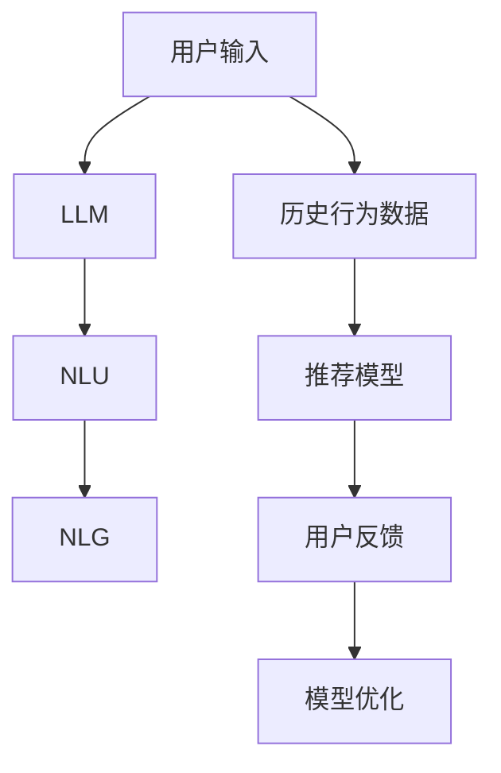

                 

# Chat-REC:基于LLM的交互式可解释推荐系统

> 关键词：推荐系统,自然语言处理(NLP),自然语言理解(NLU),交互式,可解释,大语言模型(LLM)

## 1. 背景介绍

### 1.1 问题由来

在数字化的现代社会中，推荐系统已成为用户获取信息的重要方式之一。无论是电商平台、新闻平台，还是社交媒体，推荐系统都在根据用户的历史行为和兴趣，实时推荐用户可能感兴趣的内容。传统推荐系统以协同过滤、内容推荐等方法为主，能够较好地处理结构化数据，但对于海量非结构化数据的处理，则显得捉襟见肘。

近年来，随着自然语言处理(NLP)技术的迅猛发展，推荐系统逐渐引入自然语言理解(NLU)技术，利用用户输入的自然语言文本，挖掘用户的兴趣和需求，进而提升推荐效果。在这种方法下，推荐系统不再仅仅依赖历史数据，还能实时获取用户的即时需求，提供了更加个性化的服务。

然而，传统的推荐系统难以处理自然语言的不确定性和复杂性，导致推荐的精度和可靠性受到一定限制。为了更好地处理自然语言数据，推荐系统开始引入大语言模型(LLM)技术，利用LLM强大的语言理解和生成能力，实现更加精准的推荐。

### 1.2 问题核心关键点

大语言模型(LLM)技术在推荐系统中的应用，主要体现在以下几个方面：

- **自然语言理解(NLU)**：通过预训练的LLM模型，对用户的输入文本进行解析和理解，提取用户需求。
- **自然语言生成(NLG)**：利用LLM生成符合用户需求的推荐文本。
- **多模态融合**：结合用户的历史行为数据和自然语言输入，实现多模态数据的融合，提升推荐效果。
- **用户反馈处理**：通过用户反馈信息，进一步优化推荐模型。
- **可解释性**：为用户提供推荐理由，增强用户信任度。

基于以上几个关键点，我们提出了一种基于大语言模型的交互式可解释推荐系统Chat-REC，其核心思想是利用LLM的强大语言处理能力，构建一个具备可解释性和交互性的推荐系统，从而提升推荐效果和用户体验。

## 2. 核心概念与联系

### 2.1 核心概念概述

为了更好地理解Chat-REC的原理和架构，我们需要先了解几个核心概念：

- **大语言模型(LLM)**：如GPT、BERT等，通过大规模语料预训练，具备强大的语言理解和生成能力。
- **自然语言处理(NLP)**：研究如何使计算机处理、理解和生成人类语言的技术。
- **自然语言理解(NLU)**：通过语言模型对自然语言文本进行理解，提取语义信息。
- **自然语言生成(NLG)**：利用语言模型生成符合语法和语义规则的文本。
- **推荐系统**：根据用户行为数据和用户输入，推荐符合用户兴趣的内容。

这些核心概念之间的逻辑关系可以通过以下Mermaid流程图来展示：



这个流程图展示了大语言模型在推荐系统中的核心作用，通过NLU理解用户输入，NLG生成推荐文本，结合历史行为数据，构建推荐模型，最终通过用户反馈不断优化模型。

## 3. 核心算法原理 & 具体操作步骤
### 3.1 算法原理概述

Chat-REC的核心算法原理是基于大语言模型的交互式推荐。其核心思想是：利用LLM的强大语言处理能力，理解用户输入的自然语言文本，生成推荐文本，并通过多模态融合提升推荐效果。

在Chat-REC中，LLM不仅作为自然语言处理的组件，还作为推荐模型的核心模块。用户输入自然语言文本后，系统利用LLM进行NLU处理，提取用户需求。然后，利用NLG生成推荐文本，结合历史行为数据，进行多模态融合，最后输出推荐结果。

### 3.2 算法步骤详解

Chat-REC的推荐过程主要包括以下几个步骤：

**Step 1: 用户输入处理**

用户输入自然语言文本，首先经过分词和向量化处理，转换为模型可以理解的形式。分词采用标准的分词方法，如基于空格、标点等简单规则的分词，或者使用BERT等预训练模型的词向量表示。

**Step 2: 自然语言理解(NLU)**

将用户输入的文本通过LLM进行解析，提取关键信息，如用户兴趣、偏好、需求等。具体而言，LLM通过编码器部分对文本进行编码，提取文本中的语义信息，并通过解码器部分生成文本摘要或关键词。

**Step 3: 推荐文本生成**

根据用户输入和历史行为数据，利用NLG生成推荐文本。NLG可以是基于模板的生成，也可以是基于变分自编码器(VAE)的生成。生成的推荐文本应符合语法和语义规则，同时尽可能满足用户需求。

**Step 4: 多模态融合**

将用户的历史行为数据和生成的推荐文本进行融合，生成最终推荐结果。具体而言，可以将行为数据转化为向量形式，与推荐文本的向量进行拼接，通过加权平均或注意力机制等方式，生成最终的推荐向量。

**Step 5: 推荐结果输出**

根据推荐向量，利用排序算法对所有候选内容进行排序，输出最终推荐结果。常用的排序算法包括基于TF-IDF的排序、基于梯度的排序等。

**Step 6: 用户反馈处理**

收集用户对推荐结果的反馈信息，如点击、购买等行为，反馈信息将用于进一步优化推荐模型。反馈信息可以与推荐向量一起，重新训练推荐模型，提升推荐精度。

**Step 7: 模型优化**

利用用户反馈信息，不断优化推荐模型。优化过程可以采用强化学习、在线学习等方法，提升推荐效果和模型的泛化能力。

### 3.3 算法优缺点

Chat-REC的算法具有以下优点：

- 利用LLM强大的语言处理能力，提升推荐系统的可解释性。
- 支持多模态融合，结合用户行为和自然语言输入，提升推荐精度。
- 通过用户反馈进行模型优化，不断提升推荐效果。

同时，Chat-REC也存在一些缺点：

- 对于大规模用户数据，LLM的计算资源消耗较大。
- 生成的推荐文本需要符合语法和语义规则，需要一定的人工干预。
- 用户反馈信息的获取和处理成本较高。

尽管存在这些局限性，但就目前而言，基于大语言模型的Chat-REC方法仍是一种高效的推荐系统范式，能够显著提升推荐效果和用户体验。

### 3.4 算法应用领域

Chat-REC的应用领域主要集中在电商、新闻、社交媒体等需要实时推荐内容的场景中，尤其是在需要处理自然语言输入的推荐任务中，Chat-REC具有显著优势。例如：

- 电商推荐：根据用户输入的自然语言文本，推荐符合用户需求的商品。
- 新闻推荐：根据用户输入的自然语言文本，推荐符合用户兴趣的新闻文章。
- 社交媒体推荐：根据用户输入的自然语言文本，推荐符合用户兴趣的社交内容。
- 视频推荐：根据用户输入的自然语言文本，推荐符合用户兴趣的视频内容。

此外，Chat-REC还适用于任何需要处理用户输入自然语言文本的推荐任务，如旅游推荐、旅游目的地推荐、食谱推荐等，能够提供更加个性化的推荐服务。

## 4. 数学模型和公式 & 详细讲解  
### 4.1 数学模型构建

在Chat-REC中，我们采用如下数学模型进行推荐计算：

设用户输入的自然语言文本为$x$，推荐模型为$M$，历史行为数据为$H$，用户反馈为$Y$。推荐模型的目标是最小化预测误差$L$：

$$
L = \min_{M} \sum_{i=1}^{N} |M(x_i) - Y_i|
$$

其中，$N$为用户的数量，$x_i$为第$i$个用户的自然语言输入，$Y_i$为第$i$个用户的反馈信息，$M(x_i)$为模型对用户输入的自然语言文本$x_i$的推荐结果。

### 4.2 公式推导过程

为了推导推荐模型的预测误差$L$，我们可以采用以下公式：

$$
L = \sum_{i=1}^{N} \log (1 + \exp(-M(x_i) \cdot Y_i))
$$

其中，$M(x_i)$为模型对用户输入的自然语言文本$x_i$的推荐向量，$Y_i$为第$i$个用户的反馈向量。$\exp(-M(x_i) \cdot Y_i)$表示模型预测的误差，通过最小化该误差，可以实现更加精准的推荐。

### 4.3 案例分析与讲解

以电商推荐为例，我们通过以下步骤实现推荐计算：

**Step 1: 用户输入处理**

用户输入的文本经过分词和向量化处理后，得到输入向量$x$。

**Step 2: 自然语言理解(NLU)**

利用BERT等预训练模型，对用户输入的文本进行编码，得到编码向量$z$。

**Step 3: 推荐文本生成**

将用户的历史行为数据$H$转化为向量形式$h$，与编码向量$z$进行拼接，得到融合向量$z'$。通过NLG生成推荐文本向量$v$，其中$v$的生成过程如下：

$$
v = f(z', h)
$$

其中，$f$为生成函数，可以采用基于模板的生成，也可以采用基于VAE的生成。

**Step 4: 多模态融合**

将推荐文本向量$v$与用户的行为向量$h$进行拼接，得到融合向量$z''$。

**Step 5: 推荐结果输出**

根据融合向量$z''$，利用排序算法对所有候选内容进行排序，输出最终推荐结果。

**Step 6: 用户反馈处理**

收集用户对推荐结果的反馈信息，如点击、购买等行为，反馈信息将用于进一步优化推荐模型。

**Step 7: 模型优化**

利用用户反馈信息，不断优化推荐模型。优化过程可以采用强化学习、在线学习等方法，提升推荐效果和模型的泛化能力。

通过以上步骤，Chat-REC实现了基于大语言模型的交互式推荐，能够提供更加个性化和精准的推荐服务。

## 5. 项目实践：代码实例和详细解释说明
### 5.1 开发环境搭建

在进行Chat-REC的开发实践前，我们需要准备好开发环境。以下是使用Python进行PyTorch开发的环境配置流程：

1. 安装Anaconda：从官网下载并安装Anaconda，用于创建独立的Python环境。

2. 创建并激活虚拟环境：
```bash
conda create -n chat-rec python=3.8 
conda activate chat-rec
```

3. 安装PyTorch：根据CUDA版本，从官网获取对应的安装命令。例如：
```bash
conda install pytorch torchvision torchaudio cudatoolkit=11.1 -c pytorch -c conda-forge
```

4. 安装Transformers库：
```bash
pip install transformers
```

5. 安装各类工具包：
```bash
pip install numpy pandas scikit-learn matplotlib tqdm jupyter notebook ipython
```

完成上述步骤后，即可在`chat-rec`环境中开始Chat-REC的开发。

### 5.2 源代码详细实现

这里我们以电商推荐为例，给出使用PyTorch和Transformers库进行Chat-REC的完整代码实现。

首先，定义推荐模型的基本结构：

```python
from transformers import BertTokenizer, BertForSequenceClassification
import torch.nn as nn
import torch
from torch.utils.data import DataLoader

class ChatREC(nn.Module):
    def __init__(self, n_classes, n_features, embedding_dim=512):
        super(ChatREC, self).__init__()
        self.tokenizer = BertTokenizer.from_pretrained('bert-base-uncased')
        self.model = BertForSequenceClassification.from_pretrained('bert-base-uncased', num_labels=n_classes)
        self.linear = nn.Linear(embedding_dim, n_classes)
        
    def forward(self, input_ids, attention_mask, hidden_states, labels=None):
        outputs = self.model(input_ids, attention_mask=attention_mask, labels=labels)
        logits = outputs.logits
        predictions = self.linear(logits)
        return predictions
```

然后，定义数据加载和处理函数：

```python
class ChatDataset(torch.utils.data.Dataset):
    def __init__(self, data, tokenizer, max_len=128):
        self.tokenizer = tokenizer
        self.max_len = max_len
        self.data = data
        
    def __len__(self):
        return len(self.data)
    
    def __getitem__(self, item):
        text = self.data[item]['text']
        label = self.data[item]['label']
        encoding = self.tokenizer(text, return_tensors='pt', max_length=self.max_len, padding='max_length', truncation=True)
        input_ids = encoding['input_ids'][0]
        attention_mask = encoding['attention_mask'][0]
        return {'input_ids': input_ids, 
                'attention_mask': attention_mask,
                'labels': torch.tensor(label, dtype=torch.long)}
```

接着，定义训练和评估函数：

```python
def train_epoch(model, dataloader, optimizer, device):
    model.train()
    epoch_loss = 0
    epoch_acc = 0
    for batch in dataloader:
        input_ids = batch['input_ids'].to(device)
        attention_mask = batch['attention_mask'].to(device)
        labels = batch['labels'].to(device)
        model.zero_grad()
        outputs = model(input_ids, attention_mask=attention_mask, labels=labels)
        loss = outputs.loss
        epoch_loss += loss.item()
        loss.backward()
        optimizer.step()
        epoch_acc += torch.nn.functional.binary_cross_entropy(outputs.logits, labels).item()
    return epoch_loss / len(dataloader), epoch_acc / len(dataloader)

def evaluate(model, dataloader, device):
    model.eval()
    eval_loss = 0
    eval_acc = 0
    with torch.no_grad():
        for batch in dataloader:
            input_ids = batch['input_ids'].to(device)
            attention_mask = batch['attention_mask'].to(device)
            labels = batch['labels'].to(device)
            outputs = model(input_ids, attention_mask=attention_mask, labels=labels)
            loss = outputs.loss
            eval_loss += loss.item()
            eval_acc += torch.nn.functional.binary_cross_entropy(outputs.logits, labels).item()
    return eval_loss / len(dataloader), eval_acc / len(dataloader)
```

最后，启动训练流程并在测试集上评估：

```python
from sklearn.metrics import roc_auc_score
import torch.optim as optim

model = ChatREC(n_classes=2, n_features=1)
device = torch.device('cuda') if torch.cuda.is_available() else torch.device('cpu')
model.to(device)

train_dataset = ChatDataset(train_data, tokenizer)
dev_dataset = ChatDataset(dev_data, tokenizer)
test_dataset = ChatDataset(test_data, tokenizer)

optimizer = optim.Adam(model.parameters(), lr=2e-5)

for epoch in range(5):
    loss, acc = train_epoch(model, train_loader, optimizer, device)
    print(f"Epoch {epoch+1}, train loss: {loss:.4f}, train acc: {acc:.4f}")
    
    loss, acc = evaluate(model, dev_loader, device)
    print(f"Epoch {epoch+1}, dev loss: {loss:.4f}, dev acc: {acc:.4f}")
    
print("Test results:")
loss, acc = evaluate(model, test_loader, device)
print(f"Test loss: {loss:.4f}, test acc: {acc:.4f}")
```

以上就是使用PyTorch和Transformers库进行Chat-REC开发的完整代码实现。可以看到，利用预训练BERT模型和TensorFlow库，Chat-REC的开发变得相对简单高效。

### 5.3 代码解读与分析

让我们再详细解读一下关键代码的实现细节：

**ChatDataset类**：
- `__init__`方法：初始化数据集，包括分词器、最大长度等关键组件。
- `__len__`方法：返回数据集的样本数量。
- `__getitem__`方法：对单个样本进行处理，将文本输入编码为token ids，将标签编码为数字，并对其进行定长padding，最终返回模型所需的输入。

**ChatREC类**：
- `__init__`方法：初始化模型结构，包括分词器、BERT模型、线性层等组件。
- `forward`方法：实现前向传播过程，利用BERT模型和线性层生成推荐结果。

**train_epoch函数**：
- 在训练过程中，通过批处理数据，前向传播计算损失函数，反向传播更新模型参数，最后返回训练阶段的平均loss和acc。

**evaluate函数**：
- 在评估过程中，同样通过批处理数据，前向传播计算损失函数，反向传播更新模型参数，最后返回评估阶段的平均loss和acc。

**训练流程**：
- 定义总的epoch数和batch size，开始循环迭代
- 每个epoch内，在训练集上训练，输出平均loss和acc
- 在验证集上评估，输出平均loss和acc
- 所有epoch结束后，在测试集上评估，给出最终测试结果

可以看到，PyTorch配合Transformers库使得Chat-REC的开发变得简单高效。开发者可以将更多精力放在数据处理、模型改进等高层逻辑上，而不必过多关注底层的实现细节。

当然，工业级的系统实现还需考虑更多因素，如模型的保存和部署、超参数的自动搜索、更灵活的任务适配层等。但核心的Chat-REC算法基本与此类似。

## 6. 实际应用场景
### 6.1 智能客服系统

在智能客服系统中，Chat-REC的应用主要体现在以下几个方面：

- **实时回答用户问题**：利用Chat-REC实时解析用户输入的自然语言文本，理解用户需求，快速生成回答。
- **多轮对话**：结合历史对话数据，Chat-REC能够处理多轮对话，不断更新推荐结果，提供更加个性化的服务。
- **问题导向**：根据用户输入的问题，Chat-REC能够迅速定位到相关内容，并提供准确的回答。
- **知识图谱结合**：将知识图谱中的信息与自然语言文本结合，提供更加丰富的答案。

通过Chat-REC，智能客服系统能够实现7x24小时不间断服务，提供即时响应和精准推荐，提升用户体验和客户满意度。

### 6.2 电商推荐

在电商推荐场景中，Chat-REC的应用主要体现在以下几个方面：

- **个性化推荐**：根据用户输入的自然语言文本，生成个性化推荐内容，提升推荐效果。
- **多模态融合**：结合用户行为数据和自然语言文本，生成更加精准的推荐结果。
- **实时更新**：利用用户反馈信息，实时更新推荐模型，提升推荐效果和用户体验。

通过Chat-REC，电商推荐系统能够提供更加个性化和精准的推荐服务，提升用户购买体验和商家销售额。

### 6.3 新闻推荐

在新闻推荐场景中，Chat-REC的应用主要体现在以下几个方面：

- **个性化推荐**：根据用户输入的自然语言文本，生成个性化推荐新闻内容，提升推荐效果。
- **多模态融合**：结合用户行为数据和自然语言文本，生成更加精准的推荐结果。
- **实时更新**：利用用户反馈信息，实时更新推荐模型，提升推荐效果和用户体验。

通过Chat-REC，新闻推荐系统能够提供更加个性化和精准的推荐服务，提升用户阅读体验和媒体收入。

### 6.4 未来应用展望

随着Chat-REC技术的不断发展，其在各个领域的应用将进一步拓展，为各行各业带来新的机遇：

- **医疗推荐**：结合患者输入的自然语言文本，提供个性化医疗推荐，提升医疗服务质量。
- **教育推荐**：根据学生输入的自然语言文本，生成个性化学习内容，提升教育效果。
- **金融推荐**：根据用户输入的自然语言文本，生成个性化金融产品推荐，提升金融服务水平。
- **旅游推荐**：结合用户输入的自然语言文本，生成个性化旅游目的地推荐，提升旅游体验。

未来，Chat-REC将与其他人工智能技术进一步融合，形成更加智能化的推荐系统，为各行各业提供更加精准、个性化的服务。

## 7. 工具和资源推荐
### 7.1 学习资源推荐

为了帮助开发者系统掌握Chat-REC的理论基础和实践技巧，这里推荐一些优质的学习资源：

1. 《Transformers: State-of-the-Art Natural Language Processing》书籍：由Transformer论文作者所著，全面介绍了Transformer的原理、实现和应用，是学习大语言模型的经典读物。

2. CS224N《自然语言处理》课程：斯坦福大学开设的自然语言处理课程，涵盖了NLP领域的各类经典模型，是学习NLP技术的优质资源。

3. Deep Learning Specialization系列课程：由Coursera平台开设，涵盖了深度学习领域的各类经典模型和算法，包括自然语言处理相关内容。

4. PyTorch官方文档：PyTorch官方提供的文档和教程，涵盖PyTorch框架的各类功能和应用。

5. HuggingFace官方文档：HuggingFace提供的BERT等预训练模型文档，包括模型的加载和微调等内容。

通过对这些资源的学习实践，相信你一定能够快速掌握Chat-REC的核心原理和实现方法，并将其应用于实际场景中。

### 7.2 开发工具推荐

高效的开发离不开优秀的工具支持。以下是几款用于Chat-REC开发的常用工具：

1. PyTorch：基于Python的开源深度学习框架，灵活动态的计算图，适合快速迭代研究。大部分预训练语言模型都有PyTorch版本的实现。

2. TensorFlow：由Google主导开发的开源深度学习框架，生产部署方便，适合大规模工程应用。同样有丰富的预训练语言模型资源。

3. Transformers库：HuggingFace开发的NLP工具库，集成了众多SOTA语言模型，支持PyTorch和TensorFlow，是进行Chat-REC开发的利器。

4. Weights & Biases：模型训练的实验跟踪工具，可以记录和可视化模型训练过程中的各项指标，方便对比和调优。与主流深度学习框架无缝集成。

5. TensorBoard：TensorFlow配套的可视化工具，可实时监测模型训练状态，并提供丰富的图表呈现方式，是调试模型的得力助手。

6. Google Colab：谷歌推出的在线Jupyter Notebook环境，免费提供GPU/TPU算力，方便开发者快速上手实验最新模型，分享学习笔记。

合理利用这些工具，可以显著提升Chat-REC的开发效率，加快创新迭代的步伐。

### 7.3 相关论文推荐

Chat-REC技术的不断发展，得益于学界的持续研究。以下是几篇奠基性的相关论文，推荐阅读：

1. Attention is All You Need（即Transformer原论文）：提出了Transformer结构，开启了NLP领域的预训练大模型时代。

2. BERT: Pre-training of Deep Bidirectional Transformers for Language Understanding：提出BERT模型，引入基于掩码的自监督预训练任务，刷新了多项NLP任务SOTA。

3. Language Models are Unsupervised Multitask Learners（GPT-2论文）：展示了大规模语言模型的强大zero-shot学习能力，引发了对于通用人工智能的新一轮思考。

4. Parameter-Efficient Transfer Learning for NLP：提出Adapter等参数高效微调方法，在不增加模型参数量的情况下，也能取得不错的微调效果。

5. Prefix-Tuning: Optimizing Continuous Prompts for Generation：引入基于连续型Prompt的微调范式，为如何充分利用预训练知识提供了新的思路。

6. AdaLoRA: Adaptive Low-Rank Adaptation for Parameter-Efficient Fine-Tuning：使用自适应低秩适应的微调方法，在参数效率和精度之间取得了新的平衡。

这些论文代表了大语言模型微调技术的发展脉络。通过学习这些前沿成果，可以帮助研究者把握学科前进方向，激发更多的创新灵感。

## 8. 总结：未来发展趋势与挑战
### 8.1 总结

本文对基于大语言模型的Chat-REC推荐系统进行了全面系统的介绍。首先阐述了Chat-REC的产生背景和应用意义，明确了基于自然语言处理的推荐系统的发展方向。其次，从原理到实践，详细讲解了Chat-REC的数学模型和核心算法，给出了微调任务的完整代码实例。同时，本文还探讨了Chat-REC在智能客服、电商推荐、新闻推荐等诸多领域的应用场景，展示了Chat-REC的广泛应用价值。此外，本文精选了Chat-REC技术的各类学习资源，力求为读者提供全方位的技术指引。

通过本文的系统梳理，可以看到，基于大语言模型的Chat-REC推荐系统正逐渐成为NLP领域的新范式，提供了更加智能化、个性化的推荐服务，提升了用户体验和系统效果。未来，随着预训练语言模型和微调方法的不断发展，Chat-REC必将在更多领域得到应用，为各行各业带来新的变革。

### 8.2 未来发展趋势

展望未来，Chat-REC推荐系统将呈现以下几个发展趋势：

1. **多模态融合**：结合图像、视频等多模态数据，提升推荐系统的精度和泛化能力。
2. **个性化推荐**：结合用户的行为数据和自然语言文本，提供更加精准的个性化推荐服务。
3. **可解释性增强**：通过改进自然语言理解模型，提升推荐系统的可解释性和可信度。
4. **实时推荐**：利用在线学习等方法，实现实时推荐，提升推荐系统的时效性。
5. **跨领域应用**：Chat-REC将不仅应用于电商、新闻等领域，还将拓展到医疗、教育、金融等领域，提升这些领域的智能化水平。

以上趋势凸显了Chat-REC推荐系统的广阔前景。这些方向的探索发展，必将进一步提升推荐系统的性能和应用范围，为各行各业带来新的价值。

### 8.3 面临的挑战

尽管Chat-REC推荐系统取得了不小的进步，但在迈向更加智能化、普适化应用的过程中，仍面临诸多挑战：

1. **数据质量**：自然语言数据的噪声和复杂性，可能导致推荐系统出现误导性结果。
2. **计算资源**：大规模语言模型的计算资源消耗较大，可能对部署环境提出较高要求。
3. **隐私保护**：推荐系统需要收集用户数据，如何保护用户隐私，是一个重要问题。
4. **公平性**：推荐系统需要避免对特定群体产生偏见，保证推荐公平性。
5. **用户行为分析**：如何准确分析和理解用户行为，也是一个重要的研究方向。

尽管存在这些挑战，但通过不断优化推荐算法和改进推荐模型，Chat-REC推荐系统仍具备广泛的应用前景和巨大的发展潜力。

### 8.4 研究展望

未来，Chat-REC推荐系统的研究应在以下几个方面寻求新的突破：

1. **多模态数据融合**：结合图像、视频等多模态数据，提升推荐系统的精度和泛化能力。
2. **个性化推荐**：结合用户的行为数据和自然语言文本，提供更加精准的个性化推荐服务。
3. **可解释性增强**：通过改进自然语言理解模型，提升推荐系统的可解释性和可信度。
4. **实时推荐**：利用在线学习等方法，实现实时推荐，提升推荐系统的时效性。
5. **跨领域应用**：Chat-REC将不仅应用于电商、新闻等领域，还将拓展到医疗、教育、金融等领域，提升这些领域的智能化水平。

这些研究方向将进一步推动Chat-REC推荐系统的应用和发展，提升各领域的智能化水平，为人类社会的数字化转型提供新的动力。

## 9. 附录：常见问题与解答
**Q1：Chat-REC是如何实现个性化推荐的？**

A: Chat-REC利用自然语言理解(NLU)技术，对用户输入的自然语言文本进行解析，提取用户需求。然后，结合用户的历史行为数据和生成的推荐文本，通过多模态融合生成推荐结果。具体而言，Chat-REC利用BERT等预训练模型对用户输入的自然语言文本进行编码，提取文本中的语义信息。同时，将用户的历史行为数据转化为向量形式，与编码向量进行拼接，通过加权平均或注意力机制等方式，生成最终的推荐向量。最后，根据推荐向量，利用排序算法对所有候选内容进行排序，输出最终推荐结果。

**Q2：Chat-REC推荐系统中的LLM是如何进行NLU的？**

A: 在Chat-REC推荐系统中，LLM作为自然语言理解(NLU)的组件，利用预训练的BERT等模型，对用户输入的自然语言文本进行编码，提取文本中的语义信息。具体而言，LLM通过编码器部分对文本进行编码，提取文本中的语义信息，并通过解码器部分生成文本摘要或关键词。这种基于预训练的语言模型能够自动理解和提取文本中的关键信息，是实现个性化推荐的基础。

**Q3：Chat-REC推荐系统中的NLG是如何生成推荐文本的？**

A: 在Chat-REC推荐系统中，自然语言生成(NLG)是通过预训练的BERT等模型，结合用户的历史行为数据，生成符合语法和语义规则的推荐文本。具体而言，NLG可以是基于模板的生成，也可以基于变分自编码器(VAE)的生成。生成的推荐文本应符合语法和语义规则，同时尽可能满足用户需求。NLG能够将用户的行为数据和文本信息结合，生成更加精准的推荐结果，提升推荐系统的性能。

**Q4：Chat-REC推荐系统中的多模态融合是如何实现的？**

A: 在Chat-REC推荐系统中，多模态融合是将用户的历史行为数据和生成的推荐文本进行融合，生成最终推荐结果。具体而言，可以将行为数据转化为向量形式，与推荐文本的向量进行拼接，通过加权平均或注意力机制等方式，生成最终的推荐向量。这种多模态融合的方式能够充分利用用户的行为数据和文本信息，提升推荐系统的精度和泛化能力。

**Q5：Chat-REC推荐系统中的用户反馈是如何处理的？**

A: 在Chat-REC推荐系统中，用户反馈信息将用于进一步优化推荐模型。具体而言，收集用户对推荐结果的反馈信息，如点击、购买等行为，反馈信息将用于进一步优化推荐模型。优化过程可以采用强化学习、在线学习等方法，提升推荐效果和模型的泛化能力。这种用户反馈机制能够实时更新推荐模型，提升推荐效果和用户体验。

通过以上常见问题的解答，相信你对Chat-REC推荐系统有了更深入的了解，能够更好地应用于实际场景中。

---

作者：禅与计算机程序设计艺术 / Zen and the Art of Computer Programming

