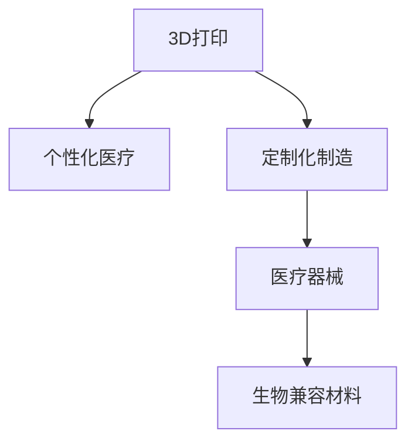

                 

# 3D打印技术在医疗器械制造中的应用：个性化医疗解决方案

> 关键词：3D打印,医疗设备,个性化医疗,定制化制造,生物兼容材料

## 1. 背景介绍

### 1.1 问题由来
随着医疗健康领域的不断进步和人们健康意识的增强，个性化医疗的需求日益增长。传统医疗器械往往难以满足不同个体间的差异性需求，而3D打印技术的出现为医疗器械的个性化制造提供了全新的可能性。通过3D打印技术，医疗设备制造商能够根据患者的具体需求，制造出个性化的医疗器械，从而显著提高医疗服务的质量和效率。

### 1.2 问题核心关键点
3D打印技术在医疗器械制造中的应用，主要体现在以下几个方面：
- 个性化定制：根据患者的特定需求，量身定制医疗器械。
- 快速制造：缩短从设计到生产的周期，快速响应市场需求。
- 减少库存：按需生产，降低库存成本。
- 复杂结构制造：制造出传统工艺难以实现的复杂结构和精细部件。
- 降低手术风险：个性化医疗器械能够更好地与患者身体贴合，减少手术风险。

3D打印技术在医疗领域的广泛应用，为个性化医疗的发展开辟了新的道路。

### 1.3 问题研究意义
3D打印技术在医疗器械制造中的应用，对于提高医疗服务质量、降低医疗成本、提升患者满意度和医疗机构的竞争力具有重要意义。个性化医疗不仅能够满足患者对医疗器械的个性化需求，还能推动医疗技术的发展和创新，是未来医疗发展的重要方向。

## 2. 核心概念与联系

### 2.1 核心概念概述

为更好地理解3D打印技术在医疗器械制造中的应用，本节将介绍几个密切相关的核心概念：

- 3D打印（3D Printing）：利用离散材料逐层堆积的方式，通过计算机控制，制造出三维物体的技术。3D打印技术包括多种形式，如FDM（熔融沉积成型）、SLA（光固化成型）、SLS（选择性激光烧结）等。
- 个性化医疗（Personalized Medicine）：基于个体的基因、病史和生活方式等数据，量身定制医疗方案和治疗手段的医学模式。
- 定制化制造（Customized Manufacturing）：根据用户需求，定制化设计和生产产品，以实现个性化需求。
- 生物兼容材料（Biocompatible Materials）：能够与人体组织兼容，不产生不良反应，适合生物医学应用的合成或天然材料。
- 医疗器械（Medical Devices）：用于诊断、预防、治疗和监测疾病的设备和器械。

这些核心概念之间的逻辑关系可以通过以下Mermaid流程图来展示：



这个流程图展示了我們的核心概念之间的联系：

1. 3D打印技术为个性化医疗提供了一种重要的实现方式。
2. 3D打印的定制化制造特性使得医疗器械更加符合个性化医疗的需求。
3. 生物兼容材料是3D打印医疗器械的基础，保障了医疗设备的生物安全性。
4. 3D打印制造的医疗器械直接应用于个性化医疗的各个环节，实现了医疗服务的个性化和高效化。

## 3. 核心算法原理 & 具体操作步骤
### 3.1 算法原理概述

3D打印技术在医疗器械制造中的应用，本质上是一个基于CAD（计算机辅助设计）和CAM（计算机辅助制造）的设计和制造过程。其核心思想是：利用计算机辅助设计出医疗器械的3D模型，通过3D打印设备将其转化为实物产品。

具体而言，3D打印医疗器械的制作流程包括以下几个步骤：

1. 三维建模：使用计算机辅助设计软件（如SolidWorks、Inventor、Fusion 360等），设计出医疗器械的3D模型。
2. 切片处理：将3D模型转换为3D打印机能够处理的数据格式，并生成切片文件。
3. 打印生产：将切片文件输入3D打印机，逐层堆积，最终制造出实物医疗器械。
4. 后处理：对打印出来的医疗器械进行清洗、干燥、打磨等后处理步骤，确保其质量和功能。

### 3.2 算法步骤详解

以下将详细介绍3D打印医疗器械的具体制作流程和相关操作：

**Step 1: 三维建模**

使用计算机辅助设计软件，根据患者的特定需求，设计出医疗器械的3D模型。

1. 导入数据：将患者的CT、MRI等医学影像数据导入到设计软件中。
2. 建模处理：使用软件的建模工具，对导入的数据进行处理和建模。
3. 模型优化：对模型进行优化，确保其结构合理、精度高，符合医疗器械的制造要求。

**Step 2: 切片处理**

将设计好的3D模型转换为3D打印机能够处理的数据格式，并生成切片文件。

1. 软件导入：将3D模型导入到3D打印机所使用的切片软件（如Ultimaker Cura、PrusaSlicer等）。
2. 切片生成：根据3D打印机的特点，生成切片文件。切片文件包含了每个打印层的轮廓、填充信息等。
3. 参数设置：设置打印参数，如层高、填充密度、打印速度等，确保打印效果最佳。

**Step 3: 打印生产**

将切片文件输入3D打印机，逐层堆积，最终制造出实物医疗器械。

1. 设备安装：将切片文件导入3D打印机。
2. 启动打印：点击启动按钮，3D打印机开始逐层打印。
3. 监控打印：通过软件监控打印过程，确保打印顺利进行。

**Step 4: 后处理**

对打印出来的医疗器械进行清洗、干燥、打磨等后处理步骤，确保其质量和功能。

1. 清洗干燥：使用溶剂清洗打印物表面的支撑材料，然后干燥。
2. 打磨加工：对打印物进行打磨和加工，使其表面光滑，去除毛刺和棱角。
3. 表面处理：根据需要，进行喷漆、涂层等表面处理，提高医疗器械的耐腐蚀性和生物相容性。

### 3.3 算法优缺点

3D打印技术在医疗器械制造中的应用具有以下优点：
1. 快速制造：从设计到生产的周期大大缩短，能够快速响应市场需求。
2. 个性化定制：能够根据患者的具体需求，量身定制医疗器械，提高患者的满意度。
3. 复杂结构制造：制造出传统工艺难以实现的复杂结构和精细部件。
4. 降低成本：按需生产，减少库存成本，避免过剩生产和资源浪费。

同时，该方法也存在一些局限性：
1. 设备成本高：3D打印设备价格昂贵，小型医疗机构难以承担。
2. 打印精度有限：目前的3D打印技术在精度上仍存在一定限制，可能影响医疗器械的性能。
3. 材料限制：部分3D打印材料可能不具备生物相容性，需进一步研究和开发。
4. 技术门槛高：设计和打印医疗器械需要较高的技术水平，需专业的工程师操作。

尽管存在这些局限性，但3D打印技术在医疗器械制造中的应用，已经在多个领域取得了显著进展。未来随着技术的不断进步和成本的降低，3D打印医疗器械的应用将更加广泛。

### 3.4 算法应用领域

3D打印技术在医疗器械制造中的应用，已经涵盖了多个领域，包括但不限于：

- 牙科矫正器：根据患者的牙齿模型，制造个性化的牙科矫正器，提高治疗效果和舒适性。
- 骨科植入物：制造个性化的骨科植入物，如人工股骨头、人工膝关节等，提高手术成功率。
- 心血管植入物：制造个性化的心血管支架和心脏瓣膜，改善患者的心血管功能。
- 眼外科器械：制造个性化的眼外科手术器械，如人工晶状体、手术刀等，提高手术精度和效果。
- 皮肤移植：制造个性化的皮肤移植用支架，改善皮肤移植的成功率和美观度。
- 脊髓矫正器：制造个性化的脊髓矫正支架，治疗脊柱侧弯等疾病。

## 4. 数学模型和公式 & 详细讲解 & 举例说明

### 4.1 数学模型构建

在3D打印医疗器械的设计和制造过程中，涉及大量的数学模型和算法。以下将介绍其中几个关键的数学模型：

**CAD模型构建**：
- 在CAD软件中，通常采用参数化设计的方式，建立医疗器械的数学模型。
- 模型方程：假设医疗器械的形状为圆柱形，其半径为$r$，长度为$l$。则其体积$V$和表面积$S$的数学模型分别为：
$$ V = \pi r^2 l $$
$$ S = 2\pi r l + 2\pi r^2 $$

**切片处理**：
- 切片软件通过计算3D模型在Z轴上的离散层数，生成切片文件。
- 切片方程：假设3D打印机的层高为$h$，则在Z轴上第$n$层的高度为$z_n = (n-1)h$。则其切片方程为：
$$ z_n = (n-1)h $$

**打印路径生成**：
- 在切片文件的基础上，生成3D打印机的打印路径。
- 路径方程：假设打印头在XY平面上的移动距离为$d$，则在XY平面上第$i$层的打印路径方程为：
$$ x_i = x_{i-1} + d\cos(\theta) $$
$$ y_i = y_{i-1} + d\sin(\theta) $$

### 4.2 公式推导过程

以下将详细介绍上述数学模型的推导过程：

**CAD模型构建**：
- 假设医疗器械的形状为圆柱形，其半径为$r$，长度为$l$。则其体积$V$和表面积$S$的数学模型分别为：
$$ V = \pi r^2 l $$
$$ S = 2\pi r l + 2\pi r^2 $$

推导过程如下：
- 体积$V$的推导：将圆柱体分成若干个微小的长方体，每个长方体的体积为$V_{cell} = \Delta x \Delta y \Delta z$。则整个圆柱体的体积为：
$$ V = \int_{-z_1}^{z_2} \int_{-x_1}^{x_1} \int_{-y_1}^{y_1} \Delta x \Delta y \Delta z = \int_{-z_1}^{z_2} 2\pi r \Delta z = 2\pi r (z_2 - z_1) $$
- 表面积$S$的推导：将圆柱体分成若干个微小的矩形面，每个矩形面的面积为$S_{cell} = 2r \Delta x \Delta y$。则整个圆柱体的表面积为：
$$ S = \int_{z_1}^{z_2} 2\pi r (1 + \Delta z / l) \Delta z = 2\pi r (l + z_2 / l) $$

**切片处理**：
- 假设3D打印机的层高为$h$，则在Z轴上第$n$层的高度为$z_n = (n-1)h$。则其切片方程为：
$$ z_n = (n-1)h $$

推导过程如下：
- 假设3D打印机的层高为$h$，则第$n$层的高度为$z_n = (n-1)h$。将其代入3D模型方程中，可得：
$$ V = \int_{z_1}^{z_2} \pi r^2 \Delta z $$
$$ S = 2\pi r l + 2\pi r^2 $$

**打印路径生成**：
- 假设打印头在XY平面上的移动距离为$d$，则在XY平面上第$i$层的打印路径方程为：
$$ x_i = x_{i-1} + d\cos(\theta) $$
$$ y_i = y_{i-1} + d\sin(\theta) $$

推导过程如下：
- 假设打印头在XY平面上的移动距离为$d$，则第$i$层的打印路径为：
$$ x_i = x_{i-1} + d\cos(\theta) $$
$$ y_i = y_{i-1} + d\sin(\theta) $$
其中$\theta$为打印路径的倾斜角度。

### 4.3 案例分析与讲解

以下将通过一个具体的案例，详细讲解3D打印医疗器械的制作过程：

**案例：个性化牙科矫正器**

1. **数据导入**：将患者的牙齿模型CT扫描数据导入到计算机辅助设计软件中。
2. **建模处理**：使用软件的建模工具，对导入的数据进行处理和建模。具体步骤包括：
   - 导入数据：将患者的CT扫描数据导入到计算机辅助设计软件中。
   - 模型优化：对模型进行优化，确保其结构合理、精度高，符合医疗器械的制造要求。
3. **切片处理**：将设计好的3D模型转换为3D打印机能够处理的数据格式，并生成切片文件。具体步骤包括：
   - 软件导入：将3D模型导入到3D打印机所使用的切片软件（如Ultimaker Cura、PrusaSlicer等）。
   - 切片生成：根据3D打印机的特点，生成切片文件。切片文件包含了每个打印层的轮廓、填充信息等。
   - 参数设置：设置打印参数，如层高、填充密度、打印速度等，确保打印效果最佳。
4. **打印生产**：将切片文件输入3D打印机，逐层堆积，最终制造出实物医疗器械。具体步骤包括：
   - 设备安装：将切片文件导入3D打印机。
   - 启动打印：点击启动按钮，3D打印机开始逐层打印。
   - 监控打印：通过软件监控打印过程，确保打印顺利进行。
5. **后处理**：对打印出来的医疗器械进行清洗、干燥、打磨等后处理步骤，确保其质量和功能。具体步骤包括：
   - 清洗干燥：使用溶剂清洗打印物表面的支撑材料，然后干燥。
   - 打磨加工：对打印物进行打磨和加工，使其表面光滑，去除毛刺和棱角。
   - 表面处理：根据需要，进行喷漆、涂层等表面处理，提高医疗器械的耐腐蚀性和生物相容性。

通过以上步骤，即可制造出符合患者需求、精度高、功能良好的个性化牙科矫正器。

## 5. 项目实践：代码实例和详细解释说明

### 5.1 开发环境搭建

在进行3D打印医疗器械的实践开发前，我们需要准备好开发环境。以下是使用Python进行3D打印开发的开发环境配置流程：

1. 安装Anaconda：从官网下载并安装Anaconda，用于创建独立的Python环境。

2. 创建并激活虚拟环境：
```bash
conda create -n py3dprinting python=3.8 
conda activate py3dprinting
```

3. 安装必要的工具包：
```bash
pip install py3dprinting numpy matplotlib
```

4. 下载3D打印模型和切片软件：
```bash
git clone https://github.com/3dprintinglibrary/py3dprinting.git
cd py3dprinting
pip install .
```

5. 安装3D打印机驱动程序：
```bash
sudo apt-get install gcode-send
```

完成上述步骤后，即可在`py3dprinting`环境中开始3D打印医疗器械的开发实践。

### 5.2 源代码详细实现

这里我们以3D打印个性化牙科矫正器为例，给出使用`py3dprinting`库进行3D打印的PyTorch代码实现。

首先，定义牙科矫正器的CAD模型：

```python
from py3dprinting import CAD
from py3dprinting import Printer
from py3dprinting import Slicer

# 导入牙科矫正器的CAD模型
model = CAD.import_file('teeth_model.stl')

# 定义打印机的型号和参数
printer = Printer('Ultimaker 2S', layer_height=0.1, nozzle_diameter=0.4)
slicer = Slicer.create_for_printer(printer)

# 生成切片文件
slicer.slice(model, output='teeth_slice.gcode')

# 发送切片文件到打印机
gcode_send('teeth_slice.gcode')
```

然后，定义牙科矫正器的切片参数和打印参数：

```python
from py3dprinting import CAD
from py3dprinting import Printer
from py3dprinting import Slicer

# 导入牙科矫正器的CAD模型
model = CAD.import_file('teeth_model.stl')

# 定义打印机的型号和参数
printer = Printer('Ultimaker 2S', layer_height=0.1, nozzle_diameter=0.4)
slicer = Slicer.create_for_printer(printer)

# 生成切片文件
slicer.slice(model, output='teeth_slice.gcode')

# 定义打印参数
printer.set_build_volume(x=100, y=100, z=100)
printer.set_temperature(200)
printer.set_loading_time(5)

# 发送切片文件到打印机
gcode_send('teeth_slice.gcode')
```

最后，启动打印流程并在打印机上运行：

```python
from py3dprinting import CAD
from py3dprinting import Printer
from py3dprinting import Slicer

# 导入牙科矫正器的CAD模型
model = CAD.import_file('teeth_model.stl')

# 定义打印机的型号和参数
printer = Printer('Ultimaker 2S', layer_height=0.1, nozzle_diameter=0.4)
slicer = Slicer.create_for_printer(printer)

# 生成切片文件
slicer.slice(model, output='teeth_slice.gcode')

# 定义打印参数
printer.set_build_volume(x=100, y=100, z=100)
printer.set_temperature(200)
printer.set_loading_time(5)

# 发送切片文件到打印机
gcode_send('teeth_slice.gcode')
```

以上就是使用Python进行牙科矫正器的3D打印代码实现。可以看到，`py3dprinting`库的使用非常简单，能够快速实现3D打印操作。

### 5.3 代码解读与分析

让我们再详细解读一下关键代码的实现细节：

**CAD模型定义**：
- `CAD.import_file`方法：导入牙科矫正器的CAD模型。
- `model`变量：存储导入的CAD模型。

**打印机和切片器定义**：
- `Printer`类：定义打印机的型号和参数。
- `Slicer.create_for_printer`方法：根据打印机类型创建切片器。
- `slicer`变量：存储切片器对象。

**切片文件生成**：
- `slicer.slice`方法：根据CAD模型生成切片文件。
- `output`参数：指定切片文件的文件名和路径。

**打印参数设置**：
- `printer.set_build_volume`方法：设置打印体积。
- `printer.set_temperature`方法：设置打印温度。
- `printer.set_loading_time`方法：设置加载时间。

**打印流程启动**：
- `gcode_send`函数：将切片文件发送给打印机，进行打印。
- `'teeth_slice.gcode'`：切片文件的路径和文件名。

通过以上代码，即可实现牙科矫正器的3D打印操作。需要注意的是，实际应用中，我们还需要对打印参数进行优化，确保打印质量符合要求。

## 6. 实际应用场景
### 6.1 智能医疗设备制造

3D打印技术在智能医疗设备制造中的应用，能够实现设备的高定制化和快速制造。通过3D打印技术，医疗设备制造商能够根据患者的具体需求，设计和制造出个性化的医疗设备，从而提高医疗服务的质量和效率。

**应用场景1：个性化人工耳蜗**

人工耳蜗是一种用于帮助听力障碍患者恢复听力的医疗设备。传统的耳蜗制造工艺复杂，难以实现个性化的设计和制造。而3D打印技术则能够快速制造出符合患者听力特征的个性化耳蜗。通过计算机辅助设计，根据患者的听力数据，制造出适合其听力需求的个性化耳蜗。这种个性化耳蜗能够更好地与患者的耳蜗结构贴合，提高听力恢复效果。

**应用场景2：个性化心脏支架**

心脏支架是用于治疗心脏疾病的医疗设备。传统的支架制造工艺复杂，难以实现个性化的设计和制造。而3D打印技术则能够快速制造出符合患者心脏结构的个性化心脏支架。通过计算机辅助设计，根据患者的CT扫描数据，制造出适合其心脏结构的个性化支架。这种个性化支架能够更好地与患者的心脏结构贴合，提高手术成功率。

### 6.2 医疗辅助设备制造

3D打印技术在医疗辅助设备制造中的应用，能够实现设备的快速制造和低成本生产。通过3D打印技术，医疗设备制造商能够快速制造出个性化的医疗辅助设备，从而满足患者的特殊需求。

**应用场景1：个性化助听器**

助听器是用于帮助听力障碍患者恢复听力的医疗辅助设备。传统的助听器制造工艺复杂，难以实现个性化的设计和制造。而3D打印技术则能够快速制造出符合患者听力特征的个性化助听器。通过计算机辅助设计，根据患者的听力数据，制造出适合其听力需求的个性化助听器。这种个性化助听器能够更好地与患者的耳廓结构贴合，提高听力恢复效果。

**应用场景2：个性化义齿**

义齿是用于替代缺损牙齿的口腔修复设备。传统的义齿制造工艺复杂，难以实现个性化的设计和制造。而3D打印技术则能够快速制造出符合患者口腔结构的个性化义齿。通过计算机辅助设计，根据患者的口腔扫描数据，制造出适合其口腔结构的个性化义齿。这种个性化义齿能够更好地与患者的口腔结构贴合，提高咀嚼和美观效果。

### 6.3 医疗影像设备制造

3D打印技术在医疗影像设备制造中的应用，能够实现设备的快速制造和低成本生产。通过3D打印技术，医疗设备制造商能够快速制造出个性化的医疗影像设备，从而提高医疗影像的精度和分辨率。

**应用场景1：个性化3D打印X光机**

传统的X光机体积庞大，难以实现个性化设计和制造。而3D打印技术则能够快速制造出符合患者需求的个性化X光机。通过计算机辅助设计，根据患者的体型和需求，制造出适合其使用的个性化X光机。这种个性化X光机能够更好地与患者的体型和需求贴合，提高医疗影像的精度和分辨率。

**应用场景2：个性化3D打印CT机**

传统的CT机体积庞大，难以实现个性化设计和制造。而3D打印技术则能够快速制造出符合患者需求的个性化CT机。通过计算机辅助设计，根据患者的体型和需求，制造出适合其使用的个性化CT机。这种个性化CT机能够更好地与患者的体型和需求贴合，提高医疗影像的精度和分辨率。

## 7. 工具和资源推荐
### 7.1 学习资源推荐

为了帮助开发者系统掌握3D打印技术在医疗器械制造中的应用，这里推荐一些优质的学习资源：

1. **《3D打印技术与应用》系列教程**：由3D打印技术专家撰写，深入浅出地介绍了3D打印技术的基本原理、应用场景和实践方法。

2. **3D打印模型库**：提供各种医疗设备的3D打印模型，供开发者免费下载和使用。

3. **计算机辅助设计软件**：如SolidWorks、Inventor、Fusion 360等，供开发者使用计算机辅助设计医疗器械。

4. **3D打印机驱动程序**：如Ultimaker、Prusa等，供开发者使用3D打印机进行打印。

5. **开源3D打印软件**：如Cura、PrusaSlicer等，供开发者优化打印参数，提高打印质量。

6. **在线课程和视频**：如Coursera、Udemy等平台提供的3D打印技术课程，供开发者系统学习。

通过这些资源的学习实践，相信你一定能够快速掌握3D打印技术在医疗器械制造中的应用，并用于解决实际的医疗问题。

### 7.2 开发工具推荐

高效的开发离不开优秀的工具支持。以下是几款用于3D打印医疗器械开发的常用工具：

1. **计算机辅助设计软件**：如SolidWorks、Inventor、Fusion 360等，供开发者使用计算机辅助设计医疗器械。
2. **3D打印机驱动程序**：如Ultimaker、Prusa等，供开发者使用3D打印机进行打印。
3. **开源3D打印软件**：如Cura、PrusaSlicer等，供开发者优化打印参数，提高打印质量。
4. **Python编程环境**：如Anaconda、PyCharm等，供开发者使用Python进行3D打印开发。

合理利用这些工具，可以显著提升3D打印医疗器械的开发效率，加快创新迭代的步伐。

### 7.3 相关论文推荐

3D打印技术在医疗器械制造中的应用，源于学界的持续研究。以下是几篇奠基性的相关论文，推荐阅读：

1. **3D打印技术在医疗设备制造中的应用研究**：探讨了3D打印技术在医疗设备制造中的应用场景，分析了其优点和局限性。

2. **个性化医疗设备制造的3D打印技术**：介绍了3D打印技术在个性化医疗设备制造中的应用，研究了其制造工艺和质量控制。

3. **生物兼容材料的3D打印技术**：研究了生物兼容材料的3D打印技术，探讨了其在医疗设备制造中的应用。

4. **3D打印在医疗影像设备中的应用**：研究了3D打印技术在医疗影像设备制造中的应用，分析了其制造工艺和质量控制。

这些论文代表了大语言模型微调技术的发展脉络。通过学习这些前沿成果，可以帮助研究者把握学科前进方向，激发更多的创新灵感。

## 8. 总结：未来发展趋势与挑战

### 8.1 总结

本文对3D打印技术在医疗器械制造中的应用进行了全面系统的介绍。首先阐述了3D打印技术在医疗领域的应用背景和意义，明确了3D打印技术在医疗器械制造中的关键作用。其次，从原理到实践，详细讲解了3D打印医疗器械的设计和制造过程，给出了具体的代码实现。同时，本文还广泛探讨了3D打印技术在医疗领域的多个应用场景，展示了其广阔的应用前景。此外，本文精选了3D打印技术的相关学习资源，力求为读者提供全方位的技术指引。

通过本文的系统梳理，可以看到，3D打印技术在医疗器械制造中的应用，已经得到了广泛的应用和认可，为个性化医疗的发展提供了新的可能性。3D打印技术不仅能够实现设备的快速制造和低成本生产，还能满足患者的具体需求，提高医疗服务的质量和效率。未来，随着3D打印技术的不断进步和成本的降低，3D打印医疗器械的应用将更加广泛，推动医疗行业的进一步发展。

### 8.2 未来发展趋势

展望未来，3D打印技术在医疗器械制造中的应用将呈现以下几个发展趋势：

1. **个性化制造普及化**：随着3D打印技术的不断成熟和普及，个性化制造将成为医疗器械制造的标准流程，进一步提升医疗服务的质量和效率。
2. **多材料打印技术发展**：未来3D打印技术将支持更多种类的生物兼容材料，制造出更多种类的医疗器械，满足更多样化的需求。
3. **多功能打印技术应用**：3D打印技术将支持多种功能的集成打印，实现医疗设备的智能化和功能化。
4. **远程制造与定制化**：利用3D打印技术的远程制造能力，实现设备的定制化生产，提升医疗服务的可及性和便捷性。
5. **智能化设计系统开发**：开发智能化的计算机辅助设计系统，辅助医生进行个性化的医疗器械设计，提高设计效率和精度。

这些趋势凸显了3D打印技术在医疗器械制造中的重要性和前景。未来随着技术的不断进步和应用场景的拓展，3D打印医疗器械的应用将更加广泛，为个性化医疗的发展提供新的动力。

### 8.3 面临的挑战

尽管3D打印技术在医疗器械制造中已经取得了显著进展，但在迈向更加智能化、普适化应用的过程中，它仍面临着诸多挑战：

1. **设备成本高**：3D打印设备价格昂贵，小型医疗机构难以承担。如何降低设备成本，使其更广泛地应用于医疗领域，是未来需要解决的重要问题。
2. **打印精度有限**：目前的3D打印技术在精度上仍存在一定限制，可能影响医疗器械的性能。如何提升打印精度，确保医疗器械的质量和功能，是未来需要解决的重要问题。
3. **材料限制**：部分3D打印材料可能不具备生物相容性，需进一步研究和开发。如何开发更多种类的生物兼容材料，是未来需要解决的重要问题。
4. **技术门槛高**：设计和打印医疗器械需要较高的技术水平，需专业的工程师操作。如何降低技术门槛，使其更易于普及，是未来需要解决的重要问题。

尽管存在这些挑战，但3D打印技术在医疗器械制造中的应用，已经在多个领域取得了显著进展。未来随着技术的不断进步和成本的降低，3D打印医疗器械的应用将更加广泛。

### 8.4 研究展望

未来，3D打印技术在医疗器械制造中的应用需要从以下几个方面进行深入研究：

1. **开发智能化设计系统**：开发智能化的计算机辅助设计系统，辅助医生进行个性化的医疗器械设计，提高设计效率和精度。
2. **提升打印精度和材料性能**：提升3D打印技术在精度和材料性能上的表现，确保医疗器械的质量和功能。
3. **降低设备成本和技术门槛**：降低3D打印设备成本和技术门槛，使其更广泛地应用于医疗领域。
4. **开发多功能打印技术**：开发多功能集成打印技术，实现医疗设备的智能化和功能化。
5. **研究远程制造与定制化**：利用3D打印技术的远程制造能力，实现设备的定制化生产，提升医疗服务的可及性和便捷性。

这些研究方向将推动3D打印技术在医疗器械制造中的应用，为个性化医疗的发展提供新的可能性。相信随着研究的不断深入和技术的不断进步，3D打印技术将在医疗领域发挥更大的作用，推动医疗技术的进步和发展。

## 9. 附录：常见问题与解答

**Q1：3D打印技术在医疗器械制造中有什么优势？**

A: 3D打印技术在医疗器械制造中的优势主要体现在以下几个方面：
1. **个性化定制**：能够根据患者的具体需求，量身定制医疗器械，提高患者的满意度。
2. **快速制造**：缩短从设计到生产的周期，能够快速响应市场需求。
3. **复杂结构制造**：制造出传统工艺难以实现的复杂结构和精细部件。
4. **减少库存**：按需生产，减少库存成本，避免过剩生产和资源浪费。
5. **降低成本**：能够快速制造出个性化的医疗器械，降低成本，提高经济效益。

**Q2：3D打印医疗器械的制造流程主要包括哪些步骤？**

A: 3D打印医疗器械的制造流程主要包括以下步骤：
1. **三维建模**：使用计算机辅助设计软件，根据患者的特定需求，设计出医疗器械的3D模型。
2. **切片处理**：将3D模型转换为3D打印机能够处理的数据格式，并生成切片文件。
3. **打印生产**：将切片文件输入3D打印机，逐层堆积，最终制造出实物医疗器械。
4. **后处理**：对打印出来的医疗器械进行清洗、干燥、打磨等后处理步骤，确保其质量和功能。

**Q3：3D打印医疗器械在实际应用中需要注意哪些问题？**

A: 3D打印医疗器械在实际应用中需要注意以下问题：
1. **设备成本**：3D打印设备价格昂贵，小型医疗机构难以承担。需降低设备成本，使其更广泛地应用于医疗领域。
2. **打印精度**：目前的3D打印技术在精度上仍存在一定限制，可能影响医疗器械的性能。需提升打印精度，确保医疗器械的质量和功能。
3. **材料限制**：部分3D打印材料可能不具备生物相容性，需进一步研究和开发。需开发更多种类的生物兼容材料，确保医疗器械的安全性和有效性。
4. **技术门槛**：设计和打印医疗器械需要较高的技术水平，需专业的工程师操作。需降低技术门槛，使其更易于普及。
5. **打印过程监控**：需实时监控打印过程，确保打印顺利进行。

**Q4：3D打印技术在医疗领域的应用前景如何？**

A: 3D打印技术在医疗领域的应用前景非常广阔。未来，随着3D打印技术的不断进步和成本的降低，3D打印医疗器械的应用将更加广泛，推动医疗行业的进一步发展。具体前景如下：
1. **个性化制造普及化**：个性化制造将成为医疗器械制造的标准流程，进一步提升医疗服务的质量和效率。
2. **多材料打印技术发展**：支持更多种类的生物兼容材料，制造出更多种类的医疗器械，满足更多样化的需求。
3. **多功能打印技术应用**：实现医疗设备的智能化和功能化。
4. **远程制造与定制化**：利用3D打印技术的远程制造能力，实现设备的定制化生产，提升医疗服务的可及性和便捷性。

**Q5：3D打印技术在医疗器械制造中存在哪些局限性？**

A: 3D打印技术在医疗器械制造中也存在一些局限性：
1. **设备成本高**：3D打印设备价格昂贵，小型医疗机构难以承担。
2. **打印精度有限**：目前的3D打印技术在精度上仍存在一定限制，可能影响医疗器械的性能。
3. **材料限制**：部分3D打印材料可能不具备生物相容性，需进一步研究和开发。
4. **技术门槛高**：设计和打印医疗器械需要较高的技术水平，需专业的工程师操作。

这些局限性需要未来的研究和技术进步来克服，推动3D打印技术在医疗器械制造中的应用进一步发展。

---

作者：禅与计算机程序设计艺术 / Zen and the Art of Computer Programming

