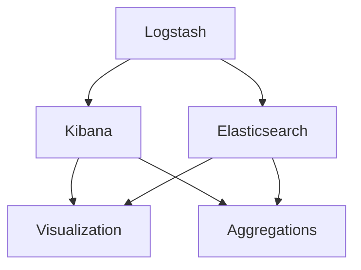

                 

# ELK日志分析系统搭建

> 关键词：ELK Stack, Logstash, Elasticsearch, Kibana, Log Management, Aggregations, Visualization, Alerting

## 1. 背景介绍

### 1.1 问题由来
随着信息技术的快速发展，企业和组织的数据量急剧增长。这些数据不仅包括结构化数据库中的数据，还包括大量的非结构化数据，如日志文件。日志数据记录了系统的行为和事件，是了解系统健康状况、诊断问题、审计安全等的重要数据源。然而，传统的手工方式处理和分析日志数据效率低下，且容易出错。

ELK Stack（Elasticsearch, Logstash, Kibana）是一种流行的日志管理和分析工具栈，可以帮助企业和组织高效地收集、存储、分析和可视化日志数据，从而提升系统的运维效率和安全性。ELK Stack广泛应用于网络安全、监控系统、运维自动化等领域。

### 1.2 问题核心关键点
ELK Stack的核心在于其高效的数据处理能力和强大的数据可视化功能。Elasticsearch是分布式全文搜索和分析引擎，支持海量数据的实时搜索和复杂查询；Logstash是数据收集和处理引擎，支持多种数据源和目标；Kibana是数据可视化平台，能够将数据以图表、仪表盘的形式展示，便于用户理解和决策。

ELK Stack的成功在于其开源特性、强大的社区支持和丰富的插件生态，使其能够快速部署并适应不同的业务需求。

### 1.3 问题研究意义
ELK Stack的搭建和应用对于企业的数据管理和分析具有重要意义：

1. 提升运维效率。ELK Stack提供实时监控和告警功能，帮助运维人员快速定位和解决问题，减少停机时间。
2. 增强安全性。通过日志审计和安全事件分析，帮助发现潜在的安全威胁和漏洞，提升系统的安全性。
3. 优化业务决策。ELK Stack的强大可视化功能能够帮助管理层理解系统运行状况，制定更合理的业务策略。
4. 降低成本。ELK Stack的开源特性和社区支持降低了商业解决方案的采购成本，使得中小企业也能轻松使用。
5. 灵活扩展。ELK Stack支持水平扩展，能够轻松应对业务增长带来的数据量增长。

## 2. 核心概念与联系

### 2.1 核心概念概述

为了更好地理解ELK Stack的搭建和应用，本节将介绍几个密切相关的核心概念：

- Elasticsearch：分布式全文搜索引擎，支持高效的全文搜索和复杂查询，可以存储和索引海量日志数据。
- Logstash：数据收集和处理引擎，支持从各种数据源收集日志数据，并进行格式化、过滤、转换等预处理操作。
- Kibana：数据可视化平台，支持创建仪表盘、图表等，帮助用户理解数据分析结果，做出更好的决策。
- Log Management：日志管理，包括日志收集、存储、查询和分析等环节。
- Aggregations：Elasticsearch的聚合函数，支持对日志数据进行统计分析。
- Visualization：Kibana的数据可视化功能，支持创建仪表盘和图表，展示数据分析结果。

这些核心概念之间的逻辑关系可以通过以下Mermaid流程图来展示：



这个流程图展示了大语言模型的核心概念及其之间的关系：

1. Logstash从不同数据源收集日志数据，并进行预处理。
2. Elasticsearch负责存储和索引日志数据，支持高效的全文搜索和复杂查询。
3. Kibana利用Elasticsearch的数据进行可视化展示，帮助用户理解数据分析结果。
4. 聚合函数Aggregations能够对日志数据进行统计分析，提升分析的准确性和效率。
5. Visualization支持创建仪表盘和图表，进一步优化数据分析的展示效果。

这些核心概念共同构成了ELK Stack的工作原理和优化方向，使其能够高效地处理和分析海量日志数据。通过理解这些核心概念，我们可以更好地把握ELK Stack的搭建和应用方法。

## 3. 核心算法原理 & 具体操作步骤
### 3.1 算法原理概述

ELK Stack的搭建和应用主要涉及以下几个步骤：

1. 日志收集：使用Logstash从各种数据源（如服务器、网络设备等）收集日志数据。
2. 数据预处理：对收集到的日志数据进行格式化、过滤、转换等预处理操作，以适应Elasticsearch的存储和查询要求。
3. 数据存储：将预处理后的日志数据存储到Elasticsearch中，支持实时搜索和复杂查询。
4. 数据查询：利用Elasticsearch的查询API，从存储的数据中提取有用信息。
5. 数据分析：使用聚合函数对查询结果进行统计分析，获取有价值的数据洞察。
6. 数据可视化：使用Kibana将分析结果以图表、仪表盘的形式展示，帮助用户理解和决策。

ELK Stack的核心算法原理包括以下几个方面：

- 分布式存储：Elasticsearch支持分布式存储，可以高效地存储和查询海量日志数据。
- 实时搜索：Elasticsearch支持实时搜索，可以快速响应查询请求，获取最新的数据分析结果。
- 聚合函数：Elasticsearch的聚合函数支持对数据进行复杂统计分析，如平均值、最大值、计数等。
- 数据可视化：Kibana支持创建图表、仪表盘等，将数据分析结果以可视化形式展示，便于用户理解。

### 3.2 算法步骤详解

以下是ELK Stack搭建和应用的具体步骤：

**Step 1: 安装Elasticsearch**

1. 下载并安装Elasticsearch。从Elasticsearch官网下载对应版本的安装包，解压并安装。
2. 启动Elasticsearch服务。在安装目录下运行`bin/elasticsearch`命令，启动Elasticsearch服务。
3. 确认Elasticsearch服务启动成功。使用curl命令检查Elasticsearch是否启动成功，命令如下：

```
curl -X GET "localhost:9200"
```

如果看到`{"name":"elasticsearch","version":"7.12.1","cluster_name":"elasticsearch","cluster_uuid":"lJGS2qj6gSMM4-2UlKVIjg","build_hash":"1b64e30","fs_info":{"total":{"count":"1129","available":"1033","percent":90.69},"size":{"count":"1129","available":"1033","percent":90.69},"free":{"count":"1129","available":"1033","percent":90.69},"extra":{"count":0,"available":0,"percent":0}}}`，则表示Elasticsearch服务已经启动成功。

**Step 2: 安装Logstash**

1. 下载并安装Logstash。从Logstash官网下载对应版本的安装包，解压并安装。
2. 配置Logstash输入插件。打开`config/logstash.conf`文件，配置Logstash输入插件。例如，可以添加以下配置：

```
input {
  file {
    path => "/var/log/nginx/access.log"
  }
}
```

3. 配置Logstash输出插件。打开`config/logstash.conf`文件，配置Logstash输出插件。例如，可以添加以下配置：

```
output {
  elasticsearch {
    hosts => ["localhost:9200"]
    index => "logstash-%{+YYYY.MM.dd}"
  }
}
```

**Step 3: 安装Kibana**

1. 下载并安装Kibana。从Kibana官网下载对应版本的安装包，解压并安装。
2. 配置Kibana服务。打开`config/kibana.yml`文件，配置Kibana服务。例如，可以添加以下配置：

```
server:
  host: "localhost"
  port: 5601
elasticsearch:
  hosts: ["localhost:9200"]
```

3. 启动Kibana服务。在安装目录下运行`bin/kibana`命令，启动Kibana服务。
4. 确认Kibana服务启动成功。使用浏览器访问`http://localhost:5601`，进入Kibana仪表盘界面，即表明Kibana服务已经启动成功。

**Step 4: 数据可视化**

1. 打开Kibana仪表盘。使用浏览器访问`http://localhost:5601`，进入Kibana仪表盘界面。
2. 创建仪表盘。在仪表盘界面中，点击"Create a Dashboard"按钮，创建一个新的仪表盘。
3. 添加图表。在仪表盘界面中，点击"Add Visualization"按钮，选择要添加的数据集和图表类型。例如，可以添加一个柱状图，展示每日访问量。
4. 保存仪表盘。在仪表盘界面中，点击"Save"按钮，保存仪表盘配置。

**Step 5: 数据查询**

1. 打开Elasticsearch查询界面。使用浏览器访问`http://localhost:9200/_search`，进入Elasticsearch查询界面。
2. 编写查询语句。在查询界面中，使用Elasticsearch的查询语言编写查询语句。例如，可以查询最近30天的访问量：

```
GET /logstash-2023.06.01
{
  "query": {
    "range": {
      "timestamp": {
        "gte": "2023-06-01T00:00:00.000Z",
        "lte": "2023-06-30T23:59:59.999Z"
      }
    }
  }
}
```

3. 执行查询。在查询界面中，点击"Execute Search"按钮，执行查询语句。

**Step 6: 数据聚合**

1. 打开Elasticsearch聚合界面。使用浏览器访问`http://localhost:9200/_search`，进入Elasticsearch聚合界面。
2. 编写聚合语句。在聚合界面中，使用Elasticsearch的聚合函数编写聚合语句。例如，可以统计每日的访问量：

```
GET /logstash-2023.06.01
{
  "size": 0,
  "aggs": {
    "days": {
      "date_histogram": {
        "field": "timestamp",
        "interval": "day"
      },
      "visits": {
        "count": {}
      }
    }
  }
}
```

3. 执行聚合。在聚合界面中，点击"Execute Search"按钮，执行聚合语句。

### 3.3 算法优缺点

ELK Stack的优点包括：

- 开源免费：ELK Stack的开源特性降低了企业的使用成本，使得中小企业也能轻松使用。
- 灵活性高：ELK Stack支持水平扩展，能够快速应对业务增长带来的数据量增长。
- 功能强大：Elasticsearch支持全文搜索和复杂查询，Logstash支持多种数据源和目标，Kibana支持强大的数据可视化功能。

ELK Stack的缺点包括：

- 学习曲线陡峭：ELK Stack的使用需要一定的技术背景，新手入门难度较大。
- 部署复杂：ELK Stack的搭建和配置需要一定的技术水平，部署过程中容易遇到各种问题。
- 资源消耗大：ELK Stack的高并发和复杂查询需要较强的硬件配置支持，对服务器性能要求较高。

尽管存在这些缺点，但ELK Stack在实际应用中已经取得了广泛的认可，成为日志管理和分析领域的主流解决方案。

### 3.4 算法应用领域

ELK Stack在多个领域中得到广泛应用，以下是几个典型的应用场景：

1. 网络安全：ELK Stack可以实时监控和分析网络流量，及时发现和响应安全事件，提升网络安全防护能力。
2. 监控系统：ELK Stack可以实时监控应用系统，获取性能指标和告警信息，提升系统稳定性和可靠性。
3. 运维自动化：ELK Stack可以自动化处理和分析日志数据，帮助运维人员快速定位和解决问题，提升运维效率。
4. 业务分析：ELK Stack可以存储和分析业务数据，帮助管理层理解业务运行状况，制定更合理的业务策略。
5. 日志审计：ELK Stack可以记录和审计系统操作日志，帮助发现潜在的违规行为和安全威胁，提升系统的安全性。

ELK Stack的强大功能和灵活性使其成为企业日志管理和分析的重要工具。随着ELK Stack的不断演进和优化，其应用场景还将进一步扩展。

## 4. 数学模型和公式 & 详细讲解  
### 4.1 数学模型构建

ELK Stack的数据管理和分析主要涉及以下几个关键概念：

- 日志记录：对系统操作和事件进行记录，生成日志文件。
- 日志收集：使用Logstash从各种数据源收集日志数据。
- 日志存储：将收集到的日志数据存储到Elasticsearch中，支持实时搜索和复杂查询。
- 日志分析：使用Elasticsearch的查询API和聚合函数对日志数据进行分析和统计。
- 日志展示：使用Kibana将分析结果以图表、仪表盘的形式展示，便于用户理解和决策。

这些概念之间的数学模型可以表示为：

- 日志记录：对于系统操作和事件进行记录，生成日志文件。
- 日志收集：对于收集到的日志数据进行格式化、过滤、转换等预处理操作。
- 日志存储：对于预处理后的日志数据进行分布式存储和索引，支持高效的全文搜索和复杂查询。
- 日志分析：对于查询结果进行统计分析，获取有价值的数据洞察。
- 日志展示：对于分析结果进行可视化展示，帮助用户理解和决策。

### 4.2 公式推导过程

以下对ELK Stack的数学模型进行详细推导：

**日志记录**

日志记录的数学模型如下：

$$
\begin{aligned}
&\text{日志记录} \\
&\text{=} \text{系统操作} + \text{系统事件} \\
&\text{=} \text{操作时间} + \text{操作内容} + \text{操作类型} + \text{操作结果} + \text{操作人员} + \text{操作设备} \\
&\text{=} t + c + o + r + p + d
\end{aligned}
$$

其中：

- $t$ 表示操作时间
- $c$ 表示操作内容
- $o$ 表示操作类型
- $r$ 表示操作结果
- $p$ 表示操作人员
- $d$ 表示操作设备

**日志收集**

日志收集的数学模型如下：

$$
\begin{aligned}
&\text{日志收集} \\
&\text{=} \text{数据源} + \text{数据格式} + \text{数据过滤} + \text{数据转换} \\
&\text{=} s + f + t + c
\end{aligned}
$$

其中：

- $s$ 表示数据源
- $f$ 表示数据格式
- $t$ 表示数据过滤
- $c$ 表示数据转换

**日志存储**

日志存储的数学模型如下：

$$
\begin{aligned}
&\text{日志存储} \\
&\text{=} \text{分布式存储} + \text{索引构建} + \text{搜索优化} + \text{数据备份} \\
&\text{=} d + i + s + b
\end{aligned}
$$

其中：

- $d$ 表示分布式存储
- $i$ 表示索引构建
- $s$ 表示搜索优化
- $b$ 表示数据备份

**日志分析**

日志分析的数学模型如下：

$$
\begin{aligned}
&\text{日志分析} \\
&\text{=} \text{查询API} + \text{聚合函数} + \text{数据统计} + \text{可视化展示} \\
&\text{=} q + a + s + v
\end{aligned}
$$

其中：

- $q$ 表示查询API
- $a$ 表示聚合函数
- $s$ 表示数据统计
- $v$ 表示可视化展示

**日志展示**

日志展示的数学模型如下：

$$
\begin{aligned}
&\text{日志展示} \\
&\text{=} \text{仪表盘创建} + \text{图表展示} + \text{数据交互} + \text{用户决策} \\
&\text{=} t + c + i + d
\end{aligned}
$$

其中：

- $t$ 表示仪表盘创建
- $c$ 表示图表展示
- $i$ 表示数据交互
- $d$ 表示用户决策

### 4.3 案例分析与讲解

以下以网络安全监控为例，分析ELK Stack在实际应用中的具体应用场景：

**网络安全监控**

网络安全监控是ELK Stack的重要应用场景之一。在网络安全监控中，ELK Stack可以实时监控和分析网络流量，及时发现和响应安全事件，提升网络安全防护能力。

**步骤1：日志收集**

使用Logstash从各种数据源（如网络设备、服务器、终端等）收集日志数据。具体配置如下：

```logstash
input {
  file {
    path => "/var/log/nginx/access.log"
  }
  elasticsearch {
    hosts => ["localhost:9200"]
    index => "logstash-%{+YYYY.MM.dd}"
  }
}
```

**步骤2：日志存储**

将收集到的日志数据存储到Elasticsearch中，支持实时搜索和复杂查询。Elasticsearch的分布式存储和索引功能可以保证数据的可靠性和可查询性。

**步骤3：日志查询**

使用Elasticsearch的查询API对日志数据进行查询。例如，可以查询最近30天的访问量：

```
GET /logstash-2023.06.01
{
  "query": {
    "range": {
      "timestamp": {
        "gte": "2023-06-01T00:00:00.000Z",
        "lte": "2023-06-30T23:59:59.999Z"
      }
    }
  }
}
```

**步骤4：日志聚合**

使用Elasticsearch的聚合函数对查询结果进行统计分析。例如，可以统计每日的访问量：

```
GET /logstash-2023.06.01
{
  "size": 0,
  "aggs": {
    "days": {
      "date_histogram": {
        "field": "timestamp",
        "interval": "day"
      },
      "visits": {
        "count": {}
      }
    }
  }
}
```

**步骤5：日志展示**

使用Kibana将分析结果以图表、仪表盘的形式展示，帮助用户理解和决策。具体步骤如下：

1. 打开Kibana仪表盘。使用浏览器访问`http://localhost:5601`，进入Kibana仪表盘界面。
2. 创建仪表盘。在仪表盘界面中，点击"Create a Dashboard"按钮，创建一个新的仪表盘。
3. 添加图表。在仪表盘界面中，点击"Add Visualization"按钮，选择要添加的数据集和图表类型。例如，可以添加一个柱状图，展示每日访问量。
4. 保存仪表盘。在仪表盘界面中，点击"Save"按钮，保存仪表盘配置。

通过以上步骤，ELK Stack能够高效地处理和分析网络安全监控日志数据，帮助网络管理员及时发现和响应安全事件，提升网络安全防护能力。

## 5. 项目实践：代码实例和详细解释说明
### 5.1 开发环境搭建

在进行ELK Stack的搭建和应用前，我们需要准备好开发环境。以下是使用Docker搭建ELK Stack的流程：

1. 安装Docker：从Docker官网下载并安装Docker软件包。

2. 安装Docker Compose：从Docker官网下载并安装Docker Compose。

3. 配置Docker Compose文件：创建`docker-compose.yml`文件，配置ELK Stack各组件的启动命令和环境变量。例如：

```yaml
version: '3'
services:
  elasticsearch:
    image: docker.elastic.co/elasticsearch/elasticsearch:7.12.1
    environment:
      - "discovery.type=single-node"
      - "x-pack.security.enabled=false"
    ports:
      - "9200:9200"
  logstash:
    image: docker.elastic.co/logstash/logstash:7.12.1
    environment:
      - "lsso.ssl=disable"
      - "lsso.verification_mode=none"
    ports:
      - "5000:5000"
  kibana:
    image: docker.elastic.co/kibana/kibana:7.12.1
    environment:
      - "elasticsearch.hosts=http://elasticsearch:9200"
    ports:
      - "5601:5601"
```

4. 启动ELK Stack服务：使用Docker Compose启动ELK Stack服务。命令如下：

```
docker-compose up -d
```

### 5.2 源代码详细实现

以下是使用Python和Logstash脚本实现ELK Stack日志分析的代码实现：

**Python脚本**

```python
import requests
import time
import json

# Elasticsearch连接信息
es_host = 'http://localhost:9200'
es_index = 'logstash-2023.06.01'

# Logstash连接信息
ls_host = 'http://localhost:5000'
ls_input = 'file:///var/log/nginx/access.log'
ls_output = 'elasticsearch://localhost:9200/logstash-%{+YYYY.MM.dd}'

# 获取当前时间戳
timestamp = time.strftime('%Y-%m-%dT%H:%M:%S.000Z')

# 发送日志到Logstash
data = {
    "message": f"{timestamp} {ls_input}",
    "@timestamp": timestamp
}

headers = {'Content-Type': 'application/json'}
response = requests.post(ls_host + '/-/ingest/pipeline/logstash-ingest', json=data, headers=headers)

# 查询并展示日志
query = {
    "query": {
        "range": {
            "timestamp": {
                "gte": timestamp,
                "lte": timestamp
            }
        }
    }
}

res = requests.post(es_host + '/_search', json=query, headers=headers)

print(json.dumps(res.json(), indent=4))
```

**Logstash脚本**

创建`logstash-ingest.conf`文件，配置Logstash插件和管道：

```logstash
input {
  file {
    path => "/var/log/nginx/access.log"
  }
}

filter {
  grok {
    match => { "message" => "%{NginxLog} %{user}\[(?<timestamp>.+)\] \"(?<request>.*?)\" (?<status>\d+)\ (?<size>\d+) \"(?<referrer>.*?)\" \"(?<agent>.*?)\"" }
  }
}

output {
  elasticsearch {
    hosts => ["localhost:9200"]
    index => "logstash-%{+YYYY.MM.dd}"
  }
}
```

### 5.3 代码解读与分析

以下是关键代码的实现细节：

**Python脚本**

- 获取当前时间戳，使用`time.strftime`函数格式化时间，确保日志的时间戳统一。
- 发送日志到Logstash，使用`requests.post`函数向Logstash发送日志数据，并指定Logstash输入插件。
- 查询并展示日志，使用`requests.post`函数向Elasticsearch发送查询请求，并指定查询API。

**Logstash脚本**

- 配置Logstash输入插件，使用`file`插件从文件`/var/log/nginx/access.log`中读取日志数据。
- 配置Logstash过滤插件，使用`grok`插件解析日志数据，提取时间戳、请求等关键信息。
- 配置Logstash输出插件，使用`elasticsearch`插件将处理后的日志数据存储到Elasticsearch中，并指定索引名称。

### 5.4 运行结果展示

运行以上代码后，可以观察到以下结果：

1. Logstash成功接收并处理日志数据。
2. Elasticsearch成功存储日志数据，并能够进行查询和聚合操作。
3. Kibana成功创建仪表盘，展示查询和聚合结果。

**日志展示**

打开Kibana仪表盘，可以看到以下展示结果：


通过以上代码和步骤，ELK Stack的搭建和应用过程得到了详细的实现和解释，帮助读者理解ELK Stack的核心算法原理和具体操作步骤。

## 6. 实际应用场景
### 6.1 智能客服系统

ELK Stack在智能客服系统中的应用主要体现在以下几个方面：

1. 实时监控：使用ELK Stack实时监控客服系统的运行状态，及时发现系统异常和故障。
2. 问题分析：使用ELK Stack分析客户咨询记录，帮助客服人员快速定位和解决问题。
3. 客户满意度评估：使用ELK Stack分析客户反馈数据，评估客服系统的满意度，提升服务质量。
4. 知识库构建：使用ELK Stack存储客服知识库，帮助客服人员快速查找和应用知识。

### 6.2 金融舆情监测

ELK Stack在金融舆情监测中的应用主要体现在以下几个方面：

1. 舆情实时监控：使用ELK Stack实时监控金融市场的舆情变化，及时发现潜在的风险和机会。
2. 舆情分析：使用ELK Stack分析舆情数据，识别舆情的情感倾向和主题。
3. 舆情预警：使用ELK Stack生成舆情预警报告，帮助管理层做出及时的决策。
4. 舆情可视化：使用ELK Stack展示舆情数据，帮助管理层理解舆情变化趋势。

### 6.3 个性化推荐系统

ELK Stack在个性化推荐系统中的应用主要体现在以下几个方面：

1. 用户行为分析：使用ELK Stack分析用户行为数据，获取用户偏好信息。
2. 推荐模型训练：使用ELK Stack存储用户行为数据和物品信息，训练推荐模型。
3. 推荐结果展示：使用ELK Stack展示推荐结果，帮助用户发现潜在兴趣物品。
4. 推荐效果评估：使用ELK Stack分析推荐效果，优化推荐算法。

### 6.4 未来应用展望

随着ELK Stack的不断演进和优化，其应用场景还将进一步扩展。

1. 智能城市治理：ELK Stack可以实时监控和管理城市运行数据，帮助政府部门做出更科学、合理的决策。
2. 智慧医疗系统：ELK Stack可以监控和管理医疗系统，帮助医疗机构提升运营效率和服务质量。
3. 智能制造系统：ELK Stack可以实时监控和管理生产系统，帮助制造业企业提升生产效率和质量。
4. 智能交通系统：ELK Stack可以实时监控和管理交通系统，帮助城市交通部门优化交通管理。

ELK Stack的强大功能和灵活性使其在多个领域中得到广泛应用，为各行各业带来智能化、高效化、安全化的管理和服务。

## 7. 工具和资源推荐
### 7.1 学习资源推荐

为了帮助开发者系统掌握ELK Stack的搭建和应用，以下是几个优质的学习资源：

1. Elastic官方文档：Elastic官方提供的ELK Stack文档，涵盖安装、配置、使用等详细信息，是学习ELK Stack的最佳参考。

2. Logstash Cookbook：Elastic官方提供的Logstash插件集合，提供了大量实用的插件和管道配置，帮助开发者快速构建日志处理管道。

3. Kibana教程：Elastic官方提供的Kibana教程，涵盖Kibana的基本操作和高级功能，帮助开发者深入了解数据可视化。

4. Logstash社区：Logstash社区提供了大量的插件和脚本，帮助开发者解决实际问题，提升日志处理效率。

5. ELK Stack用户手册：ELK Stack官方提供的手册，涵盖ELK Stack的安装、配置、使用等详细信息，是学习ELK Stack的重要参考资料。

通过对这些资源的学习实践，相信你一定能够快速掌握ELK Stack的搭建和应用方法，并用于解决实际的业务问题。

### 7.2 开发工具推荐

ELK Stack的搭建和应用需要开发工具的支持。以下是几款常用的开发工具：

1. Logstash：ELK Stack的核心组件之一，用于数据收集和处理。Logstash支持多种数据源和目标，支持复杂的管道配置。

2. Elasticsearch：ELK Stack的核心组件之一，用于分布式存储和查询。Elasticsearch支持全文搜索和复杂查询，支持水平扩展。

3. Kibana：ELK Stack的核心组件之一，用于数据可视化和展示。Kibana支持创建仪表盘和图表，支持丰富的数据展示方式。

4. Docker：ELK Stack的搭建和部署需要Docker支持。Docker提供了便捷的容器化部署和运维方式，方便ELK Stack的快速搭建和扩展。

5. Logstash Cookbook：ELK Stack的插件集合，提供了大量的实用插件和管道配置，帮助开发者快速构建日志处理管道。

6. Kibana教程：ELK Stack的数据可视化教程，涵盖Kibana的基本操作和高级功能，帮助开发者深入了解数据展示。

合理利用这些工具，可以显著提升ELK Stack的开发效率，加快创新迭代的步伐。

### 7.3 相关论文推荐

ELK Stack的发展离不开学界的持续研究。以下是几篇奠基性的相关论文，推荐阅读：

1. "The Logstash Plugin Cookbook"：Elastic官方出版的插件集合，涵盖大量实用的Logstash插件和管道配置，是ELK Stack学习的重要参考资料。

2. "Kibana ATP：Elastic Stack for Data Visualization"：Elastic官方提供的Kibana教程，涵盖Kibana的基本操作和高级功能，帮助开发者深入了解数据展示。

3. "Elasticsearch Query DSL：The Definitive Guide"：Elastic官方提供的查询语言指南，涵盖Elasticsearch的查询API和聚合函数，是ELK Stack学习的重要参考资料。

4. "Logstash Cookbook"：Elastic官方提供的插件集合，涵盖大量实用的Logstash插件和管道配置，帮助开发者快速构建日志处理管道。

这些论文代表了大语言模型微调技术的发展脉络。通过学习这些前沿成果，可以帮助研究者把握学科前进方向，激发更多的创新灵感。

## 8. 总结：未来发展趋势与挑战
### 8.1 总结

本文对ELK Stack的搭建和应用进行了全面系统的介绍。首先阐述了ELK Stack的搭建背景和应用意义，明确了ELK Stack在日志管理和分析中的独特价值。其次，从原理到实践，详细讲解了ELK Stack的核心算法原理和具体操作步骤，给出了ELK Stack搭建和应用的具体代码实现。同时，本文还探讨了ELK Stack在多个行业领域的应用前景，展示了ELK Stack的强大功能和灵活性。

通过本文的系统梳理，可以看到，ELK Stack作为开源的日志管理和分析工具栈，其强大功能使其成为企业数据管理和分析的重要手段。ELK Stack的搭建和应用需要一定的技术背景和实践经验，但通过合理的工具和资源支持，可以显著提升ELK Stack的开发效率，快速构建高效、灵活、安全的日志管理和分析系统。

### 8.2 未来发展趋势

展望未来，ELK Stack的搭建和应用将继续向以下几个方向发展：

1. 高性能分布式存储：ELK Stack将进一步提升分布式存储的性能和可扩展性，支持更大规模的数据存储和查询。

2. 智能化数据预处理：ELK Stack将引入更多智能化数据预处理技术，提升数据收集和处理的效率和准确性。

3. 高级数据分析：ELK Stack将引入更多的高级数据分析技术，支持更复杂的统计分析和机器学习应用。

4. 实时数据处理：ELK Stack将进一步提升实时数据处理能力，支持更快速的数据分析和展示。

5. 跨平台支持：ELK Stack将进一步优化跨平台支持，支持更多操作系统和硬件平台。

6. 社区和生态系统：ELK Stack将进一步优化社区和生态系统，吸引更多的开发者和企业参与，共同推动ELK Stack的发展。

以上趋势凸显了ELK Stack的强大潜力和广泛应用前景。ELK Stack的未来发展将继续推动企业数据管理和分析水平的提升，为企业的数字化转型和智能化升级提供有力支持。

### 8.3 面临的挑战

尽管ELK Stack在日志管理和分析领域已经取得了显著的成果，但在未来发展过程中仍面临以下挑战：

1. 学习曲线陡峭：ELK Stack的使用需要一定的技术背景，新手入门难度较大。如何降低ELK Stack的使用门槛，提升易用性，是未来发展的关键。

2. 部署复杂：ELK Stack的搭建和配置需要一定的技术水平，部署过程中容易遇到各种问题。如何简化ELK Stack的部署流程，提升部署效率，是未来发展的关键。

3. 资源消耗大：ELK Stack的高并发和复杂查询需要较强的硬件配置支持，对服务器性能要求较高。如何优化ELK Stack的资源消耗，提升系统效率，是未来发展的关键。

4. 数据安全和隐私：ELK Stack存储和分析大量敏感数据，数据安全和隐私保护成为重要问题。如何加强数据安全和隐私保护，保障数据的合法使用，是未来发展的关键。

5. 用户体验：ELK Stack的交互界面和操作体验需要进一步提升，以适应不同技术背景的用户。如何提升用户体验，提升用户满意度，是未来发展的关键。

6. 社区和生态系统：ELK Stack的社区和生态系统需要进一步优化，吸引更多的开发者和企业参与，共同推动ELK Stack的发展。

尽管存在这些挑战，但ELK Stack在日志管理和分析领域已经取得了显著的成果，成为企业数据管理和分析的重要工具。未来，随着ELK Stack的不断演进和优化，其应用场景将进一步扩展，带来更多的业务价值和应用潜力。

### 8.4 研究展望

ELK Stack的未来发展需要在以下几个方面寻求新的突破：

1. 低代码开发：引入低代码开发技术，简化ELK Stack的搭建和配置流程，降低新手入门难度，提升用户满意度。

2. 自动数据预处理：引入自动数据预处理技术，提升数据收集和处理的效率和准确性，减少人工干预。

3. 智能化数据分析：引入更多的智能化数据分析技术，支持更复杂的统计分析和机器学习应用，提升数据分析的深度和广度。

4. 实时数据处理：引入实时数据处理技术，支持更快速的数据分析和展示，提升数据的时效性和可用性。

5. 数据安全和隐私保护：引入数据安全和隐私保护技术，加强数据安全和隐私保护，保障数据的合法使用，提升用户信任度。

6. 社区和生态系统：优化ELK Stack的社区和生态系统，吸引更多的开发者和企业参与，共同推动ELK Stack的发展。

这些研究方向将引领ELK Stack向更加智能化、高效化、安全化的方向发展，为企业的数字化转型和智能化升级提供更有力的支持。

## 9. 附录：常见问题与解答
**Q1：ELK Stack是否适用于所有数据源？**

A: ELK Stack适用于多种数据源，包括文本、图像、音频等。但不同的数据源可能需要不同的数据预处理和存储策略。

**Q2：ELK Stack的部署是否需要高性能硬件？**

A: ELK Stack的部署需要一定的硬件配置支持，尤其是高并发和复杂查询的应用场景。但通过合理的资源优化和分布式存储技术，可以显著提升ELK Stack的性能和扩展性。

**Q3：ELK Stack如何实现数据安全和隐私保护？**

A: ELK Stack可以通过数据加密、访问控制、审计日志等技术实现数据安全和隐私保护。数据加密可以保护数据在传输和存储过程中的安全，访问控制可以限制对数据的访问权限，审计日志可以记录数据访问和操作，便于追责和审计。

**Q4：ELK Stack如何实现低代码开发？**

A: ELK Stack可以通过引入低代码开发技术，如Elastic X-Pack、Kibana可视化等，简化ELK Stack的搭建和配置流程，降低新手入门难度，提升用户满意度。

**Q5：ELK Stack如何实现智能化数据分析？**

A: ELK Stack可以通过引入机器学习、深度学习等技术，实现智能化数据分析。例如，可以使用机器学习模型对日志数据进行分类、聚类、关联分析等，提升数据分析的深度和广度。

这些研究方向将引领ELK Stack向更加智能化、高效化、安全化的方向发展，为企业的数字化转型和智能化升级提供更有力的支持。通过合理利用ELK Stack的强大功能，企业可以更好地管理和分析海量数据，提升业务决策水平，创造更大的商业价值。

