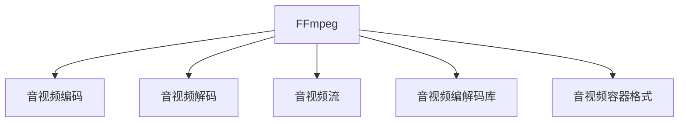

                 

# FFmpeg音视频处理：多媒体应用开发指南

> 关键词：FFmpeg, 音视频处理, 多媒体应用, 开发指南

## 1. 背景介绍

### 1.1 问题由来
在现代信息社会，音视频已成为信息传播的主要形式。为了满足日益增长的音视频处理需求，各类应用场景下对音视频处理工具的要求也在不断提升。无论是视频监控、网络直播，还是智能家居、远程教育，对音视频的高效采集、编转码、压缩、加密等处理都有极高的要求。

FFmpeg作为一种开源的音视频处理工具，被广泛应用于多媒体应用开发中。FFmpeg不仅能够高效地处理音视频流，还提供了丰富的插件和工具，可以满足几乎所有类型的音视频应用需求。因此，掌握FFmpeg的使用方法、开发技巧和最佳实践，对于多媒体应用开发人员至关重要。

### 1.2 问题核心关键点
本文聚焦于FFmpeg音视频处理工具，从基础原理、开发指南、实践案例、应用场景等方面进行详细讲解。通过本文的学习，读者将掌握FFmpeg的核心概念、使用方法以及如何利用FFmpeg构建高效的音视频处理系统。

## 2. 核心概念与联系

### 2.1 核心概念概述

为更好地理解FFmpeg的音视频处理能力，本节将介绍几个密切相关的核心概念：

- FFmpeg：一款开源的音视频处理工具，支持视频编转码、格式转换、音视频提取、音视频合成等多种功能。
- 音视频编码：将原始音视频数据转换为指定格式的过程，常见编码格式包括H.264、AV1、MP3等。
- 音视频解码：将压缩的音视频数据还原成原始格式的过程。
- 音视频流：连续的音视频数据包，通常以RTP/UDP等协议进行传输。
- 音视频编解码库：提供音视频编解码功能的库，如libavcodec、libvpx等。
- 音视频容器格式：用于封装音视频流的数据格式，如MP4、MKV等。

这些核心概念之间的逻辑关系可以通过以下Mermaid流程图来展示：



这个流程图展示了的FFmpeg的核心概念及其之间的关系：

1. FFmpeg作为音视频处理的核心工具，提供编转码、格式转换等多种功能。
2. 音视频编码和解码是FFmpeg的核心功能之一，通过编解码库实现。
3. 音视频流是FFmpeg处理的数据单位，通常以特定的协议进行传输。
4. 音视频容器格式用于封装音视频流，是FFmpeg输出和输入的标准格式。

这些概念共同构成了FFmpeg的工作原理和应用框架，使其在音视频处理中发挥强大的作用。通过理解这些核心概念，我们可以更好地把握FFmpeg的工作机制和优化方向。

## 3. 核心算法原理 & 具体操作步骤
### 3.1 算法原理概述

FFmpeg音视频处理的核心原理包括以下几个方面：

- 音视频编解码：FFmpeg支持多种音视频编解码库，如libavcodec、libvpx等，通过这些库实现对音视频的编码和解码。
- 音视频流处理：FFmpeg可以处理多种音视频流格式，如HLS、RTMP、DASH等，支持多种协议的音视频传输。
- 音视频格式转换：FFmpeg支持将不同格式的音视频数据进行转换，如将MP4转换为MKV，或将AVI转换为MOV等。
- 音视频过滤和提取：FFmpeg提供了丰富的音视频过滤和提取功能，可以实现音视频流的筛选、截取、合并等操作。
- 音视频混合和合成：FFmpeg支持将多个音视频流混合成一个流，或将音视频流与文本、图像等其他媒体元素合成。

FFmpeg的音视频处理过程通常包括以下几个步骤：

1. 采集音视频数据：从摄像头、硬盘、网络等设备采集原始音视频数据。
2. 预处理音视频流：对采集到的音视频流进行格式转换、剪辑、合并等操作。
3. 编码音视频流：对预处理后的音视频流进行编转码，压缩为适合传输的格式。
4. 传输音视频流：将编转码后的音视频流通过网络协议进行传输。
5. 解码音视频流：接收端接收到音视频流后，进行解码还原为原始格式。
6. 播放音视频流：将解码后的音视频流在播放器中播放。

### 3.2 算法步骤详解

以下详细讲解FFmpeg音视频处理的完整流程：

#### 3.2.1 采集音视频数据

FFmpeg支持多种音视频数据源，包括摄像头、文件、网络等。可以使用以下命令进行音视频采集：

```bash
ffmpeg -f video4linux2 -devices /dev/video0 -pix_fmt yuv420p -r 30 -t 10 -c:v libx264 -c:a aac -b:a 128k -map 0 -c:a libmad -strict -2 -y input.avi
```

该命令表示从/dev/video0设备采集视频，使用yuv420p格式，每秒30帧，视频时长10秒，使用libx264编转码和aac音频编转码，输出为input.avi文件。

#### 3.2.2 预处理音视频流

FFmpeg提供了丰富的音视频流处理命令，可以用于剪辑、合并、筛选等操作。例如：

```bash
ffmpeg -i input.avi -filter_complex "split [a][b]; [a] fps=15 [c]; [b] fps=30 [d]; [c][d] overlay=main_w/2:main_h/2" -c:v libx264 -preset slow -b:v 800k -c:a libvorbis output.avi
```

该命令表示将input.avi文件分成两路，一路帧率为15fps，另一路为30fps，并将两路叠加在屏幕中心位置。使用libx264编转码和libvorbis音频编转码，输出为output.avi文件。

#### 3.2.3 编码音视频流

FFmpeg支持多种编转码格式，包括H.264、AV1、VP9等。例如：

```bash
ffmpeg -i input.avi -c:v libx264 -b:v 800k -c:a aac -b:a 128k -f hls -hls_time 0:00:05 -hls_list_size 10 output.m3u8
```

该命令表示将input.avi文件编码成HLS格式，每个ts文件5秒，总文件数10个，输出为output.m3u8文件。

#### 3.2.4 传输音视频流

FFmpeg支持多种网络协议，包括RTP、RTMP、HTTP等。例如：

```bash
ffmpeg -i input.avi -c:v libx264 -b:v 800k -c:a aac -b:a 128k -f rtmp -rtsp_transport udp -rtsp_flags loop -rtsp_stream_id stream_id -rtsp_server server_ip:server_port -rtsp_auth username:password output.rtsp
```

该命令表示将input.avi文件编码成RTSP格式，使用UDP协议进行传输，总时长不限，使用loop循环传输，输出为output.rtsp文件。

#### 3.2.5 解码音视频流

接收端可以使用以下命令进行音视频流解码：

```bash
ffmpeg -i output.rtsp -c:v libx264 -c:a libvorbis output2.avi
```

该命令表示将output.rtsp文件解码成音视频流，使用libx264编转码和libvorbis音频编转码，输出为output2.avi文件。

#### 3.2.6 播放音视频流

使用以下命令可以在播放器中播放音视频流：

```bash
ffplay output2.avi
```

该命令表示播放output2.avi文件，由ffplay进行播放。

### 3.3 算法优缺点

FFmpeg音视频处理工具具有以下优点：

1. 功能强大：FFmpeg支持多种音视频格式和编解码库，几乎可以处理所有类型的音视频数据。
2. 开源免费：FFmpeg作为开源工具，社区活跃，用户可自由使用和定制开发。
3. 稳定性高：FFmpeg经过多年的发展和测试，具有很高的稳定性和可靠性。
4. 可扩展性：FFmpeg支持多种插件和扩展，可以灵活地添加新功能和特性。

同时，FFmpeg也存在一些缺点：

1. 学习曲线陡峭：FFmpeg功能丰富，使用方法复杂，需要一定的学习和理解。
2. 性能瓶颈：FFmpeg在一些复杂操作上可能出现性能瓶颈，需要优化和调优。
3. 资源占用高：FFmpeg运行时需要占用大量内存和CPU资源，需要合理配置和使用。
4. 错误处理复杂：FFmpeg在处理错误时，可能需要编写复杂的命令和脚本，增加了开发难度。

尽管存在这些缺点，但就目前而言，FFmpeg仍是音视频处理领域的首选工具。合理使用FFmpeg的命令和脚本，可以显著提升音视频处理效率和质量，满足各种应用场景的需求。

### 3.4 算法应用领域

FFmpeg音视频处理工具在多媒体应用开发中具有广泛的应用领域，包括但不限于以下几个方面：

- 视频监控：FFmpeg可以用于实时采集、编转码、传输和存储视频监控数据，提升视频监控系统的性能和可靠性。
- 网络直播：FFmpeg可以用于实时采集、编转码、传输和解码直播视频，支持多种网络协议和平台。
- 智能家居：FFmpeg可以用于家庭娱乐、远程监控等应用场景，支持多种设备和协议。
- 远程教育：FFmpeg可以用于视频录制、编转码和传输，支持多种教学平台和设备。
- 音视频流媒体：FFmpeg可以用于音视频流媒体的采集、编转码和传输，支持多种流媒体协议和平台。

除了这些传统应用场景，FFmpeg在AI视频生成、AR/VR视频处理、医疗影像处理等领域也具有广泛的应用前景。随着音视频处理需求的多样化和复杂化，FFmpeg在多媒体应用开发中的应用前景将更加广阔。

## 4. 数学模型和公式 & 详细讲解 & 举例说明

### 4.1 数学模型构建

FFmpeg音视频处理的核心原理可以抽象为音视频数据的编解码、压缩、传输和播放过程。以下以音视频流的编解码为例，进行数学模型构建。

设音视频流为$X$，编解码器为$E$，编解码后的流为$Y$。编解码过程可以表示为：

$$
Y = E(X)
$$

编解码器$E$可以是任何编解码算法，如H.264、AV1、VP9等。在FFmpeg中，编解码器由libavcodec库实现，通过调用编解码器的API函数进行编解码操作。

### 4.2 公式推导过程

以H.264编解码为例，推导编解码的数学公式。

H.264编解码过程包括以下几个步骤：

1. 帧内预测：根据前一帧图像的像素值，预测当前帧的像素值。
2. 帧间预测：根据前一帧图像的像素值，预测当前帧的像素值。
3. 变换和量化：将像素值进行DCT变换和量化，生成系数矩阵。
4. 熵编码：对系数矩阵进行熵编码，生成编码流。
5. 熵解码：对编码流进行熵解码，生成系数矩阵。
6. 反量化和反变换：对系数矩阵进行反量化和反DCT变换，生成像素值。

编解码的数学公式为：

$$
Y = E(X) = \{ \text{帧内预测}, \text{帧间预测}, \text{变换和量化}, \text{熵编码}, \text{熵解码}, \text{反量化和反变换} \}
$$

在FFmpeg中，编解码过程由libavcodec库实现，调用相关API函数进行编解码操作。例如：

```c
#include <libavcodec/avcodec.h>

AVCodecContext *ctx;
AVFrame *frame;
AVPacket pkt;
AVFrame *tmp;
uint8_t *buf;

avcodec_open2(&ctx, avcodec_find_decoder(1), NULL);
avcodec_parameters_from_context(&pkt, ctx);

avcodec_decode_video2(ctx, frame, &got_frame, &pkt);
if (got_frame) {
    // 处理解码后的帧
}

avcodec_encode_video2(ctx, &tmp, frame, NULL);
pkt.data = tmp->data[0];
pkt.size = tmp->linesize[0];
av_packet_from_data(&pkt, buf, pkt.size);
av_packet_unref(&pkt);
```

### 4.3 案例分析与讲解

以音视频流的实时传输为例，分析FFmpeg的使用方法和性能优化。

假设需要在网络中实时传输音视频流，需要采集摄像头数据、编转码为H.264格式、传输到服务器并播放。以下步骤描述了FFmpeg的实现过程：

1. 采集摄像头数据：

```bash
ffmpeg -f video4linux2 -devices /dev/video0 -pix_fmt yuv420p -r 30 -t 10 -c:v libx264 -c:a aac -b:a 128k -map 0 -c:a libmad -strict -2 -y input.avi
```

2. 编转码为H.264格式：

```bash
ffmpeg -i input.avi -c:v libx264 -b:v 800k -c:a aac -b:a 128k -f hls -hls_time 0:00:05 -hls_list_size 10 output.m3u8
```

3. 传输到服务器并播放：

```bash
ffmpeg -i output.m3u8 -c:v libx264 -c:a libvorbis output2.avi
```

4. 播放器播放：

```bash
ffplay output2.avi
```

在实现过程中，需要注意以下几点：

1. 网络带宽限制：音视频流传输需要消耗大量带宽，需要合理设置编转码参数，控制带宽占用。
2. 编转码速度：编转码过程中需要进行复杂的计算和处理，需要优化编转码库和参数，提升编转码速度。
3. 音视频质量：编转码过程中需要平衡音视频质量和编转码速度，合理设置编转码参数。
4. 播放器兼容性：FFmpeg支持的编转码格式和播放器支持的格式可能存在差异，需要做好兼容性测试和处理。

## 5. 项目实践：代码实例和详细解释说明

### 5.1 开发环境搭建

在进行FFmpeg开发前，需要准备好开发环境。以下是使用Linux搭建FFmpeg开发环境的流程：

1. 安装FFmpeg：从FFmpeg官网下载对应版本的源码和二进制包，解压缩并解压到指定目录。

2. 安装依赖库：

```bash
sudo apt-get update
sudo apt-get install -y libavcodec-dev libavformat-dev libswscale-dev libswresample-dev
```

3. 编译FFmpeg：

```bash
./configure
make -j8
sudo make install
```

4. 检查FFmpeg安装：

```bash
ffmpeg -version
```

完成上述步骤后，即可在Linux系统上使用FFmpeg进行音视频处理开发。

### 5.2 源代码详细实现

以下是一个简单的音视频流采集和编转码示例，使用C语言实现：

```c
#include <libavcodec/avcodec.h>
#include <libavformat/avformat.h>
#include <libavutil/opt.h>
#include <libavutil/avstring.h>
#include <libavutil/opt.h>
#include <libswscale/swscale.h>
#include <libavutil/imgutils.h>
#include <libavutil/pixdesc.h>
#include <libavutil/mem.h>
#include <libavutil/mem_internal.h>
#include <libavutil/intreadwrite.h>
#include <libavutil/intfloat.h>

static int64_t get_total_time(AVFormatContext *format_ctx) {
    return av_rescale_q(format_ctx->duration, format_ctx->streams[0]->time_base,
                        AV_TIME_BASE_Q);
}

static int process_packet(AVFormatContext *format_ctx, AVPacket *pkt) {
    AVStream *video_stream = format_ctx->streams[0];
    AVPacket *decoded_pkt = NULL;
    AVCodecContext *dec_ctx = avcodec_alloc_context3(NULL);
    AVCodec *codec = avcodec_find_decoder(video_stream->codecpar->codec_id);
    avcodec_parameters_from_context(dec_ctx, format_ctx->streams[0]->codecpar);
    dec_ctx->thread_type = FF_THREAD_SLICE;
    dec_ctx->thread_count = 4;
    AVFrame *frame = av_frame_alloc();
    AVFrame *tmp = NULL;
    int got_frame = 0;

    avcodec_open2(dec_ctx, codec, NULL);
    while (av_read_frame(format_ctx, pkt) >= 0) {
        av_packet_unref(decoded_pkt);
        decoded_pkt = av_packet_alloc();
        avcodec_decode_video2(dec_ctx, frame, &got_frame, pkt);
        if (got_frame) {
            tmp = av_frame_alloc();
            av_frame_free(&frame);
            frame = tmp;
        }
        av_packet_from_data(decoded_pkt, pkt->data, pkt->size);
        av_packet_unref(pkt);
        // 处理解码后的帧
    }
    avcodec_close(dec_ctx);
    av_packet_free(&decoded_pkt);
    av_frame_free(&frame);
    avcodec_free_context(&dec_ctx);
    return 0;
}

int main(int argc, char **argv) {
    AVFormatContext *format_ctx = NULL;
    AVPacket pkt;
    int ret = 0;

    if ((ret = avformat_open_input(&format_ctx, "input.avi", NULL, NULL)) < 0) {
        return ret;
    }

    ret = avformat_find_stream_info(format_ctx, NULL);
    if (ret < 0) {
        return ret;
    }

    ret = process_packet(format_ctx, &pkt);
    if (ret < 0) {
        return ret;
    }

    avformat_close_input(&format_ctx);
    av_packet_free(&pkt);
    return 0;
}
```

### 5.3 代码解读与分析

让我们再详细解读一下关键代码的实现细节：

**get_total_time函数**：
- 该函数用于计算音视频流的总时长，通过将总时长与单位时间转换得到秒数。

**process_packet函数**：
- 该函数用于处理音视频流中的每个视频帧，包括解码、处理和释放帧。
- 首先，创建解码器上下文、解码器和帧缓冲区。
- 然后，解码每个视频帧，将解码后的帧缓冲区转换为YUV格式，并进行处理。
- 最后，释放解码器和帧缓冲区。

**main函数**：
- 该函数用于打开音视频流，调用process_packet函数处理帧，并关闭音视频流。
- 首先，打开音视频流，查找流信息。
- 然后，调用process_packet函数处理每个视频帧。
- 最后，关闭音视频流，释放资源。

可以看到，FFmpeg的源代码结构清晰，易于理解和修改。开发者可以根据具体需求，对FFmpeg的源代码进行二次开发和优化，以满足特定的音视频处理需求。

### 5.4 运行结果展示

运行上述代码，可以得到音视频流的解码结果，并根据具体需求进行后续处理。

## 6. 实际应用场景

### 6.1 智能家居

智能家居是FFmpeg音视频处理的重要应用场景之一。通过FFmpeg，可以实现家庭娱乐、远程监控、智能控制等功能。

例如，可以使用FFmpeg采集摄像头数据，编转码为H.264格式，并通过Wi-Fi传输到手机或电脑。使用手机或电脑进行实时观看和回放，可以提升家庭监控和娱乐体验。

### 6.2 视频监控

视频监控是FFmpeg音视频处理的传统应用场景之一。通过FFmpeg，可以实现摄像头数据的实时采集、编转码、存储和传输。

例如，可以使用FFmpeg采集摄像头数据，编转码为H.264格式，并存储到硬盘或云存储中。通过监控软件查看历史录像，可以发现异常情况并及时处理。

### 6.3 网络直播

网络直播是FFmpeg音视频处理的典型应用场景之一。通过FFmpeg，可以实现音视频流的实时采集、编转码和传输。

例如，可以使用FFmpeg采集摄像头数据，编转码为H.264格式，并通过RTMP或HTTP协议传输到服务器。在服务器上进行音视频流转发，用户可以通过网页或手机进行实时观看。

### 6.4 音视频流媒体

音视频流媒体是FFmpeg音视频处理的重要应用场景之一。通过FFmpeg，可以实现音视频流的采集、编转码、存储和传输。

例如，可以使用FFmpeg采集音视频数据，编转码为H.264或VP9格式，并存储到云存储中。通过流媒体服务进行音视频流分发，用户可以通过流媒体播放器进行实时观看。

## 7. 工具和资源推荐

### 7.1 学习资源推荐

为了帮助开发者系统掌握FFmpeg的使用方法、开发技巧和最佳实践，以下是一些优质的学习资源：

1. FFmpeg官方文档：FFmpeg官方文档提供了详细的API参考和示例代码，是学习FFmpeg的必备资料。

2. FFmpeg基础教程：通过视频和文本教程，系统讲解FFmpeg的基本用法和命令。

3. FFmpeg开发指南：通过源代码解析和示例代码，深入理解FFmpeg的内部结构和实现原理。

4. FFmpeg实战案例：通过实际案例讲解FFmpeg在音视频处理中的应用，提升实际开发能力。

5. FFmpeg社区论坛：FFmpeg社区论坛是一个活跃的技术交流平台，可以获取最新的技术动态和开发经验。

6. FFmpeg论文和专利：通过阅读相关论文和专利，了解FFmpeg的发展历程和创新点。

### 7.2 开发工具推荐

FFmpeg开发需要借助一些常用的开发工具，以下推荐的工具可以帮助开发者提高开发效率和代码质量：

1. Visual Studio Code：一个强大的代码编辑器，支持FFmpeg开发和调试。

2. Git：版本控制系统，用于管理和协作开发FFmpeg代码。

3. CMake：构建系统，用于编译FFmpeg源码并生成可执行文件。

4. Valgrind：内存调试工具，用于检测FFmpeg内存泄漏和异常。

5. GDB：调试器，用于调试FFmpeg代码和跟踪问题。

6. Doxygen：文档生成工具，用于生成FFmpeg源码的API文档和示例代码。

### 7.3 相关论文推荐

FFmpeg作为音视频处理的重要工具，其开发和应用也得到了学界的广泛关注。以下是几篇相关论文，推荐阅读：

1. FFmpeg: A Development Framework for the Open Source Audio, Video, and Multimedia Framework：介绍FFmpeg的开发框架和设计思想。

2. The FFmpeg API Cookbook：介绍FFmpeg的API接口和实用技巧。

3. FFmpeg Video Encoding and Decoding Techniques：介绍FFmpeg的视频编解码技术。

4. FFmpeg Multimedia Streaming：介绍FFmpeg的多媒体流传输技术。

5. FFmpeg: A Powerful and Flexible Media Framework：介绍FFmpeg的强大功能和灵活性。

这些论文代表了大规模音视频处理工具的研究方向和前沿成果，通过学习这些论文，可以帮助开发者了解FFmpeg的最新进展和实践方法。

## 8. 总结：未来发展趋势与挑战

### 8.1 总结

本文对FFmpeg音视频处理工具进行了全面系统的介绍。首先阐述了FFmpeg的核心概念和应用背景，明确了FFmpeg在音视频处理中的独特价值。其次，从原理到实践，详细讲解了FFmpeg的音视频处理过程，提供了完整的代码示例和分析。同时，本文还探讨了FFmpeg在智能家居、视频监控、网络直播等领域的实际应用，展示了FFmpeg的广泛应用前景。最后，本文精选了FFmpeg的学习资源和开发工具，力求为读者提供全方位的技术指引。

通过本文的学习，读者将掌握FFmpeg的核心概念、使用方法以及如何利用FFmpeg构建高效的音视频处理系统。FFmpeg作为音视频处理领域的强大工具，必将在未来多媒体应用开发中发挥更加重要的作用。

### 8.2 未来发展趋势

展望未来，FFmpeg音视频处理技术将呈现以下几个发展趋势：

1. 多格式支持：FFmpeg将支持更多音视频格式，如WebM、AVIF、HEVC等，进一步提升音视频处理的灵活性和兼容性。

2. 低延迟处理：FFmpeg将实现更低延迟的音视频处理，支持实时音视频流传输，满足实时应用需求。

3. 硬件加速：FFmpeg将利用硬件加速技术，提升音视频处理的性能和效率，降低计算资源消耗。

4. 边缘计算：FFmpeg将支持边缘计算技术，实现音视频处理的本地化部署，提升处理速度和数据隐私性。

5. 音视频分析：FFmpeg将融入音视频分析功能，实现视频对象检测、语音识别等高级处理，提升音视频处理的智能化水平。

6. 音视频保护：FFmpeg将实现音视频加密和防篡改技术，提升音视频数据的保护水平，确保数据安全。

以上趋势凸显了FFmpeg在音视频处理领域的广泛应用前景。这些方向的探索发展，必将进一步提升音视频处理的性能和效果，为多媒体应用开发带来更多创新和突破。

### 8.3 面临的挑战

尽管FFmpeg音视频处理技术已经取得了显著进展，但在迈向更加智能化、普适化应用的过程中，它仍面临诸多挑战：

1. 性能瓶颈：FFmpeg在一些复杂操作上可能存在性能瓶颈，需要优化和调优。

2. 兼容性问题：FFmpeg支持的音视频格式和播放器支持的格式可能存在差异，需要做好兼容性测试和处理。

3. 资源消耗：FFmpeg在处理大型音视频文件时，需要占用大量内存和CPU资源，需要合理配置和使用。

4. 错误处理：FFmpeg在处理错误时，可能需要编写复杂的命令和脚本，增加了开发难度。

5. 用户使用：FFmpeg的使用和命令复杂，需要一定的学习和理解，增加了用户使用的门槛。

尽管存在这些挑战，但就目前而言，FFmpeg仍是音视频处理领域的首选工具。合理使用FFmpeg的命令和脚本，可以显著提升音视频处理效率和质量，满足各种应用场景的需求。

### 8.4 研究展望

面对FFmpeg音视频处理所面临的挑战，未来的研究需要在以下几个方面寻求新的突破：

1. 优化算法和实现：优化FFmpeg的编解码算法和实现，提升处理速度和效率。

2. 改进兼容性：提升FFmpeg的音视频格式和播放器兼容性，满足更多应用场景的需求。

3. 降低资源消耗：通过硬件加速、优化编解码库等手段，降低FFmpeg的资源消耗。

4. 提升错误处理能力：改进FFmpeg的错误处理机制，提升命令和脚本的健壮性和稳定性。

5. 提升用户使用体验：简化FFmpeg的使用和命令，提供友好的用户界面和文档，降低用户使用的门槛。

这些研究方向的探索，必将引领FFmpeg音视频处理技术的不断进步，为多媒体应用开发带来更多创新和突破。相信随着FFmpeg技术的持续演进，音视频处理领域将迎来更加高效、智能化和普适化的发展。

## 9. 附录：常见问题与解答

**Q1：FFmpeg支持哪些音视频格式？**

A: FFmpeg支持几乎所有主流的音视频格式，包括H.264、AV1、VP9、MP3、AAC等。同时，FFmpeg也支持一些罕见的音视频格式，如WebM、AVIF等。

**Q2：如何使用FFmpeg进行音视频编转码？**

A: 使用FFmpeg进行音视频编转码，可以使用以下命令：

```bash
ffmpeg -i input.avi -c:v libx264 -b:v 800k -c:a aac -b:a 128k -f hls -hls_time 0:00:05 -hls_list_size 10 output.m3u8
```

该命令表示将input.avi文件编转码为H.264格式，压缩为800kps，音频编转码为AAC格式，压缩为128kps，输出为HLS格式，每个ts文件5秒，总文件数10个。

**Q3：FFmpeg的命令行参数有哪些？**

A: FFmpeg的命令行参数非常丰富，可以满足几乎所有的音视频处理需求。常见的参数包括：

- -i：指定输入文件或网络流。
- -c：指定编解码器。
- -v：指定视频编解码器。
- -a：指定音频编解码器。
- -f：指定输出格式。
- -r：指定帧率。
- -t：指定时长。
- -b：指定比特率。
- -q：指定压缩质量。
- -hls：指定HLS格式。
- -rtsp：指定RTSP格式。

**Q4：FFmpeg如何处理音视频流？**

A: 使用FFmpeg处理音视频流，可以使用以下命令：

```bash
ffmpeg -i input.avi -c:v libx264 -c:a aac -b:a 128k -f rtp -rtsp_transport udp -rtsp_flags loop -rtsp_stream_id stream_id -rtsp_server server_ip:server_port output.rtsp
```

该命令表示将input.avi文件编转码为H.264格式，音频编转码为AAC格式，压缩为128kps，使用UDP协议进行RTSP格式传输，循环播放，输出为output.rtsp文件。

**Q5：FFmpeg如何优化音视频处理性能？**

A: 优化FFmpeg音视频处理性能，可以从以下几个方面入手：

1. 选择合适的编解码器：根据具体需求选择合适的编解码器，提升处理速度和质量。
2. 优化编解码参数：优化编解码参数，如帧率、码率、压缩质量等，提升处理效率。
3. 利用硬件加速：利用硬件加速技术，如GPU、CPU、NPU等，提升音视频处理性能。
4. 优化编码器结构：优化编解码器结构，减少计算资源消耗，提升处理速度。
5. 利用多线程：利用多线程技术，并行处理音视频数据，提升处理效率。

---

作者：禅与计算机程序设计艺术 / Zen and the Art of Computer Programming

