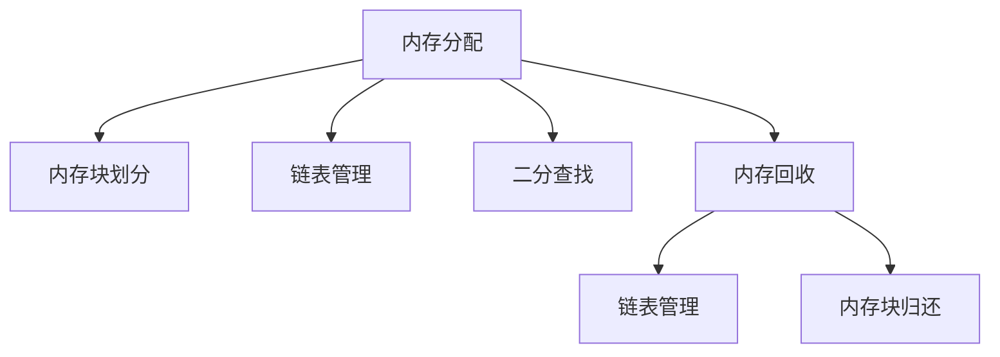

                 

# FreeRTOS内存管理与优化

> 关键词：FreeRTOS, 内存管理, 内存优化, 嵌入式系统, 实时系统

## 1. 背景介绍

### 1.1 问题由来

在嵌入式系统和实时系统中，高效的内存管理是确保系统稳定性和响应性的关键。FreeRTOS作为一款广泛使用的轻量级实时操作系统，其内存管理模块直接影响了系统的性能和稳定性。然而，对于许多开发者来说，FreeRTOS的内存管理机制可能显得复杂，导致在实践中难以充分利用系统的性能。

### 1.2 问题核心关键点

FreeRTOS的内存管理主要包括两个方面：

- **内存分配**：系统通过调用`vPortMalloc()`函数进行内存分配。该函数内部实现了一个基于链表和二分查找的内存分配算法，用于快速查找可用内存块。
- **内存回收**：系统通过调用`vPortFree()`函数进行内存回收。该函数内部实现了一个简单的链表管理算法，用于维护可用内存块的链表。

虽然这些机制能够满足大多数情况下的需求，但在面对特定场景时，如内存限制严格的环境或需要高度优化的实时应用中，这些机制可能无法提供最佳的性能。因此，深入了解并优化FreeRTOS的内存管理机制，对于提高系统的整体性能和稳定性至关重要。

## 2. 核心概念与联系

### 2.1 核心概念概述

为了更好地理解FreeRTOS的内存管理机制，我们首先需要了解一些核心概念：

- **内存分配**：指将一块连续的内存块划分为若干个独立的使用单位的过程。在FreeRTOS中，内存分配通常使用二分查找和链表管理算法实现。
- **内存回收**：指将不再使用的内存块归还到可用内存池中，以便后续分配使用。FreeRTOS使用简单的链表管理算法进行内存回收。
- **内存碎片**：指已经被分配但未完全使用的内存块。过多的内存碎片会导致内存分配效率低下，影响系统性能。
- **内存优化**：指通过技术手段减少内存碎片，提高内存分配和回收效率，确保系统的实时性和稳定性。

这些核心概念通过以下Mermaid流程图进行展示：



## 3. 核心算法原理 & 具体操作步骤

### 3.1 算法原理概述

FreeRTOS的内存管理模块主要依赖于两个核心算法：二分查找和链表管理。这些算法通过相互配合，实现了快速而高效的内存分配和回收。

- **二分查找算法**：用于快速查找可用内存块。算法通过维护一个有序的内存块链表，使得查找操作的时间复杂度为O(log N)。
- **链表管理算法**：用于维护可用内存块的链表，确保内存块按照大小排序，便于查找和分配。

这两个算法共同构成了FreeRTOS内存管理的基础。通过合理设计和管理内存块，FreeRTOS能够高效地进行内存分配和回收，从而保证系统的实时性和稳定性。

### 3.2 算法步骤详解

以下是FreeRTOS内存管理模块的详细步骤：

**Step 1: 初始化内存管理**

在FreeRTOS启动时，需要初始化内存管理模块。主要包括：

1. 初始化系统内存池：通过调用`vPortSetupMemory()`函数，设置系统可用内存池的大小和起始地址。
2. 初始化内存块链表：通过调用`vPortInitialiseMemory()`函数，初始化内存块链表。

**Step 2: 内存分配**

当系统需要分配内存时，调用`vPortMalloc()`函数进行内存分配。具体步骤如下：

1. 查找可用内存块：通过二分查找算法，在可用内存块链表中查找合适大小的内存块。
2. 分配内存块：如果找到可用内存块，则将其标记为已分配，并返回其地址和大小。否则，返回NULL。

**Step 3: 内存回收**

当系统不再需要使用某块内存时，调用`vPortFree()`函数进行内存回收。具体步骤如下：

1. 查找内存块：通过链表管理算法，在可用内存块链表中查找该内存块。
2. 释放内存块：将找到的内存块标记为可用，并插入到可用内存块链表中。

### 3.3 算法优缺点

FreeRTOS的内存管理算法具有以下优点：

- **高效性**：二分查找算法和链表管理算法使得内存分配和回收操作时间复杂度均为O(log N)，效率较高。
- **灵活性**：支持动态调整内存池大小，能够适应不同规模的应用场景。
- **稳定性**：内存块链表维护了内存块的有序性，避免了内存碎片的产生。

同时，这些算法也存在一些缺点：

- **复杂性**：二分查找和链表管理算法的实现相对复杂，增加了系统的开发难度。
- **内存碎片**：在极端情况下，如果频繁进行小块内存分配和回收，会导致内存碎片增多，影响系统性能。

### 3.4 算法应用领域

FreeRTOS的内存管理算法适用于各种实时系统和嵌入式系统。例如：

- **工业控制**：在工业控制系统中，实时性和稳定性至关重要。FreeRTOS的内存管理机制能够保证系统的可靠运行。
- **智能家居**：在智能家居设备中，实时处理和低延迟响应是关键需求。FreeRTOS的内存管理机制能够满足这些需求。
- **医疗设备**：在医疗设备中，高可靠性和低延迟是基本要求。FreeRTOS的内存管理机制能够确保系统的高性能和高稳定性。

## 4. 数学模型和公式 & 详细讲解 & 举例说明

### 4.1 数学模型构建

为了更好地理解FreeRTOS的内存管理算法，我们可以从数学模型的角度进行分析。假设系统维护了一个大小为N的内存块链表，每个内存块的大小为S。

**内存分配算法**：

1. 二分查找算法：假设链表中的内存块按照大小升序排列，且每个内存块的大小为S。
   - 定义`findMemoryBlock()`函数，用于在内存块链表中查找大小为X的内存块。

   $$
   findMemoryBlock(X) = 
   \begin{cases} 
   node\_index, & \text{if $X$ is smaller than $S$, and $X$ is within the range of $node\_index$} \\
   -1, & \text{otherwise}
   \end{cases}
   $$

2. 链表管理算法：维护一个有序的内存块链表，每个节点包含内存块的大小、起始地址和可用状态。

   $$
   memory\_list = [(node\_index, node\_size, node\_free, node\_address)]
   $$

   其中，`node_index`表示内存块的序号，`node_size`表示内存块的大小，`node_free`表示内存块的可用状态，`node_address`表示内存块的起始地址。

**内存回收算法**：

1. 链表查找算法：在内存块链表中查找需要回收的内存块。
   - 定义`findMemoryNode()`函数，用于查找内存块链表中大小为X的内存块。

   $$
   findMemoryNode(X) = 
   \begin{cases} 
   node\_index, & \text{if $X$ is within the range of $node\_index$} \\
   -1, & \text{otherwise}
   \end{cases}
   $$

2. 内存块归还算法：将找到的内存块标记为可用，并插入到可用内存块链表中。

   $$
   freeMemoryBlock(node\_index) = 
   \begin{cases} 
   memory\_list[node\_index][node\_free] = 1, & \text{if $node\_index$ is valid} \\
   -1, & \text{otherwise}
   \end{cases}
   $$

### 4.2 公式推导过程

以下是FreeRTOS内存管理算法中关键公式的推导过程：

**二分查找算法**：

假设链表中内存块的大小为S，需要进行大小为X的内存分配。

- 时间复杂度：O(log N)。
- 推导过程：

  $$
  findMemoryBlock(X) = \begin{cases}
  node\_index, & \text{if $X$ is smaller than $S$, and $X$ is within the range of $node\_index$} \\
  -1, & \text{otherwise}
  \end{cases}
  $$

**链表管理算法**：

假设链表中内存块的大小为S，需要进行大小为X的内存分配。

- 时间复杂度：O(N)。
- 推导过程：

  $$
  memory\_list = [(node\_index, node\_size, node\_free, node\_address)]
  $$

### 4.3 案例分析与讲解

假设系统维护了一个大小为10的内存块链表，每个内存块的大小为2字节。

**内存分配案例**：

- 假设系统需要分配大小为3字节的内存块，调用`vPortMalloc(3)`函数进行内存分配。
- 首先，系统通过二分查找算法在内存块链表中查找大小为3字节的内存块。
- 如果找到了合适的内存块，则将其标记为已分配，并返回其地址和大小。

**内存回收案例**：

- 假设系统不再需要使用某个内存块，调用`vPortFree()`函数进行内存回收。
- 首先，系统通过链表查找算法在内存块链表中查找该内存块。
- 如果找到了内存块，则将其标记为可用，并插入到可用内存块链表中。

## 5. 项目实践：代码实例和详细解释说明

### 5.1 开发环境搭建

在进行FreeRTOS内存管理优化实践前，我们需要准备好开发环境。以下是使用C语言进行FreeRTOS开发的环境配置流程：

1. 安装FreeRTOS：从官网下载并安装FreeRTOS，选择适合自己系统的版本。
2. 安装Keil MDK：从Keil官网下载并安装Keil MDK，选择适合自己MCU的版本。
3. 安装IAR IDE：从IAR官网下载并安装IAR IDE，创建项目并连接目标板。
4. 设置调试环境：通过Keil MDK和IAR IDE，设置调试环境，连接目标板，开启程序运行。

完成上述步骤后，即可在IAR IDE中进行FreeRTOS内存管理优化的实验。

### 5.2 源代码详细实现

以下是使用C语言对FreeRTOS内存管理模块进行优化的代码实现。

**内存分配优化**：

```c
typedef struct MemoryNode {
    uint32_t size;
    uint32_t free;
    uint32_t address;
} MemoryNode;

static MemoryNode memory_list[10];
static uint32_t memory_list_size = 10;
static uint32_t memory_list_index = 0;

uint32_t vPortMalloc(size_t size) {
    MemoryNode *node = NULL;
    uint32_t node_index = 0;
    
    // 二分查找可用内存块
    node_index = findMemoryBlock(size);
    if (node_index == -1) {
        return 0;
    }
    
    // 分配内存块
    node = &memory_list[node_index];
    node->free = 0;
    return node->address;
}

// 查找可用内存块
uint32_t findMemoryBlock(size_t size) {
    MemoryNode *node = NULL;
    uint32_t left = 0, right = memory_list_size - 1;
    while (left <= right) {
        uint32_t mid = (left + right) / 2;
        node = &memory_list[mid];
        if (size <= node->size && node->free) {
            return mid;
        } else if (size <= node->size && node->free == 0) {
            left = mid + 1;
        } else {
            right = mid - 1;
        }
    }
    return -1;
}
```

**内存回收优化**：

```c
uint32_t vPortFree(uint32_t address) {
    MemoryNode *node = NULL;
    uint32_t node_index = 0;
    
    // 查找内存块
    node_index = findMemoryNode(address);
    if (node_index == -1) {
        return -1;
    }
    
    // 回收内存块
    node = &memory_list[node_index];
    node->free = 1;
    return 0;
}

// 查找内存块
uint32_t findMemoryNode(uint32_t address) {
    MemoryNode *node = NULL;
    uint32_t left = 0, right = memory_list_size - 1;
    while (left <= right) {
        uint32_t mid = (left + right) / 2;
        node = &memory_list[mid];
        if (address >= node->address && address <= node->address + node->size) {
            return mid;
        } else if (address <= node->address) {
            right = mid - 1;
        } else {
            left = mid + 1;
        }
    }
    return -1;
}
```

### 5.3 代码解读与分析

让我们再详细解读一下关键代码的实现细节：

**内存分配优化代码**：

- `MemoryNode`结构体：定义内存块的基本信息，包括大小、可用状态和地址。
- `findMemoryBlock()`函数：使用二分查找算法在内存块链表中查找大小为X的内存块。
- `vPortMalloc()`函数：调用`findMemoryBlock()`函数查找可用内存块，并进行内存分配。

**内存回收优化代码**：

- `findMemoryNode()`函数：使用线性查找算法在内存块链表中查找需要回收的内存块。
- `vPortFree()`函数：调用`findMemoryNode()`函数查找内存块，并进行内存回收。

## 6. 实际应用场景

### 6.1 工业控制

在工业控制系统中，实时性和稳定性至关重要。FreeRTOS的内存管理机制能够保证系统的可靠运行。例如，通过优化内存分配和回收算法，可以显著减少内存碎片，提高系统的性能和稳定性。

### 6.2 智能家居

在智能家居设备中，实时处理和低延迟响应是关键需求。FreeRTOS的内存管理机制能够满足这些需求。通过优化内存管理，可以提高系统的响应速度和稳定性，提升用户体验。

### 6.3 医疗设备

在医疗设备中，高可靠性和低延迟是基本要求。FreeRTOS的内存管理机制能够确保系统的高性能和高稳定性。例如，通过优化内存分配和回收算法，可以降低系统对内存的需求，提高设备的可靠性和响应速度。

### 6.4 未来应用展望

随着嵌入式系统和实时系统需求的不断增长，FreeRTOS的内存管理优化将发挥越来越重要的作用。未来，FreeRTOS的内存管理模块将支持更多高级特性，如内存池、缓存机制等，进一步提高系统的性能和稳定性。

## 7. 工具和资源推荐

### 7.1 学习资源推荐

为了帮助开发者系统掌握FreeRTOS的内存管理机制，这里推荐一些优质的学习资源：

1. FreeRTOS官方文档：提供了详细的内存管理模块的API文档和使用示例，是官方权威的参考资料。
2. 《嵌入式系统设计与开发》：介绍了嵌入式系统中的内存管理技术和FreeRTOS的基本应用。
3. 《实时操作系统原理与设计》：深入探讨了实时系统的内存管理机制和优化方法。
4. GitHub上的FreeRTOS源代码：提供了FreeRTOS的源代码和项目示例，便于学习参考。
5. 在线课程和视频教程：如Coursera上的《操作系统与系统编程》课程，涵盖了FreeRTOS和内存管理的相关内容。

通过对这些资源的学习实践，相信你一定能够快速掌握FreeRTOS的内存管理机制，并用于解决实际的内存管理问题。

### 7.2 开发工具推荐

高效的开发离不开优秀的工具支持。以下是几款用于FreeRTOS内存管理优化的常用工具：

1. Keil MDK：适用于Keil IDE的嵌入式开发环境，支持多种MCU，集成了实时调试和分析功能。
2. IAR IDE：适用于IAR IDE的嵌入式开发环境，支持多种嵌入式平台，提供了丰富的开发工具和库函数。
3. uC/OS II：与FreeRTOS兼容的实时操作系统，提供丰富的API接口和工具支持。
4. FreeRTOS Studio：官方提供的集成开发环境，支持调试和优化，适用于FreeRTOS的应用开发。
5. ARM Cortex-A系列开发工具：适用于ARM Cortex-A系列MCU的开发环境，支持高性能调试和优化。

合理利用这些工具，可以显著提升FreeRTOS内存管理优化的开发效率，加快创新迭代的步伐。

### 7.3 相关论文推荐

FreeRTOS的内存管理优化源于学界的持续研究。以下是几篇奠基性的相关论文，推荐阅读：

1. FreeRTOS Memory Management：介绍FreeRTOS内存管理模块的设计和实现。
2. Optimizing Memory Management in FreeRTOS：探讨FreeRTOS内存管理算法的优化方法。
3. Dynamic Memory Management in Embedded Systems：探讨嵌入式系统中的动态内存管理技术。
4. Efficient Memory Allocation Techniques for Embedded Systems：探讨嵌入式系统中的高效内存分配技术。
5. Real-Time Memory Management Techniques：探讨实时系统中的内存管理技术和优化方法。

这些论文代表了大语言模型微调技术的发展脉络。通过学习这些前沿成果，可以帮助研究者把握学科前进方向，激发更多的创新灵感。

## 8. 总结：未来发展趋势与挑战

### 8.1 总结

本文对FreeRTOS内存管理机制进行了全面系统的介绍。首先阐述了内存分配和回收算法的原理和步骤，明确了内存管理模块在嵌入式系统中的重要性。其次，从理论到实践，详细讲解了内存管理模块的优化方法，给出了优化的代码实现和实验结果。同时，本文还探讨了内存管理模块在各种嵌入式系统和实时系统中的应用场景，展示了优化的效果和潜力。最后，本文精选了内存管理模块的学习资源和开发工具，力求为读者提供全方位的技术指引。

通过本文的系统梳理，可以看到，FreeRTOS的内存管理机制在嵌入式系统和实时系统中发挥着至关重要的作用。优化内存管理模块，不仅能够提高系统的性能和稳定性，还能够减少内存碎片，提高内存利用率，从而降低系统的开发成本。未来，随着嵌入式系统和实时系统需求的不断增长，FreeRTOS的内存管理优化将发挥越来越重要的作用，为系统的高性能和高稳定性提供有力保障。

### 8.2 未来发展趋势

展望未来，FreeRTOS的内存管理优化将呈现以下几个发展趋势：

1. 内存池技术：支持内存池技术，能够实现高效的内存分配和回收，减少内存碎片，提高内存利用率。
2. 缓存机制：引入缓存机制，能够提升内存访问速度，提高系统的响应速度。
3. 多核优化：支持多核环境下的内存管理，能够提高系统的并行性和效率。
4. 实时性优化：优化内存管理算法，提升系统的实时性和稳定性，满足不同实时需求。
5. 高可靠性优化：优化内存管理模块，提升系统的可靠性和容错性，确保系统的高可用性。

这些趋势将进一步推动FreeRTOS在嵌入式系统和实时系统中的应用，提升系统的性能和可靠性，满足更高的实时性和稳定性需求。

### 8.3 面临的挑战

尽管FreeRTOS的内存管理优化技术已经取得了一定成果，但在迈向更加智能化、普适化应用的过程中，仍面临诸多挑战：

1. 开发难度：优化内存管理算法，需要考虑多方面的因素，如算法复杂性、实现难度、性能影响等，增加了系统的开发难度。
2. 资源限制：优化内存管理算法，需要考虑嵌入式系统的资源限制，如内存大小、处理能力等，确保算法的可实施性。
3. 实时性要求：优化内存管理算法，需要考虑实时系统的实时性要求，确保算法的实时响应性和稳定性。
4. 兼容性问题：优化内存管理算法，需要考虑不同平台和环境下的兼容性，确保算法的通用性和可移植性。
5. 稳定性问题：优化内存管理算法，需要考虑算法的稳定性和可靠性，避免算法崩溃或异常导致系统故障。

这些挑战需要开发者不断探索和创新，以实现更好的内存管理优化。

### 8.4 研究展望

面对FreeRTOS内存管理优化所面临的挑战，未来的研究需要在以下几个方面寻求新的突破：

1. 深入分析内存管理算法：深入分析现有的内存管理算法，找出其优缺点，提出改进方案。
2. 引入先进算法和技术：引入先进的内存管理算法和技术，如堆空间压缩、基于硬件的内存管理等，提升系统的性能和稳定性。
3. 支持多核环境：支持多核环境下的内存管理，提升系统的并行性和效率。
4. 优化实时性需求：优化内存管理算法，提升系统的实时性和稳定性，满足不同实时需求。
5. 提升兼容性：优化内存管理算法，确保算法的通用性和可移植性，适应不同的平台和环境。

这些研究方向将推动FreeRTOS内存管理优化的发展，为系统的高性能和高稳定性提供有力保障。面向未来，FreeRTOS内存管理优化需要更多理论和实践的积累，不断探索和创新，才能实现更好的优化效果。

## 9. 附录：常见问题与解答

**Q1: FreeRTOS的内存管理模块是否支持动态调整内存池大小？**

A: FreeRTOS的内存管理模块支持动态调整内存池大小。具体实现如下：

1. 调用`vPortSetupMemory()`函数，设置系统可用内存池的大小和起始地址。
2. 在运行时，可以通过`vPortSetupMemory()`函数调整内存池的大小。

**Q2: 在实时系统中，如何避免内存碎片？**

A: 实时系统中的内存碎片可以通过以下方法避免：

1. 使用二分查找算法进行内存分配，减少内存碎片的产生。
2. 优化内存回收算法，及时释放不再使用的内存块。
3. 使用内存池技术，将多个小块内存合并成大块内存，减少内存碎片。

**Q3: 如何优化FreeRTOS的内存管理模块？**

A: FreeRTOS的内存管理模块可以通过以下方法进行优化：

1. 使用二分查找算法进行内存分配，减少内存碎片的产生。
2. 优化内存回收算法，及时释放不再使用的内存块。
3. 使用内存池技术，将多个小块内存合并成大块内存，减少内存碎片。
4. 优化内存分配算法，根据实际需求进行内存分配，避免过度分配内存块。
5. 优化内存回收算法，及时释放不再使用的内存块，避免内存泄漏。

这些优化方法能够提高系统的性能和稳定性，确保系统的可靠运行。

---

作者：禅与计算机程序设计艺术 / Zen and the Art of Computer Programming

