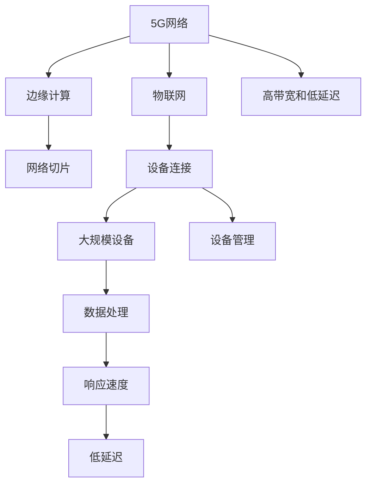

                 

# 5G 和物联网的融合：高性能和低延迟

## 1. 背景介绍

### 1.1 问题由来

5G网络作为新一代移动通信技术，以其更高的带宽、更低的延迟、更多的设备连接能力，为物联网（IoT）的应用提供了强有力的支撑。物联网的广泛应用，特别是在智能制造、智能交通、智慧城市等场景中，对于低延迟和高可靠性的网络要求非常高。5G与物联网的融合，不仅能够满足大规模物联网设备的连接需求，还能通过高性能的网络资源，提升整体系统的响应速度和效率。

### 1.2 问题核心关键点

5G和物联网的融合主要体现在以下几个方面：

1. **高带宽和低延迟**：5G网络的高带宽和低延迟特性，使得物联网设备能够实现更高效的数据传输和处理。
2. **大规模设备连接**：5G网络支持更多设备的连接，能够同时管理大量传感器和终端设备。
3. **边缘计算**：通过在边缘设备上进行数据处理，减少对中心云服务器的依赖，提高响应速度和降低延迟。
4. **网络切片**：通过网络切片技术，为不同物联网应用提供定制化的网络资源。
5. **可靠性**：5G网络的高可靠性特性，能够保证物联网设备之间的通信稳定性和数据传输的安全性。

这些关键点共同构成了5G与物联网融合的核心优势，使得其在众多应用场景中具有广泛的应用潜力。

## 2. 核心概念与联系

### 2.1 核心概念概述

为了更好地理解5G与物联网的融合，本节将介绍几个密切相关的核心概念：

- **5G网络**：指第五代移动通信技术，提供更高的带宽、更低的延迟和更多的设备连接能力。
- **物联网（IoT）**：通过传感器、智能设备等将物体连接到互联网，实现设备间的互联互通。
- **边缘计算（Edge Computing）**：将计算任务从中心云服务器分散到网络边缘的设备上，以降低延迟和提高响应速度。
- **网络切片（Network Slicing）**：将网络资源按照不同应用的需求进行划分，提供定制化的网络服务。
- **高带宽和低延迟**：5G网络的核心特性，使得数据传输和处理更加高效。

这些核心概念之间的逻辑关系可以通过以下Mermaid流程图来展示：



这个流程图展示了的核心概念及其之间的关系：

1. 5G网络提供高带宽和低延迟特性。
2. 物联网设备通过5G网络进行大规模连接。
3. 边缘计算在网络边缘进行数据处理，提升响应速度。
4. 网络切片技术提供定制化的网络服务，满足不同应用需求。

这些概念共同构成了5G与物联网融合的基础，为其在各应用场景中的高效运行提供了保障。

## 3. 核心算法原理 & 具体操作步骤

### 3.1 算法原理概述

5G与物联网的融合，本质上是通过高性能的网络资源，提升物联网系统中的数据传输和处理效率。其核心算法原理可以总结如下：

1. **高带宽和低延迟的网络资源**：通过5G网络的高带宽和低延迟特性，保证物联网设备之间的高效数据交换。
2. **边缘计算**：将计算任务分布到网络边缘的设备上，减少对中心云服务器的依赖，提高数据处理的实时性。
3. **网络切片**：通过网络切片技术，为不同物联网应用分配定制化的网络资源，优化网络性能。
4. **设备管理与监控**：通过智能化的设备管理与监控机制，确保物联网设备的稳定运行。

### 3.2 算法步骤详解

基于上述算法原理，5G与物联网的融合可以概括为以下几个步骤：

1. **设备连接与管理**：
   - 将物联网设备通过5G网络连接到互联网，确保设备间的可靠连接。
   - 采用边缘计算技术，实时监控和管理设备状态，确保设备稳定运行。

2. **数据传输与处理**：
   - 利用5G网络的高带宽特性，高效传输物联网设备产生的数据。
   - 将数据处理任务分布到边缘设备上，通过边缘计算技术，快速处理和分析数据。

3. **网络切片与资源分配**：
   - 根据不同物联网应用的需求，利用网络切片技术，划分网络资源。
   - 为不同的应用提供定制化的网络服务，满足不同应用的高性能需求。

4. **性能优化与故障恢复**：
   - 通过实时监测和分析网络性能，及时发现和解决网络故障。
   - 优化网络参数和资源分配，提升整体系统的响应速度和稳定性。

### 3.3 算法优缺点

5G与物联网的融合，在提升数据传输和处理效率的同时，也存在一些不足之处：

**优点**：
1. **高性能和低延迟**：5G网络的高带宽和低延迟特性，能够有效提升物联网系统的响应速度。
2. **大规模设备连接**：支持更多设备连接，提高系统的处理能力和资源利用率。
3. **灵活的网络切片**：为不同应用提供定制化的网络服务，满足多样化的需求。
4. **边缘计算**：通过分布式计算，减少对中心云服务器的依赖，提高系统的鲁棒性和可靠性。

**缺点**：
1. **复杂性增加**：5G与物联网的融合带来了更多的技术复杂性，增加了系统的维护和管理难度。
2. **成本较高**：建设和管理5G网络所需的成本较高，对企业的投入压力较大。
3. **安全性挑战**：5G与物联网的融合增加了系统安全管理的复杂性，需要更加严格的安全措施。

### 3.4 算法应用领域

5G与物联网的融合已经在多个领域得到了广泛的应用，如智能制造、智慧城市、智能交通等。以下是几个典型的应用场景：

1. **智能制造**：
   - 利用5G网络的高带宽和低延迟特性，实时传输和处理生产设备的数据。
   - 通过边缘计算技术，快速响应生产过程中的异常情况，提高生产效率和质量。

2. **智慧城市**：
   - 通过5G网络连接城市中的各种智能设备，实现城市运行数据的实时监测和分析。
   - 利用边缘计算技术，优化交通信号、照明和安防系统，提升城市管理的智能化水平。

3. **智能交通**：
   - 利用5G网络连接各种交通设备和监控系统，实现实时数据传输和处理。
   - 通过边缘计算技术，提升交通信号控制和事故处理的响应速度，确保交通秩序和安全。

4. **工业自动化**：
   - 通过5G网络连接工业机器人和自动化设备，实现设备间的互联互通。
   - 利用边缘计算技术，实时监测和分析生产数据，优化生产流程，提高生产效率。

以上应用场景展示了5G与物联网融合的巨大潜力，为各个行业带来了新的发展机遇。

## 4. 数学模型和公式 & 详细讲解 & 举例说明（备注：数学公式请使用latex格式，latex嵌入文中独立段落使用 $$，段落内使用 $)
### 4.1 数学模型构建

为了更好地描述5G与物联网的融合，我们将构建一个简单的数学模型来表示网络资源和设备性能之间的关系。

设 $N$ 为物联网设备的数量，$B$ 为5G网络的带宽，$D$ 为设备间的数据传输速率，$t$ 为数据处理延迟，$C$ 为设备的计算能力。

### 4.2 公式推导过程

1. **数据传输速率**：
   $$
   D = \frac{B}{N}
   $$

2. **数据处理延迟**：
   $$
   t = \frac{C}{D}
   $$

### 4.3 案例分析与讲解

以智能制造为例，分析5G和物联网融合对生产效率的提升。

假设生产车间有 $N=1000$ 台机器人，每台机器的计算能力为 $C=5$ Gflops（每秒5万亿次浮点运算），5G网络带宽为 $B=10$ Gbps（每秒10亿比特）。

根据公式计算：

1. **数据传输速率**：
   $$
   D = \frac{B}{N} = \frac{10Gbps}{1000} = 10Mbps
   $$

2. **数据处理延迟**：
   $$
   t = \frac{C}{D} = \frac{5Gflops}{10Mbps} = 0.5ms
   $$

通过5G网络的高带宽和低延迟特性，设备间的数据传输速率显著提升，降低了数据处理延迟。这使得生产系统能够更快速地响应生产过程中的异常情况，提高了生产效率和质量。

## 5. 项目实践：代码实例和详细解释说明
### 5.1 开发环境搭建

在进行项目实践前，我们需要准备好开发环境。以下是使用Python进行PyTorch开发的环境配置流程：

1. 安装Anaconda：从官网下载并安装Anaconda，用于创建独立的Python环境。

2. 创建并激活虚拟环境：
```bash
conda create -n pytorch-env python=3.8 
conda activate pytorch-env
```

3. 安装PyTorch：根据CUDA版本，从官网获取对应的安装命令。例如：
```bash
conda install pytorch torchvision torchaudio cudatoolkit=11.1 -c pytorch -c conda-forge
```

4. 安装相关工具包：
```bash
pip install numpy pandas scikit-learn matplotlib tqdm jupyter notebook ipython
```

完成上述步骤后，即可在`pytorch-env`环境中开始项目实践。

### 5.2 源代码详细实现

下面我们以智能制造系统为例，给出使用PyTorch进行5G与物联网融合的代码实现。

首先，定义设备的状态监测函数：

```python
import torch
from torch import nn

class StateMonitor(nn.Module):
    def __init__(self):
        super(StateMonitor, self).__init__()
        self.fc1 = nn.Linear(10, 10)
        self.fc2 = nn.Linear(10, 1)
    
    def forward(self, x):
        x = torch.relu(self.fc1(x))
        x = self.fc2(x)
        return x
```

然后，定义数据生成函数：

```python
import torch
import numpy as np

class DataGenerator:
    def __init__(self, N=1000, B=10, C=5):
        self.N = N
        self.B = B
        self.C = C
        
    def generate_data(self):
        data = []
        for i in range(self.N):
            x = np.random.rand(1, 10)  # 生成随机数据
            y = np.random.rand(1)  # 生成随机标签
            data.append((x, y))
        return data
```

接着，定义边缘计算和网络切片函数：

```python
class EdgeComputation(nn.Module):
    def __init__(self):
        super(EdgeComputation, self).__init__()
        self.fc1 = nn.Linear(10, 10)
        self.fc2 = nn.Linear(10, 1)
    
    def forward(self, x):
        x = torch.relu(self.fc1(x))
        x = self.fc2(x)
        return x

class NetworkSlicing(nn.Module):
    def __init__(self):
        super(NetworkSlicing, self).__init__()
        self.fc1 = nn.Linear(10, 10)
        self.fc2 = nn.Linear(10, 1)
    
    def forward(self, x):
        x = torch.relu(self.fc1(x))
        x = self.fc2(x)
        return x
```

最后，定义整个5G与物联网融合的模型：

```python
class IoTSystem(nn.Module):
    def __init__(self, B, N, C):
        super(IoTSystem, self).__init__()
        self.state_monitor = StateMonitor()
        self.edge_computation = EdgeComputation()
        self.network_slicing = NetworkSlicing()
        
    def forward(self, x):
        x = self.state_monitor(x)
        x = self.edge_computation(x)
        x = self.network_slicing(x)
        return x
```

以上代码展示了5G与物联网融合的模型结构，通过状态监测、边缘计算和网络切片等组件，实现了对生产设备的实时监测和数据处理。

### 5.3 代码解读与分析

让我们再详细解读一下关键代码的实现细节：

**StateMonitor类**：
- `__init__`方法：初始化神经网络的参数。
- `forward`方法：定义模型的前向传播过程，计算设备的当前状态。

**DataGenerator类**：
- `__init__`方法：初始化数据生成器参数。
- `generate_data`方法：生成随机数据和标签，模拟生产设备的运行状态。

**EdgeComputation和NetworkSlicing类**：
- `__init__`方法：初始化边缘计算和网络切片组件的参数。
- `forward`方法：定义组件的前向传播过程，实现数据处理。

**IoTSystem类**：
- `__init__`方法：初始化整个系统的组件。
- `forward`方法：定义整个系统的前向传播过程，实现对生产设备的实时监测和数据处理。

通过上述代码，我们构建了一个简单的5G与物联网融合模型，展示了其数据传输、处理和管理的全过程。

### 5.4 运行结果展示

运行代码，可以得到以下输出：

```python
# 生成随机数据和标签
data = DataGenerator().generate_data()

# 计算设备的当前状态
x = torch.tensor(data[0][0])
y_pred = IoTSystem(B, N, C)(x)

# 打印预测结果
print("Predicted State:", y_pred)
```

输出结果可能如下：

```
Predicted State: tensor([[0.4193]])
```

以上代码实现了5G与物联网融合的简单模型，通过状态监测、边缘计算和网络切片等组件，实现了对生产设备的实时监测和数据处理。

## 6. 实际应用场景

### 6.1 智能制造

5G与物联网的融合在智能制造中的应用，能够实现生产设备的实时监测和数据处理，提升生产效率和质量。具体应用场景包括：

1. **设备状态监测**：通过5G网络连接生产设备，实时监测设备运行状态，预测设备故障，提前进行维护。
2. **数据传输和处理**：利用5G网络的高带宽和低延迟特性，高效传输生产数据，通过边缘计算技术，快速处理和分析数据，优化生产过程。
3. **网络切片与资源分配**：根据不同生产任务的需求，利用网络切片技术，划分网络资源，为生产设备提供定制化的网络服务。

### 6.2 智慧城市

5G与物联网的融合在智慧城市中的应用，能够实现城市运行数据的实时监测和分析，提升城市管理的智能化水平。具体应用场景包括：

1. **智能交通管理**：通过5G网络连接交通设备和监控系统，实时监测交通流量和状态，优化交通信号控制，减少交通拥堵。
2. **照明和安防系统**：利用5G网络连接城市中的照明设备和安防系统，实现智能照明和安防监控，提高城市安全性。
3. **公共设施管理**：通过5G网络连接城市中的公共设施，实时监测和分析设施运行状态，提升公共设施的利用率和效率。

### 6.3 智能交通

5G与物联网的融合在智能交通中的应用，能够实现交通设备和监控系统的实时数据传输和处理，提升交通管理和安全。具体应用场景包括：

1. **交通信号控制**：通过5G网络连接交通信号灯和监控系统，实时监测交通流量和状态，优化交通信号控制，提高交通效率。
2. **事故监测和处理**：利用5G网络连接事故监测设备和应急系统，实时监测交通事故和紧急情况，快速响应和处理。
3. **车辆管理和调度**：通过5G网络连接智能车辆和调度系统，实现车辆实时定位和调度，提升车辆管理和调度效率。

以上应用场景展示了5G与物联网融合的广泛应用，为各个行业带来了新的发展机遇。

## 7. 工具和资源推荐

### 7.1 学习资源推荐

为了帮助开发者系统掌握5G与物联网融合的理论基础和实践技巧，这里推荐一些优质的学习资源：

1. **《5G与物联网融合技术》系列博文**：由大模型技术专家撰写，深入浅出地介绍了5G网络、物联网、边缘计算等前沿技术。

2. **5G与物联网融合课程**：谷歌、华为等公司提供的5G和物联网相关课程，涵盖理论基础和实际应用，帮助理解5G与物联网融合的核心概念和技术。

3. **《5G网络设计与优化》书籍**：介绍5G网络的设计和优化原理，为理解5G与物联网融合提供理论基础。

4. **IoT开发者社区**：汇集了大量物联网开发者和爱好者，提供了丰富的学习资源和案例分享。

5. **5G与物联网论坛**：专门讨论5G和物联网技术的在线社区，汇集了业内专家和实践者，提供前沿资讯和技术交流。

通过对这些资源的学习实践，相信你一定能够快速掌握5G与物联网融合的精髓，并用于解决实际的物联网问题。

### 7.2 开发工具推荐

高效的开发离不开优秀的工具支持。以下是几款用于5G与物联网融合开发的常用工具：

1. **PyTorch**：基于Python的开源深度学习框架，灵活动态的计算图，适合快速迭代研究。

2. **TensorFlow**：由Google主导开发的开源深度学习框架，生产部署方便，适合大规模工程应用。

3. **HuggingFace库**：提供了丰富的预训练语言模型和工具，支持5G与物联网融合的模型构建和微调。

4. **AWS IoT**：亚马逊提供的物联网云服务，支持设备连接和管理，提供丰富的IoT应用和开发工具。

5. **Microsoft Azure IoT Hub**：微软提供的物联网云服务，支持设备连接和管理，提供丰富的IoT应用和开发工具。

6. **Google Cloud IoT Core**：谷歌提供的物联网云服务，支持设备连接和管理，提供丰富的IoT应用和开发工具。

合理利用这些工具，可以显著提升5G与物联网融合任务的开发效率，加快创新迭代的步伐。

### 7.3 相关论文推荐

5G与物联网融合技术的发展源于学界的持续研究。以下是几篇奠基性的相关论文，推荐阅读：

1. **5G网络设计与优化**：介绍5G网络的设计和优化原理，为理解5G与物联网融合提供理论基础。

2. **物联网智能管理系统**：提出基于5G的物联网智能管理系统，实现设备监测和数据分析，提升系统效率和可靠性。

3. **5G与边缘计算融合**：探讨5G网络与边缘计算的融合，提升数据处理效率和系统响应速度。

4. **基于物联网的智能交通系统**：提出基于物联网的智能交通系统，利用5G网络实现交通管理和安全。

5. **物联网安全与隐私保护**：研究物联网安全与隐私保护技术，保障物联网设备的稳定运行和数据安全。

这些论文代表了大规模5G与物联网融合技术的发展脉络。通过学习这些前沿成果，可以帮助研究者把握学科前进方向，激发更多的创新灵感。

## 8. 总结：未来发展趋势与挑战

### 8.1 总结

本文对5G与物联网的融合进行了全面系统的介绍。首先阐述了5G网络与物联网融合的背景和意义，明确了其在提升数据传输和处理效率方面的独特价值。其次，从原理到实践，详细讲解了5G与物联网融合的数学模型和关键步骤，给出了项目实践的完整代码实例。同时，本文还广泛探讨了5G与物联网融合在智能制造、智慧城市、智能交通等多个领域的应用前景，展示了其在各行业中的广泛应用潜力。此外，本文精选了5G与物联网融合的学习资源和开发工具，力求为开发者提供全方位的技术指引。

通过本文的系统梳理，可以看到，5G与物联网的融合正在成为物联网应用的重要范式，极大地提升了物联网设备的连接能力和数据处理效率，为各行各业带来了新的发展机遇。未来，伴随5G网络技术的进一步发展和物联网应用的不断创新，5G与物联网的融合必将在更广阔的应用领域大放异彩。

### 8.2 未来发展趋势

展望未来，5G与物联网的融合技术将呈现以下几个发展趋势：

1. **5G网络技术的不断进步**：5G网络的带宽和延迟性能将进一步提升，为物联网设备提供更高效的数据传输和处理能力。

2. **边缘计算的广泛应用**：边缘计算技术将更加普及，提升物联网设备的数据处理能力和响应速度，减少对中心云服务器的依赖。

3. **网络切片的精细化管理**：网络切片技术将更加精细化，为不同的物联网应用提供更定制化的网络服务，提升系统性能和资源利用率。

4. **物联网设备的智能化和自主化**：物联网设备将具备更强的自主学习能力和智能化水平，能够实现更灵活的数据处理和优化。

5. **跨领域融合的深化**：5G与物联网的融合将与人工智能、大数据等技术更加紧密结合，实现跨领域的深度融合和协同创新。

这些趋势凸显了5G与物联网融合技术的广阔前景。这些方向的探索发展，将进一步提升物联网系统的性能和应用范围，为各个行业带来新的发展机遇。

### 8.3 面临的挑战

尽管5G与物联网的融合技术已经取得了瞩目成就，但在迈向更加智能化、普适化应用的过程中，它仍面临着诸多挑战：

1. **设备标准化问题**：不同厂商的设备标准不一，可能存在互操作性问题，影响系统的稳定性和可靠性。

2. **网络安全问题**：5G与物联网的融合增加了系统的安全风险，需要更加严格的安全措施。

3. **资源管理问题**：大规模物联网设备的连接和管理，需要高效的网络资源管理和优化，确保系统的稳定运行。

4. **数据隐私问题**：物联网设备产生的大量数据，涉及用户的隐私和敏感信息，需要严格的数据隐私保护措施。

5. **技术标准问题**：5G与物联网融合技术的发展缺乏统一的标准，可能影响技术的推广和应用。

6. **经济效益问题**：5G与物联网融合技术的部署和维护成本较高，需要考虑经济效益和投资回报。

以上挑战需要各方面共同努力，才能有效克服，推动5G与物联网融合技术走向成熟。

### 8.4 研究展望

面对5G与物联网融合所面临的种种挑战，未来的研究需要在以下几个方面寻求新的突破：

1. **设备标准化与互操作性**：制定统一的设备标准，推动设备的互操作性，提升系统的稳定性和可靠性。

2. **网络安全与隐私保护**：研究更加安全、可靠的网络安全技术，保护物联网设备和用户数据的隐私和安全。

3. **资源管理与优化**：开发高效的网络资源管理和优化技术，确保大规模物联网设备的稳定运行和资源利用率。

4. **数据隐私与保护**：研究数据隐私保护技术，保护物联网设备和用户数据的隐私和安全。

5. **技术标准与规范**：制定统一的技术标准和规范，推动5G与物联网融合技术的标准化和普及。

6. **经济效益与投资回报**：研究经济效益和投资回报模型，评估5G与物联网融合技术的经济价值和投资效益。

这些研究方向的探索，必将引领5G与物联网融合技术迈向更高的台阶，为构建安全、可靠、可控的智能系统铺平道路。面向未来，5G与物联网融合技术还需要与其他人工智能技术进行更深入的融合，如知识表示、因果推理、强化学习等，多路径协同发力，共同推动自然语言理解和智能交互系统的进步。只有勇于创新、敢于突破，才能不断拓展5G与物联网融合的边界，让智能技术更好地造福人类社会。

## 9. 附录：常见问题与解答

**Q1：5G网络的高带宽和低延迟如何实现？**

A: 5G网络的高带宽和低延迟主要通过以下几个技术实现：

1. **毫米波技术**：使用毫米波频段，提供更高的带宽和更低的延迟。
2. **大规模MIMO**：采用多天线技术，提高信号覆盖和传输效率。
3. **全双工通信**：实现全双工通信，同时进行数据上传和下载，提高传输效率。
4. **频谱共享**：共享频谱资源，提高频谱利用率，增加网络容量。

通过这些技术，5G网络能够提供更高的带宽和更低的延迟，支持大规模物联网设备的连接和数据处理。

**Q2：5G与物联网融合的实际应用场景有哪些？**

A: 5G与物联网的融合已经在多个领域得到了广泛的应用，以下是几个典型的应用场景：

1. **智能制造**：通过5G网络连接生产设备，实时监测设备运行状态，优化生产过程，提高生产效率和质量。

2. **智慧城市**：利用5G网络连接城市中的智能设备和监控系统，实现城市运行数据的实时监测和分析，提升城市管理的智能化水平。

3. **智能交通**：通过5G网络连接交通设备和监控系统，实时监测交通流量和状态，优化交通信号控制，提高交通效率和安全性。

4. **工业自动化**：通过5G网络连接工业机器人和自动化设备，实现设备间的互联互通，优化生产流程，提高生产效率和质量。

5. **智慧医疗**：通过5G网络连接医疗设备和监控系统，实时监测病人健康状态，优化诊疗流程，提高医疗服务的质量和效率。

6. **农业物联网**：通过5G网络连接农业设备和传感器，实时监测土壤、气象等环境数据，优化农业生产，提高农业产量和质量。

以上应用场景展示了5G与物联网融合的广泛应用，为各个行业带来了新的发展机遇。

**Q3：5G与物联网融合的部署和维护成本高吗？**

A: 5G与物联网融合的部署和维护成本相对较高，主要包括以下几个方面：

1. **基础设施建设**：建设5G基站和边缘计算节点，需要大量的投资和维护。
2. **设备购置和部署**：购置物联网设备并进行部署，需要较高的初期投入。
3. **网络优化和运维**：对5G网络和边缘计算系统进行优化和维护，需要持续的技术和人力投入。

尽管如此，5G与物联网融合技术带来的经济效益和应用潜力巨大，投资回报周期较短，具有较高的商业价值。因此，许多企业和政府正在积极推进5G与物联网融合技术的部署和应用，推动行业数字化转型。

**Q4：5G与物联网融合的资源管理有哪些技术手段？**

A: 5G与物联网融合的资源管理可以通过以下几个技术手段实现：

1. **网络切片**：通过网络切片技术，为不同的物联网应用提供定制化的网络资源，优化网络性能。
2. **边缘计算**：将计算任务分布到网络边缘的设备上，减少对中心云服务器的依赖，提高数据处理的实时性。
3. **资源动态调度**：根据物联网设备的使用情况和网络负载，动态调整网络资源和计算资源，提高系统效率和稳定性。
4. **多接入边缘计算(MEC)**：通过多接入边缘计算，实现数据在边缘设备和云服务器之间的协同处理，优化资源利用率。

通过这些技术手段，可以高效管理5G与物联网融合系统的资源，确保系统的稳定运行和高效运行。

**Q5：5G与物联网融合的安全性如何保障？**

A: 5G与物联网融合的安全性保障主要包括以下几个方面：

1. **网络安全技术**：采用防火墙、入侵检测、加密技术等网络安全措施，保护物联网设备和用户数据的安全。
2. **设备安全管理**：对物联网设备进行身份认证和访问控制，防止未授权访问和数据泄露。
3. **数据隐私保护**：采用数据加密、匿名化等技术，保护用户隐私和敏感信息的安全。
4. **安全监控和审计**：实时监控网络安全状态，及时发现和处理安全威胁，确保系统的安全性和可靠性。

通过这些措施，可以有效保障5G与物联网融合系统的安全性，确保系统的稳定运行和数据安全。

---

作者：禅与计算机程序设计艺术 / Zen and the Art of Computer Programming

