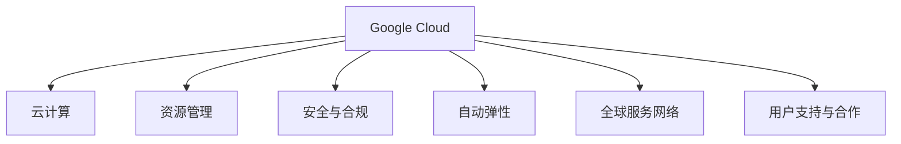

                 

# Google Cloud 产品：GCP 的优势

> 关键词：Google Cloud, GCP, 云计算, 云服务, 资源管理, 安全与合规, 自动弹性, 全球服务网络, 用户支持与合作

## 1. 背景介绍

### 1.1 问题由来
随着云计算技术的迅猛发展，全球各大云服务提供商纷纷推出各自的云服务产品，以满足企业数字化转型的需求。Google Cloud Platform（GCP）作为Google旗下的云计算服务平台，凭借其在云计算领域的深厚积累和领先优势，吸引了众多企业和开发者。本文将全面介绍GCP的架构和优势，帮助读者更好地理解GCP的核心竞争力。

### 1.2 问题核心关键点
Google Cloud Platform（GCP）是Google推出的全球领先的云服务产品，其核心优势在于强大的资源管理能力、卓越的安全与合规性、灵活的自动弹性机制、广泛的全球服务网络和优秀的用户支持与合作生态系统。通过详细剖析这些核心优势，本文旨在帮助读者全面理解GCP的价值和应用场景。

## 2. 核心概念与联系

### 2.1 核心概念概述

为更好地理解GCP的优势，本节将介绍几个关键概念：

- **Google Cloud**：Google Cloud Platform是Google推出的云计算服务平台，提供广泛的云服务，包括计算、存储、数据库、人工智能、安全与合规等。
- **云计算**：云计算是一种基于互联网的计算模式，通过网络提供按需自助的计算资源。
- **资源管理**：云平台通过自动化管理资源，提供弹性伸缩和负载均衡等功能。
- **安全与合规**：确保数据和应用的安全性，符合各种行业和地区的数据保护法规。
- **自动弹性**：根据负载自动调整资源，优化成本和性能。
- **全球服务网络**：通过Google的全球数据中心网络，提供快速稳定的服务。
- **用户支持与合作**：通过广泛的合作伙伴生态和社区支持，为用户提供全面服务。

这些概念之间通过以下Mermaid流程图展示了它们之间的联系：



这个流程图展示了大模型微调的核心概念及其之间的关系：

1. Google Cloud作为主要的云计算平台，通过云计算提供各种计算资源。
2. 资源管理、安全与合规、自动弹性、全球服务网络和用户支持与合作都是Google Cloud提供的关键功能和服务。
3. 这些功能和服务通过互联互通，共同支持Google Cloud平台的用户需求。

## 3. 核心算法原理 & 具体操作步骤

### 3.1 算法原理概述

Google Cloud Platform的资源管理、安全与合规、自动弹性、全球服务网络和用户支持与合作等功能，主要依赖于Google强大的云计算基础设施和丰富的经验积累。这些功能通过Google Cloud Console、Google Cloud SDK等工具提供给用户，用户只需在平台上注册并创建项目，即可使用这些服务。

### 3.2 算法步骤详解

Google Cloud Platform的核心功能和操作步骤包括：

1. **注册账户**：用户访问Google Cloud Console，注册新的Google Cloud账户，并创建一个新的项目。
2. **配置资源**：根据需求，在项目中创建和管理计算资源、存储资源、数据库资源等。
3. **安全配置**：配置安全与合规选项，包括访问控制、数据加密、合规性审计等。
4. **自动弹性配置**：设置自动弹性选项，使平台根据负载自动调整资源。
5. **全球服务网络配置**：利用Google全球数据中心网络，配置全球服务选项，确保低延迟和高可用性。
6. **用户支持与合作**：通过合作伙伴生态和社区支持，获取技术支持和市场合作机会。

### 3.3 算法优缺点

Google Cloud Platform的主要优势在于：

- **强大的资源管理能力**：支持大规模分布式计算和高性能存储，支持Kubernetes等容器化技术，使资源管理更加灵活高效。
- **卓越的安全与合规性**：通过严格的安全措施和合规审计，确保数据和应用的安全。
- **灵活的自动弹性机制**：根据负载自动调整资源，优化成本和性能。
- **广泛的全球服务网络**：通过Google全球数据中心网络，提供快速稳定的服务。
- **优秀的用户支持与合作**：通过广泛的合作伙伴生态和社区支持，为用户提供全面服务。

缺点在于：

- **复杂性较高**：云平台功能丰富，操作复杂，需要一定的技术背景。
- **成本较高**：尤其是在大规模部署时，成本相对较高。
- **依赖Google生态**：依赖Google的生态系统和资源，可能存在单点故障的风险。

### 3.4 算法应用领域

Google Cloud Platform适用于多个领域和应用场景，例如：

- **金融行业**：金融机构可以通过GCP的计算和存储资源，构建高性能的金融交易系统和大数据平台。
- **医疗行业**：医疗机构可以利用GCP的云计算和AI技术，构建电子病历系统、医疗影像分析和疾病预测模型。
- **零售行业**：零售企业可以通过GCP的电商平台和智能营销平台，提升客户体验和销售业绩。
- **教育行业**：教育机构可以利用GCP的云计算和协作工具，构建在线学习平台和远程教学系统。
- **政府行业**：政府部门可以利用GCP的云计算和安全服务，构建公共服务和政府数据平台。

## 4. 数学模型和公式 & 详细讲解 & 举例说明

### 4.1 数学模型构建

在Google Cloud Platform的资源管理中，主要涉及云计算基础设施的数学模型构建。以下是一个简化的资源管理模型：

假设一个云计算系统由N个资源节点组成，每个节点的计算能力为C_i，单位时间内消耗的能源为E_i，单位时间内的维护成本为M_i。资源需求D随时间变化，节点的负载均衡策略为：

$$
C(t) = \sum_{i=1}^N C_i \times R_i(t)
$$

其中，R_i(t)为节点i在时间t的利用率，满足：

$$
R_i(t) = \min\left(\frac{D(t)}{\sum_{i=1}^N C_i}, 1\right)
$$

### 4.2 公式推导过程

根据上述模型，资源需求D随时间变化，假设D(t)为一个正态分布的随机变量，期望为D_0，标准差为σ。对于节点i，利用率为：

$$
R_i(t) = \min\left(\frac{D(t)}{\sum_{i=1}^N C_i}, 1\right)
$$

则系统总计算能力C(t)为：

$$
C(t) = \sum_{i=1}^N C_i \times R_i(t) = D_0 + \sum_{i=1}^N C_i \times \mathcal{N}(\frac{D(t)-D_0}{\sigma})
$$

其中，$\mathcal{N}(\cdot)$为正态分布函数。

### 4.3 案例分析与讲解

假设一个云计算系统由10个计算节点组成，每个节点的计算能力为1G, 单位时间内消耗的能源为10W, 单位时间内的维护成本为100美元。假设资源需求D随时间变化，期望为1G, 标准差为0.5G。利用上述模型计算节点利用率R_i(t)和系统总计算能力C(t)。

1. 计算资源需求D(t)：
$$
D(t) \sim \mathcal{N}(1, 0.5^2)
$$
2. 计算节点i的利用率R_i(t)：
$$
R_i(t) = \min\left(\frac{D(t)}{10}, 1\right)
$$
3. 计算系统总计算能力C(t)：
$$
C(t) = 10 \times \sum_{i=1}^N C_i \times R_i(t) = 10 \times \sum_{i=1}^N \min\left(\frac{D(t)}{10}, 1\right)
$$

通过上述公式计算，可以得出系统的总计算能力和节点利用率，从而实现资源的灵活管理和优化。

## 5. 项目实践：代码实例和详细解释说明

### 5.1 开发环境搭建

在进行Google Cloud Platform的实践之前，需要准备好开发环境。以下是使用Google Cloud SDK（gcloud）进行环境配置的流程：

1. 安装Google Cloud SDK：
```bash
curl https://sdk.cloud.google.com | bash
```
2. 登录Google Cloud账号：
```bash
gcloud auth login
```
3. 设置Google Cloud默认项目：
```bash
gcloud config set project PROJECT_ID
```

### 5.2 源代码详细实现

以下是一个简单的Python代码示例，用于在Google Cloud Platform上创建和管理云存储桶：

```python
from google.cloud import storage

def create_bucket(bucket_name):
    """ Creates a new bucket with the specified name. """
    storage_client = storage.Client()
    bucket = storage_client.bucket(bucket_name)
    bucket.location = "US"
    bucket.storage_class = "STANDARD"
    bucket = storage_client.create_bucket(bucket)
    print("Bucket {} created.".format(bucket.name))

def upload_file_to_bucket(bucket_name, source_file, destination_blob):
    """ Uploads a file to a specified bucket. """
    storage_client = storage.Client()
    bucket = storage_client.bucket(bucket_name)
    blob = bucket.blob(destination_blob)
    blob.upload_from_filename(source_file)
    print("File {} uploaded to {}.".format(source_file, destination_blob))

def list_blobs_in_bucket(bucket_name):
    """ Lists all blobs in a specified bucket. """
    storage_client = storage.Client()
    bucket = storage_client.bucket(bucket_name)
    blobs = bucket.list_blobs()
    for blob in blobs:
        print(blob.name)
```

### 5.3 代码解读与分析

**create_bucket函数**：
- 创建新的云存储桶，并设置桶的位置和存储类别。

**upload_file_to_bucket函数**：
- 将本地文件上传到指定的云存储桶中。

**list_blobs_in_bucket函数**：
- 列出指定桶中的所有文件。

以上代码示例展示了如何使用Google Cloud SDK进行云存储桶的创建、文件上传和列表展示，展示了Google Cloud Platform的便捷性和易用性。

### 5.4 运行结果展示

通过上述代码，可以在Google Cloud Platform上创建和管理云存储桶，上传和列出文件。运行结果将展示在Google Cloud Console中，用户可以实时查看和管理其存储资源。

## 6. 实际应用场景

### 6.1 智能客服系统

Google Cloud Platform的计算和存储资源，可以用于构建高效的智能客服系统。通过GCP的云计算和AI技术，智能客服系统可以实时处理大量的客户咨询请求，并利用自然语言处理技术，提供准确的问答和解决方案。

在技术实现上，可以利用Google Cloud AI和机器学习服务，训练客服模型，并集成到智能客服系统中。智能客服系统可以通过语音识别、自然语言处理和机器学习技术，自动识别客户意图，匹配最佳解决方案，提供个性化服务。

### 6.2 金融风险管理

金融行业需要实时处理大量的交易数据和风险信息。Google Cloud Platform的高性能计算和存储资源，可以用于构建实时风险管理系统。

在技术实现上，可以利用GCP的数据分析和机器学习服务，实时分析交易数据和风险信息，构建风险预测模型。通过GCP的实时计算和存储服务，实现数据的高效处理和存储，确保风险管理的实时性和准确性。

### 6.3 智能制造

智能制造是未来制造业的发展方向，Google Cloud Platform的云计算和物联网技术，可以用于构建智能制造系统。

在技术实现上，可以利用GCP的物联网设备和云计算资源，构建智能制造系统。通过GCP的实时数据处理和分析服务，实现设备和流程的智能监控和优化，提升生产效率和质量。

## 7. 工具和资源推荐

### 7.1 学习资源推荐

为了帮助开发者系统掌握Google Cloud Platform的理论基础和实践技巧，以下是一些优质的学习资源：

1. **Google Cloud文档**：Google Cloud官方文档提供了全面的API文档和示例代码，是学习Google Cloud的基础资源。

2. **Google Cloud Tutorial**：Google Cloud提供的官方教程，涵盖云存储、计算、数据库、AI等各个领域的入门知识。

3. **Google Cloud认证课程**：Google Cloud提供的认证课程，包括Google Cloud Fundamentals和Google Cloud Architect，帮助开发者系统学习Google Cloud的各个组件和技术。

4. **Google Cloud Blog**：Google Cloud官方博客，定期发布最新技术和应用案例，帮助开发者了解Google Cloud的最新动态。

### 7.2 开发工具推荐

以下是几款用于Google Cloud Platform开发的工具：

1. **Google Cloud SDK**：Google Cloud SDK提供了命令行工具，方便开发者在本地环境中管理Google Cloud资源。

2. **Google Cloud Console**：Google Cloud Console提供了直观的用户界面，方便开发者创建、管理和管理Google Cloud资源。

3. **Google Cloud CLI**：Google Cloud CLI提供了丰富的命令行工具，方便开发者在本地环境中管理Google Cloud资源。

4. **Google Cloud Storage**：Google Cloud Storage提供了高可靠性的云存储服务，方便开发者存储和访问数据。

5. **Google Cloud Functions**：Google Cloud Functions提供了无服务器计算服务，方便开发者部署和管理云函数。

6. **Google Cloud AI Platform**：Google Cloud AI Platform提供了强大的机器学习服务，方便开发者训练和部署机器学习模型。

### 7.3 相关论文推荐

Google Cloud Platform的发展离不开学界的持续研究。以下是几篇奠基性的相关论文，推荐阅读：

1. **Beyond HPC: Large-Scale Distributed Machine Learning with Google Brain**：该论文介绍了Google Brain利用大规模分布式计算和云计算技术，构建高效的大规模机器学习平台。

2. **Machine Learning on the Cloud: Design Principles and Implications**：该论文探讨了机器学习在云计算环境下的设计和实现原理，提出了Google Cloud机器学习服务的架构和优化策略。

3. **Google's Practice on Secure and Compliant AI**：该论文介绍了Google在AI安全与合规方面的实践经验，展示了Google Cloud AI服务的合规性和安全性。

4. **AutoML: Machine Learning Without Human Labor**：该论文介绍了Google Cloud AutoML的自动机器学习技术，展示了Google Cloud AI服务的自动化和便捷性。

通过学习这些前沿成果，可以帮助研究者把握Google Cloud Platform的最新进展，激发更多的创新灵感。

## 8. 总结：未来发展趋势与挑战

### 8.1 总结

本文对Google Cloud Platform的核心优势进行了全面系统的介绍。首先阐述了Google Cloud Platform的架构和优势，明确了其在大规模分布式计算、安全与合规、自动弹性、全球服务网络和用户支持与合作等方面的强大能力。其次，从原理到实践，详细讲解了Google Cloud Platform的核心功能和操作步骤，提供了丰富的代码示例。同时，本文还广泛探讨了Google Cloud Platform在智能客服、金融风险管理、智能制造等各个领域的实际应用场景，展示了Google Cloud Platform的广泛应用潜力。

通过本文的系统梳理，可以看到，Google Cloud Platform作为Google旗下的云计算服务平台，凭借其强大的资源管理能力、卓越的安全与合规性、灵活的自动弹性机制、广泛的全球服务网络和优秀的用户支持与合作生态系统，具有显著的优势和广泛的应用前景。

### 8.2 未来发展趋势

展望未来，Google Cloud Platform的发展趋势将体现在以下几个方面：

1. **云计算技术的进一步发展**：云计算技术将继续快速发展，Google Cloud Platform将借助其技术优势，进一步提升计算、存储、网络和安全等方面的能力。

2. **AI与云计算的深度融合**：人工智能技术将成为Google Cloud Platform的核心竞争力，通过AI与云计算的深度融合，提供更强大的AI服务，提升用户体验和应用价值。

3. **边缘计算的兴起**：边缘计算技术将成为云计算的重要补充，Google Cloud Platform将探索边缘计算的应用场景，提升用户体验和应用性能。

4. **多云平台的协同合作**：Google Cloud Platform将与其他云计算平台进行更深入的合作，提供更灵活和高效的多云平台解决方案。

5. **开源社区的进一步发展**：Google Cloud Platform将进一步推动开源社区的发展，提供更多的开源工具和资源，帮助开发者更好地使用Google Cloud Platform。

### 8.3 面临的挑战

尽管Google Cloud Platform具有显著的优势和广泛的应用前景，但在迈向更加智能化、普适化应用的过程中，它仍面临诸多挑战：

1. **复杂性较高**：Google Cloud Platform功能丰富，操作复杂，需要一定的技术背景。

2. **成本较高**：尤其是在大规模部署时，成本相对较高。

3. **依赖Google生态**：依赖Google的生态系统和资源，可能存在单点故障的风险。

### 8.4 研究展望

面对Google Cloud Platform面临的挑战，未来的研究需要在以下几个方面寻求新的突破：

1. **简化操作体验**：通过更友好的用户界面和工具，简化Google Cloud Platform的操作，提升用户体验。

2. **降低成本**：通过优化资源使用和部署策略，降低Google Cloud Platform的部署和维护成本。

3. **提高可靠性**：通过提高Google Cloud Platform的可靠性和可用性，降低单点故障的风险。

4. **增强社区支持**：通过增强开源社区的支持，提供更多的资源和工具，帮助开发者更好地使用Google Cloud Platform。

5. **提升AI能力**：通过提升Google Cloud Platform的AI能力，提供更强大的AI服务，提升用户体验和应用价值。

这些研究方向的探索，必将引领Google Cloud Platform不断创新和发展，为开发者和用户提供更加强大、便捷、可靠的云计算服务。

## 9. 附录：常见问题与解答

**Q1: Google Cloud Platform的功能和优势有哪些？**

A: Google Cloud Platform的主要优势包括：
- 强大的资源管理能力
- 卓越的安全与合规性
- 灵活的自动弹性机制
- 广泛的全球服务网络
- 优秀的用户支持与合作生态系统

Google Cloud Platform提供广泛的云服务，包括计算、存储、数据库、人工智能、安全与合规等。

**Q2: Google Cloud Platform的计算能力如何？**

A: Google Cloud Platform的计算能力非常强大，支持大规模分布式计算和高性能存储。利用Google Cloud Platform，可以构建高性能的计算环境，支持大规模数据处理和分析。

**Q3: Google Cloud Platform的安全与合规性如何？**

A: Google Cloud Platform具有卓越的安全与合规性，通过严格的安全措施和合规审计，确保数据和应用的安全。利用Google Cloud Platform，可以构建合规性高的数据处理和存储环境。

**Q4: Google Cloud Platform的自动弹性机制如何？**

A: Google Cloud Platform具有灵活的自动弹性机制，可以根据负载自动调整资源，优化成本和性能。利用Google Cloud Platform，可以构建高性能、低成本的云服务环境。

**Q5: Google Cloud Platform的全球服务网络如何？**

A: Google Cloud Platform具有广泛的全球服务网络，通过Google全球数据中心网络，提供快速稳定的服务。利用Google Cloud Platform，可以构建全球化的云服务环境。

**Q6: Google Cloud Platform的用户支持与合作生态如何？**

A: Google Cloud Platform具有优秀的用户支持与合作生态，通过广泛的合作伙伴生态和社区支持，为用户提供全面服务。利用Google Cloud Platform，可以获取更多的资源和支持，加速开发和部署。

**Q7: Google Cloud Platform的未来发展方向是什么？**

A: Google Cloud Platform的未来发展方向包括：
- 云计算技术的进一步发展
- AI与云计算的深度融合
- 边缘计算的兴起
- 多云平台的协同合作
- 开源社区的进一步发展

Google Cloud Platform将不断创新和发展，为开发者和用户提供更加强大、便捷、可靠的云计算服务。

---

作者：禅与计算机程序设计艺术 / Zen and the Art of Computer Programming

