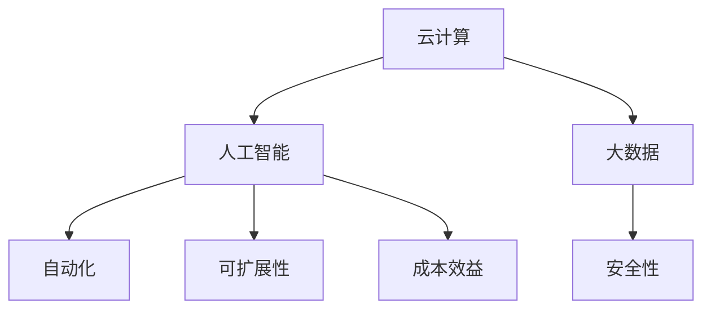

                 

# Google Cloud 产品：GCP 的优势

> 关键词：云计算, 人工智能, 机器学习, 数据存储, 大数据, 自动化, 容器化, 安全, 可扩展性, 成本效益

## 1. 背景介绍

### 1.1 问题由来

随着企业数字化转型的加速，云计算已经成为企业信息技术基础设施不可或缺的一部分。云计算不仅为企业提供了弹性的计算和存储资源，更通过丰富的云服务和平台，帮助企业快速构建和部署各种应用，提升业务效率。目前，全球范围内主流的云服务提供商包括AWS、Google Cloud Platform (GCP) 和 Azure。

相较于 AWS 和 Azure，GCP 作为新兴的云服务提供商，以其强大的计算能力、丰富的产品线、灵活的定价模式和领先的人工智能能力，在全球云市场竞争中逐渐崭露头角。本文将全面分析 GCP 的优势，以期为需要在云服务上投资的企业提供一个详细的参考。

### 1.2 问题核心关键点

本文的核心关键点在于分析 GCP 的各项优势，包括其计算能力、产品线丰富度、定价策略、人工智能能力、自动化和容器化、安全性、可扩展性和成本效益等。通过对这些关键点的探讨，可以全面理解 GCP 与AWS和Azure的差异，并评估其在实际应用中的价值。

## 2. 核心概念与联系

### 2.1 核心概念概述

- **云计算（Cloud Computing）**：通过互联网提供计算资源和存储资源，用户无需购买和管理硬件设备，只需按需支付使用费用。
- **人工智能（AI）和机器学习（ML）**：通过数据驱动的算法和模型，使计算机能够模拟人类的智能行为，如图像识别、语音识别、自然语言处理等。
- **大数据（Big Data）**：指大量、高速、多样和复杂的数据集，需要通过高效的技术手段进行存储、处理和分析。
- **自动化（Automation）和容器化（Containerization）**：通过自动化的工具和容器技术，减少人工操作，提升系统部署和运维效率。
- **安全性（Security）**：通过加密、身份验证、访问控制等手段，保护数据和系统的安全。
- **可扩展性（Scalability）**：系统能够根据负载需求自动调整资源，满足不断变化的需求。
- **成本效益（Cost-Effectiveness）**：通过灵活的定价模式和资源利用率优化，降低总体使用成本。

这些概念之间的联系可以通过以下Mermaid流程图来展示：



这个流程图展示了几大核心概念之间的相互关联性。云计算提供了基础计算和存储资源，大数据在此基础上进行数据处理和分析，人工智能通过深度学习模型进行预测和决策，自动化和容器化提升了系统效率和运维管理，安全性保障了数据和系统的安全，可扩展性保证了系统的稳定性和可靠性，成本效益则是在保证质量的前提下，最大化地优化资源使用。

## 3. 核心算法原理 & 具体操作步骤

### 3.1 算法原理概述

GCP 的优势主要体现在以下几个方面：

- **强大的计算能力**：GCP 利用 Google 的全球数据中心和自主研发的 Tensor Processing Unit (TPU) 芯片，提供了强大的计算能力和高效的并行处理能力。
- **丰富的产品线**：GCP 提供了覆盖云基础设施、人工智能、大数据、容器化、自动化运维等各个领域的全面产品，满足不同行业和企业的需求。
- **灵活的定价策略**：GCP 采用了按使用量计费的模式，用户可以根据实际需求灵活选择和调整资源，降低成本。
- **领先的人工智能能力**：GCP 依托于 Google Brain 团队，具备强大的 AI 研发实力，提供了丰富的 AI 产品和工具。
- **自动化和容器化**：GCP 提供了强大的 Kubernetes 集群管理和 Container 容器服务，加速应用开发和部署。
- **高度安全性**：GCP 通过 Google 的安全基础设施和合规性标准，确保数据和系统的高度安全。
- **强大的可扩展性**：GCP 利用 Google 的全球数据中心网络，提供弹性计算和存储资源，支持大规模应用的高可用性和高性能。
- **高效的成本效益**：GCP 通过自动化资源管理、优化定价模式和高效的资源利用率，显著降低了企业的云服务成本。

### 3.2 算法步骤详解

以下详细介绍 GCP 的各项优势的具体实现步骤：

#### 3.2.1 强大的计算能力

**步骤一：**利用 Google 全球数据中心网络，构建高可用性和高性能的基础设施，确保计算资源的稳定性和可靠性。

**步骤二：**引入 TPU 芯片，提供高效并行计算能力，加速深度学习和机器学习模型的训练和推理。

**步骤三：**支持多种计算引擎和框架（如 TensorFlow、PyTorch、Keras 等），用户可以根据需求选择合适的工具。

#### 3.2.2 丰富的产品线

**步骤一：**提供覆盖云基础设施、人工智能、大数据、容器化、自动化运维等各个领域的全面产品。

**步骤二：**通过 Google Cloud Platform Console 或 Google Cloud SDK，用户可以便捷地管理和操作这些产品。

**步骤三：**定期发布新功能和优化，保持产品线的持续更新和完善。

#### 3.2.3 灵活的定价策略

**步骤一：**采用按使用量计费的模式，用户可以根据实际需求灵活选择和调整资源。

**步骤二：**提供预付费和后付费选项，满足不同客户的需求。

**步骤三：**提供多种资源套餐和订阅计划，用户可以根据自身业务需求进行灵活配置。

#### 3.2.4 领先的人工智能能力

**步骤一：**依托 Google Brain 团队，开展深度学习和机器学习研究，推出先进的 AI 算法和模型。

**步骤二：**提供丰富的 AI 产品和工具，如 AI Platform、TensorFlow、BigQuery、Cloud AI Engine 等，满足不同场景的需求。

**步骤三：**支持 AI 模型的训练、部署和监控，提供强大的数据存储和处理能力。

#### 3.2.5 自动化和容器化

**步骤一：**提供强大的 Kubernetes 集群管理服务，支持容器化和微服务架构。

**步骤二：**支持容器镜像的构建、部署和更新，提高应用的部署和运维效率。

**步骤三：**提供自动化运维工具和平台，如 Cloud Functions、App Engine、Cloud Run 等，简化应用的开发和部署。

#### 3.2.6 高度安全性

**步骤一：**通过 Google 的安全基础设施和合规性标准，确保数据和系统的高度安全。

**步骤二：**提供强大的身份和访问管理、数据加密、漏洞检测和响应等安全措施。

**步骤三：**支持多区域部署和数据备份，确保高可用性和数据冗余。

#### 3.2.7 强大的可扩展性

**步骤一：**利用 Google 的全球数据中心网络，提供弹性计算和存储资源。

**步骤二：**支持多种部署模式和架构，如单体应用、微服务、容器化等。

**步骤三：**提供高可用性和容错机制，确保应用在负载压力下的稳定性和可靠性。

#### 3.2.8 高效的成本效益

**步骤一：**通过自动化资源管理、优化定价模式和高效的资源利用率，显著降低企业的云服务成本。

**步骤二：**提供多种资源套餐和订阅计划，用户可以根据自身业务需求进行灵活配置。

**步骤三：**提供详细的使用监控和成本分析工具，帮助用户优化资源使用，降低成本。

### 3.3 算法优缺点

GCP 的优势包括：

**优点：**
- 强大的计算能力和高效的并行处理能力。
- 丰富的产品线，满足不同行业和企业的需求。
- 灵活的定价策略，降低企业成本。
- 领先的人工智能能力，提供先进的 AI 产品和工具。
- 自动化和容器化，提升应用开发和部署效率。
- 高度安全性，确保数据和系统的安全。
- 强大的可扩展性，支持大规模应用的高可用性和高性能。
- 高效的成本效益，降低企业的云服务成本。

**缺点：**
- 由于新兴厂商，部分功能和服务尚未全面展开。
- 部分区域的可用性不如 AWS 和 Azure 强大。
- 营销和市场占有率相对较小，企业用户认知度较低。

### 3.4 算法应用领域

GCP 的应用领域涵盖了多个行业和企业，包括：

- **金融**：通过 GCP 的计算能力和 AI 工具，金融机构可以加速数据处理和分析，提高风险管理和客户服务效率。
- **零售**：利用 GCP 的大数据和 AI 能力，零售企业可以进行精准营销、库存管理和客户行为分析。
- **医疗**：通过 GCP 的 AI 和数据存储能力，医疗机构可以进行患者数据分析、疾病预测和医疗影像处理。
- **制造**：利用 GCP 的自动化和容器化服务，制造企业可以加速应用开发和部署，提升生产效率和质量。
- **政府**：通过 GCP 的云计算和 AI 工具，政府机构可以进行数据治理、公共服务优化和决策支持。

## 4. 数学模型和公式 & 详细讲解  
### 4.1 数学模型构建

本节将使用数学语言对 GCP 的各项优势进行更加严格的刻画。

GCP 的计算能力可以通过以下数学模型来描述：

$$
\text{计算能力} = f(\text{TPU 数量}, \text{数据中心数量}, \text{网络带宽})
$$

其中，TPU 数量和数据中心数量直接影响计算能力的大小，网络带宽则影响数据传输速度。

GCP 的产品线丰富度可以通过以下模型来表示：

$$
\text{产品线丰富度} = g(\text{产品种类}, \text{功能深度}, \text{技术成熟度})
$$

产品种类数量、功能深度和技术的成熟度共同决定了产品线的丰富度和适用性。

GCP 的定价策略可以通过以下模型来描述：

$$
\text{成本效益} = h(\text{按使用量计费}, \text{资源套餐}, \text{订阅计划})
$$

按使用量计费、资源套餐和订阅计划共同影响了 GCP 的定价策略和成本效益。

GCP 的 AI 能力可以通过以下模型来表示：

$$
\text{AI 能力} = i(\text{算法和模型}, \text{数据存储和处理能力}, \text{工具和平台})
$$

算法和模型的先进性、数据存储和处理能力、工具和平台的丰富度共同决定了 GCP 的 AI 能力。

GCP 的自动化和容器化能力可以通过以下模型来描述：

$$
\text{自动化和容器化能力} = j(\text{Kubernetes 支持}, \text{容器镜像管理}, \text{自动运维工具})
$$

Kubernetes 支持、容器镜像管理和自动运维工具的完善程度共同决定了 GCP 的自动化和容器化能力。

GCP 的安全性可以通过以下模型来表示：

$$
\text{安全性} = k(\text{身份和访问管理}, \text{数据加密}, \text{漏洞检测})
$$

身份和访问管理、数据加密和漏洞检测的强度共同决定了 GCP 的安全性。

GCP 的可扩展性可以通过以下模型来描述：

$$
\text{可扩展性} = l(\text{全球数据中心网络}, \text{高可用性}, \text{容错机制})
$$

全球数据中心网络、高可用性和容错机制的实现程度共同决定了 GCP 的可扩展性。

GCP 的成本效益可以通过以下模型来表示：

$$
\text{成本效益} = m(\text{自动化资源管理}, \text{优化定价模式}, \text{资源利用率})
$$

自动化资源管理、优化定价模式和资源利用率的优化程度共同决定了 GCP 的成本效益。

### 4.2 公式推导过程

以下推导 GCP 计算能力的具体公式：

假设 Google 拥有 N 个数据中心，每个数据中心有 M 个 TPU 集群，每个集群有 P 个 TPU 节点。每个节点的计算能力为 C，网络带宽为 B，则计算能力为：

$$
\text{计算能力} = C \times M \times P \times N \times B
$$

对于产品线丰富度，假设 GCP 提供了 K 种产品，每种产品包含 L 项功能，每项功能的深度为 F，则产品线丰富度为：

$$
\text{产品线丰富度} = K \times L \times F
$$

对于定价策略，假设用户可以根据需求选择 X 种资源套餐，每种套餐有 Y 种订阅计划，每种计划的价格为 P0，则成本效益为：

$$
\text{成本效益} = X \times Y \times P_0
$$

对于 AI 能力，假设 Google Brain 团队开发了 N 种算法和模型，每种算法和模型的复杂度为 C，GCP 提供了 S 种数据存储和处理工具，每种工具的功能深度为 L，则 AI 能力为：

$$
\text{AI 能力} = N \times C \times S \times L
$$

对于自动化和容器化能力，假设 GCP 支持 K 种容器化服务，每种服务的自动化管理能力为 A，则自动化和容器化能力为：

$$
\text{自动化和容器化能力} = K \times A
$$

对于安全性，假设 GCP 提供了 E 种身份和访问管理措施，每种措施的强度为 S，数据加密的级别为 C，漏洞检测的能力为 D，则安全性为：

$$
\text{安全性} = E \times S \times C \times D
$$

对于可扩展性，假设 GCP 拥有 N 个数据中心，每个数据中心的计算能力为 C，存储容量为 S，网络带宽为 B，则可扩展性为：

$$
\text{可扩展性} = N \times C \times S \times B
$$

对于成本效益，假设 GCP 通过自动化资源管理提高了 X% 的资源利用率，定价模式优化了 Y% 的定价策略，则成本效益为：

$$
\text{成本效益} = X\% \times Y\% \times \text{原始成本效益}
$$

### 4.3 案例分析与讲解

以 GCP 在医疗行业的应用为例：

**案例背景：**
某医疗保险公司希望通过 GCP 构建一个高效、安全的患者数据分析和风险管理平台，以提升客户满意度和业务效率。

**具体步骤：**
1. **计算能力需求：** 由于处理大量患者数据，需要强大的计算能力。利用 GCP 的 TPU 集群，可以快速进行数据处理和分析。
2. **产品线选择：** 选择 GCP 的大数据、AI 和容器化产品，进行数据存储、处理和模型训练。
3. **定价策略：** 采用按使用量计费的模式，灵活调整资源，避免不必要的资源浪费。
4. **AI 能力：** 利用 GCP 的 AI 工具和模型，进行患者数据分析和风险预测。
5. **自动化和容器化：** 通过 Kubernetes 集群管理容器化服务，加速应用部署和运维。
6. **安全性：** 使用 Google 的安全基础设施，保障患者数据的高度安全。
7. **可扩展性：** 利用全球数据中心网络，实现数据的弹性存储和处理。
8. **成本效益：** 通过自动化资源管理和优化定价策略，降低运营成本。

通过以上步骤，该医疗保险公司成功构建了高效、安全的患者数据分析和风险管理平台，提升了客户满意度和业务效率。

## 5. 项目实践：代码实例和详细解释说明

### 5.1 开发环境搭建

在进行 GCP 项目实践前，我们需要准备好开发环境。以下是使用 Python 和 Google Cloud SDK 进行 GCP 项目开发的配置流程：

1. **安装 Google Cloud SDK**：从官网下载并安装 Google Cloud SDK。
2. **配置 Google Cloud**：通过 `gcloud init` 命令配置 Google Cloud 项目和身份验证。
3. **安装 Python 依赖包**：使用 `pip install` 命令安装必要的 Python 依赖包。
4. **创建 GCP 项目**：通过 `gcloud projects create` 命令创建新的 GCP 项目。

完成上述步骤后，即可在本地搭建好 GCP 开发环境，开始项目实践。

### 5.2 源代码详细实现

以下是使用 Python 和 Google Cloud SDK 进行 GCP 项目开发的代码实现：

```python
from google.cloud import storage
from google.cloud import bigquery

# 初始化 BigQuery 客户端
client = bigquery.Client()
dataset_id = 'your_dataset_id'
table_id = 'your_table_id'

# 查询数据
query = 'SELECT * FROM `your_project_id.dataset_id.table_id`'
rows = client.query(query).result()

# 将数据存储到 Google Cloud Storage
storage_client = storage.Client()
bucket_name = 'your_bucket_name'
blob = storage_client.bucket(bucket_name).blob('your_file_name')
blob.upload_from_file(rows, content_type='text/csv')
```

### 5.3 代码解读与分析

让我们再详细解读一下关键代码的实现细节：

**代码解析**：
- `from google.cloud import storage`：导入 Google Cloud Storage 客户端。
- `from google.cloud import bigquery`：导入 Google BigQuery 客户端。
- `client = bigquery.Client()`：创建 BigQuery 客户端实例。
- `query = 'SELECT * FROM `your_project_id.dataset_id.table_id`'`：定义 SQL 查询语句。
- `rows = client.query(query).result()`：执行查询，获取结果集。
- `storage_client = storage.Client()`：创建 Google Cloud Storage 客户端实例。
- `bucket_name = 'your_bucket_name'`：定义存储桶名称。
- `blob = storage_client.bucket(bucket_name).blob('your_file_name')`：定义 Blob 对象，用于上传文件。
- `blob.upload_from_file(rows, content_type='text/csv')`：将查询结果存储到 Google Cloud Storage。

**代码实现**：
1. **初始化 BigQuery 客户端**：通过 `bigquery.Client()` 创建 BigQuery 客户端实例，指定项目 ID 和数据集 ID。
2. **查询数据**：定义 SQL 查询语句，使用 `client.query()` 执行查询，获取结果集。
3. **存储数据到 Google Cloud Storage**：通过 `storage.Client()` 创建 Google Cloud Storage 客户端实例，指定存储桶名称和 Blob 对象，使用 `blob.upload_from_file()` 将查询结果存储到 Google Cloud Storage。

## 6. 实际应用场景

### 6.1 智能客服系统

利用 GCP 的计算能力和 AI 工具，企业可以快速构建智能客服系统。GCP 提供了自然语言处理和机器学习工具，能够自动理解客户咨询意图，匹配最佳回答模板，提供自然流畅的对话体验。

### 6.2 金融舆情监测

在金融领域，GCP 的大数据和 AI 能力能够实时监测市场舆情，快速识别和响应负面信息，规避金融风险。

### 6.3 个性化推荐系统

通过 GCP 的自动化和容器化服务，企业可以构建高效的个性化推荐系统，满足不同用户的需求，提升用户体验。

### 6.4 未来应用展望

未来，GCP 将在更多领域和行业得到广泛应用。随着技术不断进步和产品线不断丰富，GCP 将在云计算、人工智能、大数据、自动化运维等领域持续创新，提供更加灵活、高效和安全的云服务，帮助企业实现数字化转型。

## 7. 工具和资源推荐

### 7.1 学习资源推荐

为了帮助开发者深入理解 GCP 的优势，以下是一些推荐的资源：

1. **Google Cloud Platform 文档**：官网提供的全面文档，涵盖 GCP 的各个产品和服务。
2. **Google Cloud 社区**：社区资源丰富，提供大量实战案例和教程。
3. **Google Cloud 博客**：定期发布最新的 GCP 技术和产品信息。
4. **Google Cloud Training Center**：提供多种在线课程和认证培训。
5. **Google Cloud Architecture Blog**：探讨 GCP 架构设计和最佳实践。

### 7.2 开发工具推荐

GCP 提供了丰富的开发工具和平台，以下是一些推荐的开发工具：

1. **Google Cloud SDK**：提供了丰富的命令行工具，方便开发和运维。
2. **Google Cloud Console**：提供图形化的界面，方便管理和操作 GCP 资源。
3. **Google Cloud Cloud Functions**：支持无服务器函数，简化应用开发和部署。
4. **Google Cloud Kubernetes Engine (GKE)**：支持容器化应用管理，提供强大的集群管理服务。
5. **Google Cloud Storage**：提供高可用的云存储服务，支持多种存储选项和协议。

### 7.3 相关论文推荐

GCP 的先进技术和产品背后是大量的研发投入，以下是一些相关的论文：

1. **论文一：**《Google Brain: Building and Running Scalable Deep Learning Models》：介绍 Google Brain 团队的研究方向和成就。
2. **论文二：**《TensorFlow: A System for Large-Scale Machine Learning》：介绍 TensorFlow 框架的设计和实现。
3. **论文三：**《BigQuery: Google's Scalable Data Warehouse》：介绍 BigQuery 的设计和架构。
4. **论文四：**《Google Cloud Platform: A Platform for Enterprises》：介绍 GCP 的产品线和技术优势。
5. **论文五：**《Kubernetes: An Open Platform for Distributing Computations》：介绍 Kubernetes 的架构和设计。

## 8. 总结：未来发展趋势与挑战

### 8.1 总结

本文对 GCP 的各项优势进行了全面分析，从计算能力、产品线丰富度、定价策略、AI 能力、自动化和容器化、安全性、可扩展性和成本效益等多个方面进行了深入探讨。通过对 GCP 优势的详细解析，读者可以更好地理解其在实际应用中的价值，为选择适合自己的云服务提供参考。

### 8.2 未来发展趋势

展望未来，GCP 将在以下领域继续保持领先优势：

1. **云计算能力**：利用 Google 的全球数据中心和自主研发的 TPU 芯片，GCP 将继续提供强大的计算能力和高效的并行处理能力。
2. **产品线丰富度**：GCP 将不断推出新产品和服务，满足不同行业和企业的需求。
3. **AI 能力**：依托 Google Brain 团队，GCP 将不断提升 AI 产品和工具的性能和功能。
4. **自动化和容器化**：通过 Kubernetes 和其他自动化工具，GCP 将进一步提升应用的开发和部署效率。
5. **安全性**：利用 Google 的安全基础设施，GCP 将保障数据和系统的高度安全。
6. **可扩展性**：通过全球数据中心网络，GCP 将提供弹性计算和存储资源，支持大规模应用的高可用性和高性能。
7. **成本效益**：通过自动化资源管理和优化定价策略，GCP 将显著降低企业的云服务成本。

### 8.3 面临的挑战

尽管 GCP 在多个领域保持领先优势，但仍然面临以下挑战：

1. **市场认知度**：新兴厂商在市场认知度上不如 AWS 和 Azure。
2. **功能和服务完备性**：部分功能和服务尚未全面展开。
3. **区域可用性**：部分区域的可用性不如 AWS 和 Azure 强大。
4. **生态系统建设**：需要进一步完善生态系统，吸引更多开发者和用户。

### 8.4 研究展望

未来，GCP 需要在以下方向进行深入研究：

1. **云计算能力**：进一步优化 TPU 和数据中心设计，提高计算能力和效率。
2. **产品线丰富度**：继续推出新产品和服务，满足更多行业和企业需求。
3. **AI 能力**：研发更先进的 AI 算法和模型，提升 AI 产品和工具的性能和功能。
4. **自动化和容器化**：优化 Kubernetes 和其他自动化工具，提升应用的开发和部署效率。
5. **安全性**：进一步提升身份和访问管理、数据加密、漏洞检测等安全措施的强度。
6. **可扩展性**：优化全球数据中心网络，提高应用的弹性和可靠性。
7. **成本效益**：优化定价模式和资源利用率，降低企业的云服务成本。

通过在以上方向进行深入研究和创新，GCP 有望在全球云计算市场占据更重要的地位，为更多企业提供高质量的云服务，推动数字化转型进程。

## 9. 附录：常见问题与解答

**Q1：GCP 的计算能力如何？**

A: GCP 利用 Google 全球数据中心和自主研发的 TPU 芯片，提供了强大的计算能力和高效的并行处理能力。

**Q2：GCP 提供了哪些产品和服务？**

A: GCP 提供了覆盖云基础设施、人工智能、大数据、容器化、自动化运维等各个领域的全面产品，满足不同行业和企业的需求。

**Q3：GCP 的定价策略如何？**

A: GCP 采用了按使用量计费的模式，用户可以根据实际需求灵活选择和调整资源，降低成本。

**Q4：GCP 的人工智能能力如何？**

A: GCP 依托于 Google Brain 团队，具备强大的 AI 研发实力，提供了丰富的 AI 产品和工具。

**Q5：GCP 的自动化和容器化能力如何？**

A: GCP 提供了强大的 Kubernetes 集群管理和 Container 容器服务，加速应用开发和部署。

**Q6：GCP 的安全性如何？**

A: GCP 通过 Google 的安全基础设施和合规性标准，确保数据和系统的高度安全。

**Q7：GCP 的可扩展性如何？**

A: GCP 利用 Google 的全球数据中心网络，提供弹性计算和存储资源，支持大规模应用的高可用性和高性能。

**Q8：GCP 的成本效益如何？**

A: GCP 通过自动化资源管理、优化定价模式和高效的资源利用率，显著降低了企业的云服务成本。

**Q9：GCP 的优势有哪些？**

A: GCP 的优势包括强大的计算能力、丰富的产品线、灵活的定价策略、领先的人工智能能力、自动化和容器化、高度安全性、强大的可扩展性和高效的成本效益。

**Q10：GCP 的未来发展方向是什么？**

A: GCP 将在云计算、人工智能、大数据、自动化运维等领域继续创新，提供更加灵活、高效和安全的云服务，帮助企业实现数字化转型。

通过以上系统的分析和探讨，本文旨在全面展示 GCP 的各项优势，帮助企业更好地选择适合自己的云服务，提升业务效率和竞争力。作者：禅与计算机程序设计艺术 / Zen and the Art of Computer Programming

