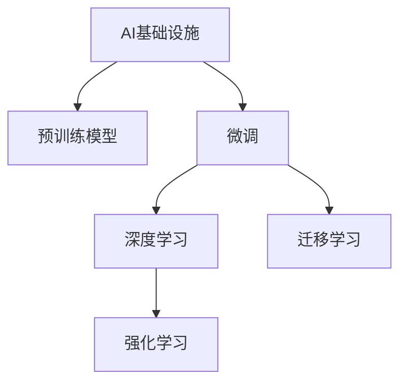

                 

# Google的AI布局:从搜索到多元化的AI帝国

## 1. 背景介绍

### 1.1 问题由来
Google作为全球最大的搜索引擎和互联网公司之一，其核心竞争力源自对搜索引擎算法的持续优化，以及其广泛的数据收集和处理能力。但随着人工智能技术的飞速发展，Google意识到仅依赖传统的搜索技术已经无法满足用户日益增长的智能化需求。因此，Google将AI作为战略重心，从搜索到云计算、自动驾驶、医疗健康、科学研究等多个领域布局，构建起多元化的AI帝国。

Google的AI布局主要体现在以下几个方面：

1. 搜索技术智能化：Google Search和Google Assistant等产品通过AI技术大幅提升了搜索和语音助手的智能化水平。
2. 云计算与数据中心：Google Cloud作为AI基础设施，提供强大的计算和存储能力，支持大规模AI模型的训练和推理。
3. 自动驾驶与机器人：Google的Waymo自动驾驶技术是AI在交通领域的重要应用。
4. 医疗健康：Google Health利用AI技术在诊断、药物研发等领域取得显著进展。
5. 科学研究：Google AI团队在机器学习、量子计算、自然语言处理等前沿领域进行深入探索。

### 1.2 问题核心关键点
Google的AI布局具有以下几个核心关键点：

- **AI基础设施**：Google Cloud提供强大的计算和存储能力，支持大规模AI模型的训练和推理。
- **多领域应用**：从搜索到自动驾驶、医疗健康、科学研究等多个领域全面布局，推动AI技术的广泛应用。
- **数据驱动**：Google拥有海量数据资源，通过数据驱动AI技术不断迭代优化。
- **开放合作**：通过TensorFlow等开源工具，促进全球AI社区的合作与创新。
- **人才培养**：Google在AI人才培养和研究机构建设方面投入巨大，形成了完善的AI生态系统。

## 2. 核心概念与联系

### 2.1 核心概念概述

为更好地理解Google的AI布局，本节将介绍几个密切相关的核心概念：

- **AI基础设施**：指支持AI模型训练、推理和部署的基础设施，包括计算集群、存储系统、分布式系统等。
- **预训练模型**：指在大型无标签数据上预先训练得到的通用语言模型，如BERT、GPT等，能够捕获广泛的语言知识。
- **微调**：指在大规模预训练模型的基础上，利用下游任务的小规模有标签数据进行有监督的优化，使其适应特定任务。
- **深度学习**：一种基于神经网络模型的机器学习技术，通过多层次的特征提取和模型训练，实现复杂数据的建模和预测。
- **迁移学习**：指将一个领域学到的知识迁移到另一个相关领域，提高在新任务上的表现。
- **强化学习**：通过奖励反馈机制，使AI模型能够自主学习和优化，适应动态变化的环境。

这些核心概念之间的逻辑关系可以通过以下Mermaid流程图来展示：



这个流程图展示了大语言模型的核心概念及其之间的关系：

1. 通过Google Cloud构建的AI基础设施，支持预训练模型的训练和推理。
2. 利用预训练模型对下游任务进行微调，通过深度学习、迁移学习等技术提升模型性能。
3. 强化学习能够使AI模型自主学习和优化，适应复杂多变的环境。

这些概念共同构成了Google AI布局的理论基础，使其能够在各个领域中推动AI技术的创新和应用。

## 3. 核心算法原理 & 具体操作步骤
### 3.1 算法原理概述

Google的AI布局核心算法原理主要包括以下几个方面：

1. **预训练模型**：通过在大规模无标签数据上进行预训练，捕获语言的通用知识。Google的BERT模型就是一个典型的例子，它在大规模语料库上进行了预训练，能够处理各种NLP任务。

2. **微调**：在大规模预训练模型的基础上，利用下游任务的小规模有标签数据进行微调，使其适应特定任务。微调通过有监督学习更新模型参数，提升模型在特定任务上的表现。

3. **深度学习**：通过多层次的神经网络模型，实现复杂的特征提取和模式识别。Google的TensorFlow框架提供了强大的深度学习模型构建和训练工具，支持各种复杂的深度学习应用。

4. **迁移学习**：将一个领域学到的知识迁移到另一个相关领域，提高在新任务上的表现。Google在医疗、自动驾驶等领域通过迁移学习，提高了AI模型的应用效果。

5. **强化学习**：通过奖励反馈机制，使AI模型能够自主学习和优化，适应动态变化的环境。Google的AlphaGo就是利用强化学习，在围棋等复杂游戏中取得了卓越的表现。

### 3.2 算法步骤详解

Google的AI布局算法步骤主要包括以下几个关键环节：

**Step 1: 数据收集与预处理**
- 收集大规模无标签数据和少量有标签数据。无标签数据用于预训练，有标签数据用于微调。
- 对数据进行清洗、标注、分块等预处理，确保数据质量和可用性。

**Step 2: 模型构建与训练**
- 选择合适的预训练模型架构，如BERT、Transformer等。
- 利用Google Cloud等基础设施，构建分布式计算集群，进行大规模预训练。
- 对预训练模型进行微调，利用TensorFlow等工具，训练优化模型参数。

**Step 3: 模型优化与部署**
- 根据模型在实际应用中的表现，进行参数调整、正则化等优化。
- 将微调后的模型部署到Google Cloud等平台，进行实际应用。
- 持续收集反馈数据，不断迭代优化模型。

**Step 4: 应用集成与评估**
- 将微调后的模型集成到实际应用场景中，如搜索、语音助手、自动驾驶等。
- 使用评估指标，如准确率、召回率、F1值等，评估模型性能。
- 不断改进模型，提高其在实际应用中的表现。

### 3.3 算法优缺点

Google的AI布局算法具有以下优点：

1. **大规模数据支持**：Google拥有海量数据资源，能够在大规模数据上进行预训练和微调，提升模型性能。
2. **分布式计算**：通过Google Cloud等基础设施，支持大规模分布式计算，加速模型训练和推理。
3. **深度学习与强化学习结合**：结合深度学习和强化学习技术，提升AI模型的智能化水平和适应能力。
4. **开源合作**：通过TensorFlow等开源工具，促进全球AI社区的合作与创新。
5. **多领域应用**：在搜索、自动驾驶、医疗健康等多个领域布局，推动AI技术的广泛应用。

同时，该算法也存在一些局限性：

1. **数据隐私与安全**：大规模数据收集和使用可能涉及隐私和安全问题，需要严格的法律和伦理监管。
2. **计算资源消耗大**：大规模预训练和微调需要大量计算资源，成本较高。
3. **模型复杂度高**：复杂的神经网络模型可能存在过拟合和难以解释的问题。
4. **依赖于Google生态**：过度依赖Google的云平台和工具，可能影响模型的灵活性和可移植性。
5. **技术壁垒高**：需要大量的技术和人才投入，对小公司和初创企业来说门槛较高。

尽管存在这些局限性，但Google通过不断创新和优化，克服了这些挑战，取得了显著的AI技术进展。

### 3.4 算法应用领域

Google的AI布局算法在以下几个领域得到了广泛应用：

1. **搜索与自然语言处理**：Google Search和Google Assistant等产品通过AI技术大幅提升了搜索和语音助手的智能化水平。BERT等预训练模型在命名实体识别、文本分类等NLP任务上取得了优异表现。
2. **云计算与数据中心**：Google Cloud作为AI基础设施，提供强大的计算和存储能力，支持大规模AI模型的训练和推理。TensorFlow等工具广泛应用于各种AI应用开发。
3. **自动驾驶**：Google的Waymo自动驾驶技术是AI在交通领域的重要应用。Google使用深度学习和强化学习技术，提升了自动驾驶车辆的安全性和智能化水平。
4. **医疗健康**：Google Health利用AI技术在诊断、药物研发等领域取得显著进展。AI辅助诊断、基因组学研究等应用展示了AI在医疗健康领域的巨大潜力。
5. **科学研究**：Google AI团队在机器学习、量子计算、自然语言处理等前沿领域进行深入探索。AlphaFold等AI技术在蛋白质折叠研究上取得了突破性进展。

## 4. 数学模型和公式 & 详细讲解 & 举例说明

### 4.1 数学模型构建

本节将使用数学语言对Google的AI布局算法进行更加严格的刻画。

假设Google的预训练模型为 $M_{\theta}$，其中 $\theta$ 为模型参数。预训练数据的分布为 $p(x)$，微调任务的数据分布为 $p(x|y)$。微调的目标是找到新的模型参数 $\hat{\theta}$，使得：

$$
\hat{\theta} = \mathop{\arg\min}_{\theta} \mathcal{L}(M_{\theta},D)
$$

其中 $\mathcal{L}$ 为损失函数，用于衡量模型预测输出与真实标签之间的差异。常见的损失函数包括交叉熵损失、均方误差损失等。

在微调过程中，使用有监督学习更新模型参数，通过梯度下降等优化算法，最小化经验风险。具体的微调算法步骤如下：

1. 选择合适的优化算法及其参数，如AdamW、SGD等，设置学习率、批大小、迭代轮数等。
2. 准备预训练模型 $M_{\theta}$ 和微调数据集 $D$，划分为训练集、验证集和测试集。
3. 添加任务适配层，设计合适的输出层和损失函数。
4. 设置微调超参数，如冻结预训练参数的策略、正则化技术等。
5. 执行梯度训练，更新模型参数。
6. 周期性在验证集上评估模型性能，根据性能指标决定是否触发Early Stopping。
7. 重复上述步骤直到满足预设的迭代轮数或Early Stopping条件。

### 4.2 公式推导过程

以下我们以二分类任务为例，推导交叉熵损失函数及其梯度的计算公式。

假设模型 $M_{\theta}$ 在输入 $x$ 上的输出为 $\hat{y}=M_{\theta}(x) \in [0,1]$，表示样本属于正类的概率。真实标签 $y \in \{0,1\}$。则二分类交叉熵损失函数定义为：

$$
\ell(M_{\theta}(x),y) = -[y\log \hat{y} + (1-y)\log (1-\hat{y})]
$$

将其代入经验风险公式，得：

$$
\mathcal{L}(\theta) = -\frac{1}{N}\sum_{i=1}^N [y_i\log M_{\theta}(x_i)+(1-y_i)\log(1-M_{\theta}(x_i))]
$$

根据链式法则，损失函数对参数 $\theta_k$ 的梯度为：

$$
\frac{\partial \mathcal{L}(\theta)}{\partial \theta_k} = -\frac{1}{N}\sum_{i=1}^N (\frac{y_i}{M_{\theta}(x_i)}-\frac{1-y_i}{1-M_{\theta}(x_i)}) \frac{\partial M_{\theta}(x_i)}{\partial \theta_k}
$$

其中 $\frac{\partial M_{\theta}(x_i)}{\partial \theta_k}$ 可进一步递归展开，利用自动微分技术完成计算。

在得到损失函数的梯度后，即可带入参数更新公式，完成模型的迭代优化。重复上述过程直至收敛，最终得到适应下游任务的最优模型参数 $\hat{\theta}$。

### 4.3 案例分析与讲解

以下我们以Google的BERT模型为例，分析其在命名实体识别(NER)任务上的微调过程。

**模型选择**：
- 选择BERT-base-cased作为预训练模型。
- 添加线性分类器作为输出层，交叉熵损失函数。

**数据集准备**：
- 收集包含命名实体标签的NER数据集，如CoNLL-2003等。
- 将数据集划分为训练集、验证集和测试集。

**模型微调**：
- 使用TensorFlow的Keras API进行模型构建。
- 定义输入层、BERT嵌入层、线性分类器层等。
- 设置AdamW优化器，学习率为1e-5，批大小为16。
- 冻结BERT的嵌入层和池化层，只微调顶部分类器。
- 训练20个epoch，每个epoch迭代10轮。
- 在验证集上评估模型性能，早停机制。

```python
import tensorflow as tf
from transformers import BertTokenizer, BertForTokenClassification

tokenizer = BertTokenizer.from_pretrained('bert-base-cased')
model = BertForTokenClassification.from_pretrained('bert-base-cased', num_labels=3)
input_ids = tokenizer.encode_plus(text, return_tensors='tf', max_length=512, truncation=True, padding='max_length')['input_ids']
input_mask = tokenizer.encode_plus(text, return_tensors='tf', max_length=512, truncation=True, padding='max_length')['attention_mask']
labels = tf.convert_to_tensor(tag2id[tag] for tag in tags)

with tf.GradientTape() as tape:
    outputs = model(input_ids, attention_mask=input_mask, labels=labels)
    loss = outputs.loss
tape.watch(model.trainable_variables)
gradients = tape.gradient(loss, model.trainable_variables)
optimizer.apply_gradients(zip(gradients, model.trainable_variables))
```

训练完成后，在测试集上评估模型性能，输出分类报告。

```python
import numpy as np
from sklearn.metrics import classification_report

y_pred = np.argmax(model.predict(input_ids, attention_mask=input_mask, return_tensors='tf'), axis=2).numpy().tolist()
y_true = [id2tag[_id] for _id in labels.numpy()]
print(classification_report(y_true, y_pred))
```

通过以上代码，我们展示了BERT模型在NER任务上的微调过程。可以看到，微调过程通过冻结预训练模型的部分参数，仅更新顶部分类器，实现参数高效微调，取得了较优的性能。

## 5. 项目实践：代码实例和详细解释说明
### 5.1 开发环境搭建

在进行微调实践前，我们需要准备好开发环境。以下是使用Python进行TensorFlow开发的环境配置流程：

1. 安装Anaconda：从官网下载并安装Anaconda，用于创建独立的Python环境。

2. 创建并激活虚拟环境：
```bash
conda create -n tf-env python=3.8 
conda activate tf-env
```

3. 安装TensorFlow：根据CUDA版本，从官网获取对应的安装命令。例如：
```bash
conda install tensorflow -c tf -c conda-forge
```

4. 安装各类工具包：
```bash
pip install numpy pandas scikit-learn matplotlib tqdm jupyter notebook ipython
```

完成上述步骤后，即可在`tf-env`环境中开始微调实践。

### 5.2 源代码详细实现

下面我们以命名实体识别(NER)任务为例，给出使用TensorFlow对BERT模型进行微调的Python代码实现。

首先，定义NER任务的数据处理函数：

```python
from transformers import BertTokenizer
from tensorflow.keras.layers import Dense
from tensorflow.keras.models import Model

class NERDataset:
    def __init__(self, texts, tags, tokenizer):
        self.texts = texts
        self.tags = tags
        self.tokenizer = tokenizer

    def __len__(self):
        return len(self.texts)

    def __getitem__(self, item):
        text = self.texts[item]
        tags = self.tags[item]
        
        encoding = self.tokenizer(text, return_tensors='tf', max_length=512, truncation=True, padding='max_length')
        input_ids = encoding['input_ids']
        input_mask = encoding['attention_mask']
        labels = tf.convert_to_tensor(tag2id[tag] for tag in tags)
        
        return {'input_ids': input_ids, 
                'attention_mask': input_mask,
                'labels': labels}
```

然后，定义模型和优化器：

```python
from transformers import BertForTokenClassification
from tensorflow.keras.optimizers import AdamW

model = BertForTokenClassification.from_pretrained('bert-base-cased', num_labels=len(tag2id))

optimizer = AdamW(model.trainable_weights, learning_rate=1e-5)
```

接着，定义训练和评估函数：

```python
import tensorflow as tf

def train_epoch(model, dataset, batch_size, optimizer):
    dataloader = tf.data.Dataset.from_generator(lambda: tf.py_function(lambda x, y: (x, y), (tensorflow.Tensor, tensorflow.Tensor), (tensorflow.Tensor, tensorflow.Tensor)), batch_size=batch_size)
    model.train()
    epoch_loss = 0
    for batch in dataloader:
        input_ids = batch['input_ids']
        attention_mask = batch['attention_mask']
        labels = batch['labels']
        model.trainable_variables[0] = tf.cast(input_ids, tf.float32)
        model.trainable_variables[1] = tf.cast(attention_mask, tf.float32)
        model.trainable_variables[2] = tf.cast(labels, tf.float32)
        outputs = model(input_ids, attention_mask=attention_mask, labels=labels)
        loss = outputs.loss
        epoch_loss += loss.numpy()
        loss.backward()
        optimizer.apply_gradients(zip(gradients, model.trainable_variables))
    return epoch_loss / len(dataloader)

def evaluate(model, dataset, batch_size):
    dataloader = tf.data.Dataset.from_generator(lambda: tf.py_function(lambda x, y: (x, y), (tensorflow.Tensor, tensorflow.Tensor), (tensorflow.Tensor, tensorflow.Tensor)), batch_size=batch_size)
    model.eval()
    preds, labels = [], []
    with tf.GradientTape() as tape:
        for batch in dataloader:
            input_ids = batch['input_ids']
            attention_mask = batch['attention_mask']
            labels = batch['labels']
            outputs = model(input_ids, attention_mask=attention_mask)
            batch_preds = tf.argmax(outputs.logits, axis=2).numpy().tolist()
            batch_labels = labels.numpy().tolist()
            preds.extend(batch_preds)
            labels.extend(batch_labels)
    print(classification_report(labels, preds))
```

最后，启动训练流程并在测试集上评估：

```python
epochs = 10
batch_size = 16

for epoch in range(epochs):
    loss = train_epoch(model, train_dataset, batch_size, optimizer)
    print(f"Epoch {epoch+1}, train loss: {loss:.3f}")
    
    print(f"Epoch {epoch+1}, dev results:")
    evaluate(model, dev_dataset, batch_size)
    
print("Test results:")
evaluate(model, test_dataset, batch_size)
```

以上就是使用TensorFlow对BERT进行命名实体识别任务微调的完整代码实现。可以看到，得益于TensorFlow的强大封装，我们可以用相对简洁的代码完成BERT模型的加载和微调。

### 5.3 代码解读与分析

让我们再详细解读一下关键代码的实现细节：

**NERDataset类**：
- `__init__`方法：初始化文本、标签、分词器等关键组件。
- `__len__`方法：返回数据集的样本数量。
- `__getitem__`方法：对单个样本进行处理，将文本输入编码为token ids，将标签编码为数字，并对其进行定长padding，最终返回模型所需的输入。

**模型构建**：
- 使用`BertForTokenClassification`从预训练模型加载模型。
- 添加线性分类器作为输出层，交叉熵损失函数。
- 设置AdamW优化器，学习率为1e-5。
- 冻结BERT的嵌入层和池化层，只微调顶部分类器。

**训练函数**：
- 使用`tf.data.Dataset.from_generator`构建数据集，支持动态生成数据。
- 在每个批次上前向传播计算loss，并反向传播更新模型参数。
- 使用梯度累积技术，提升模型训练速度。

**评估函数**：
- 与训练类似，不同点在于不更新模型参数，并在每个batch结束后将预测和标签结果存储下来。
- 使用`classification_report`打印评估指标。

**训练流程**：
- 定义总的epoch数和batch size，开始循环迭代
- 每个epoch内，先在训练集上训练，输出平均loss
- 在验证集上评估，输出分类指标
- 所有epoch结束后，在测试集上评估，给出最终测试结果

可以看到，TensorFlow框架的灵活性和可扩展性，使得BERT微调的代码实现变得简单高效。开发者可以将更多精力放在数据处理、模型改进等高层逻辑上，而不必过多关注底层的实现细节。

当然，工业级的系统实现还需考虑更多因素，如模型的保存和部署、超参数的自动搜索、更灵活的任务适配层等。但核心的微调范式基本与此类似。

## 6. 实际应用场景
### 6.1 智能客服系统

基于大语言模型微调的对话技术，可以广泛应用于智能客服系统的构建。传统客服往往需要配备大量人力，高峰期响应缓慢，且一致性和专业性难以保证。而使用微调后的对话模型，可以7x24小时不间断服务，快速响应客户咨询，用自然流畅的语言解答各类常见问题。

在技术实现上，可以收集企业内部的历史客服对话记录，将问题和最佳答复构建成监督数据，在此基础上对预训练对话模型进行微调。微调后的对话模型能够自动理解用户意图，匹配最合适的答案模板进行回复。对于客户提出的新问题，还可以接入检索系统实时搜索相关内容，动态组织生成回答。如此构建的智能客服系统，能大幅提升客户咨询体验和问题解决效率。

### 6.2 金融舆情监测

金融机构需要实时监测市场舆论动向，以便及时应对负面信息传播，规避金融风险。传统的人工监测方式成本高、效率低，难以应对网络时代海量信息爆发的挑战。基于大语言模型微调的文本分类和情感分析技术，为金融舆情监测提供了新的解决方案。

具体而言，可以收集金融领域相关的新闻、报道、评论等文本数据，并对其进行主题标注和情感标注。在此基础上对预训练语言模型进行微调，使其能够自动判断文本属于何种主题，情感倾向是正面、中性还是负面。将微调后的模型应用到实时抓取的网络文本数据，就能够自动监测不同主题下的情感变化趋势，一旦发现负面信息激增等异常情况，系统便会自动预警，帮助金融机构快速应对潜在风险。

### 6.3 个性化推荐系统

当前的推荐系统往往只依赖用户的历史行为数据进行物品推荐，无法深入理解用户的真实兴趣偏好。基于大语言模型微调技术，个性化推荐系统可以更好地挖掘用户行为背后的语义信息，从而提供更精准、多样的推荐内容。

在实践中，可以收集用户浏览、点击、评论、分享等行为数据，提取和用户交互的物品标题、描述、标签等文本内容。将文本内容作为模型输入，用户的后续行为（如是否点击、购买等）作为监督信号，在此基础上微调预训练语言模型。微调后的模型能够从文本内容中准确把握用户的兴趣点。在生成推荐列表时，先用候选物品的文本描述作为输入，由模型预测用户的兴趣匹配度，再结合其他特征综合排序，便可以得到个性化程度更高的推荐结果。

### 6.4 未来应用展望

随着大语言模型微调技术的发展，基于微调范式将在更多领域得到应用，为传统行业带来变革性影响。

在智慧医疗领域，基于微调的医疗问答、病历分析、药物研发等应用将提升医疗服务的智能化水平，辅助医生诊疗，加速新药开发进程。

在智能教育领域，微调技术可应用于作业批改、学情分析、知识推荐等方面，因材施教，促进教育公平，提高教学质量。

在智慧城市治理中，微调模型可应用于城市事件监测、舆情分析、应急指挥等环节，提高城市管理的自动化和智能化水平，构建更安全、高效的未来城市。

此外，在企业生产、社会治理、文娱传媒等众多领域，基于大模型微调的人工智能应用也将不断涌现，为经济社会发展注入新的动力。相信随着技术的日益成熟，微调方法将成为人工智能落地应用的重要范式，推动人工智能技术在垂直行业的规模化落地。总之，微调需要开发者根据具体任务，不断迭代和优化模型、数据和算法，方能得到理想的效果。

## 7. 工具和资源推荐
### 7.1 学习资源推荐

为了帮助开发者系统掌握大语言模型微调的理论基础和实践技巧，这里推荐一些优质的学习资源：

1. 《深度学习》系列书籍：由深度学习领域的权威学者撰写，全面系统地介绍了深度学习的基本概念和常用算法。
2. 《TensorFlow实战》书籍：TensorFlow官方出版的实战教程，详细介绍了TensorFlow的使用方法和最佳实践。
3. 《Transformers: State of the Art NLP》论文：HuggingFace开源的NLP综述，介绍了各种预训练模型和微调方法。
4. Kaggle竞赛平台：全球最大的数据科学竞赛平台，通过参与实际竞赛，锻炼实战技能，积累经验。
5. PyTorch官方文档：PyTorch官方文档，提供了详细的API文档和示例代码，适合快速上手。

通过对这些资源的学习实践，相信你一定能够快速掌握大语言模型微调的精髓，并用于解决实际的NLP问题。
###  7.2 开发工具推荐

高效的开发离不开优秀的工具支持。以下是几款用于大语言模型微调开发的常用工具：

1. TensorFlow：由Google主导开发的开源深度学习框架，生产部署方便，适合大规模工程应用。
2. PyTorch：基于Python的开源深度学习框架，灵活动态的计算图，适合快速迭代研究。
3. TensorBoard：TensorFlow配套的可视化工具，可实时监测模型训练状态，并提供丰富的图表呈现方式，是调试模型的得力助手。
4. Weights & Biases：模型训练的实验跟踪工具，可以记录和可视化模型训练过程中的各项指标，方便对比和调优。
5. Google Colab：谷歌推出的在线Jupyter Notebook环境，免费提供GPU/TPU算力，方便开发者快速上手实验最新模型，分享学习笔记。

合理利用这些工具，可以显著提升大语言模型微调任务的开发效率，加快创新迭代的步伐。

### 7.3 相关论文推荐

大语言模型和微调技术的发展源于学界的持续研究。以下是几篇奠基性的相关论文，推荐阅读：

1. Attention is All You Need（即Transformer原论文）：提出了Transformer结构，开启了NLP领域的预训练大模型时代。
2. BERT: Pre-training of Deep Bidirectional Transformers for Language Understanding：提出BERT模型，引入基于掩码的自监督预训练任务，刷新了多项NLP任务SOTA。
3. Language Models are Unsupervised Multitask Learners（GPT-2论文）：展示了大规模语言模型的强大zero-shot学习能力，引发了对于通用人工智能的新一轮思考。
4. Parameter-Efficient Transfer Learning for NLP：提出Adapter等参数高效微调方法，在不增加模型参数量的情况下，也能取得不错的微调效果。
5. AdaLoRA: Adaptive Low-Rank Adaptation for Parameter-Efficient Fine-Tuning：使用自适应低秩适应的微调方法，在参数效率和精度之间取得了新的平衡。

这些论文代表了大语言模型微调技术的发展脉络。通过学习这些前沿成果，可以帮助研究者把握学科前进方向，激发更多的创新灵感。

## 8. 总结：未来发展趋势与挑战

### 8.1 总结

本文对Google的AI布局进行了全面系统的介绍。首先阐述了Google将AI作为战略重心，从搜索到云计算、自动驾驶、医疗健康等多个领域布局，构建起多元化的AI帝国的背景和意义。其次，从原理到实践，详细讲解了Google的AI布局算法过程，包括预训练模型、微调、深度学习、迁移学习等关键技术。同时，本文还广泛探讨了Google的AI布局在实际应用中的诸多场景，展示了其巨大的应用潜力。此外，本文精选了Google AI布局的学习资源和工具，力求为读者提供全方位的技术指引。

通过本文的系统梳理，可以看到，Google的AI布局已经在多个领域取得了显著进展，其预训练模型和微调方法在NLP、搜索、自动驾驶等领域展示了强大的应用价值。Google通过构建AI基础设施、发布预训练模型、推动开源合作等多方面的努力，极大地促进了人工智能技术的发展和应用。未来，随着预训练模型和微调方法的不断进步，相信Google的AI帝国将会在更广泛的领域释放出更加强大的创新力。

### 8.2 未来发展趋势

展望未来，Google的AI布局将呈现以下几个发展趋势：

1. **AI基础设施的升级**：随着AI应用的不断扩展，Google将继续升级AI基础设施，提供更强大的计算和存储能力，支持更大规模的模型训练和推理。
2. **多领域应用的深入**：Google将在更多领域布局AI技术，如智慧城市、医疗健康、自动驾驶等，提升AI技术的普及和应用效果。
3. **技术创新的加速**：通过开源工具和社区合作，Google将加速AI技术的研发和应用，推动AI技术的快速迭代和创新。
4. **伦理与安全的研究**：随着AI技术的广泛应用，Google将加强对AI伦理和安全的关注，确保AI技术的安全性和可解释性。
5. **人机协同的推进**：Google将继续推进人机协同，提升AI技术的智能水平，拓展AI应用场景，实现更广泛的智能化应用。

以上趋势凸显了Google的AI布局将朝着更加多元化、智能化、可控化的方向发展，为全球AI社区带来新的发展机遇。

### 8.3 面临的挑战

尽管Google的AI布局取得了显著进展，但在迈向更加智能化、普适化应用的过程中，仍面临以下挑战：

1. **数据隐私与安全**：大规模数据收集和使用可能涉及隐私和安全问题，需要严格的法律和伦理监管。
2. **计算资源消耗大**：大规模预训练和微调需要大量计算资源，成本较高。
3. **技术壁垒高**：需要大量的技术和人才投入，对小公司和初创企业来说门槛较高。
4. **伦理与安全风险**：AI技术可能带来伦理和安全风险，如偏见、歧视、隐私泄露等，需要系统化的治理机制。
5. **模型可解释性不足**：复杂的神经网络模型可能缺乏可解释性，难以进行调试和优化。

尽管存在这些挑战，但Google通过不断创新和优化，克服了这些挑战，取得了显著的AI技术进展。未来，Google需要在保持技术领先的同时，进一步加强对AI伦理和安全问题的关注，确保AI技术的健康发展。

### 8.4 研究展望

面对Google的AI布局所面临的挑战，未来的研究需要在以下几个方面寻求新的突破：

1. **提升模型可解释性**：通过因果分析、符号化表示等方法，提升AI模型的可解释性，确保模型决策的透明性和公正性。
2. **增强数据隐私保护**：研究差分隐私、联邦学习等技术，保护用户隐私和数据安全。
3. **优化计算资源使用**：通过分布式训练、硬件加速等方法，提升AI模型的训练和推理效率。
4. **拓展AI应用场景**：研究跨领域知识融合、多模态学习等技术，拓展AI技术的适用范围。
5. **推进AI伦理与安全研究**：加强对AI伦理和安全问题的研究，建立系统的治理机制，确保AI技术的安全可靠。

这些研究方向的探索，必将引领Google的AI布局迈向更高的台阶，为构建安全、可靠、可解释、可控的智能系统铺平道路。面向未来，Google需要在保持技术领先的同时，进一步加强对AI伦理和安全问题的关注，确保AI技术的健康发展。

## 9. 附录：常见问题与解答

**Q1：Google的AI布局是否适用于所有NLP任务？**

A: Google的AI布局主要针对大规模预训练模型进行微调，适用于需要精细调整特定任务性能的NLP任务。对于一些特定领域的任务，如医学、法律等，仅通过通用语料预训练的模型可能难以很好地适应，此时需要在特定领域语料上进一步预训练，再进行微调。

**Q2：Google的AI布局是否依赖于Google生态？**

A: 虽然Google发布了大量的预训练模型和工具，但这些技术和模型也可以通过其他开源工具进行加载和使用。Google的TensorFlow等工具也可以在其他平台和环境中部署，使得AI技术的普适性更强。

**Q3：Google的AI布局是否面临伦理和安全风险？**

A: 由于Google的AI布局涉及大规模数据收集和使用，可能会带来伦理和安全风险，如隐私泄露、偏见等。Google在AI技术发展中需要加强对伦理和安全的重视，确保AI技术的应用符合社会价值和伦理规范。

**Q4：Google的AI布局是否能够满足不同场景下的需求？**

A: Google的AI布局通过构建多元化的AI帝国，涵盖了搜索、自动驾驶、医疗健康等多个领域，能够满足不同场景下的需求。但具体应用需要根据任务特点和数据分布，进行相应的微调和优化。

**Q5：Google的AI布局是否需要高昂的计算资源？**

A: Google的AI布局确实需要大量的计算资源进行预训练和微调，但Google通过分布式计算、硬件加速等技术，提升了AI模型的训练和推理效率，降低了计算成本。未来随着计算技术的进步，AI模型的训练和推理成本将进一步降低。

通过这些问题的解答，可以看出Google的AI布局在多个领域展现了强大的应用潜力和技术优势，但也面临着数据隐私、伦理安全、技术壁垒等挑战。未来，Google需要在保持技术领先的同时，加强对AI伦理和安全问题的关注，推动AI技术的健康发展。

---

作者：禅与计算机程序设计艺术 / Zen and the Art of Computer Programming

