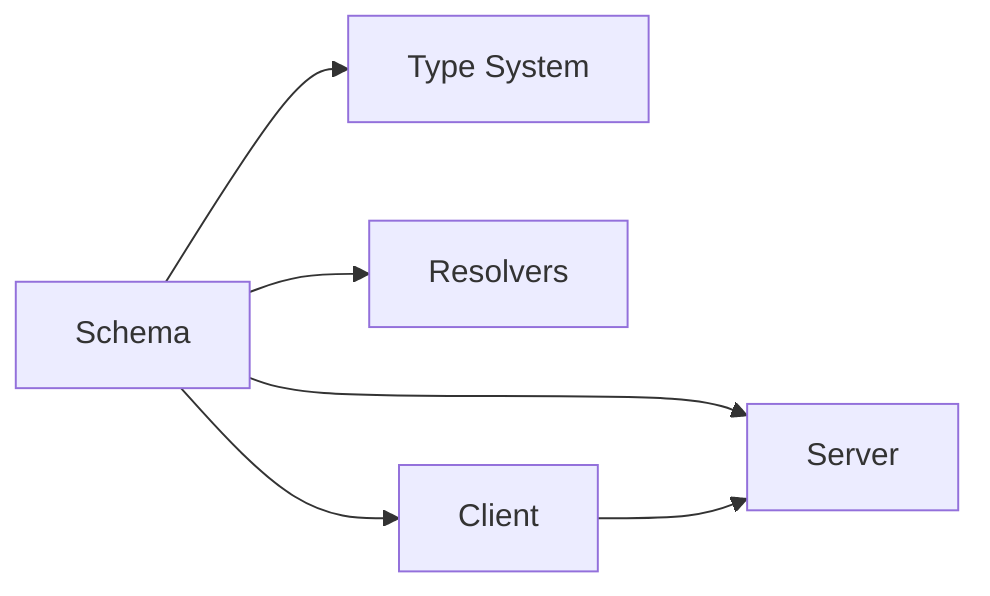

                 

# GraphQL：灵活查询语言的应用

> 关键词：GraphQL, 查询语言, 前端, 后端, 数据接口, REST, 动态数据, 性能优化, 开发者体验, API设计, 版本管理

## 1. 背景介绍

### 1.1 问题由来

随着Web应用的发展，API作为前后端数据交互的核心接口，其设计和使用日益成为决定应用性能和用户体验的关键因素。早期的API设计往往采用静态和固定的结构，即基于RESTful架构风格的API，通过URL和HTTP动词定义了固定的数据请求和响应结构，这样的API设计虽然简单直观，但存在以下问题：

- **数据冗余**：对于不同的客户端需求，可能需要构建多个RESTful API，导致数据冗余和维护成本高。
- **性能问题**：每个请求都可能返回全量数据，对于复杂数据结构和大量数据的情况下，前后端通信和处理效率低下。
- **开发者体验差**：客户端需要针对不同的API请求构建多个接口调用代码，增加了开发复杂度和维护成本。

在这样的背景下，GraphQL应运而生，作为一种灵活的查询语言，它允许客户端精确地请求所需数据，显著降低了前后端交互的复杂度和性能开销，提高了开发效率和用户体验。

### 1.2 问题核心关键点

GraphQL的核心思想是让客户端决定它需要哪些数据，服务器只返回所需的数据，从而避免了数据冗余和性能问题。GraphQL设计了一个灵活的查询语言，允许客户端通过一个单一的API请求获取多个资源的信息，并且服务器只返回客户端请求的数据，避免了不必要的响应数据传输。

GraphQL的优点包括：
- 数据灵活性：客户端可以根据需要查询所需的数据，减少了数据冗余。
- 性能优化：避免了不必要的响应数据传输，提高了前后端通信和处理的效率。
- 开发者体验：减少了接口调用的复杂度，提高了开发效率和维护性。

但同时也存在一些局限性：
- 学习曲线：GraphQL的复杂查询语言可能需要一定的学习成本。
- 版本管理：GraphQL查询语言的版本管理较为复杂，需要协调不同客户端之间的版本兼容性。

## 2. 核心概念与联系

### 2.1 核心概念概述

为了更好地理解GraphQL的核心概念和设计思想，本节将介绍以下几个关键概念：

- **GraphQL**：一种灵活的查询语言和运行时，允许客户端精确地请求所需数据，服务器只返回客户端请求的数据。
- **Schema**：GraphQL查询语言的设计框架，定义了所有可用数据类型和它们之间的相互关系。
- **Resolvers**：实现Schema中定义的数据类型和字段，用于解析客户端的查询请求。
- **Client**：GraphQL客户端，用于发送查询请求，接收服务器响应。
- **Server**：GraphQL服务器，用于解析查询请求，生成响应数据。
- **Type System**：GraphQL的核心数据结构，定义了数据类型和它们之间的相互关系。

这些核心概念之间的逻辑关系可以通过以下Mermaid流程图来展示：



这个流程图展示了大语言模型的核心概念及其之间的关系：

1. GraphQL通过Schema定义了查询语言的设计框架。
2. Schema中的数据类型和字段由Resolvers实现。
3. Client向Server发送查询请求。
4. Server解析查询请求，生成响应数据。
5. Type System定义了数据类型和它们之间的相互关系。

这些概念共同构成了GraphQL的设计框架，使得它能够灵活地处理前后端数据交互。

## 3. 核心算法原理 & 具体操作步骤
### 3.1 算法原理概述

GraphQL的查询语言是基于类型系统的，它允许客户端通过一个单一的API请求获取多个资源的信息，并且服务器只返回客户端请求的数据。GraphQL的核心思想是让客户端决定它需要哪些数据，服务器只返回所需的数据，从而避免了数据冗余和性能问题。

GraphQL的查询语言通过Schema定义，Schema是一个类型系统，定义了所有可用数据类型和它们之间的相互关系。客户端通过Schema查询所需的数据，服务器根据Schema中的Resolvers解析查询请求，生成响应数据。

GraphQL的查询过程分为以下几个步骤：

1. 客户端发送查询请求。
2. 服务器解析查询请求，生成查询计划。
3. 服务器执行查询计划，生成响应数据。
4. 客户端接收响应数据，并进行处理。

### 3.2 算法步骤详解

以下是GraphQL查询语言的核心算法步骤：

**Step 1: 设计Schema**

Schema是GraphQL的核心，它定义了所有可用数据类型和它们之间的相互关系。Schema通常包括数据类型、字段、输入类型、接口等。

```graphQL
type Query {
    user(id: ID!): User
    users: [User]
}

type Mutation {
    addUser(name: String!, age: Int!): User
    updateUser(id: ID!, name: String, age: Int): User
}
```

**Step 2: 实现Resolvers**

Resolvers是GraphQL的核心实现，它负责解析客户端的查询请求，并生成响应数据。Resolvers通常是一个函数，接收查询参数并返回响应数据。

```javascript
const users = [
    { id: 1, name: 'Alice', age: 30 },
    { id: 2, name: 'Bob', age: 25 },
    { id: 3, name: 'Charlie', age: 35 }
];

const resolvers = {
    Query: {
        users: () => users,
        user: ({ id }) => users.find(user => user.id === id)
    },
    Mutation: {
        addUser: ({ name, age }) => {
            const newUser = { id: users.length + 1, name, age };
            users.push(newUser);
            return newUser;
        },
        updateUser: ({ id, name, age }) => {
            const index = users.findIndex(user => user.id === id);
            const updatedUser = { ...users[index], name, age };
            users[index] = updatedUser;
            return updatedUser;
        }
    }
};
```

**Step 3: 发送查询请求**

客户端通过GraphQL客户端发送查询请求，通常使用Fetch、Axios等HTTP客户端库。

```javascript
fetch('http://localhost:4000/graphql', {
    method: 'POST',
    headers: {
        'Content-Type': 'application/json'
    },
    body: JSON.stringify({
        query: `
            query {
                users {
                    id
                    name
                    age
                }
            }
        `
    })
}).then(response => response.json()).then(data => console.log(data.data.users));
```

**Step 4: 解析响应数据**

服务器返回响应数据，通常包括Data和Errors字段。Data字段包含了客户端请求的查询结果，Errors字段包含了查询过程中出现的错误信息。

```javascript
{
    "data": {
        "users": [
            {"id": 1, "name": "Alice", "age": 30},
            {"id": 2, "name": "Bob", "age": 25},
            {"id": 3, "name": "Charlie", "age": 35}
        ]
    }
}
```

### 3.3 算法优缺点

GraphQL的优点包括：
- 数据灵活性：客户端可以根据需要查询所需的数据，减少了数据冗余。
- 性能优化：避免了不必要的响应数据传输，提高了前后端通信和处理的效率。
- 开发者体验：减少了接口调用的复杂度，提高了开发效率和维护性。

但同时也存在一些局限性：
- 学习曲线：GraphQL的复杂查询语言可能需要一定的学习成本。
- 版本管理：GraphQL查询语言的版本管理较为复杂，需要协调不同客户端之间的版本兼容性。

## 4. 数学模型和公式 & 详细讲解 & 举例说明

### 4.1 数学模型构建

GraphQL的查询语言是基于类型系统的，它允许客户端通过一个单一的API请求获取多个资源的信息，并且服务器只返回客户端请求的数据。GraphQL的核心思想是让客户端决定它需要哪些数据，服务器只返回所需的数据，从而避免了数据冗余和性能问题。

GraphQL的查询过程可以分为以下几个步骤：

1. 客户端发送查询请求。
2. 服务器解析查询请求，生成查询计划。
3. 服务器执行查询计划，生成响应数据。
4. 客户端接收响应数据，并进行处理。

GraphQL的查询语言通常包括数据类型、字段、输入类型、接口等。Schema定义了所有可用数据类型和它们之间的相互关系。Resolvers是GraphQL的核心实现，它负责解析客户端的查询请求，并生成响应数据。

### 4.2 公式推导过程

GraphQL的查询语言是基于类型系统的，它允许客户端通过一个单一的API请求获取多个资源的信息，并且服务器只返回客户端请求的数据。GraphQL的核心思想是让客户端决定它需要哪些数据，服务器只返回所需的数据，从而避免了数据冗余和性能问题。

GraphQL的查询过程可以分为以下几个步骤：

1. 客户端发送查询请求。
2. 服务器解析查询请求，生成查询计划。
3. 服务器执行查询计划，生成响应数据。
4. 客户端接收响应数据，并进行处理。

GraphQL的查询语言通常包括数据类型、字段、输入类型、接口等。Schema定义了所有可用数据类型和它们之间的相互关系。Resolvers是GraphQL的核心实现，它负责解析客户端的查询请求，并生成响应数据。

### 4.3 案例分析与讲解

以下是GraphQL查询语言的一个简单案例，展示了如何通过GraphQL获取用户信息：

**Schema定义：**

```graphQL
type User {
    id: ID!
    name: String!
    age: Int!
}

type Query {
    user(id: ID!): User
    users: [User]
}

type Mutation {
    addUser(name: String!, age: Int!): User
    updateUser(id: ID!, name: String, age: Int): User
}
```

**Resolvers实现：**

```javascript
const users = [
    { id: 1, name: 'Alice', age: 30 },
    { id: 2, name: 'Bob', age: 25 },
    { id: 3, name: 'Charlie', age: 35 }
];

const resolvers = {
    Query: {
        users: () => users,
        user: ({ id }) => users.find(user => user.id === id)
    },
    Mutation: {
        addUser: ({ name, age }) => {
            const newUser = { id: users.length + 1, name, age };
            users.push(newUser);
            return newUser;
        },
        updateUser: ({ id, name, age }) => {
            const index = users.findIndex(user => user.id === id);
            const updatedUser = { ...users[index], name, age };
            users[index] = updatedUser;
            return updatedUser;
        }
    }
};
```

**客户端查询：**

```javascript
fetch('http://localhost:4000/graphql', {
    method: 'POST',
    headers: {
        'Content-Type': 'application/json'
    },
    body: JSON.stringify({
        query: `
            query {
                users {
                    id
                    name
                    age
                }
            }
        `
    })
}).then(response => response.json()).then(data => console.log(data.data.users));
```

**服务器响应：**

```javascript
{
    "data": {
        "users": [
            {"id": 1, "name": "Alice", "age": 30},
            {"id": 2, "name": "Bob", "age": 25},
            {"id": 3, "name": "Charlie", "age": 35}
        ]
    }
}
```

## 5. 项目实践：代码实例和详细解释说明
### 5.1 开发环境搭建

在进行GraphQL项目实践前，我们需要准备好开发环境。以下是使用Node.js进行GraphQL开发的环境配置流程：

1. 安装Node.js：从官网下载并安装Node.js，用于创建Node.js项目。
2. 安装Express：从npm安装Express，用于构建GraphQL服务器。
3. 安装GraphQL库：从npm安装GraphQL库，用于构建GraphQL查询语言。
4. 安装Resolvers库：从npm安装Resolvers库，用于实现GraphQL的Resolvers。

完成上述步骤后，即可在Node.js环境中开始GraphQL项目实践。

### 5.2 源代码详细实现

以下是使用Node.js和Express构建GraphQL服务器的代码实现：

**GraphQL服务器：**

```javascript
const express = require('express');
const { graphqlHTTP } = require('express-graphql');
const { buildSchema } = require('graphql');

const users = [
    { id: 1, name: 'Alice', age: 30 },
    { id: 2, name: 'Bob', age: 25 },
    { id: 3, name: 'Charlie', age: 35 }
];

const schema = buildSchema(`
    type User {
        id: ID!
        name: String!
        age: Int!
    }

    type Query {
        users: [User]
        user(id: ID!): User
    }

    type Mutation {
        addUser(name: String!, age: Int!): User
        updateUser(id: ID!, name: String, age: Int): User
    }
`);

const resolvers = {
    Query: {
        users: () => users,
        user: ({ id }) => users.find(user => user.id === id)
    },
    Mutation: {
        addUser: ({ name, age }) => {
            const newUser = { id: users.length + 1, name, age };
            users.push(newUser);
            return newUser;
        },
        updateUser: ({ id, name, age }) => {
            const index = users.findIndex(user => user.id === id);
            const updatedUser = { ...users[index], name, age };
            users[index] = updatedUser;
            return updatedUser;
        }
    }
};

const app = express();

app.use('/graphql', graphqlHTTP({
    schema: schema,
    rootValue: resolvers,
    graphiql: true
}));

app.listen(4000, () => console.log('GraphQL server running on port 4000'));
```

**GraphQL客户端：**

```javascript
fetch('http://localhost:4000/graphql', {
    method: 'POST',
    headers: {
        'Content-Type': 'application/json'
    },
    body: JSON.stringify({
        query: `
            query {
                users {
                    id
                    name
                    age
                }
            }
        `
    })
}).then(response => response.json()).then(data => console.log(data.data.users));
```

### 5.3 代码解读与分析

让我们再详细解读一下关键代码的实现细节：

**GraphQL服务器：**

```javascript
const express = require('express');
const { graphqlHTTP } = require('express-graphql');
const { buildSchema } = require('graphql');

// 定义数据类型和字段
const users = [
    { id: 1, name: 'Alice', age: 30 },
    { id: 2, name: 'Bob', age: 25 },
    { id: 3, name: 'Charlie', age: 35 }
];

// 定义Schema
const schema = buildSchema(`
    type User {
        id: ID!
        name: String!
        age: Int!
    }

    type Query {
        users: [User]
        user(id: ID!): User
    }

    type Mutation {
        addUser(name: String!, age: Int!): User
        updateUser(id: ID!, name: String, age: Int): User
    }
`);

// 定义Resolvers
const resolvers = {
    Query: {
        users: () => users,
        user: ({ id }) => users.find(user => user.id === id)
    },
    Mutation: {
        addUser: ({ name, age }) => {
            const newUser = { id: users.length + 1, name, age };
            users.push(newUser);
            return newUser;
        },
        updateUser: ({ id, name, age }) => {
            const index = users.findIndex(user => user.id === id);
            const updatedUser = { ...users[index], name, age };
            users[index] = updatedUser;
            return updatedUser;
        }
    }
};

// 创建Express应用
const app = express();

// 注册GraphQL中间件
app.use('/graphql', graphqlHTTP({
    schema: schema,
    rootValue: resolvers,
    graphiql: true
}));

// 启动服务器
app.listen(4000, () => console.log('GraphQL server running on port 4000'));
```

**GraphQL客户端：**

```javascript
fetch('http://localhost:4000/graphql', {
    method: 'POST',
    headers: {
        'Content-Type': 'application/json'
    },
    body: JSON.stringify({
        query: `
            query {
                users {
                    id
                    name
                    age
                }
            }
        `
    })
}).then(response => response.json()).then(data => console.log(data.data.users));
```

可以看到，通过使用Express和GraphQL库，我们能够快速搭建一个GraphQL服务器，并使用GraphQL客户端发送查询请求。

### 5.4 运行结果展示

运行上述代码后，GraphQL服务器将监听4000端口，并启动GraphiQL界面，客户端可以通过浏览器访问http://localhost:4000/graphql，使用GraphQL客户端发送查询请求，服务器将返回查询结果。

## 6. 实际应用场景
### 6.1 前端与后端解耦

GraphQL通过Schema定义了数据类型和字段，使得客户端可以根据需要精确地请求所需的数据。这种方式可以有效地解耦前端和后端，减少数据冗余和网络通信开销。

例如，一个电商网站的前端需要展示商品列表和商品详情，可以通过GraphQL查询获取商品ID、名称、价格等信息，而不必从前端传递复杂的商品对象。

**Schema定义：**

```graphQL
type Product {
    id: ID!
    name: String!
    price: Float!
}

type Query {
    products: [Product]
    product(id: ID!): Product
}
```

**Resolvers实现：**

```javascript
const products = [
    { id: 1, name: 'iPhone', price: 999 },
    { id: 2, name: 'MacBook', price: 1499 },
    { id: 3, name: 'iPad', price: 799 }
];

const resolvers = {
    Query: {
        products: () => products,
        product: ({ id }) => products.find(product => product.id === id)
    }
};
```

**客户端查询：**

```javascript
fetch('http://localhost:4000/graphql', {
    method: 'POST',
    headers: {
        'Content-Type': 'application/json'
    },
    body: JSON.stringify({
        query: `
            query {
                products {
                    id
                    name
                    price
                }
                product(id: 1) {
                    id
                    name
                    price
                }
            }
        `
    })
}).then(response => response.json()).then(data => console.log(data.data));
```

**服务器响应：**

```javascript
{
    "data": {
        "products": [
            {"id": 1, "name": "iPhone", "price": 999},
            {"id": 2, "name": "MacBook", "price": 1499},
            {"id": 3, "name": "iPad", "price": 799}
        ],
        "product": {"id": 1, "name": "iPhone", "price": 999}
    }
}
```

### 6.2 动态数据管理

GraphQL的查询语言允许客户端根据需要进行动态数据查询，使得服务器能够灵活地管理动态数据，提升系统的扩展性和维护性。

例如，一个博客网站的前端需要展示最新的文章列表和某篇文章的详情，可以通过GraphQL查询获取文章的ID、标题、内容等信息。

**Schema定义：**

```graphQL
type Article {
    id: ID!
    title: String!
    content: String!
}

type Query {
    articles: [Article]
    article(id: ID!): Article
}
```

**Resolvers实现：**

```javascript
const articles = [
    { id: 1, title: 'GraphQL入门', content: 'GraphQL是一种灵活的查询语言' },
    { id: 2, title: 'REST vs GraphQL', content: 'GraphQL相比REST更灵活，性能更好' },
    { id: 3, title: 'GraphQL实战', content: 'GraphQL如何在实际项目中应用' }
];

const resolvers = {
    Query: {
        articles: () => articles,
        article: ({ id }) => articles.find(article => article.id === id)
    }
};
```

**客户端查询：**

```javascript
fetch('http://localhost:4000/graphql', {
    method: 'POST',
    headers: {
        'Content-Type': 'application/json'
    },
    body: JSON.stringify({
        query: `
            query {
                articles {
                    id
                    title
                    content
                }
                article(id: 2) {
                    id
                    title
                    content
                }
            }
        `
    })
}).then(response => response.json()).then(data => console.log(data.data));
```

**服务器响应：**

```javascript
{
    "data": {
        "articles": [
            {"id": 1, "title": "GraphQL入门", "content": "GraphQL是一种灵活的查询语言"},
            {"id": 2, "title": "REST vs GraphQL", "content": "GraphQL相比REST更灵活，性能更好"},
            {"id": 3, "title": "GraphQL实战", "content": "GraphQL如何在实际项目中应用"}
        ],
        "article": {"id": 2, "title": "REST vs GraphQL", "content": "GraphQL相比REST更灵活，性能更好"}
    }
}
```

### 6.3 多端应用集成

GraphQL的灵活查询语言可以方便地集成到多种客户端应用中，支持移动端、Web端、桌面端等多种终端设备。

例如，一个移动应用的开发团队需要使用GraphQL获取用户信息，可以通过GraphQL客户端发送查询请求，服务器将返回用户信息。

**Schema定义：**

```graphQL
type User {
    id: ID!
    name: String!
    age: Int!
}

type Query {
    user(id: ID!): User
}
```

**Resolvers实现：**

```javascript
const users = [
    { id: 1, name: 'Alice', age: 30 },
    { id: 2, name: 'Bob', age: 25 },
    { id: 3, name: 'Charlie', age: 35 }
];

const resolvers = {
    Query: {
        user: ({ id }) => users.find(user => user.id === id)
    }
};
```

**客户端查询：**

```javascript
fetch('http://localhost:4000/graphql', {
    method: 'POST',
    headers: {
        'Content-Type': 'application/json'
    },
    body: JSON.stringify({
        query: `
            query {
                user(id: 2) {
                    id
                    name
                    age
                }
            }
        `
    })
}).then(response => response.json()).then(data => console.log(data.data.user));
```

**服务器响应：**

```javascript
{
    "data": {
        "user": {"id": 2, "name": "Bob", "age": 25}
    }
}
```

### 6.4 未来应用展望

随着GraphQL的普及，它将在更多领域得到应用，为前后端数据交互带来新的解决方案。

在电商、博客、新闻等领域，GraphQL将取代传统的RESTful API，成为数据查询和处理的核心方式。通过Schema定义，客户端可以根据需要进行精确的数据查询，提升系统的灵活性和性能。

在物联网、智能家居、车联网等领域，GraphQL将支持设备的动态数据查询，提升设备的智能化水平。通过动态数据管理，系统能够实时监测和响应设备状态，提供更加便捷的交互体验。

在企业级应用中，GraphQL将支持微服务架构的数据管理，提升系统的可扩展性和可维护性。通过微服务架构，GraphQL可以灵活地管理复杂的业务逻辑和数据结构，提高系统的灵活性和性能。

## 7. 工具和资源推荐
### 7.1 学习资源推荐

为了帮助开发者系统掌握GraphQL的理论基础和实践技巧，这里推荐一些优质的学习资源：

1. GraphQL官方文档：GraphQL的官方文档提供了完整的查询语言定义和实现方式，是学习GraphQL的必备资料。
2. GraphQL教程：通过GraphQL的官方教程，可以逐步掌握GraphQL的查询语言和实现方式。
3. GraphQL实战：通过实战项目，可以深入理解GraphQL的应用场景和实践技巧。
4. GraphQL官方博客：GraphQL的官方博客提供了最新的技术动态和开发实践，是学习GraphQL的重要资源。

通过对这些资源的学习实践，相信你一定能够快速掌握GraphQL的精髓，并用于解决实际的业务问题。
### 7.2 开发工具推荐

高效的开发离不开优秀的工具支持。以下是几款用于GraphQL开发常用的工具：

1. GraphiQL：GraphQL的查询语言编辑器，可以通过GraphiQL界面实时编写和测试GraphQL查询语句，是GraphQL开发的重要工具。
2. GraphQL Client：GraphQL客户端，支持Fetch、Axios等HTTP客户端库，方便发送GraphQL查询请求。
3. GraphQL Schema Definition Tool：GraphQL Schema的定义工具，可以自动生成Schema的代码，方便开发和维护。
4. GraphQL Resolvers Library：GraphQL Resolvers的实现库，可以简化Resolvers的编写和维护。
5. GraphQL Playground：GraphQL的交互式查询界面，可以通过GraphQL Playground实时查询和测试GraphQL查询语句。

合理利用这些工具，可以显著提升GraphQL开发效率，加快创新迭代的步伐。

### 7.3 相关论文推荐

GraphQL的核心思想是基于类型系统的查询语言，允许客户端精确地请求所需数据，服务器只返回客户端请求的数据。GraphQL的设计理念和实现方式源于图数据库和SQL语言，但其应用场景和效果与传统API有所不同。

以下是几篇奠基性的相关论文，推荐阅读：

1. GraphQL: A query language for your API：GraphQL的论文，介绍了GraphQL的设计理念和实现方式。
2. GraphQL API Design Guide：GraphQL的API设计指南，提供了GraphQL的最佳实践和开发建议。
3. GraphQL 2.0 Specification：GraphQL的2.0版本规范，提供了最新的查询语言和实现方式。
4. GraphQL Practices：GraphQL的最佳实践，提供了GraphQL开发和部署的建议。
5. GraphQL in the Wild：GraphQL在实际项目中的应用案例，提供了GraphQL的实战经验。

这些论文代表了大语言模型微调技术的发展脉络。通过学习这些前沿成果，可以帮助研究者把握学科前进方向，激发更多的创新灵感。

## 8. 总结：未来发展趋势与挑战

### 8.1 总结

本文对GraphQL的核心思想和设计理念进行了全面系统的介绍。首先阐述了GraphQL在前后端数据交互中的优势和价值，明确了GraphQL在提升系统性能和开发效率方面的独特优势。其次，从原理到实践，详细讲解了GraphQL的核心算法步骤和查询语言的设计，给出了GraphQL项目开发的完整代码实例。同时，本文还广泛探讨了GraphQL在电商、博客、物联网等多个领域的应用前景，展示了GraphQL的强大生命力和应用潜力。

通过本文的系统梳理，可以看到，GraphQL作为灵活的查询语言，通过Schema定义和Resolvers实现，使得前后端数据交互更加高效、灵活和可维护，是现代Web应用的重要技术范式。未来，伴随GraphQL技术的不断演进和成熟，它必将在更广泛的应用场景中发挥重要作用，成为Web开发的重要工具。

### 8.2 未来发展趋势

展望未来，GraphQL将呈现以下几个发展趋势：

1. GraphQL标准规范的进一步完善。GraphQL的规范和标准将不断完善，为开发者提供更统一的开发体验和工具支持。
2. GraphQL生态系统的持续扩展。GraphQL的生态系统将不断扩展，引入更多的开发工具和中间件，提升GraphQL的应用场景和开发效率。
3. GraphQL性能优化的不断提升。GraphQL的性能优化将不断提升，支持更多的数据类型和复杂查询，提高系统的处理效率。
4. GraphQL与其它技术框架的深度整合。GraphQL将与更多技术框架深度整合，提升系统灵活性和性能。

以上趋势凸显了GraphQL技术的广阔前景。这些方向的探索发展，必将进一步提升GraphQL的应用范围和开发效率，为Web应用带来新的解决方案。

### 8.3 面临的挑战

尽管GraphQL技术已经取得了瞩目成就，但在迈向更加智能化、普适化应用的过程中，它仍面临着诸多挑战：

1. GraphQL学习曲线较陡峭。GraphQL的复杂查询语言可能需要一定的学习成本，对于初学者来说，可能需要更多的时间和实践来掌握。
2. GraphQL版本管理复杂。GraphQL查询语言的版本管理较为复杂，需要协调不同客户端之间的版本兼容性。
3. GraphQL性能优化仍有空间。GraphQL的性能优化仍需进一步提升，避免不必要的响应数据传输，提高系统的处理效率。
4. GraphQL与其他技术框架的整合度有待提升。GraphQL需要与其他技术框架深度整合，才能充分发挥其优势。
5. GraphQL生态系统有待完善。GraphQL的生态系统仍需进一步扩展，引入更多的开发工具和中间件，提升开发效率和应用场景。

尽管存在这些挑战，但GraphQL在提升Web应用性能和开发效率方面的独特优势将使其在未来的发展中继续发挥重要作用，成为Web开发的重要技术范式。

### 8.4 研究展望

未来的研究需要在以下几个方面寻求新的突破：

1. 探索无监督和半监督GraphQL查询方法。摆脱对大规模标注数据的依赖，利用自监督学习、主动学习等无监督和半监督范式，最大限度利用非结构化数据，实现更加灵活高效的查询。
2. 研究参数高效和计算高效的GraphQL查询方法。开发更加参数高效的查询方法，在固定大部分查询参数的同时，只更新极少量的任务相关参数。同时优化GraphQL查询的计算图，减少前向传播和反向传播的资源消耗，实现更加轻量级、实时性的查询。
3. 引入更多先验知识。将符号化的先验知识，如知识图谱、逻辑规则等，与GraphQL查询语言进行巧妙融合，引导查询过程学习更准确、合理的语言表征。
4. 结合因果分析和博弈论工具。将因果分析方法引入GraphQL查询过程，识别出查询决策的关键特征，增强查询结果的因果性和逻辑性。借助博弈论工具刻画人机交互过程，主动探索并规避查询过程的脆弱点，提高系统稳定性。

这些研究方向的探索，必将引领GraphQL技术迈向更高的台阶，为构建安全、可靠、可解释、可控的智能系统铺平道路。面向未来，GraphQL技术还需要与其他人工智能技术进行更深入的融合，如知识表示、因果推理、强化学习等，多路径协同发力，共同推动自然语言理解和智能交互系统的进步。只有勇于创新、敢于突破，才能不断拓展GraphQL的应用边界，让智能技术更好地造福人类社会。

## 9. 附录：常见问题与解答

**Q1：GraphQL相比RESTful API有何优势？**

A: GraphQL相比RESTful API的优势包括：
1. 数据灵活性：客户端可以根据需要查询所需的数据，减少了数据冗余。
2. 性能优化：避免了不必要的响应数据传输，提高了前后端通信和处理的效率。
3. 开发者体验：减少了接口调用的复杂度，提高了开发效率和维护性。

**Q2：GraphQL的查询语言如何设计？**

A: GraphQL的查询语言通过Schema定义，Schema是一个类型系统，定义了所有可用数据类型和它们之间的相互关系。Schema通常包括数据类型、字段、输入类型、接口等。客户端通过Schema查询所需的数据，服务器根据Schema中的Resolvers解析查询请求，生成响应数据。

**Q3：GraphQL如何支持多端应用集成？**

A: GraphQL可以通过Schema定义和Resolvers实现，灵活地支持多端应用集成，支持移动端、Web端、桌面端等多种终端设备。GraphQL的灵活查询语言可以方便地集成到多种客户端应用中，支持动态数据管理，提升系统的扩展性和维护性。

**Q4：GraphQL学习曲线较陡峭，如何降低学习成本？**

A: 可以通过GraphiQL、GraphQL Client等工具进行快速上手，并逐步掌握GraphQL的查询语言和实现方式。同时，可以通过官方文档、教程、实战项目等方式进行学习和实践，快速掌握GraphQL的核心概念和应用技巧。

**Q5：GraphQL版本管理复杂，如何解决？**

A: GraphQL的版本管理可以通过GraphQL SDL（Schema Definition Language）来实现。通过SDL，可以在Schema中定义版本信息，客户端和服务器可以根据Schema版本进行兼容性和错误处理。同时，可以通过GraphQL Resolvers Library等工具简化Resolvers的编写和维护，提升系统的稳定性和可维护性。

---

作者：禅与计算机程序设计艺术 / Zen and the Art of Computer Programming

