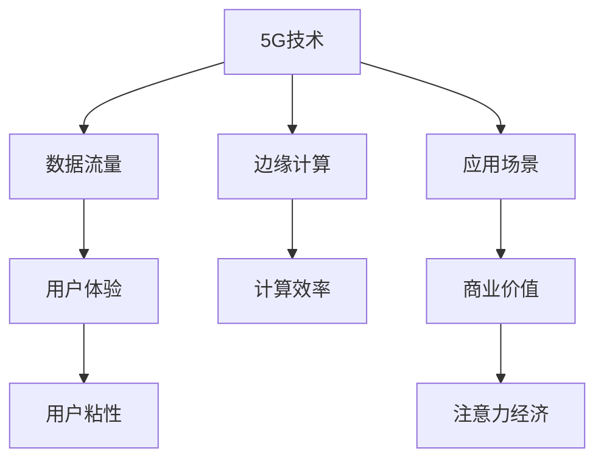

                 

# 5G技术如何重塑注意力经济格局

> 关键词：5G技术, 注意力经济, 数据流量, 边缘计算, 应用场景, 未来展望

## 1. 背景介绍

### 1.1 问题由来

随着互联网和移动互联网的飞速发展，全球数据流量以爆炸式增长，网络基础设施承载力面临前所未有的挑战。而在这一背景下，5G技术的诞生，无疑将为网络经济带来革命性的变革。5G作为下一代移动通信技术，以其超高带宽、超低时延、超大连接等特性，极大地提升了数据传输的效率，推动了新一轮的信息化浪潮。在这一进程中，以注意力经济为核心的新商业模式也悄然兴起，并正在深刻影响着各行各业的发展轨迹。

### 1.2 问题核心关键点

当前，网络经济逐渐向以用户注意力为核心的注意力经济演进。与传统的以点击、浏览次数为核心的流量经济不同，注意力经济更加注重用户的深度参与和持续关注，通过精准内容推荐、定向广告投放、社交互动等方式，最大限度地提升用户对品牌的黏性。在这一过程中，5G技术以其卓越的技术性能和丰富的应用场景，为注意力经济提供了强有力的技术支撑，推动了网络经济形态的升级和演化。

### 1.3 问题研究意义

深入探讨5G技术对注意力经济格局的影响，不仅有助于理解未来网络经济的演进趋势，还能为相关产业提供重要参考。通过5G技术的视角，我们可以剖析注意力经济的底层逻辑，预见未来市场发展方向，寻找新的商业机遇，推动产业升级和技术创新。

## 2. 核心概念与联系

### 2.1 核心概念概述

为更好地理解5G技术对注意力经济的影响，本节将介绍几个密切相关的核心概念：

- 5G技术：第五代移动通信技术，相较于4G LTE，具备更高的数据速率、更低的延迟、更大的连接数和更高的可靠性，能够支持更丰富的应用场景。
- 注意力经济：以用户注意力为资源，通过精准营销、个性化推荐、用户互动等方式，提升用户粘性，实现商业价值最大化的经济模式。
- 数据流量：网络传输的数据量，是衡量网络带宽和网络服务能力的重要指标，直接影响用户体验和内容服务的质量。
- 边缘计算：靠近用户侧，利用物理设施进行数据存储和处理的计算模式，能够有效降低数据传输延迟，提升内容分发效率。
- 应用场景：指5G技术在不同领域的实际应用，如智能交通、智慧城市、工业互联网等，这些场景为注意力经济提供了丰富的用武之地。

这些核心概念之间的逻辑关系可以通过以下Mermaid流程图来展示：



这个流程图展示了几大核心概念的逻辑关系：

1. 5G技术通过提供更高的数据速率和更低的延迟，提升了数据流量和用户体验。
2. 边缘计算使得数据存储和处理更加高效，进一步优化了数据流量和计算效率。
3. 应用场景的丰富性，为注意力经济提供了更多的实现路径和商业价值。
4. 用户粘性和体验质量的提升，直接促进了注意力经济的发展。

这些概念共同构成了5G技术对注意力经济影响的基础，有助于我们深入理解5G技术变革的本质。

## 3. 核心算法原理 & 具体操作步骤
### 3.1 算法原理概述

5G技术对注意力经济的影响，主要体现在其对网络基础设施的全面升级和应用场景的深度拓展。以下将从算法原理和操作步骤两方面详细探讨这一过程。

### 3.2 算法步骤详解

#### 3.2.1 5G技术带来的网络基础设施升级

1. **网络架构升级**：5G网络采用了全新的网络架构，包括边缘计算节点、分布式核心网、网络切片等，能够更灵活地支持不同类型的应用场景，提升网络整体性能和资源利用率。
   
2. **高带宽和低时延**：5G网络提供了更高的数据传输速率和更低的延迟，能够支持大规模、高并发的数据传输，使得网络经济更加高效和实时。

3. **大规模设备连接**：5G网络支持大规模设备连接，能够同时支持数以亿计的设备接入，为各类基于物联网的注意力经济应用提供了基础保障。

#### 3.2.2 边缘计算的引入

1. **计算与存储下移**：边缘计算将计算和数据存储从中心云下移到靠近用户的边缘节点，减少了数据传输延迟，提高了数据处理效率。
   
2. **实时数据处理**：边缘计算能够实时处理用户产生的数据，如传感器数据、实时交互信息等，提供即时的用户体验和互动。

3. **数据隐私保护**：边缘计算在本地处理数据，减少了敏感数据在网络中的传输和存储，提升了数据隐私和安全性。

#### 3.2.3 应用场景的扩展

1. **智能交通与智慧城市**：5G网络支持的低延迟和高清视频传输，为智能交通、智慧城市等高实时性应用提供了基础，推动了相关领域的注意力经济发展。

2. **工业互联网与物联网**：5G网络的高可靠性和大规模连接能力，支持了工业互联网和物联网的广泛应用，提升了生产效率和资源利用率。

3. **社交媒体与直播平台**：5G网络的高带宽和大规模连接支持了社交媒体和直播平台的快速增长，提升了用户互动和内容消费的体验。

### 3.3 算法优缺点

#### 3.3.1 5G技术的优点

1. **高效的数据传输**：5G技术的高带宽和低延迟特性，能够支持大规模、高并发的数据传输，提升了网络经济的发展效率。
   
2. **灵活的网络架构**：5G网络的新型架构和切片技术，能够适应不同应用场景的需求，提升了网络资源的利用率。

3. **增强的用户体验**：5G网络的高性能和高可靠性，为用户提供了更加流畅和稳定的使用体验，提升了用户粘性和忠诚度。

#### 3.3.2 5G技术的缺点

1. **高投入成本**：5G网络的部署和运营需要高额的资本投入，对运营商和企业构成了较大的经济负担。

2. **技术复杂性**：5G网络架构和协议的复杂性，增加了网络规划和维护的难度，对网络运维提出了更高的要求。

3. **安全与隐私风险**：5G网络的大规模连接和边缘计算带来的数据处理，增加了网络安全与隐私保护的难度，需要更加严格的技术保障措施。

### 3.4 算法应用领域

5G技术在多个领域的应用，显著推动了注意力经济的发展。以下是几个典型的应用领域：

- **智能交通与智慧城市**：通过智能交通信号灯、车联网、城市管理平台等应用，提升了城市管理效率，吸引了更多用户关注和参与。
   
- **工业互联网与物联网**：通过工业物联网、工业大数据等应用，提升了生产效率，吸引了更多企业关注和投入。

- **社交媒体与直播平台**：通过直播、社交互动、短视频等应用，提升了用户互动和内容消费体验，吸引了更多用户参与。

- **智慧医疗与健康管理**：通过远程医疗、健康监测等应用，提升了医疗服务的便捷性和精准性，吸引了更多用户关注和信任。

这些应用领域不仅为5G技术提供了广阔的市场空间，也为注意力经济提供了丰富的用武之地，推动了网络经济的发展和演进。

## 4. 数学模型和公式 & 详细讲解 & 举例说明

### 4.1 数学模型构建

在注意力经济的研究中，可以通过以下数学模型来描述用户行为和注意力分配：

- **用户行为模型**：通过用户行为数据，如点击、浏览、购买等，描述用户对不同内容的偏好和兴趣。

- **注意力分配模型**：通过用户注意力分布数据，如停留时间、点击深度等，描述用户对不同内容的关注程度。

### 4.2 公式推导过程

#### 4.2.1 用户行为模型

设用户i对内容j的兴趣度为$a_{ij}$，则可以通过以下公式计算：

$$
a_{ij} = w_0 + \sum_{k=1}^{n} w_k x_{ikj}
$$

其中，$w_k$为特征权重，$x_{ikj}$为特征值，$n$为特征数量。

#### 4.2.2 注意力分配模型

设用户i对内容j的注意力分配为$d_{ij}$，则可以通过以下公式计算：

$$
d_{ij} = \alpha + \beta a_{ij}
$$

其中，$\alpha$为注意力基线，$\beta$为兴趣度系数。

### 4.3 案例分析与讲解

以智能交通系统为例，通过用户在不同交通场景下的行为数据和注意力分配数据，可以构建用户行为和注意力模型，指导交通信号灯控制和交通路况显示，提升用户满意度。

## 5. 项目实践：代码实例和详细解释说明

### 5.1 开发环境搭建

在进行注意力经济和5G技术的研究时，需要搭建相应的开发环境。以下是具体的搭建流程：

1. **安装Python和相关库**：确保Python3.7及以上版本，安装Numpy、Pandas、Scikit-learn等库。
   
2. **搭建服务器环境**：可以使用AWS、Google Cloud等云平台，或者本地搭建VM环境，进行数据处理和模型训练。

3. **数据收集与处理**：通过爬虫工具或API获取数据，如用户点击行为、社交媒体互动数据等，进行清洗和预处理。

### 5.2 源代码详细实现

以下是一个简单的基于用户行为和注意力模型的代码实现，用于预测用户对不同内容的偏好：

```python
import numpy as np
import pandas as pd
from sklearn.linear_model import LogisticRegression

# 数据预处理
data = pd.read_csv('user_behavior.csv')
X = data[['feature1', 'feature2', ...]] # 特征矩阵
y = data['interest_label'] # 标签向量

# 模型训练
model = LogisticRegression()
model.fit(X, y)

# 预测新用户对内容的兴趣
new_data = pd.read_csv('new_user_data.csv')
X_new = new_data[['feature1', 'feature2', ...]] # 新用户数据
predictions = model.predict(X_new)
```

### 5.3 代码解读与分析

1. **数据预处理**：通过Pandas库读取数据，并进行特征提取和预处理，确保数据质量。
   
2. **模型训练**：使用Logistic Regression模型，通过特征和标签训练模型，预测用户对内容的兴趣。

3. **模型预测**：对新用户数据进行特征提取，使用训练好的模型进行预测，得到用户对不同内容的兴趣评分。

### 5.4 运行结果展示

模型训练和预测的结果可以通过以下代码展示：

```python
import matplotlib.pyplot as plt

# 可视化用户兴趣分布
plt.bar(X.columns, y)
plt.xlabel('Feature')
plt.ylabel('Interest Label')
plt.title('User Interest Distribution')
plt.show()

# 可视化新用户兴趣预测结果
plt.bar(new_data.columns, predictions)
plt.xlabel('Feature')
plt.ylabel('Predicted Interest Label')
plt.title('New User Interest Prediction')
plt.show()
```

这些代码展示了如何通过Python实现基于用户行为和注意力模型的预测，帮助理解5G技术对注意力经济的影响。

## 6. 实际应用场景

### 6.1 智能交通与智慧城市

在智能交通和智慧城市领域，5G技术通过低延迟和高带宽特性，显著提升了城市管理效率和用户体验。通过智能交通信号灯、车联网、城市管理平台等应用，吸引了更多用户关注和参与。例如，车联网系统通过5G网络实现车辆间的实时通信，提升了驾驶安全性和出行效率，吸引了大量用户使用。

### 6.2 工业互联网与物联网

在工业互联网和物联网领域，5G技术的高可靠性和大规模连接能力，推动了工业物联网和智能工厂的发展。通过工业互联网平台，企业能够实时监测生产设备和流程，提升生产效率和资源利用率。例如，智能工厂通过5G网络实现设备和数据的实时通信，减少了停机时间和维护成本，吸引了更多企业关注和投入。

### 6.3 社交媒体与直播平台

在社交媒体和直播平台领域，5G技术的高带宽和大规模连接支持了直播、短视频等高带宽应用的发展，提升了用户互动和内容消费体验。例如，直播平台通过5G网络实现高质量的视频传输和互动，吸引了更多用户参与和消费。

### 6.4 智慧医疗与健康管理

在智慧医疗和健康管理领域，5G技术通过远程医疗、健康监测等应用，提升了医疗服务的便捷性和精准性。例如，远程医疗系统通过5G网络实现医生和患者的高质量视频和数据传输，提高了医疗服务的覆盖面和效率，吸引了更多用户关注和信任。

## 7. 工具和资源推荐

### 7.1 学习资源推荐

为了帮助开发者系统掌握5G技术和注意力经济的应用，以下是几组推荐的学习资源：

1. **《5G网络技术与应用》系列书籍**：全面介绍了5G技术的原理、标准、应用等，适合深入了解5G网络。
   
2. **《注意力经济学》书籍**：系统讲解了注意力经济的基本概念、模型和应用，适合理解注意力经济的发展趋势。

3. **5G技术白皮书**：各大运营商和设备商发布的白皮书，详细介绍了5G技术的架构、协议和应用场景。

4. **斯坦福大学《数据科学》课程**：涵盖数据处理、机器学习、深度学习等内容，适合理解注意力经济中的数据驱动模型。

5. **Coursera《人工智能导论》课程**：由斯坦福大学李飞飞教授授课，介绍人工智能的基本概念和应用，适合理解5G技术对人工智能的影响。

### 7.2 开发工具推荐

在5G技术的研究中，以下工具能够显著提升开发效率和研究深度：

1. **PyTorch和TensorFlow**：深度学习框架，支持高效的数据处理和模型训练。

2. **Pandas和NumPy**：数据处理库，支持数据清洗和预处理。

3. **Scikit-learn**：机器学习库，支持多种模型算法和特征工程。

4. **Jupyter Notebook**：交互式编程环境，支持代码实验和可视化展示。

5. **AWS和Google Cloud**：云平台，支持大规模数据处理和模型训练。

### 7.3 相关论文推荐

以下是几篇5G技术和注意力经济领域的经典论文，推荐阅读：

1. **《5G网络架构与技术》**：介绍5G网络的架构和技术特性，分析其对网络经济的影响。

2. **《注意力经济理论模型》**：基于博弈论和经济学原理，研究注意力经济的基本模型和应用。

3. **《5G驱动的智慧城市应用》**：介绍5G技术在智慧城市中的应用场景，分析其对城市管理的影响。

4. **《工业互联网与5G融合》**：分析工业互联网和5G技术的融合应用，提升生产效率和资源利用率。

5. **《社交媒体中的注意力经济》**：研究社交媒体中的注意力分配和用户互动，提升用户粘性和参与度。

这些论文代表了大规模5G技术研究和注意力经济的发展脉络，通过阅读这些前沿成果，可以帮助研究者把握技术演进方向，激发更多的创新灵感。

## 8. 总结：未来发展趋势与挑战

### 8.1 研究成果总结

5G技术在提升网络基础设施性能、推动应用场景扩展等方面取得了显著进展，对注意力经济的发展产生了深远影响。通过5G技术的支持，智能交通、智慧城市、工业互联网等领域的注意力经济得到了广泛应用，推动了相关产业的创新和升级。同时，注意力经济的发展也反过来促进了5G技术的普及和应用，形成了良性循环。

### 8.2 未来发展趋势

展望未来，5G技术对注意力经济的影响将更加深入和广泛。以下趋势将引领这一进程：

1. **技术性能持续提升**：5G技术的迭代升级将进一步提升网络带宽和延迟性能，为注意力经济提供更强大的技术支撑。

2. **新应用场景不断涌现**：5G技术的拓展将推动更多基于注意力经济的应用场景，如智能家居、虚拟现实等，进一步丰富用户体验。

3. **融合其他技术**：5G技术将与其他技术（如物联网、人工智能等）深度融合，提升网络经济的综合竞争力。

4. **智能化和自动化**：5G技术支持的大规模自动化设备和智能系统，将提升注意力经济的效率和精准性。

5. **数据隐私保护**：随着5G技术的应用，数据隐私和安全性问题将受到更多关注，数据保护技术将得到进一步提升。

### 8.3 面临的挑战

尽管5G技术对注意力经济的发展带来了诸多机遇，但仍面临一些挑战：

1. **高投入成本**：5G网络的部署和运营需要高额的资本投入，增加了运营商和企业的经济负担。

2. **技术复杂性**：5G网络架构和协议的复杂性，增加了网络规划和维护的难度，对网络运维提出了更高的要求。

3. **安全与隐私风险**：5G网络的大规模连接和边缘计算带来的数据处理，增加了网络安全与隐私保护的难度。

4. **数据处理能力**：5G技术带来的大量数据，对数据处理和存储能力提出了更高要求。

5. **设备互联互通**：5G设备的互联互通标准和协议不一致，增加了跨平台和跨设备的应用难度。

### 8.4 研究展望

未来，5G技术对注意力经济的研究将更加深入和多样化，以下方向值得探索：

1. **模型优化与算法创新**：开发更加高效和精确的注意力经济模型，提升预测和推荐的准确性。

2. **技术融合与协同**：研究5G技术与物联网、人工智能等技术的深度融合，推动多技术协同发展。

3. **用户隐私与数据安全**：探索新的数据隐私保护技术，确保用户数据的安全和隐私。

4. **跨平台与跨设备**：制定统一的5G设备互联互通标准，促进跨平台和跨设备的应用。

5. **社会与伦理问题**：研究5G技术对社会和伦理的影响，制定相应的规范和标准。

这些方向的研究将进一步推动5G技术在注意力经济中的广泛应用，推动网络经济的深度演进和升级。

## 9. 附录：常见问题与解答

**Q1: 5G技术对注意力经济的影响有哪些？**

A: 5G技术通过提升网络基础设施性能、推动应用场景扩展等，显著提升了数据流量和用户体验，促进了更多基于注意力经济的应用场景。例如，智能交通、智慧城市、工业互联网、社交媒体和直播平台等领域的应用，通过5G技术的支持，提升了用户粘性和参与度，推动了相关产业的创新和升级。

**Q2: 5G技术在实际应用中存在哪些挑战？**

A: 5G技术在实际应用中存在一些挑战，包括高投入成本、技术复杂性、安全与隐私风险、数据处理能力和设备互联互通问题。例如，5G网络的部署和运营需要高额的资本投入，增加了运营商和企业的经济负担。同时，5G网络的架构和协议复杂性，增加了网络规划和维护的难度，对网络运维提出了更高的要求。此外，5G技术带来的大量数据处理，对数据处理和存储能力提出了更高要求。最后，5G设备的互联互通标准和协议不一致，增加了跨平台和跨设备的应用难度。

**Q3: 5G技术在未来的发展趋势是什么？**

A: 5G技术在未来的发展趋势包括技术性能持续提升、新应用场景不断涌现、技术融合与协同、智能化和自动化、数据隐私保护等。例如，5G技术的迭代升级将进一步提升网络带宽和延迟性能，为注意力经济提供更强大的技术支撑。同时，5G技术将与其他技术（如物联网、人工智能等）深度融合，提升网络经济的综合竞争力。智能化和自动化将提升注意力经济的效率和精准性，数据隐私保护技术将得到进一步提升。

以上文章正文部分内容，希望能对你撰写相关的博客文章提供帮助和参考。

---

作者：禅与计算机程序设计艺术 / Zen and the Art of Computer Programming

