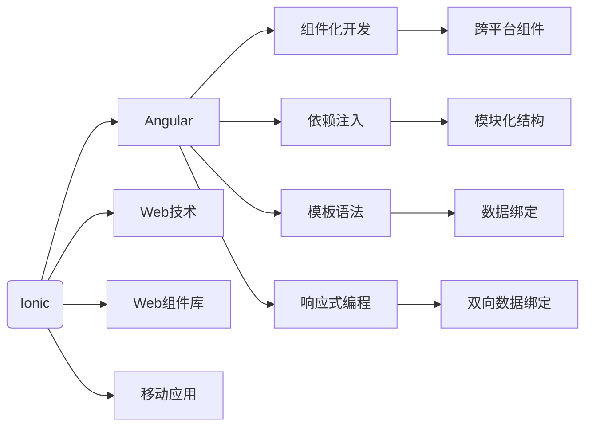

                 

## 1. 背景介绍

随着移动互联网的快速发展，移动应用的开发需求日益增加。传统的移动应用开发模式基于原生开发，开发成本高、周期长，难以快速迭代更新。与此同时，跨平台框架如React Native、Flutter等虽然解决了跨平台开发的问题，但在组件重用、性能表现和生态系统完善度方面仍有不足。而Ionic框架结合了Angular的强大功能与Web技术的成熟度，能够为移动应用开发提供一种高效、灵活且可扩展的解决方案。本文将详细探讨Ionic框架和Angular的结合方式，分析其在移动应用开发中的优势与挑战，并展望未来发展趋势。

## 2. 核心概念与联系

### 2.1 核心概念概述

**Ionic框架**：Ionic是一款基于Web技术的跨平台移动应用开发框架，采用Angular框架作为核心技术栈。Ionic通过使用Web技术（如HTML、CSS、JavaScript）和Web组件库（如Angular UI库），实现了移动应用的高效开发。

**Angular框架**：Angular是一款现代化的JavaScript框架，由Google开发。Angular通过组件化开发、依赖注入、模板语法、响应式编程等技术，提供了一套完整的Web应用开发解决方案。

**移动应用**：移动应用是指运行在移动设备（如智能手机、平板电脑）上的应用程序，具备触屏交互、位置感知、网络连接等特性。移动应用开发涉及平台适配、用户界面设计、数据存储、网络通信等多个方面。

### 2.2 核心概念原理和架构的 Mermaid 流程图



这个流程图展示了Ionic框架和Angular框架的核心概念及它们之间的联系：

1. Ionic框架通过使用Angular框架的核心技术（如组件化开发、依赖注入等）来构建移动应用。
2. Ionic框架提供了跨平台组件和Web组件库，使得开发过程中可以重用Web组件。
3. Ionic框架通过Web技术（如HTML、CSS、JavaScript）来实现移动应用的界面设计。
4. Ionic框架支持移动应用开发所需的各项特性，如触屏交互、位置感知、网络连接等。

## 3. 核心算法原理 & 具体操作步骤

### 3.1 算法原理概述

Ionic框架和Angular的结合基于组件化开发、依赖注入、响应式编程等Angular核心技术，通过将这些技术应用到移动应用开发中，实现了高效、灵活的跨平台开发。

### 3.2 算法步骤详解

**Step 1: 初始化项目**
1. 安装Ionic CLI工具
2. 创建一个新的Ionic项目，使用Angular作为框架
3. 配置项目环境，包括开发服务器、模拟器和物理设备

**Step 2: 设计应用架构**
1. 设计应用的数据流和用户交互流程
2. 使用Angular的组件化开发模式，将应用拆分为多个模块和组件
3. 使用依赖注入技术，管理模块和组件之间的依赖关系

**Step 3: 实现应用功能**
1. 使用Angular的模板语法，编写UI组件的HTML模板
2. 在TypeScript文件中编写组件的业务逻辑和数据处理逻辑
3. 使用Angular的响应式编程和双向数据绑定技术，实现数据和UI之间的同步

**Step 4: 进行平台适配**
1. 使用Ionic的跨平台组件，自动适配不同平台的界面和行为
2. 使用Ionic的Web技术，实现移动应用的界面设计和交互效果

**Step 5: 进行性能优化**
1. 使用Angular的懒加载和代码分割技术，提高应用的加载速度
2. 使用Ionic的Web Worker技术，优化应用的渲染性能
3. 使用Ionic的组件缓存和复用机制，减少组件的创建和销毁开销

**Step 6: 进行测试和部署**
1. 使用Jasmine和Karma等测试工具，对应用进行单元测试、集成测试和端到端测试
2. 使用Ionic的APK和IPA构建工具，将应用打包为可执行文件
3. 使用Ionic的云服务，将应用部署到App Store和Google Play等应用商店

### 3.3 算法优缺点

**优点**：
1. 高效开发：Angular的强大功能和Web技术的高效性，使得Ionic框架在移动应用开发中具有高效性。
2. 灵活适配：Ionic框架的跨平台组件和Web技术，使得应用可以在不同平台间无缝切换。
3. 可扩展性强：Angular的组件化开发模式和依赖注入技术，使得应用易于扩展和维护。
4. 社区支持：Angular和Ionic都有庞大的社区支持，丰富的组件和工具库可以快速开发应用。

**缺点**：
1. 学习曲线陡峭：Angular和Ionic都需要一定的学习成本，特别是对于没有Web开发经验的用户。
2. 性能问题：虽然Ionic提供了一些性能优化方案，但在高负载场景下仍存在一定的性能瓶颈。
3. 开发复杂性：组件化开发和依赖注入虽然提高了开发效率，但也需要开发者具备一定的设计思维和抽象能力。

### 3.4 算法应用领域

Ionic框架和Angular的结合在移动应用开发中的应用非常广泛，主要领域包括：

1. 社交应用：如微信、微博、抖音等社交应用，需要使用跨平台开发框架来适应多设备环境。
2. 电商应用：如淘宝、京东、美团等电商应用，需要使用高效开发工具来快速迭代更新。
3. 教育应用：如Coursera、Khan Academy等在线教育应用，需要使用丰富的组件和工具库来提升用户体验。
4. 医疗应用：如Healthify、Foldr等医疗应用，需要使用Web技术来实现跨平台和数据同步。
5. 娱乐应用：如Spotify、Netflix等娱乐应用，需要使用高性能的Web技术来实现流媒体播放和互动效果。

## 4. 数学模型和公式 & 详细讲解 & 举例说明

### 4.1 数学模型构建

在Ionic框架和Angular的结合中，数学模型主要用于描述数据流和组件之间的交互关系。以Angular的双向数据绑定为例，假设有一个文本框组件和对应的数据显示组件，数据模型可以表示为：

$$
\begin{aligned}
textInput &\leftrightarrow dataDisplay \\
dataDisplay &\leftrightarrow textInput
\end{aligned}
$$

其中，`textInput`表示文本框组件，`dataDisplay`表示数据显示组件，`leftrightarrow`表示数据流的关系。当`textInput`的值发生变化时，数据流会立即传递到`dataDisplay`，反之亦然。

### 4.2 公式推导过程

假设有一个组件`Component`，包含一个属性`data`，其双向数据绑定的公式可以表示为：

$$
data = component.data
$$

其中，`component`表示组件实例，`data`表示数据属性。当`component.data`的值发生变化时，数据流会立即传递到`data`属性，反之亦然。

### 4.3 案例分析与讲解

假设有一个名为`Counter`的组件，包含一个计数器属性`count`和一个更新计数器的方法`increment()`。在模板中，`count`的值将显示在`span`标签中，并通过按钮组件`Button`触发`increment()`方法。数据模型可以表示为：

```typescript
import { Component, OnInit } from '@angular/core';

@Component({
  selector: 'app-counter',
  template: `
    <span>{{ count }}</span>
    <button (click)="increment()">Increment</button>
  `,
  templateUrl: './counter.component.html',
  styleUrls: ['./counter.component.css']
})
export class CounterComponent implements OnInit {

  count: number = 0;

  increment() {
    this.count++;
  }

  constructor() { }

  ngOnInit(): void { }
}
```

在这个例子中，`Counter`组件通过双向数据绑定将`count`属性和显示器的`span`标签绑定在一起，并通过按钮组件触发`increment()`方法，实现计数器的增加功能。

## 5. 项目实践：代码实例和详细解释说明

### 5.1 开发环境搭建

1. 安装Node.js和npm
2. 安装Ionic CLI工具：`npm install -g ionic`
3. 创建一个新的Ionic项目：`ionic start my-app <app-name>`

### 5.2 源代码详细实现

以下是一个简单的Ionic应用示例，展示如何使用Angular的组件化开发模式和双向数据绑定技术：

**index.html**
```html
<app-root></app-root>
```

**app.module.ts**
```typescript
import { NgModule } from '@angular/core';
import { BrowserModule } from '@angular/platform-browser';
import { IonicModule } from '@ionic/angular';
import { AppComponent } from './app.component';

@NgModule({
  declarations: [
    AppComponent
  ],
  imports: [
    BrowserModule,
    IonicModule.forRoot()
  ],
  providers: [],
  bootstrap: [AppComponent]
})
export class AppModule {}
```

**app.component.ts**
```typescript
import { Component } from '@angular/core';

@Component({
  selector: 'app-root',
  template: `
    <ion-content>
      <app-counter></app-counter>
    </ion-content>
  `
})
export class AppComponent {}

@Component({
  selector: 'app-counter',
  template: `
    <span>{{ count }}</span>
    <button (click)="increment()">Increment</button>
  `,
  templateUrl: './counter.component.html',
  styleUrls: ['./counter.component.css']
})
export class CounterComponent {
  count: number = 0;

  increment() {
    this.count++;
  }
}
```

**counter.component.css**
```css
span {
  font-size: 24px;
  font-weight: bold;
}
```

### 5.3 代码解读与分析

在这个示例中，我们使用Ionic和Angular构建了一个简单的计数器应用，包含一个`app-root`组件和一个`app-counter`组件。`app-root`组件包含一个`ion-content`，用于显示`app-counter`组件的内容。`app-counter`组件包含一个`span`标签和一个按钮组件，用于显示和更新计数器的值。

在`app.module.ts`中，我们使用了IonicModule，并声明了`app-root`组件。在`app.component.ts`中，我们使用`@Component`装饰器声明了`app-root`组件，并在模板中引入了`app-counter`组件。在`CounterComponent`中，我们使用`@Component`装饰器声明了计数器组件，并在模板中使用了双向数据绑定，实现了计数器的增加功能。

## 6. 实际应用场景

### 6.1 社交应用

在社交应用中，Ionic框架和Angular结合可以用于开发即时通讯、朋友圈、私聊等应用。开发者可以使用Ionic的跨平台组件和Web技术，实现跨设备的用户体验和数据同步。同时，Angular的组件化开发模式和双向数据绑定技术，可以简化应用的开发和维护。

### 6.2 电商应用

在电商应用中，Ionic框架和Angular结合可以用于开发商品详情页、购物车、订单管理等应用。开发者可以使用Ionic的Web技术实现高性能的流媒体播放和互动效果，同时使用Angular的组件化开发模式和依赖注入技术，快速迭代更新应用功能。

### 6.3 教育应用

在教育应用中，Ionic框架和Angular结合可以用于开发在线课程、学习笔记、作业提交等应用。开发者可以使用Ionic的Web技术实现跨平台的用户体验，同时使用Angular的组件化开发模式和双向数据绑定技术，提升应用的交互性和响应性。

### 6.4 医疗应用

在医疗应用中，Ionic框架和Angular结合可以用于开发电子病历、药品管理、医疗咨询等应用。开发者可以使用Ionic的Web技术实现跨平台的数据同步和通信，同时使用Angular的组件化开发模式和响应式编程技术，实现高效的数据处理和展示。

## 7. 工具和资源推荐

### 7.1 学习资源推荐

1. Ionic官方文档：Ionic框架的官方文档，提供了完整的开发指南和组件库，是学习Ionic框架的必备资源。
2. Angular官方文档：Angular框架的官方文档，提供了详细的API和开发指南，是学习Angular框架的必备资源。
3. Ionic和Angular的官方教程：Ionic和Angular的官方教程，提供了丰富的实例和案例，帮助开发者快速上手。
4. Ionic社区：Ionic社区是Ionic框架的开发者社区，提供了丰富的组件和插件，是获取最新技术动态的途径。
5. Angular社区：Angular社区是Angular框架的开发者社区，提供了丰富的组件和工具库，是获取最新技术动态的途径。

### 7.2 开发工具推荐

1. Visual Studio Code：轻量级代码编辑器，支持多种编程语言和框架，是开发Ionic和Angular应用的首选工具。
2. Sublime Text：功能强大的代码编辑器，支持多种编程语言和框架，是开发Ionic和Angular应用的备选工具。
3. WebStorm：专业的IDE，支持多种编程语言和框架，是开发Ionic和Angular应用的高级工具。

### 7.3 相关论文推荐

1. "Angular: A Language for Direct Manipulation of the DOM"：Angular框架的论文，介绍了Angular的核心技术和设计理念。
2. "Ionic Framework: Cross-Platform Development for the Web"：Ionic框架的论文，介绍了Ionic的核心技术和设计理念。
3. "A Comparative Study of Cross-Platform Mobile App Development Frameworks"：对比Ionic、React Native和Flutter等跨平台框架的论文，帮助开发者选择最合适的框架。

## 8. 总结：未来发展趋势与挑战

### 8.1 研究成果总结

Ionic框架和Angular的结合，为移动应用开发提供了一种高效、灵活、可扩展的解决方案。Ionic框架通过使用Angular的核心技术，实现了跨平台组件和Web技术的应用，大大降低了开发成本和周期。Angular的组件化开发模式和双向数据绑定技术，简化了应用的开发和维护，提高了应用的性能和可扩展性。

### 8.2 未来发展趋势

1. 进一步提升性能：Ionic框架和Angular结合的发展方向之一是提升应用的性能，包括提高组件渲染效率、优化数据流和响应时间等。
2. 支持更多平台：Ionic框架和Angular结合的未来发展方向之一是支持更多的移动平台，包括Android、iOS、Windows等。
3. 引入更多组件：Ionic框架和Angular结合的未来发展方向之一是引入更多的组件和插件，丰富应用的功能和体验。
4. 提升开发效率：Ionic框架和Angular结合的未来发展方向之一是提升开发效率，包括自动化构建、代码分割、懒加载等技术。
5. 引入更多技术：Ionic框架和Angular结合的未来发展方向之一是引入更多技术，如WebAssembly、WebXR等，拓展应用场景。

### 8.3 面临的挑战

1. 学习曲线陡峭：Ionic框架和Angular结合的学习曲线较为陡峭，需要开发者具备一定的Web开发和Angular技术基础。
2. 性能瓶颈：在复杂和高负载场景下，Ionic框架和Angular结合的性能仍存在一定的瓶颈，需要进一步优化。
3. 开发复杂性：组件化开发和依赖注入技术虽然提高了开发效率，但也需要开发者具备一定的设计思维和抽象能力。
4. 生态系统完善度：虽然Ionic框架和Angular结合的生态系统已经较为完善，但仍需进一步优化和扩展。

### 8.4 研究展望

Ionic框架和Angular结合的未来研究展望包括：

1. 提升性能：进一步优化组件渲染效率、优化数据流和响应时间，提升应用的性能和响应性。
2. 支持更多平台：支持更多的移动平台，包括Android、iOS、Windows等，拓展应用的范围和场景。
3. 引入更多组件：引入更多的组件和插件，丰富应用的功能和体验，提升应用的可用性和易用性。
4. 提升开发效率：引入自动化构建、代码分割、懒加载等技术，提升开发效率和应用的质量。
5. 引入更多技术：引入WebAssembly、WebXR等技术，拓展应用场景，提升应用的性能和用户体验。

总之，Ionic框架和Angular结合在移动应用开发中具有广阔的前景，需要开发者不断探索和优化，才能实现更高的应用效果和用户满意度。

## 9. 附录：常见问题与解答

**Q1: 什么是Ionic框架和Angular结合？**

A: Ionic框架和Angular结合是指将Angular的强大功能和Web技术的成熟度应用到移动应用开发中，通过使用Angular的组件化开发模式和双向数据绑定技术，实现高效、灵活的跨平台开发。

**Q2: Ionic框架和Angular结合的优势和缺点是什么？**

A: 优势：高效开发、灵活适配、可扩展性强、社区支持。缺点：学习曲线陡峭、性能问题、开发复杂性。

**Q3: 如何使用Ionic框架和Angular结合开发移动应用？**

A: 首先，安装Ionic CLI工具，创建一个新的Ionic项目，并配置开发环境。然后，设计应用架构，使用Angular的组件化开发模式和依赖注入技术，实现应用功能。最后，进行平台适配、性能优化、测试和部署，将应用打包为可执行文件并部署到应用商店。

**Q4: Ionic框架和Angular结合的应用场景有哪些？**

A: 社交应用、电商应用、教育应用、医疗应用、娱乐应用等。

**Q5: 如何进一步提升Ionic框架和Angular结合的性能？**

A: 优化组件渲染效率、优化数据流和响应时间，引入自动化构建、代码分割、懒加载等技术。

**Q6: Ionic框架和Angular结合的未来发展趋势是什么？**

A: 提升性能、支持更多平台、引入更多组件、提升开发效率、引入更多技术。

**Q7: Ionic框架和Angular结合面临的挑战是什么？**

A: 学习曲线陡峭、性能瓶颈、开发复杂性、生态系统完善度不足。

**Q8: 如何进行Ionic框架和Angular结合的应用开发？**

A: 安装Ionic CLI工具，创建一个新的Ionic项目，并配置开发环境。然后，设计应用架构，使用Angular的组件化开发模式和依赖注入技术，实现应用功能。最后，进行平台适配、性能优化、测试和部署，将应用打包为可执行文件并部署到应用商店。

---

作者：禅与计算机程序设计艺术 / Zen and the Art of Computer Programming

