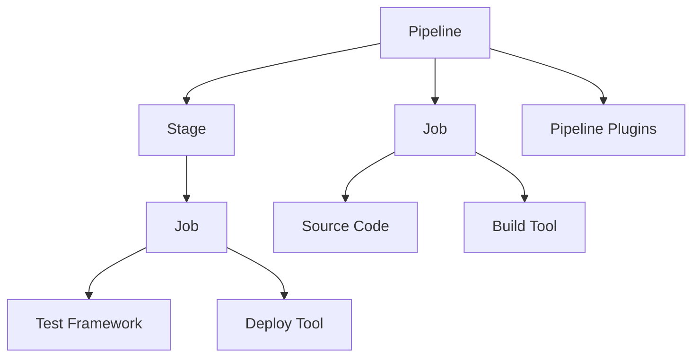

                 

# Jenkins持续集成Pipeline设计

## 1. 背景介绍

### 1.1 问题由来
在软件开发过程中，持续集成（Continuous Integration，CI）已成为构建可靠、高效软件的重要实践。Jenkins作为一款广泛使用的开源持续集成工具，通过管道（Pipeline）模型，实现了自动化流水线的构建和执行，为团队协作提供了强大支持。但传统的Jenkins Pipeline设计繁琐复杂，缺乏统一的模型和方法。本文旨在深入探讨Jenkins Pipeline的设计原理和最佳实践，帮助开发者构建高效、灵活的持续集成管道。

## 2. 核心概念与联系

### 2.1 核心概念概述

为更好地理解Jenkins Pipeline的设计，本节将介绍几个关键概念：

- **持续集成（Continuous Integration, CI）**：一种软件开发实践，通过自动化测试和集成，持续将代码变更集成到主分支，保证代码质量和稳定性。
- **持续部署（Continuous Deployment）**：在CI的基础上，自动将验证通过的软件版本部署到生产环境，提高部署效率。
- **Pipeline（管道）**：Jenkins通过Pipeline模型，将软件开发过程自动化为一系列可执行的步骤，实现持续集成和持续部署。
- **Stage（阶段）**：Pipeline中的基本组成单元，通常包含代码构建、测试、部署等步骤，每个阶段可独立执行。
- **Job（作业）**：Jenkins中的基本执行单元，代表一个具体的任务或流程。Job可以包含多个Stage，实现复杂的自动化流程。
- **Pipeline Plugins**：Jenkins提供的各种插件，扩展了Pipeline的功能，如代码存储、源码管理、构建工具、测试框架等。

这些核心概念之间相互依赖、相互作用，共同构成了Jenkins Pipeline的基础架构。通过理解这些概念，我们可以更好地把握Jenkins Pipeline的设计原理和应用方法。

### 2.2 核心概念原理和架构的 Mermaid 流程图



这个流程图展示了Pipeline、Stage、Job和插件之间的关系：

1. Pipeline是Jenkins的顶级模型，包含多个Stage。
2. Stage代表一个独立的执行步骤，如代码构建、测试、部署等。
3. Job是Pipeline的执行单元，包含多个Stage，实现复杂的自动化流程。
4. Pipeline Plugins扩展了Pipeline的功能，包括源码管理、构建工具、测试框架等。

## 3. 核心算法原理 & 具体操作步骤

### 3.1 算法原理概述

Jenkins Pipeline的实现原理基于流水线模型，将软件开发过程分解为多个阶段（Stage），每个阶段包含多个作业（Job），每个作业执行特定任务，如代码构建、测试、部署等。整个流水线按顺序执行，一旦某个阶段失败，流水线立即中断，并回滚到前一阶段，提供快速反馈和调试能力。

### 3.2 算法步骤详解

Jenkins Pipeline的构建和执行过程包括以下关键步骤：

**Step 1: 配置Pipeline**

- 在Jenkins UI中选择配置项，创建新的Pipeline。
- 定义Pipeline代码，通常使用Groovy或Pipeline DSL编写Pipeline定义。
- 配置Pipeline插件，如源码管理、构建工具、测试框架等。

**Step 2: 定义Pipeline Structure**

- 在Pipeline定义中，使用`pipeline`关键字开始定义Pipeline结构。
- 使用`agent`关键字指定执行环境的类型和名称，如`agent {label 'build-slave'}`。
- 定义多个Stage，每个Stage包含多个Job，例如`stage('Build') { jobs { ... } }`。
- 在每个Stage中，定义具体的执行步骤和条件判断，例如`steps { ... }`。

**Step 3: 编写Pipeline Code**

- 使用Groovy或Pipeline DSL编写Pipeline代码，通常包括代码构建、测试、部署等步骤。
- 在代码构建步骤中，使用工具如Maven、Gradle、Ant等，将代码构建到指定目录。
- 在测试步骤中，使用测试框架如JUnit、TestNG、Mocha等，运行测试用例。
- 在部署步骤中，使用工具如Jenkinsfile、Ansible、Docker等，将软件部署到目标环境。

**Step 4: 执行Pipeline**

- 保存Pipeline定义后，在Jenkins UI中选择 Pipeline，点击"Build Now"按钮，启动Pipeline执行。
- Jenkins会按照Pipeline定义中的顺序，依次执行每个Stage和Job，并记录执行结果和日志。
- 一旦某个Stage或Job失败，Jenkins会自动回滚到前一阶段，提供快速调试和修正的机会。

### 3.3 算法优缺点

Jenkins Pipeline的设计具有以下优点：

- **灵活性高**：通过配置 Pipeline DSL，可以自定义复杂的自动化流程，满足不同项目的需求。
- **可扩展性强**：通过插件扩展，Jenkins Pipeline可以支持各种源码管理、构建工具和测试框架。
- **易用性强**：通过可视化界面和丰富的Pipeline插件，Jenkins Pipeline使用户可以快速构建和部署自动化流程。

同时，Jenkins Pipeline也存在一些局限性：

- **学习成本高**：需要掌握Groovy或Pipeline DSL，对编程技能要求较高。
- **配置复杂**： Pipeline DSL语法复杂，新手可能需要较长时间熟悉。
- **资源消耗大**： Pipeline 和 Stage 的执行可能需要大量计算资源，导致执行时间较长。

## 4. 数学模型和公式 & 详细讲解 & 举例说明

### 4.1 数学模型构建

Jenkins Pipeline的数学模型基于流水线模型，通过多个Stage和Job的组合，实现软件开发的自动化流程。模型中每个Stage和Job都可以看作一个离散状态，其输入和输出满足一定的约束条件。

### 4.2 公式推导过程

设Pipeline包含n个Stage，每个Stage包含m个Job。定义每个Stage的输入为$I_i$，输出为$O_i$，每个Job的输入为$I_j$，输出为$O_j$。则Pipeline的数学模型可以表示为：

$$
O_{i+1} = f(O_i, I_{i+1})
$$

其中，$f$为Stage和Job之间的映射关系，表示每个Stage的输出是前一个Stage的输出和当前Stage的输入的函数。整个Pipeline的输出为$O_n$。

### 4.3 案例分析与讲解

假设我们要构建一个简单的Jenkins Pipeline，包含代码构建、测试和部署三个Stage，每个Stage包含多个Job。代码构建Stage包含两个Job，分别用于编译和测试；测试Stage包含一个Job，用于执行单元测试；部署Stage包含两个Job，分别用于打包和部署。Pipeline定义如下：

```groovy
pipeline {
    agent any

    stages {
        stage('Build') {
            steps {
                sh 'mvn clean install'
                sh 'mvn test'
            }
            post {
                always {
                    trigger 'Deploy'
                }
            }
        }
        stage('Test') {
            steps {
                sh 'mvn test'
            }
            post {
                always {
                    trigger 'Deploy'
                }
            }
        }
        stage('Deploy') {
            steps {
                sh 'mvn package'
                sh 'mvn deploy'
            }
        }
    }
}
```

在这个Pipeline中，每个Stage的输出（编译、测试、打包、部署）都是前一个Stage的输出的函数，满足流水线模型的基本要求。

## 5. 项目实践：代码实例和详细解释说明

### 5.1 开发环境搭建

要在Jenkins上配置和运行Pipeline，需要完成以下步骤：

1. 安装Jenkins Server，并确保Jenkins能够访问源码管理、构建工具和测试框架。
2. 配置Pipeline Plugins，如Git、Maven、JUnit等，以便Pipeline能够使用相应的工具。
3. 创建Pipeline项目，并在Jenkins UI中选择Pipeline选项，创建新的Pipeline。

### 5.2 源代码详细实现

以下是一个完整的Jenkins Pipeline示例代码，用于实现简单的代码构建、测试和部署流程：

```groovy
pipeline {
    agent any

    stages {
        stage('Build') {
            steps {
                sh 'mvn clean install'
            }
        }
        stage('Test') {
            steps {
                sh 'mvn test'
            }
            post {
                always {
                    trigger 'Deploy'
                }
            }
        }
        stage('Deploy') {
            steps {
                sh 'mvn package'
                sh 'mvn deploy'
            }
        }
    }
}
```

这个Pipeline定义了三个Stage，分别为Build、Test和Deploy。在Build Stage中，使用Maven命令进行代码构建；在Test Stage中，使用JUnit框架执行单元测试，并在测试通过后触发Deploy Stage；在Deploy Stage中，使用Maven命令进行打包和部署。

### 5.3 代码解读与分析

让我们详细解读一下关键代码的实现细节：

**pipeline关键字**：
- 定义整个Pipeline，使用`pipeline`关键字开始定义。

**agent关键字**：
- 指定执行环境的类型和名称，使用`agent {label 'build-slave'}`指定使用名为`build-slave`的执行环境。

**stage关键字**：
- 定义Pipeline中的Stage，使用`stage('Build')`定义Build Stage，并在Stage中编写具体的执行步骤。

**steps关键字**：
- 在Stage中定义具体的执行步骤，使用`steps { ... }`包含所有的执行命令，例如`sh 'mvn clean install'`。

**post关键字**：
- 定义Stage的后续动作，使用`post { ... }`定义Post Stage，例如`trigger 'Deploy'`触发Deploy Stage。

通过这些关键字的组合，可以实现复杂的Pipeline自动化流程，满足不同项目的需求。

### 5.4 运行结果展示

在Jenkins UI中启动Pipeline后，会自动执行Pipeline定义中的每个Stage和Job，并记录执行结果和日志。例如，在Build Stage中执行`mvn clean install`命令，在Test Stage中执行JUnit测试，在Deploy Stage中执行Maven打包和部署命令。

## 6. 实际应用场景

### 6.1 智能客服系统

Jenkins Pipeline可以应用于智能客服系统的构建，通过自动化的流水线，实现代码构建、测试、部署等流程。例如，当客服系统发生故障或需要更新功能时，通过Jenkins Pipeline快速构建和部署新版本，保证系统的稳定性和可用性。

### 6.2 金融舆情监测

在金融领域，Jenkins Pipeline可以用于实时舆情监测系统，通过自动化的流水线，实现数据抓取、清洗、分析等流程。例如，当市场舆情发生变化时，通过Jenkins Pipeline快速构建和部署新版本，及时更新舆情监测模型和算法。

### 6.3 个性化推荐系统

Jenkins Pipeline可以应用于个性化推荐系统的构建，通过自动化的流水线，实现代码构建、测试、部署等流程。例如，当推荐系统需要更新算法或引入新数据时，通过Jenkins Pipeline快速构建和部署新版本，保证推荐系统的稳定性和性能。

### 6.4 未来应用展望

随着Jenkins Pipeline的不断发展，其在各行各业的应用前景将更加广阔。未来，Pipeline将继续发挥其自动化、可扩展、易用等优势，为软件开发提供更加高效、灵活的解决方案。

## 7. 工具和资源推荐

### 7.1 学习资源推荐

为了帮助开发者系统掌握Jenkins Pipeline的理论基础和实践技巧，这里推荐一些优质的学习资源：

1. Jenkins官方文档：提供详细的Pipeline文档和示例代码，是学习Pipeline的基础资源。
2. Jenkins Pipeline Plugin：提供丰富的Pipeline插件，扩展Pipeline的功能。
3. Groovy官方文档：Pipeline使用Groovy编写，了解Groovy语法和特性是学习Pipeline的前提。
4. Pipeline DSL规范：提供Pipeline DSL的规范和最佳实践，帮助开发者构建高效的Pipeline。
5. Jenkins Pipeline教程：提供详细的Pipeline教程和实践案例，帮助开发者快速上手Pipeline。

通过对这些资源的学习实践，相信你一定能够快速掌握Jenkins Pipeline的精髓，并用于解决实际的开发问题。

### 7.2 开发工具推荐

合理的工具支持可以显著提升Jenkins Pipeline的开发效率。以下是几款常用的开发工具：

1. IntelliJ IDEA：支持Groovy和Pipeline DSL的IDE，提供代码补全、自动提示等功能。
2. Jenkins UI：Jenkins提供的可视化界面，方便配置和管理Pipeline。
3. Pipeline Plugins：Jenkins提供的各种插件，扩展Pipeline的功能，如Git、Maven、JUnit等。
4. Git：源码管理工具，方便版本控制和协作开发。
5. Maven：构建工具，用于编译、打包和部署Java项目。
6. JUnit：测试框架，用于执行Java项目的单元测试。

这些工具与Jenkins Pipeline相辅相成，能够提供全面的开发支持。

### 7.3 相关论文推荐

Jenkins Pipeline的发展离不开学界的持续研究。以下是几篇奠基性的相关论文，推荐阅读：

1. "Continuous Delivery: End-to-End DevOps Practices"：提出Continuous Delivery的概念，强调持续交付的重要性。
2. "Jenkins Pipeline as Code"：介绍Pipeline as Code的概念，讨论Pipeline在软件开发中的应用。
3. "Scalable Pipeline for Microservices"：探讨微服务架构下的Pipeline构建和优化。
4. "Jenkins Pipeline and Microservices"：讨论Pipeline在微服务架构下的应用和优化。
5. "Jenkins Pipeline in DevOps"：介绍DevOps中的Pipeline构建和优化，强调Pipeline在软件开发中的应用。

这些论文代表了Jenkins Pipeline的发展脉络，通过学习这些前沿成果，可以帮助研究者把握学科前进方向，激发更多的创新灵感。

## 8. 总结：未来发展趋势与挑战

### 8.1 研究成果总结

本文对Jenkins Pipeline的设计原理和最佳实践进行了全面系统的介绍。首先阐述了Jenkins Pipeline的背景和应用意义，明确了Pipeline在构建可靠、高效软件过程中的独特价值。其次，从原理到实践，详细讲解了Pipeline的数学模型和操作步骤，给出了Pipeline任务开发的完整代码实例。同时，本文还广泛探讨了Pipeline在智能客服、金融舆情、个性化推荐等多个行业领域的应用前景，展示了Pipeline范式的巨大潜力。此外，本文精选了Pipeline的学习资源，力求为读者提供全方位的技术指引。

通过本文的系统梳理，可以看到，Jenkins Pipeline为软件开发提供了自动化、可扩展、易用等优势，极大提升了软件开发的效率和质量。未来，伴随Pipeline的持续演进，其应用范围将更加广泛，成为软件开发中的重要工具。

### 8.2 未来发展趋势

展望未来，Jenkins Pipeline将呈现以下几个发展趋势：

1. **自动化程度提高**：Pipeline将继续拓展其自动化范围，从代码构建、测试到部署等各个环节，实现全面的自动化流程。
2. **可扩展性增强**：Pipeline将提供更丰富的插件和扩展功能，支持更多的源码管理、构建工具和测试框架。
3. **集成能力提升**：Pipeline将与其他DevOps工具和平台进行更深入的集成，如CI/CD、Kubernetes、Docker等，形成更加完整的DevOps生态。
4. **云化部署**：Pipeline将支持云化部署，利用云平台提供的弹性资源和DevOps服务，实现更高效、灵活的Pipeline构建和执行。
5. **智能分析**：Pipeline将引入机器学习和数据分析技术，提供更智能的自动化流程优化和预测分析。

以上趋势凸显了Jenkins Pipeline的广阔前景。这些方向的探索发展，将进一步提升Pipeline的自动化和智能化水平，为软件开发提供更强大的支持。

### 8.3 面临的挑战

尽管Jenkins Pipeline已经取得了瞩目成就，但在迈向更加智能化、普适化应用的过程中，它仍面临诸多挑战：

1. **学习成本高**：Jenkins Pipeline的学习成本较高，需要掌握Groovy或Pipeline DSL，对编程技能要求较高。
2. **配置复杂**：Pipeline DSL语法复杂，新手可能需要较长时间熟悉。
3. **资源消耗大**：Pipeline的执行可能需要大量计算资源，导致执行时间较长。
4. **兼容性问题**：不同版本的Pipeline可能存在兼容性问题，需要开发者注意版本管理和更新。
5. **安全性问题**：Pipeline在配置和管理过程中，可能存在安全漏洞和风险，需要开发者注意安全防护。

这些挑战需要开发者在实际应用中不断优化和改进，以充分发挥Pipeline的自动化优势。

### 8.4 研究展望

面对Jenkins Pipeline所面临的挑战，未来的研究需要在以下几个方面寻求新的突破：

1. **简化Pipeline DSL**：开发更加易用的Pipeline DSL语法，降低学习成本，提升开发效率。
2. **提高Pipeline执行效率**：优化Pipeline的执行流程，减少资源消耗，提升执行效率。
3. **增强Pipeline安全性**：引入安全防护机制，保护Pipeline在配置和管理过程中的安全性。
4. **优化Pipeline部署**：引入云化部署技术，利用云平台提供的弹性资源和DevOps服务，提升Pipeline的部署效率和稳定性。
5. **引入智能分析**：引入机器学习和数据分析技术，提供更智能的自动化流程优化和预测分析，提升Pipeline的智能化水平。

这些研究方向的探索，将引领Jenkins Pipeline技术迈向更高的台阶，为软件开发提供更强大、高效、安全的解决方案。

## 9. 附录：常见问题与解答

**Q1：Pipeline和Job的区别是什么？**

A: Pipeline和Job是Jenkins中不同的概念。Pipeline是Jenkins的顶级模型，代表一个完整的自动化流程；Job是Pipeline的执行单元，代表一个具体的任务或流程。一个Pipeline可以包含多个Job，每个Job可以执行特定的任务。

**Q2：如何避免Pipeline执行过程中的资源浪费？**

A: 可以通过以下方法避免Pipeline执行过程中的资源浪费：
1. 使用代码构建缓存，避免重复编译和测试。
2. 设置合理的并发度，避免过多任务同时执行导致的资源竞争。
3. 优化Pipeline定义，避免不必要的操作步骤和重复任务。
4. 使用Pipeline Plugins，提供更高效的构建和测试工具。

**Q3：Pipeline如何在不同的环境中运行？**

A: Jenkins Pipeline可以在多种环境中运行，如本地开发环境、云平台、Kubernetes等。可以通过配置不同的执行环境，适应不同的运行场景。

**Q4：如何优化Pipeline的执行效率？**

A: 可以通过以下方法优化Pipeline的执行效率：
1. 使用构建缓存，避免重复构建和测试。
2. 使用并行构建，提高构建效率。
3. 优化Pipeline定义，避免不必要的操作步骤和重复任务。
4. 引入Pipeline Plugins，提供更高效的构建和测试工具。

**Q5：Pipeline如何在云平台中运行？**

A: Jenkins Pipeline支持云平台中的运行，可以利用云平台提供的弹性资源和DevOps服务，实现更高效、灵活的Pipeline构建和执行。例如，可以使用Jenkins Cloud Pipeline，在云平台上部署Pipeline，利用云平台的资源和DevOps服务，提升Pipeline的执行效率和稳定性。

这些问题的解答，可以帮助开发者更好地理解Jenkins Pipeline的原理和应用，解决实际开发中的问题，提升开发效率和质量。

---

作者：禅与计算机程序设计艺术 / Zen and the Art of Computer Programming

