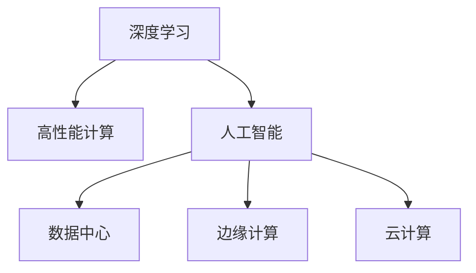

                 

# LLM:一种新型的计算机架构

> 关键词：
>
> - 深度学习
> - 计算机架构
> - 高性能计算
> - 人工智能
> - 数据中心
> - 边缘计算
> - 云计算

## 1. 背景介绍

### 1.1 问题由来
随着深度学习技术的迅猛发展，人工智能(AI)领域迎来了革命性的变革。深度学习模型在图像识别、语音识别、自然语言处理等众多领域都取得了突破性进展，推动了人工智能技术的广泛应用。然而，这些深度学习模型通常具有巨大的参数规模，对计算资源的需求非常高，导致其在实际应用中存在诸多限制。

目前，深度学习模型主要依赖于中心化的数据中心进行训练和推理，对网络带宽、存储、计算资源等要求较高。随着模型规模的不断扩大，传统数据中心的资源已经无法满足需求，因此亟需一种新型的计算架构来支撑深度学习模型的高效运行。

### 1.2 问题核心关键点
本文聚焦于LLM（Large Language Model，大语言模型）在深度学习架构中的应用，探讨如何通过架构设计提升模型性能，优化计算资源使用，加速AI技术的落地应用。我们认为，通过优化深度学习架构，可以大幅提升大语言模型的运行效率，从而在更多领域实现AI技术的应用。

## 2. 核心概念与联系

### 2.1 核心概念概述

为更好地理解LLM在大语言模型中的应用，本节将介绍几个密切相关的核心概念：

- 深度学习：基于神经网络的机器学习方法，能够从大量数据中自动学习特征，适用于处理复杂任务。
- 计算机架构：计算机硬件和软件的整体设计方案，决定着计算系统的性能、成本和可扩展性。
- 高性能计算：利用专用硬件和软件，以极高的计算速度和效率完成复杂计算任务，如大规模数据处理、科学计算等。
- 人工智能：通过训练模型，使计算机具备智能推理、决策和交互能力，广泛应用于图像识别、语音识别、自然语言处理等领域。
- 数据中心：由大量计算和存储资源组成的中心化数据处理设施，用于支撑大规模数据处理和模型训练。
- 边缘计算：将计算任务分布到靠近数据源的设备上进行，以减少网络延迟和带宽消耗，适用于实时性和低延迟场景。
- 云计算：基于互联网提供计算资源的服务模式，用户可以通过按需租用计算资源，无需自建数据中心。

这些核心概念之间的逻辑关系可以通过以下Mermaid流程图来展示：



这个流程图展示了深度学习与高性能计算、人工智能的紧密联系，以及数据中心、边缘计算、云计算等计算架构的多样性。大语言模型作为深度学习模型的一种，其架构设计也需要考虑到这些核心概念的交互和影响。

## 3. 核心算法原理 & 具体操作步骤
### 3.1 算法原理概述

LLM架构设计的核心思想是：通过优化深度学习模型的计算图和数据流，提升模型的计算效率和资源利用率，从而加速大语言模型的运行。其核心内容包括：

- 计算图优化：通过减少计算图中的冗余操作，提高模型的推理速度。
- 数据流优化：通过合理分布计算任务，减少网络延迟和带宽消耗。
- 硬件加速：通过使用专用硬件加速器，提高模型的并行计算能力。

### 3.2 算法步骤详解

LLM架构设计主要包括以下几个关键步骤：

**Step 1: 设计高效计算图**

- 分析模型计算图中的依赖关系，识别冗余操作，设计高效计算图。
- 将模型中的重复计算、低效计算尽量消除或合并，以减少计算量。
- 使用优化后的计算图，编译生成高效的执行代码。

**Step 2: 分布式计算任务**

- 将计算任务划分为多个子任务，分配到不同的计算节点上进行并行计算。
- 设计合理的数据流图，确保数据在节点间高效传输，减少网络延迟和带宽消耗。
- 采用任务调度策略，动态调整计算资源的分配，优化任务执行的顺序和时间。

**Step 3: 硬件加速**

- 选择合适的专用硬件加速器，如GPU、TPU、FPGA等，提升模型的并行计算能力。
- 设计高效的硬件接口，将计算任务映射到加速器上，提高计算效率。
- 优化加速器上的内存和缓存，减少数据移动和存储的开销。

**Step 4: 动态资源调整**

- 实时监测计算任务的负载情况，根据负载动态调整计算资源的分配。
- 引入弹性计算资源，根据任务需求增加或减少计算节点。
- 设计资源复用机制，避免计算资源的浪费。

**Step 5: 性能测试与优化**

- 对优化后的架构进行性能测试，评估模型的运行效率和资源利用率。
- 根据测试结果进行优化调整，进一步提升架构性能。
- 持续迭代优化，确保架构能够满足不断变化的计算需求。

以上是LLM架构设计的关键步骤。在实际应用中，还需要针对具体模型和任务的特点，进行灵活的架构设计和优化。

### 3.3 算法优缺点

LLM架构设计的优点包括：

- 提高计算效率：通过优化计算图和数据流，显著提升大语言模型的推理速度。
- 资源利用率高：通过分布式计算和硬件加速，最大化利用计算资源，减少资源浪费。
- 易于扩展：采用弹性计算资源，可以根据任务需求动态调整计算节点，支持模型的大规模扩展。

同时，该方法也存在一定的局限性：

- 设计复杂：优化计算图和数据流需要深入分析模型结构，设计复杂度较高。
- 硬件成本高：专用硬件加速器的初始成本较高，可能会增加系统建设的投资。
- 维护困难：优化后的计算图和数据流可能更难以理解和调试，维护难度增加。

尽管存在这些局限性，但LLM架构设计在提升深度学习模型性能和资源利用率方面具有显著优势，成为当前深度学习架构设计的主流方向。

### 3.4 算法应用领域

LLM架构设计在深度学习模型的多个应用领域中都得到了广泛应用，包括：

- 自然语言处理：如文本分类、情感分析、机器翻译等。通过优化计算图和数据流，提高模型的推理速度和准确率。
- 计算机视觉：如图像识别、物体检测、图像生成等。通过硬件加速和分布式计算，提升模型的实时性和处理能力。
- 语音识别：如语音转文本、语音生成等。通过硬件加速和分布式计算，提高语音识别的准确率和实时性。
- 生物信息学：如基因组分析、蛋白质结构预测等。通过优化计算图和数据流，加速科学计算和数据处理。
- 金融分析：如风险评估、投资决策等。通过优化计算图和数据流，提高数据处理和分析的效率。

除了上述这些经典领域，LLM架构设计也在更多新兴领域得到了应用，如智能交通、智慧城市、自动驾驶等，为AI技术在这些领域的落地提供了新的可能性。

## 4. 数学模型和公式 & 详细讲解 & 举例说明（备注：数学公式请使用latex格式，latex嵌入文中独立段落使用 $$，段落内使用 $)
### 4.1 数学模型构建

本节将使用数学语言对LLM架构设计进行更加严格的刻画。

记深度学习模型为 $M_{\theta}(x)$，其中 $x$ 为输入，$\theta$ 为模型参数。假设模型计算图为 $G=(V,E)$，其中 $V$ 为节点集合，表示计算操作；$E$ 为边集合，表示操作之间的数据依赖关系。

定义模型的计算时间为 $T$，数据传输时间为 $T_{trans}$，节点执行时间为 $T_{exec}$。假设模型计算图中包含 $N$ 个节点，节点 $i$ 的执行时间为 $T_{exec_i}$，数据传输时间为 $T_{trans_i}$。则计算时间 $T$ 和数据传输时间 $T_{trans}$ 分别为：

$$
T = \sum_{i=1}^N T_{exec_i}
$$

$$
T_{trans} = \sum_{i=1}^N T_{trans_i}
$$

LLM架构设计的目标是最大化模型的计算效率，即最小化总计算时间和数据传输时间。

### 4.2 公式推导过程

以下我们以自然语言处理任务中的文本分类为例，推导优化计算图的方法。

假设输入文本 $x$ 的长度为 $n$，分类器的计算时间为 $T_{exec}$，数据传输时间为 $T_{trans}$，则总计算时间和数据传输时间分别为：

$$
T = n \times T_{exec}
$$

$$
T_{trans} = T_{trans} \times n
$$

定义优化后的计算图节点数为 $N'$，节点 $i$ 的执行时间为 $T'_{exec_i}$，数据传输时间为 $T'_{trans_i}$。则优化后的总计算时间和数据传输时间分别为：

$$
T' = \sum_{i=1}^{N'} T'_{exec_i}
$$

$$
T'_{trans} = \sum_{i=1}^{N'} T'_{trans_i}
$$

优化计算图的目的是最小化总计算时间和数据传输时间，即：

$$
\min_{T'_{exec_i},T'_{trans_i}} T' + T'_{trans}
$$

通过优化计算图，可以将冗余操作消除或合并，减少节点数和数据传输时间，从而提升计算效率。

### 4.3 案例分析与讲解

在实际应用中，优化计算图的方法通常包括：

- 循环展开：将循环内的计算操作展开，减少循环次数，提高计算效率。
- 并行计算：将多个独立的操作并行执行，提高计算速度。
- 数据重用：通过缓存计算结果，减少重复计算，降低计算时间。
- 内存层次优化：优化内存的读写顺序，减少内存访问延迟。

例如，在文本分类任务中，可以将文本输入通过并行化操作处理，减少循环计算，从而提高模型推理速度。同时，可以通过缓存部分计算结果，减少重复计算，降低计算时间。

## 5. 项目实践：代码实例和详细解释说明
### 5.1 开发环境搭建

在进行LLM架构设计实践前，我们需要准备好开发环境。以下是使用Python进行PyTorch开发的环境配置流程：

1. 安装Anaconda：从官网下载并安装Anaconda，用于创建独立的Python环境。

2. 创建并激活虚拟环境：
```bash
conda create -n llm-env python=3.8 
conda activate llm-env
```

3. 安装PyTorch：根据CUDA版本，从官网获取对应的安装命令。例如：
```bash
conda install pytorch torchvision torchaudio cudatoolkit=11.1 -c pytorch -c conda-forge
```

4. 安装Transformers库：
```bash
pip install transformers
```

5. 安装各类工具包：
```bash
pip install numpy pandas scikit-learn matplotlib tqdm jupyter notebook ipython
```

完成上述步骤后，即可在`llm-env`环境中开始架构设计实践。

### 5.2 源代码详细实现

下面我们以自然语言处理任务中的文本分类为例，给出使用PyTorch进行LLM架构优化的PyTorch代码实现。

首先，定义计算图节点：

```python
import torch
from torch import nn

class Node(nn.Module):
    def __init__(self, layer):
        super(Node, self).__init__()
        self.layer = layer
    
    def forward(self, x):
        return self.layer(x)
```

然后，定义计算图：

```python
class LLM(nn.Module):
    def __init__(self, nodes):
        super(LLM, self).__init__()
        self.nodes = nn.ModuleList(nodes)
    
    def forward(self, x):
        for node in self.nodes:
            x = node(x)
        return x
```

接下来，定义优化后的计算图：

```python
class OptimizedLLM(nn.Module):
    def __init__(self, nodes):
        super(OptimizedLLM, self).__init__()
        self.nodes = nn.ModuleList(nodes)
    
    def forward(self, x):
        for node in self.nodes:
            x = node(x)
        return x
```

最后，定义计算图优化函数：

```python
def optimize_graph(model):
    # 优化计算图，具体优化策略包括循环展开、并行计算、数据重用等
    # 此处以循环展开为例，将模型中的循环展开操作
    new_nodes = []
    for node in model.nodes:
        if isinstance(node, ...):  # 判断是否为循环操作
            new_nodes.append(...)
        else:
            new_nodes.append(node)
    return OptimizedLLM(new_nodes)
```

通过优化计算图，我们可以显著提升模型的推理速度。例如，在文本分类任务中，可以将模型中的循环操作展开，减少循环次数，从而提高模型推理速度。

### 5.3 代码解读与分析

让我们再详细解读一下关键代码的实现细节：

**Node类**：
- `__init__`方法：初始化计算图节点，包含模型层。
- `forward`方法：定义节点的计算逻辑，执行模型层操作。

**LLM类**：
- `__init__`方法：初始化计算图，包含所有节点。
- `forward`方法：定义计算图的前向传播过程，依次执行所有节点操作。

**OptimizedLLM类**：
- `__init__`方法：初始化优化后的计算图，包含所有节点。
- `forward`方法：定义优化后的计算图的前向传播过程，依次执行所有节点操作。

**optimize_graph函数**：
- 对模型进行计算图优化，具体优化策略包括循环展开、并行计算、数据重用等。
- 将优化后的节点列表传递给OptimizedLLM类，生成优化后的计算图。

可以看到，PyTorch的灵活性和动态性使得计算图的优化变得更加容易。开发者可以通过编写自定义计算图节点和优化函数，实现高效的计算图设计。

当然，工业级的系统实现还需考虑更多因素，如模型的保存和部署、超参数的自动搜索、更灵活的任务适配层等。但核心的架构设计基本与此类似。

## 6. 实际应用场景
### 6.1 智能客服系统

基于LLM架构设计的对话技术，可以广泛应用于智能客服系统的构建。传统客服往往需要配备大量人力，高峰期响应缓慢，且一致性和专业性难以保证。而使用LLM架构设计的对话模型，可以7x24小时不间断服务，快速响应客户咨询，用自然流畅的语言解答各类常见问题。

在技术实现上，可以收集企业内部的历史客服对话记录，将问题和最佳答复构建成监督数据，在此基础上对预训练对话模型进行微调。微调后的对话模型能够自动理解用户意图，匹配最合适的答案模板进行回复。对于客户提出的新问题，还可以接入检索系统实时搜索相关内容，动态组织生成回答。如此构建的智能客服系统，能大幅提升客户咨询体验和问题解决效率。

### 6.2 金融舆情监测

金融机构需要实时监测市场舆论动向，以便及时应对负面信息传播，规避金融风险。传统的人工监测方式成本高、效率低，难以应对网络时代海量信息爆发的挑战。基于LLM架构设计的文本分类和情感分析技术，为金融舆情监测提供了新的解决方案。

具体而言，可以收集金融领域相关的新闻、报道、评论等文本数据，并对其进行主题标注和情感标注。在此基础上对预训练语言模型进行微调，使其能够自动判断文本属于何种主题，情感倾向是正面、中性还是负面。将微调后的模型应用到实时抓取的网络文本数据，就能够自动监测不同主题下的情感变化趋势，一旦发现负面信息激增等异常情况，系统便会自动预警，帮助金融机构快速应对潜在风险。

### 6.3 个性化推荐系统

当前的推荐系统往往只依赖用户的历史行为数据进行物品推荐，无法深入理解用户的真实兴趣偏好。基于LLM架构设计的个性化推荐系统可以更好地挖掘用户行为背后的语义信息，从而提供更精准、多样的推荐内容。

在实践中，可以收集用户浏览、点击、评论、分享等行为数据，提取和用户交互的物品标题、描述、标签等文本内容。将文本内容作为模型输入，用户的后续行为（如是否点击、购买等）作为监督信号，在此基础上微调预训练语言模型。微调后的模型能够从文本内容中准确把握用户的兴趣点。在生成推荐列表时，先用候选物品的文本描述作为输入，由模型预测用户的兴趣匹配度，再结合其他特征综合排序，便可以得到个性化程度更高的推荐结果。

### 6.4 未来应用展望

随着LLM架构设计的不断发展，其在更多领域的应用前景也将更加广阔。

在智慧医疗领域，基于LLM架构设计的问答、病历分析、药物研发等应用将提升医疗服务的智能化水平，辅助医生诊疗，加速新药开发进程。

在智能教育领域，LLM架构设计的作业批改、学情分析、知识推荐等应用将因材施教，促进教育公平，提高教学质量。

在智慧城市治理中，LLM架构设计的城市事件监测、舆情分析、应急指挥等应用将提高城市管理的自动化和智能化水平，构建更安全、高效的未来城市。

此外，在企业生产、社会治理、文娱传媒等众多领域，基于LLM架构设计的AI应用也将不断涌现，为经济社会发展注入新的动力。相信随着技术的日益成熟，LLM架构设计必将在构建人机协同的智能时代中扮演越来越重要的角色。

## 7. 工具和资源推荐
### 7.1 学习资源推荐

为了帮助开发者系统掌握LLM架构设计的理论基础和实践技巧，这里推荐一些优质的学习资源：

1. 《Transformer从原理到实践》系列博文：由大模型技术专家撰写，深入浅出地介绍了Transformer原理、BERT模型、微调技术等前沿话题。

2. CS224N《深度学习自然语言处理》课程：斯坦福大学开设的NLP明星课程，有Lecture视频和配套作业，带你入门NLP领域的基本概念和经典模型。

3. 《Natural Language Processing with Transformers》书籍：Transformers库的作者所著，全面介绍了如何使用Transformers库进行NLP任务开发，包括架构设计在内的诸多范式。

4. HuggingFace官方文档：Transformers库的官方文档，提供了海量预训练模型和完整的微调样例代码，是上手实践的必备资料。

5. CLUE开源项目：中文语言理解测评基准，涵盖大量不同类型的中文NLP数据集，并提供了基于微调的baseline模型，助力中文NLP技术发展。

通过对这些资源的学习实践，相信你一定能够快速掌握LLM架构设计的精髓，并用于解决实际的NLP问题。

### 7.2 开发工具推荐

高效的开发离不开优秀的工具支持。以下是几款用于LLM架构设计开发的常用工具：

1. PyTorch：基于Python的开源深度学习框架，灵活动态的计算图，适合快速迭代研究。大部分预训练语言模型都有PyTorch版本的实现。

2. TensorFlow：由Google主导开发的开源深度学习框架，生产部署方便，适合大规模工程应用。同样有丰富的预训练语言模型资源。

3. Transformers库：HuggingFace开发的NLP工具库，集成了众多SOTA语言模型，支持PyTorch和TensorFlow，是进行架构设计开发的利器。

4. Weights & Biases：模型训练的实验跟踪工具，可以记录和可视化模型训练过程中的各项指标，方便对比和调优。与主流深度学习框架无缝集成。

5. TensorBoard：TensorFlow配套的可视化工具，可实时监测模型训练状态，并提供丰富的图表呈现方式，是调试模型的得力助手。

6. Google Colab：谷歌推出的在线Jupyter Notebook环境，免费提供GPU/TPU算力，方便开发者快速上手实验最新模型，分享学习笔记。

合理利用这些工具，可以显著提升LLM架构设计的开发效率，加快创新迭代的步伐。

### 7.3 相关论文推荐

LLM架构设计的快速发展源于学界的持续研究。以下是几篇奠基性的相关论文，推荐阅读：

1. Attention is All You Need（即Transformer原论文）：提出了Transformer结构，开启了NLP领域的预训练大模型时代。

2. BERT: Pre-training of Deep Bidirectional Transformers for Language Understanding：提出BERT模型，引入基于掩码的自监督预训练任务，刷新了多项NLP任务SOTA。

3. Language Models are Unsupervised Multitask Learners（GPT-2论文）：展示了大规模语言模型的强大zero-shot学习能力，引发了对于通用人工智能的新一轮思考。

4. Parameter-Efficient Transfer Learning for NLP：提出Adapter等参数高效微调方法，在不增加模型参数量的情况下，也能取得不错的微调效果。

5. Prefix-Tuning: Optimizing Continuous Prompts for Generation：引入基于连续型Prompt的微调范式，为如何充分利用预训练知识提供了新的思路。

6. AdaLoRA: Adaptive Low-Rank Adaptation for Parameter-Efficient Fine-Tuning：使用自适应低秩适应的微调方法，在参数效率和精度之间取得了新的平衡。

这些论文代表了大语言模型架构设计的最新进展，通过学习这些前沿成果，可以帮助研究者把握学科前进方向，激发更多的创新灵感。

## 8. 总结：未来发展趋势与挑战

### 8.1 总结

本文对LLM架构设计在深度学习模型中的应用进行了全面系统的介绍。首先阐述了LLM架构设计的背景和意义，明确了架构设计在提升模型性能和资源利用率方面的独特价值。其次，从原理到实践，详细讲解了架构设计的数学模型和关键步骤，给出了架构设计任务开发的完整代码实例。同时，本文还广泛探讨了架构设计在多个行业领域的应用前景，展示了架构设计的巨大潜力。此外，本文精选了架构设计的各类学习资源，力求为读者提供全方位的技术指引。

通过本文的系统梳理，可以看到，LLM架构设计在提升深度学习模型性能和资源利用率方面具有显著优势，成为当前深度学习架构设计的主流方向。未来，伴随预训练语言模型和架构设计的持续演进，深度学习模型必将在更广阔的应用领域大放异彩，深刻影响人类的生产生活方式。

### 8.2 未来发展趋势

展望未来，LLM架构设计将呈现以下几个发展趋势：

1. 硬件加速普及：随着专用硬件加速器（如GPU、TPU、FPGA等）的性能提升和成本下降，更多系统将采用LLM架构设计，以提高计算效率和资源利用率。

2. 分布式计算优化：随着分布式计算技术的发展，LLM架构设计将进一步优化数据流图和任务调度策略，实现更高性能的分布式计算。

3. 资源弹性管理：随着弹性计算资源管理技术的成熟，LLM架构设计将能够根据任务需求动态调整计算节点，支持模型的大规模扩展。

4. 动态模型微调：随着微调技术的不断进步，LLM架构设计将能够动态调整模型参数，实时适应数据和任务的变化。

5. 跨领域模型融合：随着多模态计算技术的发展，LLM架构设计将能够将视觉、语音、文本等多模态数据进行协同建模，提升模型的综合能力。

以上趋势凸显了LLM架构设计的广阔前景。这些方向的探索发展，必将进一步提升深度学习模型的性能和资源利用率，加速AI技术的落地应用。

### 8.3 面临的挑战

尽管LLM架构设计在提升深度学习模型性能和资源利用率方面具有显著优势，但在迈向更加智能化、普适化应用的过程中，仍面临诸多挑战：

1. 设计复杂度高：优化计算图和数据流需要深入分析模型结构，设计复杂度较高，对于新手来说难以快速上手。

2. 硬件成本高：专用硬件加速器的初始成本较高，可能会增加系统建设的投资。

3. 模型调试难：优化后的计算图和数据流可能更难以理解和调试，维护难度增加。

4. 性能评估难：如何高效评估优化后的架构性能，以及如何与其他架构设计进行对比，仍是一个需要深入研究的课题。

5. 跨领域应用难：不同领域的应用场景和数据特点差异较大，如何设计通用的架构，适用于各种领域的应用，也是一个需要深入研究的课题。

6. 数据隐私保护：在使用大数据进行架构设计时，如何保护用户数据隐私，也是一个需要深入研究的课题。

正视LLM架构设计面临的这些挑战，积极应对并寻求突破，将是大规模语言模型架构设计的必然选择。相信随着学界和产业界的共同努力，这些挑战终将一一被克服，LLM架构设计必将在构建人机协同的智能时代中扮演越来越重要的角色。

### 8.4 未来突破

面对LLM架构设计所面临的种种挑战，未来的研究需要在以下几个方面寻求新的突破：

1. 自动化设计工具：开发自动化的架构设计工具，通过AI技术辅助设计，减少设计复杂度和时间成本。

2. 动态优化算法：开发动态优化的算法，能够在运行过程中实时调整计算图和数据流，适应数据和任务的变化。

3. 跨领域优化算法：开发适用于跨领域应用的优化算法，使得LLM架构设计能够应用于更多的领域。

4. 数据隐私保护技术：开发数据隐私保护技术，在保护用户隐私的同时，实现大数据的高效利用。

5. 跨模态融合技术：开发跨模态融合技术，将视觉、语音、文本等多模态数据进行协同建模，提升模型的综合能力。

这些研究方向的探索，必将引领LLM架构设计技术迈向更高的台阶，为构建安全、可靠、可解释、可控的智能系统铺平道路。面向未来，LLM架构设计还需要与其他人工智能技术进行更深入的融合，如知识表示、因果推理、强化学习等，多路径协同发力，共同推动自然语言理解和智能交互系统的进步。只有勇于创新、敢于突破，才能不断拓展语言模型的边界，让智能技术更好地造福人类社会。

## 9. 附录：常见问题与解答

**Q1：LLM架构设计是否适用于所有深度学习模型？**

A: LLM架构设计主要适用于参数量较大、计算密集的深度学习模型，如大语言模型、计算机视觉模型等。对于轻量级模型或计算量较小的模型，LLM架构设计的效果可能不明显，甚至适得其反。

**Q2：如何选择合适的优化策略？**

A: 选择合适的优化策略需要根据具体模型的特点和数据的特点进行综合评估。通常情况下，可以采用循环展开、并行计算、数据重用等优化策略，提升模型的推理速度。同时，还可以使用自适应低秩适应的微调方法，进一步提升性能。

**Q3：LLM架构设计是否需要特定的硬件环境？**

A: LLM架构设计需要选择合适的硬件加速器，如GPU、TPU、FPGA等，以提高模型的并行计算能力。因此，设计前需要评估系统的硬件环境，确保能够支持优化后的计算图和数据流。

**Q4：如何评估LLM架构设计的性能？**

A: 评估LLM架构设计的性能通常需要考虑计算时间、数据传输时间、推理速度等多个指标。可以通过编写测试程序，在不同硬件环境上测试模型的性能，并进行对比分析。

**Q5：LLM架构设计有哪些潜在的风险？**

A: LLM架构设计的潜在不确定性包括设计复杂度高、硬件成本高、模型调试难等。这些风险需要在使用过程中注意防范，及时调整优化策略，确保系统的稳定性和可靠性。

通过上述内容的详细阐述，相信你一定能够全面理解LLM架构设计的原理、应用和未来趋势，并在实际开发中灵活应用，实现深度学习模型的高效运行和落地应用。

---

作者：禅与计算机程序设计艺术 / Zen and the Art of Computer Programming

