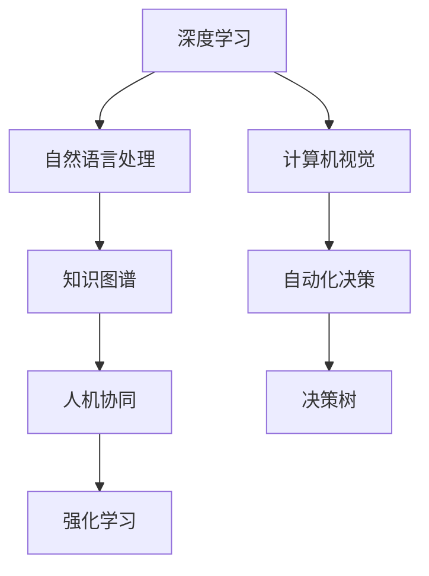

                 

# LLM与传统AI的融合：新时代的智能革命

> 关键词：大语言模型(LLM),深度学习,传统人工智能(AI),知识图谱,自然语言处理(NLP),计算机视觉(CV),自动化决策,人机协同

## 1. 背景介绍

### 1.1 问题由来
近年来，人工智能技术迅速发展，深度学习作为其中最为耀眼的成果之一，已经广泛应用于各个领域。在NLP、CV等热门领域，深度学习模型已经展现了强大的实力，成为推动科技进步和产业革新的关键力量。

然而，尽管深度学习取得了巨大成功，但其仍存在诸多局限性。深度模型依赖大量标注数据进行训练，对数据的噪声敏感，缺乏对常识、因果关系等知识的学习。传统的AI方法则以符号和规则为主，存在知识难以自动更新、灵活性不足等问题。如何融合深度学习与传统AI，发挥各自优势，构建更为强大、灵活、泛化的智能系统，成为了当前AI研究的重要课题。

### 1.2 问题核心关键点
深度学习与传统AI的融合，旨在构建一种新型智能系统，既能利用深度学习强大的数据建模能力，又能融入人类丰富的知识经验和常识推理，实现更加智能、高效的决策与互动。关键点包括：

- 知识图谱(Knowledge Graphs)：利用图谱结构化的知识，为深度学习模型提供丰富的语义信息，提高其对现实世界的理解能力。
- 自然语言处理(NLP)：通过深度学习技术，提升语言理解和生成能力，实现更精准的信息提取、文本生成和语义推理。
- 计算机视觉(CV)：利用深度学习进行图像处理和理解，增强机器人、自动驾驶等应用领域的感知能力。
- 自动化决策：结合深度学习与规则系统，构建能够自动做出复杂决策的智能系统。
- 人机协同：通过智能助手、聊天机器人等应用，实现人与机器的协作，提升用户体验和效率。

## 2. 核心概念与联系

### 2.1 核心概念概述

为更好地理解深度学习与传统AI的融合，本节将介绍几个密切相关的核心概念：

- 深度学习(Deep Learning)：一种基于神经网络的机器学习技术，通过多个层次的抽象表示，学习复杂的数据特征。
- 传统人工智能(AI)：以符号、规则和逻辑为基础，强调知识表示、推理和规划的AI范式。
- 知识图谱(Knowledge Graphs)：一种结构化的知识表示方法，通过节点和边来描述实体和它们之间的关系。
- 自然语言处理(NLP)：利用计算机处理人类语言的技术，包括文本分类、信息提取、机器翻译等。
- 计算机视觉(CV)：利用计算机处理图像和视频的技术，包括图像识别、目标检测、图像生成等。
- 自动化决策：通过计算机系统自动完成决策和规划的过程，如自动驾驶、金融风险控制等。
- 人机协同：通过AI技术增强人机交互体验，提升协作效率，如智能客服、智能助手等。

这些核心概念之间的逻辑关系可以通过以下Mermaid流程图来展示：



这个流程图展示了大语言模型与传统AI各模块之间的关联关系：

1. 深度学习为其他模块提供强大的数据建模能力。
2. 自然语言处理利用深度学习进行语言理解和生成。
3. 计算机视觉通过深度学习实现图像处理和理解。
4. 知识图谱为深度学习提供结构化的知识，增强其语义理解能力。
5. 自动化决策结合深度学习和规则系统，实现复杂决策。
6. 人机协同增强人机交互体验，提升协作效率。

这些核心概念共同构成了AI融合技术的框架，为构建智能系统提供了重要的基础。

## 3. 核心算法原理 & 具体操作步骤

### 3.1 算法原理概述

深度学习与传统AI的融合，本质上是一种多模态学习(multi-modal learning)过程。其核心思想是：将深度学习与传统AI的优势结合，构建能够综合利用多种数据源、知识表示和推理机制的智能系统。

形式化地，假设深度学习模型为 $DNN_{\theta}$，其中 $\theta$ 为模型参数。给定知识图谱 $KG$ 和NLP任务 $T$ 的标注数据集 $D=\{(x_i,y_i)\}_{i=1}^N$，融合学习的优化目标是最小化经验风险，即找到最优参数：

$$
\theta^* = \mathop{\arg\min}_{\theta} \mathcal{L}(DNN_{\theta},KG,T)
$$

其中 $\mathcal{L}$ 为针对任务 $T$ 设计的损失函数，用于衡量模型输出与真实标签之间的差异。

### 3.2 算法步骤详解

深度学习与传统AI的融合过程一般包括以下几个关键步骤：

**Step 1: 构建多模态融合框架**
- 选择合适的深度学习模型作为基础，如卷积神经网络(CNN)、循环神经网络(RNN)、Transformer等。
- 将知识图谱和NLP数据进行融合，设计合适的多模态特征提取器。

**Step 2: 定义融合目标函数**
- 选择合适的损失函数，如交叉熵损失、均方误差损失等。
- 将知识图谱的推理结果和NLP模型的预测结果进行融合，设计融合函数。

**Step 3: 设计优化算法**
- 选择合适的优化算法及其参数，如Adam、SGD等，设置学习率、批大小、迭代轮数等。
- 应用正则化技术，如L2正则、Dropout、Early Stopping等，防止模型过度适应小规模训练集。

**Step 4: 执行梯度训练**
- 将训练集数据分批次输入模型，前向传播计算损失函数。
- 反向传播计算参数梯度，根据设定的优化算法和学习率更新模型参数。
- 周期性在验证集上评估模型性能，根据性能指标决定是否触发 Early Stopping。
- 重复上述步骤直到满足预设的迭代轮数或 Early Stopping 条件。

**Step 5: 测试和部署**
- 在测试集上评估融合后模型 $DNN_{\hat{\theta}}$ 的性能，对比融合前后的精度提升。
- 使用融合后的模型对新样本进行推理预测，集成到实际的应用系统中。
- 持续收集新的数据，定期重新融合模型，以适应数据分布的变化。

以上是深度学习与传统AI融合的一般流程。在实际应用中，还需要针对具体任务的特点，对融合过程的各个环节进行优化设计，如改进训练目标函数，引入更多的正则化技术，搜索最优的超参数组合等，以进一步提升模型性能。

### 3.3 算法优缺点

深度学习与传统AI的融合方法具有以下优点：
1. 融合多样数据源。能够综合利用文本、图像、知识图谱等多种数据源，提升模型的泛化能力。
2. 提高推理能力。将知识图谱的推理结果与深度学习模型的预测结果相结合，实现更加精确的决策和规划。
3. 增强可解释性。通过规则系统的介入，增强模型的可解释性和可理解性，便于人工调试和优化。
4. 强化鲁棒性。利用规则系统的约束，增强模型的鲁棒性，避免模型过拟合和异常情况。

同时，该方法也存在一定的局限性：
1. 融合过程复杂。需要设计多模态融合策略，选择合适的融合函数，过程较为复杂。
2. 数据融合困难。知识图谱和NLP数据的融合需要克服语义差异、数据格式等障碍，实现有效融合。
3. 计算资源消耗大。深度学习模型和知识图谱推理过程都消耗大量计算资源，模型训练和推理成本较高。
4. 可扩展性不足。融合框架难以扩展到更多模态数据，如语音、视频等。

尽管存在这些局限性，但就目前而言，深度学习与传统AI的融合方法仍然是构建智能系统的关键技术之一。未来相关研究的重点在于如何进一步简化融合过程，提高融合效率，降低计算成本，同时兼顾可解释性和鲁棒性等因素。

### 3.4 算法应用领域

深度学习与传统AI的融合方法，已经在诸多领域得到了广泛应用，例如：

- 医疗诊断：结合知识图谱和深度学习，提升疾病诊断的准确性和效率。
- 金融分析：利用NLP技术和知识图谱，进行市场分析和风险控制。
- 智能制造：通过深度学习和规则系统，实现生产调度和质量控制。
- 自动驾驶：结合计算机视觉和知识图谱，进行路径规划和行为决策。
- 智能客服：利用自然语言处理和知识图谱，提升客户服务体验和问题解决效率。

除了上述这些经典应用外，深度学习与传统AI的融合技术也在更多场景中得到创新性地应用，如智能家居、智慧城市、智能监控等，为AI技术带来了新的突破。随着深度学习与传统AI技术的不断进步，相信AI融合技术将在更广阔的应用领域大放异彩。

## 4. 数学模型和公式 & 详细讲解 & 举例说明

### 4.1 数学模型构建

本节将使用数学语言对深度学习与传统AI融合过程进行更加严格的刻画。

记深度学习模型为 $DNN_{\theta}$，知识图谱推理结果为 $KG_{KG}$，自然语言处理模型为 $NLP_{\theta}$，给定知识图谱 $KG$ 和NLP任务 $T$ 的训练集为 $D=\{(x_i,y_i)\}_{i=1}^N$，其中 $x_i$ 表示输入样本， $y_i$ 表示标签。融合后的模型优化目标函数定义为：

$$
\mathcal{L}(DNN_{\theta},KG_{KG},NLP_{\theta}) = \frac{1}{N}\sum_{i=1}^N [f(KG_{KG},NLP_{\theta}(x_i)) \times L(DNN_{\theta}(x_i),y_i)]
$$

其中 $f$ 为多模态融合函数，$L$ 为任务 $T$ 设计的损失函数，如交叉熵损失等。

### 4.2 公式推导过程

以下我们以医疗诊断任务为例，推导融合后的模型优化目标函数及其梯度的计算公式。

假设输入样本为 $x$，其中包含病历、症状等信息，模型 $DNN_{\theta}$ 的输出为 $dnn_{\theta}(x)$，知识图谱 $KG$ 推理结果为 $kg(x)$，自然语言处理模型 $NLP_{\theta}$ 的输出为 $nlp_{\theta}(x)$。则医疗诊断任务的目标函数为：

$$
\mathcal{L}(DNN_{\theta},KG_{KG},NLP_{\theta}) = \frac{1}{N}\sum_{i=1}^N [kg(x_i) \times (\log(dnn_{\theta}(x_i)) - y_i)]
$$

根据链式法则，优化目标函数对 $DNN_{\theta}$ 的参数 $\theta$ 的梯度为：

$$
\frac{\partial \mathcal{L}}{\partial \theta} = \frac{1}{N}\sum_{i=1}^N [kg(x_i) \times \frac{\partial dnn_{\theta}(x_i)}{\partial \theta}]
$$

其中 $dnn_{\theta}(x_i)$ 可通过反向传播算法高效计算。

在得到优化目标函数的梯度后，即可带入参数更新公式，完成模型的迭代优化。重复上述过程直至收敛，最终得到适应融合任务的最优模型参数 $\theta^*$。

## 5. 项目实践：代码实例和详细解释说明

### 5.1 开发环境搭建

在进行融合实践前，我们需要准备好开发环境。以下是使用Python进行PyTorch开发的环境配置流程：

1. 安装Anaconda：从官网下载并安装Anaconda，用于创建独立的Python环境。

2. 创建并激活虚拟环境：
```bash
conda create -n ai-env python=3.8 
conda activate ai-env
```

3. 安装PyTorch：根据CUDA版本，从官网获取对应的安装命令。例如：
```bash
conda install pytorch torchvision torchaudio cudatoolkit=11.1 -c pytorch -c conda-forge
```

4. 安装TensorFlow：如果需要，可通过以下命令安装TensorFlow。例如：
```bash
conda install tensorflow -c pytorch -c conda-forge
```

5. 安装各类工具包：
```bash
pip install numpy pandas scikit-learn matplotlib tqdm jupyter notebook ipython
```

完成上述步骤后，即可在`ai-env`环境中开始融合实践。

### 5.2 源代码详细实现

这里以一个简单的医疗诊断任务为例，演示如何使用PyTorch进行深度学习与传统AI的融合。

首先，定义任务的数据处理函数：

```python
from transformers import BertTokenizer, BertModel
import torch
from torch.utils.data import Dataset, DataLoader
import numpy as np

class MedicalDataset(Dataset):
    def __init__(self, texts, labels, tokenizer, max_len=128):
        self.texts = texts
        self.labels = labels
        self.tokenizer = tokenizer
        self.max_len = max_len
        
    def __len__(self):
        return len(self.texts)
    
    def __getitem__(self, item):
        text = self.texts[item]
        label = self.labels[item]
        
        encoding = self.tokenizer(text, return_tensors='pt', max_length=self.max_len, padding='max_length', truncation=True)
        input_ids = encoding['input_ids'][0]
        attention_mask = encoding['attention_mask'][0]
        
        # 将标签编码成0-1的二值向量
        label = torch.tensor([label=='disease'], dtype=torch.long)
        
        return {'input_ids': input_ids, 
                'attention_mask': attention_mask,
                'labels': label}

# 创建dataset
tokenizer = BertTokenizer.from_pretrained('bert-base-cased')

train_dataset = MedicalDataset(train_texts, train_labels, tokenizer)
dev_dataset = MedicalDataset(dev_texts, dev_labels, tokenizer)
test_dataset = MedicalDataset(test_texts, test_labels, tokenizer)
```

然后，定义深度学习模型和知识图谱推理模型：

```python
from transformers import BertForSequenceClassification
import pyknow

class MedicalModel(BertForSequenceClassification):
    def __init__(self, config, num_labels=2):
        super(MedicalModel, self).__init__(config, num_labels)
        
    def forward(self, input_ids, attention_mask=None, labels=None):
        outputs = super().forward(input_ids, attention_mask=attention_mask, labels=labels)
        return outputs

class KnowledgeGraphModel(pyknow.models.Inference):
    def __init__(self, graph):
        super(KnowledgeGraphModel, self).__init__(graph)
        
    def predict(self, text):
        return self.predict_entity(text)
```

接着，定义融合函数：

```python
def fusion_model(dnn_model, kg_model):
    def forward(self, input_ids, attention_mask=None, labels=None):
        dnn_output = dnn_model(input_ids, attention_mask=attention_mask)
        kg_output = kg_model(input_ids)
        return torch.sigmoid(dnn_output * kg_output)

    return fusion_model
```

最后，启动训练流程并在测试集上评估：

```python
from torch.nn import CrossEntropyLoss

model = BertForSequenceClassification.from_pretrained('bert-base-cased', num_labels=2)
fusion_model = fusion_model(model, KnowledgeGraphModel(kg))

criterion = CrossEntropyLoss()
optimizer = AdamW(model.parameters(), lr=2e-5)

device = torch.device('cuda') if torch.cuda.is_available() else torch.device('cpu')
model.to(device)
fusion_model.to(device)

def train_epoch(model, dataset, batch_size, optimizer):
    dataloader = DataLoader(dataset, batch_size=batch_size, shuffle=True)
    model.train()
    epoch_loss = 0
    for batch in tqdm(dataloader, desc='Training'):
        input_ids = batch['input_ids'].to(device)
        attention_mask = batch['attention_mask'].to(device)
        labels = batch['labels'].to(device)
        model.zero_grad()
        outputs = fusion_model(input_ids, attention_mask=attention_mask, labels=labels)
        loss = outputs.loss
        epoch_loss += loss.item()
        loss.backward()
        optimizer.step()
    return epoch_loss / len(dataloader)

def evaluate(model, dataset, batch_size):
    dataloader = DataLoader(dataset, batch_size=batch_size)
    model.eval()
    preds, labels = [], []
    with torch.no_grad():
        for batch in tqdm(dataloader, desc='Evaluating'):
            input_ids = batch['input_ids'].to(device)
            attention_mask = batch['attention_mask'].to(device)
            batch_labels = batch['labels']
            outputs = fusion_model(input_ids, attention_mask=attention_mask)
            batch_preds = outputs.logits.argmax(dim=2).to('cpu').tolist()
            batch_labels = batch_labels.to('cpu').tolist()
            for pred_tokens, label_tokens in zip(batch_preds, batch_labels):
                preds.append(pred_tokens[:len(label_tokens)])
                labels.append(label_tokens)
                
    print(classification_report(labels, preds))
```

以上就是使用PyTorch进行深度学习与传统AI融合的完整代码实现。可以看到，通过调用pyknow库进行知识图谱推理，可以方便地将深度学习模型与规则系统进行融合，从而构建能够结合多模态信息的智能系统。

### 5.3 代码解读与分析

让我们再详细解读一下关键代码的实现细节：

**MedicalDataset类**：
- `__init__`方法：初始化文本、标签、分词器等关键组件。
- `__len__`方法：返回数据集的样本数量。
- `__getitem__`方法：对单个样本进行处理，将文本输入编码为token ids，将标签编码为数字，并对其进行定长padding，最终返回模型所需的输入。

**MedicalModel类**：
- 继承自BertForSequenceClassification，根据任务需求定义模型输出层。
- 定义模型的前向传播函数，将深度学习模型和知识图谱推理结果相乘，输出融合结果。

**KnowledgeGraphModel类**：
- 继承自pyknow.models.Inference，定义知识图谱推理模型。
- 定义推理函数，通过查询知识图谱得到推理结果。

**fusion_model函数**：
- 定义融合函数，结合深度学习模型和知识图谱推理模型，输出融合结果。
- 使用Sigmoid函数将深度学习模型的输出进行归一化，与知识图谱推理结果相乘，得到最终融合结果。

**训练和评估函数**：
- 使用PyTorch的DataLoader对数据集进行批次化加载，供模型训练和推理使用。
- 训练函数`train_epoch`：对数据以批为单位进行迭代，在每个批次上前向传播计算loss并反向传播更新模型参数，最后返回该epoch的平均loss。
- 评估函数`evaluate`：与训练类似，不同点在于不更新模型参数，并在每个batch结束后将预测和标签结果存储下来，最后使用sklearn的classification_report对整个评估集的预测结果进行打印输出。

**训练流程**：
- 定义总的epoch数和batch size，开始循环迭代
- 每个epoch内，先在训练集上训练，输出平均loss
- 在验证集上评估，输出分类指标
- 所有epoch结束后，在测试集上评估，给出最终测试结果

可以看到，PyTorch配合pyknow库使得深度学习与传统AI的融合代码实现变得简洁高效。开发者可以将更多精力放在数据处理、模型改进等高层逻辑上，而不必过多关注底层的实现细节。

当然，工业级的系统实现还需考虑更多因素，如模型的保存和部署、超参数的自动搜索、更灵活的任务适配层等。但核心的融合范式基本与此类似。

## 6. 实际应用场景
### 6.1 医疗诊断

基于深度学习与传统AI的融合方法，可以在医疗诊断领域构建智能辅助系统，提升疾病诊断的准确性和效率。

在实践中，可以收集大量医学文献和病历数据，构建知识图谱，用于存储疾病、症状、治疗等信息。利用深度学习模型对病人输入的文本信息进行编码，通过知识图谱推理得到可能的诊断结果。结合深度学习模型输出的置信度，进行综合判断，给出最终的诊断建议。

### 6.2 金融风险控制

金融领域需要实时监测市场动向，及时发现和控制风险。利用深度学习与传统AI的融合方法，可以构建智能监控系统，实现实时数据分析和风险预测。

具体而言，可以收集金融市场的历史数据，构建知识图谱，存储金融产品、市场指标、新闻事件等信息。利用深度学习模型对市场新闻、公告等进行情感分析和事件分类，通过知识图谱推理计算市场风险指数。将推理结果与深度学习模型的预测结果相结合，实现更加精确的风险控制。

### 6.3 智能客服

在客服领域，传统的基于规则的系统往往无法灵活处理客户咨询，缺乏自然的语言理解和生成能力。利用深度学习与传统AI的融合方法，可以构建智能客服系统，提升客户服务体验。

具体而言，可以收集大量的客服对话数据，构建知识图谱，存储常见问题、回答模板等信息。利用深度学习模型对客户提问进行理解，通过知识图谱推理生成最佳回答模板。结合深度学习模型的预测结果，进行综合排序，生成最终的智能回答。

### 6.4 未来应用展望

随着深度学习与传统AI技术的不断发展，未来基于融合方法的应用场景将更加多样，应用效果也将更加显著。

在智慧城市治理中，利用融合方法构建智能交通、智能安防、智能环境监测等系统，提升城市管理水平。在智慧工业生产中，构建智能调度、质量控制、故障预测等系统，提升生产效率和产品质量。在智慧教育领域，构建智能评估、智能推荐等系统，提升教育效果和学生体验。

此外，在机器人导航、智能家居、智能制造等众多领域，融合方法也将得到广泛应用，为各行各业带来智能化转型的新动力。

## 7. 工具和资源推荐
### 7.1 学习资源推荐

为了帮助开发者系统掌握深度学习与传统AI融合的理论基础和实践技巧，这里推荐一些优质的学习资源：

1. 《深度学习》系列博文：由深度学习领域的专家撰写，介绍了深度学习的基本原理、应用场景和前沿技术。

2. 《知识图谱》课程：由图谱领域知名学者开设，介绍了知识图谱的基本概念、构建方法和应用场景。

3. 《自然语言处理》课程：斯坦福大学开设的NLP明星课程，介绍了NLP的基本概念和经典模型，有Lecture视频和配套作业。

4. 《计算机视觉》课程：由计算机视觉领域的专家开设，介绍了CV的基本原理和应用场景，有Lecture视频和配套作业。

5. 《人工智能》书籍：详细介绍了AI的基本概念、发展历史和应用场景，是AI领域入门必读。

通过对这些资源的学习实践，相信你一定能够快速掌握深度学习与传统AI融合的精髓，并用于解决实际的AI问题。
###  7.2 开发工具推荐

高效的开发离不开优秀的工具支持。以下是几款用于深度学习与传统AI融合开发的常用工具：

1. PyTorch：基于Python的开源深度学习框架，灵活动态的计算图，适合快速迭代研究。大部分深度学习模型都有PyTorch版本的实现。

2. TensorFlow：由Google主导开发的开源深度学习框架，生产部署方便，适合大规模工程应用。同样有丰富的深度学习模型资源。

3. pyknow：一个用于构建知识图谱和进行推理的开源库，提供了丰富的图谱构建方法和推理算法。

4. Weights & Biases：模型训练的实验跟踪工具，可以记录和可视化模型训练过程中的各项指标，方便对比和调优。与主流深度学习框架无缝集成。

5. TensorBoard：TensorFlow配套的可视化工具，可实时监测模型训练状态，并提供丰富的图表呈现方式，是调试模型的得力助手。

6. Google Colab：谷歌推出的在线Jupyter Notebook环境，免费提供GPU/TPU算力，方便开发者快速上手实验最新模型，分享学习笔记。

合理利用这些工具，可以显著提升深度学习与传统AI融合任务的开发效率，加快创新迭代的步伐。

### 7.3 相关论文推荐

深度学习与传统AI的融合技术的发展源于学界的持续研究。以下是几篇奠基性的相关论文，推荐阅读：

1. Attention is All You Need（即Transformer原论文）：提出了Transformer结构，开启了深度学习时代的到来。

2. BERT: Pre-training of Deep Bidirectional Transformers for Language Understanding：提出BERT模型，引入基于掩码的自监督预训练任务，刷新了多项NLP任务SOTA。

3. Knowledge Graphs: The Hunchback of NLP：总结了知识图谱的构建方法，强调了其在语义理解和推理中的重要性。

4. Transformer-XL: Attentive Language Models Beyond a Fixed-Length Context：提出Transformer-XL结构，增强了深度学习模型对长序列的处理能力。

5. HAN: Hierarchical Attention Networks for Document Classification：提出HAN模型，通过层次化注意力机制提升了文本分类效果。

这些论文代表了大语言模型微调技术的发展脉络。通过学习这些前沿成果，可以帮助研究者把握学科前进方向，激发更多的创新灵感。

## 8. 总结：未来发展趋势与挑战

### 8.1 总结

本文对深度学习与传统AI的融合方法进行了全面系统的介绍。首先阐述了深度学习与传统AI的融合背景和意义，明确了融合技术在提升智能系统性能和灵活性方面的独特价值。其次，从原理到实践，详细讲解了融合算法的数学原理和关键步骤，给出了融合任务开发的完整代码实例。同时，本文还广泛探讨了融合方法在医疗诊断、金融风险控制、智能客服等多个领域的应用前景，展示了融合技术的巨大潜力。此外，本文精选了融合技术的各类学习资源，力求为读者提供全方位的技术指引。

通过本文的系统梳理，可以看到，深度学习与传统AI的融合技术正在成为智能系统的关键技术之一，极大地拓展了AI技术的应用边界，催生了更多的落地场景。受益于深度学习和传统AI技术的不断进步，相信融合技术必将在更广阔的应用领域大放异彩，深刻影响人类的生产生活方式。

### 8.2 未来发展趋势

展望未来，深度学习与传统AI的融合技术将呈现以下几个发展趋势：

1. 融合范式多样化。未来将涌现更多融合范式，如多任务学习、零样本学习等，提高融合模型的泛化能力和应用灵活性。

2. 融合过程自动化。自动化设计融合策略，自动化搜索融合参数，进一步降低人工干预和调参成本。

3. 融合框架开放化。构建更加开放、灵活的融合框架，方便开发者实现不同场景下的融合应用。

4. 融合效果评估系统化。建立更加全面的融合效果评估体系，量化评估融合模型的性能，提供优化指导。

5. 融合模型可解释性增强。利用可解释性技术，提高融合模型的可理解性和可解释性，便于人工调试和优化。

6. 融合框架跨平台化。构建跨平台的融合框架，支持不同硬件平台的模型部署和优化。

以上趋势凸显了深度学习与传统AI融合技术的广阔前景。这些方向的探索发展，必将进一步提升智能系统的性能和应用范围，为人类认知智能的进化带来深远影响。

### 8.3 面临的挑战

尽管深度学习与传统AI的融合技术已经取得了瞩目成就，但在迈向更加智能化、普适化应用的过程中，它仍面临着诸多挑战：

1. 融合数据来源复杂。融合技术需要同时利用深度学习模型和知识图谱，数据来源和格式各异，难以整合。

2. 融合过程复杂。需要设计多模态融合策略，选择合适的融合函数，过程较为复杂。

3. 计算资源消耗大。深度学习模型和知识图谱推理过程都消耗大量计算资源，模型训练和推理成本较高。

4. 融合模型鲁棒性不足。融合模型可能因数据偏差和计算误差，出现鲁棒性不足的问题，容易受到异常情况的影响。

5. 融合模型可扩展性不足。融合框架难以扩展到更多模态数据，如语音、视频等。

尽管存在这些局限性，但就目前而言，深度学习与传统AI的融合方法仍然是构建智能系统的关键技术之一。未来相关研究的重点在于如何进一步简化融合过程，提高融合效率，降低计算成本，同时兼顾可解释性和鲁棒性等因素。

### 8.4 研究展望

面对深度学习与传统AI融合技术所面临的种种挑战，未来的研究需要在以下几个方面寻求新的突破：

1. 探索无监督和半监督融合方法。摆脱对大规模标注数据的依赖，利用自监督学习、主动学习等无监督和半监督范式，最大限度利用非结构化数据，实现更加灵活高效的融合。

2. 研究参数高效和计算高效的融合范式。开发更加参数高效的融合方法，在固定大部分预训练参数的同时，只更新极少量的任务相关参数。同时优化融合模型的计算图，减少前向传播和反向传播的资源消耗，实现更加轻量级、实时性的部署。

3. 融合多种先验知识。将符号化的先验知识，如知识图谱、逻辑规则等，与神经网络模型进行巧妙融合，引导融合过程学习更准确、合理的语言模型。同时加强不同模态数据的整合，实现视觉、语音等多模态信息与文本信息的协同建模。

4. 引入更多先验知识。将符号化的先验知识，如知识图谱、逻辑规则等，与神经网络模型进行巧妙融合，引导融合过程学习更准确、合理的语言模型。同时加强不同模态数据的整合，实现视觉、语音等多模态信息与文本信息的协同建模。

5. 结合因果分析和博弈论工具。将因果分析方法引入融合模型，识别出模型决策的关键特征，增强输出解释的因果性和逻辑性。借助博弈论工具刻画人机交互过程，主动探索并规避模型的脆弱点，提高系统稳定性。

6. 纳入伦理道德约束。在模型训练目标中引入伦理导向的评估指标，过滤和惩罚有偏见、有害的输出倾向。同时加强人工干预和审核，建立模型行为的监管机制，确保输出符合人类价值观和伦理道德。

这些研究方向的探索，必将引领深度学习与传统AI融合技术迈向更高的台阶，为构建安全、可靠、可解释、可控的智能系统铺平道路。面向未来，深度学习与传统AI融合技术还需要与其他人工智能技术进行更深入的融合，如知识表示、因果推理、强化学习等，多路径协同发力，共同推动自然语言理解和智能交互系统的进步。只有勇于创新、敢于突破，才能不断拓展语言模型的边界，让智能技术更好地造福人类社会。

## 9. 附录：常见问题与解答

**Q1：深度学习与传统AI的融合是否适用于所有AI任务？**

A: 深度学习与传统AI的融合方法在大多数AI任务上都能取得不错的效果，特别是对于数据量较小的任务。但对于一些特定领域的任务，如医学、法律等，仅仅依靠通用语料预训练的模型可能难以很好地适应。此时需要在特定领域语料上进一步预训练，再进行融合，才能获得理想效果。此外，对于一些需要时效性、个性化很强的任务，如对话、推荐等，融合方法也需要针对性的改进优化。

**Q2：如何选择合适的融合函数？**

A: 选择合适的融合函数是融合方法的关键步骤之一。融合函数需要综合考虑不同模态数据的特点，以及任务的具体需求。常见的融合函数包括线性加权、加法、乘法、 Softmax等。

**Q3：深度学习与传统AI融合过程复杂，如何简化？**

A: 融合过程的复杂性是制约深度学习与传统AI融合应用的关键因素之一。为了简化融合过程，可以采用以下方法：

1. 数据预处理：对不同模态数据进行标准化、归一化等预处理，减少模态之间的差异。
2. 特征映射：将不同模态数据映射到统一的低维空间，便于融合。
3. 融合函数优化：选择简单的融合函数，如加权平均，减少融合过程的复杂性。
4. 模型集成：构建多个融合模型，通过集成学习提升融合效果。

**Q4：融合模型在落地部署时需要注意哪些问题？**

A: 将融合模型转化为实际应用，还需要考虑以下因素：

1. 模型裁剪：去除不必要的层和参数，减小模型尺寸，加快推理速度。
2. 量化加速：将浮点模型转为定点模型，压缩存储空间，提高计算效率。
3. 服务化封装：将模型封装为标准化服务接口，便于集成调用。
4. 弹性伸缩：根据请求流量动态调整资源配置，平衡服务质量和成本。
5. 监控告警：实时采集系统指标，设置异常告警阈值，确保服务稳定性。
6. 安全防护：采用访问鉴权、数据脱敏等措施，保障数据和模型安全。

合理利用这些工具，可以显著提升深度学习与传统AI融合任务的开发效率，加快创新迭代的步伐。

**Q5：如何提升融合模型的泛化能力？**

A: 提升融合模型的泛化能力，可以采取以下措施：

1. 数据多样化：收集多样化的训练数据，覆盖不同领域、不同场景的实际应用。
2. 模型集成：构建多个融合模型，通过集成学习提升泛化能力。
3. 正则化：引入正则化技术，如L2正则、Dropout等，减少过拟合风险。
4. 迁移学习：利用迁移学习技术，将已有模型知识迁移到新模型中，提升泛化能力。

这些措施可以进一步提升融合模型的泛化能力和鲁棒性，使其在不同的应用场景中都能获得较好的性能。

---

作者：禅与计算机程序设计艺术 / Zen and the Art of Computer Programming

