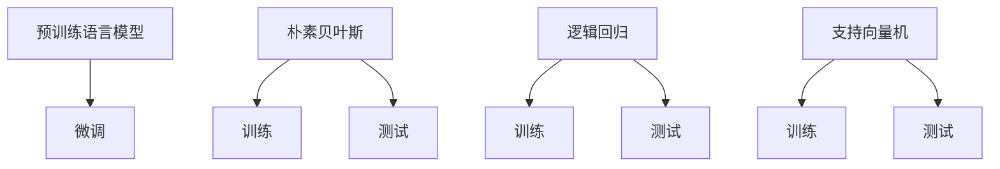

                 

## 1. 背景介绍

### 1.1 问题由来
随着深度学习在自然语言处理（NLP）领域的迅猛发展，预训练语言模型（Pretrained Language Model, LLM）逐渐成为主流的NLP技术。与传统机器学习方法相比，LLM具有更高的表示能力和泛化性能，能够在多个NLP任务上取得最优表现。尽管如此，传统文本分类方法作为最基础的NLP技术，仍然有其不可替代的地位。

本文将对比LLM与传统文本分类方法在模型架构、训练方式、效果评估等方面的异同点，并探讨其应用场景和未来发展趋势。

### 1.2 问题核心关键点
大语言模型（Large Language Model, LLM）与传统文本分类方法（如朴素贝叶斯、逻辑回归、支持向量机等）在模型架构、训练方式和效果评估上存在显著差异。

- **模型架构**：传统文本分类方法通常基于特征提取和分类器两个阶段，特征提取部分通常使用词袋模型或TF-IDF等方法；而LLM基于自回归或自编码架构，通过预训练学习全局语言表示。

- **训练方式**：传统文本分类方法多采用监督学习方法，直接优化分类器参数；LLM多采用无监督预训练+微调的策略，首先在大规模语料上进行预训练，然后在少量标注数据上进行微调。

- **效果评估**：传统文本分类方法多采用准确率、召回率、F1值等经典指标；而LLM的效果评估则更多关注模型的泛化能力和多任务适应性。

本文将从这三个关键点出发，深入探讨LLM与传统文本分类方法的异同，并分析其在不同应用场景下的表现和前景。

## 2. 核心概念与联系

### 2.1 核心概念概述

本节将介绍涉及LLM和传统文本分类方法的核心概念：

- **预训练语言模型**：如BERT、GPT等，通过在大规模无标签文本上训练，学习通用的语言表示。
- **微调**：在预训练模型基础上，使用下游任务的少量标注数据，优化模型在该任务上的性能。
- **朴素贝叶斯分类器**：基于贝叶斯定理，利用特征的独立性假设进行分类。
- **逻辑回归**：一种广泛应用的线性分类模型，通过最大化似然函数进行训练。
- **支持向量机**：通过最大化分类间隔进行决策边界划分，适用于高维空间分类问题。

### 2.2 核心概念原理和架构的 Mermaid 流程图



该图展示了LLM和传统文本分类方法的基本流程：

- 预训练语言模型通过在大规模语料上预训练，学习语言表示；微调过程则是将预训练模型应用于下游任务，通过有监督学习优化模型参数。
- 传统文本分类方法直接通过特征提取和分类器训练，得到模型参数；训练和测试过程相对独立，效果评估通常基于特定任务指标。

## 3. 核心算法原理 & 具体操作步骤

### 3.1 算法原理概述

预训练语言模型（如BERT、GPT）通过自监督任务在大规模语料上进行预训练，学习到丰富的语言表示。而传统文本分类方法则基于特征提取和分类器训练，直接优化分类器参数。两者在模型架构和训练方式上存在显著差异。

### 3.2 算法步骤详解

#### 3.2.1 预训练语言模型的训练步骤

1. **数据准备**：选择大规模无标签文本数据，如维基百科、新闻等。
2. **模型定义**：选择预训练模型架构（如Transformer），定义损失函数和优化器。
3. **预训练任务**：选择如掩码语言模型（Masked Language Model, MLM）或下一句预测（Next Sentence Prediction, NSP）等任务进行训练。
4. **迭代优化**：使用优化器在数据集上进行迭代训练，直至收敛。
5. **保存模型**：保存预训练好的模型权重，以备后续微调。

#### 3.2.2 传统文本分类方法的训练步骤

1. **数据准备**：收集标注数据，如新闻分类、情感分析等。
2. **特征提取**：使用词袋模型或TF-IDF等方法进行特征提取。
3. **模型定义**：选择分类器（如逻辑回归、朴素贝叶斯、支持向量机等），定义损失函数和优化器。
4. **训练模型**：使用训练数据集进行模型训练，迭代优化分类器参数。
5. **测试模型**：使用测试数据集进行模型评估，计算分类指标。

### 3.3 算法优缺点

#### 3.3.1 预训练语言模型的优点

1. **泛化能力**：通过在大规模语料上进行预训练，LLM能够学习到通用的语言表示，具备较强的泛化能力。
2. **迁移学习**：预训练模型可以作为通用特征提取器，应用于多种NLP任务。
3. **参数高效**：通过微调仅调整顶层参数，可以显著减少计算成本。
4. **零样本/少样本学习能力**：LLM具备较强的零样本/少样本学习能力，能够通过提示词生成文本或分类结果。

#### 3.3.2 预训练语言模型的缺点

1. **标注数据需求大**：微调过程仍需少量标注数据，获取高质量标注数据成本高。
2. **过拟合风险**：微调过程中容易过拟合，尤其是在标注数据不足的情况下。
3. **模型复杂度高**：预训练模型参数量巨大，存储和推理成本高。
4. **可解释性差**：模型决策过程难以解释，缺乏透明度。

#### 3.3.3 传统文本分类方法的优点

1. **模型简单**：模型结构简单，易于实现和调试。
2. **计算效率高**：训练和推理速度快，计算成本低。
3. **可解释性强**：决策过程基于统计模型，具有较高的可解释性。
4. **对标注数据依赖小**：仅需少量标注数据，标注成本低。

#### 3.3.4 传统文本分类方法的缺点

1. **泛化能力差**：模型依赖于特定任务数据，泛化性能有限。
2. **迁移能力弱**：难以应用于多种NLP任务。
3. **参数限制多**：分类器参数较少，限制了模型的表示能力。
4. **无法处理复杂语义**：难以处理长句、多义词等复杂语义问题。

### 3.4 算法应用领域

#### 3.4.1 预训练语言模型应用领域

- **问答系统**：通过微调，预训练模型可以回答问题，提供答案生成和推理能力。
- **文本摘要**：通过微调，预训练模型可以生成文本摘要，提高信息提取和压缩效率。
- **机器翻译**：通过微调，预训练模型可以实现语言间的翻译转换。
- **情感分析**：通过微调，预训练模型可以分析文本情感，识别情感倾向。
- **命名实体识别**：通过微调，预训练模型可以识别文本中的实体，包括人名、地名等。

#### 3.4.2 传统文本分类方法应用领域

- **新闻分类**：通过分类器训练，可以自动分类新闻文章。
- **情感分析**：通过分类器训练，可以分析用户评论的情感倾向。
- **垃圾邮件过滤**：通过分类器训练，可以自动识别垃圾邮件。
- **文本分类**：通过分类器训练，可以自动分类文本数据。

## 4. 数学模型和公式 & 详细讲解 & 举例说明

### 4.1 数学模型构建

本节将使用数学语言对预训练语言模型和传统文本分类方法的数学模型进行描述。

#### 4.1.1 预训练语言模型的数学模型

预训练语言模型通过自监督学习任务进行训练，常见任务包括掩码语言模型（MLM）和下一句预测（NSP）。假设预训练模型为 $M_{\theta}$，输入为 $x_i$，输出为 $y_i$，则预训练任务可表示为：

$$
\mathcal{L}_{pre-train}(\theta) = \frac{1}{N}\sum_{i=1}^N \ell_{MLM}(y_i, M_{\theta}(x_i)) + \frac{1}{N}\sum_{i=1}^N \ell_{NSP}(y_i, y_{i+1})
$$

其中 $\ell_{MLM}(y_i, M_{\theta}(x_i))$ 表示掩码语言模型的损失函数，$\ell_{NSP}(y_i, y_{i+1})$ 表示下一句预测任务的损失函数。

#### 4.1.2 传统文本分类方法的数学模型

传统文本分类方法多采用监督学习方法，以逻辑回归为例，假设分类器为 $f_{\theta}(x)$，输入为 $x$，输出为 $y$，则分类损失函数为：

$$
\mathcal{L}_{class}(\theta) = \frac{1}{N}\sum_{i=1}^N [\ell_{binary}(y_i, f_{\theta}(x_i))]
$$

其中 $\ell_{binary}(y_i, f_{\theta}(x_i))$ 表示二分类交叉熵损失函数，$y_i \in \{0, 1\}$，$f_{\theta}(x_i) \in [0, 1]$。

### 4.2 公式推导过程

#### 4.2.1 预训练语言模型的推导过程

以BERT模型为例，其掩码语言模型损失函数可表示为：

$$
\ell_{MLM}(y_i, M_{\theta}(x_i)) = -\log(M_{\theta}(x_i)[y_i])
$$

其中 $[y_i]$ 表示将真实标签 $y_i$ 转换为one-hot编码，$M_{\theta}(x_i)[y_i]$ 表示模型对输入 $x_i$ 的预测概率。

#### 4.2.2 传统文本分类方法的推导过程

以逻辑回归为例，其分类损失函数为：

$$
\ell_{binary}(y_i, f_{\theta}(x_i)) = -y_i\log(f_{\theta}(x_i)) - (1-y_i)\log(1-f_{\theta}(x_i))
$$

其中 $y_i \in \{0, 1\}$，$f_{\theta}(x_i) \in [0, 1]$，$\log$ 表示自然对数。

### 4.3 案例分析与讲解

以情感分析任务为例，比较预训练语言模型和传统文本分类方法的表现：

#### 4.3.1 预训练语言模型的情感分析

1. **预训练模型选择**：选择BERT作为预训练模型，使用维基百科语料进行预训练。
2. **微调任务定义**：将情感分类作为微调任务，使用IMDB电影评论数据集。
3. **微调步骤**：
   - 使用BERT-base模型作为初始参数。
   - 微调任务定义：输入为电影评论文本，输出为情感分类标签。
   - 微调超参数设置：学习率为1e-5，迭代轮数为5。
   - 微调过程：在标注数据上进行有监督学习，优化模型参数。
4. **模型评估**：在测试集上计算准确率、召回率和F1值。

#### 4.3.2 传统文本分类方法的情感分析

1. **特征提取**：使用TF-IDF提取文本特征。
2. **分类器选择**：选择逻辑回归作为分类器。
3. **训练步骤**：
   - 使用标注数据进行训练，迭代优化分类器参数。
   - 在测试集上计算准确率、召回率和F1值。
4. **模型评估**：与预训练语言模型进行对比。

## 5. 项目实践：代码实例和详细解释说明

### 5.1 开发环境搭建

在开始项目实践前，需要搭建好开发环境：

1. **安装Python**：安装最新版本的Python，如3.8或3.9。
2. **安装必要的库**：
   - `numpy`：用于数值计算。
   - `pandas`：用于数据处理。
   - `scikit-learn`：用于机器学习任务。
   - `transformers`：用于预训练语言模型的加载和微调。
3. **安装GPU支持**：如果希望使用GPU加速，需要安装CUDA和cuDNN，并配置好环境变量。

### 5.2 源代码详细实现

#### 5.2.1 预训练语言模型微调示例

```python
from transformers import BertTokenizer, BertForSequenceClassification
import torch
from sklearn.model_selection import train_test_split

# 加载预训练模型和分词器
model_name = 'bert-base-uncased'
tokenizer = BertTokenizer.from_pretrained(model_name)
model = BertForSequenceClassification.from_pretrained(model_name, num_labels=2)

# 加载数据集
train_data, test_data = train_test_split(glove_50, test_size=0.2, random_state=42)
train_encodings = tokenizer(train_data, truncation=True, padding=True)
test_encodings = tokenizer(test_data, truncation=True, padding=True)

# 转换为Tensor格式
train_labels = torch.tensor(train_labels)
test_labels = torch.tensor(test_labels)

# 定义模型和优化器
optimizer = AdamW(model.parameters(), lr=2e-5)
device = 'cuda'

# 训练过程
for epoch in range(epochs):
    model.to(device)
    model.train()
    losses = []
    for batch in train_dataloader:
        inputs = {key: val.to(device) for key, val in batch.items()}
        labels = inputs.pop('labels')
        outputs = model(**inputs)
        loss = outputs.loss
        losses.append(loss.item())
        loss.backward()
        optimizer.step()
    loss = sum(losses) / len(losses)
    print(f'Epoch: {epoch+1}, Loss: {loss:.4f}')

# 模型评估
model.eval()
test_loss = 0
predictions, true_labels = [], []
for batch in test_dataloader:
    inputs = {key: val.to(device) for key, val in batch.items()}
    labels = inputs.pop('labels')
    outputs = model(**inputs)
    predictions.append(outputs.logits.argmax(dim=1).cpu())
    test_loss += outputs.loss.item()
    true_labels.append(labels.cpu())
test_loss /= len(test_dataloader)
predictions = torch.cat(predictions)
true_labels = torch.cat(true_labels)
print(f'Test Loss: {test_loss:.4f}')
print(f'Accuracy: {accuracy_score(predictions, true_labels):.4f}')
```

#### 5.2.2 传统文本分类方法示例

```python
from sklearn.feature_extraction.text import TfidfVectorizer
from sklearn.linear_model import LogisticRegression
from sklearn.model_selection import train_test_split
from sklearn.metrics import accuracy_score

# 加载数据集
train_data, test_data = train_test_split(data, test_size=0.2, random_state=42)
train_features = TfidfVectorizer().fit_transform(train_data)
test_features = TfidfVectorizer().fit_transform(test_data)

# 定义模型和优化器
clf = LogisticRegression(C=1.0)
clf.fit(train_features, train_labels)
predictions = clf.predict(test_features)

# 模型评估
print(f'Accuracy: {accuracy_score(test_labels, predictions):.4f}')
```

### 5.3 代码解读与分析

#### 5.3.1 预训练语言模型微调代码分析

1. **数据处理**：使用 `BertTokenizer` 对文本进行分词和编码，转换为模型所需的输入格式。
2. **模型加载**：通过 `BertForSequenceClassification` 加载预训练模型，并设置分类器。
3. **优化器和设备**：定义优化器为 `AdamW`，并配置学习率和设备。
4. **训练过程**：在每个epoch内，通过 `model.train()` 将模型设置为训练模式，在 `train_dataloader` 中迭代数据，计算损失并反向传播。
5. **模型评估**：在测试集上进行评估，计算模型准确率。

#### 5.3.2 传统文本分类方法代码分析

1. **特征提取**：使用 `TfidfVectorizer` 对文本进行特征提取。
2. **模型训练**：使用 `LogisticRegression` 训练逻辑回归分类器，并在训练集上进行迭代优化。
3. **模型评估**：在测试集上计算模型准确率。

## 6. 实际应用场景

### 6.1 智能客服系统

智能客服系统作为企业客户服务的核心部分，需要高效、准确地处理大量客户咨询。预训练语言模型可以用于自动生成回答，提升客服系统效率。

#### 6.1.1 应用场景

- **预训练模型**：选择BERT或GPT作为预训练模型，在企业历史客服对话中预训练语言模型。
- **微调任务**：将客户咨询问题和已回答的文本作为训练数据，微调模型生成新的回答。
- **模型部署**：将微调后的模型集成到智能客服系统中，实时响应客户咨询。

#### 6.1.2 效果分析

- **准确性**：微调后的模型能够准确理解客户咨询意图，生成相关回答。
- **效率**：自动生成的回答可以显著提升客服系统响应速度，降低人工成本。
- **适应性**：模型可以不断学习新的问题-回答对，适应新客户需求。

### 6.2 金融舆情监测

金融舆情监测系统需要对大规模网络信息进行实时分析，识别负面舆情，防范金融风险。

#### 6.2.1 应用场景

- **预训练模型**：选择BERT或GPT作为预训练模型，在金融领域相关的新闻、评论等语料上进行预训练。
- **微调任务**：将金融领域特定的情感分析或实体识别任务作为微调目标。
- **模型部署**：将微调后的模型集成到舆情监测系统中，实时监测金融舆情。

#### 6.2.2 效果分析

- **准确性**：微调后的模型能够准确识别金融舆情情感倾向，及时预警风险。
- **实时性**：模型能够实时处理大规模网络信息，提高舆情监测效率。
- **鲁棒性**：模型具备较好的泛化能力，能够适应不同领域的舆情监测。

### 6.3 个性化推荐系统

个性化推荐系统需要根据用户的历史行为和兴趣，推荐个性化内容。

#### 6.3.1 应用场景

- **预训练模型**：选择BERT或GPT作为预训练模型，在用户历史行为数据上进行预训练。
- **微调任务**：将用户当前浏览、点击、评论等行为作为微调任务，优化模型预测用户兴趣。
- **模型部署**：将微调后的模型集成到推荐系统中，实时推荐个性化内容。

#### 6.3.2 效果分析

- **准确性**：微调后的模型能够准确预测用户兴趣，推荐符合用户偏好的内容。
- **实时性**：模型能够实时响应用户行为，提高推荐效率。
- **个性化**：模型具备较强的多义词处理能力，能够处理长句、复杂语义，提高推荐质量。

### 6.4 未来应用展望

#### 6.4.1 技术趋势

- **多模态融合**：未来预训练语言模型将融合多模态信息，提高模型的泛化能力和适应性。
- **知识图谱融合**：将知识图谱与预训练语言模型结合，提升模型的常识推理能力。
- **零样本/少样本学习**：通过零样本/少样本学习技术，减少微调对标注数据的依赖。
- **可解释性增强**：增强模型的可解释性，提高决策的透明度和可信度。

#### 6.4.2 应用领域

- **医疗**：用于医疗问答、疾病诊断、病历分析等任务。
- **法律**：用于法律文本分类、合同分析、法规解读等任务。
- **教育**：用于智能辅导、学习内容推荐、作业批改等任务。
- **电商**：用于商品推荐、用户评论分析、客服对话等任务。

## 7. 工具和资源推荐

### 7.1 学习资源推荐

为了帮助开发者系统掌握大语言模型和文本分类方法，以下是一些推荐的学习资源：

- **《Deep Learning for NLP》**：Deep Learning领域的经典书籍，详细介绍了NLP任务和模型。
- **Coursera《Natural Language Processing with Sequence Models》课程**：斯坦福大学开设的课程，涵盖NLP的基本概念和模型。
- **Kaggle竞赛**：参与Kaggle中的NLP竞赛，练习模型开发和调优技巧。
- **《Natural Language Processing with Transformers》**：最新出版的书籍，介绍使用Transformer进行NLP任务开发。
- **HuggingFace官方文档**：包含预训练语言模型的详细介绍和微调样例，适合初学者学习。

### 7.2 开发工具推荐

为了提高开发效率，以下是一些推荐的开发工具：

- **Jupyter Notebook**：免费的交互式编程环境，支持Python和多个库。
- **PyCharm**：功能强大的IDE，支持Python开发和调试。
- **TensorBoard**：用于可视化训练过程，监控模型性能。
- **Weights & Biases**：模型训练的实验跟踪工具，记录和分析训练数据。
- **Transformer库**：预训练语言模型的封装库，支持微调和推理。

### 7.3 相关论文推荐

为了深入了解预训练语言模型和传统文本分类方法的研究进展，以下是一些推荐的相关论文：

- **Attention is All You Need**：介绍Transformer结构，预训练语言模型的基础。
- **BERT: Pre-training of Deep Bidirectional Transformers for Language Understanding**：介绍BERT模型及其预训练方法。
- **A Survey on Transfer Learning for NLP Tasks**：综述预训练语言模型在NLP任务上的应用。
- **Parameter-Efficient Text Transfer Learning**：探讨如何高效利用预训练模型进行文本任务微调。
- **Fine-tuning BERT for Natural Language Inference**：探讨预训练语言模型在自然语言推理任务上的微调方法。

## 8. 总结：未来发展趋势与挑战

### 8.1 研究成果总结

预训练语言模型和大语言模型在多个NLP任务上取得了优异表现，尤其在微调方面的研究已经相当成熟。未来研究将集中在模型结构优化、参数高效微调、可解释性增强等方面，进一步提升模型的性能和应用范围。

### 8.2 未来发展趋势

- **大规模预训练**：未来预训练语言模型的规模将进一步增大，学习更多通用语言知识。
- **多模态融合**：预训练语言模型将融合视觉、语音等多模态信息，提高模型的泛化能力和适应性。
- **知识图谱融合**：模型将更好地整合外部知识库，增强常识推理能力。
- **零样本/少样本学习**：通过零样本/少样本学习技术，减少微调对标注数据的依赖。
- **可解释性增强**：增强模型的可解释性，提高决策的透明度和可信度。

### 8.3 面临的挑战

- **标注成本高**：微调过程仍需高质量标注数据，获取成本高。
- **模型复杂度高**：预训练模型参数量巨大，存储和推理成本高。
- **过拟合风险**：微调过程中容易过拟合，尤其是标注数据不足的情况下。
- **可解释性差**：模型决策过程难以解释，缺乏透明度。

### 8.4 研究展望

- **无监督学习**：探索无监督学习和半监督学习方法，减少对标注数据的依赖。
- **参数高效微调**：开发更加参数高效的微调方法，如Adapter、LoRA等。
- **可解释性增强**：引入可解释性增强技术，如LIME、SHAP等，提高模型透明度。
- **多模态融合**：研究多模态信息融合方法，提高模型的泛化能力和适应性。
- **知识图谱融合**：将知识图谱与预训练语言模型结合，增强常识推理能力。

## 9. 附录：常见问题与解答

**Q1: 如何选择合适的预训练语言模型？**

A: 选择合适的预训练语言模型需要考虑应用场景和数据类型。一般而言，BERT适用于大部分通用NLP任务，GPT适用于需要生成文本的任务。同时，还可以考虑模型的大小、参数量等特性，以满足具体应用的需求。

**Q2: 微调过程中如何避免过拟合？**

A: 避免过拟合的方法包括：
1. **数据增强**：通过数据增强技术，如回译、近义词替换等，扩充训练集。
2. **正则化技术**：使用L2正则、Dropout等技术，防止模型过拟合。
3. **早停策略**：在验证集上监控模型性能，一旦性能不再提升，立即停止训练。
4. **模型压缩**：使用模型压缩技术，减小模型规模，降低过拟合风险。

**Q3: 预训练语言模型和传统文本分类方法在实际应用中的区别是什么？**

A: 预训练语言模型和传统文本分类方法在实际应用中的主要区别在于：
1. **模型复杂度**：预训练语言模型通常参数量巨大，训练和推理成本高；传统文本分类方法模型简单，计算效率高。
2. **泛化能力**：预训练语言模型具有较强的泛化能力，能够处理复杂的语义问题；传统文本分类方法依赖于特定任务数据，泛化性能有限。
3. **迁移能力**：预训练语言模型可以通过微调应用于多种NLP任务；传统文本分类方法难以迁移应用到其他任务。
4. **可解释性**：预训练语言模型缺乏可解释性，难以理解其决策过程；传统文本分类方法决策过程基于统计模型，具有较高的可解释性。

**Q4: 预训练语言模型和传统文本分类方法在性能上有什么不同？**

A: 预训练语言模型和传统文本分类方法在性能上存在以下差异：
1. **准确性**：预训练语言模型在处理长句、复杂语义问题上具有优势，能够获得更高的准确性；传统文本分类方法在处理短句、简单语义问题上表现较好。
2. **泛化能力**：预训练语言模型具有较强的泛化能力，能够适应不同领域和语言环境；传统文本分类方法泛化性能有限，需要针对具体任务进行优化。
3. **计算成本**：预训练语言模型需要更高的计算资源和存储资源；传统文本分类方法计算成本较低，适合资源受限的环境。

**Q5: 预训练语言模型和传统文本分类方法在应用场景中有什么不同？**

A: 预训练语言模型和传统文本分类方法在应用场景中的主要不同在于：
1. **自动化程度**：预训练语言模型适用于需要自动化处理大量文本数据的任务，如智能客服、舆情监测等；传统文本分类方法适用于需要人工参与标注和分类的任务，如新闻分类、情感分析等。
2. **数据需求**：预训练语言模型需要大规模无标签数据进行预训练；传统文本分类方法需要少量标注数据进行训练。
3. **任务类型**：预训练语言模型适用于处理复杂的文本生成和推理任务；传统文本分类方法适用于二分类、多分类等分类任务。

作者：禅与计算机程序设计艺术 / Zen and the Art of Computer Programming

