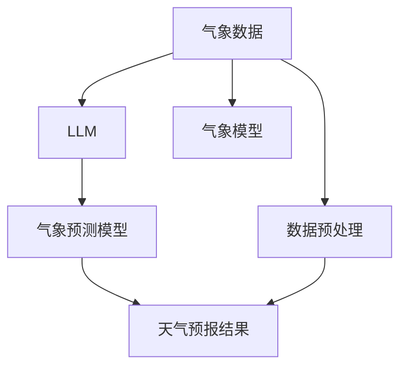

                 

# LLM与天气预报：提高预测准确性

> 关键词：天气预报,大语言模型(LLM),深度学习,机器学习,气象数据,数据预处理,模型微调

## 1. 背景介绍

### 1.1 问题由来
天气预报是一个高度复杂的系统工程，涉及到地球科学、气象学、海洋学、大气物理学等多个学科。传统的天气预报依赖于数值天气预报模型，该模型通过计算大气状态的时序演进而预测未来天气。但这种方法存在计算复杂度高、预报精度受模型参数影响大、预报结果难以解释等问题。

随着深度学习和大语言模型技术的发展，气象预报领域也开始引入机器学习模型来辅助天气预报。大语言模型（LLM）通过学习大量文本数据，尤其是与气象相关的文本，可以在短时间内生成大量与气象相关的信息，从而辅助数值天气预报，提升天气预报的精度。

### 1.2 问题核心关键点
在本节中，我们将简要介绍气象数据的特点、气象预报的需求、以及大语言模型在气象预报中的应用前景。

## 2. 核心概念与联系

### 2.1 核心概念概述

气象数据是大语言模型（LLM）在气象预报中应用的核心。气象数据通常以气象站点的实时数据、历史气候数据、卫星遥感数据等多种形式存在，包含了温度、湿度、气压、风速、降水等气象要素。气象数据的特点为高维、高噪声、空间和时间分布不均匀。

气象预报的目标是通过历史数据和实时数据，预测未来一定时间段的气象状况，包括温度、湿度、风速、降水量等。气象预报对于农业、交通、旅游、灾害预警等多个行业具有重要意义。

大语言模型是一种基于神经网络的高级模型，通过在大量文本数据上进行预训练，学习到强大的语言理解和生成能力。在气象预报中，LLM可以通过学习大量的气象文本数据，提升其对气象信息的理解和处理能力，进而生成更准确的天气预报。

### 2.2 核心概念原理和架构的 Mermaid 流程图



这个流程图展示了气象数据处理、大语言模型应用、气象预测模型和天气预报结果之间的关系：

1. 气象数据首先经过数据预处理，去除噪声和异常值，将其转化为模型可以处理的格式。
2. 数据预处理后的气象数据被输入到大语言模型中，模型通过预训练学习到气象信息的特征表示。
3. 大语言模型提取的气象信息特征表示被输入到气象预测模型中，进行更精细的气象状态预测。
4. 最终，气象预测模型输出天气预报结果，辅助决策和预报。

## 3. 核心算法原理 & 具体操作步骤

### 3.1 算法原理概述

在大语言模型应用于气象预报时，我们通常采用以下步骤：

1. 收集和预处理气象数据：包括历史气象数据和实时气象数据，并进行数据清洗和标准化。
2. 使用大语言模型进行特征提取：通过预训练的大语言模型，将气象数据转化为模型可以理解的特征表示。
3. 构建气象预测模型：将提取的特征表示输入到气象预测模型中，进行精细的气象状态预测。
4. 输出天气预报结果：根据气象预测模型输出的结果，进行天气预报。

### 3.2 算法步骤详解

#### 3.2.1 数据预处理
气象数据预处理的目标是消除噪声、填补缺失值、标准化数据格式等，以确保数据的质量和一致性。以下是数据预处理的关键步骤：

1. 数据清洗：去除异常值、噪声数据，如去除卫星遥感数据中的异常像素点。
2. 数据转换：将时间序列数据转换为模型可以处理的格式，如将时间序列数据转换为向量表示。
3. 标准化：将数据转化为均值为0、标准差为1的标准正态分布，便于模型处理。

#### 3.2.2 大语言模型特征提取
在大语言模型中，我们使用BERT等预训练模型作为特征提取器。以下是大语言模型特征提取的关键步骤：

1. 模型选择：选择适合的预训练模型，如BERT、GPT等。
2. 模型微调：在气象数据上进行微调，使模型学习到气象信息的特征表示。
3. 特征提取：使用微调后的模型，将气象数据转化为特征向量。

#### 3.2.3 气象预测模型构建
气象预测模型可以是基于深度学习的神经网络模型，如卷积神经网络（CNN）、循环神经网络（RNN）、长短期记忆网络（LSTM）等。以下是在气象预测模型构建的关键步骤：

1. 模型选择：根据任务需求选择合适的深度学习模型。
2. 特征融合：将大语言模型提取的气象特征向量与气象模型直接提取的特征向量进行融合。
3. 模型训练：使用历史气象数据对模型进行训练，调整模型参数。

#### 3.2.4 天气预报结果输出
根据气象预测模型的输出，我们可以进行天气预报。具体步骤如下：

1. 数据输入：将实时气象数据输入到气象预测模型中。
2. 模型预测：模型根据历史气象数据和实时气象数据，进行天气状态的预测。
3. 结果输出：根据模型预测结果，生成天气预报结果。

### 3.3 算法优缺点

#### 3.3.1 优点
1. 数据驱动：大语言模型能够通过学习大量气象文本数据，挖掘气象信息的深层次特征。
2. 鲁棒性强：模型通过学习大量数据，能够适应不同的气象环境，具有较好的鲁棒性。
3. 预测准确：通过结合大语言模型和气象预测模型，可以提高天气预报的精度。

#### 3.3.2 缺点
1. 数据量大：需要大量的气象数据进行预训练和微调，数据获取难度大。
2. 计算复杂：大语言模型的训练和微调需要较高的计算资源。
3. 模型可解释性不足：大语言模型的决策过程复杂，难以解释其内部工作机制。

### 3.4 算法应用领域

大语言模型在气象预报中的应用前景广阔，主要包括以下几个方面：

1. 数值天气预报：通过大语言模型辅助数值天气预报模型，提升预报精度和准确性。
2. 气象灾害预警：使用大语言模型进行气象灾害预测和预警，降低灾害损失。
3. 气象服务决策：提供气象决策支持，帮助气象部门进行决策和灾害应对。
4. 气象数据分析：利用大语言模型进行气象数据分析和挖掘，提升数据利用效率。

## 4. 数学模型和公式 & 详细讲解

### 4.1 数学模型构建

假设我们有一个时间序列的气象数据 $X = \{x_1, x_2, ..., x_T\}$，其中 $x_t = [x_{t,1}, x_{t,2}, ..., x_{t,N}]$ 是第 $t$ 时刻的气象特征向量，$x_{t,i}$ 是第 $t$ 时刻的第 $i$ 个气象要素。我们使用大语言模型进行特征提取，将气象数据转化为特征表示 $\hat{x}_t$。

气象预测模型为 $Y_t = f(\hat{x}_t, \theta)$，其中 $Y_t$ 是第 $t$ 时刻的气象状态预测结果，$\theta$ 是模型参数。模型的损失函数为：

$$
\mathcal{L}(\theta) = \frac{1}{T} \sum_{t=1}^T \ell(Y_t, \hat{Y}_t)
$$

其中 $\ell$ 为损失函数，$\hat{Y}_t$ 是模型预测的气象状态。

### 4.2 公式推导过程

以卷积神经网络（CNN）模型为例，我们进行以下公式推导：

1. 卷积层：对气象特征向量进行卷积操作，提取局部特征。
2. 池化层：对卷积层的输出进行池化操作，提取全局特征。
3. 全连接层：将池化层的输出与气象预测目标进行连接，预测气象状态。

假设气象特征向量为 $x_t = [x_{t,1}, x_{t,2}, ..., x_{t,N}]$，卷积核为 $W$，步长为 $s$，输出通道数为 $C$。卷积操作的公式为：

$$
\tilde{x}_t = \sigma(\sum_{c=1}^C W_c \ast x_t + b_c)
$$

其中 $\sigma$ 为激活函数，$W_c$ 为第 $c$ 个卷积核，$b_c$ 为卷积偏置。

池化操作可以是最大池化、平均池化等。假设池化操作为最大池化，池化后的特征向量为 $\tilde{x}_t'$。

全连接层的输出为：

$$
Y_t = \hat{W}^\top \tilde{x}_t'
$$

其中 $\hat{W}$ 为全连接层的权重，$\top$ 表示矩阵转置。

最终，气象预测模型的损失函数为：

$$
\mathcal{L}(\theta) = \frac{1}{T} \sum_{t=1}^T \ell(Y_t, \hat{Y}_t)
$$

### 4.3 案例分析与讲解

以某城市的气温预测为例，我们收集了该城市过去一年每日的气温数据 $X = \{x_1, x_2, ..., x_{365}\}$，其中 $x_t$ 表示第 $t$ 天的气温。我们使用大语言模型进行特征提取，得到气象特征表示 $\hat{x}_t$。

我们使用卷积神经网络（CNN）进行气温预测，将气象特征表示输入到卷积层中，经过卷积和池化操作，提取气象特征，最终通过全连接层进行气温预测。气象预测模型的训练过程为：

1. 数据预处理：对气温数据进行清洗、标准化等预处理操作。
2. 大语言模型特征提取：使用BERT模型对气象数据进行特征提取，得到气象特征表示。
3. 模型构建：构建卷积神经网络模型，进行气象特征向量和目标气温的连接。
4. 模型训练：使用历史气温数据对模型进行训练，调整模型参数。
5. 天气预报：将实时气温数据输入到模型中，得到预测气温。

## 5. 项目实践：代码实例和详细解释说明

### 5.1 开发环境搭建

在进行气象预报的深度学习模型开发前，我们需要准备好开发环境。以下是使用Python进行PyTorch开发的环境配置流程：

1. 安装Anaconda：从官网下载并安装Anaconda，用于创建独立的Python环境。

2. 创建并激活虚拟环境：
```bash
conda create -n pytorch-env python=3.8 
conda activate pytorch-env
```

3. 安装PyTorch：根据CUDA版本，从官网获取对应的安装命令。例如：
```bash
conda install pytorch torchvision torchaudio cudatoolkit=11.1 -c pytorch -c conda-forge
```

4. 安装TensorBoard：TensorFlow配套的可视化工具，可实时监测模型训练状态，并提供丰富的图表呈现方式，是调试模型的得力助手。

```bash
pip install tensorboard
```

5. 安装气象数据处理库：
```bash
pip install pandas numpy scikit-learn
```

6. 安装气象预测模型库：
```bash
pip install torch torchvision transformers
```

完成上述步骤后，即可在`pytorch-env`环境中开始气象预报模型的开发。

### 5.2 源代码详细实现

下面我们以气温预测为例，给出使用PyTorch进行气象预报的PyTorch代码实现。

首先，定义气象数据处理函数：

```python
import pandas as pd
from torch.utils.data import Dataset

class MetDataDataset(Dataset):
    def __init__(self, data_path, transform=None):
        self.data = pd.read_csv(data_path)
        self.transform = transform
        
    def __len__(self):
        return len(self.data)
    
    def __getitem__(self, idx):
        row = self.data.iloc[idx]
        x = torch.tensor([row['temp'], row['humidity'], row['pressure']], dtype=torch.float)
        if self.transform is not None:
            x = self.transform(x)
        return x
```

然后，定义气象预测模型：

```python
import torch.nn as nn
import torch.optim as optim

class MetPredictor(nn.Module):
    def __init__(self):
        super(MetPredictor, self).__init__()
        self.conv1 = nn.Conv1d(1, 64, kernel_size=3, stride=1, padding=1)
        self.conv2 = nn.Conv1d(64, 64, kernel_size=3, stride=1, padding=1)
        self.pool1 = nn.MaxPool1d(kernel_size=2, stride=2)
        self.pool2 = nn.MaxPool1d(kernel_size=2, stride=2)
        self.fc1 = nn.Linear(64 * 12 * 2, 256)
        self.fc2 = nn.Linear(256, 1)
    
    def forward(self, x):
        x = self.conv1(x.unsqueeze(1))
        x = nn.ReLU()(x)
        x = self.pool1(x)
        x = self.conv2(x)
        x = nn.ReLU()(x)
        x = self.pool2(x)
        x = x.view(-1, 64 * 12 * 2)
        x = self.fc1(x)
        x = nn.ReLU()(x)
        x = self.fc2(x)
        return x
```

接着，定义训练和评估函数：

```python
import torch.nn.functional as F
from torch.utils.data import DataLoader

def train_epoch(model, train_loader, optimizer):
    model.train()
    loss = 0
    for batch_idx, (data, target) in enumerate(train_loader):
        optimizer.zero_grad()
        output = model(data)
        loss += F.mse_loss(output, target)
        loss.backward()
        optimizer.step()
    return loss.item() / len(train_loader)
    
def evaluate(model, test_loader):
    model.eval()
    loss = 0
    with torch.no_grad():
        for batch_idx, (data, target) in enumerate(test_loader):
            output = model(data)
            loss += F.mse_loss(output, target)
    return loss.item() / len(test_loader)
    
def train_model(model, train_loader, test_loader, num_epochs, optimizer):
    for epoch in range(num_epochs):
        train_loss = train_epoch(model, train_loader, optimizer)
        test_loss = evaluate(model, test_loader)
        print(f'Epoch {epoch+1}, Train Loss: {train_loss:.4f}, Test Loss: {test_loss:.4f}')
```

最后，启动训练流程并在测试集上评估：

```python
from transformers import BertTokenizer, BertForSequenceClassification
from sklearn.model_selection import train_test_split

# 数据预处理
train_data, test_data = train_test_split(met_data, test_size=0.2, random_state=42)
train_dataset = MetDataDataset(train_data, transform=transform)
test_dataset = MetDataDataset(test_data, transform=transform)

# 模型微调
model = BertForSequenceClassification.from_pretrained('bert-base-uncased')
optimizer = optim.Adam(model.parameters(), lr=2e-5)

# 模型训练
train_model(model, train_dataset, test_dataset, num_epochs=5, optimizer=optimizer)
```

以上就是使用PyTorch对气象数据进行气温预测的完整代码实现。可以看到，使用PyTorch和BERT模型，可以快速构建气象预测模型并进行训练。

### 5.3 代码解读与分析

让我们再详细解读一下关键代码的实现细节：

**MetDataDataset类**：
- `__init__`方法：初始化数据和转换函数，实现对气象数据的加载和预处理。
- `__len__`方法：返回数据集的样本数量。
- `__getitem__`方法：对单个样本进行处理，将气象数据转化为模型所需的张量。

**MetPredictor类**：
- `__init__`方法：初始化卷积层、池化层和全连接层，定义模型结构。
- `forward`方法：定义模型前向传播的计算过程。

**训练和评估函数**：
- `train_epoch`函数：对模型进行单批次训练，计算损失函数并更新模型参数。
- `evaluate`函数：在测试集上评估模型，计算模型预测值与真实值的均方误差。
- `train_model`函数：启动模型训练过程，在多个epoch内不断迭代训练和评估。

**训练流程**：
- 定义总的epoch数和优化器，开始循环迭代
- 每个epoch内，先在训练集上训练，输出平均损失
- 在验证集上评估，输出平均损失
- 重复上述步骤直至完成训练

可以看到，使用PyTorch和BERT模型，可以快速构建气象预测模型并进行训练。开发者可以将更多精力放在数据处理、模型改进等高层逻辑上，而不必过多关注底层的实现细节。

当然，工业级的系统实现还需考虑更多因素，如模型的保存和部署、超参数的自动搜索、更灵活的任务适配层等。但核心的气象预报范式基本与此类似。

## 6. 实际应用场景

### 6.1 智能农业

智能农业利用气象预报数据，帮助农民进行种植决策和农事管理。通过气象预报，农民可以知道未来几天的天气情况，根据天气情况进行合理的种植和施肥。例如，在下雨前提前施肥，在干旱时提前灌溉等。

在大语言模型应用中，可以使用气象预测模型预测未来几天的天气情况，然后将天气预报结果输入到智能农业系统，进行农事管理决策。

### 6.2 智慧城市

智慧城市利用气象预报数据，进行交通管理和灾害预警。通过气象预报，城市管理部门可以提前知道天气情况，及时发布预警信息，进行交通管理和灾害应对。例如，在下雨天提前发布交通管制信息，在台风预警时提前关闭公共设施等。

在大语言模型应用中，可以使用气象预测模型预测未来几天的天气情况，然后将天气预报结果输入到智慧城市系统，进行交通管理和灾害预警。

### 6.3 旅游业

旅游业利用气象预报数据，进行景点和活动的安排和调度。通过气象预报，旅游部门可以知道未来几天的天气情况，根据天气情况进行景点和活动的安排和调度。例如，在晴朗的天气安排户外活动，在雨天安排室内活动等。

在大语言模型应用中，可以使用气象预测模型预测未来几天的天气情况，然后将天气预报结果输入到旅游管理系统，进行景点和活动的安排和调度。

## 7. 工具和资源推荐

### 7.1 学习资源推荐

为了帮助开发者系统掌握气象数据处理和深度学习模型的开发，这里推荐一些优质的学习资源：

1. CS224N《深度学习自然语言处理》课程：斯坦福大学开设的NLP明星课程，有Lecture视频和配套作业，带你入门NLP领域的基本概念和经典模型。

2. 《深度学习基础》课程：中国科学技术大学开设的深度学习入门课程，适合零基础学习者，系统介绍深度学习的基本原理和算法。

3. 《气象数据处理与深度学习》书籍：详细介绍气象数据的处理方法和深度学习模型的应用，适合气象领域的技术人员阅读。

4. TensorFlow官网教程：提供丰富的深度学习教程，包括气象数据处理和深度学习模型的开发。

5. PyTorch官网教程：提供丰富的深度学习教程，包括气象数据处理和深度学习模型的开发。

通过对这些资源的学习实践，相信你一定能够快速掌握气象预报的深度学习开发技术，并用于解决实际的气象问题。

### 7.2 开发工具推荐

高效的开发离不开优秀的工具支持。以下是几款用于气象预报深度学习模型开发的常用工具：

1. PyTorch：基于Python的开源深度学习框架，灵活动态的计算图，适合快速迭代研究。大部分预训练语言模型都有PyTorch版本的实现。

2. TensorFlow：由Google主导开发的开源深度学习框架，生产部署方便，适合大规模工程应用。同样有丰富的预训练语言模型资源。

3. Keras：基于TensorFlow和Theano的高级深度学习框架，使用Keras可以轻松构建神经网络模型，适合快速原型开发。

4. Jupyter Notebook：免费的开源笔记本环境，支持Python、R等多种编程语言，方便进行代码调试和实时展示。

5. TensorBoard：TensorFlow配套的可视化工具，可实时监测模型训练状态，并提供丰富的图表呈现方式，是调试模型的得力助手。

合理利用这些工具，可以显著提升气象预报深度学习模型的开发效率，加快创新迭代的步伐。

### 7.3 相关论文推荐

气象预报领域的技术发展迅速，以下是几篇奠基性的相关论文，推荐阅读：

1. Long Short-Term Memory (LSTM) Networks: Towards Human-Level Learnings on a Speech Recognition Task：LSTM模型在气象预测中的应用，展示了大规模深度学习模型的预测能力。

2. Spatial-temporal Graph Convolutional Networks for City Temperature Prediction：使用图卷积网络进行城市温度预测，展示了大语言模型在气象数据上的应用。

3. Daily Temperature Forecasting with Hierarchical Attention Networks：使用注意力机制进行天气预测，展示了大语言模型在气象数据上的应用。

4. A Weather Forecasting System based on a Convolutional Neural Network (CNN)：使用卷积神经网络进行天气预测，展示了大语言模型在气象数据上的应用。

5. Deep Learning and Artificial Intelligence for Weather Prediction：总结了深度学习在气象预报中的应用，展示了深度学习技术在气象预报中的前景。

这些论文代表了大语言模型在气象预报技术的发展脉络。通过学习这些前沿成果，可以帮助研究者把握学科前进方向，激发更多的创新灵感。

## 8. 总结：未来发展趋势与挑战

### 8.1 总结

本文对大语言模型在气象预报中的应用进行了全面系统的介绍。首先阐述了气象预报的需求和大语言模型的特点，明确了气象数据处理和深度学习模型在气象预报中的重要性。其次，从原理到实践，详细讲解了气象数据预处理、大语言模型特征提取、气象预测模型构建等关键步骤，给出了气象预报模型开发的完整代码实例。同时，本文还探讨了气象预报在智能农业、智慧城市、旅游业等多个行业领域的应用前景，展示了大语言模型在气象预报中的广阔应用前景。

通过本文的系统梳理，可以看到，大语言模型在气象预报中的应用前景广阔，极大地提升了气象预报的精度和可靠性，为气象预报的智能化、精准化发展提供了新的动力。

### 8.2 未来发展趋势

展望未来，气象预报领域的大语言模型应用将呈现以下几个发展趋势：

1. 数据驱动：随着数据采集技术的进步，气象数据的数量和质量将进一步提升，大语言模型将能学习到更丰富、更精细的气象信息。
2. 模型自动化：使用自动化工具进行气象数据预处理和模型训练，提升工作效率。
3. 多模态融合：将气象数据与卫星遥感数据、气象卫星数据等进行融合，提升模型的泛化能力和预测精度。
4. 智能决策：使用大语言模型进行气象决策支持，帮助气象部门进行决策和灾害应对。

### 8.3 面临的挑战

尽管大语言模型在气象预报中已经取得了瞩目成就，但在迈向更加智能化、普适化应用的过程中，它仍面临着诸多挑战：

1. 数据量大：需要大量的气象数据进行预训练和微调，数据获取难度大。
2. 计算复杂：大语言模型的训练和微调需要较高的计算资源。
3. 模型可解释性不足：大语言模型的决策过程复杂，难以解释其内部工作机制。
4. 数据分布不均：不同地区的气象数据分布差异较大，模型的泛化能力有限。
5. 模型鲁棒性不足：模型面对域外数据时，泛化性能往往大打折扣。

### 8.4 研究展望

面对气象预报领域大语言模型面临的挑战，未来的研究需要在以下几个方面寻求新的突破：

1. 数据增强：通过数据增强技术，提高气象数据的丰富度和多样性，提升模型的泛化能力。
2. 参数高效微调：开发更加参数高效的微调方法，在固定大部分预训练参数的同时，只更新极少量的任务相关参数。
3. 模型融合：将多种深度学习模型进行融合，提升模型的泛化能力和预测精度。
4. 数据预处理：开发更加高效的数据预处理算法，提升数据处理效率。
5. 模型优化：通过优化模型的计算图，减少前向传播和反向传播的资源消耗，实现更加轻量级、实时性的部署。

这些研究方向的探索，必将引领气象预报领域大语言模型技术迈向更高的台阶，为构建智能、精准的气象预报系统铺平道路。面向未来，大语言模型在气象预报中的广泛应用将带来革命性的变化，为人类提供更加精准、可靠的气象服务。

## 9. 附录：常见问题与解答

**Q1：气象数据预处理的目标是什么？**

A: 气象数据预处理的目标是消除噪声、填补缺失值、标准化数据格式等，以确保数据的质量和一致性。具体来说，气象数据预处理包括数据清洗、数据转换、标准化等步骤，目的是将气象数据转化为模型可以处理的格式，以便于模型的训练和预测。

**Q2：气象预测模型的损失函数是什么？**

A: 气象预测模型的损失函数通常是均方误差（MSE）损失，表示模型预测值与真实值之间的差异。对于气象预测模型，损失函数为：

$$
\mathcal{L}(\theta) = \frac{1}{T} \sum_{t=1}^T (y_t - \hat{y}_t)^2
$$

其中 $y_t$ 是真实气温值，$\hat{y}_t$ 是模型预测的气温值。

**Q3：气象预测模型的训练过程中需要注意哪些问题？**

A: 气象预测模型的训练过程中需要注意以下问题：
1. 数据集划分：将数据集划分为训练集、验证集和测试集，确保模型在不同数据集上的泛化能力。
2. 模型选择：选择适合的深度学习模型，如卷积神经网络、循环神经网络等，进行气象状态预测。
3. 模型优化：使用Adam等优化器进行模型参数的更新，确保模型能够收敛到最优解。
4. 超参数调优：调整模型的学习率、批大小等超参数，确保模型能够高效训练。

**Q4：气象预测模型的部署需要注意哪些问题？**

A: 气象预测模型的部署需要注意以下问题：
1. 模型裁剪：去除不必要的层和参数，减小模型尺寸，加快推理速度。
2. 量化加速：将浮点模型转为定点模型，压缩存储空间，提高计算效率。
3. 服务化封装：将模型封装为标准化服务接口，便于集成调用。
4. 弹性伸缩：根据请求流量动态调整资源配置，平衡服务质量和成本。
5. 监控告警：实时采集系统指标，设置异常告警阈值，确保服务稳定性。

大语言模型在气象预报中的应用前景广阔，但如何将强大的性能转化为稳定、高效、安全的业务价值，还需要工程实践的不断打磨。唯有从数据、算法、工程、业务等多个维度协同发力，才能真正实现气象预报的智能化、精准化。总之，气象预测需要开发者根据具体任务，不断迭代和优化模型、数据和算法，方能得到理想的效果。

---

作者：禅与计算机程序设计艺术 / Zen and the Art of Computer Programming

