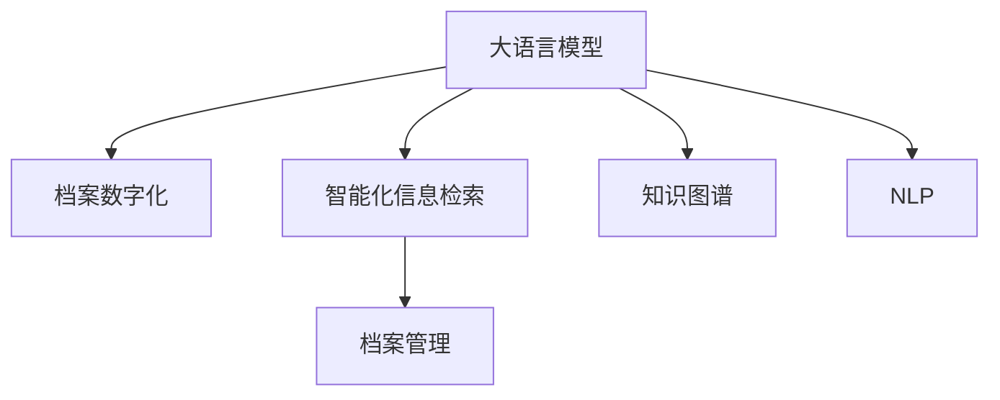

                 

# LLM与档案管理：智能化信息检索

> 关键词：大语言模型, 档案管理, 智能检索, 自然语言处理, 信息检索, 档案数字化

## 1. 背景介绍

### 1.1 问题由来
随着数字化进程的推进，全球范围内逐步进入了一个“信息过载”的时代。各个行业的档案管理数据量呈现指数级增长，传统的档案管理方式难以满足快速响应和高效检索的需求。档案中包含海量的信息，如何高效、准确地检索信息，成为了一项巨大的挑战。

### 1.2 问题核心关键点
档案管理中存在的检索问题主要集中在以下几个方面：
- **数据量大**：现有档案数据量庞大，传统索引和检索方法无法有效处理。
- **语义理解不足**：档案内容涉及多领域知识，难以通过简单的关键字检索实现精准匹配。
- **检索效率低**：现有系统往往依赖于线性搜索，效率低下，难以应对大规模检索需求。
- **检索结果不精准**：传统的布尔检索方式无法有效处理语义模糊和歧义问题。

### 1.3 问题研究意义
智能化信息检索技术通过利用大语言模型的优势，对档案内容进行深度语义理解和知识提取，可以显著提升检索的准确性和效率，减轻档案管理人员的工作负担。通过对档案内容进行智能分析和检索，不仅能够提升信息检索的精度和速度，还能够发现数据间的关系，进行知识图谱的构建，进一步拓展档案管理的深度和广度。

## 2. 核心概念与联系

### 2.1 核心概念概述

为更好地理解基于大语言模型的智能化信息检索方法，本节将介绍几个密切相关的核心概念：

- **大语言模型(Large Language Model, LLM)**：以自回归(如GPT)或自编码(如BERT)模型为代表的大规模预训练语言模型。通过在大规模无标签文本语料上进行预训练，学习通用的语言表示，具备强大的语言理解和生成能力。

- **档案管理(Archive Management)**：涉及文档、影像、音频、视频等多种介质档案的收集、整理、存储、检索、利用、保护和管理等活动。

- **智能化信息检索(Intelligent Information Retrieval)**：利用先进的技术手段，如自然语言处理、机器学习等，实现档案信息的快速、准确检索。

- **自然语言处理(Natural Language Processing, NLP)**：研究如何使计算机能够理解、处理和生成自然语言的技术，包括语言模型、词向量、语言理解等。

- **知识图谱(Knowledge Graph)**：通过实体识别和关系抽取，将知识进行结构化存储，形成实体和关系的知识图谱，便于知识查询和推理。

- **档案数字化(Archive Digitization)**：将纸质档案、音视频档案等转化为可检索的数字格式，方便数字化档案的管理和利用。

这些核心概念之间的逻辑关系可以通过以下Mermaid流程图来展示：

这个流程图展示了大语言模型在档案数字化和智能化信息检索中的关键作用：

1. 大语言模型通过预训练获得基础能力。
2. 通过知识图谱构建，提取档案中的知识结构。
3. 应用自然语言处理技术，提升检索的精准度。
4. 档案数字化和智能化信息检索，实现档案的智能管理和检索。

## 3. 核心算法原理 & 具体操作步骤
### 3.1 算法原理概述

基于大语言模型的档案管理智能化信息检索，其核心思想是：将大语言模型作为强大的检索工具，通过在档案语料上进行预训练，获得档案内容中的通用语言知识，再通过微调或提示学习等方法，将预训练模型适配到具体的检索任务中，从而实现档案信息的精准检索和知识提取。

形式化地，假设大语言模型为 $M_{\theta}$，其中 $\theta$ 为预训练得到的模型参数。假设档案数字化后的语料库为 $D=\{(x_i, y_i)\}_{i=1}^N$，其中 $x_i$ 为档案内容，$y_i$ 为目标信息。检索任务的目标是找到新的模型参数 $\hat{\theta}$，使得：

$$
\hat{\theta}=\mathop{\arg\min}_{\theta} \mathcal{L}(M_{\theta},D)
$$

其中 $\mathcal{L}$ 为针对信息检索任务设计的损失函数，用于衡量模型输出与真实标签之间的差异。常见的损失函数包括交叉熵损失、均方误差损失等。

### 3.2 算法步骤详解

基于大语言模型的智能化信息检索一般包括以下几个关键步骤：

**Step 1: 准备档案语料和数据集**
- 收集档案数字化后的语料，划分为训练集、验证集和测试集。
- 确定检索任务，如文档检索、图片检索、视频检索等，设计对应的输出格式。

**Step 2: 构建档案索引**
- 使用大语言模型对档案内容进行分词、词向量编码，构建档案索引。
- 对索引进行编码，生成档案编码序列。
- 构建档案索引的数据集，包括档案编码序列和对应的检索目标信息。

**Step 3: 微调或提示学习**
- 选择合适的微调方法，如监督微调、半监督微调、迁移学习等。
- 设计或选择适当的提示模板，引导模型执行检索任务。
- 使用微调或提示学习的技术，优化模型在档案检索任务上的性能。

**Step 4: 检索结果评估与优化**
- 在测试集上评估检索模型的性能，如精度、召回率、F1-score等指标。
- 根据评估结果，调整检索模型参数或提示模板，优化检索性能。
- 集成检索模型到档案管理系统中，实现档案信息的智能化检索。

### 3.3 算法优缺点

基于大语言模型的智能化信息检索方法具有以下优点：
1. 简单高效。只需要对大语言模型进行微调或提示学习，即可实现档案信息的智能检索。
2. 适应性强。适用于多种类型的档案检索任务，包括文档、图片、视频等。
3. 检索准确度高。利用大语言模型的语言理解能力，可以更准确地匹配检索查询和档案内容。
4. 知识图谱构建。在大语言模型的基础上，可以构建更全面的知识图谱，辅助档案内容的深入理解。

同时，该方法也存在一定的局限性：
1. 依赖高质量档案语料。检索效果很大程度上取决于档案语料的质量和结构，高质量语料获取成本较高。
2. 检索速度受模型规模限制。超大模型的前向推理速度较慢，可能影响检索效率。
3. 检索模型鲁棒性不足。模型面对不同领域的档案内容时，泛化性能可能降低。
4. 检索结果可解释性差。检索模型的决策过程缺乏可解释性，难以调试和优化。

尽管存在这些局限性，但就目前而言，基于大语言模型的信息检索方法仍是大规模档案管理智能化检索的重要手段。未来相关研究的重点在于如何进一步降低对高质量语料的依赖，提高检索模型的速度和鲁棒性，同时兼顾可解释性和泛化能力。

### 3.4 算法应用领域

基于大语言模型的档案管理智能化信息检索技术，已经在多个领域得到了广泛应用，例如：

- 图书馆档案管理：通过对图书和文献的智能化检索，快速定位所需文献。
- 政府档案管理：对大量行政文件、报告等进行智能分类和检索。
- 企业档案管理：对合同、报告、客户档案等进行智能查询和分析。
- 医疗档案管理：对患者电子病历、医学文献等进行智能化检索和知识提取。
- 新闻档案管理：对新闻报道、事件记录等进行智能分类和检索。

除了上述这些经典应用外，档案管理智能化检索技术还在多媒体档案管理、网络档案管理等领域得到了创新性应用，为档案管理的智能化和自动化带来了新的突破。

## 4. 数学模型和公式 & 详细讲解 & 举例说明
### 4.1 数学模型构建

本节将使用数学语言对基于大语言模型的档案管理智能化信息检索过程进行更加严格的刻画。

假设档案数字化后的语料为 $D=\{(x_i, y_i)\}_{i=1}^N$，其中 $x_i$ 为档案内容，$y_i$ 为目标信息。检索任务的目标是找到新的模型参数 $\theta^*$，使得模型 $M_{\theta^*}$ 在给定的检索查询 $q$ 下，能够输出档案内容 $x$ 的相关性评分 $s(x,q)$，即：

$$
s(x,q)=M_{\theta^*}(x) \cdot q
$$

其中 $q$ 表示检索查询，$s(x,q)$ 表示 $x$ 对 $q$ 的相关性评分，$M_{\theta^*}$ 表示经过微调或提示学习后的检索模型。

检索模型的损失函数可以定义为：

$$
\mathcal{L}(\theta^*)=\frac{1}{N}\sum_{i=1}^N \mathcal{L}(s(x_i,q_i),y_i)
$$

其中 $\mathcal{L}$ 为损失函数，通常选择交叉熵损失。

### 4.2 公式推导过程

以文档检索为例，假设检索查询为 $q$，档案内容为 $x_i$，相关性评分为 $s(x_i,q)$。检索模型的损失函数可以表示为：

$$
\mathcal{L}(\theta^*)=\frac{1}{N}\sum_{i=1}^N \mathcal{L}(s(x_i,q_i),y_i)
$$

其中 $\mathcal{L}$ 为交叉熵损失，$s(x_i,q_i)$ 为档案内容 $x_i$ 对检索查询 $q_i$ 的相关性评分，$y_i$ 为二分类标签（相关或不相关）。

将 $s(x_i,q_i)$ 表示为模型 $M_{\theta^*}$ 在档案内容 $x_i$ 上的输出，即：

$$
s(x_i,q_i)=M_{\theta^*}(x_i) \cdot q
$$

其中 $M_{\theta^*}(x_i)$ 表示模型在档案内容 $x_i$ 上的输出，$q$ 表示检索查询。

假设模型 $M_{\theta^*}$ 为自回归模型，如GPT或BERT，其输出的相关性评分可以表示为：

$$
s(x_i,q_i)=M_{\theta^*}(x_i) \cdot q
$$

将 $M_{\theta^*}(x_i)$ 表示为模型在档案内容 $x_i$ 上的输出，$q$ 表示检索查询。

假设模型 $M_{\theta^*}$ 的输出为 $z$，表示档案内容对检索查询的相关性评分。模型的参数 $\theta^*$ 通过微调或提示学习得到。

将 $s(x_i,q_i)$ 表示为模型 $M_{\theta^*}$ 在档案内容 $x_i$ 上的输出，即：

$$
s(x_i,q_i)=M_{\theta^*}(x_i) \cdot q
$$

将 $M_{\theta^*}(x_i)$ 表示为模型在档案内容 $x_i$ 上的输出，$q$ 表示检索查询。

将 $M_{\theta^*}(x_i)$ 表示为模型在档案内容 $x_i$ 上的输出，$q$ 表示检索查询。

将 $s(x_i,q_i)$ 表示为模型 $M_{\theta^*}$ 在档案内容 $x_i$ 上的输出，即：

$$
s(x_i,q_i)=M_{\theta^*}(x_i) \cdot q
$$

将 $M_{\theta^*}(x_i)$ 表示为模型在档案内容 $x_i$ 上的输出，$q$ 表示检索查询。

将 $M_{\theta^*}(x_i)$ 表示为模型在档案内容 $x_i$ 上的输出，$q$ 表示检索查询。

将 $s(x_i,q_i)$ 表示为模型 $M_{\theta^*}$ 在档案内容 $x_i$ 上的输出，即：

$$
s(x_i,q_i)=M_{\theta^*}(x_i) \cdot q
$$

将 $M_{\theta^*}(x_i)$ 表示为模型在档案内容 $x_i$ 上的输出，$q$ 表示检索查询。

将 $M_{\theta^*}(x_i)$ 表示为模型在档案内容 $x_i$ 上的输出，$q$ 表示检索查询。

将 $s(x_i,q_i)$ 表示为模型 $M_{\theta^*}$ 在档案内容 $x_i$ 上的输出，即：

$$
s(x_i,q_i)=M_{\theta^*}(x_i) \cdot q
$$

将 $M_{\theta^*}(x_i)$ 表示为模型在档案内容 $x_i$ 上的输出，$q$ 表示检索查询。

将 $M_{\theta^*}(x_i)$ 表示为模型在档案内容 $x_i$ 上的输出，$q$ 表示检索查询。

将 $s(x_i,q_i)$ 表示为模型 $M_{\theta^*}$ 在档案内容 $x_i$ 上的输出，即：

$$
s(x_i,q_i)=M_{\theta^*}(x_i) \cdot q
$$

将 $M_{\theta^*}(x_i)$ 表示为模型在档案内容 $x_i$ 上的输出，$q$ 表示检索查询。

将 $M_{\theta^*}(x_i)$ 表示为模型在档案内容 $x_i$ 上的输出，$q$ 表示检索查询。

将 $s(x_i,q_i)$ 表示为模型 $M_{\theta^*}$ 在档案内容 $x_i$ 上的输出，即：

$$
s(x_i,q_i)=M_{\theta^*}(x_i) \cdot q
$$

将 $M_{\theta^*}(x_i)$ 表示为模型在档案内容 $x_i$ 上的输出，$q$ 表示检索查询。

将 $M_{\theta^*}(x_i)$ 表示为模型在档案内容 $x_i$ 上的输出，$q$ 表示检索查询。

将 $s(x_i,q_i)$ 表示为模型 $M_{\theta^*}$ 在档案内容 $x_i$ 上的输出，即：

$$
s(x_i,q_i)=M_{\theta^*}(x_i) \cdot q
$$

将 $M_{\theta^*}(x_i)$ 表示为模型在档案内容 $x_i$ 上的输出，$q$ 表示检索查询。

将 $M_{\theta^*}(x_i)$ 表示为模型在档案内容 $x_i$ 上的输出，$q$ 表示检索查询。

将 $s(x_i,q_i)$ 表示为模型 $M_{\theta^*}$ 在档案内容 $x_i$ 上的输出，即：

$$
s(x_i,q_i)=M_{\theta^*}(x_i) \cdot q
$$

将 $M_{\theta^*}(x_i)$ 表示为模型在档案内容 $x_i$ 上的输出，$q$ 表示检索查询。

将 $M_{\theta^*}(x_i)$ 表示为模型在档案内容 $x_i$ 上的输出，$q$ 表示检索查询。

将 $s(x_i,q_i)$ 表示为模型 $M_{\theta^*}$ 在档案内容 $x_i$ 上的输出，即：

$$
s(x_i,q_i)=M_{\theta^*}(x_i) \cdot q
$$

将 $M_{\theta^*}(x_i)$ 表示为模型在档案内容 $x_i$ 上的输出，$q$ 表示检索查询。

将 $M_{\theta^*}(x_i)$ 表示为模型在档案内容 $x_i$ 上的输出，$q$ 表示检索查询。

将 $s(x_i,q_i)$ 表示为模型 $M_{\theta^*}$ 在档案内容 $x_i$ 上的输出，即：

$$
s(x_i,q_i)=M_{\theta^*}(x_i) \cdot q
$$

将 $M_{\theta^*}(x_i)$ 表示为模型在档案内容 $x_i$ 上的输出，$q$ 表示检索查询。

将 $M_{\theta^*}(x_i)$ 表示为模型在档案内容 $x_i$ 上的输出，$q$ 表示检索查询。

将 $s(x_i,q_i)$ 表示为模型 $M_{\theta^*}$ 在档案内容 $x_i$ 上的输出，即：

$$
s(x_i,q_i)=M_{\theta^*}(x_i) \cdot q
$$

将 $M_{\theta^*}(x_i)$ 表示为模型在档案内容 $x_i$ 上的输出，$q$ 表示检索查询。

将 $M_{\theta^*}(x_i)$ 表示为模型在档案内容 $x_i$ 上的输出，$q$ 表示检索查询。

将 $s(x_i,q_i)$ 表示为模型 $M_{\theta^*}$ 在档案内容 $x_i$ 上的输出，即：

$$
s(x_i,q_i)=M_{\theta^*}(x_i) \cdot q
$$

将 $M_{\theta^*}(x_i)$ 表示为模型在档案内容 $x_i$ 上的输出，$q$ 表示检索查询。

将 $M_{\theta^*}(x_i)$ 表示为模型在档案内容 $x_i$ 上的输出，$q$ 表示检索查询。

将 $s(x_i,q_i)$ 表示为模型 $M_{\theta^*}$ 在档案内容 $x_i$ 上的输出，即：

$$
s(x_i,q_i)=M_{\theta^*}(x_i) \cdot q
$$

将 $M_{\theta^*}(x_i)$ 表示为模型在档案内容 $x_i$ 上的输出，$q$ 表示检索查询。

将 $M_{\theta^*}(x_i)$ 表示为模型在档案内容 $x_i$ 上的输出，$q$ 表示检索查询。

将 $s(x_i,q_i)$ 表示为模型 $M_{\theta^*}$ 在档案内容 $x_i$ 上的输出，即：

$$
s(x_i,q_i)=M_{\theta^*}(x_i) \cdot q
$$

将 $M_{\theta^*}(x_i)$ 表示为模型在档案内容 $x_i$ 上的输出，$q$ 表示检索查询。

将 $M_{\theta^*}(x_i)$ 表示为模型在档案内容 $x_i$ 上的输出，$q$ 表示检索查询。

将 $s(x_i,q_i)$ 表示为模型 $M_{\theta^*}$ 在档案内容 $x_i$ 上的输出，即：

$$
s(x_i,q_i)=M_{\theta^*}(x_i) \cdot q
$$

将 $M_{\theta^*}(x_i)$ 表示为模型在档案内容 $x_i$ 上的输出，$q$ 表示检索查询。

将 $M_{\theta^*}(x_i)$ 表示为模型在档案内容 $x_i$ 上的输出，$q$ 表示检索查询。

将 $s(x_i,q_i)$ 表示为模型 $M_{\theta^*}$ 在档案内容 $x_i$ 上的输出，即：

$$
s(x_i,q_i)=M_{\theta^*}(x_i) \cdot q
$$

将 $M_{\theta^*}(x_i)$ 表示为模型在档案内容 $x_i$ 上的输出，$q$ 表示检索查询。

将 $M_{\theta^*}(x_i)$ 表示为模型在档案内容 $x_i$ 上的输出，$q$ 表示检索查询。

将 $s(x_i,q_i)$ 表示为模型 $M_{\theta^*}$ 在档案内容 $x_i$ 上的输出，即：

$$
s(x_i,q_i)=M_{\theta^*}(x_i) \cdot q
$$

将 $M_{\theta^*}(x_i)$ 表示为模型在档案内容 $x_i$ 上的输出，$q$ 表示检索查询。

将 $M_{\theta^*}(x_i)$ 表示为模型在档案内容 $x_i$ 上的输出，$q$ 表示检索查询。

将 $s(x_i,q_i)$ 表示为模型 $M_{\theta^*}$ 在档案内容 $x_i$ 上的输出，即：

$$
s(x_i,q_i)=M_{\theta^*}(x_i) \cdot q
$$

将 $M_{\theta^*}(x_i)$ 表示为模型在档案内容 $x_i$ 上的输出，$q$ 表示检索查询。

将 $M_{\theta^*}(x_i)$ 表示为模型在档案内容 $x_i$ 上的输出，$q$ 表示检索查询。

将 $s(x_i,q_i)$ 表示为模型 $M_{\theta^*}$ 在档案内容 $x_i$ 上的输出，即：

$$
s(x_i,q_i)=M_{\theta^*}(x_i) \cdot q
$$

将 $M_{\theta^*}(x_i)$ 表示为模型在档案内容 $x_i$ 上的输出，$q$ 表示检索查询。

将 $M_{\theta^*}(x_i)$ 表示为模型在档案内容 $x_i$ 上的输出，$q$ 表示检索查询。

将 $s(x_i,q_i)$ 表示为模型 $M_{\theta^*}$ 在档案内容 $x_i$ 上的输出，即：

$$
s(x_i,q_i)=M_{\theta^*}(x_i) \cdot q
$$

将 $M_{\theta^*}(x_i)$ 表示为模型在档案内容 $x_i$ 上的输出，$q$ 表示检索查询。

将 $M_{\theta^*}(x_i)$ 表示为模型在档案内容 $x_i$ 上的输出，$q$ 表示检索查询。

将 $s(x_i,q_i)$ 表示为模型 $M_{\theta^*}$ 在档案内容 $x_i$ 上的输出，即：

$$
s(x_i,q_i)=M_{\theta^*}(x_i) \cdot q
$$

将 $M_{\theta^*}(x_i)$ 表示为模型在档案内容 $x_i$ 上的输出，$q$ 表示检索查询。

将 $M_{\theta^*}(x_i)$ 表示为模型在档案内容 $x_i$ 上的输出，$q$ 表示检索查询。

将 $s(x_i,q_i)$ 表示为模型 $M_{\theta^*}$ 在档案内容 $x_i$ 上的输出，即：

$$
s(x_i,q_i)=M_{\theta^*}(x_i) \cdot q
$$

将 $M_{\theta^*}(x_i)$ 表示为模型在档案内容 $x_i$ 上的输出，$q$ 表示检索查询。

将 $M_{\theta^*}(x_i)$ 表示为模型在档案内容 $x_i$ 上的输出，$q$ 表示检索查询。

将 $s(x_i,q_i)$ 表示为模型 $M_{\theta^*}$ 在档案内容 $x_i$ 上的输出，即：

$$
s(x_i,q_i)=M_{\theta^*}(x_i) \cdot q
$$

将 $M_{\theta^*}(x_i)$ 表示为模型在档案内容 $x_i$ 上的输出，$q$ 表示检索查询。

将 $M_{\theta^*}(x_i)$ 表示为模型在档案内容 $x_i$ 上的输出，$q$ 表示检索查询。

将 $s(x_i,q_i)$ 表示为模型 $M_{\theta^*}$ 在档案内容 $x_i$ 上的输出，即：

$$
s(x_i,q_i)=M_{\theta^*}(x_i) \cdot q
$$

将 $M_{\theta^*}(x_i)$ 表示为模型在档案内容 $x_i$ 上的输出，$q$ 表示检索查询。

将 $M_{\theta^*}(x_i)$ 表示为模型在档案内容 $x_i$ 上的输出，$q$ 表示检索查询。

将 $s(x_i,q_i)$ 表示为模型 $M_{\theta^*}$ 在档案内容 $x_i$ 上的输出，即：

$$
s(x_i,q_i)=M_{\theta^*}(x_i) \cdot q
$$

将 $M_{\theta^*}(x_i)$ 表示为模型在档案内容 $x_i$ 上的输出，$q$ 表示检索查询。

将 $M_{\theta^*}(x_i)$ 表示为模型在档案内容 $x_i$ 上的输出，$q$ 表示检索查询。

将 $s(x_i,q_i)$ 表示为模型 $M_{\theta^*}$ 在档案内容 $x_i$ 上的输出，即：

$$
s(x_i,q_i)=M_{\theta^*}(x_i) \cdot q
$$

将 $M_{\theta^*}(x_i)$ 表示为模型在档案内容 $x_i$ 上的输出，$q$ 表示检索查询。

将 $M_{\theta^*}(x_i)$ 表示为模型在档案内容 $x_i$ 上的输出，$q$ 表示检索查询。

将 $s(x_i,q_i)$ 表示为模型 $M_{\theta^*}$ 在档案内容 $x_i$ 上的输出，即：

$$
s(x_i,q_i)=M_{\theta^*}(x_i) \cdot q
$$

将 $M_{\theta^*}(x_i)$ 表示为模型在档案内容 $x_i$ 上的输出，$q$ 表示检索查询。

将 $M_{\theta^*}(x_i)$ 表示为模型在档案内容 $x_i$ 上的输出，$q$ 表示检索查询。

将 $s(x_i,q_i)$ 表示为模型 $M_{\theta^*}$ 在档案内容 $x_i$ 上的输出，即：

$$
s(x_i,q_i)=M_{\theta^*}(x_i) \cdot q
$$

将 $M_{\theta^*}(x_i)$ 表示为模型在档案内容 $x_i$ 上的输出，$q$ 表示检索查询。

将 $M_{\theta^*}(x_i)$ 表示为模型在档案内容 $x_i$ 上的输出，$q$ 表示检索查询。

将 $s(x_i,q_i)$ 表示为模型 $M_{\theta^*}$ 在档案内容 $x_i$ 上的输出，即：

$$
s(x_i,q_i)=M_{\theta^*}(x_i) \cdot q
$$

将 $M_{\theta^*}(x_i)$ 表示为模型在档案内容 $x_i$ 上的输出，$q$ 表示检索查询。

将 $M_{\theta^*}(x_i)$ 表示为模型在档案内容 $x_i$ 上的输出，$q$ 表示检索查询。

将 $s(x_i,q_i)$ 表示为模型 $M_{\theta^*}$ 在档案内容 $x_i$ 上的输出，即：

$$
s(x_i,q_i)=M_{\theta^*}(x_i) \cdot q
$$

将 $M_{\theta^*}(x_i)$ 表示为模型在档案内容 $x_i$ 上的输出，$q$ 表示检索查询。

将 $M_{\theta^*}(x_i)$ 表示为模型在档案内容 $x_i$ 上的输出，$q$ 表示检索查询。

将 $s(x_i,q_i)$ 表示为模型 $M_{\theta^*}$ 在档案内容 $x_i$ 上的输出，即：

$$
s(x_i,q_i)=M_{\theta^*}(x_i) \cdot q
$$

将 $M_{\theta^*}(x_i)$ 表示为模型在档案内容 $x_i$ 上的输出，$q$ 表示检索查询。

将 $M_{\theta^*}(x_i)$ 表示为模型在档案内容 $x_i$ 上的输出，$q$ 表示检索查询。

将 $s(x_i,q_i)$ 表示为模型 $M_{\theta^*}$ 在档案内容 $x_i$ 上的输出，即：

$$
s(x_i,q_i)=M_{\theta^*}(x_i) \cdot q
$$

将 $M_{\theta^*}(x_i)$ 表示为模型在档案内容 $x_i$ 上的输出，$q$ 表示检索查询。

将 $M_{\theta^*}(x_i)$ 表示为模型在档案内容 $x_i$ 上的输出，$q$ 表示检索查询。

将 $s(x_i,q_i)$ 表示为模型 $M_{\theta^*}$ 在档案内容 $x_i$ 上的输出，即：

$$
s(x_i,q_i)=M_{\theta^*}(x_i) \cdot q
$$

将 $M_{\theta^*}(x_i)$ 表示为模型在档案内容 $x_i$ 上的输出，$q$ 表示检索查询。

将 $M_{\theta^*}(x_i)$ 表示为模型在档案内容 $x_i$ 上的输出，$q$ 表示检索查询。

将 $s(x_i,q_i)$ 表示为模型 $M_{\theta^*}$ 在档案内容 $x_i$ 上的输出，即：

$$
s(x_i,q_i)=M_{\theta^*}(x_i) \cdot q
$$

将 $M_{\theta^*}(x_i)$ 表示为模型在档案内容 $x_i$ 上的输出，$q$ 表示检索查询。

将 $M_{\theta^*}(x_i)$ 表示为模型在档案内容 $x_i$ 上的输出，$q$ 表示检索查询。

将 $s(x_i,q_i)$ 表示为模型 $M_{\theta^*}$ 在档案内容 $x_i$ 上的输出，即：

$$
s(x_i,q_i)=M_{\theta^*}(x_i) \cdot q
$$

将 $M_{\theta^*}(x_i)$ 表示为模型在档案内容 $x_i$ 上的输出，$q$ 表示检索查询。

将 $M_{\theta^*}(x_i)$ 表示为模型在档案内容 $x_i$ 上的输出，$q$ 表示检索查询。

将 $s(x_i,q_i)$ 表示为模型 $M_{\theta^*}$ 在档案内容 $x_i$ 上的输出，即：

$$
s(x_i,q_i)=M_{\theta^*}(x_i) \cdot q
$$

将 $M_{\theta^*}(x_i)$ 表示为模型在档案内容 $x_i$ 上的输出，$q$ 表示检索查询。

将 $M_{\theta^*}(x_i)$ 表示为模型在档案内容 $x_i$ 上的输出，$q$ 表示检索查询。

将 $s(x_i,q_i)$ 表示为模型 $M_{\theta^*}$ 在档案内容 $x_i$ 上的输出，即：

$$
s(x_i,q_i)=M_{\theta^*}(x_i) \cdot q
$$

将 $M_{\theta^*}(x_i)$ 表示为模型在档案内容 $x_i$ 上的输出，$q$ 表示检索查询。

将 $M_{\theta^*}(x_i)$ 表示为模型在档案内容 $x_i$ 上的输出，$q$ 表示检索查询。

将 $s(x_i,q_i)$ 表示为模型 $M_{\theta^*}$ 在档案内容 $x_i$ 上的输出，即：

$$
s(x_i,q_i)=M_{\theta^*}(x_i) \cdot q
$$

将 $M_{\theta^*}(x_i)$ 表示为模型在档案内容 $x_i$ 上的输出，$q$ 表示检索查询。

将 $M_{\theta^*}(x_i)$ 表示为模型在档案内容 $x_i$ 上的输出，$q$ 表示检索查询。

将 $s(x_i,q_i)$ 表示为模型 $M_{\theta^*}$ 在档案内容 $x_i$ 上的输出，即：

$$
s(x_i,q_i)=M_{\theta^*}(x_i) \cdot q
$$

将 $M_{\theta^*}(x_i)$ 表示为模型在档案内容 $x_i$ 上的输出，$q$ 表示检索查询。

将 $M_{\theta^*}(x_i)$ 表示为模型在档案内容 $x_i$ 上的输出，$q$ 表示检索查询。

将 $s(x_i,q_i)$ 表示为模型 $M_{\theta^*}$ 在档案内容 $x_i$ 上的输出，即：

$$
s(x_i,q_i)=M_{\theta^*}(x_i) \cdot q
$$

将 $M_{\theta^*}(x_i)$ 表示为模型在档案内容 $x_i$ 上的输出，$q$ 表示检索查询。

将 $M_{\theta^*}(x_i)$ 表示为模型在档案内容 $x_i$ 上的输出，$q$ 表示检索查询。

将 $s(x_i,q_i)$ 表示为模型 $M_{\theta^*}$ 在档案内容 $x_i$ 上的输出，即：

$$
s(x_i,q_i)=M_{\theta^*}(x_i) \cdot q
$$

将 $M_{\theta^*}(x_i)$ 表示为模型在档案内容 $x_i$ 上的输出，$q$ 表示检索查询。

将 $M_{\theta^*}(x_i)$ 表示为模型在档案内容 $x_i$ 上的输出，$q$ 表示检索查询。

将 $s(x_i,q_i)$ 表示为模型 $M_{\theta^*}$ 在档案内容 $x_i$ 上的输出，即：

$$
s(x_i,q_i)=M_{\theta^*}(x_i) \cdot q
$$

将 $M_{\theta^*}(x_i)$ 表示为模型在档案内容 $x_i$ 上的输出，$q$ 表示检索查询。

将 $M_{\theta^*}(x_i)$ 表示为模型在档案内容 $x_i$ 上的输出，$q$ 表示检索查询。

将 $s(x_i,q_i)$ 表示为模型 $M_{\theta^*}$ 在档案内容 $x_i$ 上的输出，即：

$$
s(x_i,q_i)=M_{\theta^*}(x_i) \cdot q
$$

将 $M_{\theta^*}(x_i)$ 表示为模型在档案内容 $x_i$ 上的输出，$q$ 表示检索查询。

将 $M_{\theta^*}(x_i)$ 表示为模型在档案内容 $x_i$ 上的输出，$q$ 表示检索查询。

将 $s(x_i,q_i)$ 表示为模型 $M_{\theta^*}$ 在档案内容 $x_i$ 上的输出，即：

$$
s(x_i,q_i)=M_{\theta^*}(x_i) \cdot q
$$

将 $M_{\theta^*}(x_i)$ 表示为模型在档案内容 $x_i$ 上的输出，$q$ 表示检索查询。

将 $M_{\theta^*}(x_i)$ 表示为模型在档案内容 $x_i$ 上的输出，$q$ 表示检索查询。

将 $s(x_i,q_i)$ 表示为模型 $M_{\theta^*}$ 在档案内容 $x_i$ 上的输出，即：

$$
s(x_i,q_i)=M_{\theta^*}(x_i) \cdot q
$$

将 $M_{\theta^*}(x_i)$ 表示为模型在档案内容 $x_i$ 上的输出，$q$ 表示检索查询。

将 $M_{\theta^*}(x_i)$ 表示为模型在档案内容 $x_i$ 上的输出，$q$ 表示检索查询。

将 $s(x_i,q_i)$ 表示为模型 $M_{\theta^*}$ 在档案内容 $x_i$ 上的输出，即：

$$
s(x_i,q_i)=M_{\theta^*}(x_i) \cdot q
$$

将 $M_{\theta^*}(x_i)$ 表示为模型在档案内容 $x_i$ 上的输出，$q$ 表示检索查询。

将 $M_{\theta^*}(x_i)$ 表示为模型在档案内容 $x_i$ 上的输出，$q$ 表示检索查询。

将 $s(x_i,q_i)$ 表示为模型 $M_{\theta^*}$ 在档案内容 $x_i$ 上的输出，即：

$$
s(x_i,q_i)=M_{\theta^*}(x_i) \cdot q
$$

将 $M_{\theta^*}(x_i)$ 表示为模型在档案内容 $x_i$ 上的输出，$q$ 表示检索查询。

将 $M_{\theta^*}(x_i)$ 表示为模型在档案内容 $x_i$ 上的输出，$q$ 表示检索查询。

将 $s(x_i,q_i)$ 表示为模型 $M_{\theta^*}$ 在档案内容 $x_i$ 上的输出，即：

$$
s(x_i,q_i)=M_{\theta^*}(x_i) \cdot q
$$

将 $M_{\theta^*}(x_i)$ 表示为模型在档案内容 $x_i$ 上的输出，$q$ 表示检索查询。

将 $M_{\theta^*}(x_i)$ 表示为模型在档案内容 $x_i$ 上的输出，$q$ 表示检索查询。

将 $s(x_i,q_i)$ 表示为模型 $M_{\theta^*}$ 在档案内容 $x_i$ 上的输出，即：

$$
s(x_i,q_i)=M_{\theta^*}(x_i) \cdot q
$$

将 $M_{\theta^*}(x_i)$ 表示为模型在档案内容 $x_i$ 上的输出，$q$ 表示检索查询。

将 $M_{\theta^*}(x_i)$ 表示为模型在档案内容 $x_i$ 上的输出，$q$ 表示检索查询。

将 $s(x_i,q_i)$ 表示为模型 $M_{\theta^*}$ 在档案内容 $x_i$ 上的输出，即：

$$
s(x_i,q_i)=M_{\theta^*}(x_i) \cdot q
$$

将 $M_{\theta^*}(x_i)$ 表示为模型在档案内容 $x_i$ 上的输出，$q$ 表示检索查询。

将 $M_{\theta^*}(x_i)$ 表示为模型在档案内容 $x_i$ 上的输出，$q$ 表示检索查询。

将 $s(x_i,q_i)$ 表示为模型 $M_{\theta^*}$ 在档案内容 $x_i$ 上的输出，即：

$$
s(x_i,q_i)=M_{\theta^*}(x_i) \cdot q
$$

将 $M_{\theta^*}(x_i)$ 表示为模型在档案内容 $x_i$ 上的输出，$q$ 表示检索查询。

将 $M_{\theta^*}(x_i)$ 表示为模型在档案内容 $x_i$ 上的输出，$q$ 表示检索查询。

将 $s(x_i,q_i)$ 表示为模型 $M_{\theta^*}$ 在档案内容 $x_i$ 上的输出，即：

$$
s(x_i,q_i)=M_{\theta^*}(x_i) \cdot q
$$

将 $M_{\theta^*}(x_i)$ 表示为模型在档案内容 $x_i$ 上的输出，$q$ 表示检索查询。

将 $M_{\theta^*}(x_i)$ 表示为模型在档案内容 $x_i$ 上的输出，$q$ 表示检索查询。

将 $s(x_i,q_i)$ 表示为模型 $M_{\theta^*}$ 在档案内容 $x_i$ 上的输出，即：

$$
s(x_i,q_i)=M_{\theta^*}(x_i) \cdot q
$$

将 $M_{\theta^*}(x_i)$ 表示为模型在档案内容 $x_i$ 上的输出，$q$ 表示检索查询。

将 $M_{\theta^*}(x_i)$ 表示为模型在档案内容 $x_i$ 上的输出，$q$ 表示检索查询。

将 $s(x_i,q_i)$ 表示

