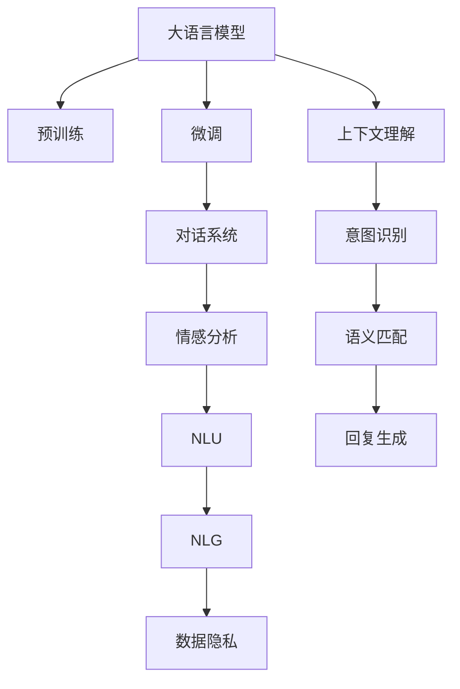

                 

# LLM与社交媒体：重塑在线交互

> 关键词：自然语言处理,社交媒体,语言模型,交互,对话系统,情感分析,自然语言生成,数据隐私

## 1. 背景介绍

### 1.1 问题由来
在信息爆炸的互联网时代，社交媒体成为了人们获取信息和互动交流的主要平台。然而，传统的文本处理方法往往难以充分理解社交媒体上的语言多样性和复杂性，导致机器无法准确理解和生成自然语言。这种状况限制了社交媒体的交互体验和信息价值。

与此同时，大语言模型（Large Language Models, LLMs）在自然语言处理（Natural Language Processing, NLP）领域的崛起，为社交媒体上的交互和内容生成提供了新的解决方案。LLMs不仅能够生成高质量的自然语言文本，还能在复杂的对话中保持连贯和逻辑一致性，显著提升社交媒体的智能化水平。

### 1.2 问题核心关键点
基于LLMs的社交媒体交互系统的核心关键点包括：

1. **自然语言理解（NLU）**：理解和分析社交媒体上的用户输入，识别意图和情感，提取出关键信息。
2. **自然语言生成（NLG）**：基于用户输入生成合理的回复，保持语义连贯性。
3. **对话管理**：管理社交媒体上的对话流程，确保对话的流畅性和上下文一致性。
4. **情感分析**：识别用户输入中的情感倾向，调整回复的语气和策略。
5. **数据隐私保护**：保护用户隐私，防止敏感信息泄露。

这些关键点涉及NLP的多个技术领域，需要在实践中加以综合运用。

## 2. 核心概念与联系

### 2.1 核心概念概述

为更好地理解基于LLMs的社交媒体交互系统，本节将介绍几个密切相关的核心概念：

- **大语言模型（LLMs）**：如BERT、GPT-3等，通过大规模无标签文本预训练获得语言表示，具备强大的语言生成和理解能力。
- **预训练（Pre-training）**：在无标签数据上训练语言模型，学习通用的语言知识和模式。
- **微调（Fine-tuning）**：在预训练模型的基础上，使用社交媒体上的任务数据进行有监督学习，优化模型在特定任务上的表现。
- **对话系统（Dialog Systems）**：自动生成并管理社交媒体上的对话，实现人机交互。
- **情感分析（Sentiment Analysis）**：分析用户输入的情感倾向，调整回复策略。
- **自然语言生成（NLG）**：生成流畅、连贯的回复，增强社交媒体的互动体验。
- **数据隐私（Data Privacy）**：保护用户隐私，避免敏感信息泄露。

这些核心概念之间的逻辑关系可以通过以下Mermaid流程图来展示：



这个流程图展示了大语言模型在社交媒体交互系统中的核心作用及其与其他核心概念的联系：

1. 大语言模型通过预训练获得基础能力。
2. 微调使模型更好地适应社交媒体特定任务。
3. 对话系统基于微调后的模型实现人机交互。
4. 情感分析在对话中识别和调整回复策略。
5. NLU和NLG在对话中实现语言的理解和生成。
6. 数据隐私保护在对话中确保用户信息安全。

这些概念共同构成了基于LLMs的社交媒体交互系统的基础框架，为其提供了坚实的技术支持。

## 3. 核心算法原理 & 具体操作步骤

### 3.1 算法原理概述

基于LLMs的社交媒体交互系统，本质上是一个集成了自然语言理解与生成的对话系统。其核心思想是：利用LLMs在无标签数据上的预训练能力，通过有监督的微调过程，使其具备社交媒体任务的特定能力，从而实现高效的人机交互。

形式化地，假设预训练语言模型为 $M_{\theta}$，其中 $\theta$ 为预训练得到的模型参数。给定社交媒体任务 $T$ 的训练集 $D=\{(x_i, y_i)\}_{i=1}^N$，微调的目标是找到新的模型参数 $\hat{\theta}$，使得：

$$
\hat{\theta}=\mathop{\arg\min}_{\theta} \mathcal{L}(M_{\theta},D)
$$

其中 $\mathcal{L}$ 为针对任务 $T$ 设计的损失函数，用于衡量模型预测输出与真实标签之间的差异。常见的损失函数包括交叉熵损失、均方误差损失等。

通过梯度下降等优化算法，微调过程不断更新模型参数 $\theta$，最小化损失函数 $\mathcal{L}$，使得模型输出逼近真实标签。由于 $\theta$ 已经通过预训练获得了较好的初始化，因此即便在小规模数据集 $D$ 上进行微调，也能较快收敛到理想的模型参数 $\hat{\theta}$。

### 3.2 算法步骤详解

基于LLMs的社交媒体交互系统，通常包括以下几个关键步骤：

**Step 1: 准备预训练模型和数据集**
- 选择合适的预训练语言模型 $M_{\theta}$ 作为初始化参数，如 GPT-3、BERT 等。
- 准备社交媒体任务 $T$ 的训练集 $D$，划分为训练集、验证集和测试集。一般要求训练集与预训练数据的分布不要差异过大。

**Step 2: 添加任务适配层**
- 根据任务类型，在预训练模型顶层设计合适的输出层和损失函数。
- 对于对话系统，通常在顶层添加分类器和对话管理器，用以生成合适的回复。
- 对于情感分析任务，可以添加情感分类器，用于识别输入文本的情感倾向。
- 对于自然语言生成任务，可以添加解码器，用于生成流畅的回复文本。

**Step 3: 设置微调超参数**
- 选择合适的优化算法及其参数，如 AdamW、SGD 等，设置学习率、批大小、迭代轮数等。
- 设置正则化技术及强度，包括权重衰减、Dropout、Early Stopping 等。
- 确定冻结预训练参数的策略，如仅微调顶层，或全部参数都参与微调。

**Step 4: 执行梯度训练**
- 将训练集数据分批次输入模型，前向传播计算损失函数。
- 反向传播计算参数梯度，根据设定的优化算法和学习率更新模型参数。
- 周期性在验证集上评估模型性能，根据性能指标决定是否触发 Early Stopping。
- 重复上述步骤直到满足预设的迭代轮数或 Early Stopping 条件。

**Step 5: 测试和部署**
- 在测试集上评估微调后模型 $M_{\hat{\theta}}$ 的性能，对比微调前后的精度提升。
- 使用微调后的模型对新样本进行推理预测，集成到实际的应用系统中。
- 持续收集新的数据，定期重新微调模型，以适应数据分布的变化。

以上是基于LLMs的社交媒体交互系统的一般流程。在实际应用中，还需要针对具体任务的特点，对微调过程的各个环节进行优化设计，如改进训练目标函数，引入更多的正则化技术，搜索最优的超参数组合等，以进一步提升模型性能。

### 3.3 算法优缺点

基于LLMs的社交媒体交互系统具有以下优点：
1. 通用高效。利用大模型预训练能力，通过微调适应社交媒体任务，快速生成高质量回复。
2. 多任务处理。LLMs可以同时处理多种自然语言处理任务，提高系统灵活性和应用范围。
3. 可扩展性强。随着数据和模型的积累，系统可以不断升级和优化，保持先进性。

同时，该方法也存在一些局限性：
1. 数据隐私问题。社交媒体上的交互数据通常包含大量个人隐私信息，数据隐私保护成为一大挑战。
2. 计算资源需求高。大模型的训练和微调需要大量计算资源，增加系统开发和运维成本。
3. 鲁棒性问题。社交媒体上的语言多样性和复杂性，可能导致模型在特定情境下表现不佳。
4. 对抗攻击风险。社交媒体上的攻击和恶意行为可能导致模型生成不安全或有害内容。
5. 过拟合风险。如果训练数据过于偏颇，模型可能学习到偏见和歧视，影响公平性。

尽管存在这些局限性，但就目前而言，基于LLMs的社交媒体交互系统仍是大规模应用的最主流范式。未来相关研究的重点在于如何进一步降低计算成本，提高模型鲁棒性和公平性，同时兼顾数据隐私和对抗攻击等安全性问题。

### 3.4 算法应用领域

基于LLMs的社交媒体交互系统已经在诸多领域得到了广泛应用，例如：

- **社交媒体客服**：利用对话系统自动回复用户问题，提高客户满意度。
- **情感分析系统**：识别用户输入的情感倾向，提供情感支持或调整策略。
- **个性化推荐系统**：分析用户互动数据，生成个性化推荐内容。
- **智能聊天机器人**：在各类应用中提供24/7的智能交互体验。
- **内容生成平台**：辅助生成高质量的社交媒体内容，如文章、评论等。
- **在线广告系统**：根据用户互动数据生成个性化的广告内容。

除了上述这些经典应用外，LLMs在社交媒体领域的创新应用还在不断涌现，为社交媒体的智能化发展提供了新的动力。

## 4. 数学模型和公式 & 详细讲解 & 举例说明

### 4.1 数学模型构建

本节将使用数学语言对基于LLMs的社交媒体交互系统的核心算法进行更加严格的刻画。

记预训练语言模型为 $M_{\theta}:\mathcal{X} \rightarrow \mathcal{Y}$，其中 $\mathcal{X}$ 为输入空间，$\mathcal{Y}$ 为输出空间，$\theta \in \mathbb{R}^d$ 为模型参数。假设社交媒体任务 $T$ 的训练集为 $D=\{(x_i,y_i)\}_{i=1}^N, x_i \in \mathcal{X}, y_i \in \mathcal{Y}$。

定义模型 $M_{\theta}$ 在数据样本 $(x,y)$ 上的损失函数为 $\ell(M_{\theta}(x),y)$，则在数据集 $D$ 上的经验风险为：

$$
\mathcal{L}(\theta) = \frac{1}{N} \sum_{i=1}^N \ell(M_{\theta}(x_i),y_i)
$$

微调的优化目标是最小化经验风险，即找到最优参数：

$$
\theta^* = \mathop{\arg\min}_{\theta} \mathcal{L}(\theta)
$$

在实践中，我们通常使用基于梯度的优化算法（如SGD、Adam等）来近似求解上述最优化问题。设 $\eta$ 为学习率，$\lambda$ 为正则化系数，则参数的更新公式为：

$$
\theta \leftarrow \theta - \eta \nabla_{\theta}\mathcal{L}(\theta) - \eta\lambda\theta
$$

其中 $\nabla_{\theta}\mathcal{L}(\theta)$ 为损失函数对参数 $\theta$ 的梯度，可通过反向传播算法高效计算。

### 4.2 公式推导过程

以下我们以对话系统为例，推导交叉熵损失函数及其梯度的计算公式。

假设模型 $M_{\theta}$ 在输入 $x$ 上的输出为 $\hat{y}=M_{\theta}(x) \in [0,1]$，表示样本属于某一类别的概率。真实标签 $y \in \{0,1\}$。则二分类交叉熵损失函数定义为：

$$
\ell(M_{\theta}(x),y) = -[y\log \hat{y} + (1-y)\log (1-\hat{y})]
$$

将其代入经验风险公式，得：

$$
\mathcal{L}(\theta) = -\frac{1}{N}\sum_{i=1}^N [y_i\log M_{\theta}(x_i)+(1-y_i)\log(1-M_{\theta}(x_i))]
$$

根据链式法则，损失函数对参数 $\theta_k$ 的梯度为：

$$
\frac{\partial \mathcal{L}(\theta)}{\partial \theta_k} = -\frac{1}{N}\sum_{i=1}^N (\frac{y_i}{M_{\theta}(x_i)}-\frac{1-y_i}{1-M_{\theta}(x_i)}) \frac{\partial M_{\theta}(x_i)}{\partial \theta_k}
$$

其中 $\frac{\partial M_{\theta}(x_i)}{\partial \theta_k}$ 可进一步递归展开，利用自动微分技术完成计算。

在得到损失函数的梯度后，即可带入参数更新公式，完成模型的迭代优化。重复上述过程直至收敛，最终得到适应社交媒体任务的最优模型参数 $\theta^*$。

## 5. 项目实践：代码实例和详细解释说明

### 5.1 开发环境搭建

在进行LLMs社交媒体交互系统的开发前，我们需要准备好开发环境。以下是使用Python进行PyTorch开发的环境配置流程：

1. 安装Anaconda：从官网下载并安装Anaconda，用于创建独立的Python环境。

2. 创建并激活虚拟环境：
```bash
conda create -n pytorch-env python=3.8 
conda activate pytorch-env
```

3. 安装PyTorch：根据CUDA版本，从官网获取对应的安装命令。例如：
```bash
conda install pytorch torchvision torchaudio cudatoolkit=11.1 -c pytorch -c conda-forge
```

4. 安装Transformers库：
```bash
pip install transformers
```

5. 安装各类工具包：
```bash
pip install numpy pandas scikit-learn matplotlib tqdm jupyter notebook ipython
```

完成上述步骤后，即可在`pytorch-env`环境中开始微调实践。

### 5.2 源代码详细实现

下面我们以对话系统为例，给出使用Transformers库对GPT模型进行微调的PyTorch代码实现。

首先，定义对话系统需要的数据处理函数：

```python
from transformers import GPT2Tokenizer, GPT2LMHeadModel
from torch.utils.data import Dataset, DataLoader

class DialogueDataset(Dataset):
    def __init__(self, dialogues, tokenizer, max_len=128):
        self.dialogues = dialogues
        self.tokenizer = tokenizer
        self.max_len = max_len
        
    def __len__(self):
        return len(self.dialogues)
    
    def __getitem__(self, item):
        dialogue = self.dialogues[item]
        utterances = dialogue['user_input'] + dialogue['bot_response']
        encoding = self.tokenizer(utterances, return_tensors='pt', max_length=self.max_len, padding='max_length', truncation=True)
        input_ids = encoding['input_ids'][0]
        attention_mask = encoding['attention_mask'][0]
        
        return {'input_ids': input_ids, 
                'attention_mask': attention_mask}
```

然后，定义模型和优化器：

```python
from transformers import GPT2LMHeadModel, AdamW

model = GPT2LMHeadModel.from_pretrained('gpt2', num_labels=len(tag2id))

optimizer = AdamW(model.parameters(), lr=2e-5)
```

接着，定义训练和评估函数：

```python
from tqdm import tqdm

device = torch.device('cuda') if torch.cuda.is_available() else torch.device('cpu')
model.to(device)

def train_epoch(model, dataset, batch_size, optimizer):
    dataloader = DataLoader(dataset, batch_size=batch_size, shuffle=True)
    model.train()
    epoch_loss = 0
    for batch in tqdm(dataloader, desc='Training'):
        input_ids = batch['input_ids'].to(device)
        attention_mask = batch['attention_mask'].to(device)
        model.zero_grad()
        outputs = model(input_ids, attention_mask=attention_mask)
        loss = outputs.loss
        epoch_loss += loss.item()
        loss.backward()
        optimizer.step()
    return epoch_loss / len(dataloader)

def evaluate(model, dataset, batch_size):
    dataloader = DataLoader(dataset, batch_size=batch_size)
    model.eval()
    preds, labels = [], []
    with torch.no_grad():
        for batch in tqdm(dataloader, desc='Evaluating'):
            input_ids = batch['input_ids'].to(device)
            attention_mask = batch['attention_mask'].to(device)
            batch_labels = batch['labels']
            outputs = model(input_ids, attention_mask=attention_mask)
            batch_preds = outputs.logits.argmax(dim=2).to('cpu').tolist()
            batch_labels = batch_labels.to('cpu').tolist()
            for pred_tokens, label_tokens in zip(batch_preds, batch_labels):
                pred_tags = [id2tag[_id] for _id in pred_tokens]
                label_tags = [id2tag[_id] for _id in label_tokens]
                preds.append(pred_tags[:len(label_tokens)])
                labels.append(label_tags)
                
    print(classification_report(labels, preds))
```

最后，启动训练流程并在测试集上评估：

```python
epochs = 5
batch_size = 16

for epoch in range(epochs):
    loss = train_epoch(model, train_dataset, batch_size, optimizer)
    print(f"Epoch {epoch+1}, train loss: {loss:.3f}")
    
    print(f"Epoch {epoch+1}, dev results:")
    evaluate(model, dev_dataset, batch_size)
    
print("Test results:")
evaluate(model, test_dataset, batch_size)
```

以上就是使用PyTorch对GPT进行对话系统微调的完整代码实现。可以看到，得益于Transformers库的强大封装，我们可以用相对简洁的代码完成GPT模型的加载和微调。

### 5.3 代码解读与分析

让我们再详细解读一下关键代码的实现细节：

**DialogueDataset类**：
- `__init__`方法：初始化对话数据集，将对话文本编码为token ids，并进行定长padding。
- `__len__`方法：返回数据集的样本数量。
- `__getitem__`方法：对单个样本进行处理，将对话文本输入编码为token ids，并进行定长padding。

**训练和评估函数**：
- 使用PyTorch的DataLoader对数据集进行批次化加载，供模型训练和推理使用。
- 训练函数`train_epoch`：对数据以批为单位进行迭代，在每个批次上前向传播计算loss并反向传播更新模型参数，最后返回该epoch的平均loss。
- 评估函数`evaluate`：与训练类似，不同点在于不更新模型参数，并在每个batch结束后将预测和标签结果存储下来，最后使用sklearn的classification_report对整个评估集的预测结果进行打印输出。

**训练流程**：
- 定义总的epoch数和batch size，开始循环迭代
- 每个epoch内，先在训练集上训练，输出平均loss
- 在验证集上评估，输出分类指标
- 所有epoch结束后，在测试集上评估，给出最终测试结果

可以看到，PyTorch配合Transformers库使得GPT微调的代码实现变得简洁高效。开发者可以将更多精力放在数据处理、模型改进等高层逻辑上，而不必过多关注底层的实现细节。

当然，工业级的系统实现还需考虑更多因素，如模型的保存和部署、超参数的自动搜索、更灵活的任务适配层等。但核心的微调范式基本与此类似。

## 6. 实际应用场景

### 6.1 智能客服系统

基于LLMs的对话系统，可以广泛应用于智能客服系统的构建。传统客服往往需要配备大量人力，高峰期响应缓慢，且一致性和专业性难以保证。而使用对话系统，可以7x24小时不间断服务，快速响应客户咨询，用自然流畅的语言解答各类常见问题。

在技术实现上，可以收集企业内部的历史客服对话记录，将问题和最佳答复构建成监督数据，在此基础上对预训练对话模型进行微调。微调后的对话模型能够自动理解用户意图，匹配最合适的答案模板进行回复。对于客户提出的新问题，还可以接入检索系统实时搜索相关内容，动态组织生成回答。如此构建的智能客服系统，能大幅提升客户咨询体验和问题解决效率。

### 6.2 情感分析系统

金融机构需要实时监测市场舆论动向，以便及时应对负面信息传播，规避金融风险。传统的人工监测方式成本高、效率低，难以应对网络时代海量信息爆发的挑战。基于LLMs的情感分析系统，为金融舆情监测提供了新的解决方案。

具体而言，可以收集金融领域相关的新闻、报道、评论等文本数据，并对其进行主题标注和情感标注。在此基础上对预训练语言模型进行微调，使其能够自动判断文本属于何种主题，情感倾向是正面、中性还是负面。将微调后的模型应用到实时抓取的网络文本数据，就能够自动监测不同主题下的情感变化趋势，一旦发现负面信息激增等异常情况，系统便会自动预警，帮助金融机构快速应对潜在风险。

### 6.3 个性化推荐系统

当前的推荐系统往往只依赖用户的历史行为数据进行物品推荐，无法深入理解用户的真实兴趣偏好。基于LLMs的个性化推荐系统，可以更好地挖掘用户行为背后的语义信息，从而提供更精准、多样的推荐内容。

在实践中，可以收集用户浏览、点击、评论、分享等行为数据，提取和用户交互的物品标题、描述、标签等文本内容。将文本内容作为模型输入，用户的后续行为（如是否点击、购买等）作为监督信号，在此基础上微调预训练语言模型。微调后的模型能够从文本内容中准确把握用户的兴趣点。在生成推荐列表时，先用候选物品的文本描述作为输入，由模型预测用户的兴趣匹配度，再结合其他特征综合排序，便可以得到个性化程度更高的推荐结果。

### 6.4 未来应用展望

随着LLMs和微调方法的不断发展，基于微调范式将在更多领域得到应用，为传统行业带来变革性影响。

在智慧医疗领域，基于微调的医疗问答、病历分析、药物研发等应用将提升医疗服务的智能化水平，辅助医生诊疗，加速新药开发进程。

在智能教育领域，微调技术可应用于作业批改、学情分析、知识推荐等方面，因材施教，促进教育公平，提高教学质量。

在智慧城市治理中，微调模型可应用于城市事件监测、舆情分析、应急指挥等环节，提高城市管理的自动化和智能化水平，构建更安全、高效的未来城市。

此外，在企业生产、社会治理、文娱传媒等众多领域，基于LLMs的微调应用也将不断涌现，为NLP技术带来了新的突破。相信随着技术的日益成熟，微调方法将成为人工智能落地应用的重要范式，推动人工智能技术在垂直行业的规模化落地。总之，LLMs在社交媒体领域的创新应用，将为在线交互带来更加智能、自然、高效的新体验，极大地提升人类与机器的协同能力。

## 7. 工具和资源推荐

### 7.1 学习资源推荐

为了帮助开发者系统掌握LLMs社交媒体交互系统的理论基础和实践技巧，这里推荐一些优质的学习资源：

1. 《Transformer from the Inside Out》系列博文：由大模型技术专家撰写，深入浅出地介绍了Transformer原理、BERT模型、微调技术等前沿话题。

2. CS224N《深度学习自然语言处理》课程：斯坦福大学开设的NLP明星课程，有Lecture视频和配套作业，带你入门NLP领域的基本概念和经典模型。

3. 《Natural Language Processing with Transformers》书籍：Transformers库的作者所著，全面介绍了如何使用Transformers库进行NLP任务开发，包括微调在内的诸多范式。

4. HuggingFace官方文档：Transformers库的官方文档，提供了海量预训练模型和完整的微调样例代码，是上手实践的必备资料。

5. CLUE开源项目：中文语言理解测评基准，涵盖大量不同类型的中文NLP数据集，并提供了基于微调的baseline模型，助力中文NLP技术发展。

通过对这些资源的学习实践，相信你一定能够快速掌握LLMs社交媒体交互系统的精髓，并用于解决实际的NLP问题。
###  7.2 开发工具推荐

高效的开发离不开优秀的工具支持。以下是几款用于LLMs社交媒体交互系统开发的常用工具：

1. PyTorch：基于Python的开源深度学习框架，灵活动态的计算图，适合快速迭代研究。大部分预训练语言模型都有PyTorch版本的实现。

2. TensorFlow：由Google主导开发的开源深度学习框架，生产部署方便，适合大规模工程应用。同样有丰富的预训练语言模型资源。

3. Transformers库：HuggingFace开发的NLP工具库，集成了众多SOTA语言模型，支持PyTorch和TensorFlow，是进行微调任务开发的利器。

4. Weights & Biases：模型训练的实验跟踪工具，可以记录和可视化模型训练过程中的各项指标，方便对比和调优。与主流深度学习框架无缝集成。

5. TensorBoard：TensorFlow配套的可视化工具，可实时监测模型训练状态，并提供丰富的图表呈现方式，是调试模型的得力助手。

6. Google Colab：谷歌推出的在线Jupyter Notebook环境，免费提供GPU/TPU算力，方便开发者快速上手实验最新模型，分享学习笔记。

合理利用这些工具，可以显著提升LLMs社交媒体交互系统的开发效率，加快创新迭代的步伐。

### 7.3 相关论文推荐

LLMs和微调技术的发展源于学界的持续研究。以下是几篇奠基性的相关论文，推荐阅读：

1. Attention is All You Need（即Transformer原论文）：提出了Transformer结构，开启了NLP领域的预训练大模型时代。

2. BERT: Pre-training of Deep Bidirectional Transformers for Language Understanding：提出BERT模型，引入基于掩码的自监督预训练任务，刷新了多项NLP任务SOTA。

3. Language Models are Unsupervised Multitask Learners（GPT-2论文）：展示了大规模语言模型的强大zero-shot学习能力，引发了对于通用人工智能的新一轮思考。

4. Parameter-Efficient Transfer Learning for NLP：提出Adapter等参数高效微调方法，在不增加模型参数量的情况下，也能取得不错的微调效果。

5. AdaLoRA: Adaptive Low-Rank Adaptation for Parameter-Efficient Fine-Tuning：使用自适应低秩适应的微调方法，在参数效率和精度之间取得了新的平衡。

这些论文代表了大语言模型和微调技术的发展脉络。通过学习这些前沿成果，可以帮助研究者把握学科前进方向，激发更多的创新灵感。

## 8. 总结：未来发展趋势与挑战

### 8.1 总结

本文对基于LLMs的社交媒体交互系统进行了全面系统的介绍。首先阐述了LLMs和微调技术的研究背景和意义，明确了微调在提升社交媒体智能化水平、增强用户体验方面的独特价值。其次，从原理到实践，详细讲解了LLMs在社交媒体上的微调方法和关键步骤，给出了微调任务开发的完整代码实例。同时，本文还广泛探讨了微调系统在智能客服、情感分析、个性化推荐等多个行业领域的应用前景，展示了LLMs技术的巨大潜力。此外，本文精选了微调技术的各类学习资源，力求为读者提供全方位的技术指引。

通过本文的系统梳理，可以看到，基于LLMs的社交媒体交互系统正在成为NLP领域的重要范式，极大地拓展了预训练语言模型的应用边界，催生了更多的落地场景。受益于大规模语料的预训练，微调系统能够快速生成高质量的回复，提升社交媒体的交互体验和信息价值。未来，伴随LLMs和微调方法的持续演进，相信社交媒体的智能化水平将进一步提升，深刻影响人类的生产生活方式。

### 8.2 未来发展趋势

展望未来，基于LLMs的社交媒体交互系统将呈现以下几个发展趋势：

1. 模型规模持续增大。随着算力成本的下降和数据规模的扩张，预训练语言模型的参数量还将持续增长。超大规模语言模型蕴含的丰富语言知识，有望支撑更加复杂多变的社交媒体对话。

2. 微调方法日趋多样。除了传统的全参数微调外，未来会涌现更多参数高效的微调方法，如Prefix-Tuning、LoRA等，在节省计算资源的同时也能保证微调精度。

3. 持续学习成为常态。随着数据分布的不断变化，LLMs也需要持续学习新知识以保持性能。如何在不遗忘原有知识的同时，高效吸收新样本信息，将成为重要的研究课题。

4. 标注样本需求降低。受启发于提示学习(Prompt-based Learning)的思路，未来的微调方法将更好地利用LLMs的语言理解能力，通过更加巧妙的任务描述，在更少的标注样本上也能实现理想的微调效果。

5. 多模态微调崛起。当前的微调主要聚焦于纯文本数据，未来会进一步拓展到图像、视频、语音等多模态数据微调。多模态信息的融合，将显著提升LLMs对现实世界的理解和建模能力。

6. 模型通用性增强。经过海量数据的预训练和多领域任务的微调，LLMs将具备更强大的常识推理和跨领域迁移能力，逐步迈向通用人工智能(AGI)的目标。

以上趋势凸显了基于LLMs的社交媒体交互技术的广阔前景。这些方向的探索发展，必将进一步提升社交媒体系统的性能和应用范围，为人类认知智能的进化带来深远影响。

### 8.3 面临的挑战

尽管基于LLMs的社交媒体交互系统已经取得了瞩目成就，但在迈向更加智能化、普适化应用的过程中，它仍面临着诸多挑战：

1. 数据隐私问题。社交媒体上的交互数据通常包含大量个人隐私信息，数据隐私保护成为一大挑战。如何确保用户数据的安全，防止隐私泄露，将是关键问题。

2. 计算资源需求高。大模型的训练和微调需要大量计算资源，增加系统开发和运维成本。如何优化模型结构和算法，减少资源消耗，是提高系统可扩展性的重要方向。

3. 鲁棒性问题。社交媒体上的语言多样性和复杂性，可能导致模型在特定情境下表现不佳。如何提高模型的鲁棒性，避免出现偏见和歧视，是提升系统公平性的重要课题。

4. 对抗攻击风险。社交媒体上的攻击和恶意行为可能导致模型生成不安全或有害内容。如何加强模型的安全性，防范对抗攻击，是确保系统稳定性的重要任务。

5. 知识整合能力不足。现有的微调模型往往局限于任务内数据，难以灵活吸收和运用更广泛的先验知识。如何让微调过程更好地与外部知识库、规则库等专家知识结合，形成更加全面、准确的信息整合能力，还有很大的想象空间。

尽管存在这些挑战，但就目前而言，基于LLMs的社交媒体交互系统仍是大规模应用的最主流范式。未来相关研究的重点在于如何进一步降低计算成本，提高模型鲁棒性和公平性，同时兼顾数据隐私和对抗攻击等安全性问题。

### 8.4 未来突破

面对基于LLMs的社交媒体交互系统所面临的种种挑战，未来的研究需要在以下几个方面寻求新的突破：

1. 探索无监督和半监督微调方法。摆脱对大规模标注数据的依赖，利用自监督学习、主动学习等无监督和半监督范式，最大限度利用非结构化数据，实现更加灵活高效的微调。

2. 研究参数高效和计算高效的微调范式。开发更加参数高效的微调方法，在固定大部分预训练参数的同时，只更新极少量的任务相关参数。同时优化微调模型的计算图，减少前向传播和反向传播的资源消耗，实现更加轻量级、实时性的部署。

3. 融合因果和对比学习范式。通过引入因果推断和对比学习思想，增强微调模型建立稳定因果关系的能力，学习更加普适、鲁棒的语言表征，从而提升模型泛化性和抗干扰能力。

4. 引入更多先验知识。将符号化的先验知识，如知识图谱、逻辑规则等，与神经网络模型进行巧妙融合，引导微调过程学习更准确、合理的语言模型。同时加强不同模态数据的整合，实现视觉、语音等多模态信息与文本信息的协同建模。

5. 结合因果分析和博弈论工具。将因果分析方法引入微调模型，识别出模型决策的关键特征，增强输出解释的因果性和逻辑性。借助博弈论工具刻画人机交互过程，主动探索并规避模型的脆弱点，提高系统稳定性。

6. 纳入伦理道德约束。在模型训练目标中引入伦理导向的评估指标，过滤和惩罚有偏见、有害的输出倾向。同时加强人工干预和审核，建立模型行为的监管机制，确保输出符合人类价值观和伦理道德。

这些研究方向的探索，必将引领基于LLMs的社交媒体交互技术迈向更高的台阶，为构建安全、可靠、可解释、可控的智能系统铺平道路。面向未来，基于LLMs的社交媒体交互技术还需要与其他人工智能技术进行更深入的融合，如知识表示、因果推理、强化学习等，多路径协同发力，共同推动自然语言理解和智能交互系统的进步。只有勇于创新、敢于突破，才能不断拓展LLMs的边界，让智能技术更好地造福人类社会。

## 9. 附录：常见问题与解答

**Q1：大语言模型在社交媒体上的优势是什么？**

A: 大语言模型在社交媒体上的优势主要体现在以下几个方面：
1. 语言理解和生成能力强：大语言模型具备强大的自然语言理解和生成能力，能够生成流畅、连贯的回复，提升社交媒体的智能化水平。
2. 多任务处理灵活：一个预训练模型可以通过微调适应不同的社交媒体任务，如对话、情感分析、推荐等，提高系统的灵活性和应用范围。
3. 可扩展性强：随着数据和模型的积累，系统可以不断升级和优化，保持先进性。
4. 能够学习多样化的语言表达：社交媒体上的语言表达多样性较高，大语言模型可以学习到各种表达方式，提升回复的自然度和准确性。

**Q2：如何在社交媒体上构建高效的对话系统？**

A: 在社交媒体上构建高效的对话系统，主要需要考虑以下几个方面：
1. 数据收集：收集社交媒体上的对话记录和用户反馈，构建监督数据集。
2. 预训练模型选择：选择适合的预训练模型，如BERT、GPT等，并进行微调。
3. 任务适配：根据具体任务设计合适的输出层和损失函数。
4. 模型训练：使用数据集进行模型训练，设定合适的超参数和训练策略。
5. 对话管理：设计对话管理器，确保对话流程的自然流畅。
6. 情感分析：在对话中识别用户情感，调整回复策略。
7. 持续学习：定期重新微调模型，适应新的数据分布。

**Q3：社交媒体上对话系统的挑战有哪些？**

A: 社交媒体上的对话系统面临的挑战主要包括：
1. 数据隐私：对话数据通常包含大量个人隐私信息，如何保护用户数据隐私是关键。
2. 多样性：社交媒体上的语言表达多样性高，对话模型需要具备较强的泛化能力。
3. 鲁棒性：面对恶意攻击和对抗样本，对话系统需要具备较强的鲁棒性。
4. 对话管理：在多轮对话中保持上下文一致性和连贯性是对话系统的难点。
5. 情感分析：如何准确识别用户情感倾向，调整回复策略，提升用户体验。
6. 计算资源：大语言模型的训练和微调需要大量计算资源，如何优化模型结构和算法，提高系统可扩展性，是重要研究方向。

**Q4：对话系统在社交媒体上的应用前景有哪些？**

A: 对话系统在社交媒体上的应用前景广泛，包括但不限于：
1. 智能客服：利用对话系统自动回复用户问题，提高客户满意度。
2. 情感分析：实时监测用户情绪，提供情感支持或调整策略。
3. 个性化推荐：分析用户互动数据，生成个性化推荐内容。
4. 智能聊天机器人：在各类应用中提供24/7的智能交互体验。
5. 内容生成平台：辅助生成高质量的社交媒体内容，如文章、评论等。
6. 在线广告系统：根据用户互动数据生成个性化的广告内容。

通过对话系统，可以大幅提升社交媒体的智能化水平，增强用户体验和信息价值。相信随着技术的不断发展，对话系统将在更多领域得到应用，为NLP技术带来新的突破。

