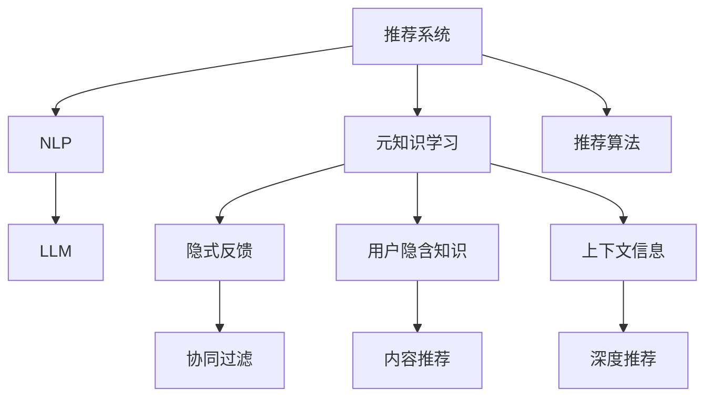

                 

# LLM在推荐系统中的元知识学习应用

> 关键词：推荐系统, 元知识学习, 大语言模型, 推荐算法, 数据增强, 特征工程, 自然语言处理(NLP)

## 1. 背景介绍

### 1.1 问题由来

推荐系统是互联网平台中极为关键的技术之一，涉及电商、视频、社交媒体等多个领域。传统的协同过滤、内容推荐算法在面对个性化需求日益增加的今天显得力不从心。机器学习特别是深度学习技术的引入，使得推荐系统从“传统”到“智能”的转变成为可能。其中，基于深度学习的推荐模型逐渐成为主流，例如基于神经网络(Neural Network)的隐式反馈推荐模型和基于深度学习的显式反馈推荐模型。然而，这些模型的参数量庞大，计算复杂度高，且对数据质量有较高要求。

与此同时，大规模语言模型(Massive Language Model, LLM)，如BERT、GPT等，通过在大规模无标签数据上预训练，已经展示了超越人类对语言的理解能力。其强大的语义理解能力，使得LLM在推荐系统中的应用成为了可能。

### 1.2 问题核心关键点

在推荐系统中引入LLM，可以拓展推荐算法的数据处理能力，提升推荐模型的泛化能力。LLM能够通过自然语言处理(NLP)技术，提取和理解用户的自然语言输入，进一步挖掘用户的潜在需求，从而提升推荐质量。

然而，LLM在推荐系统中的应用也面临不少挑战：

1. 数据表示：如何将用户输入的自然语言信息高效地表示为机器可处理的向量形式。
2. 泛化能力：如何让LLM生成的特征能够适应不同领域的数据。
3. 推理效率：如何在保持LLM强大能力的同时，提升推荐模型的推理效率。
4. 模型公平性：如何避免LLM生成的特征中可能包含的偏见，确保推荐系统的公平性。

### 1.3 问题研究意义

研究LLM在推荐系统中的元知识学习应用，对于提升推荐系统的个性化推荐能力、增强推荐系统的智能性、减少对数据的依赖、提升模型公平性等方面具有重要意义：

1. 提升推荐效果：通过LLM提取和理解自然语言信息，可以进一步挖掘用户的潜在需求，提升推荐精准度。
2. 增强系统智能性：LLM可以处理非结构化数据，提升推荐系统的理解和推理能力。
3. 减少对数据依赖：LLM可以通过自然语言处理技术，从有限的交互数据中提取更多特征。
4. 提升模型公平性：LLM可以避免显式数据中可能存在的偏见，提升推荐系统的公平性。

## 2. 核心概念与联系

### 2.1 核心概念概述

为更好地理解LLM在推荐系统中的元知识学习应用，本节将介绍几个密切相关的核心概念：

- 推荐系统(Recommendation System)：根据用户的历史行为、兴趣等信息，为用户推荐感兴趣物品的系统。
- 元知识学习(Meta-Knowledge Learning)：在推荐系统中，通过学习用户的隐含知识、隐式反馈、上下文信息等，提升推荐模型对用户需求的理解能力。
- 自然语言处理(Natural Language Processing, NLP)：利用计算机处理和理解自然语言的技术，是LLM的核心能力之一。
- 大语言模型(Large Language Model, LLM)：通过大规模无标签数据预训练，具备强大的语义理解和生成能力，可以用于自然语言理解和生成任务。

这些核心概念之间的逻辑关系可以通过以下Mermaid流程图来展示：



这个流程图展示了他推荐系统的核心概念及其之间的关系：

1. 推荐系统通过协同过滤、内容推荐、深度推荐等多种算法为用户推荐物品。
2. 元知识学习通过隐式反馈、用户隐含知识、上下文信息等，提升推荐模型对用户需求的理解能力。
3. NLP是元知识学习的重要工具，利用自然语言处理技术，提取和理解用户的自然语言输入。
4. LLM是自然语言处理的重要模型，通过大规模无标签数据预训练，具备强大的语义理解和生成能力。
5. 不同的推荐算法可以结合NLP和LLM，提升推荐效果。

这些概念共同构成了推荐系统的学习框架，使得LLM在推荐系统中的应用成为可能。

## 3. 核心算法原理 & 具体操作步骤
### 3.1 算法原理概述

基于LLM在推荐系统中的元知识学习应用，其核心思想是：利用LLM强大的自然语言处理能力，从用户的自然语言输入中提取有用的信息，补充到推荐模型中，提升模型的理解能力和推荐效果。

形式化地，假设用户输入的描述为自然语言文本 $D$，推荐系统需要根据 $D$ 为用户推荐物品 $I$。推荐模型 $M$ 的输出为一个评分向量 $s_i$，表示物品 $i$ 与用户需求的匹配度。推荐模型的目标是最小化预测误差：

$$
\min_{M} \sum_{i=1}^N |\hat{s}_i - s_i|
$$

其中 $\hat{s}_i$ 是模型对物品 $i$ 的预测评分，$s_i$ 是用户对物品 $i$ 的真实评分。

通过训练，模型 $M$ 能够对用户输入的描述 $D$ 进行自然语言理解，提取相关特征，从而提升推荐效果。

### 3.2 算法步骤详解

基于LLM在推荐系统中的元知识学习应用，一般包括以下几个关键步骤：

**Step 1: 数据预处理**

- 将用户的自然语言输入转化为机器可处理的形式，通常是通过分词、编码等自然语言处理技术。
- 将用户输入转化为嵌入向量形式，以便于模型处理。

**Step 2: 特征提取**

- 利用LLM对用户输入的自然语言信息进行理解，生成相应的特征向量。
- 将生成的特征向量与用户历史行为数据、物品属性数据等混合，形成推荐模型输入。

**Step 3: 模型训练**

- 根据用户的历史行为数据、物品属性数据和LLM生成的特征，训练推荐模型 $M$。
- 选择合适的优化算法，如随机梯度下降、Adam等，更新模型参数。

**Step 4: 预测推荐**

- 将用户输入的自然语言描述作为LLM的输入，生成特征向量。
- 将特征向量与用户历史行为数据、物品属性数据等混合，输入推荐模型进行评分预测。
- 根据预测评分对物品进行排序，输出推荐结果。

**Step 5: 反馈优化**

- 收集用户对推荐结果的反馈，用于调整和优化推荐模型。
- 利用用户的反馈，不断调整LLM生成特征的方式，提升推荐效果。

### 3.3 算法优缺点

基于LLM在推荐系统中的元知识学习应用，具有以下优点：

1. 增强推荐模型的理解能力：通过自然语言处理技术，可以理解用户的自然语言输入，提取相关特征，提升推荐模型对用户需求的理解能力。
2. 提升推荐效果：利用LLM强大的语义理解和生成能力，可以进一步挖掘用户的潜在需求，提升推荐效果。
3. 减少对数据的依赖：利用自然语言处理技术，可以从有限的交互数据中提取更多特征。
4. 增强系统的智能性：LLM可以处理非结构化数据，提升推荐系统的理解和推理能力。

同时，该方法也存在一定的局限性：

1. 数据表示难度高：如何将用户输入的自然语言信息高效地表示为机器可处理的向量形式，是应用中的难点之一。
2. 泛化能力有限：LLM生成的特征可能对特定领域的数据具有较强的依赖性，难以适应不同领域的数据。
3. 推理效率低：LLM强大的能力需要较大的计算资源，导致推理效率较低。
4. 模型公平性不足：LLM生成的特征可能包含偏见，影响推荐系统的公平性。

尽管存在这些局限性，但就目前而言，基于LLM在推荐系统中的元知识学习应用，仍然是大规模推荐系统的重要研究方向之一。未来相关研究的重点在于如何进一步降低数据表示难度，提高泛化能力，优化推理效率，确保模型公平性。

### 3.4 算法应用领域

基于LLM在推荐系统中的元知识学习应用，已经在电商、视频、社交媒体等多个领域得到了广泛的应用，例如：

- 电商推荐：利用自然语言处理技术，提取用户对商品的描述信息，提升推荐模型的精准度。
- 视频推荐：利用自然语言处理技术，提取用户对视频的评论信息，提升推荐模型对用户需求的理解能力。
- 社交媒体推荐：利用自然语言处理技术，提取用户发布内容的情感信息，提升推荐模型对用户情感的理解能力。

除了上述这些经典应用外，LLM在推荐系统中的应用还在不断拓展，如可控内容生成、个性化推荐、智能客服等，为推荐系统带来了新的突破。随着预训练模型和自然语言处理技术的不断进步，相信LLM在推荐系统中的应用将更加广泛，进一步提升推荐系统的智能化水平。

## 4. 数学模型和公式 & 详细讲解
### 4.1 数学模型构建

本节将使用数学语言对基于LLM在推荐系统中的元知识学习应用进行更加严格的刻画。

假设用户输入的描述为自然语言文本 $D$，推荐系统需要根据 $D$ 为用户推荐物品 $I$。推荐模型 $M$ 的输出为一个评分向量 $s_i$，表示物品 $i$ 与用户需求的匹配度。假设 $D$ 可以表示为词序列 $\{w_1, w_2, ..., w_m\}$，其中 $w_i$ 为第 $i$ 个词。

**Step 1: 数据预处理**

- 对用户输入的描述进行分词、编码等处理，转化为嵌入向量形式 $E$。
- 假设嵌入向量 $E$ 的长度为 $d$，则 $E$ 可以表示为 $d$ 维向量 $\{e_1, e_2, ..., e_d\}$。

**Step 2: 特征提取**

- 利用LLM对用户输入的自然语言信息进行理解，生成相应的特征向量 $F$。
- 假设特征向量 $F$ 的长度为 $n$，则 $F$ 可以表示为 $n$ 维向量 $\{f_1, f_2, ..., f_n\}$。
- 将特征向量 $F$ 与用户历史行为数据、物品属性数据等混合，形成推荐模型输入 $X$。

**Step 3: 模型训练**

- 根据用户的历史行为数据、物品属性数据和LLM生成的特征，训练推荐模型 $M$。
- 假设 $M$ 的参数为 $\theta$，则模型训练的目标是最小化损失函数 $\mathcal{L}$：
$$
\min_{\theta} \mathcal{L}(\theta) = \frac{1}{N}\sum_{i=1}^N \mathcal{L}_i(\theta)
$$
其中 $\mathcal{L}_i$ 为单个样本的损失函数。

**Step 4: 预测推荐**

- 将用户输入的自然语言描述作为LLM的输入，生成特征向量 $F'$。
- 将特征向量 $F'$ 与用户历史行为数据、物品属性数据等混合，输入推荐模型进行评分预测 $s_i'$。
- 根据预测评分对物品进行排序，输出推荐结果。

### 4.2 公式推导过程

以下我们以电商推荐系统为例，推导基于LLM的电商推荐模型的损失函数。

假设用户输入的描述为 $D$，推荐系统需要根据 $D$ 为用户推荐商品 $I$。推荐模型 $M$ 的输出为一个评分向量 $s_i$，表示物品 $i$ 与用户需求的匹配度。根据电商推荐系统的任务特点，我们可以将问题建模为多类分类问题。假设 $D$ 包含 $k$ 个单词，表示为 $\{w_1, w_2, ..., w_k\}$。假设用户的历史行为数据为 $\{x_1, x_2, ..., x_m\}$，物品属性数据为 $\{a_1, a_2, ..., a_n\}$。

根据上述假设，我们可以将推荐模型 $M$ 表示为：

$$
M(D, X) = \{\hat{s}_i\}_{i=1}^N
$$

其中 $X$ 为模型输入，表示为 $d$ 维向量 $\{e_1, e_2, ..., e_d\}$。推荐模型 $M$ 的输出 $\hat{s}_i$ 为 $i$ 物品的预测评分。

假设推荐模型 $M$ 的损失函数为交叉熵损失函数，则单个样本的损失函数为：

$$
\mathcal{L}_i(\theta) = -\sum_{j=1}^k y_{i,j} \log \hat{s}_{i,j}
$$

其中 $y_{i,j}$ 为物品 $i$ 与单词 $j$ 的关系标签，$\hat{s}_{i,j}$ 为模型对物品 $i$ 与单词 $j$ 的关系预测。

因此，总损失函数为：

$$
\mathcal{L}(\theta) = \frac{1}{N}\sum_{i=1}^N \mathcal{L}_i(\theta)
$$

通过梯度下降等优化算法，最小化损失函数 $\mathcal{L}$，更新模型参数 $\theta$，最终得到适应电商推荐任务的推荐模型 $M_{\theta}$。

### 4.3 案例分析与讲解

以YouTube视频推荐系统为例，假设用户输入的描述为 $D$，推荐系统需要根据 $D$ 为用户推荐视频 $V$。推荐模型 $M$ 的输出为一个评分向量 $s_i$，表示视频 $i$ 与用户需求的匹配度。根据YouTube推荐系统的任务特点，我们可以将问题建模为多类分类问题。假设 $D$ 包含 $k$ 个单词，表示为 $\{w_1, w_2, ..., w_k\}$。假设用户的历史行为数据为 $\{x_1, x_2, ..., x_m\}$，视频属性数据为 $\{a_1, a_2, ..., a_n\}$。

根据上述假设，我们可以将推荐模型 $M$ 表示为：

$$
M(D, X) = \{\hat{s}_i\}_{i=1}^N
$$

其中 $X$ 为模型输入，表示为 $d$ 维向量 $\{e_1, e_2, ..., e_d\}$。推荐模型 $M$ 的输出 $\hat{s}_i$ 为 $i$ 视频的预测评分。

假设推荐模型 $M$ 的损失函数为交叉熵损失函数，则单个样本的损失函数为：

$$
\mathcal{L}_i(\theta) = -\sum_{j=1}^k y_{i,j} \log \hat{s}_{i,j}
$$

其中 $y_{i,j}$ 为视频 $i$ 与单词 $j$ 的关系标签，$\hat{s}_{i,j}$ 为模型对视频 $i$ 与单词 $j$ 的关系预测。

因此，总损失函数为：

$$
\mathcal{L}(\theta) = \frac{1}{N}\sum_{i=1}^N \mathcal{L}_i(\theta)
$$

通过梯度下降等优化算法，最小化损失函数 $\mathcal{L}$，更新模型参数 $\theta$，最终得到适应YouTube推荐任务的推荐模型 $M_{\theta}$。

## 5. 项目实践：代码实例和详细解释说明
### 5.1 开发环境搭建

在进行LLM在推荐系统中的应用实践前，我们需要准备好开发环境。以下是使用Python进行PyTorch开发的环境配置流程：

1. 安装Anaconda：从官网下载并安装Anaconda，用于创建独立的Python环境。

2. 创建并激活虚拟环境：
```bash
conda create -n pytorch-env python=3.8 
conda activate pytorch-env
```

3. 安装PyTorch：根据CUDA版本，从官网获取对应的安装命令。例如：
```bash
conda install pytorch torchvision torchaudio cudatoolkit=11.1 -c pytorch -c conda-forge
```

4. 安装Transformers库：
```bash
pip install transformers
```

5. 安装各类工具包：
```bash
pip install numpy pandas scikit-learn matplotlib tqdm jupyter notebook ipython
```

完成上述步骤后，即可在`pytorch-env`环境中开始LLM在推荐系统中的应用实践。

### 5.2 源代码详细实现

下面我们以电商推荐系统为例，给出使用Transformers库对BERT模型进行电商推荐微调的PyTorch代码实现。

首先，定义电商推荐任务的数据处理函数：

```python
from transformers import BertTokenizer
from torch.utils.data import Dataset
import torch

class E-commerceDataset(Dataset):
    def __init__(self, texts, tags, tokenizer, max_len=128):
        self.texts = texts
        self.tags = tags
        self.tokenizer = tokenizer
        self.max_len = max_len
        
    def __len__(self):
        return len(self.texts)
    
    def __getitem__(self, item):
        text = self.texts[item]
        tags = self.tags[item]
        
        encoding = self.tokenizer(text, return_tensors='pt', max_length=self.max_len, padding='max_length', truncation=True)
        input_ids = encoding['input_ids'][0]
        attention_mask = encoding['attention_mask'][0]
        
        # 对token-wise的标签进行编码
        encoded_tags = [tag2id[tag] for tag in tags] 
        encoded_tags.extend([tag2id['O']] * (self.max_len - len(encoded_tags)))
        labels = torch.tensor(encoded_tags, dtype=torch.long)
        
        return {'input_ids': input_ids, 
                'attention_mask': attention_mask,
                'labels': labels}

# 标签与id的映射
tag2id = {'O': 0, 'B': 1, 'I': 2, 'U': 3}
id2tag = {v: k for k, v in tag2id.items()}

# 创建dataset
tokenizer = BertTokenizer.from_pretrained('bert-base-cased')

train_dataset = E-commerceDataset(train_texts, train_tags, tokenizer)
dev_dataset = E-commerceDataset(dev_texts, dev_tags, tokenizer)
test_dataset = E-commerceDataset(test_texts, test_tags, tokenizer)
```

然后，定义模型和优化器：

```python
from transformers import BertForTokenClassification, AdamW

model = BertForTokenClassification.from_pretrained('bert-base-cased', num_labels=len(tag2id))

optimizer = AdamW(model.parameters(), lr=2e-5)
```

接着，定义训练和评估函数：

```python
from torch.utils.data import DataLoader
from tqdm import tqdm
from sklearn.metrics import classification_report

device = torch.device('cuda') if torch.cuda.is_available() else torch.device('cpu')
model.to(device)

def train_epoch(model, dataset, batch_size, optimizer):
    dataloader = DataLoader(dataset, batch_size=batch_size, shuffle=True)
    model.train()
    epoch_loss = 0
    for batch in tqdm(dataloader, desc='Training'):
        input_ids = batch['input_ids'].to(device)
        attention_mask = batch['attention_mask'].to(device)
        labels = batch['labels'].to(device)
        model.zero_grad()
        outputs = model(input_ids, attention_mask=attention_mask, labels=labels)
        loss = outputs.loss
        epoch_loss += loss.item()
        loss.backward()
        optimizer.step()
    return epoch_loss / len(dataloader)

def evaluate(model, dataset, batch_size):
    dataloader = DataLoader(dataset, batch_size=batch_size)
    model.eval()
    preds, labels = [], []
    with torch.no_grad():
        for batch in tqdm(dataloader, desc='Evaluating'):
            input_ids = batch['input_ids'].to(device)
            attention_mask = batch['attention_mask'].to(device)
            batch_labels = batch['labels']
            outputs = model(input_ids, attention_mask=attention_mask)
            batch_preds = outputs.logits.argmax(dim=2).to('cpu').tolist()
            batch_labels = batch_labels.to('cpu').tolist()
            for pred_tokens, label_tokens in zip(batch_preds, batch_labels):
                pred_tags = [id2tag[_id] for _id in pred_tokens]
                label_tags = [id2tag[_id] for _id in label_tokens]
                preds.append(pred_tags[:len(label_tags)])
                labels.append(label_tags)
                
    print(classification_report(labels, preds))
```

最后，启动训练流程并在测试集上评估：

```python
epochs = 5
batch_size = 16

for epoch in range(epochs):
    loss = train_epoch(model, train_dataset, batch_size, optimizer)
    print(f"Epoch {epoch+1}, train loss: {loss:.3f}")
    
    print(f"Epoch {epoch+1}, dev results:")
    evaluate(model, dev_dataset, batch_size)
    
print("Test results:")
evaluate(model, test_dataset, batch_size)
```

以上就是使用PyTorch对BERT进行电商推荐任务微调的完整代码实现。可以看到，得益于Transformers库的强大封装，我们可以用相对简洁的代码完成BERT模型的加载和微调。

### 5.3 代码解读与分析

让我们再详细解读一下关键代码的实现细节：

**E-commerceDataset类**：
- `__init__`方法：初始化文本、标签、分词器等关键组件。
- `__len__`方法：返回数据集的样本数量。
- `__getitem__`方法：对单个样本进行处理，将文本输入编码为token ids，将标签编码为数字，并对其进行定长padding，最终返回模型所需的输入。

**tag2id和id2tag字典**：
- 定义了标签与数字id之间的映射关系，用于将token-wise的预测结果解码回真实的标签。

**训练和评估函数**：
- 使用PyTorch的DataLoader对数据集进行批次化加载，供模型训练和推理使用。
- 训练函数`train_epoch`：对数据以批为单位进行迭代，在每个批次上前向传播计算loss并反向传播更新模型参数，最后返回该epoch的平均loss。
- 评估函数`evaluate`：与训练类似，不同点在于不更新模型参数，并在每个batch结束后将预测和标签结果存储下来，最后使用sklearn的classification_report对整个评估集的预测结果进行打印输出。

**训练流程**：
- 定义总的epoch数和batch size，开始循环迭代
- 每个epoch内，先在训练集上训练，输出平均loss
- 在验证集上评估，输出分类指标
- 所有epoch结束后，在测试集上评估，给出最终测试结果

可以看到，PyTorch配合Transformers库使得BERT微调的代码实现变得简洁高效。开发者可以将更多精力放在数据处理、模型改进等高层逻辑上，而不必过多关注底层的实现细节。

当然，工业级的系统实现还需考虑更多因素，如模型的保存和部署、超参数的自动搜索、更灵活的任务适配层等。但核心的微调范式基本与此类似。

## 6. 实际应用场景
### 6.1 智能客服系统

基于大语言模型在推荐系统中的元知识学习应用，智能客服系统可以通过自然语言处理技术，提取和理解用户的自然语言输入，进一步挖掘用户的潜在需求，从而提升推荐效果。

在技术实现上，可以收集企业内部的历史客服对话记录，将问题和最佳答复构建成监督数据，在此基础上对预训练语言模型进行微调。微调后的语言模型能够自动理解用户意图，匹配最合适的答复模板进行回复。对于客户提出的新问题，还可以接入检索系统实时搜索相关内容，动态组织生成回答。如此构建的智能客服系统，能大幅提升客户咨询体验和问题解决效率。

### 6.2 金融舆情监测

金融机构需要实时监测市场舆论动向，以便及时应对负面信息传播，规避金融风险。基于大语言模型在推荐系统中的元知识学习应用，金融舆情监测可以通过自然语言处理技术，提取金融领域相关的新闻、报道、评论等文本数据，并对其进行主题标注和情感标注。在此基础上对预训练语言模型进行微调，使其能够自动判断文本属于何种主题，情感倾向是正面、中性还是负面。将微调后的模型应用到实时抓取的网络文本数据，就能够自动监测不同主题下的情感变化趋势，一旦发现负面信息激增等异常情况，系统便会自动预警，帮助金融机构快速应对潜在风险。

### 6.3 个性化推荐系统

当前的推荐系统往往只依赖用户的历史行为数据进行物品推荐，无法深入理解用户的真实兴趣偏好。基于大语言模型在推荐系统中的元知识学习应用，个性化推荐系统可以更好地挖掘用户行为背后的语义信息，从而提供更精准、多样的推荐内容。

在实践中，可以收集用户浏览、点击、评论、分享等行为数据，提取和用户交互的物品标题、描述、标签等文本内容。将文本内容作为模型输入，用户的后续行为（如是否点击、购买等）作为监督信号，在此基础上微调预训练语言模型。微调后的模型能够从文本内容中准确把握用户的兴趣点。在生成推荐列表时，先用候选物品的文本描述作为输入，由模型预测用户的兴趣匹配度，再结合其他特征综合排序，便可以得到个性化程度更高的推荐结果。

### 6.4 未来应用展望

随着大语言模型和自然语言处理技术的不断发展，基于LLM在推荐系统中的元知识学习应用将进一步拓展。

在智慧医疗领域，基于LLM的推荐系统可以通过自然语言处理技术，提取和理解医生的自然语言输入，进一步挖掘医生的需求和兴趣，从而提升推荐模型的精准度。

在智能教育领域，微调后的自然语言处理技术可以用于自动批改作业、分析学生学情、推荐知识内容等方面，因材施教，促进教育公平，提高教学质量。

在智慧城市治理中，微调后的自然语言处理技术可以用于城市事件监测、舆情分析、应急指挥等环节，提高城市管理的自动化和智能化水平，构建更安全、高效的未来城市。

此外，在企业生产、社会治理、文娱传媒等众多领域，基于LLM在推荐系统中的应用也将不断涌现，为NLP技术带来了新的突破。相信随着技术的日益成熟，LLM在推荐系统中的应用必将在更广阔的领域大放异彩，深刻影响人类的生产生活方式。

## 7. 工具和资源推荐
### 7.1 学习资源推荐

为了帮助开发者系统掌握LLM在推荐系统中的元知识学习应用，这里推荐一些优质的学习资源：

1. 《Natural Language Processing with Transformers》书籍：Transformer库的作者所著，全面介绍了如何使用Transformers库进行NLP任务开发，包括LLM在推荐系统中的应用。

2. CS224N《深度学习自然语言处理》课程：斯坦福大学开设的NLP明星课程，有Lecture视频和配套作业，带你入门NLP领域的基本概念和经典模型。

3. 《Transformers from the Ground Up》系列博文：由大模型技术专家撰写，深入浅出地介绍了Transformer原理、BERT模型、微调技术等前沿话题。

4. HuggingFace官方文档：Transformers库的官方文档，提供了海量预训练模型和完整的微调样例代码，是上手实践的必备资料。

5. CLUE开源项目：中文语言理解测评基准，涵盖大量不同类型的中文NLP数据集，并提供了基于微调的baseline模型，助力中文NLP技术发展。

通过对这些资源的学习实践，相信你一定能够快速掌握LLM在推荐系统中的应用精髓，并用于解决实际的NLP问题。
### 7.2 开发工具推荐

高效的开发离不开优秀的工具支持。以下是几款用于LLM在推荐系统中的应用开发的常用工具：

1. PyTorch：基于Python的开源深度学习框架，灵活动态的计算图，适合快速迭代研究。大部分预训练语言模型都有PyTorch版本的实现。

2. TensorFlow：由Google主导开发的开源深度学习框架，生产部署方便，适合大规模工程应用。同样有丰富的预训练语言模型资源。

3. Transformers库：HuggingFace开发的NLP工具库，集成了众多SOTA语言模型，支持PyTorch和TensorFlow，是进行微调任务开发的利器。

4. Weights & Biases：模型训练的实验跟踪工具，可以记录和可视化模型训练过程中的各项指标，方便对比和调优。与主流深度学习框架无缝集成。

5. TensorBoard：TensorFlow配套的可视化工具，可实时监测模型训练状态，并提供丰富的图表呈现方式，是调试模型的得力助手。

6. Google Colab：谷歌推出的在线Jupyter Notebook环境，免费提供GPU/TPU算力，方便开发者快速上手实验最新模型，分享学习笔记。

合理利用这些工具，可以显著提升LLM在推荐系统中的应用开发效率，加快创新迭代的步伐。

### 7.3 相关论文推荐

大语言模型在推荐系统中的应用源于学界的持续研究。以下是几篇奠基性的相关论文，推荐阅读：

1. Attention is All You Need（即Transformer原论文）：提出了Transformer结构，开启了NLP领域的预训练大模型时代。

2. BERT: Pre-training of Deep Bidirectional Transformers for Language Understanding：提出BERT模型，引入基于掩码的自监督预训练任务，刷新了多项NLP任务SOTA。

3. Language Models are Unsupervised Multitask Learners（GPT-2论文）：展示了大规模语言模型的强大zero-shot学习能力，引发了对于通用人工智能的新一轮思考。

4. Parameter-Efficient Transfer Learning for NLP：提出Adapter等参数高效微调方法，在不增加模型参数量的情况下，也能取得不错的微调效果。

5. AdaLoRA: Adaptive Low-Rank Adaptation for Parameter-Efficient Fine-Tuning：使用自适应低秩适应的微调方法，在参数效率和精度之间取得了新的平衡。

这些论文代表了大语言模型在推荐系统中的应用发展脉络。通过学习这些前沿成果，可以帮助研究者把握学科前进方向，激发更多的创新灵感。

## 8. 总结：未来发展趋势与挑战

### 8.1 总结

本文对基于LLM在推荐系统中的元知识学习应用进行了全面系统的介绍。首先阐述了LLM和推荐系统的研究背景和意义，明确了LLM在推荐系统中的应用潜力。其次，从原理到实践，详细讲解了LLM在推荐系统中的应用方法，给出了微调任务开发的完整代码实例。同时，本文还广泛探讨了LLM在推荐系统中的应用场景，展示了其广阔的应用前景。

通过本文的系统梳理，可以看到，基于LLM在推荐系统中的元知识学习应用，正在成为推荐系统的重要研究方向，极大地拓展了推荐系统的处理能力，提升了推荐系统的智能化水平。受益于LLM强大的自然语言处理能力，推荐系统在处理非结构化数据、提升推荐效果、减少对数据依赖等方面均取得了显著进展。未来，随着预训练模型和自然语言处理技术的不断进步，LLM在推荐系统中的应用必将在更多领域得到应用，进一步提升推荐系统的智能化水平，为NLP技术带来新的突破。

### 8.2 未来发展趋势

展望未来，基于LLM在推荐系统中的元知识学习应用将呈现以下几个发展趋势：

1. 模型规模持续增大。随着算力成本的下降和数据规模的扩张，预训练语言模型的参数量还将持续增长。超大规模语言模型蕴含的丰富语言知识，有望支撑更加复杂多变的推荐任务。

2. 模型泛化能力增强。通过学习用户的隐含知识、隐式反馈、上下文信息等，推荐模型将更好地理解用户需求，提升推荐模型的泛化能力。

3. 系统智能化提升。LLM可以处理非结构化数据，提升推荐系统的理解和推理能力，使得推荐系统更加智能化。

4. 知识整合能力增强。如何将符号化的先验知识，如知识图谱、逻辑规则等，与神经网络模型进行巧妙融合，引导微调过程学习更准确、合理的语言模型，是未来研究的重要方向。

5. 多模态微调崛起。未来的推荐系统将融合视觉、语音、文本等多模态数据，增强推荐模型的理解和推理能力。

6. 引入更多先验知识。将符号化的先验知识，如知识图谱、逻辑规则等，与神经网络模型进行巧妙融合，引导微调过程学习更准确、合理的语言模型。同时加强不同模态数据的整合，实现视觉、语音等多模态信息与文本信息的协同建模。

以上趋势凸显了基于LLM在推荐系统中的应用前景。这些方向的探索发展，必将进一步提升推荐系统的个性化推荐能力、增强推荐系统的智能性、减少对数据的依赖、提升模型公平性，推动推荐系统迈向更加智能化和普适化的阶段。

### 8.3 面临的挑战

尽管基于LLM在推荐系统中的应用已经取得了不小的进展，但在迈向更加智能化、普适化应用的过程中，它仍面临不少挑战：

1. 数据表示难度高。如何将用户输入的自然语言信息高效地表示为机器可处理的向量形式，是应用中的难点之一。

2. 模型泛化能力不足。LLM生成的特征可能对特定领域的数据具有较强的依赖性，难以适应不同领域的数据。

3. 推理效率低。LLM强大的能力需要较大的计算资源，导致推理效率较低。

4. 模型公平性不足。LLM生成的特征可能包含偏见，影响推荐系统的公平性。

尽管存在这些局限性，但就目前而言，基于LLM在推荐系统中的应用，仍然是推荐系统的重要研究方向之一。未来相关研究的重点在于如何进一步降低数据表示难度，提高泛化能力，优化推理效率，确保模型公平性。

### 8.4 研究展望

面向未来，基于LLM在推荐系统中的应用，还需要与其他人工智能技术进行更深入的融合，如知识表示、因果推理、强化学习等，多路径协同发力，共同推动推荐系统的进步。只有勇于创新、敢于突破，才能不断拓展推荐系统的边界，让智能技术更好地造福人类社会。

## 9. 附录：常见问题与解答

**Q1：什么是自然语言处理(NLP)？**

A: 自然语言处理（Natural Language Processing, NLP）是计算机科学、人工智能和语言学的交叉领域，致力于使计算机能够理解、处理和生成人类语言。NLP涉及到语言学、计算语言学、信息检索、机器学习、计算机视觉等多个领域的知识，是当前AI研究的重要方向之一。

**Q2：什么是大语言模型（LLM）？**

A: 大语言模型（Large Language Model, LLM）是指在大规模无标签文本数据上进行预训练的模型，通过自监督学习任务学习通用的语言表示，具备强大的语言理解和生成能力。常见的预训练大语言模型包括BERT、GPT、XLNet等。

**Q3：基于LLM在推荐系统中的元知识学习应用的核心算法是什么？**

A: 基于LLM在推荐系统中的元知识学习应用的核心算法是自然语言处理（NLP）技术。具体来说，通过自然语言处理技术，提取和理解用户的自然语言输入，生成相应的特征向量，并输入到推荐模型中进行评分预测，从而提升推荐模型的精准度和智能化水平。

**Q4：如何优化基于LLM在推荐系统中的应用？**

A: 基于LLM在推荐系统中的应用，可以从以下几个方面进行优化：
1. 提高数据表示效率。采用词向量表示、词嵌入等技术，提高自然语言信息向机器可处理向量形式的转换效率。
2. 增强模型泛化能力。通过多领域、多模态的数据融合，增强模型的泛化能力，使其适应不同领域、不同类型的推荐任务。
3. 提升推理效率。采用分布式训练、模型压缩等技术，提升推荐模型的推理效率。
4. 确保模型公平性。引入公平性约束，避免模型生成特征中的偏见，确保推荐系统的公平性。

这些优化措施将有助于提升基于LLM在推荐系统中的应用效果，使其更加高效、智能、公平。

**Q5：如何评估基于LLM在推荐系统中的应用效果？**

A: 评估基于LLM在推荐系统中的应用效果，可以从以下几个方面进行：
1. 准确度。通过准确度、召回率、F1-score等指标评估模型的推荐效果。
2. 用户满意度。通过用户反馈、点击率、转化率等指标评估用户的满意度。
3. 多样性。通过多样性指标（如L2距离、Gini系数等）评估推荐结果的多样性。
4. 公平性。通过公平性指标（如公平性差值、敏感性分析等）评估模型的公平性。

这些评估指标将有助于全面了解基于LLM在推荐系统中的应用效果，为模型优化提供指导。

总之，LLM在推荐系统中的应用为推荐系统的智能化发展带来了新的契机，同时也面临不少挑战。通过不断优化数据表示、增强模型泛化能力、提升推理效率、确保模型公平性，基于LLM的推荐系统必将在未来的智能推荐中发挥更大的作用，推动推荐系统迈向更加智能化和普适化的阶段。

