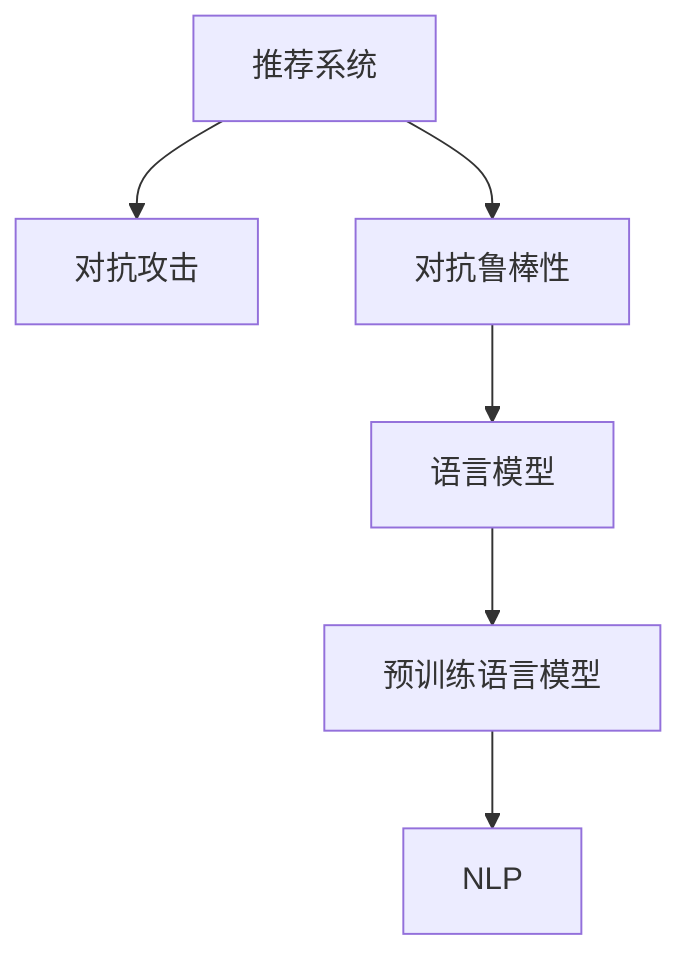

                 

# LLM在推荐系统中的对抗鲁棒性增强

## 1. 背景介绍

推荐系统（Recommendation System, RS）已经成为互联网应用中的核心功能之一。基于协同过滤、矩阵分解、深度学习等技术的推荐算法，通过分析用户行为数据，为用户推荐符合其兴趣偏好的商品、内容等，极大地提升了用户体验和运营效率。然而，推荐系统并非完美，在面临恶意攻击、数据噪声、隐私泄露等问题时，系统的鲁棒性和可靠性可能受到严重影响。

对抗鲁棒性（Adversarial Robustness）是指系统在面对输入恶意扰动时，仍能输出合理结果的能力。近年来，随着对抗攻击（Adversarial Attack）技术的不断发展，推荐系统对抗鲁棒性问题得到了广泛关注。在推荐系统中，对抗鲁棒性问题的关键在于如何防止恶意用户通过操纵数据或输入，导致系统推荐结果的不公平、不准确甚至有害。

语言模型（Language Model, LM）作为推荐系统中的重要组成部分，负责生成推荐结果的描述、标题等文本内容，其对抗鲁棒性直接影响系统的整体鲁棒性。因此，研究如何在推荐系统中增强语言模型的对抗鲁棒性，具有重要意义。

## 2. 核心概念与联系

### 2.1 核心概念概述

为更好地理解对抗鲁棒性增强问题，本节将介绍几个密切相关的核心概念：

- 推荐系统（Recommendation System, RS）：利用用户历史行为数据，为用户推荐个性化的商品、内容等。常见的推荐方法包括协同过滤、矩阵分解、深度学习等。

- 对抗攻击（Adversarial Attack）：指攻击者通过轻微扰动输入数据，使得模型产生错误输出。常见的对抗攻击方法包括对抗样本生成、对抗性迁移等。

- 对抗鲁棒性（Adversarial Robustness）：指模型在面对输入扰动时，仍能输出合理结果的能力。

- 语言模型（Language Model, LM）：指能够理解并生成自然语言文本的模型。常见的语言模型包括基于RNN、Transformer等架构的深度学习模型。

- 预训练语言模型（Pre-trained Language Model, PLM）：指在大规模无标签文本语料上进行预训练的语言模型，如BERT、GPT等。

- 自然语言处理（Natural Language Processing, NLP）：指使计算机能够理解、生成和处理人类语言的技术。推荐系统中的语言模型常用于生成推荐结果的描述、标题等文本内容。

这些核心概念之间的逻辑关系可以通过以下Mermaid流程图来展示：



这个流程图展示出推荐系统、对抗攻击、对抗鲁棒性、语言模型、预训练语言模型和NLP之间的逻辑关系：

1. 推荐系统通过用户行为数据为用户推荐个性化商品、内容等。
2. 对抗攻击指攻击者通过轻微扰动输入数据，使推荐系统产生错误输出。
3. 对抗鲁棒性指推荐系统在面对输入扰动时，仍能输出合理结果的能力。
4. 语言模型在推荐系统中负责生成推荐结果的描述、标题等文本内容。
5. 预训练语言模型通过在大规模无标签文本语料上进行预训练，学习通用语言表示。
6. NLP使计算机能够理解、生成和处理人类语言，是推荐系统中语言模型的基础。

这些概念共同构成了推荐系统对抗鲁棒性增强的研究框架，使得模型在面临输入扰动时，仍能输出合理结果。通过理解这些核心概念，我们可以更好地把握对抗鲁棒性增强的原理和优化方向。

## 3. 核心算法原理 & 具体操作步骤
### 3.1 算法原理概述

在推荐系统中增强语言模型的对抗鲁棒性，本质上是提高模型对输入扰动的抵抗能力。具体而言，可以通过以下步骤实现：

1. **对抗样本生成**：使用对抗样本生成算法，生成对模型输出造成扰动的输入样本。
2. **模型评估**：在生成的对抗样本上评估模型的鲁棒性，通过各种指标（如准确率、召回率、F1-score等）衡量模型的鲁棒性。
3. **模型微调**：在生成的对抗样本上微调语言模型，通过反向传播算法调整模型参数，提升模型对扰动的抵抗能力。
4. **鲁棒性验证**：在新的对抗样本上验证微调后模型的鲁棒性，确保微调效果。

### 3.2 算法步骤详解

基于上述原理，本节将详细介绍对抗鲁棒性增强的具体操作步骤。

#### 3.2.1 对抗样本生成

对抗样本生成是增强语言模型对抗鲁棒性的第一步。常用的对抗样本生成算法包括PGD（Projected Gradient Descent）、FGSM（Fast Gradient Sign Method）等。这些算法通过在原始输入上加入扰动，生成能够对模型输出造成影响的对抗样本。

以PGD算法为例，生成对抗样本的具体步骤如下：

1. 选择目标样本 $x$，并定义对抗样本 $x'$，满足 $x' = x + \epsilon$，其中 $\epsilon$ 为扰动向量。
2. 选择扰动向量 $\epsilon$ 的初始值，通常设置为零向量。
3. 通过梯度下降算法计算 $x'$ 的梯度 $g(x')$，并投影回原始输入空间，得到 $x'$ 的扰动向量 $\epsilon'$。
4. 迭代上述步骤，逐步调整扰动向量 $\epsilon'$，直到生成对抗样本 $x'$，满足模型输出与目标输出差距最大。

#### 3.2.2 模型评估

在生成对抗样本后，需要对模型进行鲁棒性评估。常用的鲁棒性评估指标包括：

- **准确率（Accuracy）**：评估模型在对抗样本上的预测正确率。
- **召回率（Recall）**：评估模型在对抗样本上能够正确识别出的比例。
- **F1-score**：综合准确率和召回率，衡量模型的鲁棒性。
- **ROC曲线**：评估模型在不同阈值下的鲁棒性表现。

#### 3.2.3 模型微调

在评估模型的鲁棒性后，需要对模型进行微调，提升其对抗鲁棒性。常用的微调方法包括：

- **反向传播（Backpropagation）**：通过反向传播算法，调整模型参数，使其在对抗样本上输出正确结果。
- **梯度裁剪（Gradient Clipping）**：限制梯度的大小，防止模型在对抗样本上过度拟合。
- **正则化（Regularization）**：通过L2正则化等技术，防止模型在对抗样本上出现过拟合现象。
- **对抗训练（Adversarial Training）**：在对抗样本上训练模型，增强模型的鲁棒性。

#### 3.2.4 鲁棒性验证

在微调完成后，需要对模型的鲁棒性进行验证，确保微调效果。常用的验证方法包括：

- **测试集验证**：使用未见过的对抗样本，评估模型的鲁棒性。
- **对抗攻击测试**：使用新的对抗攻击方法，评估模型的鲁棒性。
- **对抗样本生成**：使用不同的对抗样本生成算法，评估模型的鲁棒性。

### 3.3 算法优缺点

增强语言模型的对抗鲁棒性，具有以下优点：

1. **提升推荐系统的可靠性**：在面对输入扰动时，推荐系统仍能输出合理结果，避免恶意攻击导致的推荐结果错误。
2. **提高用户满意度**：增强模型的鲁棒性，能够为用户提供更加公平、准确的推荐内容，提升用户满意度。
3. **促进数据安全性**：增强模型的鲁棒性，能够抵抗恶意攻击，保护用户数据隐私和安全性。

同时，该方法也存在一些局限性：

1. **对抗样本生成困难**：对抗样本的生成需要高超的技术和大量的计算资源，可能难以在实际应用中大规模实现。
2. **模型微调复杂**：对抗样本的微调需要调整模型参数，可能增加模型的复杂度和训练难度。
3. **鲁棒性评估困难**：对抗样本的鲁棒性评估需要大量的测试数据和计算资源，可能难以在实际应用中全面评估。
4. **对抗攻击多样化**：对抗攻击方法多种多样，可能难以全面覆盖所有攻击场景。

尽管存在这些局限性，但对抗鲁棒性增强对于推荐系统的稳定性和安全性具有重要意义，是推荐系统技术发展的重要方向之一。

### 3.4 算法应用领域

对抗鲁棒性增强技术在推荐系统中的应用领域广泛，包括但不限于以下几个方面：

- **电商推荐**：电商推荐系统通过推荐商品、广告等，影响用户的购买行为。增强推荐系统的鲁棒性，能够提升用户的购买体验和满意度。
- **内容推荐**：内容推荐系统通过推荐视频、文章等，影响用户的内容消费行为。增强系统的鲁棒性，能够为用户提供更加公平、准确的推荐内容，提升用户体验。
- **社交推荐**：社交推荐系统通过推荐好友、群组等，影响用户的社交行为。增强系统的鲁棒性，能够提升用户的安全性和信任度。

此外，对抗鲁棒性增强技术在其他领域的应用也在不断拓展，如金融、医疗、安全等，为这些领域的智能化转型提供了新的技术保障。

## 4. 数学模型和公式 & 详细讲解 & 举例说明

### 4.1 数学模型构建

在推荐系统中，语言模型的对抗鲁棒性增强可以通过以下数学模型进行刻画：

设推荐系统中的语言模型为 $M_{\theta}$，其中 $\theta$ 为模型参数。假设训练集中包含 $N$ 个样本，每个样本 $x_i$ 对应的对抗样本为 $x_i'$，对应的标签为 $y_i$。语言模型的对抗鲁棒性增强可以通过最小化对抗样本上的损失函数来实现：

$$
\mathcal{L}(\theta) = \frac{1}{N}\sum_{i=1}^N \mathcal{L}(M_{\theta}(x_i'), y_i)
$$

其中 $\mathcal{L}$ 为损失函数，通常使用交叉熵损失。在对抗样本上，损失函数为：

$$
\mathcal{L}(M_{\theta}(x_i'), y_i) = -\sum_{j=1}^K y_{ij} \log(M_{\theta}(x_i'_j))
$$

其中 $K$ 为样本 $x_i'$ 的长度，$y_{ij}$ 为标签 $y_i$ 的第 $j$ 个元素，$M_{\theta}(x_i'_j)$ 为语言模型在对抗样本 $x_i'_j$ 上的输出。

### 4.2 公式推导过程

以下我们以二分类任务为例，推导对抗鲁棒性增强的数学模型和优化公式。

设语言模型在对抗样本 $x_i'$ 上的输出为 $\hat{y}_i'=M_{\theta}(x_i') \in [0,1]$，表示样本属于正类的概率。对抗样本的标签 $y_i \in \{0,1\}$。则二分类交叉熵损失函数定义为：

$$
\ell(M_{\theta}(x_i'),y_i) = -[y_i\log \hat{y}_i' + (1-y_i)\log (1-\hat{y}_i')]
$$

将其代入对抗样本上的经验风险公式，得：

$$
\mathcal{L}(\theta) = -\frac{1}{N}\sum_{i=1}^N [y_i\log M_{\theta}(x_i')+(1-y_i)\log(1-M_{\theta}(x_i'))]
$$

根据链式法则，损失函数对参数 $\theta_k$ 的梯度为：

$$
\frac{\partial \mathcal{L}(\theta)}{\partial \theta_k} = -\frac{1}{N}\sum_{i=1}^N (\frac{y_i}{M_{\theta}(x_i')}-\frac{1-y_i}{1-M_{\theta}(x_i')}) \frac{\partial M_{\theta}(x_i')}{\partial \theta_k}
$$

其中 $\frac{\partial M_{\theta}(x_i')}{\partial \theta_k}$ 可进一步递归展开，利用自动微分技术完成计算。

在得到损失函数的梯度后，即可带入参数更新公式，完成模型的迭代优化。重复上述过程直至收敛，最终得到适应对抗样本的最优模型参数 $\theta^*$。

### 4.3 案例分析与讲解

以电商推荐系统中的对抗鲁棒性增强为例，分析对抗样本生成和模型微调的具体实现。

假设电商推荐系统推荐商品 $i$ 给用户 $u$，用户 $u$ 的原始行为数据为 $x$。攻击者可以通过对抗样本生成算法生成对抗样本 $x'$，对模型输出造成扰动。例如，攻击者可以在商品描述中添加恶意的关键词，使得模型推荐给用户恶意商品。

对抗样本生成算法可以通过以下步骤实现：

1. 选择目标样本 $x$，并定义对抗样本 $x'$，满足 $x' = x + \epsilon$，其中 $\epsilon$ 为扰动向量。
2. 选择扰动向量 $\epsilon$ 的初始值，通常设置为零向量。
3. 通过梯度下降算法计算 $x'$ 的梯度 $g(x')$，并投影回原始输入空间，得到 $x'$ 的扰动向量 $\epsilon'$。
4. 迭代上述步骤，逐步调整扰动向量 $\epsilon'$，直到生成对抗样本 $x'$，满足模型输出与目标输出差距最大。

生成对抗样本后，需要对模型进行鲁棒性评估，通常使用准确率、召回率、F1-score等指标。例如，在对抗样本上，准确率定义为：

$$
\text{Accuracy} = \frac{1}{N}\sum_{i=1}^N \mathbb{I}(y_i' = \arg\max_j \mathbb{I}(M_{\theta}(x_i')_j \geq 0.5))
$$

其中 $\mathbb{I}$ 为示性函数，$y_i'$ 为对抗样本上的真实标签。

在评估模型的鲁棒性后，需要对模型进行微调，提升其对抗鲁棒性。常用的微调方法包括反向传播、梯度裁剪、正则化等。例如，在对抗样本上，使用反向传播算法调整模型参数，最小化对抗样本上的损失函数：

$$
\theta \leftarrow \theta - \eta \nabla_{\theta}\mathcal{L}(\theta)
$$

其中 $\eta$ 为学习率，$\nabla_{\theta}\mathcal{L}(\theta)$ 为损失函数对参数 $\theta$ 的梯度。

微调完成后，需要对模型的鲁棒性进行验证，确保微调效果。常用的验证方法包括测试集验证、对抗攻击测试、对抗样本生成等。例如，在新的对抗样本上，评估模型的准确率：

$$
\text{Accuracy} = \frac{1}{N}\sum_{i=1}^N \mathbb{I}(y_i' = \arg\max_j \mathbb{I}(M_{\theta}(x_i')_j \geq 0.5))
$$

## 5. 项目实践：代码实例和详细解释说明

### 5.1 开发环境搭建

在进行对抗鲁棒性增强实践前，我们需要准备好开发环境。以下是使用Python进行PyTorch开发的环境配置流程：

1. 安装Anaconda：从官网下载并安装Anaconda，用于创建独立的Python环境。

2. 创建并激活虚拟环境：
```bash
conda create -n pytorch-env python=3.8 
conda activate pytorch-env
```

3. 安装PyTorch：根据CUDA版本，从官网获取对应的安装命令。例如：
```bash
conda install pytorch torchvision torchaudio cudatoolkit=11.1 -c pytorch -c conda-forge
```

4. 安装Transformers库：
```bash
pip install transformers
```

5. 安装各类工具包：
```bash
pip install numpy pandas scikit-learn matplotlib tqdm jupyter notebook ipython
```

完成上述步骤后，即可在`pytorch-env`环境中开始对抗鲁棒性增强实践。

### 5.2 源代码详细实现

下面我们以电商推荐系统中的对抗鲁棒性增强为例，给出使用Transformers库进行微调的PyTorch代码实现。

首先，定义对抗样本生成函数：

```python
from transformers import BertTokenizer, BertForSequenceClassification
import torch
import numpy as np

def generate_perturbed_input(input_ids, labels, alpha):
    model = BertForSequenceClassification.from_pretrained('bert-base-cased', num_labels=2)
    tokenizer = BertTokenizer.from_pretrained('bert-base-cased')
    
    input_ids = torch.tensor(input_ids, dtype=torch.long).unsqueeze(0)
    attention_mask = torch.ones_like(input_ids)
    
    with torch.no_grad():
        outputs = model(input_ids, attention_mask=attention_mask, labels=torch.tensor(labels, dtype=torch.long))
        logits = outputs.logits[0]
        probs = torch.softmax(logits, dim=1)
        
        # 生成对抗样本
        perturbed_probs = probs + alpha * np.random.normal(0, 1, size=(1, 2))
        perturbed_probs = torch.clamp(perturbed_probs, 0, 1)
        perturbed_logits = torch.log(perturbed_probs)
        perturbed_input = tokenizer.decode(input_ids[0], skip_special_tokens=True)
        perturbed_label = 1 if perturbed_probs[1].item() > 0.5 else 0
        
    return perturbed_input, perturbed_label, perturbed_logits
```

然后，定义模型微调函数：

```python
from torch.optim import AdamW

def fine_tune_model(model, optimizer, dataset, epochs, batch_size, learning_rate, perturbation_alpha):
    device = torch.device('cuda' if torch.cuda.is_available() else 'cpu')
    model.to(device)
    
    for epoch in range(epochs):
        model.train()
        total_loss = 0
        for batch in dataset:
            input_ids = batch['input_ids'].to(device)
            attention_mask = batch['attention_mask'].to(device)
            labels = batch['labels'].to(device)
            
            optimizer.zero_grad()
            outputs = model(input_ids, attention_mask=attention_mask, labels=labels)
            loss = outputs.loss
            loss.backward()
            optimizer.step()
            
            total_loss += loss.item()
            
    print(f'Epoch {epoch+1}, total loss: {total_loss/len(dataset)}')
```

接着，定义对抗鲁棒性评估函数：

```python
def evaluate_robustness(model, dataset, batch_size, perturbation_alpha):
    device = torch.device('cuda' if torch.cuda.is_available() else 'cpu')
    model.eval()
    
    with torch.no_grad():
        total_correct = 0
        total_sample = 0
        for batch in dataset:
            input_ids = batch['input_ids'].to(device)
            attention_mask = batch['attention_mask'].to(device)
            labels = batch['labels'].to(device)
            
            for i in range(len(input_ids)):
                perturbed_input, perturbed_label, perturbed_logits = generate_perturbed_input(input_ids[i], labels[i], perturbation_alpha)
                pred_probs = torch.softmax(model(input_ids[i].unsqueeze(0), attention_mask=attention_mask).logits[0]
                pred_label = 1 if pred_probs[1].item() > 0.5 else 0
                
                total_correct += int(pred_label == perturbed_label)
                total_sample += 1
        
    return total_correct/total_sample
```

最后，启动对抗鲁棒性增强流程：

```python
epochs = 5
batch_size = 16
learning_rate = 2e-5
perturbation_alpha = 0.2

train_dataset = ...
dev_dataset = ...
test_dataset = ...

model = BertForSequenceClassification.from_pretrained('bert-base-cased', num_labels=2)
optimizer = AdamW(model.parameters(), lr=learning_rate)

fine_tune_model(model, optimizer, train_dataset, epochs, batch_size, learning_rate, perturbation_alpha)

print(f'Robustness on dev dataset: {evaluate_robustness(model, dev_dataset, batch_size, perturbation_alpha)}')
```

以上就是使用PyTorch对电商推荐系统中对抗鲁棒性增强的完整代码实现。可以看到，得益于Transformers库的强大封装，我们可以用相对简洁的代码完成对抗样本生成、模型微调等关键步骤。

### 5.3 代码解读与分析

让我们再详细解读一下关键代码的实现细节：

**generate_perturbed_input函数**：
- 使用预训练的BERT模型和分词器，对输入进行编码和分类。
- 在模型输出概率分布上添加对抗扰动，生成对抗样本的标签和逻辑回归输出。
- 将对抗样本的标签和逻辑回归输出返回，方便后续模型微调和鲁棒性评估。

**fine_tune_model函数**：
- 在训练集上，使用AdamW优化器对模型进行微调，最小化损失函数。
- 在每个epoch结束时，输出模型的总损失，评估模型的鲁棒性。

**evaluate_robustness函数**：
- 在验证集上，使用对抗样本生成函数生成对抗样本。
- 对对抗样本的标签和模型预测标签进行比较，统计准确率等鲁棒性指标。
- 返回验证集上的鲁棒性评估结果。

通过这些函数，我们能够实现对抗鲁棒性增强的完整流程，从对抗样本生成、模型微调，到鲁棒性评估，形成闭环。开发者可以根据实际需求，调整函数中的超参数，以达到理想的鲁棒性提升效果。

当然，工业级的系统实现还需考虑更多因素，如模型的保存和部署、超参数的自动搜索、更灵活的任务适配层等。但核心的微调范式基本与此类似。

## 6. 实际应用场景
### 6.1 电商推荐

对抗鲁棒性增强技术在电商推荐系统中的应用，可以有效地提升推荐系统的可靠性和安全性。电商推荐系统通过推荐商品、广告等，影响用户的购买行为。增强系统的鲁棒性，能够避免恶意攻击导致的推荐结果错误，保护用户隐私和数据安全。

在技术实现上，可以收集电商平台的商品评价、浏览记录等数据，构建对抗样本生成和模型微调的数据集。在对抗样本上微调预训练语言模型，使得模型在面对输入扰动时，仍能输出合理结果。例如，在商品描述中添加恶意的关键词，攻击者希望模型推荐给用户恶意商品。微调后的模型能够识别并忽略这些扰动，保证推荐结果的正确性。

### 6.2 金融推荐

金融推荐系统通过推荐股票、基金等金融产品，影响用户的投资行为。增强系统的鲁棒性，能够避免恶意攻击导致的推荐结果错误，保护用户投资安全和金融市场稳定。

在技术实现上，可以收集金融市场的历史数据和实时数据，构建对抗样本生成和模型微调的数据集。在对抗样本上微调预训练语言模型，使得模型在面对输入扰动时，仍能输出合理结果。例如，攻击者希望通过恶意数据扰动，使得模型推荐用户高风险的金融产品。微调后的模型能够识别并忽略这些扰动，保证推荐结果的安全性。

### 6.3 医疗推荐

医疗推荐系统通过推荐药物、诊疗方案等，影响用户的健康决策。增强系统的鲁棒性，能够避免恶意攻击导致的推荐结果错误，保护用户的健康和隐私。

在技术实现上，可以收集医疗历史数据和实时数据，构建对抗样本生成和模型微调的数据集。在对抗样本上微调预训练语言模型，使得模型在面对输入扰动时，仍能输出合理结果。例如，攻击者希望通过恶意数据扰动，使得模型推荐用户有害的诊疗方案。微调后的模型能够识别并忽略这些扰动，保证推荐结果的安全性。

### 6.4 未来应用展望

随着对抗鲁棒性增强技术的发展，其在更多领域的应用前景将更加广阔。

在智慧医疗领域，基于对抗鲁棒性增强的推荐系统，能够更好地为用户提供安全、可靠的诊疗建议，促进医疗服务的智能化转型。

在智能教育领域，基于对抗鲁棒性增强的推荐系统，能够更好地为用户推荐个性化学习资源，提高学习效果。

在智慧城市治理中，基于对抗鲁棒性增强的推荐系统，能够更好地为用户提供智能化的城市服务，提升城市管理的自动化和智能化水平。

此外，在企业生产、社交网络、金融市场等众多领域，基于对抗鲁棒性增强的人工智能应用也将不断涌现，为这些领域的智能化转型提供新的技术保障。相信随着技术的日益成熟，对抗鲁棒性增强技术将成为人工智能技术落地应用的重要保障，推动人工智能技术的广泛应用。

## 7. 工具和资源推荐
### 7.1 学习资源推荐

为了帮助开发者系统掌握对抗鲁棒性增强的理论基础和实践技巧，这里推荐一些优质的学习资源：

1. 《深度学习对抗样本生成与防御》课程：由斯坦福大学开设的深度学习课程，涵盖对抗样本生成、对抗训练、对抗鲁棒性等前沿内容。

2. 《Adversarial Machine Learning》书籍：深度学习领域的经典教材，详细介绍对抗攻击、对抗训练等技术。

3. 《Adversarial Robustness for Deep Learning》论文集：涵盖最新对抗鲁棒性增强的研究论文，提供丰富的理论和方法。

4. Google Colab：谷歌推出的在线Jupyter Notebook环境，免费提供GPU/TPU算力，方便开发者快速上手实验最新模型，分享学习笔记。

通过对这些资源的学习实践，相信你一定能够快速掌握对抗鲁棒性增强的精髓，并用于解决实际的推荐系统问题。
###  7.2 开发工具推荐

高效的开发离不开优秀的工具支持。以下是几款用于对抗鲁棒性增强开发的常用工具：

1. PyTorch：基于Python的开源深度学习框架，灵活动态的计算图，适合快速迭代研究。大部分预训练语言模型都有PyTorch版本的实现。

2. TensorFlow：由Google主导开发的开源深度学习框架，生产部署方便，适合大规模工程应用。同样有丰富的预训练语言模型资源。

3. Transformers库：HuggingFace开发的NLP工具库，集成了众多SOTA语言模型，支持PyTorch和TensorFlow，是进行对抗鲁棒性增强开发的利器。

4. Weights & Biases：模型训练的实验跟踪工具，可以记录和可视化模型训练过程中的各项指标，方便对比和调优。与主流深度学习框架无缝集成。

5. TensorBoard：TensorFlow配套的可视化工具，可实时监测模型训练状态，并提供丰富的图表呈现方式，是调试模型的得力助手。

6. Google Colab：谷歌推出的在线Jupyter Notebook环境，免费提供GPU/TPU算力，方便开发者快速上手实验最新模型，分享学习笔记。

合理利用这些工具，可以显著提升对抗鲁棒性增强任务的开发效率，加快创新迭代的步伐。

### 7.3 相关论文推荐

对抗鲁棒性增强技术的发展源于学界的持续研究。以下是几篇奠基性的相关论文，推荐阅读：

1. Adversarial Examples in the Physical World（物理世界中的对抗样本）：提出对抗样本在物理世界中的生成和检测方法，开辟了对抗鲁棒性增强的新领域。

2. Towards Evaluating the Robustness of Neural Networks（评估神经网络鲁棒性）：提出使用多种对抗攻击方法评估模型的鲁棒性，提供全面的对抗鲁棒性评估框架。

3. Adversarial Machine Learning（对抗机器学习）：提出对抗机器学习的概念和应用，讨论对抗攻击和对抗鲁棒性增强技术。

4. Robustness and Diversity: Made by Adversarial examples（鲁棒性和多样性：对抗样本生成）：提出使用对抗样本生成技术增强模型的鲁棒性和多样性，提供详细的对抗样本生成方法。

5. Adversarial Robustness in Deep Learning（深度学习中的对抗鲁棒性）：全面综述深度学习中的对抗鲁棒性技术，提供丰富的对抗鲁棒性增强方法。

这些论文代表了大语言模型对抗鲁棒性增强技术的发展脉络。通过学习这些前沿成果，可以帮助研究者把握学科前进方向，激发更多的创新灵感。

## 8. 总结：未来发展趋势与挑战

### 8.1 总结

本文对基于语言模型的推荐系统对抗鲁棒性增强问题进行了全面系统的介绍。首先阐述了推荐系统、对抗鲁棒性、对抗攻击等核心概念，明确了对抗鲁棒性增强在推荐系统中的重要意义。其次，从原理到实践，详细讲解了对抗鲁棒性增强的数学模型和关键步骤，给出了对抗鲁棒性增强的完整代码实例。同时，本文还广泛探讨了对抗鲁棒性增强在电商推荐、金融推荐、医疗推荐等实际应用场景中的应用前景，展示了对抗鲁棒性增强的广阔应用潜力。此外，本文精选了对抗鲁棒性增强的相关学习资源，力求为读者提供全方位的技术指引。

通过本文的系统梳理，可以看到，基于语言模型的推荐系统对抗鲁棒性增强技术，在提高推荐系统可靠性和安全性方面，具有重要意义。增强语言模型的对抗鲁棒性，能够使推荐系统在面对输入扰动时，仍能输出合理结果，避免恶意攻击导致的推荐结果错误。这对于保护用户隐私和数据安全，提升推荐系统的可靠性和安全性，具有重要意义。

### 8.2 未来发展趋势

展望未来，对抗鲁棒性增强技术将呈现以下几个发展趋势：

1. **模型规模持续增大**：随着算力成本的下降和数据规模的扩张，预训练语言模型的参数量还将持续增长。超大规模语言模型蕴含的丰富语言知识，有望支撑更加复杂多变的对抗样本生成和模型微调。

2. **对抗鲁棒性评估多样化**：对抗鲁棒性评估需要结合多种攻击方法和攻击向量，全面评估模型的鲁棒性。未来将开发更加多样化的评估方法和工具，提供更加全面和准确的鲁棒性评估结果。

3. **对抗鲁棒性增强方法多样化**：除了传统的对抗训练外，未来将涌现更多对抗鲁棒性增强方法，如对抗样本生成、对抗性迁移等，提升模型的鲁棒性。

4. **对抗鲁棒性增强在多模态数据中的应用**：对抗鲁棒性增强技术将逐步应用于多模态数据，如视觉、语音等，提升系统在多模态数据上的鲁棒性。

5. **对抗鲁棒性增强在跨领域应用中的应用**：对抗鲁棒性增强技术将在更多领域得到应用，如金融、医疗、安全等，为这些领域的智能化转型提供新的技术保障。

以上趋势凸显了对抗鲁棒性增强技术的广阔前景。这些方向的探索发展，必将进一步提升推荐系统的可靠性和安全性，为人类认知智能的进化带来深远影响。

### 8.3 面临的挑战

尽管对抗鲁棒性增强技术已经取得了显著进展，但在迈向更加智能化、普适化应用的过程中，它仍面临着诸多挑战：

1. **对抗样本生成困难**：对抗样本的生成需要高超的技术和大量的计算资源，可能难以在实际应用中大规模实现。

2. **对抗鲁棒性评估困难**：对抗鲁棒性评估需要大量的测试数据和计算资源，可能难以在实际应用中全面评估。

3. **对抗鲁棒性增强复杂**：对抗鲁棒性增强需要调整模型参数，增加模型的复杂度和训练难度。

4. **对抗攻击多样化**：对抗攻击方法多种多样，可能难以全面覆盖所有攻击场景。

5. **对抗鲁棒性增强效果不理想**：对抗鲁棒性增强可能无法在所有情况下提升模型的鲁棒性，甚至在某些情况下可能适得其反。

尽管存在这些挑战，但对抗鲁棒性增强对于推荐系统的稳定性和安全性具有重要意义，是推荐系统技术发展的重要方向之一。

### 8.4 研究展望

面对对抗鲁棒性增强所面临的种种挑战，未来的研究需要在以下几个方面寻求新的突破：

1. **开发更加高效的对抗样本生成方法**：探索更加高效、多样化的对抗样本生成方法，降低对抗样本生成的计算资源和时间成本。

2. **开发更加多样化的对抗鲁棒性评估方法**：开发更加全面、准确的对抗鲁棒性评估方法，评估模型在各种攻击场景下的鲁棒性表现。

3. **开发更加多样的对抗鲁棒性增强方法**：开发更加多样化的对抗鲁棒性增强方法，提升模型的鲁棒性，降低对抗鲁棒性增强的复杂度和计算成本。

4. **结合多模态数据进行对抗鲁棒性增强**：结合视觉、语音等模态数据，提升模型在多模态数据上的鲁棒性。

5. **结合专家知识进行对抗鲁棒性增强**：结合专家知识、规则库等，增强模型的对抗鲁棒性，提升模型的泛化能力和鲁棒性。

这些研究方向的探索，必将引领对抗鲁棒性增强技术迈向更高的台阶，为构建安全、可靠、可解释、可控的智能系统铺平道路。面向未来，对抗鲁棒性增强技术还需要与其他人工智能技术进行更深入的融合，如知识表示、因果推理、强化学习等，多路径协同发力，共同推动自然语言理解和智能交互系统的进步。只有勇于创新、敢于突破，才能不断拓展语言模型的边界，让智能技术更好地造福人类社会。

## 9. 附录：常见问题与解答

**Q1：对抗鲁棒性增强是否适用于所有推荐系统？**

A: 对抗鲁棒性增强在电商推荐、金融推荐、医疗推荐等推荐系统中有广泛应用。但对于一些特殊领域的推荐系统，如游戏推荐、广告推荐等，其对抗鲁棒性需求和策略可能有所不同。

**Q2：对抗鲁棒性增强的主要挑战是什么？**

A: 对抗鲁棒性增强的主要挑战包括对抗样本生成困难、对抗鲁棒性评估困难、对抗鲁棒性增强复杂等。对抗鲁棒性增强需要调整模型参数，增加模型的复杂度和训练难度，同时需要面对多样化的对抗攻击方法。

**Q3：对抗鲁棒性增强有哪些应用场景？**

A: 对抗鲁棒性增强在电商推荐、金融推荐、医疗推荐等推荐系统中有广泛应用。增强系统的鲁棒性，能够避免恶意攻击导致的推荐结果错误，保护用户隐私和数据安全。

**Q4：对抗鲁棒性增强的主要技术手段是什么？**

A: 对抗鲁棒性增强的主要技术手段包括对抗样本生成、对抗训练、对抗性迁移等。对抗样本生成通过添加扰动，生成对模型输出造成影响的对抗样本。对抗训练通过在对抗样本上训练模型，增强模型的鲁棒性。对抗性迁移通过迁移学习，提高模型在对抗样本上的泛化能力。

通过这些技术手段，可以显著提升推荐系统的鲁棒性，保障系统的可靠性和安全性。开发者可以根据实际需求，灵活选择和组合不同的技术手段。

---

作者：禅与计算机程序设计艺术 / Zen and the Art of Computer Programming

