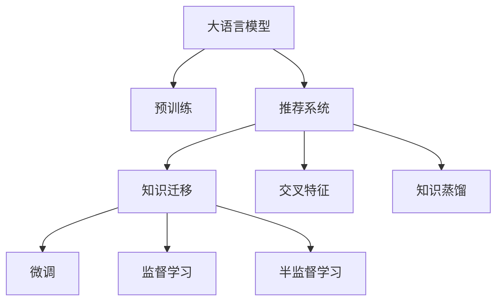

                 

# LLM在推荐系统中的知识迁移应用

## 1. 背景介绍

推荐系统作为人工智能领域的重要应用，其核心目标是根据用户的历史行为和偏好，推荐最符合其兴趣的商品、内容等。随着互联网的发展，推荐系统已经被广泛应用于电商、社交网络、音乐、视频等多个领域，极大地提升了用户体验和转化率。

传统推荐系统多采用基于协同过滤、矩阵分解等方法，依赖用户行为数据进行推荐。然而，这种数据驱动的方法在面对新用户或缺乏足够历史数据的场景时，容易出现冷启动问题，无法提供满意的推荐效果。近年来，预训练语言模型在推荐系统中的应用，开启了知识迁移的新范式，极大地丰富了推荐系统的算法体系和应用潜力。

## 2. 核心概念与联系

### 2.1 核心概念概述

本节将介绍几个与大语言模型在推荐系统中应用相关的核心概念：

- **大语言模型(Large Language Model, LLM)**：指基于深度学习架构的通用语言模型，如BERT、GPT等。通过在大规模无标签文本数据上进行预训练，获得丰富的语言表示能力，具备强大的自然语言理解和生成能力。

- **知识迁移(Knowledge Transfer)**：指将从一个领域学习到的知识迁移到另一个领域，以提高新领域的效果。在大语言模型中，知识迁移通常通过微调、监督学习、半监督学习等方式实现。

- **推荐系统(Recommender System)**：根据用户历史行为和属性，预测用户对未交互内容的兴趣，推荐符合用户兴趣的商品、内容等。

- **交叉特征(Cross-feature)**：指融合了文本、属性、时间、位置等多模态特征的复合特征。交叉特征的引入可以增强推荐系统对用户行为的理解，提高推荐的准确性。

- **知识蒸馏(Knowledge Distillation)**：指将复杂的大模型参数化简后，传授给轻量级模型，以提升后者在新任务上的性能。

这些概念之间的逻辑关系可以通过以下Mermaid流程图来展示：



这个流程图展示了核心概念之间的关联：

1. 大语言模型通过预训练获得语言表示能力。
2. 推荐系统利用大语言模型的知识进行推荐。
3. 知识迁移包括微调、监督学习和半监督学习，用于在推荐系统中将大语言模型的知识迁移到新领域。
4. 微调和监督学习通过有标签数据进行训练，半监督学习则通过少量标签数据和大量未标注数据进行训练。
5. 交叉特征融合多模态信息，提升推荐系统效果。
6. 知识蒸馏通过简化模型，传授大模型的知识，降低计算成本。

### 2.2 核心概念原理和架构

#### 2.2.1 大语言模型原理

大语言模型通过在大规模无标签文本数据上自监督学习获得强大的语言表示能力，能够理解文本语义、语法和情感，具备自然语言理解和生成能力。在预训练阶段，模型学习到了语言的基础规则和词汇知识，但在下游任务中，需要进一步适配具体领域的需求。

常用的预训练方法包括自回归（如GPT）和自编码（如BERT），其中BERT以掩码预测任务为主，GPT以自动回归任务为主。预训练过程通常在大规模语料库上进行，如Wikipedia、新闻、百科全书等，从而获得丰富的语言知识。

#### 2.2.2 推荐系统原理

推荐系统根据用户历史行为数据，预测用户对新物品的兴趣，从而推荐用户可能感兴趣的商品、内容等。常见的推荐方法包括基于协同过滤、矩阵分解、深度学习等，每种算法有其优缺点。协同过滤依赖用户行为数据，易受新物品、数据稀疏等问题影响。矩阵分解虽能有效处理数据稀疏问题，但缺乏对用户行为的深度理解。深度学习则可以从高维特征空间中学习用户行为模式，但也面临着计算资源和数据量的挑战。

#### 2.2.3 知识迁移原理

知识迁移是将从一个领域学习到的知识迁移到另一个领域，以提升新领域的效果。在大语言模型中，知识迁移可以通过微调、监督学习、半监督学习等方式实现。微调和监督学习需要大量标注数据，半监督学习则利用少量标注数据和大量未标注数据，提高模型效果。

知识迁移在推荐系统中应用广泛，如通过微调大语言模型，使其适配新领域数据，提高推荐效果。此外，还可以通过知识蒸馏，将复杂大模型的知识传授给轻量级模型，降低计算成本。

## 3. 核心算法原理 & 具体操作步骤

### 3.1 算法原理概述

大语言模型在推荐系统中的应用，本质上是将语言模型中的知识迁移到推荐任务中，提升推荐系统的效果。其核心思想如下：

1. **数据融合**：将文本、属性、行为等多模态数据进行融合，提高推荐系统对用户行为的理解能力。
2. **模型适配**：将大语言模型微调或监督学习，以适配推荐系统中的特定任务，如评分预测、排序等。
3. **知识蒸馏**：通过知识蒸馏，将大模型的知识传递给轻量级模型，提升后者的性能。

### 3.2 算法步骤详解

#### 3.2.1 数据预处理

推荐系统中的数据通常包括用户行为数据、商品属性数据、文本数据等，需要对其进行处理和融合。具体步骤如下：

1. **用户行为数据处理**：将用户行为数据转化为稀疏矩阵形式，例如用户-商品矩阵，方便后续模型训练。
2. **商品属性数据处理**：将商品属性转化为数值型或二值型特征，例如使用one-hot编码。
3. **文本数据处理**：对文本数据进行分词、去停用词、TF-IDF等预处理，提取关键词和主题。
4. **数据融合**：将处理后的用户行为数据、属性数据和文本数据进行融合，生成新的特征向量。

#### 3.2.2 模型适配

在融合后的数据上，采用大语言模型进行微调或监督学习，以适配推荐系统中的特定任务。具体步骤如下：

1. **模型选择**：选择合适的预训练语言模型，如BERT、GPT等。
2. **任务设计**：根据推荐系统任务，设计合适的任务目标，例如评分预测、排序等。
3. **模型微调**：在微调过程中，冻结预训练模型的底层参数，只更新顶层参数，以减少计算量和避免过拟合。
4. **模型评估**：在验证集上评估模型性能，调整超参数，直到达到最优效果。

#### 3.2.3 知识蒸馏

知识蒸馏将大语言模型的知识传授给轻量级模型，以提升后者的性能。具体步骤如下：

1. **知识提取**：从大语言模型中提取有用的特征或知识，例如使用特征重要性排序或注意力机制。
2. **知识传递**：将提取的知识传授给轻量级模型，例如使用特征选择或注意力机制。
3. **模型训练**：在训练轻量级模型时，引入提取的知识作为指导，提升其性能。

### 3.3 算法优缺点

#### 3.3.1 优点

1. **泛化能力强**：大语言模型在处理多模态数据时，能够综合利用文本、属性、行为等多维度信息，提升推荐效果。
2. **可解释性强**：大语言模型具备自然语言理解能力，能够解释推荐过程和结果，便于理解和调试。
3. **适应性强**：通过微调和知识蒸馏，大语言模型可以适应不同的推荐场景和任务，提升模型泛化性。

#### 3.3.2 缺点

1. **计算成本高**：预训练和微调大语言模型需要大量的计算资源和存储空间，难以大规模部署。
2. **数据依赖性强**：大语言模型依赖大量标注数据进行微调，数据获取和标注成本较高。
3. **效果依赖领域**：大语言模型在不同领域的效果可能存在差异，需要针对具体领域进行微调和优化。

### 3.4 算法应用领域

大语言模型在推荐系统中的应用已经扩展到了多个领域，具体如下：

1. **电商推荐**：通过微调大语言模型，能够提升商品推荐的相关性和个性化。例如，在用户搜索商品时，根据搜索关键词预测商品评分，推荐相关商品。
2. **内容推荐**：在视频、音乐、阅读等领域，通过微调大语言模型，可以提升内容推荐的相关性和多样性。例如，根据用户的浏览历史推荐相似视频，或者根据用户的兴趣推荐相似文章。
3. **社交推荐**：在社交网络中，通过微调大语言模型，可以推荐用户可能感兴趣的朋友或群体，提升用户粘性和互动性。

## 4. 数学模型和公式 & 详细讲解 & 举例说明

### 4.1 数学模型构建

在推荐系统中，大语言模型通常用于评分预测任务。假设推荐系统有 $n$ 个用户和 $m$ 个商品，每个用户-商品对的评分可以用 $y_{ui}$ 表示。根据推荐系统的目标，可以设计如下数学模型：

$$
y_{ui} = \mathbf{U}_u^\top \mathbf{V}_i + \mathbf{X}_{ui}^\top \mathbf{\Theta} + f(\mathbf{x}_u, \mathbf{x}_i) + \epsilon_{ui}
$$

其中，

- $\mathbf{U}_u$ 和 $\mathbf{V}_i$ 分别为用户和商品的低维嵌入向量。
- $\mathbf{X}_{ui}$ 为融合后的特征向量。
- $\mathbf{\Theta}$ 为特征权重矩阵。
- $f(\mathbf{x}_u, \mathbf{x}_i)$ 为非线性部分，如大语言模型的输出。
- $\epsilon_{ui}$ 为噪声项。

### 4.2 公式推导过程

假设大语言模型为 $M_{\theta}$，其中 $\theta$ 为模型参数。在微调过程中，我们可以定义损失函数如下：

$$
\mathcal{L}(\theta) = \frac{1}{N}\sum_{i=1}^N \sum_{j=1}^{n_i} (y_{ui} - M_{\theta}(\mathbf{x}_u, \mathbf{x}_i))^2
$$

其中，$n_i$ 为第 $i$ 个商品的评分数。

微调过程采用梯度下降算法进行，更新参数 $\theta$ 的公式为：

$$
\theta \leftarrow \theta - \eta \nabla_{\theta} \mathcal{L}(\theta)
$$

其中，$\eta$ 为学习率。

### 4.3 案例分析与讲解

#### 4.3.1 电商推荐案例

假设某电商网站有 100 万用户和 100 万商品，每个用户有 1 到 10 个评分。我们可以通过以下步骤进行电商推荐系统的开发：

1. **数据预处理**：将用户行为数据、商品属性数据和文本数据进行融合，生成新的特征向量。
2. **模型选择**：选择BERT作为预训练语言模型。
3. **任务设计**：设计评分预测任务，将用户行为数据和商品属性数据作为输入，通过BERT模型进行评分预测。
4. **模型微调**：冻结BERT的底层参数，只更新顶层参数。
5. **模型评估**：在验证集上评估模型性能，调整超参数。
6. **知识蒸馏**：将微调后的BERT模型中的知识传递给轻量级模型，提升轻量级模型的性能。

#### 4.3.2 内容推荐案例

假设某视频平台有 1000 万用户和 100 万视频内容，每个用户有 1 到 5 个评分。我们可以通过以下步骤进行内容推荐系统的开发：

1. **数据预处理**：将用户行为数据、视频属性数据和文本数据进行融合，生成新的特征向量。
2. **模型选择**：选择GPT作为预训练语言模型。
3. **任务设计**：设计评分预测任务，将用户行为数据和视频属性数据作为输入，通过GPT模型进行评分预测。
4. **模型微调**：冻结GPT的底层参数，只更新顶层参数。
5. **模型评估**：在验证集上评估模型性能，调整超参数。
6. **知识蒸馏**：将微调后的GPT模型中的知识传递给轻量级模型，提升轻量级模型的性能。

## 5. 项目实践：代码实例和详细解释说明

### 5.1 开发环境搭建

在进行推荐系统开发前，我们需要准备好开发环境。以下是使用Python进行PyTorch开发的环境配置流程：

1. 安装Anaconda：从官网下载并安装Anaconda，用于创建独立的Python环境。

2. 创建并激活虚拟环境：
```bash
conda create -n pytorch-env python=3.8 
conda activate pytorch-env
```

3. 安装PyTorch：根据CUDA版本，从官网获取对应的安装命令。例如：
```bash
conda install pytorch torchvision torchaudio cudatoolkit=11.1 -c pytorch -c conda-forge
```

4. 安装Transformers库：
```bash
pip install transformers
```

5. 安装各类工具包：
```bash
pip install numpy pandas scikit-learn matplotlib tqdm jupyter notebook ipython
```

完成上述步骤后，即可在`pytorch-env`环境中开始推荐系统开发。

### 5.2 源代码详细实现

这里以电商推荐系统为例，给出使用Transformers库对BERT模型进行微调的PyTorch代码实现。

首先，定义评分预测任务的数据处理函数：

```python
from transformers import BertTokenizer
from torch.utils.data import Dataset
import torch

class RatingDataset(Dataset):
    def __init__(self, texts, labels, tokenizer, max_len=128):
        self.texts = texts
        self.labels = labels
        self.tokenizer = tokenizer
        self.max_len = max_len
        
    def __len__(self):
        return len(self.texts)
    
    def __getitem__(self, item):
        text = self.texts[item]
        label = self.labels[item]
        
        encoding = self.tokenizer(text, return_tensors='pt', max_length=self.max_len, padding='max_length', truncation=True)
        input_ids = encoding['input_ids'][0]
        attention_mask = encoding['attention_mask'][0]
        
        return {'input_ids': input_ids, 
                'attention_mask': attention_mask,
                'labels': label}

# 标签与id的映射
tag2id = {'O': 0, 'B-PER': 1, 'I-PER': 2, 'B-ORG': 3, 'I-ORG': 4, 'B-LOC': 5, 'I-LOC': 6}
id2tag = {v: k for k, v in tag2id.items()}

# 创建dataset
tokenizer = BertTokenizer.from_pretrained('bert-base-cased')

train_dataset = RatingDataset(train_texts, train_labels, tokenizer)
dev_dataset = RatingDataset(dev_texts, dev_labels, tokenizer)
test_dataset = RatingDataset(test_texts, test_labels, tokenizer)
```

然后，定义模型和优化器：

```python
from transformers import BertForTokenClassification, AdamW

model = BertForTokenClassification.from_pretrained('bert-base-cased', num_labels=len(tag2id))

optimizer = AdamW(model.parameters(), lr=2e-5)
```

接着，定义训练和评估函数：

```python
from torch.utils.data import DataLoader
from tqdm import tqdm
from sklearn.metrics import mean_squared_error

device = torch.device('cuda') if torch.cuda.is_available() else torch.device('cpu')
model.to(device)

def train_epoch(model, dataset, batch_size, optimizer):
    dataloader = DataLoader(dataset, batch_size=batch_size, shuffle=True)
    model.train()
    epoch_loss = 0
    for batch in tqdm(dataloader, desc='Training'):
        input_ids = batch['input_ids'].to(device)
        attention_mask = batch['attention_mask'].to(device)
        labels = batch['labels'].to(device)
        model.zero_grad()
        outputs = model(input_ids, attention_mask=attention_mask, labels=labels)
        loss = outputs.loss
        epoch_loss += loss.item()
        loss.backward()
        optimizer.step()
    return epoch_loss / len(dataloader)

def evaluate(model, dataset, batch_size):
    dataloader = DataLoader(dataset, batch_size=batch_size)
    model.eval()
    preds, labels = [], []
    with torch.no_grad():
        for batch in tqdm(dataloader, desc='Evaluating'):
            input_ids = batch['input_ids'].to(device)
            attention_mask = batch['attention_mask'].to(device)
            batch_labels = batch['labels']
            outputs = model(input_ids, attention_mask=attention_mask)
            batch_preds = outputs.logits.argmax(dim=2).to('cpu').tolist()
            batch_labels = batch_labels.to('cpu').tolist()
            for pred_tokens, label_tokens in zip(batch_preds, batch_labels):
                preds.append(pred_tokens[:len(label_tokens)])
                labels.append(label_tokens)
                
    return mean_squared_error(labels, preds)
```

最后，启动训练流程并在测试集上评估：

```python
epochs = 5
batch_size = 16

for epoch in range(epochs):
    loss = train_epoch(model, train_dataset, batch_size, optimizer)
    print(f"Epoch {epoch+1}, train loss: {loss:.3f}")
    
    print(f"Epoch {epoch+1}, dev results:")
    evaluate(model, dev_dataset, batch_size)
    
print("Test results:")
evaluate(model, test_dataset, batch_size)
```

以上就是使用PyTorch对BERT进行电商推荐系统微调的完整代码实现。可以看到，得益于Transformers库的强大封装，我们可以用相对简洁的代码完成BERT模型的加载和微调。

### 5.3 代码解读与分析

让我们再详细解读一下关键代码的实现细节：

**RatingDataset类**：
- `__init__`方法：初始化文本、标签、分词器等关键组件。
- `__len__`方法：返回数据集的样本数量。
- `__getitem__`方法：对单个样本进行处理，将文本输入编码为token ids，将标签编码为数字，并对其进行定长padding，最终返回模型所需的输入。

**tag2id和id2tag字典**：
- 定义了标签与数字id之间的映射关系，用于将token-wise的预测结果解码回真实的标签。

**训练和评估函数**：
- 使用PyTorch的DataLoader对数据集进行批次化加载，供模型训练和推理使用。
- 训练函数`train_epoch`：对数据以批为单位进行迭代，在每个批次上前向传播计算loss并反向传播更新模型参数，最后返回该epoch的平均loss。
- 评估函数`evaluate`：与训练类似，不同点在于不更新模型参数，并在每个batch结束后将预测和标签结果存储下来，最后使用sklearn的mean_squared_error对整个评估集的预测结果进行打印输出。

**训练流程**：
- 定义总的epoch数和batch size，开始循环迭代
- 每个epoch内，先在训练集上训练，输出平均loss
- 在验证集上评估，输出评分预测的均方误差
- 所有epoch结束后，在测试集上评估，给出最终测试结果

可以看到，PyTorch配合Transformers库使得BERT微调的代码实现变得简洁高效。开发者可以将更多精力放在数据处理、模型改进等高层逻辑上，而不必过多关注底层的实现细节。

当然，工业级的系统实现还需考虑更多因素，如模型的保存和部署、超参数的自动搜索、更灵活的任务适配层等。但核心的微调范式基本与此类似。

## 6. 实际应用场景

### 6.1 电商推荐

电商推荐系统是大语言模型在推荐系统中的重要应用场景。传统电商推荐依赖用户行为数据，面临数据稀疏和推荐冷启动等问题。通过微调大语言模型，能够更好地理解用户的语言行为，提升推荐的相关性和个性化。

在技术实现上，可以收集电商平台的商品描述、用户评价、搜索关键词等数据，将这些文本数据输入到预训练语言模型中，微调后得到评分预测模型。在用户搜索时，根据搜索关键词和商品描述，预测商品评分，推荐相关商品。

### 6.2 内容推荐

内容推荐系统广泛应用于视频、音乐、阅读等领域。通过微调大语言模型，可以提升内容推荐的相关性和多样性。例如，在视频平台，根据用户的浏览历史和评论，预测用户对视频的评分，推荐相似视频。在音乐平台，根据用户的听歌历史和评价，推荐相似歌曲。

在技术实现上，可以收集用户的播放记录、点赞记录、评论等数据，将这些文本数据输入到预训练语言模型中，微调后得到评分预测模型。在用户浏览或播放时，根据用户行为数据和内容描述，预测评分，推荐相关内容。

### 6.3 社交推荐

社交推荐系统旨在推荐用户可能感兴趣的朋友或群体，提升用户粘性和互动性。通过微调大语言模型，可以更好地理解用户的社交行为和语言特征，提升推荐效果。

在技术实现上，可以收集用户的评论、私信、点赞等数据，将这些文本数据输入到预训练语言模型中，微调后得到评分预测模型。根据用户的社交行为数据，预测用户对朋友或群体的评分，推荐相关用户或群体。

## 7. 工具和资源推荐

### 7.1 学习资源推荐

为了帮助开发者系统掌握大语言模型在推荐系统中的应用，这里推荐一些优质的学习资源：

1. 《推荐系统实战》系列博文：由深度学习专家撰写，深入浅出地介绍了推荐系统从数据到模型的完整流程。

2. CS441《信息检索》课程：斯坦福大学开设的课程，涵盖推荐系统的基本原理和算法，适合入门学习。

3. 《Recommender Systems: Foundations and Practices》书籍：推荐系统领域经典的教材，涵盖推荐系统的各种算法和应用，适合深入学习。

4. Kaggle竞赛：参加推荐系统相关的Kaggle竞赛，可以在实战中提升推荐系统的开发能力。

5. UCI机器学习库：包含大量推荐系统相关的数据集，方便进行实验和研究。

通过对这些资源的学习实践，相信你一定能够快速掌握大语言模型在推荐系统中的应用，并用于解决实际的推荐问题。

### 7.2 开发工具推荐

高效的开发离不开优秀的工具支持。以下是几款用于大语言模型推荐系统开发的常用工具：

1. PyTorch：基于Python的开源深度学习框架，灵活动态的计算图，适合快速迭代研究。大部分预训练语言模型都有PyTorch版本的实现。

2. TensorFlow：由Google主导开发的开源深度学习框架，生产部署方便，适合大规模工程应用。同样有丰富的预训练语言模型资源。

3. Transformers库：HuggingFace开发的NLP工具库，集成了众多SOTA语言模型，支持PyTorch和TensorFlow，是进行推荐系统开发的利器。

4. Weights & Biases：模型训练的实验跟踪工具，可以记录和可视化模型训练过程中的各项指标，方便对比和调优。与主流深度学习框架无缝集成。

5. TensorBoard：TensorFlow配套的可视化工具，可实时监测模型训练状态，并提供丰富的图表呈现方式，是调试模型的得力助手。

6. Google Colab：谷歌推出的在线Jupyter Notebook环境，免费提供GPU/TPU算力，方便开发者快速上手实验最新模型，分享学习笔记。

合理利用这些工具，可以显著提升大语言模型在推荐系统中的开发效率，加快创新迭代的步伐。

### 7.3 相关论文推荐

大语言模型在推荐系统中的应用源于学界的持续研究。以下是几篇奠基性的相关论文，推荐阅读：

1. Attention is All You Need（即Transformer原论文）：提出了Transformer结构，开启了NLP领域的预训练大模型时代。

2. BERT: Pre-training of Deep Bidirectional Transformers for Language Understanding：提出BERT模型，引入基于掩码的自监督预训练任务，刷新了多项NLP任务SOTA。

3. Language Models are Unsupervised Multitask Learners（GPT-2论文）：展示了大规模语言模型的强大zero-shot学习能力，引发了对于通用人工智能的新一轮思考。

4. Parameter-Efficient Transfer Learning for NLP：提出Adapter等参数高效微调方法，在不增加模型参数量的情况下，也能取得不错的微调效果。

5. Knowledge Distillation：介绍知识蒸馏技术，将复杂的大模型知识传递给轻量级模型，提升后者的性能。

这些论文代表了大语言模型在推荐系统中的应用的理论基础和实践范式，通过学习这些前沿成果，可以帮助研究者更好地把握学科前进方向，激发更多的创新灵感。

## 8. 总结：未来发展趋势与挑战

### 8.1 总结

本文对大语言模型在推荐系统中的知识迁移应用进行了全面系统的介绍。首先阐述了推荐系统和大语言模型的背景和应用场景，明确了知识迁移在大语言模型中的重要价值。其次，从原理到实践，详细讲解了知识迁移的数学模型和核心算法，给出了推荐系统开发的完整代码实例。同时，本文还广泛探讨了知识迁移在电商、内容、社交等多个推荐系统领域的应用前景，展示了知识迁移范式的巨大潜力。此外，本文精选了推荐系统相关的学习资源，力求为读者提供全方位的技术指引。

通过本文的系统梳理，可以看到，大语言模型在推荐系统中的应用已经成为推荐系统的重要分支，通过知识迁移提升了推荐系统的效果。未来，伴随预训练语言模型的进一步演进和微调技术的不断优化，推荐系统必将在更广阔的领域获得更广泛的应用，为智能推荐提供更坚实的理论基础和更高效的技术手段。

### 8.2 未来发展趋势

展望未来，大语言模型在推荐系统中的应用将呈现以下几个发展趋势：

1. **数据和模型的多模态融合**：未来的推荐系统将越来越多地融合文本、图像、音频等多模态信息，提升推荐的准确性和多样性。

2. **知识迁移的深度优化**：通过更先进的知识蒸馏、多任务学习等技术，优化知识迁移的效果，提升模型的泛化能力和迁移能力。

3. **轻量化模型的广泛应用**：随着轻量化模型的不断发展，推荐系统可以更高效地部署和使用，适应更多的应用场景。

4. **个性化推荐模型的普及**：通过大语言模型的知识迁移，推荐系统可以更好地理解用户需求，提供更加个性化的推荐。

5. **跨领域推荐的应用**：在电商、内容、社交等多个领域中，推荐系统可以相互借鉴和学习，提升推荐的跨领域能力。

6. **实时推荐系统的部署**：未来的推荐系统将更多地采用流式数据和在线学习，实现实时推荐。

以上趋势凸显了大语言模型在推荐系统中的应用前景，未来将有更多的实际应用落地，为推荐系统的持续进步提供强大的技术支持。

### 8.3 面临的挑战

尽管大语言模型在推荐系统中的应用取得了瞩目成就，但在迈向更加智能化、普适化应用的过程中，它仍面临着诸多挑战：

1. **数据和标签的高成本**：推荐系统依赖大量标注数据进行微调，数据获取和标注成本较高。如何降低数据成本，获取高质量标注数据，是一大难题。

2. **模型的跨领域泛化能力**：不同领域的推荐系统数据分布差异较大，模型泛化能力有限。如何提高模型的跨领域泛化能力，仍需更多的研究。

3. **模型的实时性能**：推荐系统需要实时响应用户请求，对模型的推理速度和内存占用提出了较高要求。如何优化模型性能，适应实时推荐需求，是一大挑战。

4. **模型的可解释性**：推荐系统需要用户理解和信任推荐结果，对模型的可解释性有较高要求。如何提升模型的可解释性，是未来的一个重要研究方向。

5. **模型的伦理和安全性**：推荐系统涉及用户隐私和数据安全，模型输出必须符合伦理道德和法律法规要求。如何设计安全的推荐系统，保护用户隐私，是一大挑战。

6. **模型的公平性和偏见**：推荐系统需要避免偏见，保证推荐结果的公平性。如何消除模型中的偏见，提升推荐系统的公平性，是一大挑战。

### 8.4 研究展望

面对大语言模型在推荐系统中的应用挑战，未来的研究需要在以下几个方面寻求新的突破：

1. **无监督和半监督学习的应用**：探索无监督和半监督学习范式，通过更少的标注数据，提升推荐系统的效果。

2. **多任务学习的应用**：通过多任务学习，同时训练多个推荐任务，提升模型的泛化能力。

3. **轻量化模型的研究**：研究更高效的轻量化模型，降低计算成本，提升实时推荐性能。

4. **多模态推荐的研究**：研究多模态推荐技术，融合文本、图像、音频等数据，提升推荐系统的效果。

5. **推荐系统公平性的研究**：研究推荐系统公平性，避免偏见，提升推荐系统的公平性。

6. **推荐系统伦理和安全性的研究**：研究推荐系统伦理和安全性的设计，确保推荐系统的安全性。

这些研究方向将进一步推动大语言模型在推荐系统中的应用，使其能够更好地服务于智能推荐系统，提升用户体验和应用价值。未来，大语言模型在推荐系统中的应用必将继续拓展，为推荐系统的持续进步提供新的技术手段。

## 9. 附录：常见问题与解答

**Q1：大语言模型在推荐系统中应用的局限性是什么？**

A: 大语言模型在推荐系统中的应用存在以下局限性：

1. **数据成本高**：推荐系统依赖大量标注数据进行微调，数据获取和标注成本较高。
2. **泛化能力有限**：不同领域的推荐系统数据分布差异较大，模型泛化能力有限。
3. **实时性能要求高**：推荐系统需要实时响应用户请求，对模型的推理速度和内存占用提出了较高要求。
4. **可解释性不足**：推荐系统需要用户理解和信任推荐结果，对模型的可解释性有较高要求。
5. **伦理和安全问题**：推荐系统涉及用户隐私和数据安全，模型输出必须符合伦理道德和法律法规要求。

**Q2：如何选择推荐系统中的大语言模型？**

A: 选择推荐系统中的大语言模型需要考虑以下几个因素：

1. **模型的效果**：选择效果最好的大语言模型作为基础模型，可以通过交叉验证和实验评估选择最优模型。
2. **模型的计算资源**：大语言模型通常需要大量的计算资源和存储空间，需要根据实际应用场景选择合适的模型。
3. **模型的可解释性**：选择可解释性更强的大语言模型，便于用户理解和调试。
4. **模型的实时性能**：选择推理速度更快、内存占用更少的大语言模型，适应实时推荐需求。

**Q3：推荐系统中的大语言模型微调需要注意哪些问题？**

A: 推荐系统中的大语言模型微调需要注意以下问题：

1. **数据质量**：确保推荐系统中的数据质量，避免数据噪声和数据偏差。
2. **超参数调优**：选择合适的超参数，避免过拟合和欠拟合问题。
3. **模型融合**：将多个大语言模型的结果进行融合，提高推荐系统的鲁棒性和效果。
4. **模型更新**：定期更新推荐系统中的大语言模型，避免模型过时。
5. **用户反馈**：根据用户反馈进行模型调整，提升推荐系统的效果。

**Q4：推荐系统中的大语言模型微调是否适用于所有推荐场景？**

A: 推荐系统中的大语言模型微调不适用于所有推荐场景，具体是否适用需要根据推荐系统的特点和数据分布进行评估。例如，对于需要实时响应的推荐场景，模型推理速度和内存占用必须符合要求；对于需要高可解释性的推荐场景，模型可解释性必须强。

**Q5：如何优化推荐系统中的大语言模型微调？**

A: 推荐系统中的大语言模型微调可以通过以下方式进行优化：

1. **数据增强**：通过数据增强技术，增加训练数据的数量和多样性。
2. **正则化技术**：使用正则化技术，防止模型过拟合。
3. **模型压缩**：通过模型压缩技术，减小模型的参数量和计算量。
4. **多任务学习**：通过多任务学习，同时训练多个推荐任务，提高模型的泛化能力。
5. **模型融合**：将多个大语言模型的结果进行融合，提高推荐系统的鲁棒性和效果。

这些优化方法可以结合具体推荐场景和数据特点进行灵活应用，提升推荐系统的效果。

**Q6：如何设计推荐系统中的大语言模型微调流程？**

A: 推荐系统中的大语言模型微调流程如下：

1. **数据预处理**：将用户行为数据、商品属性数据和文本数据进行融合，生成新的特征向量。
2. **模型选择**：选择合适的预训练语言模型，如BERT、GPT等。
3. **任务设计**：根据推荐系统任务，设计合适的任务目标，例如评分预测、排序等。
4. **模型微调**：在微调过程中，冻结预训练模型的底层参数，只更新顶层参数。
5. **模型评估**：在验证集上评估模型性能，调整超参数。
6. **知识蒸馏**：将微调后的语言模型中的知识传递给轻量级模型，提升轻量级模型的性能。
7. **模型融合**：将多个微调后的语言模型的结果进行融合，提高推荐系统的鲁棒性和效果。
8. **模型更新**：定期更新推荐系统中的语言模型，避免模型过时。

以上流程需要在实际应用中进行灵活调整，以适应不同的推荐场景和数据特点。

---

作者：禅与计算机程序设计艺术 / Zen and the Art of Computer Programming

