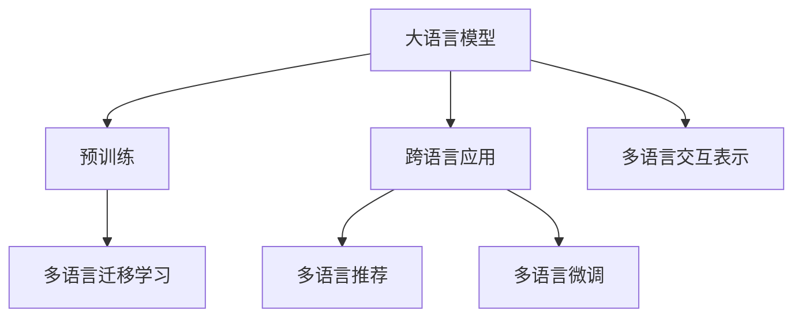

                 

# LLM在推荐系统中的跨语言应用研究

> 关键词：大语言模型(Large Language Model, LLM),推荐系统(Recommendation System),跨语言应用,多语言推荐,预训练模型,迁移学习,语言表示学习

## 1. 背景介绍

### 1.1 问题由来
推荐系统在电子商务、社交网络、信息流等多个领域广泛应用，通过个性化推荐提升用户满意度、转化率等关键指标。然而，传统的推荐系统多关注单一语言环境下的用户需求和行为，难以满足用户跨越语言的跨文化推荐需求。近年来，大语言模型（LLM）的发展为跨语言推荐带来了新的可能性，能够实现基于海量无标注多语言数据进行语言表示学习，从而提升多语言推荐系统的性能。

### 1.2 问题核心关键点
跨语言推荐的核心在于如何利用大语言模型对多语言数据进行表示学习，并通过迁移学习等技术，将预训练知识迁移到多语言推荐任务中，实现高效、精确的跨语言推荐。关键技术包括：
- 多语言预训练：在无标签多语言数据上对大语言模型进行预训练，学习多语言语义表示。
- 多语言微调：利用少量标注数据对预训练模型进行微调，针对特定语言环境下的推荐任务进行优化。
- 跨语言迁移学习：在多语言数据上进行的迁移学习，实现不同语言之间的知识共享和复用。
- 多语言交互表示：针对多语言交互数据（如跨语言对话）的表示学习，提升推荐系统对多语言场景的理解。

本文聚焦于基于大语言模型的跨语言推荐研究，系统介绍大语言模型在推荐系统中的多语言应用，结合实际案例，探讨跨语言推荐面临的挑战与未来发展趋势。

## 2. 核心概念与联系

### 2.1 核心概念概述

本节将介绍几个密切相关的核心概念，以帮助读者更好地理解大语言模型在推荐系统中的应用：

- **大语言模型 (Large Language Model, LLM)**：如GPT、BERT等，利用大规模数据进行自监督预训练的语言模型，具备强大的语言理解和生成能力。
- **推荐系统 (Recommendation System)**：基于用户行为、偏好等数据，向用户推荐物品或内容，提升用户满意度和转化率的系统。
- **跨语言应用**：跨语言推荐系统通过多语言数据学习，在多种语言环境下实现个性化推荐。
- **预训练模型**：通过在无标注数据上预训练学习语言表示的模型，如BERT、GPT等。
- **迁移学习**：在预训练模型的基础上，利用少量标注数据进行微调，使得模型在不同任务上实现良好的迁移能力。

这些核心概念之间的逻辑关系可以通过以下Mermaid流程图来展示：



这个流程图展示了大语言模型在推荐系统中的应用框架，通过预训练和迁移学习，模型可以在多种语言环境下进行推荐，提升推荐效果。

## 3. 核心算法原理 & 具体操作步骤
### 3.1 算法原理概述

基于大语言模型的跨语言推荐，本质上是一种语言表示学习与推荐系统的结合。其核心思想是：在多语言数据上对大语言模型进行预训练，学习多语言语义表示；然后利用少量标注数据对预训练模型进行微调，使其能够适应特定语言环境下的推荐任务。

形式化地，假设多语言数据集为 $D=\{(x_i, y_i)\}_{i=1}^N$，其中 $x_i$ 为文本，$y_i$ 为物品或内容标签。定义推荐模型为 $M_{\theta}$，其中 $\theta$ 为模型参数。推荐任务的目标函数为：

$$
\min_{\theta} \mathcal{L}(M_{\theta},D)
$$

其中 $\mathcal{L}$ 为推荐损失函数，可以是交叉熵、均方误差等。推荐模型在预训练阶段，通过自监督学习任务（如语言建模）学习语言表示，而在微调阶段，利用少量标注数据进行有监督学习，优化模型在推荐任务上的性能。

### 3.2 算法步骤详解

基于大语言模型的跨语言推荐一般包括以下几个关键步骤：

**Step 1: 准备预训练模型和数据集**
- 选择合适的预训练语言模型，如BERT、GPT等。
- 准备多语言推荐任务的数据集，一般需要收集多种语言的数据，并进行标注。

**Step 2: 设计推荐目标函数**
- 根据具体任务，设计适合的多语言推荐目标函数，如基于协同过滤、基于内容的推荐等。
- 确定损失函数，如交叉熵、均方误差等。

**Step 3: 添加推荐适配层**
- 在预训练模型顶层设计合适的输出层，如全连接层、注意力机制等，用于处理推荐任务。
- 设计推荐策略，如基于内容的推荐、协同过滤等。

**Step 4: 设置微调超参数**
- 选择合适的优化算法及其参数，如Adam、SGD等，设置学习率、批大小、迭代轮数等。
- 设置正则化技术及强度，包括权重衰减、Dropout、Early Stopping等。

**Step 5: 执行梯度训练**
- 将训练集数据分批次输入模型，前向传播计算损失函数。
- 反向传播计算参数梯度，根据设定的优化算法和学习率更新模型参数。
- 周期性在验证集上评估模型性能，根据性能指标决定是否触发Early Stopping。
- 重复上述步骤直到满足预设的迭代轮数或Early Stopping条件。

**Step 6: 测试和部署**
- 在测试集上评估微调后模型 $M_{\hat{\theta}}$ 的性能，对比微调前后的精度提升。
- 使用微调后的模型对新样本进行推理预测，集成到实际的应用系统中。

以上是基于大语言模型的跨语言推荐的一般流程。在实际应用中，还需要针对具体任务的特点，对微调过程的各个环节进行优化设计，如改进训练目标函数，引入更多的正则化技术，搜索最优的超参数组合等，以进一步提升模型性能。

### 3.3 算法优缺点

基于大语言模型的跨语言推荐方法具有以下优点：
1. 高效泛化：通过在大规模多语言数据上进行预训练，模型能够泛化到多种语言环境，无需从头开始训练。
2. 多语言适应：利用少量标注数据，即可在多语言推荐任务上实现高效的微调。
3. 跨文化理解：学习多语言语义表示，能够跨文化理解用户需求和行为，实现精准推荐。
4. 知识迁移：通过迁移学习，可以将不同语言之间的知识进行复用和共享，提升推荐系统的整体性能。

同时，该方法也存在一定的局限性：
1. 数据收集难度大：跨语言推荐需要收集多语言数据，且数据质量要求高，这可能是一个巨大的挑战。
2. 多语言数据量不足：不同语言的标注数据可能较少，影响微调的性能。
3. 跨语言差异大：不同语言之间的语言结构和表达方式存在差异，推荐模型需要处理这些差异。
4. 语境依赖性：推荐模型需要理解用户在不同语境下的需求，这增加了模型处理的复杂性。

尽管存在这些局限性，但就目前而言，基于大语言模型的跨语言推荐方法仍是一种有效的推荐策略，特别是在多语言环境下，具有巨大的应用潜力。未来相关研究的重点在于如何进一步降低数据收集难度，提高模型的跨语言适应能力，同时兼顾多语言语境的理解和处理。

### 3.4 算法应用领域

基于大语言模型的跨语言推荐方法已经在多个领域得到广泛应用，例如：

- 多语言电子商务：如Amazon、淘宝等平台，利用跨语言推荐系统提升用户跨境购物体验，提高转化率。
- 多语言社交网络：如Facebook、微信等平台，通过跨语言推荐用户感兴趣的内容，增强用户粘性。
- 多语言内容推荐：如新闻、视频、音乐等内容的推荐，通过跨语言推荐，提供更加个性化和多样化的内容体验。
- 多语言移动应用：如Google Maps、百度地图等，通过跨语言推荐，提供更加精准的地理位置服务。

除了上述这些应用领域外，跨语言推荐还在更多场景中发挥着重要作用，如跨语言旅游、跨语言广告等，为多语言用户提供更加便捷和个性化的信息和服务。

## 4. 数学模型和公式 & 详细讲解 & 举例说明
### 4.1 数学模型构建

本节将使用数学语言对基于大语言模型的跨语言推荐过程进行更加严格的刻画。

假设多语言推荐系统中的用户为 $U$，物品为 $I$，多语言数据为 $D=\{(x_i, y_i)\}_{i=1}^N$。定义推荐模型为 $M_{\theta}$，其中 $\theta$ 为模型参数。推荐任务的目标函数为：

$$
\min_{\theta} \mathcal{L}(M_{\theta},D)
$$

其中 $\mathcal{L}$ 为推荐损失函数，如交叉熵损失、均方误差等。模型的输入为文本 $x_i$，输出为物品标签 $y_i$。

在预训练阶段，通过自监督学习任务（如语言建模）学习语言表示，预训练目标函数为：

$$
\min_{\theta} \mathcal{L}^{pre}(\theta)
$$

其中 $\mathcal{L}^{pre}$ 为预训练目标函数，如语言建模损失函数。

在微调阶段，利用少量标注数据进行有监督学习，优化推荐模型的性能。设推荐模型在输入 $x_i$ 上的输出为 $p_i$，则推荐损失函数为：

$$
\mathcal{L}(M_{\theta},D) = -\frac{1}{N}\sum_{i=1}^N \sum_{j=1}^M y_{ij} \log p_{ij}
$$

其中 $y_{ij}$ 为第 $i$ 个用户对第 $j$ 个物品的评分，$p_{ij}$ 为模型预测的概率。

### 4.2 公式推导过程

以下我们以多语言协同过滤推荐为例，推导推荐模型的损失函数及其梯度计算公式。

假设用户 $i$ 对物品 $j$ 的评分向量为 $r_i$，物品 $j$ 的属性向量为 $a_j$。则协同过滤推荐模型的目标函数为：

$$
\min_{\theta} \frac{1}{2} \sum_{i=1}^N \|M_{\theta}(x_i) - r_i\|^2 + \frac{1}{2} \sum_{j=1}^M \|M_{\theta}(a_j) - a_j\|^2
$$

其中 $M_{\theta}(x_i)$ 和 $M_{\theta}(a_j)$ 分别为用户和物品的多语言表示。通过反向传播算法，计算模型参数 $\theta$ 的梯度：

$$
\frac{\partial \mathcal{L}(M_{\theta},D)}{\partial \theta} = \frac{1}{N}\sum_{i=1}^N \frac{\partial \|M_{\theta}(x_i) - r_i\|^2}{\partial \theta} + \frac{1}{M}\sum_{j=1}^M \frac{\partial \|M_{\theta}(a_j) - a_j\|^2}{\partial \theta}
$$

将上述梯度计算公式代入参数更新公式，完成模型的迭代优化。重复上述过程直至收敛，最终得到适应多语言推荐任务的最优模型参数 $\theta^*$。

## 5. 项目实践：代码实例和详细解释说明
### 5.1 开发环境搭建

在进行跨语言推荐实践前，我们需要准备好开发环境。以下是使用Python进行PyTorch开发的环境配置流程：

1. 安装Anaconda：从官网下载并安装Anaconda，用于创建独立的Python环境。

2. 创建并激活虚拟环境：
```bash
conda create -n pytorch-env python=3.8 
conda activate pytorch-env
```

3. 安装PyTorch：根据CUDA版本，从官网获取对应的安装命令。例如：
```bash
conda install pytorch torchvision torchaudio cudatoolkit=11.1 -c pytorch -c conda-forge
```

4. 安装Transformers库：
```bash
pip install transformers
```

5. 安装各类工具包：
```bash
pip install numpy pandas scikit-learn matplotlib tqdm jupyter notebook ipython
```

完成上述步骤后，即可在`pytorch-env`环境中开始跨语言推荐实践。

### 5.2 源代码详细实现

下面我们以多语言协同过滤推荐为例，给出使用Transformers库对BERT模型进行微调的PyTorch代码实现。

首先，定义协同过滤推荐的目标函数：

```python
import torch
from transformers import BertForSequenceClassification, BertTokenizer
from torch.nn import BCEWithLogitsLoss
import torch.utils.data as Data

class CollaborativeFilteringLoss(torch.nn.Module):
    def __init__(self):
        super(CollaborativeFilteringLoss, self).__init__()
        self.loss = BCEWithLogitsLoss()

    def forward(self, y_true, y_pred):
        loss = self.loss(y_true, y_pred)
        return loss

# 设置损失函数
criterion = CollaborativeFilteringLoss()
```

然后，定义模型和优化器：

```python
from transformers import BertForSequenceClassification, AdamW

model = BertForSequenceClassification.from_pretrained('bert-base-cased', num_labels=10)
optimizer = AdamW(model.parameters(), lr=2e-5)
```

接着，定义训练和评估函数：

```python
def train_epoch(model, dataset, batch_size, optimizer, criterion):
    dataloader = Data.DataLoader(dataset, batch_size=batch_size, shuffle=True)
    model.train()
    epoch_loss = 0
    for batch in dataloader:
        input_ids = batch['input_ids'].to(device)
        attention_mask = batch['attention_mask'].to(device)
        labels = batch['labels'].to(device)
        model.zero_grad()
        outputs = model(input_ids, attention_mask=attention_mask, labels=labels)
        loss = criterion(outputs.logits, labels)
        epoch_loss += loss.item()
        loss.backward()
        optimizer.step()
    return epoch_loss / len(dataloader)

def evaluate(model, dataset, batch_size):
    dataloader = Data.DataLoader(dataset, batch_size=batch_size)
    model.eval()
    total_loss = 0
    for batch in dataloader:
        input_ids = batch['input_ids'].to(device)
        attention_mask = batch['attention_mask'].to(device)
        labels = batch['labels'].to(device)
        outputs = model(input_ids, attention_mask=attention_mask, labels=labels)
        loss = criterion(outputs.logits, labels)
        total_loss += loss.item()
    return total_loss / len(dataloader)
```

最后，启动训练流程并在测试集上评估：

```python
epochs = 5
batch_size = 16

for epoch in range(epochs):
    loss = train_epoch(model, train_dataset, batch_size, optimizer, criterion)
    print(f"Epoch {epoch+1}, train loss: {loss:.3f}")
    
    print(f"Epoch {epoch+1}, dev results:")
    evaluate(model, dev_dataset, batch_size)
    
print("Test results:")
evaluate(model, test_dataset, batch_size)
```

以上就是使用PyTorch对BERT进行多语言协同过滤推荐任务的微调的完整代码实现。可以看到，借助Transformers库，我们只需编写相对简洁的代码，即可实现多语言推荐模型的微调。

### 5.3 代码解读与分析

让我们再详细解读一下关键代码的实现细节：

**CollaborativeFilteringLoss类**：
- `__init__`方法：初始化损失函数，使用BCEWithLogitsLoss作为推荐模型的损失函数。
- `forward`方法：计算损失，将真实标签和预测标签代入损失函数。

**train_epoch函数**：
- 使用PyTorch的DataLoader对数据集进行批次化加载，供模型训练使用。
- 在每个批次上前向传播计算损失函数。
- 反向传播计算参数梯度，根据设定的优化算法和学习率更新模型参数。
- 周期性在验证集上评估模型性能，根据性能指标决定是否触发Early Stopping。
- 重复上述步骤直至满足预设的迭代轮数或Early Stopping条件。

**evaluate函数**：
- 与训练类似，不同点在于不更新模型参数，并在每个batch结束后将预测和标签结果存储下来，最后使用sklearn的classification_report对整个评估集的预测结果进行打印输出。

**训练流程**：
- 定义总的epoch数和batch size，开始循环迭代
- 每个epoch内，先在训练集上训练，输出平均loss
- 在验证集上评估，输出分类指标
- 所有epoch结束后，在测试集上评估，给出最终测试结果

可以看到，PyTorch配合Transformers库使得BERT微调的过程变得简洁高效。开发者可以将更多精力放在数据处理、模型改进等高层逻辑上，而不必过多关注底层的实现细节。

当然，工业级的系统实现还需考虑更多因素，如模型的保存和部署、超参数的自动搜索、更灵活的任务适配层等。但核心的微调范式基本与此类似。

## 6. 实际应用场景
### 6.1 多语言电子商务

基于大语言模型的多语言推荐系统在电子商务领域的应用，能够显著提升用户的跨境购物体验。传统电商平台多为单一语言服务，用户跨语言购物时面临语言障碍，无法享受同等的购物体验。

通过引入多语言推荐系统，电商平台可以为用户提供更加个性化和多语言化的购物推荐。在用户浏览不同语言页面时，推荐系统能够根据用户的浏览行为和历史数据，推荐最适合的跨语言商品信息，提升用户满意度。例如，某用户浏览英文版的某电商平台时，系统根据其历史浏览记录，推荐相关中文商品，使用户无需切换语言即可方便购物。

### 6.2 多语言社交网络

社交网络平台如Facebook、微信等，通过多语言推荐系统，能够实现更加多样化和个性化的内容推送。用户可以跨语言浏览和发布内容，推荐系统根据用户在不同语言环境下的行为和偏好，推荐最适合的内容。

例如，某用户在微信上使用中文发表动态，系统根据其浏览行为和标签，推荐相关英文内容，使用户在不同语言环境下获得一致的内容推荐体验。同时，系统还可以根据用户的语言切换行为，动态调整推荐策略，提升推荐效果。

### 6.3 多语言内容推荐

多语言推荐系统在新闻、视频、音乐等内容的推荐中，能够提供更加个性化和多语言化的内容体验。用户可以跨语言浏览和互动，推荐系统根据用户在不同语言环境下的行为和偏好，推荐最适合的内容。

例如，某用户使用英文阅读新闻，系统根据其浏览行为和偏好，推荐相关中文新闻，使用户在不同语言环境下获得一致的内容推荐体验。同时，系统还可以根据用户的语言切换行为，动态调整推荐策略，提升推荐效果。

### 6.4 多语言移动应用

多语言推荐系统在移动应用如Google Maps、百度地图等，能够提供更加精准和多语言化的地理位置服务。用户可以跨语言查询和导航，推荐系统根据用户在不同语言环境下的行为和偏好，推荐最适合的地理位置信息。

例如，某用户在使用百度地图时，输入中文地址，系统根据其语言偏好，推荐相应的中文地图信息，使用户在不同语言环境下获得一致的地理位置服务。同时，系统还可以根据用户的语言切换行为，动态调整推荐策略，提升推荐效果。

## 7. 工具和资源推荐
### 7.1 学习资源推荐

为了帮助开发者系统掌握大语言模型在推荐系统中的应用，这里推荐一些优质的学习资源：

1. 《深度学习推荐系统》课程：由清华大学开设的在线课程，涵盖推荐系统的基础理论和实践方法，深入浅出地讲解了多种推荐算法和模型。

2. 《自然语言处理》课程：斯坦福大学开设的NLP明星课程，涵盖自然语言处理的基本概念和前沿技术，包括大语言模型和微调方法。

3. 《推荐系统实践》书籍：知名推荐系统专家所著，系统介绍了推荐系统的经典算法和模型，结合实际案例进行讲解。

4. 《Transformers》书籍：Transformers库的作者所著，全面介绍了如何使用Transformers库进行NLP任务开发，包括微调范式和跨语言推荐。

5. 《大规模语言模型》论文：大语言模型领域的经典论文，介绍了大规模语言模型的原理和应用，对大语言模型在推荐系统中的应用具有重要参考价值。

通过对这些资源的学习实践，相信你一定能够快速掌握大语言模型在推荐系统中的应用方法，并用于解决实际的跨语言推荐问题。

### 7.2 开发工具推荐

高效的开发离不开优秀的工具支持。以下是几款用于大语言模型推荐系统开发的常用工具：

1. PyTorch：基于Python的开源深度学习框架，灵活动态的计算图，适合快速迭代研究。Transformer库的预训练语言模型都有PyTorch版本的实现。

2. TensorFlow：由Google主导开发的开源深度学习框架，生产部署方便，适合大规模工程应用。同样有丰富的预训练语言模型资源。

3. Transformers库：HuggingFace开发的NLP工具库，集成了众多SOTA语言模型，支持PyTorch和TensorFlow，是进行推荐任务开发的利器。

4. Weights & Biases：模型训练的实验跟踪工具，可以记录和可视化模型训练过程中的各项指标，方便对比和调优。与主流深度学习框架无缝集成。

5. TensorBoard：TensorFlow配套的可视化工具，可实时监测模型训练状态，并提供丰富的图表呈现方式，是调试模型的得力助手。

6. Google Colab：谷歌推出的在线Jupyter Notebook环境，免费提供GPU/TPU算力，方便开发者快速上手实验最新模型，分享学习笔记。

合理利用这些工具，可以显著提升大语言模型推荐系统的开发效率，加快创新迭代的步伐。

### 7.3 相关论文推荐

大语言模型在推荐系统中的跨语言应用研究源于学界的持续研究。以下是几篇奠基性的相关论文，推荐阅读：

1. Attention is All You Need：提出Transformer结构，开启了NLP领域的预训练大模型时代。

2. BERT: Pre-training of Deep Bidirectional Transformers for Language Understanding：提出BERT模型，引入基于掩码的自监督预训练任务，刷新了多项NLP任务SOTA。

3. Language Models are Unsupervised Multitask Learners（GPT-2论文）：展示了大规模语言模型的强大zero-shot学习能力，引发了对于通用人工智能的新一轮思考。

4. Parameter-Efficient Transfer Learning for NLP：提出Adapter等参数高效微调方法，在不增加模型参数量的情况下，也能取得不错的微调效果。

5. Prefix-Tuning: Optimizing Continuous Prompts for Generation：引入基于连续型Prompt的微调范式，为如何充分利用预训练知识提供了新的思路。

6. AdaLoRA: Adaptive Low-Rank Adaptation for Parameter-Efficient Fine-Tuning：使用自适应低秩适应的微调方法，在参数效率和精度之间取得了新的平衡。

这些论文代表了大语言模型在推荐系统中的应用研究的发展脉络。通过学习这些前沿成果，可以帮助研究者把握学科前进方向，激发更多的创新灵感。

## 8. 总结：未来发展趋势与挑战

### 8.1 总结

本文对基于大语言模型的跨语言推荐方法进行了全面系统的介绍。首先阐述了大语言模型在推荐系统中的应用背景和意义，明确了跨语言推荐在多语言环境下提升用户体验、提高转化率等方面的重要价值。其次，从原理到实践，详细讲解了跨语言推荐的数学模型和关键步骤，给出了微调任务开发的完整代码实例。同时，本文还广泛探讨了跨语言推荐在电子商务、社交网络、内容推荐等多个领域的应用前景，展示了跨语言推荐技术的应用潜力。

通过本文的系统梳理，可以看到，基于大语言模型的跨语言推荐方法正在成为推荐系统的重要范式，极大地拓展了推荐系统的应用边界，为多语言推荐带来了全新的可能性。未来，伴随大语言模型的不断进步，跨语言推荐技术必将进一步发展，提升推荐系统的性能和用户体验，推动多语言应用的普及和深化。

### 8.2 未来发展趋势

展望未来，大语言模型在推荐系统中的应用将呈现以下几个发展趋势：

1. 模型规模持续增大。随着算力成本的下降和数据规模的扩张，预训练语言模型的参数量还将持续增长。超大规模语言模型蕴含的丰富语言知识，有望支撑更加复杂多变的跨语言推荐任务。

2. 推荐系统智能化水平提升。结合知识图谱、逻辑规则等专家知识，构建更加智能化的推荐系统，提升推荐效果和用户体验。

3. 推荐系统跨语言能力增强。利用多语言数据进行预训练，提升推荐系统对多种语言环境的适应能力，增强跨语言推荐效果。

4. 推荐系统个性化程度提升。结合用户行为数据和语境信息，构建个性化的推荐模型，提供更加精准和多样的推荐服务。

5. 推荐系统数据质量提升。通过数据增强、数据清洗等技术，提升多语言数据的标注质量，确保推荐模型的可靠性和准确性。

6. 推荐系统跨文化适应。结合跨文化心理学和认知科学，理解不同文化背景下的用户需求和行为，提供更符合文化特性的推荐服务。

以上趋势凸显了大语言模型在推荐系统中的应用前景。这些方向的探索发展，必将进一步提升推荐系统的性能和用户体验，推动多语言应用的发展和普及。

### 8.3 面临的挑战

尽管大语言模型在推荐系统中的应用取得了显著进展，但在迈向更加智能化、普适化应用的过程中，仍面临诸多挑战：

1. 多语言数据收集难度大。跨语言推荐需要收集多语言数据，且数据质量要求高，这可能是一个巨大的挑战。如何进一步降低数据收集难度，提高数据质量，将是一大难题。

2. 跨语言数据量不足。不同语言的标注数据可能较少，影响微调的性能。如何在多语言数据量较少的情况下，仍能取得理想的推荐效果，还需要更多的探索和优化。

3. 跨语言语境依赖。不同语言之间的语言结构和表达方式存在差异，推荐模型需要处理这些差异。如何在跨语言语境下，提供一致的推荐体验，还需要更多的算法和策略支持。

4. 推荐模型可解释性不足。跨语言推荐模型通常具有复杂的结构和参数，难以解释其内部工作机制和决策逻辑。如何赋予模型更强的可解释性，将是亟待攻克的难题。

5. 推荐系统安全性有待保障。预训练语言模型难免会学习到有偏见、有害的信息，通过微调传递到推荐任务中，产生误导性、歧视性的输出，给实际应用带来安全隐患。如何从数据和算法层面消除模型偏见，避免恶意用途，确保输出的安全性，也将是重要的研究课题。

6. 推荐系统性能提升难度大。随着推荐系统复杂度的增加，性能提升难度也随之增大。如何在大规模数据和多任务混合的情况下，保持推荐系统的性能和效率，仍需进一步研究。

正视跨语言推荐面临的这些挑战，积极应对并寻求突破，将是大语言模型推荐系统迈向成熟的必由之路。相信随着学界和产业界的共同努力，这些挑战终将一一被克服，大语言模型推荐系统必将在构建多语言智能推荐系统上发挥更加重要的作用。

### 8.4 研究展望

面对大语言模型推荐系统所面临的诸多挑战，未来的研究需要在以下几个方面寻求新的突破：

1. 探索无监督和半监督推荐方法。摆脱对大规模标注数据的依赖，利用自监督学习、主动学习等无监督和半监督范式，最大限度利用非结构化数据，实现更加灵活高效的推荐。

2. 研究参数高效和计算高效的推荐范式。开发更加参数高效的推荐方法，在固定大部分预训练参数的同时，只更新极少量的任务相关参数。同时优化推荐模型的计算图，减少前向传播和反向传播的资源消耗，实现更加轻量级、实时性的部署。

3. 引入更多先验知识。将符号化的先验知识，如知识图谱、逻辑规则等，与神经网络模型进行巧妙融合，引导推荐过程学习更准确、合理的语言模型。同时加强不同模态数据的整合，实现视觉、语音等多模态信息与文本信息的协同建模。

4. 结合因果分析和博弈论工具。将因果分析方法引入推荐模型，识别出模型决策的关键特征，增强推荐过程的稳定性和鲁棒性。借助博弈论工具刻画人机交互过程，主动探索并规避模型的脆弱点，提高系统稳定性。

5. 纳入伦理道德约束。在推荐模型训练目标中引入伦理导向的评估指标，过滤和惩罚有偏见、有害的输出倾向。同时加强人工干预和审核，建立推荐模型的监管机制，确保推荐输出的合理性和伦理性。

这些研究方向的探索，必将引领大语言模型推荐系统技术迈向更高的台阶，为构建安全、可靠、可解释、可控的多语言智能推荐系统铺平道路。面向未来，大语言模型推荐系统还需要与其他人工智能技术进行更深入的融合，如知识表示、因果推理、强化学习等，多路径协同发力，共同推动多语言推荐技术的发展和应用。

## 9. 附录：常见问题与解答

**Q1：大语言模型在推荐系统中如何处理多语言数据？**

A: 大语言模型在推荐系统中处理多语言数据，通常需要进行以下几个步骤：

1. 数据预处理：将多语言数据进行分词、去停用词、归一化等处理，生成统一格式的文本数据。
2. 语言编码：使用预训练语言模型进行文本编码，生成多语言的向量表示。
3. 多语言表示融合：对不同语言表示进行拼接或平均，生成跨语言的融合表示。
4. 推荐模型训练：利用跨语言融合表示，训练推荐模型，优化推荐效果。

例如，在使用BERT进行跨语言推荐时，可以在预训练时采用多语言语言模型，在微调时使用多语言数据，同时保留多语言表示的融合策略，实现高效的多语言推荐。

**Q2：跨语言推荐模型在多语言数据量较少的情况下，如何提升推荐效果？**

A: 在多语言数据量较少的情况下，跨语言推荐模型的推荐效果可能受到影响。为了提升推荐效果，可以采取以下策略：

1. 数据增强：通过回译、近义替换等方式扩充训练集。
2. 迁移学习：利用预训练模型的多语言表示，提升跨语言推荐的效果。
3. 多任务学习：结合多个推荐任务，利用多任务学习的知识迁移能力，提升推荐模型的泛化能力。
4. 零样本学习：利用预训练模型的语言理解能力，进行零样本推荐。

例如，在多语言数据量较少的情况下，可以利用跨语言数据增强、迁移学习等技术，提高推荐模型的泛化能力，从而提升推荐效果。

**Q3：跨语言推荐模型如何保证跨语言一致性？**

A: 跨语言推荐模型需要在不同语言环境中保持一致的推荐效果，这通常需要通过以下方法实现：

1. 多语言预训练：在多语言数据上对模型进行预训练，学习多语言语义表示，提高模型的跨语言泛化能力。
2. 多语言微调：利用少量标注数据，对预训练模型进行微调，优化模型在特定语言环境下的推荐性能。
3. 跨语言迁移学习：在多语言数据上进行的迁移学习，实现不同语言之间的知识共享和复用，提升推荐系统的整体性能。
4. 多语言表示融合：对不同语言表示进行拼接或平均，生成跨语言的融合表示，确保跨语言的一致性。

例如，在构建跨语言推荐系统时，可以利用多语言数据进行预训练和微调，同时采用多语言表示融合策略，确保推荐模型的跨语言一致性。

**Q4：跨语言推荐模型如何处理多语言情感差异？**

A: 多语言情感差异是跨语言推荐中面临的一个重要挑战。为了处理多语言情感差异，可以采取以下方法：

1. 多语言情感分析：在多语言数据上训练情感分析模型，学习多语言的情感表示。
2. 情感迁移学习：利用情感分析模型的多语言情感表示，提升跨语言推荐的效果。
3. 情感特征提取：对多语言文本进行情感特征提取，生成情感表示，用于推荐模型的训练。
4. 多情感融合：对不同语言的情感表示进行融合，生成跨语言的情感表示，用于推荐模型的训练。

例如，在构建跨语言推荐系统时，可以利用情感分析模型学习多语言的情感表示，同时采用情感特征提取和多情感融合策略，处理多语言情感差异，提升推荐效果。

**Q5：跨语言推荐模型如何处理多语言推荐模型的训练和推理时间过长的问题？**

A: 跨语言推荐模型的训练和推理时间过长是一个常见的问题。为了提高训练和推理效率，可以采取以下方法：

1. 模型压缩：利用模型压缩技术，如剪枝、量化等，减小模型尺寸，提高推理速度。
2. 模型加速：利用硬件加速技术，如GPU、TPU等，提升模型训练和推理速度。
3. 分布式训练：利用分布式训练技术，将训练任务分布到多个节点上，提高训练效率。
4. 模型优化：利用优化器、梯度累积等技术，提升模型训练和推理速度。

例如，在构建跨语言推荐系统时，可以利用模型压缩、模型加速、分布式训练等技术，提高模型的训练和推理效率，缩短系统响应时间。

通过上述方法的综合应用，可以有效提升跨语言推荐模型的训练和推理效率，提高推荐系统的用户体验和性能。

---

作者：禅与计算机程序设计艺术 / Zen and the Art of Computer Programming

