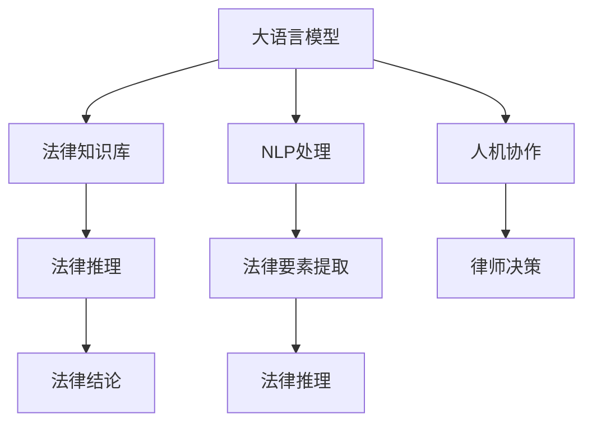

                 

# LLM在法律领域的应用：AI法律顾问

## 1. 背景介绍

随着人工智能技术的迅猛发展，大语言模型（Large Language Models, LLMs）在多个领域展现出了强大的应用潜力。法律领域作为规范社会秩序、解决纷争的重要工具，也逐渐成为了大语言模型关注的焦点。AI法律顾问利用大语言模型的自然语言理解和处理能力，为律师、法官、企业法务等法律从业人员提供了智能化的支持，大幅提升了法律工作的效率和质量。

### 1.1 问题由来

法律事务复杂多变，处理起来耗时耗力。传统的法律咨询依赖人力，面临着知识储备不足、检索效率低下、文书撰写困难等问题。而大语言模型通过在大量法律案例和规范性文件中进行预训练，能够自动理解和处理复杂的法律语言，提供精准的查询、文书撰写和法律分析等服务，极大提升了法律工作的效率和准确性。

### 1.2 问题核心关键点

AI法律顾问的核心在于将大语言模型应用于法律领域的各类任务，如法律查询、合同审核、案件分析等。其关键点包括：

- 知识库构建：收集整理法律规范、案例、判例等文本数据，构建高质量的知识库。
- 模型微调：基于法律领域的标注数据，对预训练模型进行微调，使其能够理解和解决法律问题。
- 推理生成：利用微调后的模型，生成符合法律逻辑的推理过程和结论。
- 人机协作：在复杂的法律事务中，利用AI法律顾问辅助人类律师，提升工作效率和决策质量。

## 2. 核心概念与联系

### 2.1 核心概念概述

为了更好地理解AI法律顾问的实现原理和应用场景，本节将介绍几个核心概念及其联系：

- 大语言模型（LLMs）：以Transformer为代表的自回归或自编码语言模型。通过在大规模无标签文本语料上进行预训练，学习通用的语言表示，具备强大的语言理解和生成能力。
- 法律知识库（Legal Knowledge Base）：法律规范、案例、判例等文本数据的集合，是AI法律顾问知识推理的基础。
- 法律推理（Legal Reasoning）：根据法律规范和案例，对新出现的法律问题进行推理和判断的过程。
- 自然语言处理（NLP）：使用大语言模型处理法律文本，提取法律要素和语义，辅助法律推理。
- 人机协作（Human-AI Collaboration）：AI法律顾问作为辅助工具，与人类法律从业人员协同工作，提高工作效率和决策质量。

这些核心概念之间的关系可以通过以下Mermaid流程图来展示：



这个流程图展示了从大语言模型到法律推理的全过程，其中每个模块都有其独特的价值和作用。

## 3. 核心算法原理 & 具体操作步骤
### 3.1 算法原理概述

AI法律顾问的核心算法原理基于大语言模型的自然语言处理能力和法律知识库的融合。具体步骤如下：

1. **知识库构建**：收集整理法律规范、案例、判例等文本数据，构建高质量的法律知识库。
2. **模型微调**：基于法律领域的标注数据，对预训练模型进行微调，使其能够理解和解决法律问题。
3. **推理生成**：利用微调后的模型，生成符合法律逻辑的推理过程和结论。
4. **人机协作**：在复杂的法律事务中，利用AI法律顾问辅助人类律师，提升工作效率和决策质量。

### 3.2 算法步骤详解

#### 3.2.1 知识库构建

- **数据收集**：收集各类法律规范、案例、判例等文本数据，确保数据的全面性和时效性。
- **文本清洗**：对收集到的文本进行清洗，去除无关信息和噪声，保证数据质量。
- **实体识别**：使用NLP技术识别文本中的法律实体，如法律条款、案件名称、当事人等。
- **知识图谱构建**：将识别出的法律实体构建为知识图谱，便于模型推理和查询。

#### 3.2.2 模型微调

- **数据标注**：根据法律领域的特点，对标注数据进行精心设计，确保数据的多样性和代表性。
- **微调设置**：选择合适的微调超参数，如学习率、批量大小、迭代轮数等。
- **模型训练**：在构建的法律知识库上，对预训练模型进行微调，使其能够理解和解决具体的法律问题。
- **模型评估**：在验证集和测试集上评估微调后的模型性能，确保模型能够泛化到新的法律问题。

#### 3.2.3 推理生成

- **推理引擎设计**：设计推理引擎，将微调后的模型应用于具体的法律问题，生成符合法律逻辑的推理过程和结论。
- **知识推理**：根据法律知识库和推理引擎，对新出现的法律问题进行推理和判断，生成最终的法律结论。
- **结论验证**：通过人工验证或反馈机制，确保生成的结论符合法律规范和逻辑。

#### 3.2.4 人机协作

- **用户交互设计**：设计友好的用户界面，方便律师和法官使用AI法律顾问。
- **辅助决策**：在复杂法律事务中，利用AI法律顾问辅助人类律师，提供法律分析和建议。
- **动态调整**：根据用户反馈和评价，动态调整AI法律顾问的功能和参数，提高其适应性和实用性。

### 3.3 算法优缺点

AI法律顾问利用大语言模型在法律领域的适用性，具有以下优点：

1. **高效率**：能够快速处理大量法律文本，自动化程度高，节省人力成本。
2. **高准确性**：基于法律知识库和微调模型，提供精准的法律推理和结论。
3. **灵活性**：能够处理多种法律任务，如合同审核、案件分析、法律咨询等。
4. **可扩展性**：能够不断更新法律知识库，适应法律规范的变化。

同时，AI法律顾问也存在以下局限：

1. **数据依赖**：对法律知识库的质量和完备性有较高要求，需要持续维护和更新。
2. **逻辑局限**：基于机器学习模型，可能存在推理逻辑不严谨的问题。
3. **伦理风险**：需要确保AI法律顾问生成的结论符合法律伦理和道德标准。
4. **依赖人类**：在复杂法律事务中，仍需要人类法律从业人员进行最终决策和验证。

### 3.4 算法应用领域

AI法律顾问的应用领域涵盖多个方面，如：

- **法律查询**：通过自然语言输入，快速检索和获取相关法律规范和案例。
- **合同审核**：利用法律知识和推理能力，审核和生成合同条款，确保合同合法合规。
- **案件分析**：分析案件涉及的法律要素，生成案件分析报告，为审判提供参考。
- **法律咨询**：提供法律咨询和建议，帮助用户解决法律问题。
- **文书撰写**：辅助律师撰写法律文书，如起诉状、答辩状、上诉状等。

## 4. 数学模型和公式 & 详细讲解  
### 4.1 数学模型构建

假设法律知识库为 $D=\{(x_i,y_i)\}_{i=1}^N, x_i \in \mathcal{X}, y_i \in \mathcal{Y}$，其中 $x_i$ 为法律文本，$y_i$ 为对应的法律要素（如合同条款、案件名称等）。法律推理过程可以表示为 $f: \mathcal{X} \rightarrow \mathcal{Y}$，其中 $f$ 为推理函数，表示根据法律文本生成对应的法律要素。

法律推理的优化目标为最小化推理误差，即：

$$
\mathcal{L}(f) = \frac{1}{N} \sum_{i=1}^N \ell(f(x_i), y_i)
$$

其中 $\ell$ 为损失函数，常用的损失函数包括交叉熵损失、均方误差损失等。

### 4.2 公式推导过程

以交叉熵损失函数为例，其公式为：

$$
\ell(f(x_i), y_i) = -y_i\log f(x_i) - (1-y_i)\log(1-f(x_i))
$$

根据链式法则，推理函数 $f$ 的梯度为：

$$
\nabla_{\theta} \mathcal{L}(f) = \frac{1}{N} \sum_{i=1}^N \nabla_{\theta} \ell(f(x_i), y_i)
$$

其中 $\nabla_{\theta} \ell(f(x_i), y_i)$ 为损失函数对推理函数 $f$ 的梯度，可通过反向传播算法高效计算。

### 4.3 案例分析与讲解

**案例1：合同审核**

假设有一段合同文本 $x$，要求审核其中是否包含合法的条款。将合同文本作为模型输入，合同条款作为目标输出。在法律知识库上对预训练模型进行微调，使其能够识别出合法的合同条款。微调过程如下：

1. **数据准备**：收集大量的合同文本和对应的合法条款作为标注数据。
2. **模型微调**：使用交叉熵损失函数，对预训练模型进行微调，生成合法的合同条款。
3. **推理生成**：将合同文本输入微调后的模型，生成合法的合同条款。

**案例2：案件分析**

假设有一段案件描述 $x$，要求分析案件涉及的法律要素，生成案件分析报告。将案件描述作为模型输入，案件分析结果作为目标输出。在法律知识库上对预训练模型进行微调，使其能够理解案件描述并生成相应的法律分析报告。微调过程如下：

1. **数据准备**：收集大量的案件描述和对应的法律要素作为标注数据。
2. **模型微调**：使用交叉熵损失函数，对预训练模型进行微调，生成案件分析报告。
3. **推理生成**：将案件描述输入微调后的模型，生成案件分析报告。

## 5. 项目实践：代码实例和详细解释说明
### 5.1 开发环境搭建

在进行AI法律顾问开发前，我们需要准备好开发环境。以下是使用Python进行PyTorch开发的环境配置流程：

1. 安装Anaconda：从官网下载并安装Anaconda，用于创建独立的Python环境。

2. 创建并激活虚拟环境：
```bash
conda create -n pytorch-env python=3.8 
conda activate pytorch-env
```

3. 安装PyTorch：根据CUDA版本，从官网获取对应的安装命令。例如：
```bash
conda install pytorch torchvision torchaudio cudatoolkit=11.1 -c pytorch -c conda-forge
```

4. 安装Transformers库：
```bash
pip install transformers
```

5. 安装各类工具包：
```bash
pip install numpy pandas scikit-learn matplotlib tqdm jupyter notebook ipython
```

完成上述步骤后，即可在`pytorch-env`环境中开始AI法律顾问的开发。

### 5.2 源代码详细实现

下面以合同审核任务为例，给出使用Transformers库对BERT模型进行微调的PyTorch代码实现。

首先，定义合同审核任务的数据处理函数：

```python
from transformers import BertTokenizer
from torch.utils.data import Dataset
import torch

class ContractReviewDataset(Dataset):
    def __init__(self, texts, labels, tokenizer, max_len=128):
        self.texts = texts
        self.labels = labels
        self.tokenizer = tokenizer
        self.max_len = max_len
        
    def __len__(self):
        return len(self.texts)
    
    def __getitem__(self, item):
        text = self.texts[item]
        label = self.labels[item]
        
        encoding = self.tokenizer(text, return_tensors='pt', max_length=self.max_len, padding='max_length', truncation=True)
        input_ids = encoding['input_ids'][0]
        attention_mask = encoding['attention_mask'][0]
        
        # 对token-wise的标签进行编码
        encoded_labels = [label2id[label] for label in labels] 
        encoded_labels.extend([label2id['O']] * (self.max_len - len(encoded_labels)))
        labels = torch.tensor(encoded_labels, dtype=torch.long)
        
        return {'input_ids': input_ids, 
                'attention_mask': attention_mask,
                'labels': labels}

# 标签与id的映射
label2id = {'O': 0, 'B-Clause': 1, 'I-Clause': 2}
id2label = {v: k for k, v in label2id.items()}

# 创建dataset
tokenizer = BertTokenizer.from_pretrained('bert-base-cased')

train_dataset = ContractReviewDataset(train_texts, train_labels, tokenizer)
dev_dataset = ContractReviewDataset(dev_texts, dev_labels, tokenizer)
test_dataset = ContractReviewDataset(test_texts, test_labels, tokenizer)
```

然后，定义模型和优化器：

```python
from transformers import BertForTokenClassification, AdamW

model = BertForTokenClassification.from_pretrained('bert-base-cased', num_labels=len(label2id))

optimizer = AdamW(model.parameters(), lr=2e-5)
```

接着，定义训练和评估函数：

```python
from torch.utils.data import DataLoader
from tqdm import tqdm
from sklearn.metrics import classification_report

device = torch.device('cuda') if torch.cuda.is_available() else torch.device('cpu')
model.to(device)

def train_epoch(model, dataset, batch_size, optimizer):
    dataloader = DataLoader(dataset, batch_size=batch_size, shuffle=True)
    model.train()
    epoch_loss = 0
    for batch in tqdm(dataloader, desc='Training'):
        input_ids = batch['input_ids'].to(device)
        attention_mask = batch['attention_mask'].to(device)
        labels = batch['labels'].to(device)
        model.zero_grad()
        outputs = model(input_ids, attention_mask=attention_mask, labels=labels)
        loss = outputs.loss
        epoch_loss += loss.item()
        loss.backward()
        optimizer.step()
    return epoch_loss / len(dataloader)

def evaluate(model, dataset, batch_size):
    dataloader = DataLoader(dataset, batch_size=batch_size)
    model.eval()
    preds, labels = [], []
    with torch.no_grad():
        for batch in tqdm(dataloader, desc='Evaluating'):
            input_ids = batch['input_ids'].to(device)
            attention_mask = batch['attention_mask'].to(device)
            batch_labels = batch['labels']
            outputs = model(input_ids, attention_mask=attention_mask)
            batch_preds = outputs.logits.argmax(dim=2).to('cpu').tolist()
            batch_labels = batch_labels.to('cpu').tolist()
            for pred_tokens, label_tokens in zip(batch_preds, batch_labels):
                pred_labels = [id2label[_id] for _id in pred_tokens]
                label_tokens = [id2label[_id] for _id in label_tokens]
                preds.append(pred_labels[:len(label_tokens)])
                labels.append(label_tokens)
                
    print(classification_report(labels, preds))
```

最后，启动训练流程并在测试集上评估：

```python
epochs = 5
batch_size = 16

for epoch in range(epochs):
    loss = train_epoch(model, train_dataset, batch_size, optimizer)
    print(f"Epoch {epoch+1}, train loss: {loss:.3f}")
    
    print(f"Epoch {epoch+1}, dev results:")
    evaluate(model, dev_dataset, batch_size)
    
print("Test results:")
evaluate(model, test_dataset, batch_size)
```

以上就是使用PyTorch对BERT进行合同审核任务微调的完整代码实现。可以看到，得益于Transformers库的强大封装，我们可以用相对简洁的代码完成BERT模型的加载和微调。

### 5.3 代码解读与分析

让我们再详细解读一下关键代码的实现细节：

**ContractReviewDataset类**：
- `__init__`方法：初始化文本、标签、分词器等关键组件。
- `__len__`方法：返回数据集的样本数量。
- `__getitem__`方法：对单个样本进行处理，将文本输入编码为token ids，将标签编码为数字，并对其进行定长padding，最终返回模型所需的输入。

**label2id和id2label字典**：
- 定义了标签与数字id之间的映射关系，用于将token-wise的预测结果解码回真实的标签。

**训练和评估函数**：
- 使用PyTorch的DataLoader对数据集进行批次化加载，供模型训练和推理使用。
- 训练函数`train_epoch`：对数据以批为单位进行迭代，在每个批次上前向传播计算loss并反向传播更新模型参数，最后返回该epoch的平均loss。
- 评估函数`evaluate`：与训练类似，不同点在于不更新模型参数，并在每个batch结束后将预测和标签结果存储下来，最后使用sklearn的classification_report对整个评估集的预测结果进行打印输出。

**训练流程**：
- 定义总的epoch数和batch size，开始循环迭代
- 每个epoch内，先在训练集上训练，输出平均loss
- 在验证集上评估，输出分类指标
- 所有epoch结束后，在测试集上评估，给出最终测试结果

可以看到，PyTorch配合Transformers库使得BERT微调的代码实现变得简洁高效。开发者可以将更多精力放在数据处理、模型改进等高层逻辑上，而不必过多关注底层的实现细节。

当然，工业级的系统实现还需考虑更多因素，如模型的保存和部署、超参数的自动搜索、更灵活的任务适配层等。但核心的微调范式基本与此类似。

## 6. 实际应用场景
### 6.1 智能合同审核

智能合同审核系统通过AI法律顾问对合同文本进行审核，检查其中是否存在违反法律规定的条款，是否存在歧义和漏洞，从而提高合同的合法性和可执行性。具体应用如下：

1. **合同文本输入**：律师将需要审核的合同文本输入系统。
2. **自动化审核**：AI法律顾问对合同文本进行自动审核，识别出不合法的条款和潜在的法律风险。
3. **人工复审**：系统生成审核报告，律师对报告进行复审，确认是否符合法律规范。
4. **自动修正**：系统自动修正发现的问题，提供修改建议，帮助律师快速完善合同。

### 6.2 法律案件分析

法律案件分析系统通过AI法律顾问对案件描述进行分析，生成案件分析报告，辅助法官和律师进行案件判决。具体应用如下：

1. **案件描述输入**：法官或律师将案件描述输入系统。
2. **自动化分析**：AI法律顾问对案件描述进行分析和推理，生成案件分析报告。
3. **报告审查**：法官或律师对报告进行审查，确认是否符合法律逻辑。
4. **辅助决策**：报告中提供的法律依据和分析结果，可以帮助法官或律师做出更准确、公正的判决。

### 6.3 法律咨询系统

法律咨询系统通过AI法律顾问对用户提出的法律问题进行解答，提供精准的法律信息和建议。具体应用如下：

1. **问题输入**：用户将法律问题输入系统。
2. **自动化解答**：AI法律顾问对问题进行分析和推理，生成解答报告。
3. **报告输出**：系统将解答报告输出给用户，帮助用户理解法律规定和解决法律问题。
4. **用户反馈**：用户对解答报告进行反馈，系统不断优化模型和知识库，提高解答的准确性和实用性。

### 6.4 未来应用展望

未来，AI法律顾问将在法律领域发挥更加重要的作用，推动法律工作的智能化、自动化、高效化发展。具体应用展望如下：

1. **司法判决辅助**：AI法律顾问辅助法官进行案件判决，提高判决的公正性和准确性。
2. **企业法律顾问**：企业法务部门使用AI法律顾问，进行合同审核、风险评估等工作，提高工作效率和决策质量。
3. **法律教育辅助**：教育机构使用AI法律顾问，辅助法律课程教学，提高学生法律素养和实践能力。
4. **法律机器人**：智能法律机器人，能够自动解答用户法律咨询，提供24小时法律服务。

## 7. 工具和资源推荐
### 7.1 学习资源推荐

为了帮助开发者系统掌握AI法律顾问的理论基础和实践技巧，这里推荐一些优质的学习资源：

1. 《Legal Reasoning with Pre-trained Models》系列博文：由AI法律顾问技术专家撰写，深入浅出地介绍了大语言模型在法律推理中的应用。

2. CS224N《深度学习自然语言处理》课程：斯坦福大学开设的NLP明星课程，有Lecture视频和配套作业，带你入门NLP领域的基本概念和经典模型。

3. 《Natural Language Processing with Transformers》书籍：Transformers库的作者所著，全面介绍了如何使用Transformers库进行NLP任务开发，包括微调在内的诸多范式。

4. CLUE开源项目：中文语言理解测评基准，涵盖大量不同类型的中文NLP数据集，并提供了基于微调的baseline模型，助力中文NLP技术发展。

通过对这些资源的学习实践，相信你一定能够快速掌握AI法律顾问的精髓，并用于解决实际的法律问题。
###  7.2 开发工具推荐

高效的开发离不开优秀的工具支持。以下是几款用于AI法律顾问开发的常用工具：

1. PyTorch：基于Python的开源深度学习框架，灵活动态的计算图，适合快速迭代研究。大部分预训练语言模型都有PyTorch版本的实现。

2. TensorFlow：由Google主导开发的开源深度学习框架，生产部署方便，适合大规模工程应用。同样有丰富的预训练语言模型资源。

3. Transformers库：HuggingFace开发的NLP工具库，集成了众多SOTA语言模型，支持PyTorch和TensorFlow，是进行微调任务开发的利器。

4. Weights & Biases：模型训练的实验跟踪工具，可以记录和可视化模型训练过程中的各项指标，方便对比和调优。与主流深度学习框架无缝集成。

5. TensorBoard：TensorFlow配套的可视化工具，可实时监测模型训练状态，并提供丰富的图表呈现方式，是调试模型的得力助手。

6. Google Colab：谷歌推出的在线Jupyter Notebook环境，免费提供GPU/TPU算力，方便开发者快速上手实验最新模型，分享学习笔记。

合理利用这些工具，可以显著提升AI法律顾问的开发效率，加快创新迭代的步伐。

### 7.3 相关论文推荐

AI法律顾问的发展得益于学界的持续研究。以下是几篇奠基性的相关论文，推荐阅读：

1. Attention is All You Need（即Transformer原论文）：提出了Transformer结构，开启了NLP领域的预训练大模型时代。

2. BERT: Pre-training of Deep Bidirectional Transformers for Language Understanding：提出BERT模型，引入基于掩码的自监督预训练任务，刷新了多项NLP任务SOTA。

3. Legal Reasoning with Pre-trained Models：介绍了大语言模型在法律推理中的应用，提供了丰富的案例和分析。

4. Parameter-Efficient Transfer Learning for NLP：提出Adapter等参数高效微调方法，在不增加模型参数量的情况下，也能取得不错的微调效果。

5. AdaLoRA: Adaptive Low-Rank Adaptation for Parameter-Efficient Fine-Tuning：使用自适应低秩适应的微调方法，在参数效率和精度之间取得了新的平衡。

这些论文代表了大语言模型微调技术的发展脉络。通过学习这些前沿成果，可以帮助研究者把握学科前进方向，激发更多的创新灵感。

## 8. 总结：未来发展趋势与挑战
### 8.1 总结

本文对AI法律顾问的实现原理和应用场景进行了全面系统的介绍。首先阐述了AI法律顾问在法律领域的背景和重要性，明确了其知识库构建、模型微调、推理生成、人机协作等关键点。其次，从原理到实践，详细讲解了AI法律顾问的数学模型和算法步骤，给出了微调任务开发的完整代码实例。同时，本文还广泛探讨了AI法律顾问在智能合同审核、法律案件分析、法律咨询等多个行业领域的应用前景，展示了其巨大的应用潜力。此外，本文精选了AI法律顾问的学习资源、开发工具和相关论文，力求为开发者提供全方位的技术指引。

通过本文的系统梳理，可以看到，AI法律顾问利用大语言模型在法律领域的强大应用能力，极大地提升了法律工作的效率和质量，具有广阔的应用前景。未来，随着大语言模型和微调方法的不断演进，AI法律顾问必将在更多法律场景中得到应用，为法律工作的智能化、自动化、高效化发展提供新的技术路径。

### 8.2 未来发展趋势

展望未来，AI法律顾问的发展将呈现以下几个趋势：

1. **智能合同审核**：随着AI法律顾问在智能合同审核领域的深入应用，系统将能够自动审核合同条款，发现潜在法律风险，生成修改建议，极大提升合同审核效率。

2. **法律案件分析**：AI法律顾问在法律案件分析中的应用将更加广泛，能够自动生成案件分析报告，辅助法官和律师进行案件判决，提高判决的公正性和准确性。

3. **法律咨询系统**：智能法律咨询系统将不断优化，能够自动解答各种法律问题，提供精准的法律信息和建议，提升用户法律素养和实践能力。

4. **法律教育辅助**：AI法律顾问将作为法律教育的重要辅助工具，提供法律知识和案例分析，提升学生的法律素养和实践能力。

5. **法律机器人**：智能法律机器人将能够自动解答法律咨询，提供24小时法律服务，极大提升法律服务的可及性和便利性。

以上趋势凸显了AI法律顾问在法律领域的巨大应用潜力。这些方向的探索发展，必将进一步提升法律工作的智能化水平，为构建公正、高效、智能的法律系统奠定坚实基础。

### 8.3 面临的挑战

尽管AI法律顾问在法律领域展现出了巨大的应用前景，但仍面临诸多挑战：

1. **数据依赖**：对法律知识库的质量和完备性有较高要求，需要持续维护和更新，保证数据的时效性和多样性。

2. **逻辑局限**：基于机器学习模型，可能存在推理逻辑不严谨的问题，需要进一步提高模型的理解和推理能力。

3. **伦理风险**：需要确保AI法律顾问生成的结论符合法律伦理和道德标准，避免法律风险和伦理风险。

4. **依赖人类**：在复杂法律事务中，仍需要人类法律从业人员进行最终决策和验证，系统不能完全替代人类。

5. **隐私保护**：法律事务涉及个人隐私和机密信息，系统需要采取严格的数据保护措施，确保用户隐私安全。

6. **法规合规**：AI法律顾问需要遵循相关法规和合规要求，确保系统的合法性和合规性。

正视AI法律顾问面临的这些挑战，积极应对并寻求突破，将是大语言模型微调技术迈向成熟的必由之路。相信随着学界和产业界的共同努力，这些挑战终将一一被克服，AI法律顾问必将在法律领域发挥更加重要的作用。

### 8.4 研究展望

面对AI法律顾问所面临的种种挑战，未来的研究需要在以下几个方面寻求新的突破：

1. **知识库优化**：通过自动抽取和构建法律知识库，提高知识库的时效性和完备性，降低数据依赖。

2. **推理能力提升**：开发更加严谨的推理模型，提高模型的理解能力和逻辑推理能力，确保结论的准确性和可靠性。

3. **伦理和隐私保护**：引入伦理和隐私保护机制，确保AI法律顾问生成的结论符合法律伦理和道德标准，保障用户隐私安全。

4. **法规合规**：研究和制定AI法律顾问的法规和合规要求，确保系统的合法性和合规性。

5. **人机协作**：研究人机协作机制，构建高效的人机协同工作系统，提升法律工作的效率和质量。

这些研究方向的探索，必将引领AI法律顾问技术迈向更高的台阶，为构建安全、可靠、智能的法律系统提供新的技术路径。面向未来，AI法律顾问需要与其他人工智能技术进行更深入的融合，如知识表示、因果推理、强化学习等，多路径协同发力，共同推动自然语言理解和智能交互系统的进步。只有勇于创新、敢于突破，才能不断拓展AI法律顾问的边界，让智能技术更好地服务于法律工作。

## 9. 附录：常见问题与解答
**Q1：AI法律顾问是否适用于所有法律领域？**

A: AI法律顾问在大多数法律领域都能取得不错的效果，特别是在合同审核、案件分析等任务上。但对于一些专业性较强的领域，如刑法、民法等，由于涉及复杂的法律理论和实践经验，仍需要人类法律从业人员进行最终决策和验证。

**Q2：微调过程中如何选择合适的学习率？**

A: AI法律顾问的微调学习率一般要比预训练时小1-2个数量级，使用较小的学习率有助于模型适应法律知识库和标注数据的特点。一般建议从1e-5开始调参，逐步减小学习率，直至收敛。也可以使用warmup策略，在开始阶段使用较小的学习率，再逐渐过渡到预设值。

**Q3：如何缓解微调过程中的过拟合问题？**

A: 过拟合是AI法律顾问面临的主要挑战之一。缓解策略包括：
1. 数据增强：通过回译、近义替换等方式扩充训练集。
2. 正则化：使用L2正则、Dropout、Early Stopping等防止过拟合。
3. 对抗训练：引入对抗样本，提高模型鲁棒性。
4. 参数高效微调：只调整少量参数，减小过拟合风险。

这些策略往往需要根据具体任务和数据特点进行灵活组合。只有在数据、模型、训练、推理等各环节进行全面优化，才能最大限度地发挥AI法律顾问的潜力。

**Q4：AI法律顾问生成的结论如何验证？**

A: AI法律顾问生成的结论需要由人类法律从业人员进行验证和修正。在智能合同审核、法律案件分析等任务中，系统生成的报告需要律师或法官进行复审，确认结论是否符合法律规范和逻辑。对于复杂法律事务，系统的推理过程也需要人类法律从业人员进行审查，确保系统的结论准确可靠。

**Q5：AI法律顾问如何处理新出现的法律问题？**

A: AI法律顾问可以通过持续学习和微调，不断更新和优化模型，适应新出现的法律问题。同时，系统还可以通过用户反馈和人工标注数据，进一步提高模型的泛化能力和适用性。在面对新问题时，系统可以自动搜索相关法律知识库，生成推理过程和结论，并由人类法律从业人员进行验证和修正。

---

作者：禅与计算机程序设计艺术 / Zen and the Art of Computer Programming

