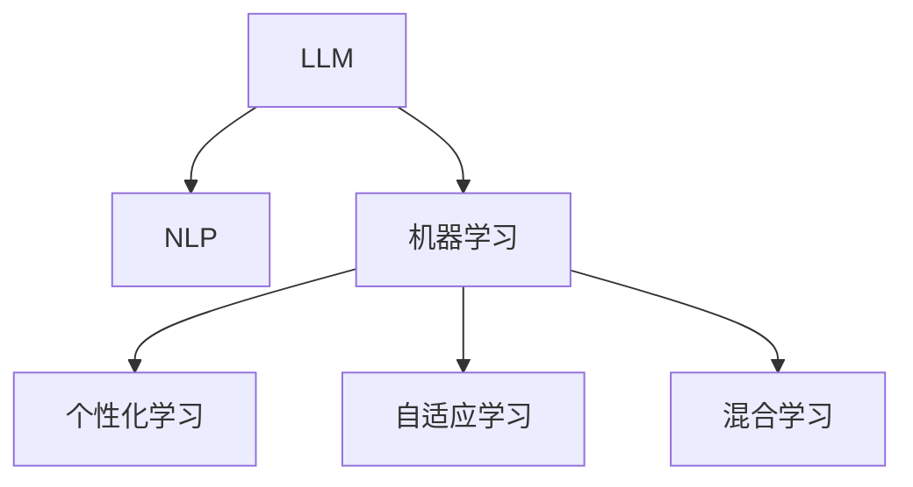

                 

# LLM对传统教育模式的挑战

## 1. 背景介绍

### 1.1 问题由来

随着人工智能和大数据技术的快速发展，大语言模型(LLM)在教育领域的应用也逐渐受到关注。相比于传统的教育模式，LLM具备处理海量数据、提供个性化教学和高效评价等优势。但同时，LLM的出现也给传统的教育模式带来了巨大挑战。本文将探讨LLM对传统教育模式的挑战，分析LLM在教育领域的应用现状及未来趋势。

### 1.2 问题核心关键点

1. **个性化教学**：LLM能够根据学生的学习情况和偏好，提供个性化的教学内容和学习路径，提升学习效率。
2. **大数据分析**：通过分析学习数据，LLM能发现学生的知识盲点和学习困难，进行针对性指导。
3. **智能评价**：LLM能够自动评估学生的学习成果，提供及时反馈，改进教学方法。
4. **自主学习**：LLM支持学生自主学习，减少对教师的依赖，激发学生的主动性和创造力。
5. **跨学科整合**：LLM能将不同学科的知识进行融合，培养学生综合能力。

## 2. 核心概念与联系

### 2.1 核心概念概述

为更好地理解LLM对传统教育模式的挑战，本节将介绍几个密切相关的核心概念：

- **大语言模型(LLM)**：以自回归模型（如GPT-3）或自编码模型（如BERT）为代表的大规模预训练语言模型。通过在大规模无标签文本语料上进行预训练，学习通用的语言表示，具备强大的语言理解和生成能力。
- **自然语言处理(NLP)**：利用计算机处理和理解人类语言的技术，包括文本分类、机器翻译、命名实体识别等任务。
- **机器学习与人工智能**：通过数据驱动的方法，使计算机具备学习能力和智能。
- **个性化学习**：根据学生的学习需求和能力，提供量身定做的教学方案。
- **自适应学习**：动态调整教学内容和方法，以适应学生的学习进度和效果。
- **混合学习**：结合线上和线下教学方式，提升教学效果。

这些核心概念之间的逻辑关系可以通过以下Mermaid流程图来展示：



这个流程图展示了大语言模型与教育领域关键概念之间的联系，体现了LLM在教育中应用的多样性和复杂性。

## 3. 核心算法原理 & 具体操作步骤
### 3.1 算法原理概述

LLM对传统教育模式的挑战，主要体现在其独特的学习方式和教学模式上。相比于传统的课堂教学，LLM能够提供更加个性化、灵活和高效的教育体验。

大语言模型通过在大量无标签文本数据上进行预训练，学习到通用的语言表示和知识结构。通过在特定任务上微调，LLM可以具备解决特定问题的能力，如回答问题、生成文章、翻译文本等。在教育领域，LLM能够通过以下方式挑战传统教育模式：

1. **个性化教学**：根据学生的兴趣和需求，生成个性化的教学内容和路径。
2. **大数据分析**：分析学生的学习数据，发现知识盲点和困难点，进行针对性的指导。
3. **智能评价**：自动评估学生的学习成果，提供即时反馈，改进教学方法。
4. **自主学习**：提供自主学习平台，支持学生根据自己的进度和兴趣进行学习。
5. **跨学科整合**：整合不同学科的知识，培养学生的综合能力。

### 3.2 算法步骤详解

基于LLM的教育模式，主要包括以下几个关键步骤：

**Step 1: 数据准备与模型选择**
- 收集学生的学习数据，如历史成绩、答题记录、兴趣爱好等。
- 选择适合的教育任务，如回答问题、生成论文、翻译文章等。
- 选择合适的预训练语言模型，如GPT-3、BERT等。

**Step 2: 数据预处理**
- 对学生数据进行清洗、标注和归一化处理，确保数据质量。
- 将任务数据转化为LLM可处理的格式，如将问题转化为生成任务。

**Step 3: 模型微调与优化**
- 在预训练模型基础上，对特定任务进行微调。
- 选择合适的优化算法和超参数，如Adam、SGD、学习率等。
- 应用正则化技术，如L2正则、Dropout等，避免过拟合。

**Step 4: 教学应用**
- 将微调后的模型应用到教学平台中，提供个性化学习建议和路径。
- 通过自然语言交互，收集学生的反馈和评价，不断优化教学内容。

**Step 5: 持续学习与改进**
- 定期更新学生数据和任务数据，进行模型再训练和微调。
- 不断改进教学策略和方法，提升教育效果。

### 3.3 算法优缺点

LLM对传统教育模式的挑战，主要体现在其高效性、个性化和自适应性上，但也存在一些局限性：

**优点**：
1. **高效性**：LLM能够处理海量数据，快速分析学生的学习情况，提供个性化教学。
2. **灵活性**：LLM能够根据学生的进度和兴趣，动态调整教学内容和方法。
3. **自主性**：LLM支持学生自主学习，激发学生的主动性和创造力。
4. **跨学科性**：LLM能够整合不同学科的知识，培养学生的综合能力。

**缺点**：
1. **数据依赖**：LLM的效果很大程度上依赖于学生数据的完整性和质量，数据缺失可能导致模型性能下降。
2. **公平性**：如果数据存在偏见，LLM可能会加剧教育不平等，对不同背景的学生不公平。
3. **成本高**：LLM的训练和部署需要大量计算资源，初期投入成本较高。
4. **可解释性不足**：LLM作为“黑盒”模型，难以解释其决策过程，教师和学生难以理解其背后的逻辑。

## 4. 数学模型和公式 & 详细讲解  
### 4.1 数学模型构建

本节将使用数学语言对LLM在教育领域的应用进行更加严格的刻画。

假设有一个包含 $N$ 个学生的教育数据集 $D=\{(x_i, y_i)\}_{i=1}^N$，其中 $x_i$ 是学生的输入数据，$y_i$ 是目标输出（如学习效果、兴趣等）。定义LLM模型为 $M_{\theta}:\mathcal{X} \rightarrow \mathcal{Y}$，其中 $\mathcal{X}$ 为输入空间，$\mathcal{Y}$ 为输出空间，$\theta \in \mathbb{R}^d$ 为模型参数。

定义模型 $M_{\theta}$ 在数据样本 $(x,y)$ 上的损失函数为 $\ell(M_{\theta}(x),y)$，则在数据集 $D$ 上的经验风险为：

$$
\mathcal{L}(\theta) = \frac{1}{N}\sum_{i=1}^N \ell(M_{\theta}(x_i),y_i)
$$

微调的优化目标是最小化经验风险，即找到最优参数：

$$
\theta^* = \mathop{\arg\min}_{\theta} \mathcal{L}(\theta)
$$

在实践中，我们通常使用基于梯度的优化算法（如Adam、SGD等）来近似求解上述最优化问题。设 $\eta$ 为学习率，$\lambda$ 为正则化系数，则参数的更新公式为：

$$
\theta \leftarrow \theta - \eta \nabla_{\theta}\mathcal{L}(\theta) - \eta\lambda\theta
$$

其中 $\nabla_{\theta}\mathcal{L}(\theta)$ 为损失函数对参数 $\theta$ 的梯度，可通过反向传播算法高效计算。

### 4.2 公式推导过程

以下我们以回答问题为例，推导回答问题的交叉熵损失函数及其梯度的计算公式。

假设模型 $M_{\theta}$ 在输入 $x$ 上的输出为 $\hat{y}=M_{\theta}(x) \in [0,1]$，表示模型对问题的回答概率。真实标签 $y \in \{0,1\}$。则二分类交叉熵损失函数定义为：

$$
\ell(M_{\theta}(x),y) = -[y\log \hat{y} + (1-y)\log (1-\hat{y})]
$$

将其代入经验风险公式，得：

$$
\mathcal{L}(\theta) = -\frac{1}{N}\sum_{i=1}^N [y_i\log M_{\theta}(x_i)+(1-y_i)\log(1-M_{\theta}(x_i))]
$$

根据链式法则，损失函数对参数 $\theta_k$ 的梯度为：

$$
\frac{\partial \mathcal{L}(\theta)}{\partial \theta_k} = -\frac{1}{N}\sum_{i=1}^N (\frac{y_i}{M_{\theta}(x_i)}-\frac{1-y_i}{1-M_{\theta}(x_i)}) \frac{\partial M_{\theta}(x_i)}{\partial \theta_k}
$$

其中 $\frac{\partial M_{\theta}(x_i)}{\partial \theta_k}$ 可进一步递归展开，利用自动微分技术完成计算。

在得到损失函数的梯度后，即可带入参数更新公式，完成模型的迭代优化。重复上述过程直至收敛，最终得到适应教育任务的最优模型参数 $\theta^*$。

## 5. 项目实践：代码实例和详细解释说明
### 5.1 开发环境搭建

在进行教育领域应用开发前，我们需要准备好开发环境。以下是使用Python进行PyTorch开发的环境配置流程：

1. 安装Anaconda：从官网下载并安装Anaconda，用于创建独立的Python环境。

2. 创建并激活虚拟环境：
```bash
conda create -n edugen-env python=3.8 
conda activate edugen-env
```

3. 安装PyTorch：根据CUDA版本，从官网获取对应的安装命令。例如：
```bash
conda install pytorch torchvision torchaudio cudatoolkit=11.1 -c pytorch -c conda-forge
```

4. 安装Transformers库：
```bash
pip install transformers
```

5. 安装各类工具包：
```bash
pip install numpy pandas scikit-learn matplotlib tqdm jupyter notebook ipython
```

完成上述步骤后，即可在`edugen-env`环境中开始教育领域应用的开发。

### 5.2 源代码详细实现

下面我们以问答系统为例，给出使用Transformers库对GPT-3模型进行教育问答系统微调的PyTorch代码实现。

首先，定义问答系统的数据处理函数：

```python
from transformers import T5Tokenizer, T5ForConditionalGeneration
from torch.utils.data import Dataset, DataLoader
import torch

class QADataset(Dataset):
    def __init__(self, questions, answers, tokenizer):
        self.questions = questions
        self.answers = answers
        self.tokenizer = tokenizer
        
    def __len__(self):
        return len(self.questions)
    
    def __getitem__(self, item):
        question = self.questions[item]
        answer = self.answers[item]
        
        encoding = self.tokenizer(question, return_tensors='pt', max_length=128, padding='max_length', truncation=True)
        input_ids = encoding['input_ids'][0]
        attention_mask = encoding['attention_mask'][0]
        labels = torch.tensor(encoding['labels'][0], dtype=torch.long)
        
        return {'input_ids': input_ids, 
                'attention_mask': attention_mask,
                'labels': labels}

# 加载模型和 tokenizer
model = T5ForConditionalGeneration.from_pretrained('t5-small')
tokenizer = T5Tokenizer.from_pretrained('t5-small')
```

然后，定义模型和优化器：

```python
optimizer = AdamW(model.parameters(), lr=2e-5)
```

接着，定义训练和评估函数：

```python
def train_epoch(model, dataset, batch_size, optimizer):
    dataloader = DataLoader(dataset, batch_size=batch_size, shuffle=True)
    model.train()
    epoch_loss = 0
    for batch in dataloader:
        input_ids = batch['input_ids'].to(device)
        attention_mask = batch['attention_mask'].to(device)
        labels = batch['labels'].to(device)
        model.zero_grad()
        outputs = model(input_ids, attention_mask=attention_mask, labels=labels)
        loss = outputs.loss
        epoch_loss += loss.item()
        loss.backward()
        optimizer.step()
    return epoch_loss / len(dataloader)

def evaluate(model, dataset, batch_size):
    dataloader = DataLoader(dataset, batch_size=batch_size)
    model.eval()
    preds, labels = [], []
    with torch.no_grad():
        for batch in dataloader:
            input_ids = batch['input_ids'].to(device)
            attention_mask = batch['attention_mask'].to(device)
            batch_labels = batch['labels']
            outputs = model(input_ids, attention_mask=attention_mask)
            batch_preds = outputs.logits.argmax(dim=2).to('cpu').tolist()
            batch_labels = batch_labels.to('cpu').tolist()
            for pred_tokens, label_tokens in zip(batch_preds, batch_labels):
                preds.append(pred_tokens[:len(label_tokens)])
                labels.append(label_tokens)
                
    print(classification_report(labels, preds))
```

最后，启动训练流程并在验证集上评估：

```python
epochs = 5
batch_size = 16

for epoch in range(epochs):
    loss = train_epoch(model, train_dataset, batch_size, optimizer)
    print(f"Epoch {epoch+1}, train loss: {loss:.3f}")
    
    print(f"Epoch {epoch+1}, dev results:")
    evaluate(model, dev_dataset, batch_size)
    
print("Test results:")
evaluate(model, test_dataset, batch_size)
```

以上就是使用PyTorch对GPT-3模型进行教育问答系统微调的完整代码实现。可以看到，得益于Transformers库的强大封装，我们可以用相对简洁的代码完成模型的微调。

### 5.3 代码解读与分析

让我们再详细解读一下关键代码的实现细节：

**QADataset类**：
- `__init__`方法：初始化问题和答案数据，加载Tokenizer。
- `__len__`方法：返回数据集的样本数量。
- `__getitem__`方法：对单个样本进行处理，将问题转化为模型输入，进行编码，并返回编码后的输入、注意力掩码和标签。

**训练和评估函数**：
- 使用PyTorch的DataLoader对数据集进行批次化加载，供模型训练和推理使用。
- 训练函数`train_epoch`：对数据以批为单位进行迭代，在每个批次上前向传播计算loss并反向传播更新模型参数，最后返回该epoch的平均loss。
- 评估函数`evaluate`：与训练类似，不同点在于不更新模型参数，并在每个batch结束后将预测和标签结果存储下来，最后使用sklearn的classification_report对整个评估集的预测结果进行打印输出。

**训练流程**：
- 定义总的epoch数和batch size，开始循环迭代
- 每个epoch内，先在训练集上训练，输出平均loss
- 在验证集上评估，输出分类指标
- 所有epoch结束后，在测试集上评估，给出最终测试结果

可以看到，PyTorch配合Transformers库使得GPT-3模型的微调过程变得简洁高效。开发者可以将更多精力放在数据处理、模型改进等高层逻辑上，而不必过多关注底层的实现细节。

## 6. 实际应用场景

### 6.1 智能教育平台

基于LLM的教育系统能够提供个性化的学习路径和资源推荐，支持学生自主学习，大幅提升学习效果。具体应用包括：

1. **智能辅导系统**：通过微调的LLM模型，提供定制化的学习计划和指导，帮助学生掌握知识。
2. **智能推荐系统**：根据学生的学习数据和偏好，推荐适合的学习材料和资源，提升学习效率。
3. **智能评估系统**：通过自动评估学生的作业和测试，提供即时反馈，改进教学方法。
4. **跨学科整合**：整合不同学科的知识，培养学生的综合能力。

### 6.2 在线教育

在线教育平台可以利用LLM的智能辅导和推荐功能，提供更加灵活和高效的学习体验。具体应用包括：

1. **个性化学习计划**：根据学生的学习进度和效果，动态调整学习内容和难度。
2. **自适应测试**：通过微调的LLM模型，生成个性化的测试题目，检测学生的知识掌握情况。
3. **智能教材生成**：根据学生的学习情况，生成个性化的教材和练习题，提升学习效果。
4. **多模态学习**：结合视频、音频、图像等多媒体资源，丰富学习体验。

### 6.3 职业教育

职业教育领域可以利用LLM的智能推荐和辅导功能，帮助学生提升职业技能。具体应用包括：

1. **技能测评与推荐**：通过微调的LLM模型，评估学生的职业技能，推荐适合的培训课程和资源。
2. **职业规划指导**：提供职业规划和职业发展建议，帮助学生明确职业方向。
3. **在线模拟面试**：通过微调的LLM模型，生成模拟面试问题和回答，提升学生的面试能力。
4. **项目实战指导**：根据学生的学习情况，提供针对性的项目指导和实践机会。

### 6.4 未来应用展望

随着LLM技术的不断进步，其在教育领域的应用前景将更加广阔。未来，LLM有望在以下几个方面取得突破：

1. **大规模个性化教育**：通过大规模数据集和模型微调，提供个性化的学习体验，提升教育效果。
2. **跨学科整合与创新**：利用LLM的跨学科整合能力，推动教育和科研的创新和突破。
3. **智能教育生态系统**：构建包括智能辅导、智能评估、智能推荐等在内的教育生态系统，提升教育系统的整体水平。
4. **终身学习与职业发展**：支持学生的终身学习和发展，帮助他们在职业生涯中不断提升技能。

## 7. 工具和资源推荐
### 7.1 学习资源推荐

为了帮助开发者系统掌握LLM在教育领域的应用，这里推荐一些优质的学习资源：

1. **《深度学习与教育应用》系列博文**：由教育技术专家撰写，介绍深度学习在教育中的应用，包括语音识别、图像识别、自然语言处理等。
2. **Coursera《深度学习专项课程》**：由斯坦福大学教授吴恩达开设，涵盖深度学习的基本概念和应用，包括自然语言处理、计算机视觉等。
3. **《NLP with PyTorch》书籍**：介绍如何使用PyTorch进行自然语言处理，包括语言模型、文本分类、命名实体识别等任务。
4. **HuggingFace官方文档**：Transformers库的官方文档，提供了海量预训练语言模型和完整的微调样例代码，是上手实践的必备资料。
5. **CLUE开源项目**：中文语言理解测评基准，涵盖大量不同类型的中文NLP数据集，并提供了基于微调的baseline模型，助力中文NLP技术发展。

通过对这些资源的学习实践，相信你一定能够快速掌握LLM在教育领域的应用方法和技术细节。

### 7.2 开发工具推荐

高效的开发离不开优秀的工具支持。以下是几款用于教育领域应用开发的常用工具：

1. PyTorch：基于Python的开源深度学习框架，灵活动态的计算图，适合快速迭代研究。大部分预训练语言模型都有PyTorch版本的实现。
2. TensorFlow：由Google主导开发的开源深度学习框架，生产部署方便，适合大规模工程应用。同样有丰富的预训练语言模型资源。
3. Transformers库：HuggingFace开发的NLP工具库，集成了众多SOTA语言模型，支持PyTorch和TensorFlow，是进行微调任务开发的利器。
4. Weights & Biases：模型训练的实验跟踪工具，可以记录和可视化模型训练过程中的各项指标，方便对比和调优。与主流深度学习框架无缝集成。
5. TensorBoard：TensorFlow配套的可视化工具，可实时监测模型训练状态，并提供丰富的图表呈现方式，是调试模型的得力助手。
6. Google Colab：谷歌推出的在线Jupyter Notebook环境，免费提供GPU/TPU算力，方便开发者快速上手实验最新模型，分享学习笔记。

合理利用这些工具，可以显著提升教育领域应用开发的效率，加快创新迭代的步伐。

### 7.3 相关论文推荐

LLM在教育领域的应用受到了学界的广泛关注。以下是几篇奠基性的相关论文，推荐阅读：

1. **《使用深度学习模型进行教育数据分析》**：介绍如何使用深度学习模型进行学生行为分析，提高教育效果。
2. **《基于自然语言处理的智能教育系统》**：探讨如何使用自然语言处理技术构建智能教育系统，提供个性化学习支持。
3. **《多模态学习模型在教育中的应用》**：介绍多模态学习模型在教育中的具体应用，包括图像识别、语音识别等。
4. **《基于深度学习的个性化学习推荐系统》**：研究如何使用深度学习模型进行个性化学习资源推荐，提升学习效果。
5. **《大规模个性化教育的深度学习模型》**：介绍大规模个性化教育的深度学习模型，通过学生数据分析，提供个性化的学习建议。

这些论文代表了大语言模型在教育领域的发展脉络。通过学习这些前沿成果，可以帮助研究者把握学科前进方向，激发更多的创新灵感。

## 8. 总结：未来发展趋势与挑战

### 8.1 总结

本文对基于LLM的教育模式进行了全面系统的介绍。首先阐述了LLM对传统教育模式的挑战，明确了LLM在教育领域的应用现状及未来趋势。其次，从原理到实践，详细讲解了LLM在教育领域的具体应用方法，给出了教育领域应用的完整代码实例。同时，本文还探讨了LLM在实际应用中面临的挑战，分析了其在教育领域的发展前景。

通过本文的系统梳理，可以看到，基于LLM的教育模式正在成为教育技术发展的重要方向，极大地拓展了教育系统的应用边界，提升了教育效果和智能化水平。未来，随着LLM技术的不断进步，教育领域的应用场景将更加丰富，教育模式将更加灵活和高效。

### 8.2 未来发展趋势

展望未来，LLM在教育领域的应用将呈现以下几个发展趋势：

1. **大规模个性化教育**：通过大规模数据集和模型微调，提供个性化的学习体验，提升教育效果。
2. **跨学科整合与创新**：利用LLM的跨学科整合能力，推动教育和科研的创新和突破。
3. **智能教育生态系统**：构建包括智能辅导、智能评估、智能推荐等在内的教育生态系统，提升教育系统的整体水平。
4. **终身学习与职业发展**：支持学生的终身学习和发展，帮助他们在职业生涯中不断提升技能。

### 8.3 面临的挑战

尽管LLM在教育领域的应用前景广阔，但在迈向更加智能化、普适化应用的过程中，仍面临诸多挑战：

1. **数据依赖**：LLM的效果很大程度上依赖于学生数据的完整性和质量，数据缺失可能导致模型性能下降。
2. **公平性**：如果数据存在偏见，LLM可能会加剧教育不平等，对不同背景的学生不公平。
3. **成本高**：LLM的训练和部署需要大量计算资源，初期投入成本较高。
4. **可解释性不足**：LLM作为“黑盒”模型，难以解释其决策过程，教师和学生难以理解其背后的逻辑。
5. **安全性**：LLM可能会学习到有偏见、有害的信息，通过微调传递到教育任务中，产生误导性、歧视性的输出，给实际应用带来安全隐患。

### 8.4 研究展望

面对LLM在教育领域面临的挑战，未来的研究需要在以下几个方面寻求新的突破：

1. **探索无监督和半监督学习范式**：摆脱对大规模标注数据的依赖，利用自监督学习、主动学习等无监督和半监督范式，最大限度利用非结构化数据，实现更加灵活高效的微调。
2. **开发更加参数高效的微调方法**：开发更加参数高效的微调方法，在固定大部分预训练参数的同时，只更新极少量的任务相关参数。同时优化微调模型的计算图，减少前向传播和反向传播的资源消耗，实现更加轻量级、实时性的部署。
3. **引入因果推断和对比学习**：通过引入因果推断和对比学习思想，增强LLM建立稳定因果关系的能力，学习更加普适、鲁棒的语言表征，从而提升模型泛化性和抗干扰能力。
4. **融合多模态数据**：将符号化的先验知识，如知识图谱、逻辑规则等，与神经网络模型进行巧妙融合，引导LLM进行针对性指导。同时加强不同模态数据的整合，实现视觉、语音等多模态信息与文本信息的协同建模。
5. **结合因果分析和博弈论工具**：将因果分析方法引入LLM，识别出模型决策的关键特征，增强输出解释的因果性和逻辑性。借助博弈论工具刻画人机交互过程，主动探索并规避模型的脆弱点，提高系统稳定性。
6. **纳入伦理道德约束**：在模型训练目标中引入伦理导向的评估指标，过滤和惩罚有偏见、有害的输出倾向。同时加强人工干预和审核，建立模型行为的监管机制，确保输出符合人类价值观和伦理道德。

这些研究方向的探索，必将引领LLM在教育领域的应用进入新的阶段，为构建安全、可靠、可解释、可控的智能教育系统铺平道路。面向未来，LLM在教育领域的应用还需要与其他人工智能技术进行更深入的融合，如知识表示、因果推理、强化学习等，多路径协同发力，共同推动教育技术的进步。只有勇于创新、敢于突破，才能不断拓展LLM在教育领域的边界，让智能技术更好地造福教育事业。

## 9. 附录：常见问题与解答

**Q1：LLM在教育领域的应用是否适用于所有学科？**

A: LLM在教育领域的应用具有较强的跨学科性，能够整合不同学科的知识，提升学生的综合能力。但不同的学科特性和教学目标不同，可能需要对模型进行微调和优化，以适应特定学科的需求。

**Q2：LLM在教育领域的应用是否需要大量标注数据？**

A: LLM在教育领域的应用通常依赖于学生数据和任务数据，但不同于传统的深度学习模型，LLM可以通过微调来学习语言结构和知识结构，不需要大量标注数据。因此，数据的质量和多样性比数据量更为重要。

**Q3：LLM在教育领域的应用是否会加剧教育不平等？**

A: LLM在教育领域的应用需要大量高质量的数据和计算资源，初期投入成本较高，可能会加剧教育不平等。但随着技术的普及和算力的下降，LLM有望在更广泛的学校和家庭中普及，为所有学生提供平等的教育资源。

**Q4：LLM在教育领域的应用是否会削弱教师的作用？**

A: LLM在教育领域的应用旨在提升教育效果，辅助教师进行个性化教学和数据分析。教师的作用不仅不会削弱，反而可以通过LLM提供的工具和数据，提升教学水平和效率。教师可以更多地关注于培养学生的综合能力和创新思维。

**Q5：LLM在教育领域的应用是否需要额外的技能培训？**

A: LLM在教育领域的应用需要教师和学生具备一定的技术基础和理解能力。但随着技术的普及和教育的进步，相关技能培训和教育资源的获取将变得更加便捷和普及。教师和学生可以通过在线课程、工作坊等方式，逐步掌握LLM的应用方法和技巧。

总之，LLM在教育领域的应用具有广阔的前景和巨大的潜力，能够为教育系统带来革命性的变化。但同时也面临着数据依赖、成本高、可解释性不足等挑战，需要通过技术创新和教育改革，逐步克服这些难题，推动LLM在教育领域的应用进程。

