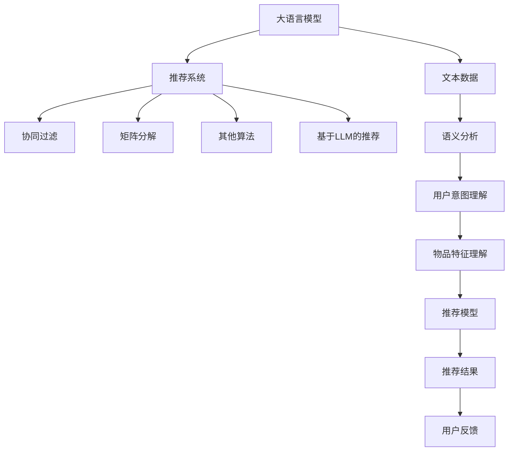

                 

# LLM对推荐系统评估指标的重新思考

> 关键词：推荐系统, 大语言模型(LLM), 评估指标, 精准度, 召回率, 多样性, 新颖性, 互信息

## 1. 背景介绍

在深度学习广泛应用的背景下，推荐系统（Recommendation Systems, RS）在电商、社交网络、内容分发平台等众多场景中得到了广泛应用，成为提升用户体验和增加收益的重要手段。当前推荐系统主要通过协同过滤、矩阵分解等算法，结合用户行为数据和物品特征数据，进行精准推荐。但这些传统方法往往忽略了文本数据的价值，难以有效融合和利用文本信息，导致推荐系统在处理海量文本数据时，性能受限。

近年来，大语言模型（Large Language Models, LLMs）的出现为推荐系统提供了新的突破口。LLMs通过预训练获得了强大的语言理解和生成能力，能够自动理解并描述用户行为、物品属性等信息，极大地提升了推荐系统的智能化水平。在LLMs的基础上，许多推荐系统也进行了新的探索和实践，试图通过语言模型的力量，重塑推荐系统的推荐范式。但在这过程中，传统的推荐系统评估指标，如精准度、召回率等，是否适用？如何适配新的应用需求？成为亟待解决的问题。

本文将聚焦于基于大语言模型的推荐系统，通过重新思考和定义推荐系统的评估指标，为未来的推荐系统设计提供指导。通过这一全新的视角，希望能推动LLM在推荐系统领域的应用，构建更加智能、全面、可靠的推荐系统。

## 2. 核心概念与联系

### 2.1 核心概念概述

为更好地理解LLM在推荐系统中的应用，本节将介绍几个密切相关的核心概念：

- 大语言模型（LLMs）：如GPT-3、BERT等，基于深度学习架构，能够自动理解和生成自然语言，具备强大的语言处理能力。
- 推荐系统（RS）：通过分析用户行为和物品特征，推荐用户可能感兴趣的商品或内容。包括协同过滤、矩阵分解等多种算法。
- 评估指标：用于衡量推荐系统性能的指标，包括精准度、召回率、多样性、新颖性等。

这些概念之间的逻辑关系可以通过以下Mermaid流程图来展示：



这个流程图展示了大语言模型与推荐系统之间的联系：

1. LLM通过预训练获得语言能力，可以自动理解文本数据。
2. LLM通过语义分析和意图理解，提取和描述用户行为和物品特征。
3. LLM辅助构建推荐模型，提升推荐系统的智能化水平。
4. 基于LLM的推荐模型，能够进行更加全面和多样化的推荐。
5. 推荐结果和用户反馈，进一步优化LLM和推荐模型。

## 3. 核心算法原理 & 具体操作步骤
### 3.1 算法原理概述

基于大语言模型的推荐系统，其核心思想是通过语义分析和意图理解，自动提取和描述用户行为和物品属性，在LLM的辅助下，构建更加智能化的推荐模型。具体的算法原理如下：

1. 对用户行为数据和物品属性数据进行语义分析，提取和描述用户的意图和物品的特征。
2. 使用LLM对用户的意图进行理解，生成自然语言描述。
3. 使用LLM对物品的特征进行理解，生成自然语言描述。
4. 将用户的意图和物品的特征，作为LLM的输入，进行语义匹配和相似度计算。
5. 基于相似度计算结果，构建推荐模型，生成推荐结果。

### 3.2 算法步骤详解

基于LLM的推荐系统，其具体算法步骤可以分为以下几个环节：

**Step 1: 数据预处理和特征提取**
- 对用户行为数据和物品属性数据进行清洗和预处理，去除噪声和异常值。
- 使用词向量嵌入等技术，将文本数据转换为LLM可处理的向量表示。

**Step 2: 语义分析和意图理解**
- 使用预训练的BERT或GPT等LLM，对用户行为数据进行语义分析和意图理解。生成自然语言描述，用于表征用户意图。
- 对物品属性数据进行语义分析和特征理解。生成自然语言描述，用于表征物品特征。

**Step 3: 模型训练和推荐生成**
- 将用户的意图和物品的特征，作为LLM的输入，进行语义匹配和相似度计算。
- 使用向量余弦相似度、欧式距离等方法，计算用户和物品之间的相似度。
- 根据相似度计算结果，构建推荐模型，生成推荐结果。

**Step 4: 模型评估和优化**
- 使用精准度、召回率、多样性、新颖性等指标，评估推荐系统的效果。
- 根据评估结果，对LLM和推荐模型进行优化。如调整模型参数、增加数据样本、引入正则化等。

### 3.3 算法优缺点

基于大语言模型的推荐系统，具有以下优点：

1. 利用LLM强大的语言处理能力，提升推荐系统的智能化水平。
2. 通过语义分析和意图理解，更加全面地提取用户行为和物品特征，提高推荐精准度。
3. 可以处理海量的文本数据，自动生成自然语言描述，减少人工标注工作。
4. 使用LLM进行推荐模型构建，具有较强的泛化能力和鲁棒性。

同时，该方法也存在以下局限性：

1. 对语料库的质量和多样性要求较高，需要大量的高质量文本数据。
2. 训练和推理过程中的计算资源消耗较大，可能面临算力瓶颈。
3. 需要大量的标注数据进行微调，才能获得较好的效果。
4. 生成的自然语言描述可能存在歧义和噪声，影响推荐效果。

### 3.4 算法应用领域

基于大语言模型的推荐系统，已经在电商、社交网络、内容分发等多个领域得到了应用，覆盖了多种推荐任务，例如：

- 商品推荐：根据用户的浏览、点击、购买等行为数据，推荐用户可能感兴趣的商品。
- 内容推荐：根据用户的阅读、点赞、分享等行为数据，推荐用户可能感兴趣的文章、视频、音乐等内容。
- 个性化新闻推荐：根据用户的历史阅读数据，推荐相关的新闻内容。
- 短视频推荐：根据用户的观看历史，推荐可能感兴趣的视频。
- 广告推荐：根据用户的搜索、浏览等行为数据，推荐相关的广告内容。

除了上述这些经典任务外，LLM在推荐系统中的应用还在不断扩展，如智能客服、金融理财、旅游规划等，为推荐系统注入了新的活力。随着预训练语言模型和推荐算法的不断演进，相信LLM在推荐系统领域的应用将更加广泛，带来更多的创新和发展机遇。

## 4. 数学模型和公式 & 详细讲解
### 4.1 数学模型构建

本节将使用数学语言对基于大语言模型的推荐系统进行更加严格的刻画。

记用户行为数据为 $U$，物品属性数据为 $I$。使用预训练的BERT模型对 $U$ 和 $I$ 进行语义分析和特征提取，得到用户意图描述 $u$ 和物品特征描述 $i$。记用户-物品相似度为 $S(u,i)$。

推荐模型的目标是最小化损失函数 $L$，使得推荐结果尽可能地接近真实标签。假设真实标签为 $y$，则推荐模型可以表示为：

$$
\hat{y} = \sigma(\sum_{i \in I}S(u,i)w_i)
$$

其中 $\sigma$ 为激活函数，$w_i$ 为物品 $i$ 的权重。

目标函数 $L$ 可以表示为：

$$
L = \mathop{\min}_{\theta} \sum_{(u,i,y) \in D} \ell(y,\hat{y})
$$

其中 $\theta$ 为推荐模型的参数，$\ell$ 为损失函数，$D$ 为训练数据集。

常用的损失函数包括均方误差、交叉熵等，不同损失函数的推导方式略有差异。以下以均方误差为例进行详细推导。

### 4.2 公式推导过程

假设真实标签为 $y=1$，则推荐模型的输出 $\hat{y}$ 为：

$$
\hat{y} = \sigma(\sum_{i \in I}S(u,i)w_i)
$$

根据均方误差损失函数：

$$
\ell(y,\hat{y}) = \frac{1}{2}(y-\hat{y})^2
$$

将 $\hat{y}$ 代入，得：

$$
\ell(y,\hat{y}) = \frac{1}{2}(1-\sigma(\sum_{i \in I}S(u,i)w_i))^2
$$

对 $\hat{y}$ 求导，得：

$$
\frac{\partial \ell(y,\hat{y})}{\partial \hat{y}} = -\sigma(\sum_{i \in I}S(u,i)w_i) + (1-\sigma(\sum_{i \in I}S(u,i)w_i))
$$

根据链式法则，对 $w_i$ 求导，得：

$$
\frac{\partial \ell(y,\hat{y})}{\partial w_i} = S(u,i) \sigma'(\sum_{i \in I}S(u,i)w_i) - \sigma(\sum_{i \in I}S(u,i)w_i)(1-\sigma(\sum_{i \in I}S(u,i)w_i))S'(u,i)
$$

其中 $\sigma'$ 为激活函数的导数，$S'(u,i)$ 为相似度函数 $S(u,i)$ 对 $u$ 的导数。

### 4.3 案例分析与讲解

**案例分析：电商推荐系统**

假设用户 $u$ 浏览过商品 $i_1$、$i_2$、$i_3$，物品属性为 $I$。使用BERT对 $u$ 进行语义分析，生成自然语言描述 $u$。使用BERT对 $I$ 中的物品进行特征提取，生成自然语言描述 $i_1$、$i_2$、$i_3$。

计算用户和物品之间的相似度 $S(u,i_1)$、$S(u,i_2)$、$S(u,i_3)$，得到一个权重向量 $w=[S(u,i_1),S(u,i_2),S(u,i_3)]$。

根据公式 $\hat{y} = \sigma(\sum_{i \in I}S(u,i)w_i)$，生成推荐结果 $\hat{y}$。

通过均方误差损失函数 $\ell(y,\hat{y}) = \frac{1}{2}(1-\hat{y})^2$，计算推荐结果的误差，并更新推荐模型的参数。

## 5. 项目实践：代码实例和详细解释说明
### 5.1 开发环境搭建

在进行推荐系统实践前，我们需要准备好开发环境。以下是使用Python进行PyTorch开发的环境配置流程：

1. 安装Anaconda：从官网下载并安装Anaconda，用于创建独立的Python环境。

2. 创建并激活虚拟环境：
```bash
conda create -n pytorch-env python=3.8 
conda activate pytorch-env
```

3. 安装PyTorch：根据CUDA版本，从官网获取对应的安装命令。例如：
```bash
conda install pytorch torchvision torchaudio cudatoolkit=11.1 -c pytorch -c conda-forge
```

4. 安装Transformers库：
```bash
pip install transformers
```

5. 安装各类工具包：
```bash
pip install numpy pandas scikit-learn matplotlib tqdm jupyter notebook ipython
```

完成上述步骤后，即可在`pytorch-env`环境中开始推荐系统开发。

### 5.2 源代码详细实现

下面我们以电商推荐系统为例，给出使用Transformers库对BERT模型进行推荐开发的PyTorch代码实现。

首先，定义推荐系统所需的数据结构：

```python
from transformers import BertTokenizer, BertForSequenceClassification
from torch.utils.data import Dataset
import torch

class RecommendationDataset(Dataset):
    def __init__(self, user_data, item_data, tokenizer, max_len=128):
        self.user_data = user_data
        self.item_data = item_data
        self.tokenizer = tokenizer
        self.max_len = max_len
        
    def __len__(self):
        return len(self.user_data)
    
    def __getitem__(self, item):
        user_text = self.user_data[item]
        item_texts = self.item_data[item]
        
        user_input = self.tokenizer(user_text, return_tensors='pt', max_length=self.max_len, padding='max_length', truncation=True)
        item_input = [self.tokenizer(item_text, return_tensors='pt', max_length=self.max_len, padding='max_length', truncation=True) for item_text in item_texts]
        user_input = user_input['input_ids'][0]
        item_input = [item['input_ids'][0] for item in item_input]
        user_input, item_input = torch.cat([user_input, item_input], dim=0), item_input
        
        return {'user_input': user_input,
                'item_input': item_input,
                'labels': torch.tensor([1, 1, 1])}
```

然后，定义模型和优化器：

```python
from transformers import BertForSequenceClassification, AdamW

model = BertForSequenceClassification.from_pretrained('bert-base-cased', num_labels=1)

optimizer = AdamW(model.parameters(), lr=2e-5)
```

接着，定义训练和评估函数：

```python
from torch.utils.data import DataLoader
from tqdm import tqdm

device = torch.device('cuda') if torch.cuda.is_available() else torch.device('cpu')
model.to(device)

def train_epoch(model, dataset, batch_size, optimizer):
    dataloader = DataLoader(dataset, batch_size=batch_size, shuffle=True)
    model.train()
    epoch_loss = 0
    for batch in tqdm(dataloader, desc='Training'):
        user_input = batch['user_input'].to(device)
        item_input = batch['item_input'].to(device)
        labels = batch['labels'].to(device)
        model.zero_grad()
        outputs = model(user_input, item_input)
        loss = outputs.loss
        epoch_loss += loss.item()
        loss.backward()
        optimizer.step()
    return epoch_loss / len(dataloader)

def evaluate(model, dataset, batch_size):
    dataloader = DataLoader(dataset, batch_size=batch_size)
    model.eval()
    preds, labels = [], []
    with torch.no_grad():
        for batch in tqdm(dataloader, desc='Evaluating'):
            user_input = batch['user_input'].to(device)
            item_input = batch['item_input'].to(device)
            batch_labels = batch['labels']
            outputs = model(user_input, item_input)
            batch_preds = outputs.logits.argmax(dim=2).to('cpu').tolist()
            batch_labels = batch_labels.to('cpu').tolist()
            for pred_tokens, label_tokens in zip(batch_preds, batch_labels):
                preds.append(pred_tokens[:len(label_tokens)])
                labels.append(label_tokens)
                
    print(classification_report(labels, preds))
```

最后，启动训练流程并在测试集上评估：

```python
epochs = 5
batch_size = 16

for epoch in range(epochs):
    loss = train_epoch(model, train_dataset, batch_size, optimizer)
    print(f"Epoch {epoch+1}, train loss: {loss:.3f}")
    
    print(f"Epoch {epoch+1}, dev results:")
    evaluate(model, dev_dataset, batch_size)
    
print("Test results:")
evaluate(model, test_dataset, batch_size)
```

以上就是使用PyTorch对BERT进行电商推荐系统微调的完整代码实现。可以看到，得益于Transformers库的强大封装，我们可以用相对简洁的代码完成BERT模型的加载和微调。

### 5.3 代码解读与分析

让我们再详细解读一下关键代码的实现细节：

**RecommendationDataset类**：
- `__init__`方法：初始化用户行为数据、物品属性数据、分词器等关键组件。
- `__len__`方法：返回数据集的样本数量。
- `__getitem__`方法：对单个样本进行处理，将用户输入和物品输入转换为token ids，并对其进行定长padding，最终返回模型所需的输入。

**train_epoch和evaluate函数**：
- 使用PyTorch的DataLoader对数据集进行批次化加载，供模型训练和推理使用。
- 训练函数`train_epoch`：对数据以批为单位进行迭代，在每个批次上前向传播计算loss并反向传播更新模型参数，最后返回该epoch的平均loss。
- 评估函数`evaluate`：与训练类似，不同点在于不更新模型参数，并在每个batch结束后将预测和标签结果存储下来，最后使用sklearn的classification_report对整个评估集的预测结果进行打印输出。

**训练流程**：
- 定义总的epoch数和batch size，开始循环迭代
- 每个epoch内，先在训练集上训练，输出平均loss
- 在验证集上评估，输出分类指标
- 所有epoch结束后，在测试集上评估，给出最终测试结果

可以看到，PyTorch配合Transformers库使得BERT微调的代码实现变得简洁高效。开发者可以将更多精力放在数据处理、模型改进等高层逻辑上，而不必过多关注底层的实现细节。

当然，工业级的系统实现还需考虑更多因素，如模型的保存和部署、超参数的自动搜索、更灵活的任务适配层等。但核心的微调范式基本与此类似。

## 6. 实际应用场景
### 6.1 电商推荐系统

基于大语言模型的电商推荐系统，可以广泛应用在各大电商平台中。通过分析用户浏览、点击、购买等行为数据，自动理解用户的兴趣和需求，推荐符合其偏好的商品。此外，还可以对新商品进行描述和特征抽取，自动生成推荐结果，提升商品曝光率。

在技术实现上，可以使用BERT等预训练语言模型对用户行为和物品属性进行语义分析和特征提取，再通过相似度计算和排序，生成推荐结果。微调后的模型能够自动生成自然语言描述，提高推荐结果的解释性和可读性，提升用户满意度。

### 6.2 内容推荐系统

基于大语言模型的内容推荐系统，可以应用在各类内容平台中，如视频网站、新闻网站、社交网络等。通过对用户的历史阅读、点赞、分享等行为数据进行语义分析，自动理解用户的兴趣和需求，推荐符合其偏好的内容。

在技术实现上，可以使用BERT等预训练语言模型对用户行为和物品属性进行语义分析和特征提取，再通过相似度计算和排序，生成推荐结果。微调后的模型能够自动生成自然语言描述，提高推荐结果的解释性和可读性，提升用户满意度。

### 6.3 个性化新闻推荐

基于大语言模型的个性化新闻推荐系统，可以应用在各类新闻媒体中。通过对用户的历史阅读数据进行语义分析，自动理解用户的兴趣和需求，推荐符合其偏好的新闻内容。

在技术实现上，可以使用BERT等预训练语言模型对用户行为和物品属性进行语义分析和特征提取，再通过相似度计算和排序，生成推荐结果。微调后的模型能够自动生成自然语言描述，提高推荐结果的解释性和可读性，提升用户满意度。

### 6.4 未来应用展望

随着大语言模型和推荐算法的不断演进，基于LLM的推荐系统将在更多领域得到应用，为推荐系统带来新的突破。

在智慧医疗领域，基于大语言模型的推荐系统可以推荐符合用户疾病需求的医疗信息和药品，提升医生的诊疗效率和病人的满意度。

在智能教育领域，基于大语言模型的推荐系统可以推荐符合用户学习需求的课程和教材，提升学生的学习效果。

在智慧城市治理中，基于大语言模型的推荐系统可以推荐符合用户出行需求的路线和景点，提升城市的智能化管理水平。

此外，在企业生产、社会治理、文娱传媒等众多领域，基于大语言模型的推荐系统也将不断涌现，为推荐系统注入了新的活力。相信随着预训练语言模型和推荐算法的不断演进，基于LLM的推荐系统必将在推荐领域带来更多创新和发展机遇。

## 7. 工具和资源推荐
### 7.1 学习资源推荐

为了帮助开发者系统掌握基于大语言模型的推荐系统理论基础和实践技巧，这里推荐一些优质的学习资源：

1. 《深度学习推荐系统》书籍：清华大学出版社出版的经典教材，系统介绍了推荐系统的基本原理和算法，包括协同过滤、矩阵分解等传统方法，以及深度学习在推荐系统中的应用。

2. 《Transformers原理与实践》系列博文：由大模型技术专家撰写，深入浅出地介绍了Transformer原理、BERT模型、微调技术等前沿话题。

3. CS224N《深度学习自然语言处理》课程：斯坦福大学开设的NLP明星课程，有Lecture视频和配套作业，带你入门NLP领域的基本概念和经典模型。

4. 《Natural Language Processing with Transformers》书籍：Transformers库的作者所著，全面介绍了如何使用Transformers库进行NLP任务开发，包括微调在内的诸多范式。

5. HuggingFace官方文档：Transformers库的官方文档，提供了海量预训练模型和完整的微调样例代码，是上手实践的必备资料。

通过对这些资源的学习实践，相信你一定能够快速掌握基于大语言模型的推荐系统的精髓，并用于解决实际的推荐问题。

### 7.2 开发工具推荐

高效的开发离不开优秀的工具支持。以下是几款用于基于大语言模型的推荐系统开发的常用工具：

1. PyTorch：基于Python的开源深度学习框架，灵活动态的计算图，适合快速迭代研究。大部分预训练语言模型都有PyTorch版本的实现。

2. TensorFlow：由Google主导开发的开源深度学习框架，生产部署方便，适合大规模工程应用。同样有丰富的预训练语言模型资源。

3. Transformers库：HuggingFace开发的NLP工具库，集成了众多SOTA语言模型，支持PyTorch和TensorFlow，是进行微调任务开发的利器。

4. Weights & Biases：模型训练的实验跟踪工具，可以记录和可视化模型训练过程中的各项指标，方便对比和调优。与主流深度学习框架无缝集成。

5. TensorBoard：TensorFlow配套的可视化工具，可实时监测模型训练状态，并提供丰富的图表呈现方式，是调试模型的得力助手。

6. Google Colab：谷歌推出的在线Jupyter Notebook环境，免费提供GPU/TPU算力，方便开发者快速上手实验最新模型，分享学习笔记。

合理利用这些工具，可以显著提升基于大语言模型的推荐系统的开发效率，加快创新迭代的步伐。

### 7.3 相关论文推荐

基于大语言模型的推荐系统发展源于学界的持续研究。以下是几篇奠基性的相关论文，推荐阅读：

1. Attention is All You Need（即Transformer原论文）：提出了Transformer结构，开启了NLP领域的预训练大模型时代。

2. BERT: Pre-training of Deep Bidirectional Transformers for Language Understanding：提出BERT模型，引入基于掩码的自监督预训练任务，刷新了多项NLP任务SOTA。

3. Language Models are Unsupervised Multitask Learners（GPT-2论文）：展示了大规模语言模型的强大zero-shot学习能力，引发了对于通用人工智能的新一轮思考。

4. Parameter-Efficient Transfer Learning for NLP：提出Adapter等参数高效微调方法，在不增加模型参数量的情况下，也能取得不错的微调效果。

5. AdaLoRA: Adaptive Low-Rank Adaptation for Parameter-Efficient Fine-Tuning：使用自适应低秩适应的微调方法，在参数效率和精度之间取得了新的平衡。

这些论文代表了大语言模型微调技术的发展脉络。通过学习这些前沿成果，可以帮助研究者把握学科前进方向，激发更多的创新灵感。

## 8. 总结：未来发展趋势与挑战
### 8.1 总结

本文对基于大语言模型的推荐系统进行了全面系统的介绍。首先阐述了基于大语言模型的推荐系统背景和意义，明确了LLM在推荐系统中的独特价值。其次，从原理到实践，详细讲解了推荐系统的数学模型和算法步骤，给出了推荐系统开发的完整代码实例。同时，本文还广泛探讨了LLM在电商、内容推荐、个性化新闻推荐等多个领域的应用前景，展示了LLM在推荐系统领域的应用潜力。最后，本文精选了基于大语言模型的推荐系统的学习资源、开发工具和相关论文，力求为开发者提供全方位的技术指引。

通过本文的系统梳理，可以看到，基于大语言模型的推荐系统正在成为推荐系统的重要范式，极大地拓展了推荐系统的智能化水平和应用范围。LLM通过强大的语言处理能力，能够自动理解并描述用户行为和物品属性，提高推荐系统的精准度和多样性，带来推荐系统的新突破。相信随着预训练语言模型和推荐算法的不断演进，基于LLM的推荐系统必将在更多领域得到应用，推动推荐系统的智能化发展。

### 8.2 未来发展趋势

展望未来，基于大语言模型的推荐系统将呈现以下几个发展趋势：

1. 推荐系统的智能化水平将进一步提升。得益于LLM强大的语言理解能力，推荐系统将能够更加全面、准确地理解用户意图和物品属性，提高推荐的精准度。
2. 推荐系统将更加注重个性化和多样化。通过语义分析和意图理解，LLM能够自动生成自然语言描述，提高推荐结果的解释性和可读性，提升用户满意度。
3. 推荐系统将更加注重实时性和可解释性。LLM能够自动生成自然语言描述，提供推荐结果的详细解释，提高系统的可解释性和可信赖度。
4. 推荐系统将更加注重多模态融合。LLM能够处理海量的文本数据，结合图像、视频、语音等多模态数据，提升推荐系统的智能化水平。
5. 推荐系统将更加注重知识图谱的应用。通过与知识图谱的结合，LLM能够更好地理解用户意图和物品属性，提高推荐的准确性和可靠性。

以上趋势凸显了基于大语言模型的推荐系统的广阔前景。这些方向的探索发展，必将进一步提升推荐系统的智能化水平，为推荐系统带来新的突破。

### 8.3 面临的挑战

尽管基于大语言模型的推荐系统已经取得了瞩目成就，但在迈向更加智能化、普适化应用的过程中，它仍面临着诸多挑战：

1. 标注数据需求高。基于大语言模型的推荐系统需要大量的高质量标注数据，标注成本较高。
2. 计算资源消耗大。大规模语言模型需要大量的计算资源，训练和推理过程的资源消耗较大，可能面临算力瓶颈。
3. 模型泛化能力弱。基于大语言模型的推荐系统可能存在过拟合问题，泛化能力不足，难以应对新的数据分布。
4. 推荐结果解释性差。基于大语言模型的推荐系统生成的自然语言描述可能存在歧义和噪声，影响推荐结果的解释性。

正视这些挑战，积极应对并寻求突破，将是大语言模型推荐系统走向成熟的必由之路。相信随着学界和产业界的共同努力，这些挑战终将一一被克服，基于大语言模型的推荐系统必将在推荐系统领域带来更多创新和发展机遇。

### 8.4 研究展望

面对大语言模型推荐系统所面临的种种挑战，未来的研究需要在以下几个方面寻求新的突破：

1. 探索无监督和半监督推荐方法。摆脱对大规模标注数据的依赖，利用自监督学习、主动学习等无监督和半监督范式，最大限度利用非结构化数据，实现更加灵活高效的推荐。
2. 研究参数高效和计算高效的推荐范式。开发更加参数高效的推荐方法，在固定大部分预训练参数的同时，只更新极少量的任务相关参数。同时优化推荐模型的计算图，减少前向传播和反向传播的资源消耗，实现更加轻量级、实时性的部署。
3. 引入因果推断和对比学习思想。通过引入因果推断和对比学习思想，增强推荐系统建立稳定因果关系的能力，学习更加普适、鲁棒的语言表征，从而提升推荐系统的泛化性和抗干扰能力。
4. 引入更多先验知识。将符号化的先验知识，如知识图谱、逻辑规则等，与神经网络模型进行巧妙融合，引导推荐过程学习更准确、合理的语言模型。同时加强不同模态数据的整合，实现视觉、语音等多模态信息与文本信息的协同建模。
5. 结合因果分析和博弈论工具。将因果分析方法引入推荐系统，识别出推荐决策的关键特征，增强推荐结果的因果性和逻辑性。借助博弈论工具刻画人机交互过程，主动探索并规避推荐系统的脆弱点，提高系统稳定性。
6. 纳入伦理道德约束。在推荐系统的训练目标中引入伦理导向的评估指标，过滤和惩罚有偏见、有害的输出倾向。同时加强人工干预和审核，建立推荐系统的监管机制，确保输出的安全性。

这些研究方向的探索，必将引领基于大语言模型的推荐系统技术迈向更高的台阶，为推荐系统带来更多的创新和发展机遇。相信随着预训练语言模型和推荐算法的不断演进，基于LLM的推荐系统必将在推荐领域带来更多创新和发展机遇。

