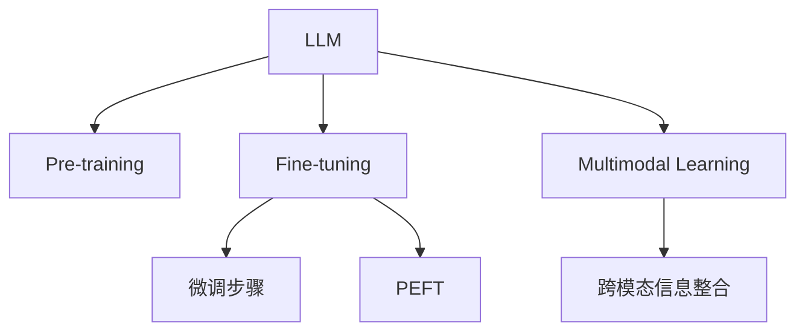

                 

# LLM生态圈:人工智能产业新格局

> 关键词：大语言模型(LLM),AI产业,生态系统,行业应用,未来发展

## 1. 背景介绍

### 1.1 问题由来
随着深度学习技术的飞速发展，人工智能(AI)产业经历了翻天覆地的变化。特别是在自然语言处理(NLP)领域，大语言模型(LLM)技术的突破，为AI应用打开了新的天地。LLM不仅具备强大的语言理解与生成能力，还能够实现跨领域的知识迁移，显著提升下游任务的效果。

近年来，大语言模型在问答、翻译、文本生成、对话系统等领域展现了卓越的性能。以GPT-3、BERT、T5为代表的大模型，已经在多个NLP任务上刷新了最先进性能记录。这些模型在预训练阶段通常使用大规模无标签文本数据，学习通用的语言知识。在此基础上，通过微调对特定任务进行适配，快速实现功能扩展。

然而，大语言模型和微调技术的发展仍面临诸多挑战，如高昂的预训练和微调成本、数据依赖性强、模型鲁棒性不足等。这些问题亟需从技术、应用、生态等多个维度进行全面审视，构建一个健康繁荣的LLM生态圈，推动AI产业的健康发展。

## 2. 核心概念与联系

### 2.1 核心概念概述

为深入理解LLM生态圈，本节介绍几个关键概念：

- **大语言模型(LLM)**：指能够处理大规模自然语言数据，具备强大语言理解与生成能力的人工智能模型。如GPT-3、BERT、T5等，具有自回归、自编码等架构，通过大规模预训练和微调，可适用于各种NLP任务。
- **预训练(Pre-training)**：指在大规模无标签文本数据上进行自监督学习，学习通用的语言知识和表示，提高模型的泛化能力。
- **微调(Fine-tuning)**：指在预训练模型的基础上，使用下游任务的标注数据进行有监督学习，对特定任务进行适配，提升模型在该任务上的性能。
- **迁移学习(Transfer Learning)**：指将模型在其他领域学到的知识迁移到新任务中，以更少的标注数据提升模型性能。
- **参数高效微调(Parameter-Efficient Fine-Tuning, PEFT)**：指在微调过程中，仅更新部分参数，保持预训练模型的权重不变，提升微调效率。
- **多模态学习(Multimodal Learning)**：指模型能够处理包括文本、图像、语音在内的多种模态数据，实现跨模态的信息整合。

这些概念间的关系可以通过以下Mermaid流程图来展示：



这个流程图展现了LLM生态圈中各个核心概念之间的逻辑关系：预训练和微调构成LLM模型的基础架构，参数高效和多模态学习是提升模型性能的重要手段。

## 3. 核心算法原理 & 具体操作步骤
### 3.1 算法原理概述

基于大语言模型的生态圈构建，旨在通过预训练和微调技术，最大化模型的泛化能力和应用范围。预训练过程在大规模无标签文本数据上进行，学习通用的语言知识，形成强有力的语言表示。在此基础上，微调过程通过有监督学习，将模型适配到具体的下游任务，提升模型在特定任务上的表现。

### 3.2 算法步骤详解

构建LLM生态圈的主要步骤如下：

**Step 1: 数据准备与预训练**

1. **数据收集与处理**：收集大规模无标签文本数据，并进行预处理，如分词、去噪等。
2. **构建预训练模型**：选择合适的模型架构，如自回归或自编码，并使用预训练技术在大规模数据上进行训练。
3. **评估与保存**：在验证集上评估模型性能，保存预训练后的模型参数。

**Step 2: 任务适配与微调**

1. **任务定义**：明确下游任务的目标和需求，选择适合的输出格式和损失函数。
2. **构建微调模型**：在预训练模型基础上添加任务适配层，并设置微调参数。
3. **微调训练**：使用下游任务的标注数据进行微调训练，更新模型参数。
4. **评估与优化**：在验证集上评估模型性能，调整超参数。

**Step 3: 应用部署与迭代**

1. **模型部署**：将微调后的模型部署到实际应用场景中，如智能客服、金融舆情分析、个性化推荐等。
2. **数据收集与反馈**：在实际应用中收集用户反馈和数据，用于进一步训练和优化模型。
3. **持续学习**：定期更新预训练数据和微调模型，保持模型的时效性和适应性。

### 3.3 算法优缺点

大语言模型和微调技术的优缺点如下：

**优点：**

- **泛化能力强**：通过预训练学习到通用的语言知识，能较好地适应不同领域和任务。
- **适应性广**：微调过程可以针对具体任务进行适配，提升模型性能。
- **迁移学习能力强**：能在少量标注数据上进行训练，减少标注成本。
- **参数高效**：可通过参数高效微调技术，减少模型更新过程中的计算资源消耗。

**缺点：**

- **依赖高质量数据**：微调效果高度依赖于标注数据的质量和数量。
- **鲁棒性不足**：对数据分布和噪声的敏感度较高，泛化能力有待提升。
- **模型复杂**：大模型参数量大，计算和存储成本高。
- **可解释性差**：预训练和微调过程的黑盒特性，导致模型难以解释。

## 4. 数学模型和公式 & 详细讲解  
### 4.1 数学模型构建

大语言模型的数学模型通常基于神经网络架构，如Transformer。其输入为自然语言文本，输出为语言的表示或生成。数学模型包括编码器-解码器结构，每个组件包含多个注意力机制和全连接层。

### 4.2 公式推导过程

以Transformer为例，其基本公式如下：

$$
\begin{align*}
\text{Attention}(Q, K, V) &= \text{Softmax}(Q K^T / \sqrt{d_k}) V \\
\text{MultiHeadAttention}(Q, K, V) &= \text{Concat}(heads_i(Q K^T / \sqrt{d_k})) \text{Softmax}(\text{Concat}(heads_i(K^T) (heads_i(Q))) / \sqrt{d_k}) \text{Concat}(heads_i(V))) \\
\text{PositionalEncoding}(x) &= x + \text{sin}(\frac{2\pi i}{d_{model}} \cdot pos/E) + \text{cos}(\frac{2\pi i}{d_{model}} \cdot 2pos/E)
\end{align*}
$$

其中，$Q$、$K$、$V$分别代表查询、键、值向量，$d_k$为键向量的维度，$d_{model}$为模型的整体维度。$\text{Softmax}$为归一化函数，$\text{Concat}$为拼接操作。

### 4.3 案例分析与讲解

以BERT模型为例，其预训练任务主要包括掩码语言模型和下一句预测。掩码语言模型的目标是在输入的文本中随机选择部分单词进行掩码，模型需要预测被掩码的单词。下一句预测任务是给定一对句子，判断其顺序关系。这些任务帮助BERT学习到丰富的语言知识。

## 5. 项目实践：代码实例和详细解释说明
### 5.1 开发环境搭建

构建LLM生态圈需要进行大量的模型训练和微调，因此需要搭建高效的开发环境。本节介绍一些常用的开发工具和环境。

1. **Python**：大语言模型和微调通常使用Python进行开发。Python具有丰富的科学计算库和机器学习框架，适合模型训练和优化。
2. **PyTorch和TensorFlow**：这两个深度学习框架支持模型构建和训练，具有高效的计算图和丰富的优化器选择。
3. **HuggingFace Transformers库**：提供了多种大模型的预训练代码和微调接口，方便开发者进行实验和应用。
4. **Docker和Kubernetes**：使用容器化和Kubernetes进行模型部署和扩展，可以保证模型的稳定性和可管理性。

### 5.2 源代码详细实现

以BERT微调为例，使用HuggingFace库进行代码实现。

```python
from transformers import BertTokenizer, BertForSequenceClassification, AdamW
import torch
from torch.utils.data import Dataset, DataLoader

# 定义数据集
class NERDataset(Dataset):
    def __init__(self, texts, tags, tokenizer):
        self.tokenizer = tokenizer
        self.texts = texts
        self.tags = tags
        
    def __len__(self):
        return len(self.texts)
        
    def __getitem__(self, idx):
        text = self.texts[idx]
        tag = self.tags[idx]
        
        encoding = self.tokenizer(text, return_tensors='pt')
        input_ids = encoding['input_ids']
        attention_mask = encoding['attention_mask']
        labels = [tag2id[tag] for tag in tag]
        
        return {
            'input_ids': input_ids,
            'attention_mask': attention_mask,
            'labels': torch.tensor(labels, dtype=torch.long)
        }

# 初始化模型和优化器
model = BertForSequenceClassification.from_pretrained('bert-base-cased', num_labels=2)
tokenizer = BertTokenizer.from_pretrained('bert-base-cased')
optimizer = AdamW(model.parameters(), lr=2e-5)

# 加载数据集并进行微调训练
train_dataset = NERDataset(train_texts, train_tags, tokenizer)
val_dataset = NERDataset(dev_texts, dev_tags, tokenizer)
test_dataset = NERDataset(test_texts, test_tags, tokenizer)

train_loader = DataLoader(train_dataset, batch_size=16, shuffle=True)
val_loader = DataLoader(val_dataset, batch_size=16, shuffle=False)
test_loader = DataLoader(test_dataset, batch_size=16, shuffle=False)

for epoch in range(5):
    model.train()
    for batch in train_loader:
        input_ids = batch['input_ids'].to(device)
        attention_mask = batch['attention_mask'].to(device)
        labels = batch['labels'].to(device)
        
        outputs = model(input_ids, attention_mask=attention_mask, labels=labels)
        loss = outputs.loss
        optimizer.zero_grad()
        loss.backward()
        optimizer.step()
    
    model.eval()
    with torch.no_grad():
        eval_loss = 0
        eval_acc = 0
        for batch in val_loader:
            input_ids = batch['input_ids'].to(device)
            attention_mask = batch['attention_mask'].to(device)
            labels = batch['labels'].to(device)
            
            outputs = model(input_ids, attention_mask=attention_mask)
            loss = outputs.loss
            eval_loss += loss.item()
            logits = outputs.logits
            predictions = torch.argmax(logits, dim=1)
            eval_acc += (predictions == labels).float().mean().item()
        
        print(f"Epoch {epoch+1}, Val Loss: {eval_loss/len(val_loader):.4f}, Val Acc: {eval_acc/len(val_loader):.4f}")

# 测试模型性能
model.eval()
with torch.no_grad():
    eval_loss = 0
    eval_acc = 0
    for batch in test_loader:
        input_ids = batch['input_ids'].to(device)
        attention_mask = batch['attention_mask'].to(device)
        labels = batch['labels'].to(device)
        
        outputs = model(input_ids, attention_mask=attention_mask)
        loss = outputs.loss
        eval_loss += loss.item()
        logits = outputs.logits
        predictions = torch.argmax(logits, dim=1)
        eval_acc += (predictions == labels).float().mean().item()
        
print(f"Test Loss: {eval_loss/len(test_loader):.4f}, Test Acc: {eval_acc/len(test_loader):.4f}")
```

### 5.3 代码解读与分析

**NERDataset类**：
- `__init__`方法：初始化数据集，包含文本和标签。
- `__len__`方法：返回数据集的样本数量。
- `__getitem__`方法：处理单个样本，将文本输入编码为token ids，将标签编码为数字，并对其进行定长padding，最终返回模型所需的输入。

**模型和优化器**：
- `BertForSequenceClassification`：定义微调任务，如命名实体识别。
- `BertTokenizer`：定义BERT模型的分词器，负责将文本转换为模型可以接受的输入。
- `AdamW`：定义优化器，用于更新模型参数。

**训练过程**：
- 定义训练集、验证集和测试集，构建数据加载器。
- 循环进行模型训练，在训练集上更新模型参数。
- 在验证集上评估模型性能，调整学习率。
- 在测试集上测试模型性能。

## 6. 实际应用场景
### 6.1 智能客服系统

智能客服系统是大语言模型和微调技术的重要应用场景之一。传统的客服系统需要大量人工参与，响应速度慢，服务质量难以保证。利用微调技术，可以构建基于大语言模型的智能客服系统，实现全天候在线服务。

**案例分析**：
某电商公司使用微调后的BERT模型作为智能客服系统的基础，结合用户历史行为数据和自然语言处理技术，提供自动化的客服解决方案。系统根据用户提出的问题，自动匹配最佳答案，并进行回译，生成自然流畅的回复。此外，系统还能根据用户情绪和语境，提供更个性化的服务体验，提升用户满意度。

### 6.2 金融舆情监测

金融舆情监测是大语言模型在金融领域的重要应用之一。金融市场数据量大、复杂度高，传统的基于规则的监测方法难以满足需求。利用微调技术，可以构建基于大语言模型的金融舆情监测系统，实现实时监控和预警。

**案例分析**：
某银行使用微调后的BERT模型，对社交媒体、新闻报道等大量金融文本数据进行情感分析和主题识别，实时监测市场舆情变化。系统通过分析文本中的情感倾向和关键词，及时发现负面信息，生成预警报告，帮助银行快速应对风险。

### 6.3 个性化推荐系统

个性化推荐系统是大语言模型在电商、内容推荐等领域的重要应用。传统的推荐系统依赖用户历史行为数据，难以满足个性化需求。利用微调技术，可以构建基于大语言模型的推荐系统，提升推荐效果。

**案例分析**：
某视频平台使用微调后的BERT模型，对用户浏览、评论、分享等行为数据进行文本分析，提取用户兴趣点。结合模型预测的兴趣匹配度，生成个性化推荐列表，提升用户留存率和满意度。

### 6.4 未来应用展望

未来，大语言模型和微调技术将在更多领域得到应用，为各行各业带来变革性影响。

- **智慧医疗**：微调技术可以用于医疗问答、病历分析、药物研发等，提升医疗服务的智能化水平。
- **智能教育**：微调技术可以用于作业批改、学情分析、知识推荐等，因材施教，促进教育公平。
- **智慧城市治理**：微调技术可以用于城市事件监测、舆情分析、应急指挥等环节，提高城市管理的自动化和智能化水平。
- **企业生产**：微调技术可以用于智能客服、财务分析、供应链管理等，提升企业运营效率和客户满意度。
- **社会治理**：微调技术可以用于舆情监测、公共安全、智慧交通等，提升社会治理能力。

## 7. 工具和资源推荐
### 7.1 学习资源推荐

为了帮助开发者掌握大语言模型和微调技术，以下是一些优质的学习资源：

1. **《深度学习》教材**：由Goodfellow等编著，是深度学习领域的经典教材，涵盖NLP等前沿技术。
2. **CS224N《深度学习自然语言处理》课程**：斯坦福大学开设的NLP明星课程，提供Lecture视频和配套作业，适合入门NLP领域的基本概念和经典模型。
3. **《Transformer从原理到实践》系列博文**：由大模型技术专家撰写，深入浅出地介绍Transformer原理、BERT模型、微调技术等前沿话题。
4. **HuggingFace官方文档**：提供多种大模型的预训练代码和微调接口，方便开发者进行实验和应用。
5. **CLUE开源项目**：提供大量中文NLP数据集，并提供了基于微调的baseline模型，助力中文NLP技术发展。

### 7.2 开发工具推荐

- **PyTorch和TensorFlow**：深度学习领域的主流框架，支持模型构建和训练。
- **HuggingFace Transformers库**：提供多种大模型的预训练代码和微调接口，方便开发者进行实验和应用。
- **Docker和Kubernetes**：容器化和Kubernetes进行模型部署和扩展，可以保证模型的稳定性和可管理性。
- **TensorBoard**：TensorFlow配套的可视化工具，可实时监测模型训练状态，并提供丰富的图表呈现方式。

### 7.3 相关论文推荐

大语言模型和微调技术的发展得益于学界的持续研究。以下是几篇奠基性的相关论文，推荐阅读：

1. **Attention is All You Need**：提出Transformer结构，开启NLP领域的预训练大模型时代。
2. **BERT: Pre-training of Deep Bidirectional Transformers for Language Understanding**：提出BERT模型，引入基于掩码的自监督预训练任务，刷新多项NLP任务SOTA。
3. **Language Models are Unsupervised Multitask Learners**：展示了大规模语言模型的强大zero-shot学习能力，引发对通用人工智能的新一轮思考。
4. **Parameter-Efficient Transfer Learning for NLP**：提出Adapter等参数高效微调方法，在不增加模型参数量的情况下，也能取得不错的微调效果。
5. **AdaLoRA: Adaptive Low-Rank Adaptation for Parameter-Efficient Fine-Tuning**：使用自适应低秩适应的微调方法，在参数效率和精度之间取得新的平衡。
6. **AdaFew: Training Transfer Learning Models with Multiple Scenarios for Few-shot Learning**：提出AdaFew方法，通过多个场景的微调，提高模型的少样本学习能力。

这些论文代表了大语言模型微调技术的发展脉络。通过学习这些前沿成果，可以帮助研究者把握学科前进方向，激发更多的创新灵感。

## 8. 总结：未来发展趋势与挑战
### 8.1 研究成果总结

大语言模型和微调技术自问世以来，取得了瞩目的成绩，推动了NLP领域的技术进步和应用落地。其主要研究成果包括：

- **预训练技术**：通过大规模无标签数据训练，学习通用的语言知识，提升模型的泛化能力。
- **微调方法**：通过有监督学习，将模型适配到特定任务，提升模型在特定任务上的性能。
- **参数高效微调**：通过只更新部分参数，降低计算资源消耗，提高微调效率。
- **多模态学习**：模型能够处理文本、图像、语音等多种模态数据，实现跨模态的信息整合。

### 8.2 未来发展趋势

展望未来，大语言模型和微调技术将呈现以下几个发展趋势：

1. **规模化发展**：预训练模型的规模将进一步扩大，参数量将达到数十亿甚至百亿级别，提供更加丰富和精确的语言表示。
2. **高效化探索**：参数高效微调、计算高效训练等方法将被进一步研究，降低预训练和微调过程中的计算成本。
3. **跨模态融合**：多模态学习技术将被广泛应用，增强模型对不同类型数据的处理能力。
4. **持续学习**：模型将在实际应用中不断学习新知识，保持性能的稳定性和时效性。
5. **无监督学习**：无监督学习和半监督学习方法将得到更多研究，减少对标注数据的需求。
6. **伦理与安全**：模型训练和应用中的伦理和安全问题将受到更多关注，确保模型的公平性、透明性和安全性。

### 8.3 面临的挑战

尽管大语言模型和微调技术取得了巨大成功，但在其发展过程中也面临一些挑战：

1. **标注成本高**：大规模标注数据的高成本是制约微调技术发展的瓶颈。
2. **模型鲁棒性不足**：模型对噪声和分布变化的敏感性较高，泛化能力有限。
3. **计算资源消耗大**：预训练和微调过程计算资源消耗大，硬件需求高。
4. **模型可解释性差**：预训练和微调过程的黑盒特性，导致模型难以解释。
5. **安全风险**：模型可能会学习到有害信息，存在安全隐患。

### 8.4 研究展望

面向未来，大语言模型和微调技术需要在以下几个方面进行突破：

1. **无监督学习**：探索无监督学习和半监督学习方法，减少对标注数据的依赖。
2. **高效化探索**：研究高效化微调方法和计算技术，降低预训练和微调过程中的计算成本。
3. **跨模态融合**：研究跨模态信息整合技术，提升模型对多类型数据的处理能力。
4. **持续学习**：研究持续学习技术，确保模型在实际应用中的稳定性和时效性。
5. **伦理与安全**：研究模型训练和应用中的伦理和安全问题，确保模型的公平性、透明性和安全性。
6. **可解释性**：研究模型的可解释性技术，提高模型决策的透明性和可解释性。

通过不断突破这些挑战，大语言模型和微调技术将进一步提升其应用效果和普适性，为各行各业带来更广泛的应用价值。

## 9. 附录：常见问题与解答

**Q1：如何选择合适的预训练模型？**

A: 选择合适的预训练模型需要考虑以下几个因素：
1. **任务相关性**：选择与下游任务相关的预训练模型，如文本分类选择BERT，对话系统选择GPT。
2. **数据规模**：考虑预训练数据的规模，大模型通常泛化能力更强，但需要更多的计算资源。
3. **领域适配性**：考虑预训练模型是否经过特定领域的预训练，如中文领域选择中文预训练模型。
4. **参数量**：考虑模型的参数量，参数量大通常性能更好，但计算资源消耗也更高。

**Q2：微调过程中如何避免过拟合？**

A: 避免过拟合可以采取以下策略：
1. **数据增强**：通过回译、近义替换等方式扩充训练集。
2. **正则化**：使用L2正则、Dropout、Early Stopping等避免过拟合。
3. **对抗训练**：引入对抗样本，提高模型鲁棒性。
4. **参数高效微调**：只调整部分参数，保持预训练模型的权重不变。

**Q3：如何提高微调模型的鲁棒性？**

A: 提高模型鲁棒性可以采取以下策略：
1. **数据增强**：通过回译、近义替换等方式扩充训练集。
2. **对抗训练**：引入对抗样本，提高模型鲁棒性。
3. **多模态学习**：融合文本、图像、语音等多种模态数据，增强模型的泛化能力。
4. **持续学习**：定期更新预训练数据和微调模型，保持模型的时效性和适应性。

**Q4：如何优化微调模型的计算效率？**

A: 优化计算效率可以采取以下策略：
1. **参数高效微调**：只调整部分参数，保持预训练模型的权重不变。
2. **计算图优化**：优化模型的计算图，减少前向传播和反向传播的资源消耗。
3. **硬件加速**：使用GPU、TPU等高性能设备进行模型训练和推理。
4. **模型压缩**：使用模型压缩技术，减小模型尺寸，提高推理速度。

**Q5：如何提升微调模型的可解释性？**

A: 提升模型可解释性可以采取以下策略：
1. **可解释性模型**：选择可解释性强的模型，如决策树、逻辑回归等。
2. **模型可视化**：使用模型可视化工具，了解模型的决策过程。
3. **解释性输出**：输出模型决策的关键特征，解释模型推理逻辑。
4. **因果分析**：引入因果分析方法，识别模型的脆弱点，提高系统稳定性。

通过不断优化和突破，大语言模型和微调技术将进一步提升其应用效果和普适性，为各行各业带来更广泛的应用价值。未来，随着技术的不断演进，大语言模型和微调技术将进一步拓展其应用边界，推动人工智能技术的产业化进程。

