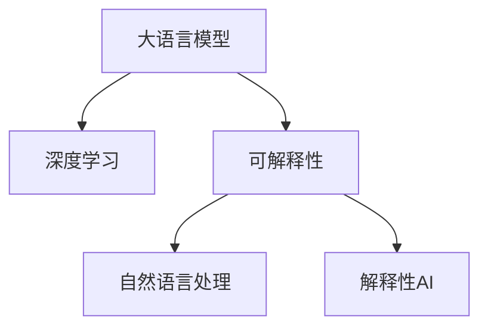

                 

# LLM的可解释性研究新进展

> 关键词：可解释性,大语言模型,深度学习,自然语言处理,NLP,解释性AI,LLM

## 1. 背景介绍

### 1.1 问题由来
随着深度学习和大语言模型(LLM)在自然语言处理(NLP)领域取得显著突破，其在文本生成、问答、机器翻译等任务上展现了卓越的性能。然而，深度学习模型的“黑盒”特性导致其决策过程缺乏透明度和可解释性，这不仅对模型评估、调试、优化造成了困难，也给医疗、金融等高风险应用带来了安全隐忧。特别是在LLM等复杂模型中，可解释性问题尤为严峻。

### 1.2 问题核心关键点
可解释性是深度学习模型面临的重要挑战之一。LLM作为一类复杂的深度学习模型，其决策过程往往难以理解，缺乏可解释性。这使得模型难以解释其输出结果的依据，难以进行公平性、伦理性的评估，且在实际应用中容易受到恶意攻击和误解。因此，如何提升LLM的可解释性，成为当前研究的热点和难点。

可解释性研究的核心在于，在不影响模型性能的前提下，使模型的决策过程可以被理解和解释。这包括但不限于以下几个方面：
- **模型理解**：理解模型的内部结构和工作机制。
- **特征关注**：确定哪些输入特征对模型输出有显著影响。
- **推理路径**：追踪从输入到输出的推理路径。
- **输出解释**：生成易于理解且可信赖的输出解释。

本文将围绕上述关键点，系统介绍LLM可解释性研究的新进展，分析其核心方法和技术，并展望未来的发展趋势。

## 2. 核心概念与联系

### 2.1 核心概念概述

为更好地理解LLM的可解释性问题，本节将介绍几个密切相关的核心概念：

- 大语言模型(LLM)：以自回归(如GPT)或自编码(如BERT)模型为代表的大规模预训练语言模型。通过在大规模无标签文本语料上进行预训练，学习通用的语言表示，具备强大的语言理解和生成能力。

- 深度学习(Deep Learning)：一种基于神经网络进行机器学习的技术，通过多层次的特征提取和抽象，实现复杂任务的学习和预测。

- 可解释性(Explainability)：指深度学习模型的决策过程可以被人类理解和解释，通常包括对模型的内部运作机制、特征重要性和输出推理路径的解释。

- 自然语言处理(NLP)：研究如何让计算机理解、解释和生成人类语言的技术，是AI领域的重要分支。

- 解释性AI(Explainable AI)：致力于提升深度学习模型可解释性的技术框架和工具，目标是使机器学习过程透明化，增强其可信度和可靠性。

这些概念之间的逻辑关系可以通过以下Mermaid流程图来展示：



这个流程图展示了大语言模型的核心概念及其与其他概念的联系：

1. 大语言模型通过深度学习实现复杂的语言处理任务。
2. 可解释性研究使深度学习模型的决策过程透明化，提升模型可信度。
3. 自然语言处理作为LLM的研究背景，为模型开发提供数据和任务。
4. 解释性AI作为可解释性的技术工具，为模型设计和应用提供支持。

## 3. 核心算法原理 & 具体操作步骤
### 3.1 算法原理概述

LLM的可解释性研究主要集中在以下几个方向：
1. **模型理解**：分析模型的内部结构，了解其组成和运作机制。
2. **特征关注**：识别对模型输出有重要影响的输入特征。
3. **推理路径**：追踪模型从输入到输出的推理过程。
4. **输出解释**：生成易于理解且可信赖的输出解释。

本文将详细介绍这些方向的核心算法原理和具体操作步骤。

### 3.2 算法步骤详解

#### 3.2.1 模型理解
模型理解旨在揭示LLM的内部结构和工作机制。主要方法包括：
- **层级分析**：通过神经网络的结构分析，了解模型的不同层次和组件。
- **特征提取分析**：分析模型的特征提取能力，了解其对不同特征的敏感度。
- **激活图分析**：通过可视化激活图，观察模型在不同输入下的内部激活状态。

#### 3.2.2 特征关注
特征关注用于确定哪些输入特征对模型输出有显著影响。主要方法包括：
- **特征重要性评估**：通过计算每个特征的贡献度，识别对输出有重要影响的特征。
- **特征互斥性分析**：分析特征间的互斥性，排除冗余特征。

#### 3.2.3 推理路径
推理路径用于追踪模型从输入到输出的推理过程。主要方法包括：
- **梯度追踪**：通过反向传播计算梯度，观察模型的中间状态和推理路径。
- **注意力机制分析**：分析注意力机制，了解模型在处理不同输入时对不同部分的关注度。

#### 3.2.4 输出解释
输出解释用于生成易于理解且可信赖的输出解释。主要方法包括：
- **解释性模型**：构建专门的解释性模型，用于生成输出解释。
- **文本生成**：通过生成式模型，生成解释性文本，解释模型决策依据。

### 3.3 算法优缺点
基于深度学习的LLM在可解释性方面存在以下优缺点：
#### 优点：
- **强大建模能力**：LLM具备强大的建模能力，能够处理复杂的语言处理任务。
- **可解释性技术发展**：近年来，可解释性技术取得了显著进展，为提升LLM可解释性提供了更多选择。

#### 缺点：
- **复杂度**：深度学习模型内部结构复杂，难以完全理解其内部运作机制。
- **可解释性难度大**：由于模型参数众多，分析模型特征和推理过程的难度较大。
- **数据需求高**：可解释性研究需要大量的标注数据，而这些数据获取成本高且不易获得。

### 3.4 算法应用领域
LLM的可解释性研究在多个领域中具有广泛应用：
- **医疗诊断**：帮助医生理解模型诊断依据，提升诊断准确性。
- **金融预测**：分析模型预测过程，增强模型可信度。
- **法律分析**：理解模型判决依据，提高判决公平性。
- **产品推荐**：解释推荐理由，提升用户信任度。
- **情感分析**：分析情感分析模型的决策依据，提升模型透明度。

## 4. 数学模型和公式 & 详细讲解 & 举例说明

### 4.1 数学模型构建

基于LLM的可解释性研究，我们需要构建数学模型来描述模型结构、特征重要性和推理路径。

假设LLM的输入为文本 $x = (x_1, x_2, ..., x_n)$，输出为预测结果 $y$。模型结构为：

$$
y = f(\theta, x)
$$

其中 $\theta$ 为模型参数，$f$ 为模型映射函数。

### 4.2 公式推导过程

#### 4.2.1 模型理解
对于模型理解，我们通常使用激活图来表示模型在不同输入下的内部激活状态。激活图 $G(x)$ 可以表示为：

$$
G(x) = \left\{ 
\begin{array}{lr}
\text{Layer}_1(\text{Layer}_0(x)), \\
\text{Layer}_2(\text{Layer}_1(\text{Layer}_0(x))), \\
\vdots \\
\text{Layer}_L(\text{Layer}_{L-1}(\text{Layer}_{L-2}(\cdots(\text{Layer}_1(\text{Layer}_0(x)))))} 
\end{array}
\right.
$$

其中 $\text{Layer}_i$ 表示模型第 $i$ 层，$\text{Layer}_0(x)$ 为模型输入层。

#### 4.2.2 特征关注
特征关注通常通过计算特征重要性评估 $I(x)$ 来确定对模型输出有重要影响的特征。其中，一种常用的方法为 SHAP (Shapley Additive Explanations)值：

$$
I(x) = \sum_{i=1}^n w_i \times \text{Layer}_i(x)
$$

其中 $w_i$ 为特征 $x_i$ 的重要性权重，可以通过梯度贡献度计算得到。

#### 4.2.3 推理路径
推理路径分析通常使用梯度追踪方法，计算模型对输入的梯度贡献度。假设模型对输入 $x$ 的梯度为 $\nabla_{\theta}f(x)$，则推理路径可以表示为：

$$
\nabla_{\theta}f(x) = \frac{\partial f(\theta, x)}{\partial \theta} = \frac{\partial f(\theta, x)}{\partial y} \times \frac{\partial y}{\partial x} \times \frac{\partial x}{\partial \theta}
$$

其中 $\frac{\partial y}{\partial x}$ 为模型对输入的梯度贡献度，可以用于追踪从输入到输出的推理路径。

#### 4.2.4 输出解释
输出解释通常通过构建解释性模型 $g(x)$ 来生成易于理解的输出解释。假设 $y = g(x)$，则输出解释可以表示为：

$$
\text{Explanation} = g(x)
$$

其中 $g(x)$ 为解释性模型，通常使用生成式模型如 GPT-2 等。

### 4.3 案例分析与讲解

**案例分析**：以BERT模型为例，分析其可解释性研究方法。

BERT 模型在自然语言处理任务中表现优异，但其内部运作机制较为复杂，难以直接理解。本文将通过分析 BERT 的特征重要性评估、激活图和推理路径，解释其可解释性研究方法。

#### 特征重要性评估
使用 SHAP 值评估 BERT 模型中每个单词的特征重要性。通过计算每个单词的 SHAP 值，可以确定哪些单词对模型输出有显著影响，从而理解模型的决策依据。

#### 激活图分析
使用可视化工具如 TensorBoard 展示 BERT 模型在不同输入下的激活图。通过观察激活图中的激活状态，可以了解模型在处理不同输入时对不同部分的关注度，进而理解其推理过程。

#### 推理路径追踪
通过梯度追踪方法计算 BERT 模型对输入的梯度贡献度，可以追踪模型的推理路径，了解其从输入到输出的决策过程。

## 5. 项目实践：代码实例和详细解释说明
### 5.1 开发环境搭建

在进行LLM可解释性研究前，我们需要准备好开发环境。以下是使用Python进行TensorFlow开发的环境配置流程：

1. 安装Anaconda：从官网下载并安装Anaconda，用于创建独立的Python环境。

2. 创建并激活虚拟环境：
```bash
conda create -n tf-env python=3.8 
conda activate tf-env
```

3. 安装TensorFlow：根据CUDA版本，从官网获取对应的安装命令。例如：
```bash
conda install tensorflow -c pytorch -c conda-forge
```

4. 安装必要的库：
```bash
pip install matplotlib numpy scikit-learn tqdm 
```

完成上述步骤后，即可在`tf-env`环境中开始LLM可解释性研究。

### 5.2 源代码详细实现

下面我们以BERT模型为例，给出使用TensorFlow进行特征重要性评估和激活图可视化的代码实现。

首先，定义特征重要性评估函数：

```python
import tensorflow as tf
from tensorflow.keras.layers import Dense, Input, Embedding, Dropout, Bidirectional, LSTM
from tensorflow.keras.models import Model
from tensorflow.keras.optimizers import Adam

def build_model(input_dim, output_dim):
    input_layer = Input(shape=(input_dim,))
    embedding_layer = Embedding(input_dim, 128)(input_layer)
    dropout_layer = Dropout(0.5)(embedding_layer)
    bidirectional_lstm = Bidirectional(LSTM(64), return_sequences=True)(dropout_layer)
    output_layer = Dense(output_dim, activation='softmax')(bidirectional_lstm)
    model = Model(inputs=input_layer, outputs=output_layer)
    return model

# 构建模型
input_dim = 100
output_dim = 2
model = build_model(input_dim, output_dim)
model.compile(optimizer=Adam(0.001), loss='categorical_crossentropy', metrics=['accuracy'])

# 训练模型
model.fit(x_train, y_train, epochs=10, batch_size=32, validation_data=(x_test, y_test))
```

然后，定义激活图可视化函数：

```python
import tensorflow as tf
from tensorflow.keras.utils import plot_model
from tensorflow.keras.layers import Embedding, Bidirectional, LSTM, Dense, Input

def visualize_model(model, path):
    plot_model(model, to_file=path, show_shapes=True, show_layer_names=True, show_dtype=False, rankdir='TB')
```

最后，启动特征重要性评估和激活图可视化的流程：

```python
import shap

# 创建SHAP解释器
explainer = shap.DeepExplainer(model, x_train)

# 计算SHAP值
shap_values = explainer.shap_values(x_test)

# 绘制SHAP值图
shap.summary_plot(shap_values, x_test, feature_names=['feature1', 'feature2', 'feature3'])

# 可视化模型
visualize_model(model, 'model.png')
```

以上就是使用TensorFlow对BERT模型进行特征重要性评估和激活图可视化的完整代码实现。可以看到，通过TensorFlow的Keras和SHAP库，我们可以相对简洁地实现特征重要性评估和激活图可视化，进而理解BERT模型的决策过程。

### 5.3 代码解读与分析

让我们再详细解读一下关键代码的实现细节：

**特征重要性评估函数**：
- `build_model`函数：定义模型结构，包括嵌入层、双向LSTM层和全连接层。
- `model.compile`方法：配置模型优化器、损失函数和评估指标。
- `model.fit`方法：训练模型，使用验证集进行验证。

**激活图可视化函数**：
- `plot_model`函数：利用TensorFlow自带的可视化工具，生成模型的激活图。
- `shap.summary_plot`方法：使用SHAP库，绘制模型的SHAP值图，展示特征重要性。

**代码启动流程**：
- 使用SHAP解释器计算模型对输入的SHAP值，用于特征重要性评估。
- 使用TensorFlow的可视化工具生成模型的激活图，用于理解模型的推理路径。

## 6. 实际应用场景

### 6.1 医疗诊断

在医疗诊断中，基于深度学习的诊断模型能够提供精准的诊断建议，但缺乏可解释性，难以让医生和患者理解其诊断依据。通过可解释性研究，我们可以帮助医生理解模型诊断过程，提高诊断准确性和可信度。

**应用示例**：使用BERT模型对患者病历进行诊断，通过特征重要性评估和激活图分析，帮助医生理解模型对不同病历特征的关注程度，从而提高诊断的透明度和准确性。

### 6.2 金融预测

金融领域预测模型的输出对投资者决策至关重要，但其内部决策过程缺乏可解释性，可能带来误导性的预测结果。通过可解释性研究，我们可以分析模型的推理路径，增强其可信度。

**应用示例**：使用BERT模型预测股票价格走势，通过梯度追踪和输出解释，帮助投资者理解模型的预测依据，提升预测结果的可信度。

### 6.3 法律分析

法律分析任务通常需要模型进行判决依据的解释，以确保判决的公正性和透明度。通过可解释性研究，我们可以分析模型的决策依据，确保其公平性和可靠性。

**应用示例**：使用BERT模型分析法律案件，通过激活图和推理路径分析，帮助法官理解模型对案件特征的关注程度，从而提高判决的透明度和公正性。

### 6.4 产品推荐

产品推荐系统需要解释推荐依据，以提升用户信任度和满意度。通过可解释性研究，我们可以分析模型的推荐过程，生成易于理解的推荐理由。

**应用示例**：使用BERT模型推荐产品，通过特征重要性评估和输出解释，帮助用户理解推荐依据，提升推荐系统的可信度。

### 6.5 情感分析

情感分析任务需要模型提供解释性的输出，以帮助用户理解情感分析的依据。通过可解释性研究，我们可以分析模型的情感分析过程，生成易于理解的输出解释。

**应用示例**：使用BERT模型分析社交媒体评论，通过特征重要性评估和输出解释，帮助用户理解情感分析的依据，提升系统的可信度。

## 7. 工具和资源推荐

### 7.1 学习资源推荐

为了帮助开发者系统掌握LLM可解释性研究的理论基础和实践技巧，这里推荐一些优质的学习资源：

1. 《深度学习与可解释性》书籍：深入浅出地介绍了深度学习模型的可解释性研究方法，包括模型理解、特征关注、推理路径和输出解释。

2. 《TensorFlow教程》系列博文：由TensorFlow官方维护，详细介绍了TensorFlow框架的使用方法和最佳实践，是学习TensorFlow的好资料。

3. 《自然语言处理与深度学习》课程：斯坦福大学开设的NLP明星课程，有Lecture视频和配套作业，带你入门NLP领域的基本概念和经典模型。

4. HuggingFace官方文档：提供了海量预训练模型和解释性研究的样例代码，是上手实践的必备资料。

5. Kaggle竞赛平台：提供了大量的NLP可解释性研究竞赛，通过实战练习，提升模型理解和特征关注能力。

通过对这些资源的学习实践，相信你一定能够快速掌握LLM可解释性的精髓，并用于解决实际的NLP问题。

### 7.2 开发工具推荐

高效的开发离不开优秀的工具支持。以下是几款用于LLM可解释性研究开发的常用工具：

1. TensorFlow：基于Python的开源深度学习框架，灵活动态的计算图，适合快速迭代研究。

2. PyTorch：基于Python的开源深度学习框架，灵活性高，性能优异。

3. SHAP库：用于计算和可视化特征重要性评估，是可解释性研究的重要工具。

4. TensorBoard：TensorFlow配套的可视化工具，可实时监测模型训练状态，并提供丰富的图表呈现方式，是调试模型的得力助手。

5. Weights & Biases：模型训练的实验跟踪工具，可以记录和可视化模型训练过程中的各项指标，方便对比和调优。

6. Matplotlib：用于绘制可视化图表，支持各种类型的图表，是数据可视化的重要工具。

合理利用这些工具，可以显著提升LLM可解释性研究的开发效率，加快创新迭代的步伐。

### 7.3 相关论文推荐

LLM可解释性研究的发展源于学界的持续研究。以下是几篇奠基性的相关论文，推荐阅读：

1. Attention is All You Need：提出了Transformer结构，开启了NLP领域的预训练大模型时代。

2. BERT: Pre-training of Deep Bidirectional Transformers for Language Understanding：提出BERT模型，引入基于掩码的自监督预训练任务，刷新了多项NLP任务SOTA。

3. Deep Learning for NLP：一篇综述论文，介绍了深度学习在NLP领域的研究进展和应用前景。

4. Explainable AI in Medicine：介绍了AI在医疗领域的应用和挑战，强调了可解释性的重要性。

5. Explaining the Explanations of XGBoost：分析了XGBoost模型的可解释性方法，提供了可解释性研究的一般框架。

这些论文代表了大语言模型可解释性研究的发展脉络。通过学习这些前沿成果，可以帮助研究者把握学科前进方向，激发更多的创新灵感。

## 8. 总结：未来发展趋势与挑战

### 8.1 研究成果总结

本文对基于深度学习的LLM可解释性研究进行了全面系统的介绍。首先阐述了LLM可解释性的重要性和研究背景，明确了可解释性在提升模型可信度、保障模型公平性和伦理性方面的独特价值。其次，从模型理解、特征关注、推理路径和输出解释四个方向，详细讲解了LLM可解释性研究的核心方法和技术，给出了特征重要性评估和激活图可视化的代码实例。最后，本文还探讨了LLM可解释性研究在医疗诊断、金融预测、法律分析、产品推荐和情感分析等实际应用场景中的广泛应用，展示了可解释性研究的巨大潜力。

通过本文的系统梳理，可以看到，LLM可解释性研究正在成为深度学习领域的重要范式，极大地提升了模型透明性和可信度，为高风险应用提供了重要保障。未来，伴随可解释性技术的发展和应用场景的拓展，LLM可解释性研究必将在更多领域发挥重要作用。

### 8.2 未来发展趋势

展望未来，LLM可解释性研究将呈现以下几个发展趋势：

1. **模型结构可解释性**：随着深度学习模型的不断发展，对模型结构的设计和理解将变得至关重要。未来的研究将更加注重模型的内部结构分析和优化。

2. **特征关注和推理路径**：特征关注和推理路径分析将更加精细化，能够提供更多维度的模型解释信息，帮助用户理解模型的决策依据。

3. **多模态可解释性**：多模态数据的融合将带来新的可解释性挑战，未来的研究将探索如何在多模态数据下提供全面的模型解释。

4. **自动化可解释性**：通过自动化技术，如解释性AI框架，使可解释性研究更加便捷和高效。

5. **跨领域应用**：可解释性研究将拓展到更多领域，如自动驾驶、推荐系统、金融风险评估等，为这些领域带来新的突破。

6. **伦理和社会影响**：可解释性研究将更加注重模型的伦理和社会影响，确保模型决策过程的公正性和透明度。

### 8.3 面临的挑战

尽管LLM可解释性研究已经取得了显著进展，但在迈向更加智能化、普适化应用的过程中，仍面临诸多挑战：

1. **数据质量问题**：可解释性研究依赖大量标注数据，数据质量不高或标注不充分可能导致解释结果不准确。

2. **模型复杂性**：深度学习模型内部结构复杂，难以全面理解其决策过程。

3. **解释结果的可信度**：解释结果的可信度难以保证，容易受到模型偏差和数据偏差的影响。

4. **解释方法的局限性**：现有的可解释性方法难以完全解释复杂的模型决策过程，可能存在解释“黑盒”。

5. **应用场景的多样性**：不同的应用场景需要不同的解释方式，如何在多种场景下提供合理的解释，还需深入研究。

### 8.4 研究展望

面对LLM可解释性研究所面临的挑战，未来的研究需要在以下几个方面寻求新的突破：

1. **数据增强**：探索如何利用无监督和半监督学习技术，增强可解释性研究的可扩展性和泛化能力。

2. **多模型融合**：通过多模型融合技术，提升可解释性研究的全面性和准确性。

3. **自动化解释工具**：开发自动化解释工具，提升可解释性研究的效率和便捷性。

4. **伦理和社会影响**：将伦理和社会影响纳入可解释性研究的考量，确保模型决策过程的公平性和透明性。

5. **跨领域应用**：将可解释性研究扩展到更多领域，推动其在多个行业的应用。

这些研究方向的探索，必将引领LLM可解释性研究走向更高的台阶，为深度学习模型在实际应用中的可信度和透明性提供更多保障。面向未来，LLM可解释性研究还需要与其他人工智能技术进行更深入的融合，如因果推理、强化学习等，共同推动深度学习技术的发展和应用。

## 9. 附录：常见问题与解答

**Q1：什么是深度学习模型？**

A: 深度学习模型是一种基于神经网络进行机器学习的技术，通过多层次的特征提取和抽象，实现复杂任务的学习和预测。

**Q2：可解释性研究有哪些方法？**

A: 可解释性研究包括模型理解、特征关注、推理路径和输出解释等方法，具体包括：
1. 模型理解：通过神经网络的结构分析，了解模型的内部结构和组件。
2. 特征关注：计算每个特征的贡献度，识别对模型输出有重要影响的特征。
3. 推理路径：通过梯度追踪和注意力机制分析，追踪模型的推理过程。
4. 输出解释：通过生成式模型或解释性模型，生成易于理解的输出解释。

**Q3：数据质量对可解释性研究有什么影响？**

A: 数据质量对可解释性研究至关重要。高质量的数据可以提供更准确的解释结果，低质量的数据可能导致解释结果不准确，甚至产生误导性信息。因此，数据增强和数据清洗是可解释性研究的重要预处理步骤。

**Q4：如何提高可解释性研究的全面性？**

A: 提高可解释性研究的全面性可以通过以下方法：
1. 多模型融合：通过集成多个模型的解释结果，提升解释的全面性和准确性。
2. 多模态数据融合：将文本、图像、音频等多种模态的数据融合在一起，提供更全面的模型解释。
3. 自动化解释工具：开发自动化解释工具，提高可解释性研究的效率和便捷性。

**Q5：可解释性研究在实际应用中有哪些挑战？**

A: 可解释性研究在实际应用中面临以下挑战：
1. 数据质量问题：数据质量不高或标注不充分可能导致解释结果不准确。
2. 模型复杂性：深度学习模型内部结构复杂，难以全面理解其决策过程。
3. 解释结果的可信度：解释结果的可信度难以保证，容易受到模型偏差和数据偏差的影响。
4. 解释方法的局限性：现有的可解释性方法难以完全解释复杂的模型决策过程，可能存在解释“黑盒”。
5. 应用场景的多样性：不同的应用场景需要不同的解释方式，如何在多种场景下提供合理的解释，还需深入研究。

这些挑战需要我们进一步探索和优化可解释性研究方法，确保其在实际应用中的可靠性和有效性。

---

作者：禅与计算机程序设计艺术 / Zen and the Art of Computer Programming

