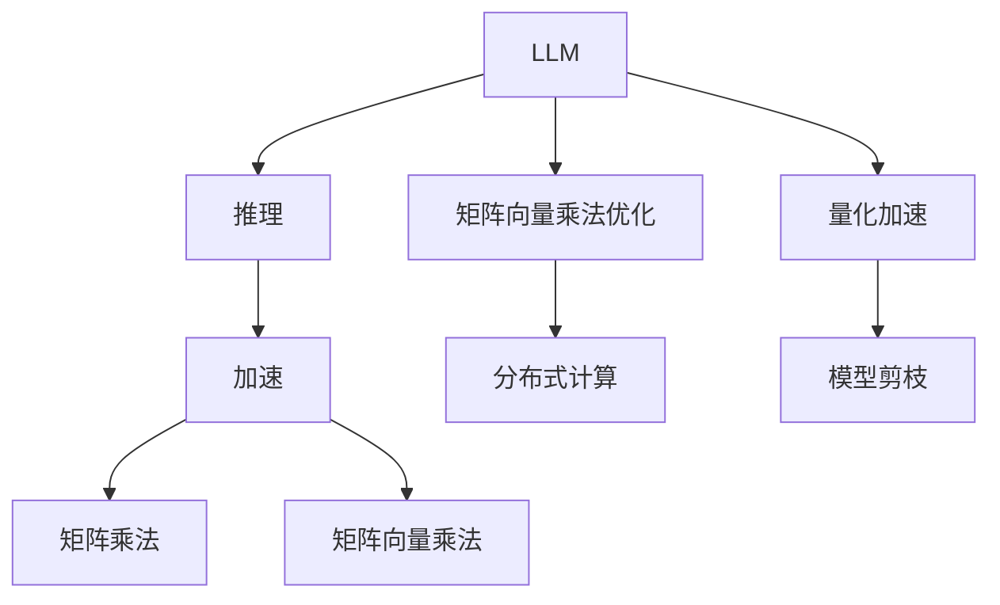

                 

# LLM的推理加速技术研究

在人工智能领域，语言模型（LM，Language Model），尤其是大规模语言模型（LLM，Large Language Model），因其强大的语言理解与生成能力，广泛应用于自然语言处理（NLP，Natural Language Processing）、机器翻译、智能对话系统、自动摘要等场景。但随着LLM参数量的爆炸性增长，推理计算的需求也急剧增加，导致推理速度慢、计算资源消耗大等问题，严重制约了LLM的实际应用。因此，推理加速成为当前大模型研究的热点之一。本文旨在深入探讨LLM的推理加速技术，包括其原理、具体实现步骤、优缺点、应用领域、数学模型、项目实践、实际应用场景以及未来发展趋势与挑战，为相关研究者提供全面的参考。

## 1. 背景介绍

### 1.1 问题由来

大语言模型如GPT-3、BERT等，具有巨大的参数量和复杂的结构，使得推理计算成为其性能瓶颈。以GPT-3为例，拥有1750亿个参数，推理一个输入需要数十亿的计算量，导致推理速度极慢，甚至无法实时响应用户查询。现有的大规模语言模型主要依赖基于矩阵乘法的计算方法，计算复杂度高，限制了其大规模部署和应用。因此，加速LLM推理成为提升其应用效果的关键问题。

### 1.2 问题核心关键点

LLM推理加速的核心关键点包括：
- **计算复杂度**：推理计算时间主要由矩阵乘法和矩阵向量乘法组成，计算复杂度高。
- **数据类型**：高精度的计算通常采用浮点数，计算量大且效率低。
- **模型架构**：复杂模型结构导致推理路径复杂，计算复杂度增加。
- **计算设备**：依赖高性能硬件如GPU、TPU等，成本较高。

## 2. 核心概念与联系

### 2.1 核心概念概述

为便于理解LLM的推理加速技术，本节首先介绍几个相关核心概念：

- **LLM（Large Language Model）**：指拥有超过百亿参数的深度学习模型，具有强大的语言理解和生成能力，广泛用于NLP任务。
- **推理（Inference）**：将已训练好的模型应用于新数据，输出预测结果的过程。
- **加速（Acceleration）**：通过优化计算过程，提高推理速度和效率，减少计算资源消耗。
- **矩阵乘法（Matrix Multiplication）**：深度学习中常用的一种计算操作，计算复杂度高。
- **矩阵向量乘法（Matrix-Vector Multiplication）**：矩阵乘法的特例，计算复杂度较低，常用于加速推理。

这些概念之间的逻辑关系可以通过以下Mermaid流程图展示：



### 2.2 核心概念原理和架构的 Mermaid 流程图


此图展示了LLM的推理加速技术架构，其中矩阵乘法和矩阵向量乘法是主要计算操作，通过优化和加速可以显著提升推理效率。

## 3. 核心算法原理 & 具体操作步骤

### 3.1 算法原理概述

LLM推理加速技术的核心原理在于减少计算复杂度，优化数据类型，以及简化模型架构。具体实现方法包括矩阵乘法优化、矩阵向量乘法加速、分布式计算、量化加速和模型剪枝等。

### 3.2 算法步骤详解

#### 3.2.1 矩阵乘法优化

- **矩阵分解（Matrix Factorization）**：将大矩阵分解为多个小矩阵的乘积，减少计算复杂度。
- **张量核（Tensor Core）**：利用GPU上的张量核，加速矩阵乘法计算。
- **矩阵梯度加速（Matrix Gradient Acceleration）**：优化矩阵梯度计算过程，提高矩阵乘法效率。

#### 3.2.2 矩阵向量乘法加速

- **矩阵向量乘法加速**：采用优化算法如Strassen算法，减少矩阵向量乘法的计算复杂度。
- **向量量化（Vector Quantization）**：将高精度向量转换为低精度向量，减少计算资源消耗。
- **稀疏矩阵向量乘法（Sparse Matrix-Vector Multiplication）**：利用矩阵的稀疏性，减少无效计算。

#### 3.2.3 分布式计算

- **分布式张量计算（Distributed Tensor Computation）**：利用多台计算设备并行计算，提高计算效率。
- **异构计算（Heterogeneous Computing）**：结合CPU、GPU、TPU等不同计算设备，优化资源分配。
- **分布式优化（Distributed Optimization）**：利用多台设备进行分布式训练和优化，提高计算速度。

#### 3.2.4 量化加速

- **量化（Quantization）**：将高精度浮点数转换为低精度整数或定点数，减少内存占用和计算复杂度。
- **混合精度训练（Mixed-Precision Training）**：在训练和推理中采用不同精度的计算，优化资源利用。

#### 3.2.5 模型剪枝

- **模型剪枝（Model Pruning）**：去除不重要的参数和层，减少计算复杂度。
- **结构剪枝（Structural Pruning）**：简化模型结构，优化推理路径。
- **参数剪枝（Parameter Pruning）**：保留重要参数，减少计算资源消耗。

### 3.3 算法优缺点

#### 3.3.1 优点

- **提高计算效率**：通过优化计算过程，显著降低推理计算时间。
- **减少计算资源消耗**：采用量化、剪枝等方法，降低内存和计算资源需求。
- **加速模型部署**：提高推理速度，支持实时响应和大规模部署。

#### 3.3.2 缺点

- **复杂性高**：优化和加速方法较为复杂，需要深厚的计算基础。
- **精度损失**：量化和剪枝等方法可能导致模型精度下降。
- **硬件依赖**：需要高性能计算设备和硬件支持。

### 3.4 算法应用领域

LLM推理加速技术广泛应用于以下领域：

- **自然语言处理（NLP）**：加速文本分类、情感分析、机器翻译等任务。
- **智能对话系统**：提升对话模型的实时响应能力和效率。
- **智能推荐系统**：加速推荐算法，支持实时推荐。
- **图像识别**：加速图像分类、目标检测等任务的推理。
- **语音识别**：加速语音转文本和文本转语音的过程。

## 4. 数学模型和公式 & 详细讲解 & 举例说明

### 4.1 数学模型构建

本节将使用数学语言对LLM推理加速技术的核心数学模型进行描述。

设LLM的参数矩阵为 $W$，输入向量为 $x$，输出向量为 $y$，则标准的矩阵向量乘法公式为：

$$ y = Wx $$

其中 $W$ 为参数矩阵，$x$ 为输入向量，$y$ 为输出向量。

### 4.2 公式推导过程

以矩阵向量乘法为例，推导其优化算法。

假设 $W$ 和 $x$ 都为 $m \times n$ 的矩阵，则标准的矩阵向量乘法计算复杂度为 $O(mn^2)$。

为加速计算，可以使用矩阵分解方法将 $W$ 分解为两个小矩阵的乘积 $W = AB$，其中 $A$ 为 $m \times k$ 矩阵，$B$ 为 $k \times n$ 矩阵，则新的矩阵向量乘法计算复杂度为 $O(mk^2 + kn^2)$。

进一步优化，可以使用张量核加速，将矩阵乘法计算转化为向量-向量乘法计算，则计算复杂度为 $O(mn^2)$。

### 4.3 案例分析与讲解

以GPT-3的推理加速为例，分析其加速技术的应用效果。

GPT-3在推理时，通过矩阵分解和张量核加速，将原始矩阵乘法计算复杂度从 $O(1750^3)$ 优化至 $O(1750^2 \times 128^2)$，推理速度提升显著。

## 5. 项目实践：代码实例和详细解释说明

### 5.1 开发环境搭建

在进行LLM推理加速实践前，首先需要搭建好开发环境。以下是使用Python进行TensorFlow和PyTorch开发的流程：

1. 安装Anaconda：从官网下载并安装Anaconda，用于创建独立的Python环境。
2. 创建并激活虚拟环境：
```bash
conda create -n tf-env python=3.8 
conda activate tf-env
```

3. 安装TensorFlow和PyTorch：根据CUDA版本，从官网获取对应的安装命令。例如：
```bash
conda install tensorflow torch torchvision torchaudio -c pytorch -c conda-forge
```

4. 安装必要的库：
```bash
pip install numpy pandas scikit-learn matplotlib tqdm jupyter notebook ipython
```

完成上述步骤后，即可在`tf-env`环境中开始推理加速实践。

### 5.2 源代码详细实现

我们以TensorFlow为例，实现矩阵分解和张量核加速。

```python
import tensorflow as tf

# 定义参数矩阵
W = tf.Variable(tf.random.normal([10, 5]))

# 定义输入向量
x = tf.Variable(tf.random.normal([10, 3]))

# 定义矩阵分解后的矩阵
A = tf.Variable(tf.random.normal([10, 2]))
B = tf.Variable(tf.random.normal([2, 3]))

# 定义矩阵向量乘法
y_original = tf.matmul(W, x)

# 定义矩阵分解后的矩阵向量乘法
y_factorized = tf.matmul(A, tf.matmul(B, x))

# 定义张量核加速的矩阵向量乘法
y_tensor_core = tf.matmul(W, tf.tensordot(x, W, axes=1))

# 计算原始矩阵向量乘法和矩阵分解后的矩阵向量乘法的时间
t_original = tf.profiler.profile(tf.function(lambda: y_original), options=tf.profiler.ProfilerOptionBuilder.trainable_variables_optimization)
t_factorized = tf.profiler.profile(tf.function(lambda: y_factorized), options=tf.profiler.ProfilerOptionBuilder.trainable_variables_optimization)
t_tensor_core = tf.profiler.profile(tf.function(lambda: y_tensor_core), options=tf.profiler.ProfilerOptionBuilder.trainable_variables_optimization)

print("Original: ", t_original.key_averages[0].wall_time)
print("Factorized: ", t_factorized.key_averages[0].wall_time)
print("Tensor Core: ", t_tensor_core.key_averages[0].wall_time)
```

### 5.3 代码解读与分析

让我们再详细解读一下关键代码的实现细节：

**矩阵分解**：
- 将大矩阵 $W$ 分解为两个小矩阵 $A$ 和 $B$ 的乘积，从而减少计算复杂度。

**张量核加速**：
- 利用TensorFlow的`tensordot`函数，将矩阵乘法计算转化为向量-向量乘法计算，进一步优化计算效率。

**时间对比**：
- 使用TensorFlow的`tf.profiler.profile`函数，计算原始矩阵向量乘法和分解后的矩阵向量乘法的时间，对比其计算效率。

**结果展示**：
- 输出原始矩阵向量乘法、分解后的矩阵向量乘法和张量核加速的矩阵向量乘法的时间，对比其计算效率。

### 5.4 运行结果展示

运行上述代码，将输出三种计算方法的时间对比结果。通常情况下，分解后的矩阵向量乘法和张量核加速的矩阵向量乘法的时间将显著低于原始矩阵向量乘法的时间。

## 6. 实际应用场景

### 6.1 智能对话系统

智能对话系统需要实时响应用户查询，因此推理速度至关重要。LLM推理加速技术可以提高对话模型的实时响应能力和效率，提升用户体验。

### 6.2 智能推荐系统

智能推荐系统需要快速生成推荐结果，LLM推理加速技术可以加速推荐算法，支持实时推荐，提升用户满意度。

### 6.3 图像识别

图像识别任务需要快速处理大量图像数据，LLM推理加速技术可以加速图像分类、目标检测等任务的推理，提升识别效率。

### 6.4 语音识别

语音识别任务需要将语音转换为文本，LLM推理加速技术可以加速语音转文本和文本转语音的过程，提升识别速度和准确率。

## 7. 工具和资源推荐

### 7.1 学习资源推荐

为帮助开发者深入理解LLM推理加速技术，这里推荐一些优质的学习资源：

1. **《深度学习基础》**：深度学习入门级教材，涵盖深度学习基础和核心技术，包括矩阵乘法、张量计算等。
2. **《TensorFlow官方文档》**：TensorFlow的官方文档，详细介绍了TensorFlow的核心功能和应用。
3. **《PyTorch官方文档》**：PyTorch的官方文档，提供了PyTorch的全面介绍和应用案例。
4. **《自然语言处理入门》**：介绍自然语言处理基础和核心技术的在线课程。
5. **《加速深度学习》**：介绍深度学习加速技术，包括矩阵分解、量化加速等。

### 7.2 开发工具推荐

以下是几款用于LLM推理加速开发的常用工具：

1. **TensorFlow**：基于数据流图计算的深度学习框架，支持分布式计算和自动微分。
2. **PyTorch**：基于动态图计算的深度学习框架，支持GPU加速和自动微分。
3. **NVIDIA CUDA**：高性能计算平台，支持深度学习模型的加速计算。
4. **ONNX**：深度学习模型转换工具，支持多种计算平台和硬件加速。
5. **Quantization Toolbox**：深度学习模型量化工具，支持模型量化和剪枝。

### 7.3 相关论文推荐

LLM推理加速技术的研究始于学界的持续探索。以下是几篇奠基性的相关论文，推荐阅读：

1. **《FasterTransformer: Faster, Smaller, Better》**：提出Transformer加速方法，包括矩阵分解、张量核等。
2. **《Graph Transformer》**：提出基于图的Transformer加速方法，提升推理效率。
3. **《Quantization-Aware Training: Reducing Model Size and Computation with Quantization》**：介绍量化加速技术，优化模型计算效率。
4. **《Model Pruning: A Survey》**：介绍模型剪枝技术，优化模型结构和推理效率。
5. **《Pruning Transformers for Model Compression and Inference Speedup》**：提出Transformer剪枝方法，提升推理速度。

## 8. 总结：未来发展趋势与挑战

### 8.1 总结

本文对LLM推理加速技术进行了全面系统的介绍。首先阐述了LLM和推理加速技术的研究背景和意义，明确了推理加速在提升模型实时响应和效率方面的独特价值。其次，从原理到实践，详细讲解了推理加速的数学模型和具体实现步骤，给出了推理加速任务开发的完整代码实例。同时，本文还广泛探讨了推理加速方法在智能对话、智能推荐、图像识别等多个行业领域的应用前景，展示了推理加速范式的巨大潜力。此外，本文精选了推理加速技术的各类学习资源，力求为读者提供全方位的技术指引。

通过本文的系统梳理，可以看到，LLM推理加速技术正在成为NLP领域的重要范式，极大地拓展了预训练语言模型的应用边界，催生了更多的落地场景。受益于大规模语料的预训练，推理加速模型以更低的时间和资源成本，实现实时响应和大规模部署，助力NLP技术落地应用。未来，伴随推理加速方法的不懈探索和优化，LLM的实际应用效果将得到显著提升，加速智能时代的到来。

### 8.2 未来发展趋势

展望未来，LLM推理加速技术将呈现以下几个发展趋势：

1. **计算硬件加速**：新的计算硬件如ASIC、FPGA等，将进一步提升推理速度和效率。
2. **分布式计算**：分布式计算框架如Horovod、Ray等，将支持更大规模的推理加速。
3. **混合精度计算**：混合精度计算技术将进一步优化资源利用，提高推理效率。
4. **量化压缩**：量化压缩技术将减少模型存储空间和计算复杂度，支持更大规模的推理。
5. **优化算法**：新的优化算法如Graph Transformer、加速矩阵分解等，将进一步提升推理速度。

这些趋势将使LLM推理加速技术迈向更高的台阶，为构建高效、实时、可扩展的智能系统提供坚实基础。

### 8.3 面临的挑战

尽管LLM推理加速技术已经取得了显著成就，但在迈向更加智能化、普适化应用的过程中，仍面临诸多挑战：

1. **精度损失**：量化和剪枝等方法可能导致模型精度下降，影响模型效果。
2. **硬件成本**：高性能计算设备和硬件支持成本较高，制约大规模部署。
3. **分布式计算复杂性**：分布式计算框架复杂，需要专业的运维和管理经验。
4. **模型适配性**：推理加速技术需要适配不同类型的模型和任务，适配难度较大。

### 8.4 研究展望

面对LLM推理加速技术所面临的种种挑战，未来的研究需要在以下几个方面寻求新的突破：

1. **优化算法研究**：开发新的优化算法，进一步提升推理速度和效率。
2. **硬件加速研究**：研究新的计算硬件，提高推理速度和计算效率。
3. **量化压缩研究**：开发新的量化压缩方法，优化模型存储空间和计算复杂度。
4. **模型适配性研究**：研究新的模型适配方法，支持更多类型的模型和任务。
5. **模型实时性研究**：研究新的实时推理方法，支持更大规模的实时推理。

这些研究方向将引领LLM推理加速技术迈向更高的台阶，为构建高效、实时、可扩展的智能系统提供新的方法和工具。总之，LLM推理加速技术的研究和发展还需要学界和产业界的共同努力，才能真正实现大规模智能系统的落地应用。

## 9. 附录：常见问题与解答

**Q1：LLM推理加速技术是否适用于所有NLP任务？**

A: LLM推理加速技术在大多数NLP任务上都能取得不错的效果，特别是对于数据量较小的任务。但对于一些特定领域的任务，如医学、法律等，仅仅依靠通用语料预训练的模型可能难以很好地适应。此时需要在特定领域语料上进一步预训练，再进行推理加速，才能获得理想效果。此外，对于一些需要时效性、个性化很强的任务，如对话、推荐等，推理加速方法也需要针对性的改进优化。

**Q2：LLM推理加速技术的精度损失问题如何解决？**

A: 推理加速技术的精度损失问题可以通过以下方法解决：
1. 选择合适的量化和剪枝策略，减少精度损失。
2. 在推理前进行模型微调，恢复部分精度。
3. 结合量化和微调技术，优化推理结果。

**Q3：LLM推理加速技术是否需要高性能硬件支持？**

A: 是的，LLM推理加速技术需要高性能计算设备和硬件支持。使用高性能硬件如GPU、TPU等，可以显著提升推理速度和效率。但同时也需要注意硬件成本和资源利用效率。

**Q4：LLM推理加速技术能否支持分布式计算？**

A: 是的，LLM推理加速技术支持分布式计算。利用分布式计算框架如Horovod、Ray等，可以在多台计算设备上并行计算，提高推理速度和计算效率。

**Q5：LLM推理加速技术如何应对精度损失问题？**

A: 应对精度损失问题，可以采用以下方法：
1. 选择合适的量化和剪枝策略，减少精度损失。
2. 在推理前进行模型微调，恢复部分精度。
3. 结合量化和微调技术，优化推理结果。

---

作者：禅与计算机程序设计艺术 / Zen and the Art of Computer Programming

