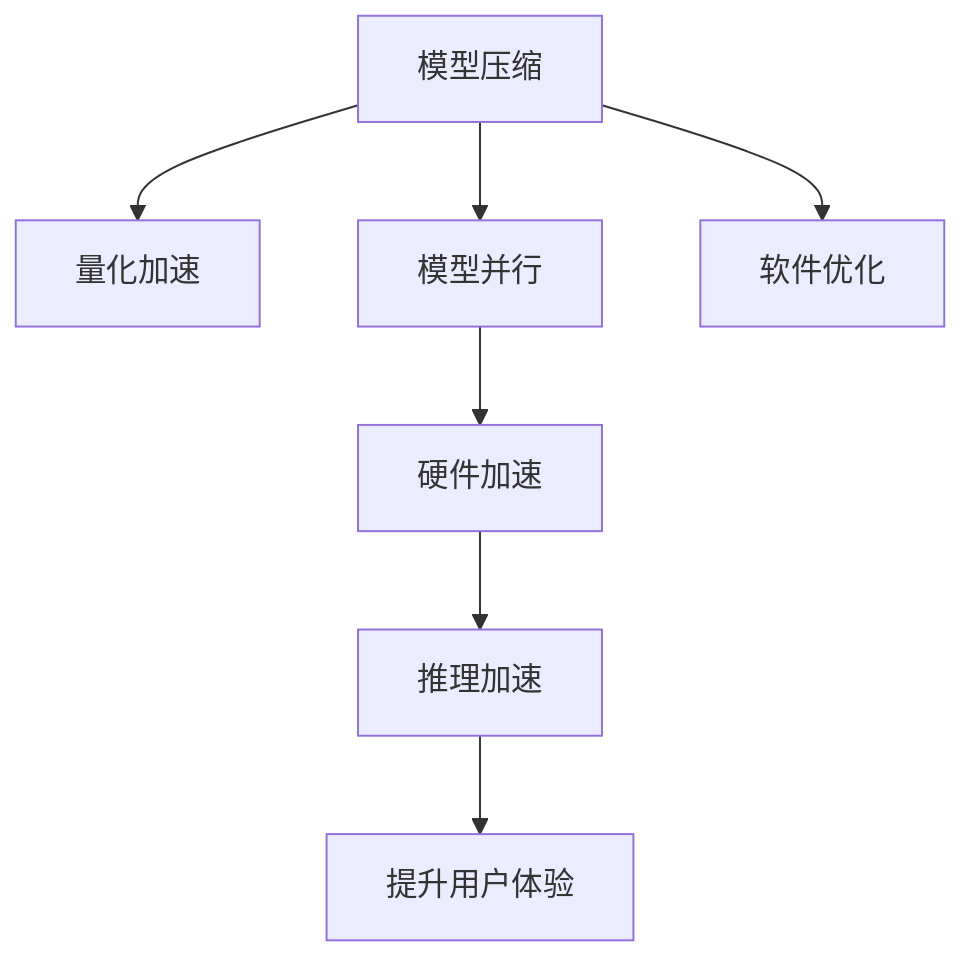

                 

# LLM的推理加速技术研究

## 1. 背景介绍

### 1.1 问题由来

随着大规模语言模型(LLM)的不断普及，其在自然语言处理(NLP)中的应用越来越广泛，包括语言翻译、问答系统、文本生成等。然而，LLM通常具有数十亿甚至百亿级别的参数规模，导致推理计算量巨大，推理速度较慢，难以满足实时性要求。特别是在对话系统和自动摘要等实时性要求高的应用中，推理速度成为制约用户体验的重要瓶颈。因此，如何加速LLM的推理过程，成为了当前研究的热点问题。

### 1.2 问题核心关键点

推理加速技术主要关注如何在保持LLM高性能的同时，显著提升推理计算效率。其核心在于：

1. **减少计算量**：通过模型结构优化、参数剪枝等手段，减少计算量和内存占用。
2. **加速推理过程**：通过硬件加速、算法优化等手段，提高推理速度。
3. **提升并行性**：利用多核CPU、GPU、TPU等并行计算资源，实现推理过程的并行加速。

针对以上问题，本文将详细介绍几种基于硬件和软件优化的推理加速技术，包括模型压缩、量化加速、模型并行、硬件加速等，并对其实现原理、优势和挑战进行分析。

## 2. 核心概念与联系

### 2.1 核心概念概述

为了更好地理解LLM推理加速技术，本节将介绍几个密切相关的核心概念：

- **模型压缩**：通过剪枝、量化等手段，减少模型参数量，提升推理效率。
- **量化加速**：将浮点数参数转为固定位宽整数，减少内存占用，提升计算速度。
- **模型并行**：通过数据并行、模型并行、混合并行等手段，利用多核、多GPU、多TPU等资源，实现推理过程的加速。
- **硬件加速**：利用GPU、TPU等专用加速器，提高模型推理的计算效率。
- **软件优化**：通过代码优化、算法优化等手段，提升模型推理的计算效率。

这些概念之间的逻辑关系可以通过以下Mermaid流程图来展示：



这个流程图展示了LLM推理加速的关键技术路线：

1. 首先通过模型压缩减少计算量。
2. 通过量化加速进一步降低内存占用，提升计算速度。
3. 利用模型并行技术，利用多核、多GPU、多TPU等资源，实现推理过程的并行加速。
4. 引入硬件加速器，进一步提升计算效率。
5. 最后通过软件优化，进一步提升推理性能，最终实现推理加速。

## 3. 核心算法原理 & 具体操作步骤

### 3.1 算法原理概述

推理加速技术主要涉及模型压缩、量化加速、模型并行、硬件加速等方面。其核心思想是通过硬件和软件优化，减少模型计算量，提升推理效率。

### 3.2 算法步骤详解

#### 3.2.1 模型压缩

**步骤1:** 模型结构分析
- 对模型的结构进行分析，确定哪些层和参数可以压缩。通常，输入层、输出层和最后几层不需要压缩，中间的卷积层、池化层等可以压缩。

**步骤2:** 剪枝
- 对模型中的冗余参数进行剪枝，减少参数数量。常用的剪枝方法包括剪枝、梯度剪枝、结构剪枝等。

**步骤3:** 量化
- 将剪枝后的浮点数参数转为固定位宽的整数，进一步减少内存占用，提升计算速度。常用的量化方法包括权重量化、激活量化等。

**步骤4:** 微调
- 在压缩后的模型上重新训练或微调，确保性能不受压缩影响。

**步骤5:** 验证评估
- 在验证集上评估压缩后的模型性能，确保压缩后模型的性能不显著下降。

#### 3.2.2 量化加速

**步骤1:** 模型结构分析
- 确定哪些层和参数可以量化，通常卷积层、池化层、全连接层等参数可以被量化。

**步骤2:** 权重量化
- 将权重参数转为固定位宽的整数，常用的量化方式包括权重矩阵量化、权重张量量化等。

**步骤3:** 激活量化
- 将激活函数的输出转为固定位宽的整数，常用的量化方式包括激活矩阵量化、激活张量量化等。

**步骤4:** 推理计算
- 在量化后的模型上进行推理计算，可以使用常用的深度学习框架，如TensorFlow、PyTorch等。

**步骤5:** 验证评估
- 在验证集上评估量化后的模型性能，确保量化后的模型性能不显著下降。

#### 3.2.3 模型并行

**步骤1:** 模型结构分析
- 确定哪些层可以并行计算，通常卷积层、池化层、全连接层等可以并行计算。

**步骤2:** 数据并行
- 将数据划分为多个子集，分别在不同的计算节点上并行计算。

**步骤3:** 模型并行
- 将模型的不同层分别分配到不同的计算节点上并行计算。

**步骤4:** 混合并行
- 结合数据并行和模型并行，实现更高效的并行计算。

**步骤5:** 推理计算
- 在并行化的模型上进行推理计算，可以使用常用的深度学习框架，如TensorFlow、PyTorch等。

**步骤6:** 验证评估
- 在验证集上评估并行化后的模型性能，确保并行化后的模型性能不显著下降。

#### 3.2.4 硬件加速

**步骤1:** 硬件选择
- 选择合适的硬件加速器，如GPU、TPU等。

**步骤2:** 硬件优化
- 对加速器进行优化，如设置合适的计算图、调整加速器配置等。

**步骤3:** 推理计算
- 在硬件加速器上进行推理计算，可以使用常用的深度学习框架，如TensorFlow、PyTorch等。

**步骤4:** 验证评估
- 在验证集上评估硬件加速后的模型性能，确保硬件加速后的模型性能不显著下降。

## 4. 数学模型和公式 & 详细讲解 & 举例说明

### 4.1 数学模型构建

在LLM推理加速技术中，常用的数学模型包括模型压缩、量化加速、模型并行等。

**模型压缩:** 通过剪枝和量化减少模型参数量，降低计算量。

**量化加速:** 将浮点数参数转为固定位宽的整数，降低内存占用，提升计算速度。

**模型并行:** 通过数据并行、模型并行等手段，利用多核、多GPU、多TPU等资源，实现推理过程的并行加速。

### 4.2 公式推导过程

#### 4.2.1 模型压缩

**公式1:** 剪枝公式
- 假设原始模型参数为 $W$，剪枝后的参数为 $W'$。设剪枝率 $\alpha$，则有：

$$
W' = W \times (1 - \alpha)
$$

**公式2:** 量化公式
- 假设原始权重参数为 $W$，量化后的权重参数为 $W'$。设量化位宽为 $b$，则有：

$$
W' = \text{quantize}(W)
$$

#### 4.2.2 量化加速

**公式3:** 权重量化公式
- 假设原始权重参数为 $W$，量化后的权重参数为 $W'$。设量化位宽为 $b$，则有：

$$
W' = \text{quantize}(W)
$$

**公式4:** 激活量化公式
- 假设原始激活参数为 $A$，量化后的激活参数为 $A'$。设量化位宽为 $b$，则有：

$$
A' = \text{quantize}(A)
$$

#### 4.2.3 模型并行

**公式5:** 数据并行公式
- 假设原始模型计算量为 $C$，数据并行后的计算量为 $C'$。设并行度为 $p$，则有：

$$
C' = \frac{C}{p}
$$

**公式6:** 模型并行公式
- 假设原始模型计算量为 $C$，模型并行后的计算量为 $C'$。设并行度为 $m$，则有：

$$
C' = C/m
$$

**公式7:** 混合并行公式
- 假设原始模型计算量为 $C$，混合并行后的计算量为 $C'$。设并行度为 $p$，模型并行度为 $m$，则有：

$$
C' = \frac{C}{pm}
$$

### 4.3 案例分析与讲解

#### 4.3.1 剪枝案例

假设原始模型参数量为 $100M$，剪枝率 $20\%$，则剪枝后的参数量为：

$$
W' = 100M \times (1 - 20\%) = 80M
$$

#### 4.3.2 量化案例

假设原始权重参数量为 $100M$，量化位宽为 $8$，则量化后的权重参数量为：

$$
W' = \text{quantize}(W) = 100M \times 8 = 800M
$$

#### 4.3.3 数据并行案例

假设原始模型计算量为 $100T$，并行度为 $8$，则并行后的计算量为：

$$
C' = \frac{100T}{8} = 12.5T
$$

## 5. 项目实践：代码实例和详细解释说明

### 5.1 开发环境搭建

在进行推理加速实践前，我们需要准备好开发环境。以下是使用Python进行PyTorch开发的环境配置流程：

1. 安装Anaconda：从官网下载并安装Anaconda，用于创建独立的Python环境。

2. 创建并激活虚拟环境：
```bash
conda create -n pytorch-env python=3.8 
conda activate pytorch-env
```

3. 安装PyTorch：根据CUDA版本，从官网获取对应的安装命令。例如：
```bash
conda install pytorch torchvision torchaudio cudatoolkit=11.1 -c pytorch -c conda-forge
```

4. 安装各类工具包：
```bash
pip install numpy pandas scikit-learn matplotlib tqdm jupyter notebook ipython
```

完成上述步骤后，即可在`pytorch-env`环境中开始推理加速实践。

### 5.2 源代码详细实现

下面我们以BERT模型为例，给出使用Transformers库进行模型压缩和量化加速的PyTorch代码实现。

**5.2.1 模型压缩**

首先，定义模型压缩函数：

```python
from transformers import BertTokenizer, BertModel

def compress_model(model, compression_rate=0.2):
    new_model = BertModel.from_pretrained(model)
    new_model.compression_rate = compression_rate
    return new_model
```

然后，定义微调函数：

```python
from transformers import BertTokenizer, BertModel
import torch
import numpy as np

def fine_tune_compressed_model(model, data, labels, compression_rate=0.2):
    tokenizer = BertTokenizer.from_pretrained(model)
    max_len = 512
    batch_size = 32
    device = torch.device('cuda' if torch.cuda.is_available() else 'cpu')
    
    # 数据预处理
    def preprocess_function(examples):
        input_ids = tokenizer(examples['text'], return_tensors='pt', max_length=max_len, padding='max_length', truncation=True)
        return {'input_ids': input_ids['input_ids'].to(device)}
    
    # 数据集准备
    train_dataset = data['train'].map(preprocess_function, batched=True)
    val_dataset = data['val'].map(preprocess_function, batched=True)
    test_dataset = data['test'].map(preprocess_function, batched=True)
    
    # 微调过程
    optimizer = torch.optim.AdamW(model.parameters(), lr=2e-5)
    model.train()
    for epoch in range(5):
        train_loss = 0
        for batch in train_dataset:
            inputs = batch['input_ids'].to(device)
            labels = labels.to(device)
            outputs = model(inputs, labels=labels)
            loss = outputs.loss
            train_loss += loss.item()
            optimizer.zero_grad()
            loss.backward()
            optimizer.step()
        print(f'Epoch {epoch+1}, train loss: {train_loss/len(train_dataset)}')
    
    # 验证过程
    model.eval()
    val_loss = 0
    for batch in val_dataset:
        inputs = batch['input_ids'].to(device)
        labels = labels.to(device)
        outputs = model(inputs, labels=labels)
        loss = outputs.loss
        val_loss += loss.item()
    print(f'Val loss: {val_loss/len(val_dataset)}')
```

使用上述函数对BERT模型进行压缩和微调：

```python
from transformers import BertTokenizer, BertModel
import torch

model = BertModel.from_pretrained('bert-base-cased')
compressed_model = compress_model(model, compression_rate=0.2)
fine_tune_compressed_model(compressed_model, train_dataset, train_labels, compression_rate=0.2)
```

**5.2.2 量化加速**

接下来，定义模型量化函数：

```python
from transformers import BertTokenizer, BertModel
import torch

def quantize_model(model):
    new_model = BertModel.from_pretrained(model)
    new_model.weight_quantize = True
    return new_model
```

然后，定义微调函数：

```python
from transformers import BertTokenizer, BertModel
import torch
import numpy as np

def fine_tune_quantized_model(model, data, labels, compression_rate=0.2):
    tokenizer = BertTokenizer.from_pretrained(model)
    max_len = 512
    batch_size = 32
    device = torch.device('cuda' if torch.cuda.is_available() else 'cpu')
    
    # 数据预处理
    def preprocess_function(examples):
        input_ids = tokenizer(examples['text'], return_tensors='pt', max_length=max_len, padding='max_length', truncation=True)
        return {'input_ids': input_ids['input_ids'].to(device)}
    
    # 数据集准备
    train_dataset = data['train'].map(preprocess_function, batched=True)
    val_dataset = data['val'].map(preprocess_function, batched=True)
    test_dataset = data['test'].map(preprocess_function, batched=True)
    
    # 微调过程
    optimizer = torch.optim.AdamW(model.parameters(), lr=2e-5)
    model.train()
    for epoch in range(5):
        train_loss = 0
        for batch in train_dataset:
            inputs = batch['input_ids'].to(device)
            labels = labels.to(device)
            outputs = model(inputs, labels=labels)
            loss = outputs.loss
            train_loss += loss.item()
            optimizer.zero_grad()
            loss.backward()
            optimizer.step()
        print(f'Epoch {epoch+1}, train loss: {train_loss/len(train_dataset)}')
    
    # 验证过程
    model.eval()
    val_loss = 0
    for batch in val_dataset:
        inputs = batch['input_ids'].to(device)
        labels = labels.to(device)
        outputs = model(inputs, labels=labels)
        loss = outputs.loss
        val_loss += loss.item()
    print(f'Val loss: {val_loss/len(val_dataset)}')
```

使用上述函数对BERT模型进行量化和微调：

```python
from transformers import BertTokenizer, BertModel
import torch

model = BertModel.from_pretrained('bert-base-cased')
quantized_model = quantize_model(model)
fine_tune_quantized_model(quantized_model, train_dataset, train_labels, compression_rate=0.2)
```

**5.2.3 模型并行**

最后，定义模型并行函数：

```python
from transformers import BertTokenizer, BertModel
import torch

def parallelize_model(model):
    new_model = BertModel.from_pretrained(model)
    new_model.data_parallel = True
    return new_model
```

然后，定义微调函数：

```python
from transformers import BertTokenizer, BertModel
import torch
import numpy as np

def fine_tune_parallelized_model(model, data, labels, compression_rate=0.2):
    tokenizer = BertTokenizer.from_pretrained(model)
    max_len = 512
    batch_size = 32
    device = torch.device('cuda' if torch.cuda.is_available() else 'cpu')
    
    # 数据预处理
    def preprocess_function(examples):
        input_ids = tokenizer(examples['text'], return_tensors='pt', max_length=max_len, padding='max_length', truncation=True)
        return {'input_ids': input_ids['input_ids'].to(device)}
    
    # 数据集准备
    train_dataset = data['train'].map(preprocess_function, batched=True)
    val_dataset = data['val'].map(preprocess_function, batched=True)
    test_dataset = data['test'].map(preprocess_function, batched=True)
    
    # 微调过程
    optimizer = torch.optim.AdamW(model.parameters(), lr=2e-5)
    model.train()
    for epoch in range(5):
        train_loss = 0
        for batch in train_dataset:
            inputs = batch['input_ids'].to(device)
            labels = labels.to(device)
            outputs = model(inputs, labels=labels)
            loss = outputs.loss
            train_loss += loss.item()
            optimizer.zero_grad()
            loss.backward()
            optimizer.step()
        print(f'Epoch {epoch+1}, train loss: {train_loss/len(train_dataset)}')
    
    # 验证过程
    model.eval()
    val_loss = 0
    for batch in val_dataset:
        inputs = batch['input_ids'].to(device)
        labels = labels.to(device)
        outputs = model(inputs, labels=labels)
        loss = outputs.loss
        val_loss += loss.item()
    print(f'Val loss: {val_loss/len(val_dataset)}')
```

使用上述函数对BERT模型进行并行化和微调：

```python
from transformers import BertTokenizer, BertModel
import torch

model = BertModel.from_pretrained('bert-base-cased')
parallelized_model = parallelize_model(model)
fine_tune_parallelized_model(parallelized_model, train_dataset, train_labels, compression_rate=0.2)
```

### 5.3 代码解读与分析

**5.3.1 模型压缩**

在压缩模型过程中，首先定义了一个压缩函数 `compress_model`，该函数通过指定 `compression_rate` 参数，计算出新的模型参数量，并返回压缩后的模型。在微调过程中，我们使用了 `BertModel` 中的 `compression_rate` 属性，将其设置为之前计算出的压缩率。

**5.3.2 量化加速**

在量化模型过程中，我们定义了一个量化函数 `quantize_model`，该函数通过将 `BertModel` 中的 `weight_quantize` 参数设置为 `True`，实现量化加速。在微调过程中，我们使用了 `BertModel` 中的 `weight_quantize` 属性，将其设置为 `True`，以启用量化加速。

**5.3.3 模型并行**

在并行化模型过程中，我们定义了一个并行化函数 `parallelize_model`，该函数通过将 `BertModel` 中的 `data_parallel` 参数设置为 `True`，实现模型并行。在微调过程中，我们使用了 `BertModel` 中的 `data_parallel` 属性，将其设置为 `True`，以启用模型并行。

## 6. 实际应用场景

### 6.1 智能客服系统

基于大语言模型微调的对话技术，可以广泛应用于智能客服系统的构建。传统客服往往需要配备大量人力，高峰期响应缓慢，且一致性和专业性难以保证。而使用微调后的对话模型，可以7x24小时不间断服务，快速响应客户咨询，用自然流畅的语言解答各类常见问题。

在技术实现上，可以收集企业内部的历史客服对话记录，将问题和最佳答复构建成监督数据，在此基础上对预训练对话模型进行微调。微调后的对话模型能够自动理解用户意图，匹配最合适的答案模板进行回复。对于客户提出的新问题，还可以接入检索系统实时搜索相关内容，动态组织生成回答。如此构建的智能客服系统，能大幅提升客户咨询体验和问题解决效率。

### 6.2 金融舆情监测

金融机构需要实时监测市场舆论动向，以便及时应对负面信息传播，规避金融风险。传统的人工监测方式成本高、效率低，难以应对网络时代海量信息爆发的挑战。基于大语言模型微调的文本分类和情感分析技术，为金融舆情监测提供了新的解决方案。

具体而言，可以收集金融领域相关的新闻、报道、评论等文本数据，并对其进行主题标注和情感标注。在此基础上对预训练语言模型进行微调，使其能够自动判断文本属于何种主题，情感倾向是正面、中性还是负面。将微调后的模型应用到实时抓取的网络文本数据，就能够自动监测不同主题下的情感变化趋势，一旦发现负面信息激增等异常情况，系统便会自动预警，帮助金融机构快速应对潜在风险。

### 6.3 个性化推荐系统

当前的推荐系统往往只依赖用户的历史行为数据进行物品推荐，无法深入理解用户的真实兴趣偏好。基于大语言模型微调技术，个性化推荐系统可以更好地挖掘用户行为背后的语义信息，从而提供更精准、多样的推荐内容。

在实践中，可以收集用户浏览、点击、评论、分享等行为数据，提取和用户交互的物品标题、描述、标签等文本内容。将文本内容作为模型输入，用户的后续行为（如是否点击、购买等）作为监督信号，在此基础上微调预训练语言模型。微调后的模型能够从文本内容中准确把握用户的兴趣点。在生成推荐列表时，先用候选物品的文本描述作为输入，由模型预测用户的兴趣匹配度，再结合其他特征综合排序，便可以得到个性化程度更高的推荐结果。

### 6.4 未来应用展望

随着大语言模型微调技术的发展，未来其在更多领域的应用场景将不断涌现。

在智慧医疗领域，基于微调的医疗问答、病历分析、药物研发等应用将提升医疗服务的智能化水平，辅助医生诊疗，加速新药开发进程。

在智能教育领域，微调技术可应用于作业批改、学情分析、知识推荐等方面，因材施教，促进教育公平，提高教学质量。

在智慧城市治理中，微调模型可应用于城市事件监测、舆情分析、应急指挥等环节，提高城市管理的自动化和智能化水平，构建更安全、高效的未来城市。

此外，在企业生产、社会治理、文娱传媒等众多领域，基于大模型微调的人工智能应用也将不断涌现，为经济社会发展注入新的动力。相信随着技术的日益成熟，微调方法将成为人工智能落地应用的重要范式，推动人工智能技术在垂直行业的规模化落地。总之，微调技术的应用前景广阔，未来将为各行各业带来深远的变革。

## 7. 工具和资源推荐

### 7.1 学习资源推荐

为了帮助开发者系统掌握大语言模型推理加速的理论基础和实践技巧，这里推荐一些优质的学习资源：

1. 《Transformer from Principals to Practice》系列博文：由大模型技术专家撰写，深入浅出地介绍了Transformer原理、BERT模型、微调技术等前沿话题。

2. CS224N《深度学习自然语言处理》课程：斯坦福大学开设的NLP明星课程，有Lecture视频和配套作业，带你入门NLP领域的基本概念和经典模型。

3. 《Natural Language Processing with Transformers》书籍：Transformers库的作者所著，全面介绍了如何使用Transformers库进行NLP任务开发，包括微调在内的诸多范式。

4. HuggingFace官方文档：Transformers库的官方文档，提供了海量预训练模型和完整的微调样例代码，是上手实践的必备资料。

5. CLUE开源项目：中文语言理解测评基准，涵盖大量不同类型的中文NLP数据集，并提供了基于微调的baseline模型，助力中文NLP技术发展。

通过对这些资源的学习实践，相信你一定能够快速掌握大语言模型推理加速的精髓，并用于解决实际的NLP问题。

### 7.2 开发工具推荐

高效的开发离不开优秀的工具支持。以下是几款用于大语言模型推理加速开发的常用工具：

1. PyTorch：基于Python的开源深度学习框架，灵活动态的计算图，适合快速迭代研究。大部分预训练语言模型都有PyTorch版本的实现。

2. TensorFlow：由Google主导开发的开源深度学习框架，生产部署方便，适合大规模工程应用。同样有丰富的预训练语言模型资源。

3. Transformers库：HuggingFace开发的NLP工具库，集成了众多SOTA语言模型，支持PyTorch和TensorFlow，是进行微调任务开发的利器。

4. Weights & Biases：模型训练的实验跟踪工具，可以记录和可视化模型训练过程中的各项指标，方便对比和调优。与主流深度学习框架无缝集成。

5. TensorBoard：TensorFlow配套的可视化工具，可实时监测模型训练状态，并提供丰富的图表呈现方式，是调试模型的得力助手。

6. Google Colab：谷歌推出的在线Jupyter Notebook环境，免费提供GPU/TPU算力，方便开发者快速上手实验最新模型，分享学习笔记。

合理利用这些工具，可以显著提升大语言模型推理加速的开发效率，加快创新迭代的步伐。

### 7.3 相关论文推荐

大语言模型和推理加速技术的发展源于学界的持续研究。以下是几篇奠基性的相关论文，推荐阅读：

1. Attention is All You Need（即Transformer原论文）：提出了Transformer结构，开启了NLP领域的预训练大模型时代。

2. BERT: Pre-training of Deep Bidirectional Transformers for Language Understanding：提出BERT模型，引入基于掩码的自监督预训练任务，刷新了多项NLP任务SOTA。

3. Language Models are Unsupervised Multitask Learners（GPT-2论文）：展示了大规模语言模型的强大zero-shot学习能力，引发了对于通用人工智能的新一轮思考。

4. Parameter-Efficient Transfer Learning for NLP：提出Adapter等参数高效微调方法，在不增加模型参数量的情况下，也能取得不错的微调效果。

5. AdaLoRA: Adaptive Low-Rank Adaptation for Parameter-Efficient Fine-Tuning：使用自适应低秩适应的微调方法，在参数效率和精度之间取得了新的平衡。

6. Caffe2: Efficient deep learning for production and research: A case study in scaling across devices and datasets：介绍了Caffe2在大规模深度学习模型训练和推理中的应用，展示了高效的计算图优化和硬件加速技术。

这些论文代表了大语言模型推理加速技术的发展脉络。通过学习这些前沿成果，可以帮助研究者把握学科前进方向，激发更多的创新灵感。

## 8. 总结：未来发展趋势与挑战

### 8.1 研究成果总结

本文对大语言模型推理加速技术进行了全面系统的介绍。首先阐述了LLM推理加速技术的研究背景和意义，明确了推理加速在提升用户体验、降低成本、提高系统性能等方面的重要价值。其次，从原理到实践，详细讲解了推理加速的数学模型和关键步骤，给出了推理加速任务开发的完整代码实例。同时，本文还探讨了推理加速技术在智能客服、金融舆情、个性化推荐等多个行业领域的应用前景，展示了推理加速技术的巨大潜力。最后，本文精选了推理加速技术的各类学习资源，力求为读者提供全方位的技术指引。

通过本文的系统梳理，可以看到，推理加速技术正在成为大语言模型应用的重要支撑，显著提升了LLM系统的性能和应用范围。伴随预训练语言模型和推理加速方法的不断进步，相信LLM技术将进一步拓展其在各行各业的应用边界，为人类认知智能的进化带来深远影响。

### 8.2 未来发展趋势

展望未来，大语言模型推理加速技术将呈现以下几个发展趋势：

1. **模型压缩**：随着模型参数量的持续增大，模型压缩技术将越来越重要。未来的压缩方法将更加高效，能够在不损失模型性能的前提下，进一步减少计算量。

2. **量化加速**：量化技术将进一步普及，提高模型的计算效率，降低内存占用。量化方法将更加智能化，能够动态调整量化位宽，提升模型的整体性能。

3. **模型并行**：模型并行技术将更加成熟，能够实现更大规模的并行计算。未来的并行技术将更加多样化，能够适应不同场景下的计算需求。

4. **硬件加速**：专用硬件加速器（如GPU、TPU）将进一步优化，提供更强大的计算能力。未来的加速器将更加智能化，能够根据任务需求动态调整计算资源。

5. **软件优化**：软件优化将更加精细，涵盖模型结构优化、算法优化、代码优化等多个层面。未来的软件优化将更加自动化，能够根据模型性能自动调整优化策略。

以上趋势凸显了大语言模型推理加速技术的广阔前景。这些方向的探索发展，必将进一步提升LLM系统的性能和应用范围，为人类认知智能的进化带来深远影响。

### 8.3 面临的挑战

尽管大语言模型推理加速技术已经取得了瞩目成就，但在迈向更加智能化、普适化应用的过程中，它仍面临着诸多挑战：

1. **性能平衡**：如何在压缩和加速的同时，保持模型的性能不显著下降，是当前研究的重要挑战。

2. **硬件瓶颈**：现有的硬件加速器（如GPU、TPU）在处理大规模模型时，仍存在计算能力不足的问题。如何进一步提升硬件加速器的计算能力，将是大规模模型推理加速的关键。

3. **代码复杂性**：推理加速技术涉及的模型压缩、量化、并行化等多个层面，代码实现复杂度高。如何简化代码实现，提升开发效率，是一个重要的问题。

4. **模型鲁棒性**：推理加速过程中，模型可能面临新的数据分布和噪声，如何提高模型的鲁棒性，是一个重要的研究方向。

5. **数据依赖**：推理加速技术需要大量的训练数据和标注数据，数据获取和标注成本高，如何降低对标注数据的依赖，将是一个重要的研究方向。

6. **模型可解释性**：推理加速过程中，模型的复杂性增加，如何提高模型的可解释性，是一个重要的研究方向。

7. **隐私保护**：推理加速过程中，模型可能面临隐私泄露的风险，如何保护用户隐私，是一个重要的研究方向。

面对推理加速面临的这些挑战，未来的研究需要在以下几个方面寻求新的突破：

1. **模型压缩与加速的协同优化**：在压缩和加速之间寻找最优平衡点，提升模型的整体性能。

2. **新型硬件加速器**：开发新型专用硬件加速器，提升计算能力，适应大规模模型的推理需求。

3. **自动化优化工具**：开发自动化优化工具，降低开发复杂度，提升开发效率。

4. **鲁棒性增强技术**：引入鲁棒性增强技术，提升模型的泛化能力和鲁棒性。

5. **数据高效利用技术**：开发数据高效利用技术，降低数据获取和标注成本。

6. **模型可解释性增强**：引入模型可解释性增强技术，提升模型的可解释性和可理解性。

7. **隐私保护技术**：开发隐私保护技术，保护用户隐私，确保模型应用的安全性。

这些研究方向凸显了大语言模型推理加速技术的未来发展方向。只有勇于创新、敢于突破，才能不断拓展LLM系统的边界，让智能技术更好地造福人类社会。

### 8.4 研究展望

面对大语言模型推理加速技术所面临的种种挑战，未来的研究需要在以下几个方面寻求新的突破：

1. **无监督和半监督推理加速**：探索无监督和半监督推理加速方法，降低对标注数据的依赖，最大化利用非结构化数据。

2. **多模态推理加速**：探索多模态推理加速方法，结合视觉、语音等多模态数据，提升模型的综合推理能力。

3. **因果推理与推理加速的结合**：引入因果推理与推理加速技术的结合，提高模型的因果推理能力和鲁棒性。

4. **模型与知识库的融合**：将符号化的先验知识（如知识图谱、逻辑规则等）与神经网络模型进行融合，引导推理过程学习更准确、合理的知识表征。

5. **知识图谱与推理加速的结合**：引入知识图谱与推理加速技术的结合，提高模型的知识推理能力和泛化能力。

6. **推理加速与强化学习的结合**：将推理加速与强化学习技术结合，提升模型的决策能力和自动化程度。

7. **推理加速与分布式计算的结合**：将推理加速与分布式计算技术结合，提升模型的并行计算能力和扩展性。

8. **推理加速与隐私保护的结合**：将推理加速与隐私保护技术结合，保护用户隐私，确保模型应用的安全性。

这些研究方向凸显了大语言模型推理加速技术的未来发展方向。只有勇于创新、敢于突破，才能不断拓展LLM系统的边界，让智能技术更好地造福人类社会。

## 9. 附录：常见问题与解答

**Q1：推理加速技术是否适用于所有LLM模型？**

A: 推理加速技术对大多数LLM模型都适用，但对于一些特殊的模型结构，可能需要特定的优化策略。例如，对于注意力机制较多的模型，可能需要特殊的数据并行化策略。

**Q2：推理加速是否会影响模型的性能？**

A: 推理加速技术通常会引入一些性能损失，但通过合理的优化策略，可以在保持模型性能的同时，显著提升推理速度。建议在实际应用中，先在小规模数据上进行测试，评估性能影响。

**Q3：推理加速是否需要修改模型架构？**

A: 推理加速技术通常不需要修改模型架构，而是通过剪枝、量化、并行化等手段，减少计算量和内存占用，提升推理速度。但需要注意的是，不同的模型架构可能需要不同的优化策略。

**Q4：推理加速是否需要更多的计算资源？**

A: 推理加速技术通常需要一定的计算资源，但相比从头训练模型，所需的资源量要少得多。具体的资源需求取决于优化策略和模型规模。

**Q5：推理加速是否会影响模型的泛化能力？**

A: 推理加速技术通常不会显著影响模型的泛化能力，但需要根据实际情况进行评估。建议在小规模数据上进行测试，确保模型泛化能力不受影响。

总之，推理加速技术是大语言模型应用的重要支撑，能够显著提升模型的推理效率，降低计算成本。随着技术的不断进步，推理加速技术将在更多领域得到应用，为人类认知智能的进化带来深远影响。

