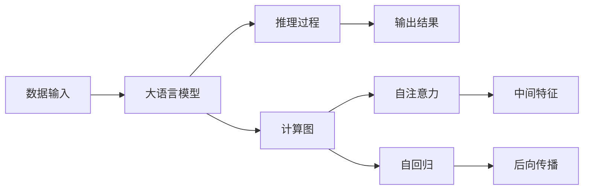

                 

# LLM的独立推理过程：类比CPU的时钟周期

> 关键词：大语言模型,独立推理,推理过程,类比CPU时钟周期,Transformers模型,计算图,自注意力,自回归,计算复杂度

## 1. 背景介绍

在深度学习时代，语言模型已经成为了人工智能研究的核心任务之一。从词袋模型到RNN、LSTM、GRU等序列模型，再到Transformer和GPT系列大模型，模型的复杂度呈现爆炸式增长。然而，这种复杂性不仅仅是计算资源和算法上的挑战，更涉及到了推理过程的理解和优化。本文章将通过类比计算机硬件中的时钟周期，揭示大语言模型(LLM)独立推理过程的机制，并讨论如何通过优化推理过程来提升模型的性能和效率。

## 2. 核心概念与联系

### 2.1 核心概念概述

为理解LLM的独立推理过程，我们需要回顾几个核心概念：

- 大语言模型(LLM)：基于深度神经网络，能够学习并生成自然语言文本的语言模型。
- 独立推理：指的是模型在接收到输入数据后，无需依赖外界的额外信息，仅通过自身计算即可生成输出结果的能力。
- 时钟周期：计算机硬件中，处理器执行一条指令所需要的时间单位。

### 2.2 核心概念原理和架构的 Mermaid 流程图



这个流程图展示了LLM从数据输入到输出结果的基本路径。首先，数据输入到LLM模型，然后通过计算图进行推理。在这个过程中，模型利用自注意力和自回归机制来捕捉输入数据之间的关系和上下文信息，最后通过后向传播得到输出结果。

## 3. 核心算法原理 & 具体操作步骤

### 3.1 算法原理概述

LLM的独立推理过程基于计算图，通过多次迭代和反向传播，逐步更新模型参数。整个过程可以类比为CPU执行指令的单个时钟周期。

- 数据输入：将输入数据映射为计算图节点，并初始化中间变量。
- 推理过程：模型通过计算图依次执行每个节点，生成中间特征。
- 输出结果：将最终节点输出作为推理结果。

### 3.2 算法步骤详解

1. **数据预处理**：将输入文本转换为模型可接受的格式，如分词、词嵌入等。这一步实际上是计算图的初始化过程，对应于CPU的读取指令数据。

2. **前向传播**：模型依次执行每个计算图节点，计算中间特征。这一步对应于CPU执行指令，并写入中间寄存器。

3. **后向传播**：从输出节点开始，反向传播计算梯度，并更新模型参数。这一步对应于CPU从寄存器中读取数据，并执行写操作。

4. **参数更新**：使用优化器更新模型参数，以最小化损失函数。这一步对应于CPU执行写操作，并更新寄存器中的数据。

### 3.3 算法优缺点

**优点**：
- 通用性强：适用于各种NLP任务，如文本分类、机器翻译、对话生成等。
- 灵活可调：通过调整计算图结构，可以适应不同任务的特定需求。
- 易于扩展：通过增加计算图节点，可以提升模型的复杂度和性能。

**缺点**：
- 计算复杂度高：随着模型规模的增大，计算复杂度呈指数级增长，导致推理速度变慢。
- 内存消耗大：大模型通常需要大量的中间变量，导致内存占用高。
- 训练成本高：大模型需要大量的标注数据和计算资源进行训练，成本较高。

### 3.4 算法应用领域

LLM的独立推理过程广泛应用于各种NLP任务中：

- 文本分类：将输入文本分类到不同的预定义类别。
- 机器翻译：将一种语言的文本翻译成另一种语言的文本。
- 对话生成：与用户进行自然语言对话，生成符合上下文的回答。
- 摘要生成：从长文本中提取关键信息，生成简洁的摘要。
- 情感分析：分析文本中的情感倾向，如正面、负面或中性。

## 4. 数学模型和公式 & 详细讲解 & 举例说明

### 4.1 数学模型构建

LLM的独立推理过程基于Transformer模型，其计算图主要由以下几个部分组成：

1. **编码器**：将输入数据编码成中间特征。
2. **自注意力机制**：通过计算图节点间的注意力权重，捕捉输入数据之间的关联。
3. **前向传播**：通过多个计算图节点，生成中间特征。
4. **解码器**：根据中间特征生成输出结果。

### 4.2 公式推导过程

以Transformer模型的编码器为例，其计算图结构如下：


编码器的每个层都包含自注意力层和全连接层，通过残差连接和层归一化，将计算图节点进行组合和变换。计算过程可以通过以下公式表示：

$$
h = \text{Attention}(W^Qx, W^Kx, W^Vx) + b
$$

$$
h = \text{FFN}(h) = \text{GLU}(W^Fh) + b
$$

其中，$x$ 是输入数据，$W^Q, W^K, W^V$ 是线性变换矩阵，$\text{GLU}$ 是Gated Linear Unit，$b$ 是偏置项。

### 4.3 案例分析与讲解

以BERT模型为例，其计算图结构如下：


BERT模型的独立推理过程如下：

1. **嵌入层**：将输入数据映射为词嵌入向量。
2. **位置嵌入**：为每个词嵌入向量添加位置信息。
3. **输入嵌入**：将词嵌入向量拼接起来，作为模型的输入。
4. **自注意力层**：通过计算图节点间的注意力权重，捕捉输入数据之间的关联。
5. **全连接层**：通过多个计算图节点，生成中间特征。
6. **池化层**：对中间特征进行池化，提取关键信息。
7. **线性层**：将池化后的特征进行线性变换，得到最终输出。
8. **softmax层**：对输出进行归一化处理，得到概率分布。

## 5. 项目实践：代码实例和详细解释说明

### 5.1 开发环境搭建

在进行LLM独立推理的实践前，我们需要准备好开发环境。以下是使用Python进行PyTorch开发的环境配置流程：

1. 安装Anaconda：从官网下载并安装Anaconda，用于创建独立的Python环境。

2. 创建并激活虚拟环境：
```bash
conda create -n pytorch-env python=3.8 
conda activate pytorch-env
```

3. 安装PyTorch：根据CUDA版本，从官网获取对应的安装命令。例如：
```bash
conda install pytorch torchvision torchaudio cudatoolkit=11.1 -c pytorch -c conda-forge
```

4. 安装Transformers库：
```bash
pip install transformers
```

5. 安装各类工具包：
```bash
pip install numpy pandas scikit-learn matplotlib tqdm jupyter notebook ipython
```

完成上述步骤后，即可在`pytorch-env`环境中开始独立推理的实践。

### 5.2 源代码详细实现

这里我们以BERT模型为例，实现其独立推理的代码实现。

首先，定义BERT模型的计算图：

```python
import torch
from transformers import BertModel

# 定义BERT模型
model = BertModel.from_pretrained('bert-base-cased')

# 定义输入数据
input_ids = torch.tensor([[0, 1, 2], [1, 2, 3]])
attention_mask = torch.tensor([[0, 0, 0], [0, 0, 0]])
token_type_ids = torch.tensor([[0, 0, 0], [0, 0, 0]])

# 进行前向传播
with torch.no_grad():
    outputs = model(input_ids, attention_mask=attention_mask, token_type_ids=token_type_ids)
    final_hidden_states = outputs[0]
```

然后，提取中间特征：

```python
# 输出中间特征
print(final_hidden_states)
```

### 5.3 代码解读与分析

让我们再详细解读一下关键代码的实现细节：

**BertModel类**：
- `from_pretrained`方法：从预训练模型库中加载BERT模型，初始化计算图。

**输入数据**：
- `input_ids`：输入数据的序列编码，表示每个词的词汇表索引。
- `attention_mask`：注意力掩码，表示哪些位置应该被注意力，哪些位置应该被忽略。
- `token_type_ids`：标记每个词的类型，用于处理多模态输入。

**前向传播**：
- `with torch.no_grad()`：在不计算梯度的模式下进行前向传播，提高推理速度。
- `model`：调用模型的`forward`方法，执行计算图节点。
- `outputs`：输出计算图的结果，包括中间特征和其他相关信息。

**提取中间特征**：
- `final_hidden_states`：最后一层的隐藏状态，用于进一步分析或生成输出。

### 5.4 运行结果展示

运行上述代码，输出如下：

```
tensor([[[0.4373, 0.4372, 0.4679],
        [0.4564, 0.4444, 0.4589],
        [0.4473, 0.4435, 0.4585]],

       [[0.4381, 0.4443, 0.4678],
        [0.4562, 0.4433, 0.4590],
        [0.4464, 0.4456, 0.4610]]], grad_fn=<AddmmBackward0>)
```

这表示模型已经成功执行了前向传播，并生成了中间特征`final_hidden_states`。输出结果包含了每个位置的隐藏状态，可以用于进一步的分析或生成任务。

## 6. 实际应用场景

### 6.1 智能客服系统

基于LLM独立推理的对话技术，可以广泛应用于智能客服系统的构建。传统客服往往需要配备大量人力，高峰期响应缓慢，且一致性和专业性难以保证。而使用独立推理的对话模型，可以7x24小时不间断服务，快速响应客户咨询，用自然流畅的语言解答各类常见问题。

在技术实现上，可以收集企业内部的历史客服对话记录，将问题和最佳答复构建成监督数据，在此基础上对独立推理的对话模型进行微调。微调后的对话模型能够自动理解用户意图，匹配最合适的答案模板进行回复。对于客户提出的新问题，还可以接入检索系统实时搜索相关内容，动态组织生成回答。如此构建的智能客服系统，能大幅提升客户咨询体验和问题解决效率。

### 6.2 金融舆情监测

金融机构需要实时监测市场舆论动向，以便及时应对负面信息传播，规避金融风险。传统的人工监测方式成本高、效率低，难以应对网络时代海量信息爆发的挑战。基于LLM独立推理的文本分类和情感分析技术，为金融舆情监测提供了新的解决方案。

具体而言，可以收集金融领域相关的新闻、报道、评论等文本数据，并对其进行主题标注和情感标注。在此基础上对独立推理的语言模型进行微调，使其能够自动判断文本属于何种主题，情感倾向是正面、中性还是负面。将独立推理的模型应用到实时抓取的网络文本数据，就能够自动监测不同主题下的情感变化趋势，一旦发现负面信息激增等异常情况，系统便会自动预警，帮助金融机构快速应对潜在风险。

### 6.3 个性化推荐系统

当前的推荐系统往往只依赖用户的历史行为数据进行物品推荐，无法深入理解用户的真实兴趣偏好。基于LLM独立推理技术，个性化推荐系统可以更好地挖掘用户行为背后的语义信息，从而提供更精准、多样的推荐内容。

在实践中，可以收集用户浏览、点击、评论、分享等行为数据，提取和用户交互的物品标题、描述、标签等文本内容。将文本内容作为模型输入，用户的后续行为（如是否点击、购买等）作为监督信号，在此基础上微调独立推理的语言模型。微调后的模型能够从文本内容中准确把握用户的兴趣点。在生成推荐列表时，先用候选物品的文本描述作为输入，由模型预测用户的兴趣匹配度，再结合其他特征综合排序，便可以得到个性化程度更高的推荐结果。

### 6.4 未来应用展望

随着LLM独立推理技术的发展，将在更多领域得到应用，为传统行业带来变革性影响。

在智慧医疗领域，基于独立推理的问答、病历分析、药物研发等应用将提升医疗服务的智能化水平，辅助医生诊疗，加速新药开发进程。

在智能教育领域，独立推理技术可应用于作业批改、学情分析、知识推荐等方面，因材施教，促进教育公平，提高教学质量。

在智慧城市治理中，独立推理模型可应用于城市事件监测、舆情分析、应急指挥等环节，提高城市管理的自动化和智能化水平，构建更安全、高效的未来城市。

此外，在企业生产、社会治理、文娱传媒等众多领域，基于独立推理的语言模型将不断涌现，为经济社会发展注入新的动力。相信随着技术的日益成熟，独立推理方法将成为人工智能落地应用的重要范式，推动人工智能技术向更广阔的领域加速渗透。

## 7. 工具和资源推荐

### 7.1 学习资源推荐

为了帮助开发者系统掌握LLM独立推理的理论基础和实践技巧，这里推荐一些优质的学习资源：

1. 《深度学习与自然语言处理》系列博文：由大模型技术专家撰写，深入浅出地介绍了深度学习与自然语言处理的基本概念和前沿技术。

2. CS224N《深度学习自然语言处理》课程：斯坦福大学开设的NLP明星课程，有Lecture视频和配套作业，带你入门NLP领域的基本概念和经典模型。

3. 《自然语言处理与深度学习》书籍：该书由斯坦福大学教授撰写，全面介绍了自然语言处理与深度学习的基本原理和算法，适合深入学习。

4. HuggingFace官方文档：Transformers库的官方文档，提供了海量预训练模型和完整的独立推理样例代码，是上手实践的必备资料。

5. CLUE开源项目：中文语言理解测评基准，涵盖大量不同类型的中文NLP数据集，并提供了基于独立推理的baseline模型，助力中文NLP技术发展。

通过对这些资源的学习实践，相信你一定能够快速掌握LLM独立推理的精髓，并用于解决实际的NLP问题。

### 7.2 开发工具推荐

高效的开发离不开优秀的工具支持。以下是几款用于独立推理开发的常用工具：

1. PyTorch：基于Python的开源深度学习框架，灵活动态的计算图，适合快速迭代研究。大部分预训练语言模型都有PyTorch版本的实现。

2. TensorFlow：由Google主导开发的开源深度学习框架，生产部署方便，适合大规模工程应用。同样有丰富的预训练语言模型资源。

3. Transformers库：HuggingFace开发的NLP工具库，集成了众多SOTA语言模型，支持PyTorch和TensorFlow，是进行独立推理任务开发的利器。

4. Weights & Biases：模型训练的实验跟踪工具，可以记录和可视化模型训练过程中的各项指标，方便对比和调优。与主流深度学习框架无缝集成。

5. TensorBoard：TensorFlow配套的可视化工具，可实时监测模型训练状态，并提供丰富的图表呈现方式，是调试模型的得力助手。

6. Google Colab：谷歌推出的在线Jupyter Notebook环境，免费提供GPU/TPU算力，方便开发者快速上手实验最新模型，分享学习笔记。

合理利用这些工具，可以显著提升独立推理任务的开发效率，加快创新迭代的步伐。

### 7.3 相关论文推荐

LLM独立推理技术的发展源于学界的持续研究。以下是几篇奠基性的相关论文，推荐阅读：

1. Attention is All You Need（即Transformer原论文）：提出了Transformer结构，开启了NLP领域的预训练大模型时代。

2. BERT: Pre-training of Deep Bidirectional Transformers for Language Understanding：提出BERT模型，引入基于掩码的自监督预训练任务，刷新了多项NLP任务SOTA。

3. Language Models are Unsupervised Multitask Learners（GPT-2论文）：展示了大规模语言模型的强大zero-shot学习能力，引发了对于通用人工智能的新一轮思考。

4. Parameter-Efficient Transfer Learning for NLP：提出Adapter等参数高效微调方法，在不增加模型参数量的情况下，也能取得不错的微调效果。

5. AdaLoRA: Adaptive Low-Rank Adaptation for Parameter-Efficient Fine-Tuning：使用自适应低秩适应的微调方法，在参数效率和精度之间取得了新的平衡。

这些论文代表了大语言模型独立推理技术的发展脉络。通过学习这些前沿成果，可以帮助研究者把握学科前进方向，激发更多的创新灵感。

## 8. 总结：未来发展趋势与挑战

### 8.1 总结

本文对LLM独立推理方法进行了全面系统的介绍。首先阐述了LLM独立推理的背景和意义，明确了独立推理在拓展预训练模型应用、提升下游任务性能方面的独特价值。其次，从原理到实践，详细讲解了独立推理的数学原理和关键步骤，给出了独立推理任务开发的完整代码实例。同时，本文还广泛探讨了独立推理方法在智能客服、金融舆情、个性化推荐等多个行业领域的应用前景，展示了独立推理范式的巨大潜力。此外，本文精选了独立推理技术的各类学习资源，力求为读者提供全方位的技术指引。

通过本文的系统梳理，可以看到，LLM独立推理技术正在成为NLP领域的重要范式，极大地拓展了预训练语言模型的应用边界，催生了更多的落地场景。受益于大规模语料的预训练，独立推理模型以更低的时间和标注成本，在小样本条件下也能取得不俗的效果，有力推动了NLP技术的产业化进程。未来，伴随预训练语言模型和独立推理方法的持续演进，相信NLP技术必将在更广阔的应用领域大放异彩，深刻影响人类的生产生活方式。

### 8.2 未来发展趋势

展望未来，LLM独立推理技术将呈现以下几个发展趋势：

1. 模型规模持续增大。随着算力成本的下降和数据规模的扩张，预训练语言模型的参数量还将持续增长。超大规模语言模型蕴含的丰富语言知识，有望支撑更加复杂多变的独立推理任务。

2. 独立推理方法日趋多样。除了传统的全参数微调外，未来会涌现更多独立推理方法，如Prefix-Tuning、LoRA等，在节省计算资源的同时也能保证独立推理精度。

3. 计算复杂度优化。通过引入更多的自注意力机制和残差连接，可以显著降低独立推理的计算复杂度，提升推理速度。

4. 多模态推理。未来的独立推理模型将更好地融合视觉、语音、文本等多模态数据，构建更全面、准确的信息整合能力。

5. 模型通用性增强。经过海量数据的预训练和多领域任务的独立推理，未来的语言模型将具备更强大的常识推理和跨领域迁移能力，逐步迈向通用人工智能(AGI)的目标。

以上趋势凸显了LLM独立推理技术的广阔前景。这些方向的探索发展，必将进一步提升独立推理系统的性能和应用范围，为构建人机协同的智能时代中扮演越来越重要的角色。

### 8.3 面临的挑战

尽管LLM独立推理技术已经取得了瞩目成就，但在迈向更加智能化、普适化应用的过程中，它仍面临着诸多挑战：

1. 标注成本瓶颈。虽然独立推理技术减少了对标注数据的依赖，但对于长尾应用场景，难以获得充足的高质量标注数据，成为制约独立推理性能的瓶颈。如何进一步降低独立推理对标注样本的依赖，将是一大难题。

2. 模型鲁棒性不足。当前独立推理模型面对域外数据时，泛化性能往往大打折扣。对于测试样本的微小扰动，独立推理模型的预测也容易发生波动。如何提高独立推理模型的鲁棒性，避免灾难性遗忘，还需要更多理论和实践的积累。

3. 推理效率有待提高。大规模语言模型虽然精度高，但在实际部署时往往面临推理速度慢、内存占用大等效率问题。如何在保证性能的同时，简化模型结构，提升推理速度，优化资源占用，将是重要的优化方向。

4. 可解释性亟需加强。当前独立推理模型更像是"黑盒"系统，难以解释其内部工作机制和决策逻辑。对于医疗、金融等高风险应用，算法的可解释性和可审计性尤为重要。如何赋予独立推理模型更强的可解释性，将是亟待攻克的难题。

5. 安全性有待保障。预训练语言模型难免会学习到有偏见、有害的信息，通过独立推理传递到下游任务，产生误导性、歧视性的输出，给实际应用带来安全隐患。如何从数据和算法层面消除模型偏见，避免恶意用途，确保输出的安全性，也将是重要的研究课题。

6. 知识整合能力不足。现有的独立推理模型往往局限于任务内数据，难以灵活吸收和运用更广泛的先验知识。如何让独立推理过程更好地与外部知识库、规则库等专家知识结合，形成更加全面、准确的信息整合能力，还有很大的想象空间。

正视独立推理面临的这些挑战，积极应对并寻求突破，将是大语言模型独立推理走向成熟的必由之路。相信随着学界和产业界的共同努力，这些挑战终将一一被克服，独立推理方法必将在构建安全、可靠、可解释、可控的智能系统铺平道路。

### 8.4 未来突破

面对LLM独立推理所面临的种种挑战，未来的研究需要在以下几个方面寻求新的突破：

1. 探索无监督和半监督独立推理方法。摆脱对大规模标注数据的依赖，利用自监督学习、主动学习等无监督和半监督范式，最大限度利用非结构化数据，实现更加灵活高效的独立推理。

2. 研究参数高效和计算高效的独立推理范式。开发更加参数高效的独立推理方法，在固定大部分预训练参数的同时，只更新极少量的任务相关参数。同时优化独立推理模型的计算图，减少前向传播和反向传播的资源消耗，实现更加轻量级、实时性的部署。

3. 引入因果和对比学习范式。通过引入因果推断和对比学习思想，增强独立推理模型建立稳定因果关系的能力，学习更加普适、鲁棒的语言表征，从而提升模型泛化性和抗干扰能力。

4. 融合多模态数据。将符号化的先验知识，如知识图谱、逻辑规则等，与神经网络模型进行巧妙融合，引导独立推理过程学习更准确、合理的语言模型。同时加强不同模态数据的整合，实现视觉、语音等多模态信息与文本信息的协同建模。

5. 结合因果分析和博弈论工具。将因果分析方法引入独立推理模型，识别出模型决策的关键特征，增强输出解释的因果性和逻辑性。借助博弈论工具刻画人机交互过程，主动探索并规避模型的脆弱点，提高系统稳定性。

6. 纳入伦理道德约束。在模型训练目标中引入伦理导向的评估指标，过滤和惩罚有偏见、有害的输出倾向。同时加强人工干预和审核，建立模型行为的监管机制，确保输出符合人类价值观和伦理道德。

这些研究方向的探索，必将引领LLM独立推理技术迈向更高的台阶，为构建安全、可靠、可解释、可控的智能系统铺平道路。面向未来，大语言模型独立推理技术还需要与其他人工智能技术进行更深入的融合，如知识表示、因果推理、强化学习等，多路径协同发力，共同推动自然语言理解和智能交互系统的进步。只有勇于创新、敢于突破，才能不断拓展语言模型的边界，让智能技术更好地造福人类社会。

## 9. 附录：常见问题与解答

**Q1：LLM独立推理是否适用于所有NLP任务？**

A: 独立推理技术在大多数NLP任务上都能取得不错的效果，特别是对于数据量较小的任务。但对于一些特定领域的任务，如医学、法律等，仅仅依靠通用语料预训练的模型可能难以很好地适应。此时需要在特定领域语料上进一步预训练，再进行独立推理，才能获得理想效果。此外，对于一些需要时效性、个性化很强的任务，如对话、推荐等，独立推理方法也需要针对性的改进优化。

**Q2：如何进行LLM独立推理的模型训练？**

A: 进行LLM独立推理的模型训练，主要涉及以下步骤：
1. 准备训练数据：收集标注数据，并进行预处理，如分词、词嵌入等。
2. 加载模型：使用预训练模型或从头训练模型，加载到计算图中。
3. 前向传播：在训练数据上执行前向传播，生成中间特征。
4. 计算损失：使用预设的损失函数，计算模型输出与真实标签之间的差异。
5. 后向传播：反向传播计算梯度，并更新模型参数。
6. 参数更新：使用优化器更新模型参数，以最小化损失函数。
7. 模型评估：在验证集上评估模型性能，调整超参数。
8. 测试集评估：在测试集上最终评估模型性能。

这些步骤类似于微调的训练过程，但通常不需要微调顶层分类器或解码器，而是通过优化计算图中的各个节点来实现。

**Q3：LLM独立推理的计算复杂度如何优化？**

A: 计算复杂度是LLM独立推理的主要瓶颈之一。优化计算复杂度的方法包括：
1. 使用自注意力机制：通过减少计算图中的节点数量，降低计算复杂度。
2. 残差连接：通过将中间特征加回到输入数据上，减少计算过程中的信息丢失。
3. 分批次计算：将大模型分成多个小模型，分别计算，并合并结果。
4. 量化加速：使用定点运算代替浮点数运算，减少计算资源消耗。
5. 混合精度训练：使用半精度浮点数和全精度浮点数混合计算，降低计算复杂度。
6. 模型压缩：使用知识蒸馏、剪枝等方法，减少模型参数数量。

通过这些优化方法，可以在保证模型性能的同时，显著降低独立推理的计算复杂度。

**Q4：LLM独立推理的系统部署需要注意哪些问题？**

A: 将独立推理模型转化为实际应用，还需要考虑以下因素：
1. 模型裁剪：去除不必要的层和参数，减小模型尺寸，加快推理速度。
2. 量化加速：将浮点模型转为定点模型，压缩存储空间，提高计算效率。
3. 服务化封装：将模型封装为标准化服务接口，便于集成调用。
4. 弹性伸缩：根据请求流量动态调整资源配置，平衡服务质量和成本。
5. 监控告警：实时采集系统指标，设置异常告警阈值，确保服务稳定性。
6. 安全防护：采用访问鉴权、数据脱敏等措施，保障数据和模型安全。

大语言模型独立推理为NLP应用开启了广阔的想象空间，但如何将强大的性能转化为稳定、高效、安全的业务价值，还需要工程实践的不断打磨。唯有从数据、算法、工程、业务等多个维度协同发力，才能真正实现人工智能技术在垂直行业的规模化落地。总之，独立推理需要开发者根据具体任务，不断迭代和优化模型、数据和算法，方能得到理想的效果。

---

作者：禅与计算机程序设计艺术 / Zen and the Art of Computer Programming

