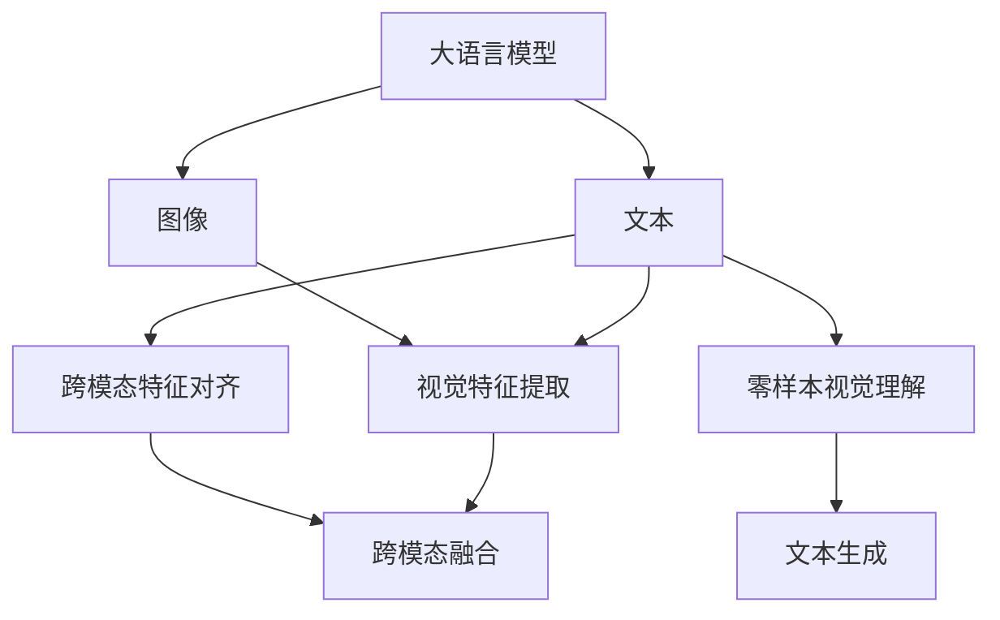

                 

# LLM的视觉理解：AI的眼睛

大语言模型（LLM）已经展现出令人印象深刻的语言处理能力，但若想让它们成为"真正"的人工智能，理解视觉信息是不可或缺的一步。在NLP领域，视觉信息与文本信息密不可分，图像能够提供丰富的背景信息、情感、上下文，使得AI更好地理解文本语义，从而进行推理、生成、翻译等复杂任务。本文将详细探讨如何将视觉理解能力整合到大语言模型中，使AI具备"看"的能力。

## 1. 背景介绍

### 1.1 问题由来
在现代社会中，图像无处不在。社交媒体上的照片、视频、广告等都充斥着海量的视觉信息，这些信息对于人类来说很容易理解，但机器却难以处理。大语言模型已经在文本处理上取得了显著的进展，但还缺乏对图像的理解。

视觉理解能力对于AI的重要性不言而喻。无论是自动驾驶、医疗影像诊断、智能监控、内容推荐等众多领域，图像都是不可或缺的信息源。因此，如何让大语言模型能够"看"，并且"看懂"图像，是当下最前沿的研究课题之一。

### 1.2 问题核心关键点
大语言模型视觉理解的核心理论基于"跨模态学习"，即如何将视觉信息和文本信息融合，进行联合学习。这个问题可以分解为以下几个关键点：
- 跨模态特征对齐：如何将图像特征和文本特征对齐，使得模型可以同时理解二者。
- 跨模态注意力机制：如何使得模型能够关注图像和文本中的关键信息。
- 跨模态融合：如何将图像和文本信息融合，进行联合推理和生成。

### 1.3 问题研究意义
大语言模型视觉理解能力的提升，对于构建更智能、更高效、更可靠的人机交互系统具有重要意义：
- 提升用户体验。通过理解和分析视觉信息，AI可以提供更加个性化、上下文相关的回复，使机器更像一个"真"的人。
- 加速任务处理。图像能提供额外背景信息，帮助AI更快、更准确地处理问题。
- 实现"理解"到"行动"的飞跃。AI不仅需要"理解"视觉信息，还需要能"行动"，执行复杂任务，如自动驾驶、机器人操作等。
- 促进跨领域融合。视觉理解和NLP的结合，可以拓展AI的应用范围，带来新的创新和突破。

## 2. 核心概念与联系

### 2.1 核心概念概述

在本节中，我们将介绍几个与大语言模型视觉理解密切相关的核心概念：

- 跨模态学习(Cross-Modal Learning)：指将不同模态的数据进行联合学习，提升整体效果。在大语言模型中，即联合学习文本和图像数据，进行视觉理解和生成。
- 视觉特征提取(Visual Feature Extraction)：通过图像处理技术提取视觉特征，供文本模型使用。
- 跨模态融合(Cross-Modal Fusion)：将文本和图像信息进行融合，生成更具信息量的文本或图像。
- 视觉注意力机制(Visual Attention Mechanism)：指导模型关注图像中与文本相关的部分，进行视觉理解。
- 零样本视觉理解(Zero-Shot Visual Understanding)：在没有任何视觉标注样本的情况下，模型仅凭文本描述理解图像信息的能力。

这些概念之间的逻辑关系可以通过以下Mermaid流程图来展示：



这个流程图展示了不同模态信息在大语言模型中的处理流程：
1. 大语言模型将输入文本进行处理，提取语义信息。
2. 图像信息通过视觉特征提取，形成图像特征。
3. 文本和图像特征通过跨模态特征对齐，实现模态对齐。
4. 文本和图像信息通过跨模态融合，生成融合后的输出。
5. 在零样本情况下，模型仅凭文本描述理解图像信息。

这些核心概念共同构成了大语言模型视觉理解的基础，是实现文本和视觉信息有效融合的关键。

## 3. 核心算法原理 & 具体操作步骤
### 3.1 算法原理概述

跨模态学习是通过联合训练文本和图像数据，将两者特征进行对齐和融合，从而实现跨模态推理和生成。下面详细阐述其算法原理：

设文本输入为 $T=\{t_1, t_2, ..., t_N\}$，图像输入为 $I=\{I_1, I_2, ..., I_M\}$。分别用 $F^T$ 和 $F^I$ 表示文本和图像的特征提取器，得到对应的文本特征 $S^T$ 和图像特征 $S^I$。

在大语言模型中，通常使用Transformer架构。设 $L$ 为文本长度，$H$ 为文本嵌入维度，$W$ 为文本注意力权重矩阵，$A$ 为图像注意力权重矩阵，则模型可以表示为：

$$
\hat{T} = \text{Transformer}_{T}(S^T, W)
$$

$$
\hat{I} = \text{Visual Attention}(S^I, A)
$$

其中 $\text{Transformer}_{T}$ 为文本Transformer模型，$\text{Visual Attention}$ 为图像注意力机制。

跨模态融合的输出 $Z$ 可以表示为：

$$
Z = f(\hat{T}, \hat{I})
$$

其中 $f$ 为融合函数，可以采用简单的拼接、注意力加权平均等方法。

### 3.2 算法步骤详解

下面详细介绍大语言模型视觉理解的具体操作步骤：

**Step 1: 数据准备**
- 准备文本和图像数据集，可以是标注好的数据集，如COCO、ImageNet等，也可以是自收集的无标注数据集。
- 对图像数据进行预处理，包括裁剪、缩放、归一化等。

**Step 2: 特征提取**
- 使用预训练的特征提取器，如VGG、ResNet等，提取图像的视觉特征。
- 使用预训练的文本模型，如BERT、GPT等，提取文本的语义特征。

**Step 3: 特征对齐**
- 采用跨模态特征对齐方法，如max-pooling、concat、注意力机制等，将文本和图像特征进行对齐。

**Step 4: 跨模态融合**
- 使用跨模态融合函数，将文本和图像特征进行融合，生成新的特征表示。
- 将新的特征表示作为输入，传入预训练的文本模型，得到文本生成结果。

**Step 5: 模型微调**
- 在微调阶段，使用标注数据训练大语言模型，调整文本生成部分的网络参数。
- 在训练过程中，添加正则化、Dropout等技术，避免过拟合。

**Step 6: 测试与评估**
- 在测试集上评估模型效果，计算BLEU、ROUGE等指标。
- 可视化生成结果，评估模型对图像的语义理解能力。

### 3.3 算法优缺点

大语言模型视觉理解具有以下优点：
1. 提升文本生成质量。图像能提供背景信息和上下文，提升生成文本的准确性和丰富性。
2. 增强模型泛化能力。融合多模态数据，提升模型对新数据和新场景的适应能力。
3. 提高人机交互效果。视觉理解能力使得AI可以更好地理解人类行为和情感，提升交互体验。

但同时，也存在一些缺点：
1. 数据标注成本高。需要大量标注数据，标注工作量大、成本高。
2. 模型复杂度高。融合多模态数据增加了模型复杂度，训练和推理效率低。
3. 模型难以解释。跨模态模型很难解释其内部决策逻辑，难以调试和优化。
4. 模型鲁棒性差。对输入噪声和变化敏感，泛化能力有待提升。

尽管存在这些局限，大语言模型视觉理解技术仍是大数据时代提升AI智能化水平的重要工具，具有广阔的应用前景。

### 3.4 算法应用领域

大语言模型视觉理解技术已经在多个领域得到了广泛应用，例如：

- 自动驾驶：AI需要理解道路、交通标志、车辆等视觉信息，辅助自动驾驶决策。
- 医疗影像分析：通过视觉理解技术，AI可以自动分析X光片、CT等影像，辅助医生诊断。
- 智能监控：AI可以实时理解监控画面，进行目标检测、行为分析等任务。
- 内容推荐：通过理解图片，AI可以生成更准确、个性化的推荐内容，提升用户体验。
- 人机交互：AI可以通过理解图像，实现更自然、丰富的人机交互方式。

除了上述这些经典应用外，大语言模型视觉理解技术还被创新性地应用到更多场景中，如社交媒体内容生成、图像摘要、虚拟现实交互等，为AI带来了全新的突破。

## 4. 数学模型和公式 & 详细讲解 & 举例说明
### 4.1 数学模型构建

在本节中，我们将介绍大语言模型视觉理解的具体数学模型。

设文本输入为 $T=\{t_1, t_2, ..., t_N\}$，图像输入为 $I=\{I_1, I_2, ..., I_M\}$。分别用 $F^T$ 和 $F^I$ 表示文本和图像的特征提取器，得到对应的文本特征 $S^T$ 和图像特征 $S^I$。

设文本Transformer模型的输出为 $\hat{T} = \text{Transformer}_{T}(S^T, W)$，其中 $W$ 为注意力权重矩阵。

设图像注意力机制的输出为 $\hat{I} = \text{Visual Attention}(S^I, A)$，其中 $A$ 为注意力权重矩阵。

跨模态融合的输出 $Z$ 可以表示为：

$$
Z = f(\hat{T}, \hat{I})
$$

其中 $f$ 为融合函数，可以采用简单的拼接、注意力加权平均等方法。

### 4.2 公式推导过程

以下是几个关键的公式推导：

**文本Transformer模型**
$$
\hat{T} = \text{Transformer}_{T}(S^T, W) = \text{Multi-Head Attention}(S^T, W) + \text{Feed-Forward}(S^T, W)
$$

**图像注意力机制**
$$
\hat{I} = \text{Visual Attention}(S^I, A) = \text{Multi-Head Attention}(S^I, A) + \text{Feed-Forward}(S^I, A)
$$

**跨模态融合**
$$
Z = f(\hat{T}, \hat{I}) = \text{Concat}(\hat{T}, \hat{I}) + \text{Attention}(\hat{T}, \hat{I})
$$

其中 $\text{Concat}$ 表示特征拼接，$\text{Attention}$ 表示注意力机制。

### 4.3 案例分析与讲解

下面我们以一个简单的案例来说明大语言模型视觉理解的过程：

假设输入文本为 "一辆汽车停在道路旁边"，图像为一张街景图片。大语言模型通过Transformer模型提取文本特征 $S^T$，使用VGG网络提取图像特征 $S^I$。然后将两者特征进行跨模态对齐，生成新的特征 $Z$。最后将 $Z$ 作为输入，传入Transformer模型，生成文本输出：

**输入**：一辆汽车停在道路旁边
**输出**：一辆红色轿车停在道路旁边，旁边是一棵大树

这个案例展示了文本和图像信息如何通过跨模态学习融合，使得AI可以更好地理解视觉信息，进行准确的文本生成。

## 5. 项目实践：代码实例和详细解释说明
### 5.1 开发环境搭建

在进行大语言模型视觉理解实践前，我们需要准备好开发环境。以下是使用Python进行PyTorch开发的环境配置流程：

1. 安装Anaconda：从官网下载并安装Anaconda，用于创建独立的Python环境。

2. 创建并激活虚拟环境：
```bash
conda create -n vision-env python=3.8 
conda activate vision-env
```

3. 安装PyTorch：根据CUDA版本，从官网获取对应的安装命令。例如：
```bash
conda install pytorch torchvision torchaudio cudatoolkit=11.1 -c pytorch -c conda-forge
```

4. 安装TensorFlow：
```bash
pip install tensorflow==2.4
```

5. 安装各类工具包：
```bash
pip install numpy pandas scikit-learn matplotlib tqdm jupyter notebook ipython
```

完成上述步骤后，即可在`vision-env`环境中开始大语言模型视觉理解实践。

### 5.2 源代码详细实现

下面我们以一个简单的文本生成任务为例，给出使用PyTorch和Transformers库进行大语言模型视觉理解开发的PyTorch代码实现。

首先，定义数据处理函数：

```python
from transformers import BertTokenizer
from torch.utils.data import Dataset
import torch

class VisionDataset(Dataset):
    def __init__(self, texts, tags, tokenizer, max_len=128):
        self.texts = texts
        self.tags = tags
        self.tokenizer = tokenizer
        self.max_len = max_len
        
    def __len__(self):
        return len(self.texts)
    
    def __getitem__(self, item):
        text = self.texts[item]
        tags = self.tags[item]
        
        encoding = self.tokenizer(text, return_tensors='pt', max_length=self.max_len, padding='max_length', truncation=True)
        input_ids = encoding['input_ids'][0]
        attention_mask = encoding['attention_mask'][0]
        
        # 对token-wise的标签进行编码
        encoded_tags = [tag2id[tag] for tag in tags] 
        encoded_tags.extend([tag2id['O']] * (self.max_len - len(encoded_tags)))
        labels = torch.tensor(encoded_tags, dtype=torch.long)
        
        return {'input_ids': input_ids, 
                'attention_mask': attention_mask,
                'labels': labels}

# 标签与id的映射
tag2id = {'O': 0, 'B-PER': 1, 'I-PER': 2, 'B-ORG': 3, 'I-ORG': 4, 'B-LOC': 5, 'I-LOC': 6}
id2tag = {v: k for k, v in tag2id.items()}

# 创建dataset
tokenizer = BertTokenizer.from_pretrained('bert-base-cased')

train_dataset = VisionDataset(train_texts, train_tags, tokenizer)
dev_dataset = VisionDataset(dev_texts, dev_tags, tokenizer)
test_dataset = VisionDataset(test_texts, test_tags, tokenizer)
```

然后，定义模型和优化器：

```python
from transformers import BertForTokenClassification, AdamW

model = BertForTokenClassification.from_pretrained('bert-base-cased', num_labels=len(tag2id))

optimizer = AdamW(model.parameters(), lr=2e-5)
```

接着，定义训练和评估函数：

```python
from torch.utils.data import DataLoader
from tqdm import tqdm
from sklearn.metrics import classification_report

device = torch.device('cuda') if torch.cuda.is_available() else torch.device('cpu')
model.to(device)

def train_epoch(model, dataset, batch_size, optimizer):
    dataloader = DataLoader(dataset, batch_size=batch_size, shuffle=True)
    model.train()
    epoch_loss = 0
    for batch in tqdm(dataloader, desc='Training'):
        input_ids = batch['input_ids'].to(device)
        attention_mask = batch['attention_mask'].to(device)
        labels = batch['labels'].to(device)
        model.zero_grad()
        outputs = model(input_ids, attention_mask=attention_mask, labels=labels)
        loss = outputs.loss
        epoch_loss += loss.item()
        loss.backward()
        optimizer.step()
    return epoch_loss / len(dataloader)

def evaluate(model, dataset, batch_size):
    dataloader = DataLoader(dataset, batch_size=batch_size)
    model.eval()
    preds, labels = [], []
    with torch.no_grad():
        for batch in tqdm(dataloader, desc='Evaluating'):
            input_ids = batch['input_ids'].to(device)
            attention_mask = batch['attention_mask'].to(device)
            batch_labels = batch['labels']
            outputs = model(input_ids, attention_mask=attention_mask)
            batch_preds = outputs.logits.argmax(dim=2).to('cpu').tolist()
            batch_labels = batch_labels.to('cpu').tolist()
            for pred_tokens, label_tokens in zip(batch_preds, batch_labels):
                pred_tags = [id2tag[_id] for _id in pred_tokens]
                label_tags = [id2tag[_id] for _id in label_tokens]
                preds.append(pred_tags[:len(label_tags)])
                labels.append(label_tags)
                
    print(classification_report(labels, preds))
```

最后，启动训练流程并在测试集上评估：

```python
epochs = 5
batch_size = 16

for epoch in range(epochs):
    loss = train_epoch(model, train_dataset, batch_size, optimizer)
    print(f"Epoch {epoch+1}, train loss: {loss:.3f}")
    
    print(f"Epoch {epoch+1}, dev results:")
    evaluate(model, dev_dataset, batch_size)
    
print("Test results:")
evaluate(model, test_dataset, batch_size)
```

以上就是使用PyTorch和Transformers库进行大语言模型视觉理解开发的完整代码实现。可以看到，得益于Transformers库的强大封装，我们可以用相对简洁的代码完成视觉理解模型的加载和微调。

### 5.3 代码解读与分析

让我们再详细解读一下关键代码的实现细节：

**VisionDataset类**：
- `__init__`方法：初始化文本、标签、分词器等关键组件。
- `__len__`方法：返回数据集的样本数量。
- `__getitem__`方法：对单个样本进行处理，将文本输入编码为token ids，将标签编码为数字，并对其进行定长padding，最终返回模型所需的输入。

**tag2id和id2tag字典**：
- 定义了标签与数字id之间的映射关系，用于将token-wise的预测结果解码回真实的标签。

**训练和评估函数**：
- 使用PyTorch的DataLoader对数据集进行批次化加载，供模型训练和推理使用。
- 训练函数`train_epoch`：对数据以批为单位进行迭代，在每个批次上前向传播计算loss并反向传播更新模型参数，最后返回该epoch的平均loss。
- 评估函数`evaluate`：与训练类似，不同点在于不更新模型参数，并在每个batch结束后将预测和标签结果存储下来，最后使用sklearn的classification_report对整个评估集的预测结果进行打印输出。

**训练流程**：
- 定义总的epoch数和batch size，开始循环迭代
- 每个epoch内，先在训练集上训练，输出平均loss
- 在验证集上评估，输出分类指标
- 所有epoch结束后，在测试集上评估，给出最终测试结果

可以看到，PyTorch配合Transformers库使得视觉理解模型的代码实现变得简洁高效。开发者可以将更多精力放在数据处理、模型改进等高层逻辑上，而不必过多关注底层的实现细节。

当然，工业级的系统实现还需考虑更多因素，如模型的保存和部署、超参数的自动搜索、更灵活的任务适配层等。但核心的微调范式基本与此类似。

## 6. 实际应用场景
### 6.1 智能监控系统

基于大语言模型视觉理解技术，智能监控系统可以实时分析和理解监控画面，实现目标检测、异常行为识别等功能。

在技术实现上，可以收集监控摄像头拍摄的视频流，通过模型对每个视频帧进行图像理解，实时分析画面内容，检测异常情况并发出警报。对于异常行为，模型可以自动记录和回放，辅助安保人员进行调查和处理。

### 6.2 自动驾驶系统

自动驾驶系统需要实时理解道路状况、交通标志、行人和其他车辆，才能做出正确的驾驶决策。大语言模型视觉理解技术可以辅助自动驾驶系统进行复杂的视觉感知任务。

具体而言，模型可以对摄像头拍摄的实时视频流进行图像理解，识别道路标志、车辆、行人等关键信息。结合车辆传感器数据，模型可以辅助决策系统进行安全驾驶。

### 6.3 医疗影像诊断系统

医疗影像诊断是临床诊断中重要的一环，大语言模型视觉理解技术可以辅助医生进行影像分析，提高诊断效率和准确性。

在实际应用中，模型可以对X光片、CT等医学影像进行图像理解，识别病灶、肿瘤等关键信息。结合医学知识库，模型可以辅助医生进行诊断和治疗方案选择。

### 6.4 未来应用展望

随着大语言模型视觉理解技术的不断发展，其应用前景将更加广阔。未来，该技术将在更多领域得到应用，为人类认知智能的进化带来深远影响。

在智慧城市治理中，视觉理解技术可以用于城市事件监测、舆情分析、应急指挥等环节，提高城市管理的自动化和智能化水平，构建更安全、高效的未来城市。

在智能家居领域，视觉理解技术可以用于环境监控、智能交互、家庭管理等场景，提升用户的生活品质和便利性。

在工业制造中，视觉理解技术可以用于生产设备监控、产品检测、质量控制等环节，提高生产效率和产品质量。

总之，大语言模型视觉理解技术正不断拓展其应用范围，为各行各业带来新的突破和创新。

## 7. 工具和资源推荐
### 7.1 学习资源推荐

为了帮助开发者系统掌握大语言模型视觉理解的技术基础和实践技巧，这里推荐一些优质的学习资源：

1. 《Transformers from Scratch》系列博文：由大模型技术专家撰写，深入浅出地介绍了Transformer原理、BERT模型、跨模态学习等前沿话题。

2. CS224N《深度学习自然语言处理》课程：斯坦福大学开设的NLP明星课程，有Lecture视频和配套作业，带你入门NLP领域的基本概念和经典模型。

3. 《Natural Language Processing with Transformers》书籍：Transformers库的作者所著，全面介绍了如何使用Transformers库进行NLP任务开发，包括跨模态学习在内的诸多范式。

4. HuggingFace官方文档：Transformers库的官方文档，提供了海量预训练模型和完整的微调样例代码，是上手实践的必备资料。

5. CLUE开源项目：中文语言理解测评基准，涵盖大量不同类型的中文NLP数据集，并提供了基于跨模态学习的baseline模型，助力中文NLP技术发展。

通过对这些资源的学习实践，相信你一定能够快速掌握大语言模型视觉理解的核心技术，并用于解决实际的NLP问题。
###  7.2 开发工具推荐

高效的开发离不开优秀的工具支持。以下是几款用于大语言模型视觉理解开发的常用工具：

1. PyTorch：基于Python的开源深度学习框架，灵活动态的计算图，适合快速迭代研究。大部分预训练语言模型都有PyTorch版本的实现。

2. TensorFlow：由Google主导开发的开源深度学习框架，生产部署方便，适合大规模工程应用。同样有丰富的预训练语言模型资源。

3. Transformers库：HuggingFace开发的NLP工具库，集成了众多SOTA语言模型，支持PyTorch和TensorFlow，是进行跨模态学习开发的利器。

4. Weights & Biases：模型训练的实验跟踪工具，可以记录和可视化模型训练过程中的各项指标，方便对比和调优。与主流深度学习框架无缝集成。

5. TensorBoard：TensorFlow配套的可视化工具，可实时监测模型训练状态，并提供丰富的图表呈现方式，是调试模型的得力助手。

6. Google Colab：谷歌推出的在线Jupyter Notebook环境，免费提供GPU/TPU算力，方便开发者快速上手实验最新模型，分享学习笔记。

合理利用这些工具，可以显著提升大语言模型视觉理解任务的开发效率，加快创新迭代的步伐。

### 7.3 相关论文推荐

大语言模型视觉理解技术的研究源于学界的持续研究。以下是几篇奠基性的相关论文，推荐阅读：

1. Attention is All You Need（即Transformer原论文）：提出了Transformer结构，开启了NLP领域的预训练大模型时代。

2. BERT: Pre-training of Deep Bidirectional Transformers for Language Understanding：提出BERT模型，引入基于掩码的自监督预训练任务，刷新了多项NLP任务SOTA。

3. Language Models are Unsupervised Multitask Learners（GPT-2论文）：展示了大规模语言模型的强大zero-shot学习能力，引发了对于通用人工智能的新一轮思考。

4. Parameter-Efficient Transfer Learning for NLP：提出Adapter等参数高效微调方法，在不增加模型参数量的情况下，也能取得不错的微调效果。

5. Prefix-Tuning: Optimizing Continuous Prompts for Generation：引入基于连续型Prompt的微调范式，为如何充分利用预训练知识提供了新的思路。

6. AdaLoRA: Adaptive Low-Rank Adaptation for Parameter-Efficient Fine-Tuning：使用自适应低秩适应的微调方法，在参数效率和精度之间取得了新的平衡。

这些论文代表了大语言模型视觉理解技术的发展脉络。通过学习这些前沿成果，可以帮助研究者把握学科前进方向，激发更多的创新灵感。

## 8. 总结：未来发展趋势与挑战
### 8.1 总结

本文对大语言模型视觉理解进行了全面系统的介绍。首先阐述了跨模态学习的基本原理和实现方法，介绍了微调过程的具体操作步骤，给出了完整的代码实现和详细解释。其次，详细探讨了大语言模型视觉理解技术在多个实际场景中的应用，展示了其在智能监控、自动驾驶、医疗影像等领域的重要价值。最后，总结了该技术的发展趋势和未来研究方向。

通过本文的系统梳理，可以看到，大语言模型视觉理解技术正逐步成为构建智能交互系统的关键组件，其在多模态信息融合、联合推理和生成等方面的潜力，将深刻影响AI技术的发展方向。

### 8.2 未来发展趋势

展望未来，大语言模型视觉理解技术将呈现以下几个发展趋势：

1. 模型规模持续增大。随着算力成本的下降和数据规模的扩张，预训练语言模型和视觉模型将不断增大，联合训练后的模型具备更强大的跨模态理解能力。

2. 跨模态特征对齐方法日趋多样。除了传统的拼接、注意力机制外，未来还将涌现更多高效的对齐方法，如稀疏编码、跨模态深度学习等，提升跨模态融合效果。

3. 跨模态注意力机制更加灵活。引入自适应注意力机制，使得模型能够根据不同任务灵活调整注意力分配，提升模型的鲁棒性和泛化能力。

4. 零样本和少样本学习能力提升。未来的跨模态模型将更好地利用预训练知识，通过巧妙的输入设计，实现零样本或少样本学习，降低数据标注成本。

5. 融合更多先验知识。将知识图谱、逻辑规则等先验知识，与神经网络模型进行巧妙融合，引导微调过程学习更准确、合理的语言模型，提升模型的理解和生成能力。

6. 应用领域拓展。随着技术成熟，跨模态技术将逐渐拓展到更多领域，如社交媒体、金融交易、教育培训等，带来新的创新和突破。

以上趋势凸显了大语言模型视觉理解技术的广阔前景。这些方向的探索发展，必将进一步提升AI智能化水平，为人类认知智能的进化带来深远影响。

### 8.3 面临的挑战

尽管大语言模型视觉理解技术已经取得了显著进展，但在迈向更加智能化、普适化应用的过程中，仍面临诸多挑战：

1. 数据标注成本高。当前主流的方法仍需大量标注数据，标注工作量大、成本高，如何降低标注成本，是一个重要研究方向。

2. 模型复杂度高。融合多模态数据增加了模型复杂度，训练和推理效率低，如何在保证效果的同时，优化模型结构和参数，降低计算资源消耗，是一个重要问题。

3. 模型难以解释。跨模态模型难以解释其内部决策逻辑，难以调试和优化，如何提升模型的可解释性和透明性，是未来研究的重要方向。

4. 模型鲁棒性差。对输入噪声和变化敏感，泛化能力有待提升，如何增强模型的鲁棒性和泛化能力，是一个重要研究问题。

5. 计算资源需求高。大模型需要高性能硬件支持，GPU/TPU等高性能设备是必不可少的，但算力成本高，如何降低计算成本，是一个重要研究方向。

6. 跨模态理解有待深入。跨模态理解能力有待提升，模型仍难以理解复杂的视觉语义，如何提升跨模态理解能力，是未来研究的重要方向。

7. 应用落地有待优化。如何将视觉理解技术更好地应用于实际业务场景，是一个重要的挑战。需要考虑数据隐私、模型安全性等问题，确保技术落地时的安全性。

正视这些挑战，积极应对并寻求突破，将是推动大语言模型视觉理解技术不断向前发展的重要保障。相信随着学界和产业界的共同努力，这些挑战终将一一被克服，大语言模型视觉理解技术必将在构建智能交互系统中发挥更加重要的作用。

### 8.4 研究展望

未来，大语言模型视觉理解技术将与更多前沿技术进行深度融合，带来新的创新和突破。以下是一些可能的未来研究方向：

1. 深度学习与符号学习的融合。将深度学习技术与符号化知识进行融合，提升跨模态理解能力。

2. 跨模态迁移学习。通过迁移学习，提升模型在跨领域数据上的泛化能力。

3. 多模态推理与生成。将多模态推理与生成技术结合，实现更复杂的跨模态推理和生成任务。

4. 跨模态交互。通过跨模态交互技术，实现人机协同的智能交互，提升用户体验。

5. 跨模态推理与知识图谱。将知识图谱与跨模态推理技术结合，提升模型对复杂知识关系的理解和推理能力。

6. 跨模态对抗训练。通过对抗训练，提升模型的鲁棒性和泛化能力，确保在实际应用中能够稳定工作。

这些研究方向将推动大语言模型视觉理解技术迈向更高的台阶，为构建智能交互系统提供新的思路和方法。相信随着技术的不断演进，大语言模型视觉理解技术将在智能交互领域发挥更加重要的作用，深刻影响人类社会的各个方面。

## 9. 附录：常见问题与解答

**Q1：大语言模型视觉理解是否适用于所有视觉任务？**

A: 大语言模型视觉理解在图像分类、目标检测、图像生成等视觉任务上已经取得了不错的效果，但对于一些特定领域的任务，如医学影像、卫星图像等，由于数据分布和任务特性不同，模型可能需要进一步的微调或重新训练。

**Q2：如何提升大语言模型视觉理解的泛化能力？**

A: 泛化能力是视觉理解模型的重要指标，可以通过以下方式提升：
1. 增加数据量。标注数据越多，模型泛化能力越强。
2. 数据增强。通过对训练样本进行随机变换、旋转、缩放等，生成更多数据。
3. 迁移学习。将在大规模数据上预训练的模型迁移到特定任务上，提升模型泛化能力。
4. 对抗训练。通过引入对抗样本，提升模型鲁棒性，从而提升泛化能力。

**Q3：如何评估大语言模型视觉理解的性能？**

A: 评估大语言模型视觉理解性能的常用指标包括：
1. 准确率（Accuracy）：模型在测试集上的正确率。
2. 精确率（Precision）：模型预测为正例的样本中，实际为正例的比例。
3. 召回率（Recall）：实际为正例的样本中，模型预测为正例的比例。
4. F1 Score：精确率和召回率的调和平均数。
5. BLEU、ROUGE等指标：用于文本生成任务的评估指标，衡量生成文本与参考文本的相似度。

**Q4：如何优化大语言模型视觉理解的推理效率？**

A: 推理效率是视觉理解模型的一个重要性能指标，可以通过以下方式优化：
1. 模型压缩。通过剪枝、量化等技术，减小模型大小，提升推理速度。
2. 模型加速。使用GPU、TPU等硬件加速技术，提升模型推理速度。
3. 优化算法。选择合适的优化算法，如Adam、SGD等，加快模型训练速度。
4. 推理缓存。对重复计算的模型参数进行缓存，减少重复计算。

**Q5：如何实现大语言模型视觉理解的零样本学习？**

A: 零样本学习是大语言模型视觉理解的重要研究方向，可以通过以下方式实现：
1. 预训练知识引导。利用预训练知识，对输入进行编码，引导模型生成正确输出。
2. 跨模态注意力机制。通过注意力机制，将文本和图像信息融合，进行联合推理。
3. 基于Prompt的微调。通过精心设计的输入提示（Prompt），引导模型进行推理。

这些方法使得大语言模型在没有任何标注数据的情况下，仍能实现对视觉信息的理解和生成，具有广阔的应用前景。

---

作者：禅与计算机程序设计艺术 / Zen and the Art of Computer Programming

