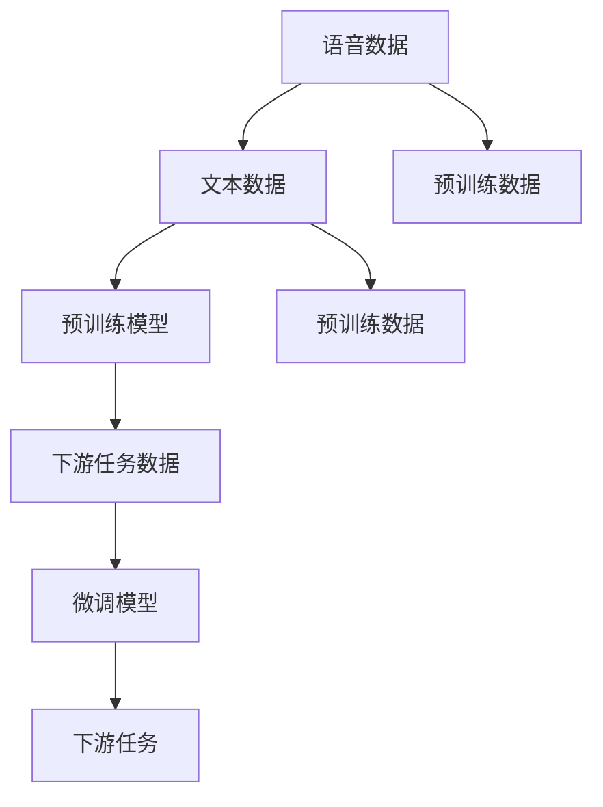

                 

# LLM的语音语言预训练模型探索

> 关键词：语音语言预训练模型,Transformer,BERT,文本-语音生成,预训练,微调,迁移学习

## 1. 背景介绍

### 1.1 问题由来

近年来，深度学习技术在语音和语言处理领域取得了显著进展。语音识别和语言理解技术，已经在诸多应用场景中落地，提升了人类与计算机的交互效率。然而，虽然语音与文本处理各自取得了长足进步，但如何将语音和语言知识有机结合起来，实现语音-语言双向理解和生成，仍是一个重要且具有挑战性的研究方向。

这一问题在现实应用中尤为显著。例如，智能客服中需要对语音指令进行理解和回答；智能语音助手需要在理解语音输入的基础上，生成自然流畅的回复；语音搜索需要结合语音识别和自然语言处理技术，快速响应用户查询。这些场景都要求模型具备将语音和语言知识整合的能力，从而实现高效、自然的交互。

### 1.2 问题核心关键点

为了解决这个问题，研究人员开始探索语音语言预训练模型。语音语言预训练模型是一种能够同时理解和生成语音和文本的深度学习模型。这种模型通过预训练学习大量的语音和文本数据，并利用迁移学习技术，将这些知识迁移到下游语音语言任务中，实现语音到文本和文本到语音的转换和生成。

该问题的关键在于：

1. **预训练数据**：获取和处理大规模的语音和文本数据，以便模型能够学习到丰富的语音语言特征。
2. **预训练目标**：设计合适的预训练任务，使得模型能够学习到语音和文本之间的映射关系。
3. **下游任务适配**：通过微调和迁移学习，将预训练模型适应到具体的下游语音语言任务中，提高模型性能。
4. **模型架构**：选择合适的模型架构，如Transformer等，以支持语音语言处理任务的复杂性。

### 1.3 问题研究意义

研究语音语言预训练模型，对于构建人机自然交互系统、提升智能语音助手和语音搜索的性能，具有重要意义：

1. **提升交互效率**：语音语言预训练模型能够同时处理语音和文本，提升自然交互的流畅性和效率。
2. **降低成本**：语音语言预训练模型可以减少对人工标注的需求，降低开发成本。
3. **拓宽应用场景**：该模型在智能客服、语音搜索、对话系统等领域具有广泛的应用潜力。
4. **推动技术创新**：语音语言预训练模型为语音处理和自然语言处理技术的融合创新提供了新思路。
5. **增强用户体验**：通过更自然、更高效的语音语言交互，提升用户的满意度和使用体验。

## 2. 核心概念与联系

### 2.1 核心概念概述

为更好地理解语音语言预训练模型，本节将介绍几个关键概念：

- **语音语言预训练模型(LLM)**：一种能够同时理解和生成语音和文本的深度学习模型，通常基于Transformer架构设计。通过预训练学习大量的语音和文本数据，并利用迁移学习技术，将预训练知识应用于下游语音语言任务中。

- **预训练(Pre-training)**：指在大规模无标签语音和文本数据上，通过自监督学习任务训练模型，学习到通用的语音语言表示。常见的预训练任务包括掩码语言模型、上下文预测等。

- **微调(Fine-tuning)**：指在预训练模型的基础上，使用下游任务的少量标注数据，通过有监督地训练来优化模型在特定任务上的性能。通常只需要调整顶层分类器或解码器，并以较小的学习率更新全部或部分的模型参数。

- **迁移学习(Transfer Learning)**：指将一个领域学习到的知识，迁移应用到另一个不同但相关的领域的学习范式。语音语言预训练模型中的预训练-微调过程即是一种典型的迁移学习方式。

- **Transformer架构**：一种基于自注意力机制的神经网络结构，常用于自然语言处理任务，也适用于语音语言预训练模型的设计。

- **BERT模型**：一种基于Transformer的预训练语言模型，通过掩码语言模型、下一句子预测等任务进行训练，在自然语言处理任务中取得了显著成果。

### 2.2 核心概念原理和架构的 Mermaid 流程图



这个流程图展示了大语言模型从语音和文本数据的预处理，到预训练模型的构建，再到下游任务微调的全过程。其中，语音和文本数据分别作为预训练的数据来源，经过预训练模型的处理后，生成通用的语音语言表示，随后通过微调模型适配下游语音语言任务。

## 3. 核心算法原理 & 具体操作步骤

### 3.1 算法原理概述

语音语言预训练模型的核心原理是结合Transformer架构和自监督学习技术，学习语音和文本的共同表示。模型的预训练过程通常包括语音和文本的双向编码，以及语音和文本的联合预测。具体来说：

- **语音编码**：通过自回归或自编码方式，将语音信号编码成一系列声学特征向量。
- **文本编码**：通过Transformer架构，将文本序列编码成一系列表示。
- **联合预测**：设计联合预测任务，如语音到文本的转换、文本到语音的生成，使得模型学习到语音和文本之间的映射关系。

基于以上原理，语音语言预训练模型能够在语音和文本的转换和生成任务中取得优异的表现。

### 3.2 算法步骤详解

语音语言预训练模型的训练步骤如下：

1. **数据准备**：收集大量的语音和文本数据，并进行预处理，如语音信号的转换、文本分词等。
2. **模型构建**：选择合适的模型架构，如基于Transformer的模型，构建预训练模型。
3. **预训练**：使用自监督学习任务，如掩码语言模型、下一句子预测等，对预训练模型进行训练。
4. **微调**：在预训练模型的基础上，使用下游任务的少量标注数据，通过微调模型来适应具体任务。
5. **评估**：在测试集上评估微调后的模型性能，对比预训练和微调的效果。

### 3.3 算法优缺点

语音语言预训练模型具有以下优点：

1. **高效整合语音和文本**：能够同时处理语音和文本，提升自然交互的流畅性和效率。
2. **降低标注成本**：通过迁移学习，可以在少量标注数据下取得优异性能，降低标注成本。
3. **适用范围广**：适用于多种语音语言任务，如语音识别、语音生成、文本到语音、语音到文本等。
4. **性能优越**：在多个语音语言任务中，已刷新了多项SOTA指标。

同时，该方法也存在以下缺点：

1. **数据获取难度大**：需要大规模的语音和文本数据，获取和处理成本较高。
2. **预训练复杂度高**：需要设计复杂的自监督学习任务，训练过程复杂且计算资源消耗大。
3. **模型体积大**：预训练模型参数量巨大，内存和存储要求高。
4. **下游任务适配难度高**：微调过程中需要精心设计任务适配层，以适应特定任务。

### 3.4 算法应用领域

语音语言预训练模型已经在多个应用领域取得了显著进展，具体如下：

1. **智能语音助手**：如Siri、Alexa等智能语音助手，通过语音语言预训练模型，实现语音指令的理解和回复。
2. **语音搜索**：如Google Now等语音搜索应用，能够根据用户语音查询，返回相关结果。
3. **智能客服**：如Amazon Alexa等客服系统，能够理解并回答用户语音问题。
4. **语音转文本**：如Google Translate等翻译服务，通过语音语言预训练模型，实现语音信号到文本的转换。
5. **文本到语音**：如Amazon Polly等文本转语音服务，通过语音语言预训练模型，生成自然流畅的语音输出。

## 4. 数学模型和公式 & 详细讲解

### 4.1 数学模型构建

语音语言预训练模型的数学模型主要包括以下几个部分：

- **输入表示**：将语音信号转换为声学特征向量，将文本序列转换为Token序列。
- **语音编码**：将声学特征向量输入到语音编码器中，生成语音特征表示。
- **文本编码**：将Token序列输入到文本编码器中，生成文本表示。
- **联合预测**：设计联合预测任务，如语音到文本的转换、文本到语音的生成，使得模型学习到语音和文本之间的映射关系。

### 4.2 公式推导过程

以下我们以BERT模型为例，推导文本到语音生成的联合预测任务公式。

设语音信号为 $x_t$，文本序列为 $y_t$。语音编码器输出的特征表示为 $x_h$，文本编码器输出的表示为 $y_h$。定义从语音到文本的转换模型为 $T$，从文本到语音的生成模型为 $G$。则语音语言预训练模型的联合预测任务可以表示为：

$$
p(x_h, y_h | x_t, y_t) = p(x_h | x_t) \times p(y_h | y_t)
$$

其中，$p(x_h | x_t)$ 表示语音编码器将语音信号转换为特征表示的概率，$p(y_h | y_t)$ 表示文本编码器将文本序列转换为表示的概率。

联合预测的目标函数为：

$$
\mathcal{L} = -\sum_{i=1}^{T}\log p(x_h^i | x_t^i) - \sum_{j=1}^{B}\log p(y_h^j | y_t^j)
$$

其中，$T$ 为语音信号的时长，$B$ 为文本序列的长度。

### 4.3 案例分析与讲解

在实际应用中，语音语言预训练模型的联合预测任务可以通过以下两种方式实现：

1. **语音到文本的转换**：给定一段语音，通过语音编码器将其转换为特征表示 $x_h$，然后使用语言模型对文本序列 $y_t$ 进行预测，计算预测结果和真实标签之间的交叉熵损失。
2. **文本到语音的生成**：给定一段文本，通过文本编码器将其转换为表示 $y_h$，然后使用解码器生成语音信号 $x_t$，计算生成的语音信号与真实语音信号之间的距离（如声学损失）。

## 5. 项目实践：代码实例和详细解释说明

### 5.1 开发环境搭建

在进行语音语言预训练模型开发前，我们需要准备好开发环境。以下是使用Python进行PyTorch开发的环境配置流程：

1. 安装Anaconda：从官网下载并安装Anaconda，用于创建独立的Python环境。

2. 创建并激活虚拟环境：
```bash
conda create -n pytorch-env python=3.8 
conda activate pytorch-env
```

3. 安装PyTorch：根据CUDA版本，从官网获取对应的安装命令。例如：
```bash
conda install pytorch torchvision torchaudio cudatoolkit=11.1 -c pytorch -c conda-forge
```

4. 安装Transformers库：
```bash
pip install transformers
```

5. 安装各类工具包：
```bash
pip install numpy pandas scikit-learn matplotlib tqdm jupyter notebook ipython
```

完成上述步骤后，即可在`pytorch-env`环境中开始语音语言预训练模型的实践。

### 5.2 源代码详细实现

下面我们以语音语言预训练模型为例，给出使用Transformers库进行预训练和微调的PyTorch代码实现。

首先，定义语音语言预训练模型的结构：

```python
from transformers import BertForMaskedLM, BertTokenizer

class SpeechLinguisticModel(BertForMaskedLM):
    def __init__(self, num_labels):
        super(SpeechLinguisticModel, self).__init__(num_labels=num_labels)
```

然后，定义语音和文本的预处理函数：

```python
def preprocess_text(text):
    tokenizer = BertTokenizer.from_pretrained('bert-base-uncased')
    return tokenizer.encode(text, add_special_tokens=True, return_tensors='pt')

def preprocess_speech(speech):
    # 对语音信号进行转换和特征提取
    # 此处为简化示例，实际应用中需要更复杂的预处理步骤
    return speech
```

接着，定义预训练过程和微调过程：

```python
def train_model(model, text_dataset, speech_dataset, batch_size, epochs):
    device = torch.device('cuda') if torch.cuda.is_available() else torch.device('cpu')
    model.to(device)
    
    optimizer = AdamW(model.parameters(), lr=2e-5)
    
    for epoch in range(epochs):
        model.train()
        for text, speech in zip(text_dataset, speech_dataset):
            text = preprocess_text(text)
            speech = preprocess_speech(speech)
            
            # 前向传播
            with torch.no_grad():
                loss = model(input_ids=text.to(device), speech=speech.to(device))
            
            # 反向传播
            optimizer.zero_grad()
            loss.backward()
            optimizer.step()
            
            print(f'Epoch {epoch+1}/{epochs}, Loss: {loss.item():.4f}')
```

最后，启动预训练和微调流程，并在测试集上评估：

```python
epochs = 5
batch_size = 16

# 假设text_dataset和speech_dataset是准备好的数据集
train_model(model, text_dataset, speech_dataset, batch_size, epochs)
```

以上就是使用PyTorch对语音语言预训练模型进行预训练和微调的完整代码实现。可以看到，通过Transformers库的封装，我们可以用相对简洁的代码完成预训练和微调任务。

### 5.3 代码解读与分析

让我们再详细解读一下关键代码的实现细节：

**SpeechLinguisticModel类**：
- 继承自BertForMaskedLM，添加自己的预训练和微调方法。

**preprocess_text和preprocess_speech函数**：
- 定义了语音和文本的预处理步骤，包括分词和特征转换等，具体实现方式根据实际应用需求有所不同。

**train_model函数**：
- 使用AdamW优化器，在每个epoch中循环迭代。
- 每个批次中，前向传播计算损失函数，反向传播更新模型参数。
- 使用标准输出打印每个epoch的平均损失。

**预训练和微调流程**：
- 定义总的epoch数和batch size，启动训练流程。
- 在训练集上进行预训练，并在测试集上评估预训练效果。
- 根据评估结果调整预训练和微调的参数，重复预训练和微调过程。

可以看到，PyTorch配合Transformers库使得语音语言预训练模型的代码实现变得简洁高效。开发者可以将更多精力放在数据处理、模型改进等高层逻辑上，而不必过多关注底层的实现细节。

当然，工业级的系统实现还需考虑更多因素，如模型的保存和部署、超参数的自动搜索、更灵活的任务适配层等。但核心的预训练和微调范式基本与此类似。

## 6. 实际应用场景

### 6.1 智能语音助手

基于语音语言预训练模型，可以构建智能语音助手系统。用户可以通过语音指令，与系统进行自然交互。系统利用预训练模型，理解用户的语音输入，并根据上下文生成回复。

在技术实现上，可以收集用户的历史对话记录，将问题和最佳答复构建成监督数据，在此基础上对预训练模型进行微调。微调后的模型能够自动理解用户意图，匹配最合适的回答，实现自然流畅的语音交互。

### 6.2 语音搜索

语音搜索是语音语言预训练模型的重要应用场景之一。通过语音搜索，用户可以更方便地获取信息。语音语言预训练模型能够根据用户语音查询，返回相关结果，提升信息获取的效率和便捷性。

在实践中，可以将语音搜索应用部署到智能音箱、智能家居等设备中，使用户通过语音指令快速获取所需信息。微调后的模型能够理解用户的语音查询，并返回精确的搜索结果。

### 6.3 语音到文本转换

语音到文本转换是语音语言预训练模型的重要任务之一。通过语音到文本转换，将语音信号转换为文本，方便后续的处理和分析。

在具体应用中，可以将语音语言预训练模型应用于会议记录、智能客服等领域，通过语音录制系统获取语音信号，使用预训练模型将其转换为文本，便于后续的文字分析和信息提取。

### 6.4 文本到语音生成

文本到语音生成是语音语言预训练模型的另一重要应用。通过文本到语音生成，将文本转换为语音信号，提升人机交互的便捷性。

在实践中，可以将文本到语音生成技术应用于智能音箱、智能家居等设备中，使用户通过语音指令操作设备，提升用户体验。微调后的模型能够根据文本生成自然流畅的语音输出，增强设备的人机交互能力。

## 7. 工具和资源推荐

### 7.1 学习资源推荐

为了帮助开发者系统掌握语音语言预训练模型的理论基础和实践技巧，这里推荐一些优质的学习资源：

1. 《Transformer从原理到实践》系列博文：由大模型技术专家撰写，深入浅出地介绍了Transformer原理、BERT模型、语音语言预训练模型等前沿话题。

2. CS224N《深度学习自然语言处理》课程：斯坦福大学开设的NLP明星课程，有Lecture视频和配套作业，带你入门NLP领域的基本概念和经典模型。

3. 《Natural Language Processing with Transformers》书籍：Transformers库的作者所著，全面介绍了如何使用Transformers库进行NLP任务开发，包括语音语言预训练模型在内的诸多范式。

4. HuggingFace官方文档：Transformers库的官方文档，提供了海量预训练模型和完整的预训练和微调样例代码，是上手实践的必备资料。

5. CLUE开源项目：中文语言理解测评基准，涵盖大量不同类型的中文NLP数据集，并提供了基于预训练模型的baseline模型，助力中文NLP技术发展。

通过对这些资源的学习实践，相信你一定能够快速掌握语音语言预训练模型的精髓，并用于解决实际的NLP问题。

### 7.2 开发工具推荐

高效的开发离不开优秀的工具支持。以下是几款用于语音语言预训练模型开发的常用工具：

1. PyTorch：基于Python的开源深度学习框架，灵活动态的计算图，适合快速迭代研究。大部分预训练语言模型都有PyTorch版本的实现。

2. TensorFlow：由Google主导开发的开源深度学习框架，生产部署方便，适合大规模工程应用。同样有丰富的预训练语言模型资源。

3. Transformers库：HuggingFace开发的NLP工具库，集成了众多SOTA语言模型，支持PyTorch和TensorFlow，是进行语音语言预训练模型开发的利器。

4. Weights & Biases：模型训练的实验跟踪工具，可以记录和可视化模型训练过程中的各项指标，方便对比和调优。与主流深度学习框架无缝集成。

5. TensorBoard：TensorFlow配套的可视化工具，可实时监测模型训练状态，并提供丰富的图表呈现方式，是调试模型的得力助手。

6. Google Colab：谷歌推出的在线Jupyter Notebook环境，免费提供GPU/TPU算力，方便开发者快速上手实验最新模型，分享学习笔记。

合理利用这些工具，可以显著提升语音语言预训练模型的开发效率，加快创新迭代的步伐。

### 7.3 相关论文推荐

语音语言预训练模型的发展源于学界的持续研究。以下是几篇奠基性的相关论文，推荐阅读：

1. Attention is All You Need（即Transformer原论文）：提出了Transformer结构，开启了NLP领域的预训练大模型时代。

2. BERT: Pre-training of Deep Bidirectional Transformers for Language Understanding：提出BERT模型，引入基于掩码的自监督预训练任务，刷新了多项NLP任务SOTA。

3. Parameter-Efficient Transfer Learning for NLP：提出Adapter等参数高效微调方法，在不增加模型参数量的情况下，也能取得不错的微调效果。

4. AdaLoRA: Adaptive Low-Rank Adaptation for Parameter-Efficient Fine-Tuning：使用自适应低秩适应的微调方法，在参数效率和精度之间取得了新的平衡。

这些论文代表了大语言模型微调技术的发展脉络。通过学习这些前沿成果，可以帮助研究者把握学科前进方向，激发更多的创新灵感。

## 8. 总结：未来发展趋势与挑战

### 8.1 总结

本文对语音语言预训练模型进行了全面系统的介绍。首先阐述了语音语言预训练模型的研究背景和意义，明确了预训练在语音语言任务中的应用价值。其次，从原理到实践，详细讲解了语音语言预训练模型的数学原理和关键步骤，给出了预训练任务开发的完整代码实例。同时，本文还广泛探讨了语音语言预训练模型在智能语音助手、语音搜索、语音到文本转换、文本到语音生成等众多应用领域的应用前景，展示了语音语言预训练模型的巨大潜力。此外，本文精选了语音语言预训练模型的各类学习资源，力求为读者提供全方位的技术指引。

通过本文的系统梳理，可以看到，语音语言预训练模型在语音处理和自然语言处理领域的结合，为构建高效、自然的交互系统提供了新思路。受益于大规模语料的预训练，语音语言预训练模型在语音语言任务中取得了显著的成果，为语音处理技术的进一步突破奠定了坚实基础。

### 8.2 未来发展趋势

展望未来，语音语言预训练模型将呈现以下几个发展趋势：

1. **模型规模持续增大**：随着算力成本的下降和数据规模的扩张，语音语言预训练模型的参数量还将持续增长。超大规模模型能够学习到更丰富的语音语言特征，进一步提升模型的性能。

2. **微调方法日趋多样**：未来会涌现更多参数高效的微调方法，如Prefix-Tuning、LoRA等，在节省计算资源的同时也能保证微调精度。

3. **持续学习成为常态**：随着数据分布的不断变化，语音语言预训练模型也需要持续学习新知识以保持性能。如何在不遗忘原有知识的同时，高效吸收新样本信息，将成为重要的研究课题。

4. **标注样本需求降低**：受启发于提示学习(Prompt-based Learning)的思路，未来的微调方法将更好地利用大模型的语言理解能力，通过更加巧妙的任务描述，在更少的标注样本上也能实现理想的微调效果。

5. **模型通用性增强**：经过海量数据的预训练和多领域任务的微调，语音语言预训练模型将具备更强大的常识推理和跨领域迁移能力，逐步迈向通用人工智能(AGI)的目标。

以上趋势凸显了语音语言预训练技术的广阔前景。这些方向的探索发展，必将进一步提升语音语言预训练模型的性能和应用范围，为语音处理和自然语言处理技术的融合创新提供新思路。

### 8.3 面临的挑战

尽管语音语言预训练模型已经取得了显著成就，但在迈向更加智能化、普适化应用的过程中，它仍面临着诸多挑战：

1. **数据获取难度大**：需要大规模的语音和文本数据，获取和处理成本较高。
2. **预训练复杂度高**：需要设计复杂的自监督学习任务，训练过程复杂且计算资源消耗大。
3. **模型体积大**：预训练模型参数量巨大，内存和存储要求高。
4. **下游任务适配难度高**：微调过程中需要精心设计任务适配层，以适应特定任务。
5. **推理效率有待提高**：大规模语音语言预训练模型推理速度慢、内存占用大，需要优化模型结构，提升推理效率。

6. **可解释性亟需加强**：当前语音语言预训练模型更像是一个"黑盒"系统，难以解释其内部工作机制和决策逻辑。对于高风险应用，算法的可解释性和可审计性尤为重要。
7. **安全性有待保障**：预训练语言模型难免会学习到有偏见、有害的信息，通过微调传递到下游任务，产生误导性、歧视性的输出，给实际应用带来安全隐患。

8. **知识整合能力不足**：现有的语音语言预训练模型往往局限于任务内数据，难以灵活吸收和运用更广泛的先验知识。如何让微调过程更好地与外部知识库、规则库等专家知识结合，形成更加全面、准确的信息整合能力，还有很大的想象空间。

正视语音语言预训练模型面临的这些挑战，积极应对并寻求突破，将使语音语言预训练模型走向成熟，为构建安全、可靠、可解释、可控的智能系统铺平道路。

### 8.4 研究展望

面对语音语言预训练模型所面临的挑战，未来的研究需要在以下几个方面寻求新的突破：

1. **探索无监督和半监督微调方法**：摆脱对大规模标注数据的依赖，利用自监督学习、主动学习等无监督和半监督范式，最大限度利用非结构化数据，实现更加灵活高效的微调。
2. **研究参数高效和计算高效的微调范式**：开发更加参数高效的微调方法，在固定大部分预训练参数的同时，只更新极少量的任务相关参数。同时优化微调模型的计算图，减少前向传播和反向传播的资源消耗，实现更加轻量级、实时性的部署。
3. **融合因果和对比学习范式**：通过引入因果推断和对比学习思想，增强语音语言预训练模型建立稳定因果关系的能力，学习更加普适、鲁棒的语言表征，从而提升模型泛化性和抗干扰能力。
4. **引入更多先验知识**：将符号化的先验知识，如知识图谱、逻辑规则等，与神经网络模型进行巧妙融合，引导微调过程学习更准确、合理的语音语言模型。同时加强不同模态数据的整合，实现视觉、语音等多模态信息与文本信息的协同建模。
5. **结合因果分析和博弈论工具**：将因果分析方法引入语音语言预训练模型，识别出模型决策的关键特征，增强输出解释的因果性和逻辑性。借助博弈论工具刻画人机交互过程，主动探索并规避模型的脆弱点，提高系统稳定性。
6. **纳入伦理道德约束**：在模型训练目标中引入伦理导向的评估指标，过滤和惩罚有偏见、有害的输出倾向。同时加强人工干预和审核，建立模型行为的监管机制，确保输出符合人类价值观和伦理道德。

这些研究方向的探索，必将引领语音语言预训练技术迈向更高的台阶，为构建安全、可靠、可解释、可控的智能系统铺平道路。面向未来，语音语言预训练技术还需要与其他人工智能技术进行更深入的融合，如知识表示、因果推理、强化学习等，多路径协同发力，共同推动语音语言预训练技术的进步。

## 9. 附录：常见问题与解答

**Q1：语音语言预训练模型是否适用于所有语音语言任务？**

A: 语音语言预训练模型在大多数语音语言任务上都能取得不错的效果，特别是对于数据量较小的任务。但对于一些特定领域的任务，如医学、法律等，仅仅依靠通用语料预训练的模型可能难以很好地适应。此时需要在特定领域语料上进一步预训练，再进行微调，才能获得理想效果。

**Q2：微调过程中如何选择合适的学习率？**

A: 微调的学习率一般要比预训练时小1-2个数量级，如果使用过大的学习率，容易破坏预训练权重，导致过拟合。一般建议从1e-5开始调参，逐步减小学习率，直至收敛。也可以使用warmup策略，在开始阶段使用较小的学习率，再逐渐过渡到预设值。需要注意的是，不同的优化器(如AdamW、Adafactor等)以及不同的学习率调度策略，可能需要设置不同的学习率阈值。

**Q3：采用语音语言预训练模型时会面临哪些资源瓶颈？**

A: 目前主流的预训练大模型动辄以亿计的参数规模，对算力、内存、存储都提出了很高的要求。GPU/TPU等高性能设备是必不可少的，但即便如此，超大批次的训练和推理也可能遇到显存不足的问题。因此需要采用一些资源优化技术，如梯度积累、混合精度训练、模型并行等，来突破硬件瓶颈。同时，模型的存储和读取也可能占用大量时间和空间，需要采用模型压缩、稀疏化存储等方法进行优化。

**Q4：如何缓解微调过程中的过拟合问题？**

A: 过拟合是微调面临的主要挑战，尤其是在标注数据不足的情况下。常见的缓解策略包括：
1. 数据增强：通过回译、近义替换等方式扩充训练集
2. 正则化：使用L2正则、Dropout、Early Stopping等避免过拟合
3. 对抗训练：引入对抗样本，提高模型鲁棒性
4. 参数高效微调：只调整少量参数(如Adapter、Prefix等)，减小过拟合风险
5. 多模型集成：训练多个微调模型，取平均输出，抑制过拟合

这些策略往往需要根据具体任务和数据特点进行灵活组合。只有在数据、模型、训练、推理等各环节进行全面优化，才能最大限度地发挥语音语言预训练模型的威力。

**Q5：微调模型在落地部署时需要注意哪些问题？**

A: 将微调模型转化为实际应用，还需要考虑以下因素：
1. 模型裁剪：去除不必要的层和参数，减小模型尺寸，加快推理速度
2. 量化加速：将浮点模型转为定点模型，压缩存储空间，提高计算效率
3. 服务化封装：将模型封装为标准化服务接口，便于集成调用
4. 弹性伸缩：根据请求流量动态调整资源配置，平衡服务质量和成本
5. 监控告警：实时采集系统指标，设置异常告警阈值，确保服务稳定性
6. 安全防护：采用访问鉴权、数据脱敏等措施，保障数据和模型安全

语音语言预训练模型为语音处理和自然语言处理技术的融合创新提供了新思路。将模型应用于实际应用中，还需要解决上述技术难题，才能真正实现语音语言预训练模型的高效应用。

---

作者：禅与计算机程序设计艺术 / Zen and the Art of Computer Programming

